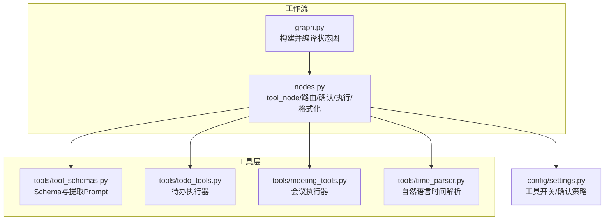
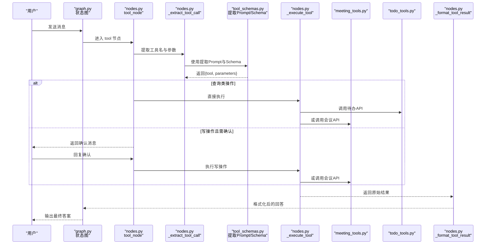
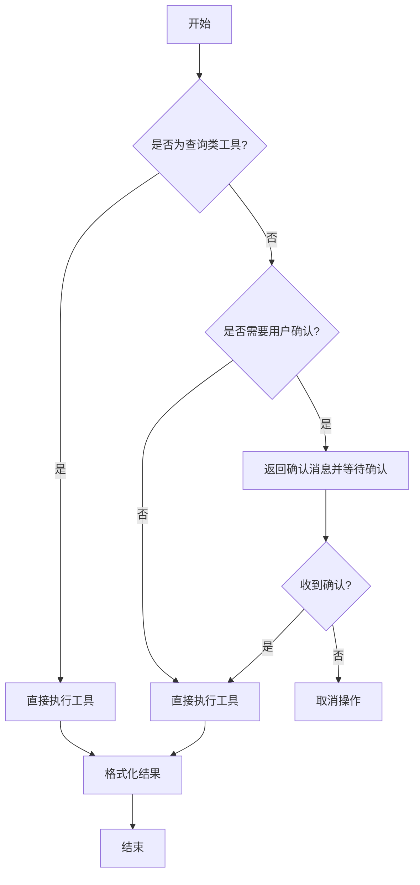
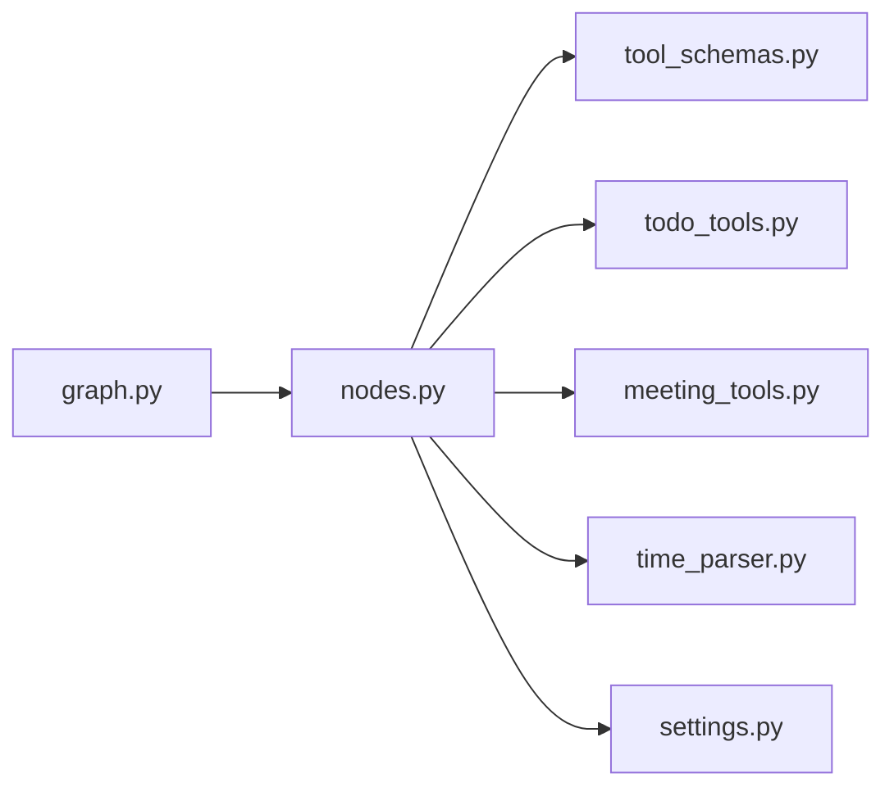

# 工具定义与注册

<cite>
**本文引用的文件**
- [agent/nodes.py](file://agent/nodes.py)
- [agent/graph.py](file://agent/graph.py)
- [agent/tools/tool_schemas.py](file://agent/tools/tool_schemas.py)
- [agent/tools/todo_tools.py](file://agent/tools/todo_tools.py)
- [agent/tools/meeting_tools.py](file://agent/tools/meeting_tools.py)
- [agent/tools/time_parser.py](file://agent/tools/time_parser.py)
- [config/settings.py](file://config/settings.py)
</cite>

## 目录
1. [简介](#简介)
2. [项目结构](#项目结构)
3. [核心组件](#核心组件)
4. [架构总览](#架构总览)
5. [详细组件分析](#详细组件分析)
6. [依赖关系分析](#依赖关系分析)
7. [性能考虑](#性能考虑)
8. [故障排查指南](#故障排查指南)
9. [结论](#结论)
10. [附录：自定义工具开发指南与最佳实践](#附录自定义工具开发指南与最佳实践)

## 简介
本文件面向“工具定义与注册机制”的完整实现说明，覆盖以下要点：
- 工具 Schema 的定义规范与参数约束
- 参数提取、验证与返回格式标准
- 工具注册与执行流程（路由、确认、执行、格式化）
- 自定义工具开发指南、Schema 设计模式、类型安全保证与最佳实践

该机制通过 LLM 从自然语言中抽取工具名与参数，结合读/写操作分类与用户确认策略，调用钉钉待办与会议能力，并将结果统一格式化后返回。

## 项目结构
围绕工具能力的代码主要分布在以下模块：
- agent/tools：工具 Schema、执行器与时间解析
- agent/nodes.py：工作流节点，包含工具调用入口、参数提取、执行分发与结果格式化
- agent/graph.py：LangGraph 状态图编排，将 tool 节点接入整体工作流
- config/settings.py：全局配置，控制工具开关与确认策略

图表来源
- [agent/graph.py:44-102](file://agent/graph.py#L44-L102)
- [agent/nodes.py:647-779](file://agent/nodes.py#L647-L779)
- [agent/tools/tool_schemas.py:1-121](file://agent/tools/tool_schemas.py#L1-L121)
- [agent/tools/todo_tools.py:1-84](file://agent/tools/todo_tools.py#L1-L84)
- [agent/tools/meeting_tools.py:1-225](file://agent/tools/meeting_tools.py#L1-L225)
- [agent/tools/time_parser.py:1-120](file://agent/tools/time_parser.py#L1-L120)
- [config/settings.py:151-156](file://config/settings.py#L151-L156)

章节来源
- [agent/graph.py:44-102](file://agent/graph.py#L44-L102)
- [agent/nodes.py:647-779](file://agent/nodes.py#L647-L779)
- [agent/tools/tool_schemas.py:1-121](file://agent/tools/tool_schemas.py#L1-L121)
- [config/settings.py:151-156](file://config/settings.py#L151-L156)

## 核心组件
- 工具 Schema 与提取提示词：集中定义可用工具、参数结构与约束，并提供用于 LLM 的参数提取 Prompt。
- 工具执行器：按领域划分（待办、会议），封装对底层 API 的调用、参数转换与结果格式化。
- 工具调用节点：负责参数提取、读/写分流、用户确认、执行分发与结果格式化。
- 时间解析：将中文自然语言时间转换为 ISO 8601，供工具使用。
- 配置开关：控制是否启用工具调用、是否需要写操作确认等。

章节来源
- [agent/tools/tool_schemas.py:1-121](file://agent/tools/tool_schemas.py#L1-L121)
- [agent/tools/todo_tools.py:1-84](file://agent/tools/todo_tools.py#L1-L84)
- [agent/tools/meeting_tools.py:1-225](file://agent/tools/meeting_tools.py#L1-L225)
- [agent/tools/time_parser.py:1-120](file://agent/tools/time_parser.py#L1-L120)
- [config/settings.py:151-156](file://config/settings.py#L151-L156)

## 架构总览
下图展示了从用户输入到工具调用的端到端流程，包括路由、参数提取、确认、执行与结果格式化。

图表来源
- [agent/graph.py:44-102](file://agent/graph.py#L44-L102)
- [agent/nodes.py:647-779](file://agent/nodes.py#L647-L779)
- [agent/tools/tool_schemas.py:1-121](file://agent/tools/tool_schemas.py#L1-L121)
- [agent/tools/todo_tools.py:1-84](file://agent/tools/todo_tools.py#L1-L84)
- [agent/tools/meeting_tools.py:1-225](file://agent/tools/meeting_tools.py#L1-L225)

## 详细组件分析

### 工具 Schema 定义规范
- 工具清单与描述：在 Schema 列表中为每个工具提供 name 与 description，便于 LLM 理解意图。
- 参数结构：采用 JSON Schema 风格对象，声明 properties、required、type、enum、default 等约束。
- 时间格式：统一要求 ISO 8601 字符串；可选通过 time_parser 将自然语言转为 ISO 8601。
- 读/写分类：通过集合常量区分读操作（无需确认）与写操作（需要确认）。

章节来源
- [agent/tools/tool_schemas.py:29-121](file://agent/tools/tool_schemas.py#L29-L121)
- [agent/tools/time_parser.py:11-63](file://agent/tools/time_parser.py#L11-L63)

### 参数提取与验证规则
- 提取方式：通过路由小模型 + 专用提取 Prompt 从用户输入中抽取 {tool, parameters}。
- 校验策略：
  - 基于 Schema 的 required 字段进行必填校验（由 LLM 遵循 Schema 约束完成）。
  - 枚举值限制（如 status 的 all/pending/done）。
  - 时间字段以 ISO 8601 为准，缺失时可按默认逻辑补全（例如会议时长默认加一小时）。
- 失败降级：若无法识别工具或提取失败，返回 none 并降级为普通回答。

章节来源
- [agent/nodes.py:693-709](file://agent/nodes.py#L693-L709)
- [agent/tools/tool_schemas.py:7-26](file://agent/tools/tool_schemas.py#L7-L26)
- [agent/tools/meeting_tools.py:33-47](file://agent/tools/meeting_tools.py#L33-L47)

### 返回格式标准
- 工具执行器统一返回 dict，包含 errcode、errmsg 以及业务字段（如 todo_id、schedule_id、schedules 等）。
- 结果格式化：
  - 错误：errcode != 0 时返回“操作失败: ...”。
  - 成功：按工具类别生成可读文本（列表、摘要、ID 展示等）。
- 确认消息：写操作在未开启自动执行时，返回结构化确认信息，等待用户确认。

章节来源
- [agent/tools/todo_tools.py:47-84](file://agent/tools/todo_tools.py#L47-L84)
- [agent/tools/meeting_tools.py:131-183](file://agent/tools/meeting_tools.py#L131-L183)
- [agent/nodes.py:749-779](file://agent/nodes.py#L749-L779)

### 工具注册与执行流程
- 注册位置：工具执行函数在 nodes.py 的 _execute_tool 中以 if/elif 分支形式“注册”，按工具名分发到具体执行器。
- 执行路径：
  - 查询类：直接执行并返回结果。
  - 写操作：根据配置决定是否先请求用户确认，确认后执行。
- 结果回传：统一经 _format_tool_result 格式化后写入 answer，并附带 tool_name、tool_params、tool_result 以便上层处理。

图表来源
- [agent/nodes.py:647-779](file://agent/nodes.py#L647-L779)
- [config/settings.py:151-156](file://config/settings.py#L151-L156)

章节来源
- [agent/nodes.py:647-779](file://agent/nodes.py#L647-L779)
- [config/settings.py:151-156](file://config/settings.py#L151-L156)

### 时间解析与参会人解析
- 时间解析：支持“今天/明天/本周/下周/本月”等范围表达，以及“下午3点/10点半”等时间片段，统一输出 ISO 8601。
- 参会人解析：支持手机号与姓名两种输入，优先通过通讯录接口解析为钉钉用户 ID，失败则保留原值交由下游处理。

章节来源
- [agent/tools/time_parser.py:11-120](file://agent/tools/time_parser.py#L11-L120)
- [agent/tools/meeting_tools.py:185-225](file://agent/tools/meeting_tools.py#L185-L225)

## 依赖关系分析
- 工作流编排：graph.py 将 tool 节点接入 LangGraph 状态图，并在条件边中将 tool 分支直接导向 END，避免多余生成步骤。
- 节点职责：nodes.py 中的 tool_node 承担参数提取、确认、执行与格式化；_execute_tool 作为工具注册中心。
- 工具实现：todo_tools.py 与 meeting_tools.py 分别封装各自领域的执行与格式化逻辑。
- 配置驱动：settings.py 暴露 tool_calling_enabled 与 tool_confirmation_required 控制工具行为。

图表来源
- [agent/graph.py:44-102](file://agent/graph.py#L44-L102)
- [agent/nodes.py:647-779](file://agent/nodes.py#L647-L779)
- [agent/tools/tool_schemas.py:1-121](file://agent/tools/tool_schemas.py#L1-L121)
- [agent/tools/todo_tools.py:1-84](file://agent/tools/todo_tools.py#L1-L84)
- [agent/tools/meeting_tools.py:1-225](file://agent/tools/meeting_tools.py#L1-L225)
- [agent/tools/time_parser.py:1-120](file://agent/tools/time_parser.py#L1-L120)
- [config/settings.py:151-156](file://config/settings.py#L151-L156)

章节来源
- [agent/graph.py:44-102](file://agent/graph.py#L44-L102)
- [agent/nodes.py:647-779](file://agent/nodes.py#L647-L779)
- [config/settings.py:151-156](file://config/settings.py#L151-L156)

## 性能考虑
- 路由短路：工具关键词命中时优先走 tool 分支，减少不必要的 LLM 调用。
- 轻量模型：参数提取与路由使用路由小模型，降低延迟与成本。
- 默认时长优化：会议未指定结束时间时自动补全，减少二次交互。
- 批量查询：查询类工具直接返回结果，不经过生成节点，提升响应速度。

[本节为通用指导，不直接分析具体文件]

## 故障排查指南
- 工具未识别：检查提取 Prompt 与 Schema 是否匹配；查看 _extract_tool_call 的异常日志。
- 参数缺失：核对 Schema 的 required 字段；确保时间字段为 ISO 8601。
- 写操作未执行：确认 tool_confirmation_required 配置；检查用户是否回复了确认。
- API 调用失败：查看执行器的 errcode 与 errmsg；确认 dingtalk_lib 可导入与网络可达。
- 参会人解析失败：检查手机号格式与姓名搜索接口返回；失败会保留原值，需关注下游兼容性。

章节来源
- [agent/nodes.py:693-709](file://agent/nodes.py#L693-L709)
- [agent/nodes.py:712-746](file://agent/nodes.py#L712-L746)
- [agent/tools/meeting_tools.py:185-225](file://agent/tools/meeting_tools.py#L185-L225)
- [config/settings.py:151-156](file://config/settings.py#L151-L156)

## 结论
该工具体系通过清晰的 Schema 定义、稳定的参数提取与统一的执行/格式化流程，实现了待办与会议能力的可靠集成。借助配置开关与确认机制，系统在易用性与安全性之间取得平衡。扩展新工具时，只需遵循现有模式即可快速接入。

[本节为总结性内容，不直接分析具体文件]

## 附录：自定义工具开发指南与最佳实践

### 新增工具的步骤
1. 定义 Schema：在工具 Schema 文件中添加新工具的 name、description 与 parameters（含 type、properties、required、enum 等）。
2. 编写执行器：在对应领域模块中添加 execute_xxx(params, user_id) -> dict，实现参数转换与 API 调用。
3. 注册执行器：在 nodes.py 的 _execute_tool 中添加分支，将工具名映射到执行函数。
4. 格式化结果：在 _format_tool_result 中添加对新工具的格式化逻辑，或复用已有格式化函数。
5. 确认策略：如需写操作确认，保持与现有写操作一致的行为；必要时在确认消息中补充必要信息。
6. 测试验证：覆盖正常路径、边界参数、错误返回与确认流程。

章节来源
- [agent/tools/tool_schemas.py:29-121](file://agent/tools/tool_schemas.py#L29-L121)
- [agent/nodes.py:712-779](file://agent/nodes.py#L712-L779)

### Schema 设计模式
- 明确必填与可选：使用 required 标注必填字段，其余为可选。
- 类型与约束：使用 type、enum、default 等约束参数类型与取值范围。
- 时间字段：统一使用 ISO 8601 字符串；可在工具内部结合 time_parser 做自然语言转义。
- 嵌套结构：复杂参数可使用嵌套 object（如 updates 子对象），保持扁平化与可读性。

章节来源
- [agent/tools/tool_schemas.py:29-121](file://agent/tools/tool_schemas.py#L29-L121)
- [agent/tools/time_parser.py:11-63](file://agent/tools/time_parser.py#L11-L63)

### 类型安全保证
- 通过 Schema 约束 LLM 输出结构，降低非法参数风险。
- 执行器内部对关键参数进行默认值填充与容错处理（如时间补全、空列表处理）。
- 统一返回格式（errcode、errmsg）便于上层统一错误处理。

章节来源
- [agent/tools/meeting_tools.py:33-47](file://agent/tools/meeting_tools.py#L33-L47)
- [agent/nodes.py:749-764](file://agent/nodes.py#L749-L764)

### 最佳实践建议
- 工具命名清晰：动词+名词（如 create_meeting、query_todos），便于 LLM 识别。
- 参数最小化：仅暴露必要参数，复杂场景通过嵌套对象组织。
- 错误友好：对外返回人类可读的错误信息，避免泄露内部细节。
- 确认机制：写操作默认开启确认，保障数据安全。
- 可观测性：在执行与格式化处记录关键日志，便于问题定位。

[本节为通用指导，不直接分析具体文件]