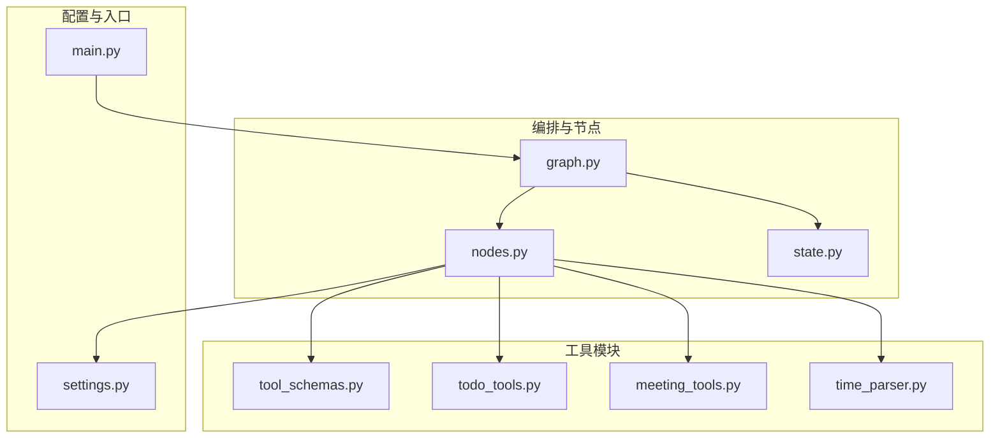
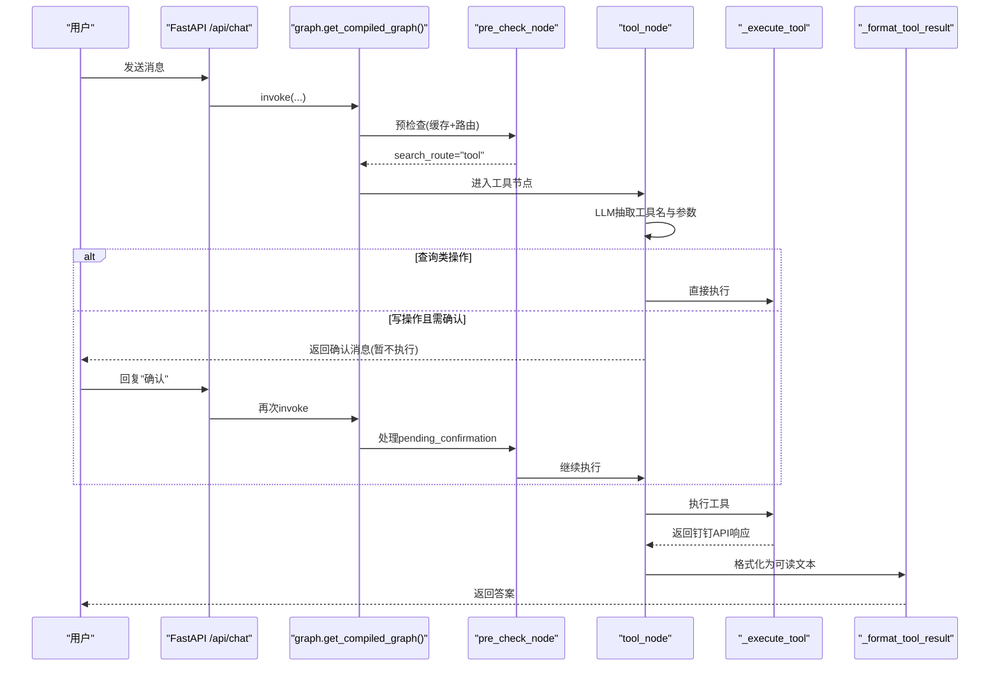
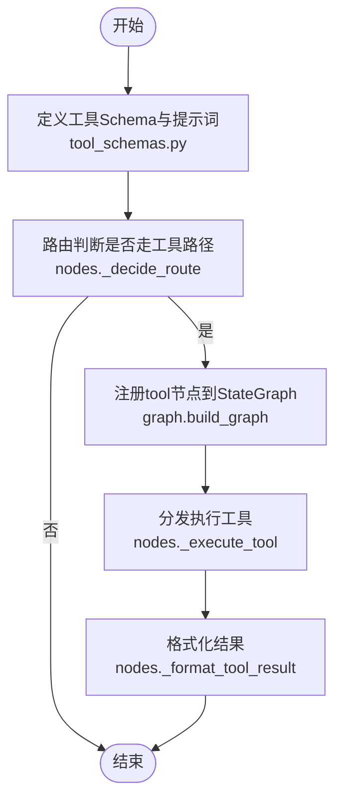
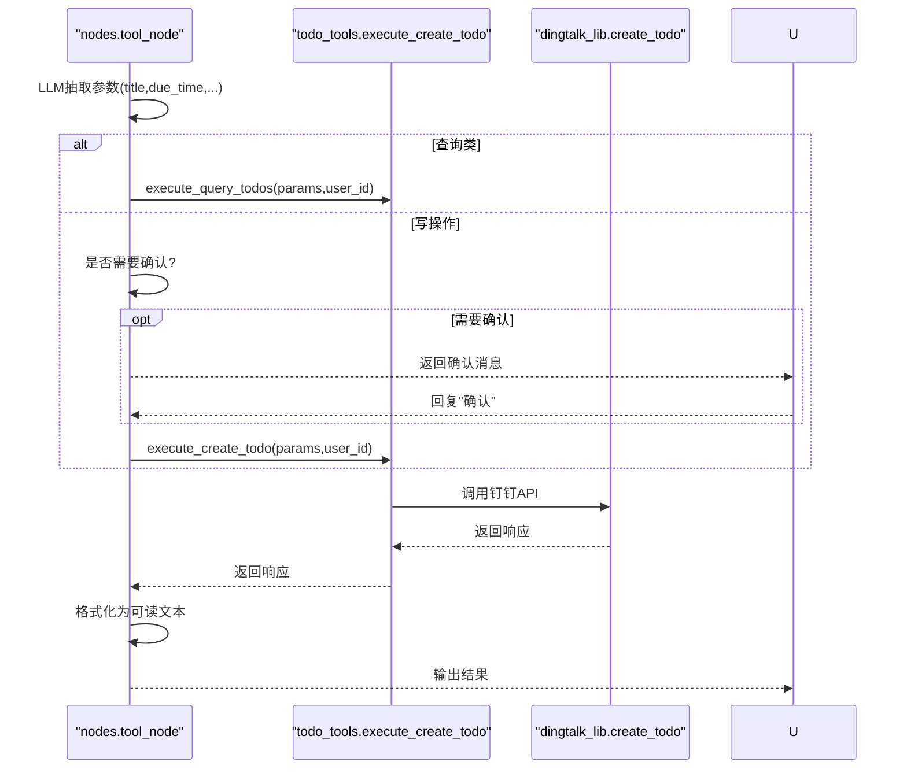
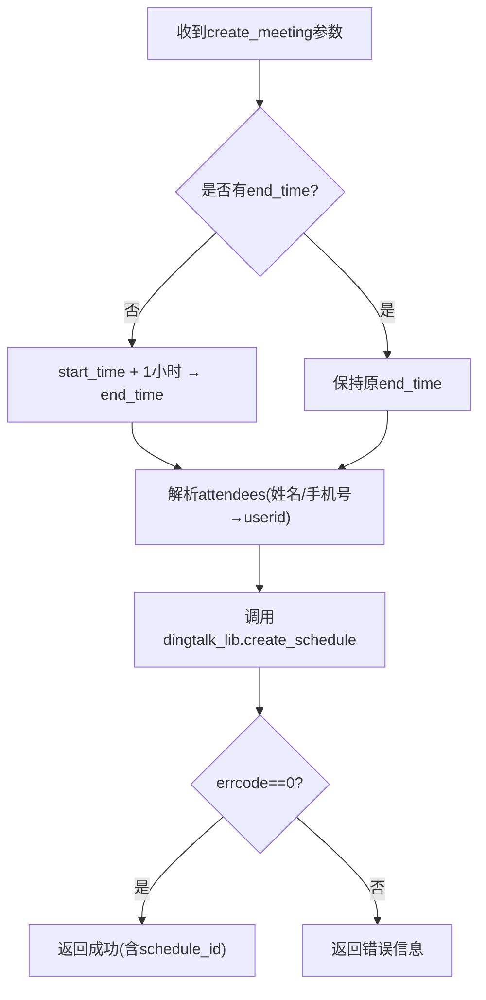
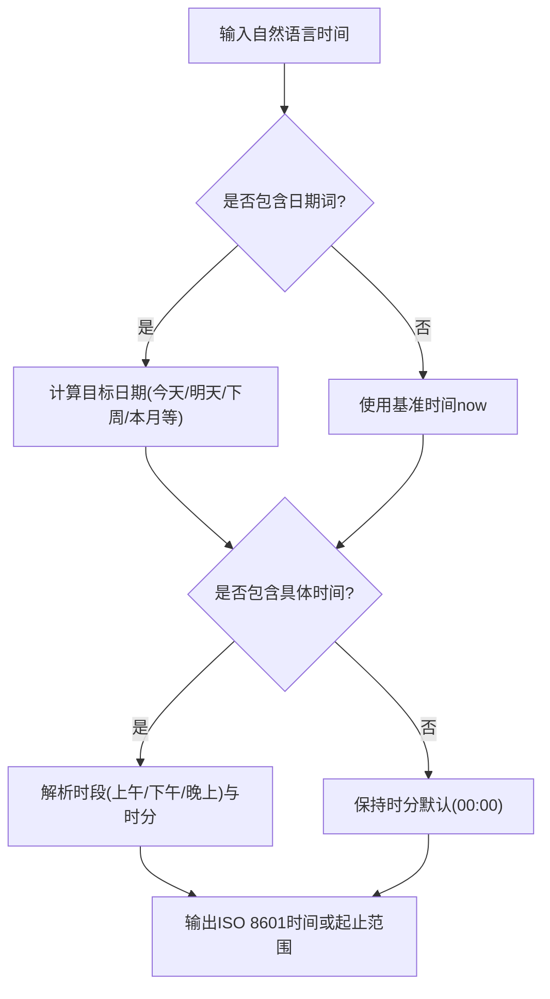
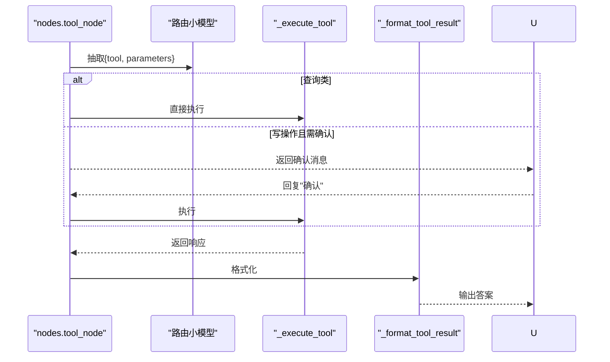
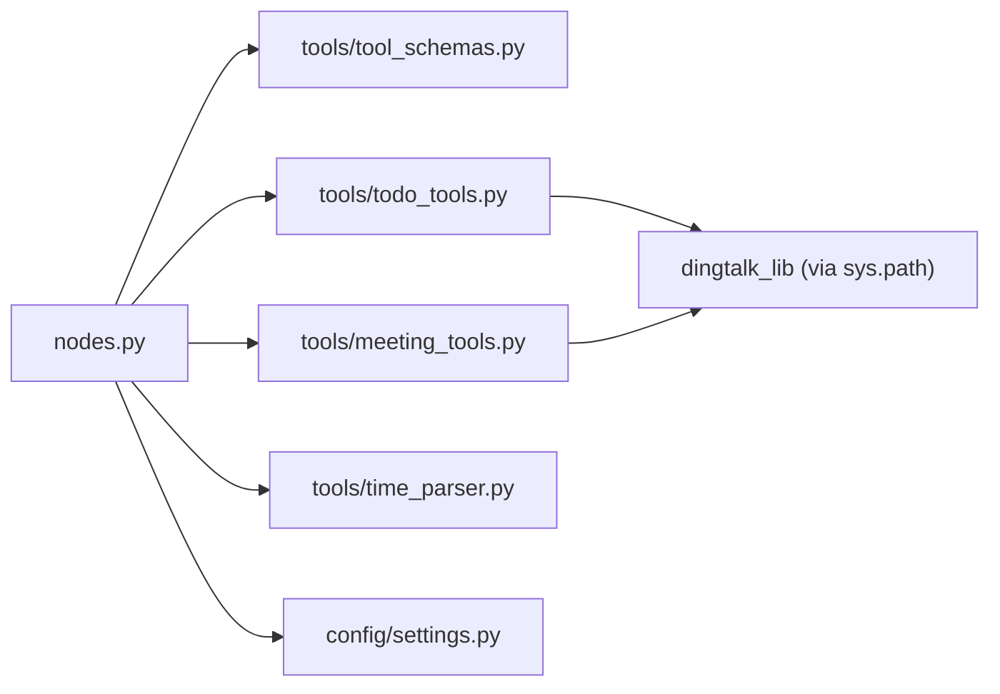

# 工具调用模块目录

<cite>
**本文引用的文件**
- [agent/tools/__init__.py](file://agent/tools/__init__.py)
- [agent/tools/tool_schemas.py](file://agent/tools/tool_schemas.py)
- [agent/tools/todo_tools.py](file://agent/tools/todo_tools.py)
- [agent/tools/meeting_tools.py](file://agent/tools/meeting_tools.py)
- [agent/tools/time_parser.py](file://agent/tools/time_parser.py)
- [agent/graph.py](file://agent/graph.py)
- [agent/nodes.py](file://agent/nodes.py)
- [agent/state.py](file://agent/state.py)
- [config/settings.py](file://config/settings.py)
- [main.py](file://main.py)
</cite>

## 目录
1. [简介](#简介)
2. [项目结构](#项目结构)
3. [核心组件](#核心组件)
4. [架构总览](#架构总览)
5. [详细组件分析](#详细组件分析)
6. [依赖关系分析](#依赖关系分析)
7. [性能考虑](#性能考虑)
8. [故障排查指南](#故障排查指南)
9. [结论](#结论)
10. [附录：自定义工具开发指南与最佳实践](#附录自定义工具开发指南与最佳实践)

## 简介
本章节面向“钉钉AI智能体助手”的工具调用模块，聚焦 agent/tools 目录下的钉钉集成工具（会议管理、待办事项）以及时间解析工具。文档说明其功能实现、API调用方式、错误处理机制，并给出工具注册流程、自定义工具开发指南与最佳实践建议。

## 项目结构
工具调用模块位于 agent/tools 下，采用“按能力分文件”的组织方式：
- tool_schemas.py：定义工具名称、描述、参数Schema及提取提示词，供LLM Function Calling使用。
- todo_tools.py：待办工具的创建与查询执行器，含结果格式化与确认消息。
- meeting_tools.py：会议工具的创建/取消/修改/查询执行器，含参会人解析、默认时长计算等。
- time_parser.py：自然语言时间解析，将中文表达转换为ISO 8601时间字符串或日期范围。
- __init__.py：模块标识。

工作流编排在 agent/graph.py 中通过 LangGraph StateGraph 构建；节点逻辑在 agent/nodes.py 中实现，负责路由、工具抽取、执行、确认与结果格式化；状态定义在 agent/state.py；全局开关与配置在 config/settings.py；Web入口在 main.py。

**图表来源**
- [agent/graph.py:44-102](file://agent/graph.py#L44-L102)
- [agent/nodes.py:646-779](file://agent/nodes.py#L646-L779)
- [agent/tools/tool_schemas.py:8-121](file://agent/tools/tool_schemas.py#L8-L121)
- [agent/tools/todo_tools.py:18-84](file://agent/tools/todo_tools.py#L18-L84)
- [agent/tools/meeting_tools.py:17-225](file://agent/tools/meeting_tools.py#L17-L225)
- [agent/tools/time_parser.py:11-63](file://agent/tools/time_parser.py#L11-L63)
- [config/settings.py:151-156](file://config/settings.py#L151-L156)
- [main.py:154-209](file://main.py#L154-L209)

**章节来源**
- [agent/tools/__init__.py:1-2](file://agent/tools/__init__.py#L1-L2)
- [agent/tools/tool_schemas.py:8-121](file://agent/tools/tool_schemas.py#L8-L121)
- [agent/tools/todo_tools.py:1-84](file://agent/tools/todo_tools.py#L1-L84)
- [agent/tools/meeting_tools.py:1-225](file://agent/tools/meeting_tools.py#L1-L225)
- [agent/tools/time_parser.py:1-120](file://agent/tools/time_parser.py#L1-L120)
- [agent/graph.py:44-102](file://agent/graph.py#L44-L102)
- [agent/nodes.py:646-779](file://agent/nodes.py#L646-L779)
- [agent/state.py:37-53](file://agent/state.py#L37-L53)
- [config/settings.py:151-156](file://config/settings.py#L151-L156)
- [main.py:154-209](file://main.py#L154-L209)

## 核心组件
- 工具Schema与提取提示词：集中声明可用工具、参数结构与必填项，驱动LLM进行意图识别与参数抽取。
- 待办工具：提供创建与查询能力，支持标题、截止时间、详情、优先级等字段。
- 会议工具：提供创建、取消、修改、查询能力；自动解析参会人（姓名/手机号→用户ID），默认时长补全，按标题模糊匹配定位会议。
- 时间解析工具：将“明天下午3点”“本周”等中文表达转为ISO 8601时间或起止范围。
- 工具执行与确认：读操作直接执行，写操作可配置为需用户确认后执行。
- 结果格式化：统一返回友好文本，包含错误信息、列表展示等。

**章节来源**
- [agent/tools/tool_schemas.py:8-121](file://agent/tools/tool_schemas.py#L8-L121)
- [agent/tools/todo_tools.py:18-84](file://agent/tools/todo_tools.py#L18-L84)
- [agent/tools/meeting_tools.py:17-225](file://agent/tools/meeting_tools.py#L17-L225)
- [agent/tools/time_parser.py:11-63](file://agent/tools/time_parser.py#L11-L63)
- [agent/nodes.py:646-779](file://agent/nodes.py#L646-L779)

## 架构总览
工具调用嵌入LangGraph工作流：预检查节点完成问答缓存命中判断与路由判断；若判定为工具调用，则进入工具节点，执行参数抽取、确认（可选）、执行与格式化，最终直接结束（不经过生成节点）。

**图表来源**
- [main.py:154-209](file://main.py#L154-L209)
- [agent/graph.py:44-102](file://agent/graph.py#L44-L102)
- [agent/nodes.py:93-150](file://agent/nodes.py#L93-L150)
- [agent/nodes.py:646-779](file://agent/nodes.py#L646-L779)

## 详细组件分析

### 工具注册流程
- Schema注册：在 tool_schemas.py 中声明工具名称、描述、参数Schema与必填项，并提供 TOOL_EXTRACT_PROMPT 用于LLM参数抽取。
- 路由注册：在 nodes.py 的 _decide_route 中，结合关键词与LLM路由，当判定为工具时设置 search_route="tool"。
- 图节点注册：在 graph.py 的 build_graph 中注册 tool 节点，并将 tool 边直接指向 END。
- 执行分发：在 nodes.py 的 _execute_tool 中根据工具名动态导入对应 execute_* 函数并调用。
- 结果格式化：在 nodes.py 的 _format_tool_result 中根据工具类别调用对应的 format_*_result。

**图表来源**
- [agent/tools/tool_schemas.py:8-121](file://agent/tools/tool_schemas.py#L8-L121)
- [agent/nodes.py:161-211](file://agent/nodes.py#L161-L211)
- [agent/graph.py:44-102](file://agent/graph.py#L44-L102)
- [agent/nodes.py:712-746](file://agent/nodes.py#L712-L746)
- [agent/nodes.py:749-764](file://agent/nodes.py#L749-L764)

**章节来源**
- [agent/tools/tool_schemas.py:8-121](file://agent/tools/tool_schemas.py#L8-L121)
- [agent/nodes.py:161-211](file://agent/nodes.py#L161-L211)
- [agent/graph.py:44-102](file://agent/graph.py#L44-L102)
- [agent/nodes.py:712-746](file://agent/nodes.py#L712-L746)
- [agent/nodes.py:749-764](file://agent/nodes.py#L749-L764)

### 待办事项工具（todo_tools.py）
- 功能：创建待办（标题、截止时间、详情、优先级）、查询待办（按状态过滤）。
- API调用：通过 dingtalk_lib.create_todo/query_todos 调用钉钉接口。
- 错误处理：统一返回 errcode/errmsg，非零时格式化为“操作失败: ...”。
- 确认机制：创建待办属于写操作，可按配置要求用户确认。

**图表来源**
- [agent/tools/todo_tools.py:18-84](file://agent/tools/todo_tools.py#L18-L84)
- [agent/nodes.py:646-779](file://agent/nodes.py#L646-L779)

**章节来源**
- [agent/tools/todo_tools.py:18-84](file://agent/tools/todo_tools.py#L18-L84)
- [agent/nodes.py:646-779](file://agent/nodes.py#L646-L779)

### 会议管理工具（meeting_tools.py）
- 功能：创建会议（主题、开始/结束时间、参会人、地点、描述）、取消会议（按ID或标题匹配）、修改会议（按ID或标题匹配）、查询会议（按日期范围）。
- 参会人解析：支持手机号与姓名两种输入，分别调用通讯录API获取用户ID；解析失败保留原值以便API跳过无效ID。
- 默认时长：未提供结束时间时，自动将开始时间加1小时作为结束时间。
- 标题匹配：无会议ID时，按未来30天内的日程列表模糊匹配标题以定位会议。
- API调用：通过 dingtalk_lib 的 create_schedule/delete_schedule/update_schedule/query_schedules 等方法。
- 错误处理：统一返回 errcode/errmsg，非零时格式化为友好错误。

**图表来源**
- [agent/tools/meeting_tools.py:17-47](file://agent/tools/meeting_tools.py#L17-L47)
- [agent/tools/meeting_tools.py:185-225](file://agent/tools/meeting_tools.py#L185-L225)

**章节来源**
- [agent/tools/meeting_tools.py:17-225](file://agent/tools/meeting_tools.py#L17-L225)
- [agent/nodes.py:712-746](file://agent/nodes.py#L712-L746)

### 时间解析工具（time_parser.py）
- 功能：将中文自然语言时间表达转换为ISO 8601时间字符串或起止日期范围。
- 支持表达：“今天/明日/后天/下周/本周/本月”“上午/下午/晚上X点”“X点半”“X天后/小时后”等。
- 用法：parse_natural_time(text, now) 返回单个时间；parse_natural_date_range(text, now) 返回(start,end)。
- 应用：会议查询默认“本周”，待办/会议创建时可由上游将自然时间转ISO时间后传入。

**图表来源**
- [agent/tools/time_parser.py:11-63](file://agent/tools/time_parser.py#L11-L63)
- [agent/tools/time_parser.py:66-120](file://agent/tools/time_parser.py#L66-L120)

**章节来源**
- [agent/tools/time_parser.py:11-120](file://agent/tools/time_parser.py#L11-L120)

### 工具执行与确认流程（nodes.py）
- 参数抽取：通过路由小模型与TOOL_EXTRACT_PROMPT从用户输入中提取工具名与参数。
- 读操作：query_todos/query_meetings 直接执行。
- 写操作：create_todo/create_meeting/cancel_meeting/update_meeting 可按配置要求用户确认。
- 执行与格式化：_execute_tool 分发到具体工具执行器；_format_tool_result 统一格式化结果。

**图表来源**
- [agent/nodes.py:646-779](file://agent/nodes.py#L646-L779)

**章节来源**
- [agent/nodes.py:646-779](file://agent/nodes.py#L646-L779)

## 依赖关系分析
- 工具模块依赖 dingtalk_lib（通过 skill scripts 路径注入 sys.path）访问钉钉API。
- 工具执行与确认逻辑集中在 nodes.py，通过动态导入避免启动期耦合。
- 工具Schema与提示词集中管理，便于扩展与维护。
- 配置项控制工具调用总开关与写操作确认策略。

**图表来源**
- [agent/nodes.py:712-746](file://agent/nodes.py#L712-L746)
- [agent/tools/todo_tools.py:10-15](file://agent/tools/todo_tools.py#L10-L15)
- [agent/tools/meeting_tools.py:9-14](file://agent/tools/meeting_tools.py#L9-L14)
- [config/settings.py:151-156](file://config/settings.py#L151-L156)

**章节来源**
- [agent/nodes.py:712-746](file://agent/nodes.py#L712-L746)
- [agent/tools/todo_tools.py:10-15](file://agent/tools/todo_tools.py#L10-L15)
- [agent/tools/meeting_tools.py:9-14](file://agent/tools/meeting_tools.py#L9-L14)
- [config/settings.py:151-156](file://config/settings.py#L151-L156)

## 性能考虑
- 工具调用直接结束：tool 节点直接连向 END，避免不必要的生成节点开销。
- 路由短路：关键词优先短路（如工具关键词），减少LLM调用次数。
- 参会人解析容错：解析失败保留原值，避免阻塞整体流程。
- 默认时长补全：减少用户输入负担，降低后续处理复杂度。
- 配置化开关：可通过配置关闭工具调用或确认流程，按需降级。

[本节为通用性能讨论，不直接分析具体代码行]

## 故障排查指南
- 工具未识别：检查 TOOL_KEYWORDS 与用户表达是否匹配；查看路由日志与 LLM 抽取结果。
- 写操作未执行：确认 tool_confirmation_required 配置与用户是否回复“确认”。
- 钉钉API失败：查看工具返回的 errcode/errmsg；检查 dingtalk_lib 可用性与会话权限。
- 参会人解析失败：检查手机号格式与姓名匹配；必要时手动修正 attendees。
- 时间解析异常：确保传入时间为ISO 8601；使用 parse_natural_time/parse_natural_date_range 转换。

**章节来源**
- [agent/nodes.py:693-746](file://agent/nodes.py#L693-L746)
- [agent/tools/meeting_tools.py:185-225](file://agent/tools/meeting_tools.py#L185-L225)
- [agent/tools/todo_tools.py:47-84](file://agent/tools/todo_tools.py#L47-L84)
- [agent/tools/time_parser.py:11-120](file://agent/tools/time_parser.py#L11-L120)
- [config/settings.py:151-156](file://config/settings.py#L151-L156)

## 结论
工具调用模块通过清晰的Schema定义、集中的路由与执行分发、友好的结果格式化与确认机制，实现了钉钉待办与会议管理的稳定集成。配合自然语言时间解析，提升了用户体验与易用性。通过配置开关与容错设计，系统具备良好的可扩展性与鲁棒性。

[本节为总结性内容，不直接分析具体代码行]

## 附录：自定义工具开发指南与最佳实践
- 新增工具步骤
  - 在 tool_schemas.py 中添加工具名称、描述与参数Schema，并在 TOOL_EXTRACT_PROMPT 中补充说明。
  - 在 tools/ 目录下新建或扩展现有工具文件，实现 execute_* 函数，调用 dingtalk_lib 或其他外部API。
  - 在 nodes.py 的 _execute_tool 中增加分支，将工具名映射到执行函数。
  - 在 nodes.py 的 _format_tool_result 与 _format_confirmation 中增加对应格式化逻辑。
  - 如需读/写分类，更新 WRITE_TOOLS/READ_TOOLS 集合。
- 最佳实践
  - 参数校验：对必填字段做前置校验，缺失时返回明确错误。
  - 错误处理：统一返回 errcode/errmsg，避免抛出异常中断主链路。
  - 幂等性：对写操作尽量保证幂等，避免重复执行造成副作用。
  - 安全与确认：写操作默认开启用户确认，防止误操作。
  - 可观测性：记录关键步骤日志，便于问题定位。
  - 性能优化：批量操作合并请求；解析失败时快速回退。
  - 测试覆盖：为工具执行与格式化编写单元测试，覆盖正常与异常路径。

**章节来源**
- [agent/tools/tool_schemas.py:8-121](file://agent/tools/tool_schemas.py#L8-L121)
- [agent/nodes.py:712-779](file://agent/nodes.py#L712-L779)