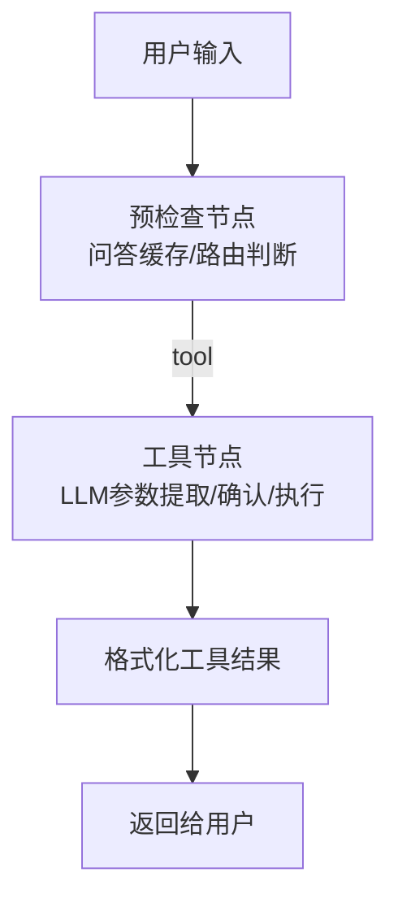
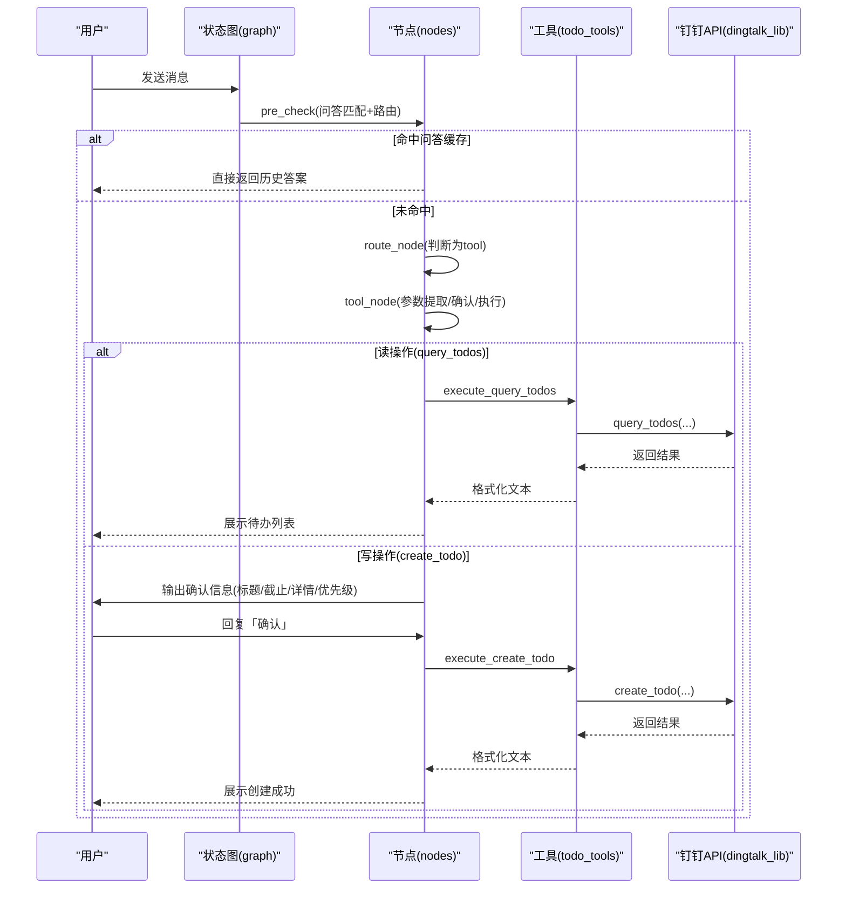
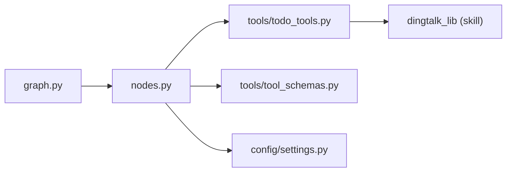
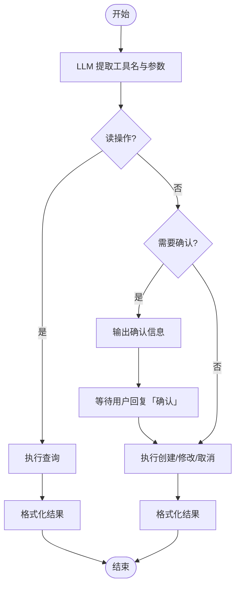

# 待办事项工具

<cite>
**本文引用的文件**
- [agent/tools/todo_tools.py](file://agent/tools/todo_tools.py)
- [agent/tools/tool_schemas.py](file://agent/tools/tool_schemas.py)
- [agent/nodes.py](file://agent/nodes.py)
- [agent/graph.py](file://agent/graph.py)
- [agent/state.py](file://agent/state.py)
- [config/settings.py](file://config/settings.py)
- [需求分析文档.md](file://需求分析文档.md)
</cite>

## 目录
1. [简介](#简介)
2. [项目结构](#项目结构)
3. [核心组件](#核心组件)
4. [架构总览](#架构总览)
5. [详细组件分析](#详细组件分析)
6. [依赖关系分析](#依赖关系分析)
7. [性能与可靠性](#性能与可靠性)
8. [故障排查指南](#故障排查指南)
9. [结论](#结论)
10. [附录：数据模型与交互流程](#附录数据模型与交互流程)

## 简介
本文件详细说明“待办事项工具”的完整实现，覆盖创建、查询、完成、删除等操作的功能逻辑（以当前代码库实际能力为准），包括任务状态管理、优先级设置、截止日期处理、用户确认机制以及与钉钉任务的集成方式。同时给出工作流编排、状态流转、错误处理与性能特性说明，帮助读者快速理解并正确使用该功能。

## 项目结构
待办事项工具位于智能体工具层，通过 LangGraph 状态图进行编排，由路由节点识别意图后进入工具调用分支，最终调用 dingtalk_lib 提供的钉钉 API 完成操作。

图表来源
- [agent/graph.py:44-102](file://agent/graph.py#L44-L102)
- [agent/nodes.py:647-779](file://agent/nodes.py#L647-L779)

章节来源
- [agent/graph.py:44-102](file://agent/graph.py#L44-L102)
- [agent/nodes.py:647-779](file://agent/nodes.py#L647-L779)

## 核心组件
- 工具 Schema 定义：声明可用工具名称、描述与参数结构，供 LLM Function Calling 抽取参数使用。
- 工具执行器：封装对 dingtalk_lib 的调用，负责参数转换与结果格式化。
- 工作流编排：LangGraph 状态图将“预检查→路由→工具→结束”串联起来，支持写操作的用户确认。
- 配置开关：全局控制是否启用工具调用、是否需要用户确认等。

章节来源
- [agent/tools/tool_schemas.py:1-121](file://agent/tools/tool_schemas.py#L1-L121)
- [agent/tools/todo_tools.py:1-84](file://agent/tools/todo_tools.py#L1-L84)
- [agent/nodes.py:647-779](file://agent/nodes.py#L647-L779)
- [config/settings.py:151-156](file://config/settings.py#L151-L156)

## 架构总览
整体采用“预检查 + 条件分流 + 工具直出”的工作流：
- 预检查：先做问答记忆命中判断，再进行路由；若命中则直接返回历史答案。
- 路由：关键词短路 + 小模型意图识别 + 兜底规则，识别到工具意图时进入 tool 分支。
- 工具：LLM 从自然语言提取工具名与参数；读操作直接执行，写操作需用户确认后执行；执行完成后直接返回结果，不经过生成节点。
- 后台记忆：非工具路径在生成后异步更新长期记忆。

图表来源
- [agent/graph.py:44-102](file://agent/graph.py#L44-L102)
- [agent/nodes.py:93-151](file://agent/nodes.py#L93-L151)
- [agent/nodes.py:647-779](file://agent/nodes.py#L647-L779)
- [agent/tools/todo_tools.py:18-44](file://agent/tools/todo_tools.py#L18-L44)

## 详细组件分析

### 工具 Schema 与参数抽取
- 提供 create_todo、query_todos 等工具的 JSON Schema，包含必填/可选字段与类型约束。
- 通过提示词让 LLM 从用户自然语言中抽取工具名与参数，返回结构化 JSON。
- 读/写操作分类：读操作直接执行，写操作默认需要用户确认。

章节来源
- [agent/tools/tool_schemas.py:1-121](file://agent/tools/tool_schemas.py#L1-L121)
- [agent/nodes.py:693-709](file://agent/nodes.py#L693-L709)

### 待办工具执行器（todo_tools）
- 创建待办：接收 title、due_time、description、priority，调用 dingtalk_lib.create_todo。
- 查询待办：按 status 过滤（all/pending/done），调用 dingtalk_lib.query_todos。
- 结果格式化：统一错误码处理；查询结果以可读文本列出标题、截止时间、优先级星号。
- 确认消息：写操作前输出待办摘要，等待用户确认。

章节来源
- [agent/tools/todo_tools.py:18-84](file://agent/tools/todo_tools.py#L18-L84)

### 工作流与状态管理
- AgentState 包含工具相关字段：tool_name、tool_params、tool_result、pending_confirmation、confirmation_context。
- 预检查节点优先处理 pending_confirmation：当用户回复“确认/确定/yes/y/OK”等时，读取上下文并执行待确认工具。
- 工具节点：
  - 参数提取失败或未识别工具：降级为普通回答。
  - 读操作：直接执行并返回结果。
  - 写操作：根据配置决定是否需用户确认；确认后执行。
  - 异常兜底：捕获异常并返回友好错误信息。

章节来源
- [agent/state.py:12-51](file://agent/state.py#L12-L51)
- [agent/nodes.py:93-151](file://agent/nodes.py#L93-L151)
- [agent/nodes.py:647-779](file://agent/nodes.py#L647-L779)

### 配置与开关
- TOOL_CALLING_ENABLED：关闭时工具路由自动降级为 chat。
- TOOL_CONFIRMATION_REQUIRED：开启后写操作需用户确认。
- 其他与工具无关的配置（如 RAG、记忆、LLM）不影响工具主链路，但影响整体系统行为。

章节来源
- [config/settings.py:151-156](file://config/settings.py#L151-L156)

### 与钉钉任务的集成方式
- 通过 sys.path.insert 动态引入 skill 的 dingtalk_lib，保持自包含。
- 调用 create_todo、query_todos 等接口，所有错误以 errcode/errmsg 形式返回，便于上层统一处理。
- 具体钉钉 API 细节由 dingtalk_lib 封装，本仓库仅做参数适配与结果格式化。

章节来源
- [agent/tools/todo_tools.py:10-15](file://agent/tools/todo_tools.py#L10-L15)
- [agent/tools/todo_tools.py:18-44](file://agent/tools/todo_tools.py#L18-L44)

## 依赖关系分析
- nodes 依赖 graph 定义的节点编排，nodes 内部再按需导入 tools 与 schema。
- todo_tools 依赖 dingtalk_lib（由 skill 提供），对外暴露统一的执行函数。
- settings 提供全局开关，影响路由与确认策略。

图表来源
- [agent/graph.py:44-102](file://agent/graph.py#L44-L102)
- [agent/nodes.py:647-779](file://agent/nodes.py#L647-L779)
- [agent/tools/todo_tools.py:10-15](file://agent/tools/todo_tools.py#L10-L15)

章节来源
- [agent/graph.py:44-102](file://agent/graph.py#L44-L102)
- [agent/nodes.py:647-779](file://agent/nodes.py#L647-L779)
- [agent/tools/todo_tools.py:10-15](file://agent/tools/todo_tools.py#L10-L15)

## 性能与可靠性
- 路由三层判断：关键词短路 → 小模型意图识别 → 关键词兜底，兼顾速度与准确率。
- 工具调用响应时间目标：参数提取 < 3s，API 调用 < 5s。
- 异常与降级：
  - 工具执行异常统一捕获，返回友好错误。
  - 工具路由关闭时自动降级为 chat。
  - 写操作可配置是否需要用户确认，避免误操作。
- 流式与超时保护：整体流式接口具备超时保护，已生成的内容可部分返回。

章节来源
- [agent/nodes.py:161-211](file://agent/nodes.py#L161-L211)
- [agent/nodes.py:712-746](file://agent/nodes.py#L712-L746)
- [需求分析文档.md:261-294](file://需求分析文档.md#L261-L294)

## 故障排查指南
- 无法识别工具：
  - 检查 TOOL_CALLING_ENABLED 是否开启。
  - 检查用户输入是否包含工具关键词或表达清晰。
  - 查看 LLM 参数提取是否成功（nodes._extract_tool_call）。
- 写操作未执行：
  - 检查 TOOL_CONFIRMATION_REQUIRED 是否为 True，确认用户是否回复了“确认”。
  - 检查 confirmation_context 是否正确保存与恢复。
- 钉钉 API 报错：
  - 查看返回的 errcode/errmsg，定位是权限、参数还是网络问题。
  - 确保 dingtalk_lib 所在 skill 脚本路径正确且可导入。
- 查询结果为空：
  - 检查 status 参数（all/pending/done）是否符合预期。
  - 确认 user_id 是否正确传递。

章节来源
- [agent/nodes.py:647-779](file://agent/nodes.py#L647-L779)
- [agent/tools/todo_tools.py:47-84](file://agent/tools/todo_tools.py#L47-L84)

## 结论
本实现以 LangGraph 为核心编排，结合 LLM 的参数抽取与工具调用，完成了待办的创建与查询能力，并通过用户确认机制保障写操作安全。与钉钉任务的集成通过 dingtalk_lib 解耦，便于独立维护与扩展。系统在路由、异常处理、降级策略等方面具备较好的鲁棒性，适合在企业场景下稳定运行。

## 附录：数据模型与交互流程

### 待办数据模型（基于工具 Schema）
- 创建待办参数：
  - title：字符串，必填
  - due_time：ISO 8601 时间字符串，必填
  - description：字符串，可选
  - priority：整数 1-5，可选（默认 3）
- 查询待办参数：
  - status：枚举 all/pending/done，可选（默认 pending）

章节来源
- [agent/tools/tool_schemas.py:30-54](file://agent/tools/tool_schemas.py#L30-L54)

### 任务状态管理与优先级
- 状态管理：查询支持 all/pending/done 三种状态过滤。
- 优先级：1-5 级，显示时使用星号可视化（最多 5 星）。

章节来源
- [agent/tools/todo_tools.py:47-67](file://agent/tools/todo_tools.py#L47-L67)

### 截止日期处理
- 截止时间采用 ISO 8601 格式，由 LLM 从自然语言解析后传入。
- 查询结果中会展示截止时间，便于用户核对。

章节来源
- [agent/tools/tool_schemas.py:30-54](file://agent/tools/tool_schemas.py#L30-L54)
- [agent/tools/todo_tools.py:56-67](file://agent/tools/todo_tools.py#L56-L67)

### 批量操作支持
- 当前实现未提供批量创建/删除/完成的工具接口。
- 如需批量操作，可在现有基础上扩展新的工具（如 batch_create_todos），并在 nodes 中注册执行逻辑。

章节来源
- [agent/tools/tool_schemas.py:30-54](file://agent/tools/tool_schemas.py#L30-L54)
- [agent/nodes.py:712-746](file://agent/nodes.py#L712-L746)

### 用户交互流程（含确认机制）

图表来源
- [agent/nodes.py:647-779](file://agent/nodes.py#L647-L779)
- [agent/tools/todo_tools.py:72-84](file://agent/tools/todo_tools.py#L72-L84)