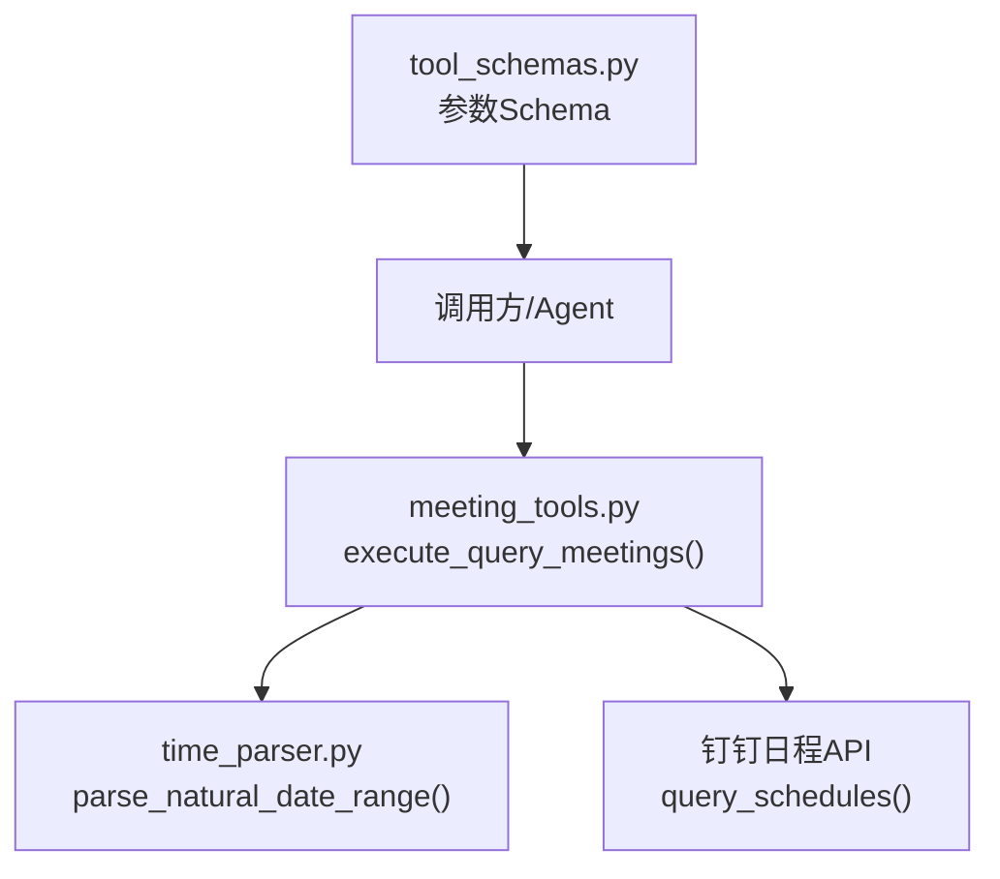
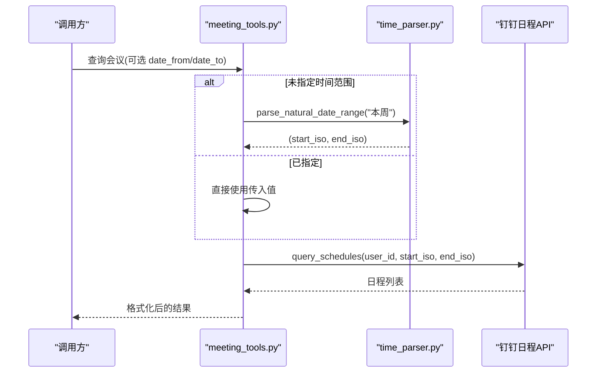
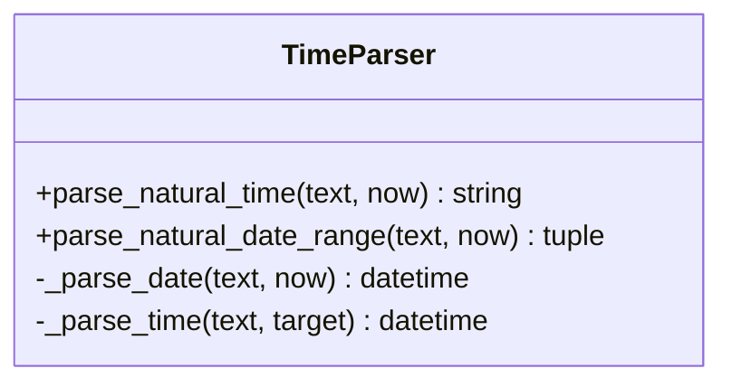
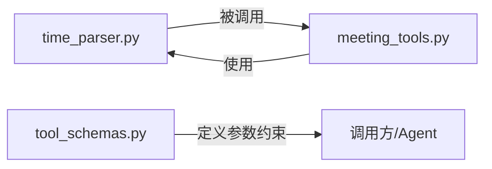

# 时间解析工具

<cite>
**本文引用的文件**
- [time_parser.py](file://agent/tools/time_parser.py)
- [meeting_tools.py](file://agent/tools/meeting_tools.py)
- [tool_schemas.py](file://agent/tools/tool_schemas.py)
</cite>

## 目录
1. [简介](#简介)
2. [项目结构](#项目结构)
3. [核心组件](#核心组件)
4. [架构总览](#架构总览)
5. [详细组件分析](#详细组件分析)
6. [依赖关系分析](#依赖关系分析)
7. [性能考量](#性能考量)
8. [故障排查指南](#故障排查指南)
9. [结论](#结论)
10. [附录：使用示例与最佳实践](#附录使用示例与最佳实践)

## 简介
本工具提供自然语言时间表达到标准时间格式的解析能力，支持相对时间（如“明天”“本周”）、绝对时间片段（如“下午3点”“10:30”）以及常见的时间范围表达。其目标是在会议、待办等场景中，将用户口语化描述转换为系统可消费的 ISO 8601 时间字符串或起止时间区间，从而驱动日程查询、创建、更新等操作。

## 项目结构
时间解析功能位于 agent/tools/time_parser.py，被会议工具模块在查询场景中使用；同时，工具参数 Schema 对时间字段进行了约束说明，便于上层 LLM/调用方正确传入。

图表来源
- [meeting_tools.py:116-128](file://agent/tools/meeting_tools.py#L116-L128)
- [time_parser.py:29-63](file://agent/tools/time_parser.py#L29-L63)
- [tool_schemas.py:56-113](file://agent/tools/tool_schemas.py#L56-L113)

章节来源
- [meeting_tools.py:116-128](file://agent/tools/meeting_tools.py#L116-L128)
- [time_parser.py:29-63](file://agent/tools/time_parser.py#L29-L63)
- [tool_schemas.py:56-113](file://agent/tools/tool_schemas.py#L56-L113)

## 核心组件
- 单时间点解析：将自然语言时间表达式解析为 ISO 8601 字符串。
- 日期范围解析：将自然语言日期范围解析为 (start, end) 的 ISO 8601 字符串元组。
- 内部解析器：分别处理“日期偏移”和“具体时间片段”，组合得到最终结果。

章节来源
- [time_parser.py:11-26](file://agent/tools/time_parser.py#L11-L26)
- [time_parser.py:29-63](file://agent/tools/time_parser.py#L29-L63)
- [time_parser.py:66-119](file://agent/tools/time_parser.py#L66-L119)

## 架构总览
时间解析采用“先日期、后时间”的两阶段策略：
- 第一阶段 _parse_date：基于关键词与正则匹配确定目标日期（相对今天的前后偏移、周/月边界）。
- 第二阶段 _parse_time：从文本中提取小时、分钟与时段（上午/下午/晚上/早上），并修正为24小时制。
- 对外暴露两个入口：
  - parse_natural_time：返回单个时间的 ISO 8601 字符串。
  - parse_natural_date_range：返回起止时间的 ISO 8601 字符串元组。

图表来源
- [meeting_tools.py:116-128](file://agent/tools/meeting_tools.py#L116-L128)
- [time_parser.py:29-63](file://agent/tools/time_parser.py#L29-L63)

## 详细组件分析

### 单时间点解析：parse_natural_time
- 输入：包含时间表达的自然语言文本，可选基准时间 now。
- 处理流程：
  - 若未提供 now，则取当前时间作为基准。
  - 先通过 _parse_date 计算目标日期。
  - 再通过 _parse_time 提取并替换小时、分钟，必要时进行时段换算。
  - 输出 ISO 8601 字符串。
- 关键点：
  - 不直接解析完整日期（如“2024年5月1日”），而是以相对偏移为主。
  - 时间片段支持“X点半”“X点Y分”“X:Y”等多种写法。

章节来源
- [time_parser.py:11-26](file://agent/tools/time_parser.py#L11-L26)
- [time_parser.py:66-119](file://agent/tools/time_parser.py#L66-L119)

### 日期范围解析：parse_natural_date_range
- 输入：自然语言日期范围文本，可选基准时间 now。
- 支持的范围：
  - “今天/今日”：当天 00:00:00 至 23:59:59。
  - “明天/明日”：次日全天。
  - “本周/这周”：从周一 00:00:00 至周日 23:59:59。
  - “下周”：下一周的周一 00:00:00 至周日 23:59:59。
  - “本月”：当月首日 00:00:00 至月末最后一秒。
  - 其他情况：默认按“当天”处理。
- 输出：(start_iso, end_iso) 元组。

章节来源
- [time_parser.py:29-63](file://agent/tools/time_parser.py#L29-L63)

### 日期偏移解析：_parse_date
- 支持的相对表达：
  - 昨天、明天/明日、后天
  - 下周、下下周
  - 本周/这周（保持当前日期）
  - “X天后”“X小时后”（正则匹配数字+单位）
- 未匹配时回退到基准时间 now。

章节来源
- [time_parser.py:66-89](file://agent/tools/time_parser.py#L66-L89)

### 时间片段解析：_parse_time
- 支持格式：
  - “上午/下午/晚上/早上 + X点/Y分”
  - “X点半”
  - “X:Y”或“X.Y”等形式（兼容中文冒号/点）
- 处理逻辑：
  - 识别时段词并进行12/24小时制转换。
  - 分钟缺失时默认为0。
  - 仅替换目标时间的小时与分钟，秒与微秒归零。

章节来源
- [time_parser.py:92-119](file://agent/tools/time_parser.py#L92-L119)

### 与会议工具的集成
- 当查询会议未指定时间范围时，自动使用“本周”作为默认范围，调用 parse_natural_date_range 生成起止时间。
- 该设计简化了调用方参数，提升易用性。

章节来源
- [meeting_tools.py:116-128](file://agent/tools/meeting_tools.py#L116-L128)

### 类图（代码级）

图表来源
- [time_parser.py:11-119](file://agent/tools/time_parser.py#L11-L119)

## 依赖关系分析
- time_parser.py 仅依赖 Python 标准库 re 与 datetime，无第三方依赖，具备高内聚、低耦合特性。
- meeting_tools.py 在查询会议时按需导入 time_parser，避免启动期不必要的依赖加载。
- tool_schemas.py 定义了时间相关字段的类型与描述，确保上层参数规范一致。

图表来源
- [meeting_tools.py:116-128](file://agent/tools/meeting_tools.py#L116-L128)
- [time_parser.py:11-119](file://agent/tools/time_parser.py#L11-L119)
- [tool_schemas.py:56-113](file://agent/tools/tool_schemas.py#L56-L113)

章节来源
- [meeting_tools.py:116-128](file://agent/tools/meeting_tools.py#L116-L128)
- [time_parser.py:11-119](file://agent/tools/time_parser.py#L11-L119)
- [tool_schemas.py:56-113](file://agent/tools/tool_schemas.py#L56-L113)

## 性能考量
- 解析复杂度：主要基于字符串匹配与正则查找，时间复杂度近似 O(n)，n 为输入文本长度，开销极低。
- 内存占用：仅维护少量中间变量与正则匹配结果，内存占用极小。
- 可扩展性：新增时间表达可通过在 _parse_date/_parse_time 中添加分支或正则实现，不影响既有逻辑。

[本节为通用性能讨论，不直接分析具体文件]

## 故障排查指南
- 无法解析时间：
  - 检查是否包含支持的相对表达或时间片段；若不匹配，_parse_date 会回退到基准时间，_parse_time 可能不修改时间。
  - 建议在上层增加校验，提示用户补充明确时间信息。
- 时间偏差：
  - 确认基准时间 now 是否正确；若由外部传入，需保证时区一致性。
  - 注意“下午/晚上”与12小时制的转换规则，避免误判。
- 范围边界：
  - “本月”跨年会正确处理（12月→次年1月）。
  - “本周/下周”基于周一起始，符合国内习惯。

章节来源
- [time_parser.py:66-119](file://agent/tools/time_parser.py#L66-L119)

## 结论
时间解析工具以简洁、稳定的方式实现了自然语言时间到标准时间格式的转换，覆盖常见的相对时间与时间片段表达，并与会议工具无缝集成，显著降低了调用方的使用成本。其模块化设计与最小依赖使其易于扩展与维护。

[本节为总结性内容，不直接分析具体文件]

## 附录：使用示例与最佳实践
- 单时间点解析
  - 示例输入：“明天下午3点”“下周一上午10点”“2小时后”
  - 期望输出：ISO 8601 字符串
  - 参考路径：[time_parser.py:11-26](file://agent/tools/time_parser.py#L11-L26)
- 日期范围解析
  - 示例输入：“今天”“明天”“本周”“下周”“本月”
  - 期望输出：(start_iso, end_iso) 元组
  - 参考路径：[time_parser.py:29-63](file://agent/tools/time_parser.py#L29-L63)
- 会议查询默认范围
  - 未指定时间范围时，自动使用“本周”作为查询区间
  - 参考路径：[meeting_tools.py:116-128](file://agent/tools/meeting_tools.py#L116-L128)
- 参数约束
  - 会议/待办的时间字段要求为 ISO 8601 字符串
  - 参考路径：[tool_schemas.py:56-113](file://agent/tools/tool_schemas.py#L56-L113)

章节来源
- [time_parser.py:11-63](file://agent/tools/time_parser.py#L11-L63)
- [meeting_tools.py:116-128](file://agent/tools/meeting_tools.py#L116-L128)
- [tool_schemas.py:56-113](file://agent/tools/tool_schemas.py#L56-L113)