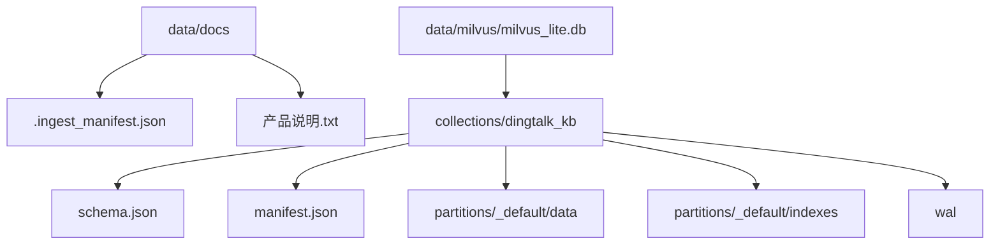
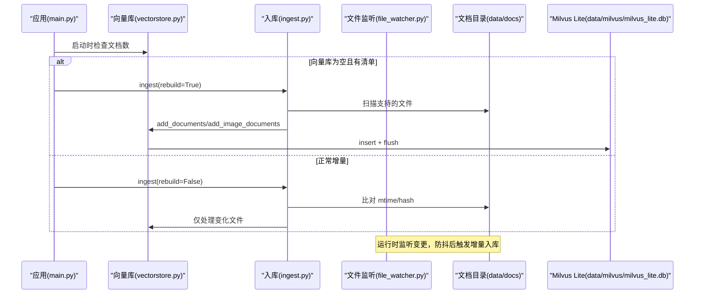
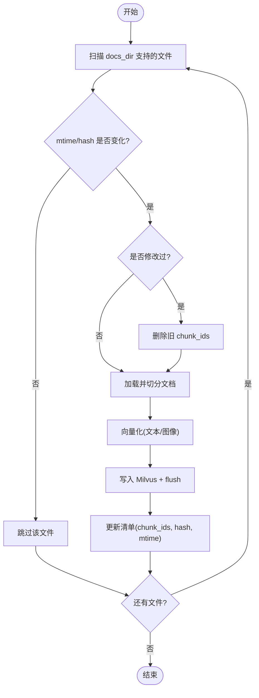
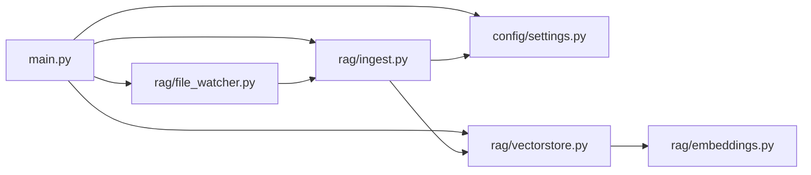

# 数据文件目录

<cite>
**本文引用的文件**
- [main.py](file://main.py)
- [config/settings.py](file://config/settings.py)
- [rag/ingest.py](file://rag/ingest.py)
- [rag/vectorstore.py](file://rag/vectorstore.py)
- [rag/file_watcher.py](file://rag/file_watcher.py)
- [rag/embeddings.py](file://rag/embeddings.py)
- [data/docs/.ingest_manifest.json](file://data/docs/.ingest_manifest.json)
</cite>

## 目录
1. [简介](#简介)
2. [项目结构](#项目结构)
3. [核心组件](#核心组件)
4. [架构总览](#架构总览)
5. [详细组件分析](#详细组件分析)
6. [依赖关系分析](#依赖关系分析)
7. [性能与容量规划](#性能与容量规划)
8. [故障排查指南](#故障排查指南)
9. [结论](#结论)
10. [附录：导入导出、备份恢复与维护实践](#附录导入导出备份恢复与维护实践)

## 简介
本文件面向“数据文件目录”的完整说明，覆盖知识库文档存储、向量数据库文件、入库清单等数据文件的格式与管理方式；并提供数据导入导出方法、备份恢复策略以及数据维护最佳实践。目标是帮助读者在不深入代码的前提下，也能正确管理、迁移和维护项目的知识数据资产。

## 项目结构
与数据相关的目录与文件主要位于 data 目录及其子目录：
- data/docs：知识库原始文档存放目录（支持 .txt/.md/.pdf/.docx/.xlsx 及多种图片格式）
- data/milvus/milvus_lite.db：Milvus Lite 本地持久化数据库文件（包含集合 schema、索引、数据等）
- data/docs/.ingest_manifest.json：入库清单（记录每个源文件的哈希、修改时间与切分块 ID 列表，用于增量更新）

图表来源
- [config/settings.py:54-75](file://config/settings.py#L54-L75)
- [rag/vectorstore.py:29-76](file://rag/vectorstore.py#L29-L76)

章节来源
- [config/settings.py:54-75](file://config/settings.py#L54-L75)
- [rag/vectorstore.py:29-76](file://rag/vectorstore.py#L29-L76)

## 核心组件
- 配置中心：统一读取环境变量与 .env，提供 docs_dir、milvus_db_path、collection 名称、切片大小、检索阈值等关键参数。
- 文档入库：按扩展名加载文本/表格/PDF/图片，进行 OCR、切分、向量化并写入 Milvus；通过清单实现增量更新。
- 向量库封装：对 Milvus Lite 的初始化、写入、删除、检索、统计等操作进行封装，支持文本与图像混合存储。
- 文件监听：基于 watchdog 监听 docs_dir 变更，防抖后触发增量入库，无需重启服务。
- 嵌入模型：多模态（Jina CLIP v2）或纯文本（BGE），根据配置自动选择。

章节来源
- [config/settings.py:19-216](file://config/settings.py#L19-L216)
- [rag/ingest.py:1-402](file://rag/ingest.py#L1-L402)
- [rag/vectorstore.py:1-282](file://rag/vectorstore.py#L1-L282)
- [rag/file_watcher.py:1-151](file://rag/file_watcher.py#L1-L151)
- [rag/embeddings.py:1-180](file://rag/embeddings.py#L1-L180)

## 架构总览
系统启动时预热 LLM 与向量库，若向量库为空则自动执行全量/增量入库；运行期间通过文件监听自动同步新增/修改/删除的文件；检索阶段从 Milvus 中召回文本与图像结果，并可结合 BM25 与重排序提升质量。

图表来源
- [main.py:80-135](file://main.py#L80-L135)
- [rag/ingest.py:289-388](file://rag/ingest.py#L289-L388)
- [rag/vectorstore.py:79-161](file://rag/vectorstore.py#L79-L161)
- [rag/file_watcher.py:71-105](file://rag/file_watcher.py#L71-L105)

## 详细组件分析

### 数据目录与文件格式
- 知识库文档目录 data/docs
  - 用途：存放待入库的原始文档（文本、PDF、Word、Excel、图片等）。
  - 支持格式：由配置与入库模块共同决定，默认包括 .txt/.md/.pdf/.docx/.xlsx 及 .png/.jpg/.jpeg/.bmp/.tiff。
  - 特殊目录：PDF 页面图像会生成到 .page_images/<文件名>/ 下（由入库流程创建）。
- 入库清单 data/docs/.ingest_manifest.json
  - 作用：记录每个源文件的哈希值、修改时间、以及该文件对应的 chunk 主键列表，支撑增量更新与清理孤儿数据。
  - 字段说明：
    - hash：文件内容 MD5 哈希
    - mtime：文件最后修改时间
    - chunk_ids：该文件在向量库中的主键列表（uuid 字符串）
- 向量数据库 data/milvus/milvus_lite.db
  - 作用：Milvus Lite 本地文件数据库，持久化集合、索引、元数据与向量。
  - 集合名：dingtalk_kb（可通过配置修改）
  - 索引类型：FLAT（Milvus Lite 限制）
  - 距离度量：L2（越小越相关）
  - 动态字段：启用 enable_dynamic_field，允许文本与图像异构 metadata 共存于同一集合。

章节来源
- [config/settings.py:54-75](file://config/settings.py#L54-L75)
- [rag/ingest.py:24-31](file://rag/ingest.py#L24-L31)
- [rag/ingest.py:227-256](file://rag/ingest.py#L227-L256)
- [rag/vectorstore.py:29-76](file://rag/vectorstore.py#L29-L76)
- [data/docs/.ingest_manifest.json:1-11](file://data/docs/.ingest_manifest.json#L1-L11)

### 数据导入流程（增量与重建）
- 增量入库
  - 扫描 docs_dir 下的支持格式文件
  - 先比较 mtime 快速跳过未变文件，再计算 hash 确认是否真改
  - 对新增/修改文件：先删除旧 chunk（如有），再重新入库并记录新的 chunk_ids
  - 对已删除文件：按清单中的 chunk_ids 清理孤儿数据
  - 写回清单，输出本次处理的 chunk 数量
- 全量重建
  - 删除集合（drop_collection）并清空清单，然后对所有文件执行一次全量入库
- 入口
  - CLI：python -m rag.ingest [--rebuild]
  - 启动时自动检查：main.py 在 warmup_vectorstore 中调用 ingest

图表来源
- [rag/ingest.py:289-388](file://rag/ingest.py#L289-L388)
- [rag/vectorstore.py:79-161](file://rag/vectorstore.py#L79-L161)

章节来源
- [rag/ingest.py:289-388](file://rag/ingest.py#L289-L388)
- [main.py:80-135](file://main.py#L80-L135)

### 数据导出与查询
- 导出全部文本文档（不含图像）
  - 使用 vectorstore.get_all_text_documents() 拉取集合中文本与 metadata，过滤 type=image 的条目
  - 可用于构建 BM25 索引或离线分析
- 检索接口
  - similarity_search_with_score：返回 (Document, score) 列表，score 为 L2 距离
  - 可设置 top_k 与分数阈值过滤低相关度结果
- 注意
  - 图像文档以 image_path 指向原图路径，检索时可配合多模态能力使用

章节来源
- [rag/vectorstore.py:164-190](file://rag/vectorstore.py#L164-L190)
- [rag/vectorstore.py:248-282](file://rag/vectorstore.py#L248-L282)

### 运行时自动同步（文件监听）
- 机制
  - 使用 watchdog 监听 docs_dir 的增删改移动事件
  - 将事件放入进程内队列，消费线程防抖后调用 ingest(rebuild=False)
  - 若开启 BM25，自动重置内存索引以保证一致性
- 配置
  - rag_auto_sync_enabled：开关
  - rag_auto_sync_debounce：防抖秒数，避免频繁触发

章节来源
- [rag/file_watcher.py:1-151](file://rag/file_watcher.py#L1-L151)
- [config/settings.py:77-81](file://config/settings.py#L77-L81)

### 嵌入模型与多模态
- 多模态模型：jinaai/jina-clip-v2，文本与图像映射到同一向量空间，支持跨模态检索
- 纯文本模型：BGE（如 bge-small-zh-v1.5），速度更快，适合纯文本场景
- 自动选择：根据 embedding_model 配置自动切换
- 设备：embedding_device 支持 cpu/gpu（受环境资源影响）

章节来源
- [rag/embeddings.py:1-180](file://rag/embeddings.py#L1-L180)
- [config/settings.py:50-53](file://config/settings.py#L50-L53)

## 依赖关系分析
- main.py 负责启动时预热与自动入库，并启动文件监听
- config/settings.py 提供所有数据路径与行为开关
- rag/ingest.py 实现文档加载、切分、增量入库与清单管理
- rag/vectorstore.py 封装 Milvus Lite 的读写、删除、检索与统计
- rag/file_watcher.py 监听文件变更并触发增量入库
- rag/embeddings.py 提供多模态/纯文本嵌入能力

图表来源
- [main.py:80-135](file://main.py#L80-L135)
- [rag/ingest.py:289-388](file://rag/ingest.py#L289-L388)
- [rag/vectorstore.py:29-76](file://rag/vectorstore.py#L29-L76)
- [rag/file_watcher.py:71-105](file://rag/file_watcher.py#L71-L105)
- [rag/embeddings.py:164-180](file://rag/embeddings.py#L164-L180)

章节来源
- [main.py:80-135](file://main.py#L80-L135)
- [rag/ingest.py:289-388](file://rag/ingest.py#L289-L388)
- [rag/vectorstore.py:29-76](file://rag/vectorstore.py#L29-L76)
- [rag/file_watcher.py:71-105](file://rag/file_watcher.py#L71-L105)
- [rag/embeddings.py:164-180](file://rag/embeddings.py#L164-L180)

## 性能与容量规划
- 向量库索引
  - Milvus Lite 当前使用 FLAT 索引，适合中小规模数据；大规模建议评估升级方案或外部 Milvus 服务
- 切片大小与重叠
  - rag_chunk_size 与 rag_chunk_overlap 影响召回精度与性能；调整需重建索引
- 检索阈值
  - rag_score_filter 控制过滤低相关度结果；过低可能漏召回，过高可能引入噪声
- 并发写入
  - 写入操作加锁，避免文件监听与检索并发冲突；flush 确保磁盘落盘
- 模型加载
  - 首次加载多模态模型较慢，启动预热可降低首请求延迟

章节来源
- [config/settings.py:70-75](file://config/settings.py#L70-L75)
- [rag/vectorstore.py:96-106](file://rag/vectorstore.py#L96-L106)
- [main.py:45-77](file://main.py#L45-L77)

## 故障排查指南
- 向量库为空但存在清单
  - 现象：启动时检测到向量库无数据但有清单
  - 处理：自动触发全量重建，恢复一致性
- 增量入库失败
  - 现象：某文件入库异常
  - 处理：保留旧清单记录以便下次重试；查看日志定位具体错误
- 文件监听未生效
  - 现象：修改 docs_dir 后未触发入库
  - 处理：检查 rag_auto_sync_enabled 与 debounce 配置；确认监听器已启动
- 检索结果为空或质量差
  - 现象：top-k 为空或相关性低
  - 处理：调整 rag_top_k、rag_score_filter；必要时重建索引或优化切片参数

章节来源
- [main.py:80-135](file://main.py#L80-L135)
- [rag/ingest.py:344-383](file://rag/ingest.py#L344-L383)
- [rag/file_watcher.py:107-151](file://rag/file_watcher.py#L107-L151)
- [rag/vectorstore.py:164-190](file://rag/vectorstore.py#L164-L190)

## 结论
本项目通过“文档目录 + 入库清单 + Milvus Lite”的组合，实现了稳定可靠的知识库数据管理。增量更新机制避免了重复处理，文件监听提升了实时性，多模态嵌入支持了图文混合检索。合理配置切片、阈值与索引策略，可在不同规模与性能需求下取得良好平衡。

## 附录：导入导出、备份恢复与维护实践

### 数据导入
- 手动导入
  - 将文档放入 data/docs，支持 .txt/.md/.pdf/.docx/.xlsx 及图片格式
  - 执行 python -m rag.ingest 进行增量入库；如需全量重建，使用 --rebuild
- 启动时自动导入
  - 服务启动会自动检查向量库状态并执行增量/全量入库
- 运行时自动同步
  - 启用文件监听后，任何对 docs_dir 的增删改都会自动触发增量入库

章节来源
- [rag/ingest.py:1-7](file://rag/ingest.py#L1-L7)
- [rag/ingest.py:289-388](file://rag/ingest.py#L289-L388)
- [main.py:80-135](file://main.py#L80-L135)
- [rag/file_watcher.py:71-105](file://rag/file_watcher.py#L71-L105)

### 数据导出
- 导出文本文档与元数据
  - 调用 vectorstore.get_all_text_documents() 获取文本与 metadata（排除图像）
  - 可用于离线分析、构建 BM25 索引或生成报告
- 导出向量数据
  - 直接复制 data/milvus/milvus_lite.db 文件即可迁移整个集合（含索引与数据）

章节来源
- [rag/vectorstore.py:248-282](file://rag/vectorstore.py#L248-L282)
- [config/settings.py:54-75](file://config/settings.py#L54-L75)

### 备份与恢复
- 备份
  - 备份 data/docs（原始文档）与 data/milvus/milvus_lite.db（向量库）
  - 同时备份 data/docs/.ingest_manifest.json（入库清单）
- 恢复
  - 将上述文件恢复到目标环境
  - 启动服务，warmup_vectorstore 会检测并自动重建或增量同步
- 注意事项
  - 若只恢复向量库而丢失清单，建议执行一次全量重建以确保一致性

章节来源
- [main.py:80-135](file://main.py#L80-L135)
- [rag/ingest.py:227-256](file://rag/ingest.py#L227-L256)

### 数据维护最佳实践
- 定期巡检
  - 检查 data/docs 是否有不支持格式或损坏文件
  - 查看日志中入库失败与删除失败的告警
- 参数调优
  - 根据业务需求调整 rag_chunk_size、rag_chunk_overlap、rag_top_k、rag_score_filter
  - 调整后将执行重建索引以生效
- 容量与性能
  - 小数据量使用 FLAT 索引即可；大数据量考虑升级至外部 Milvus 服务
  - 监控向量库 row_count 与检索延迟，适时扩容或优化
- 安全与合规
  - 对敏感文档进行脱敏后再入库
  - 限制 docs_dir 访问权限，防止恶意替换

章节来源
- [config/settings.py:70-75](file://config/settings.py#L70-L75)
- [rag/vectorstore.py:193-206](file://rag/vectorstore.py#L193-L206)
- [rag/ingest.py:344-383](file://rag/ingest.py#L344-L383)