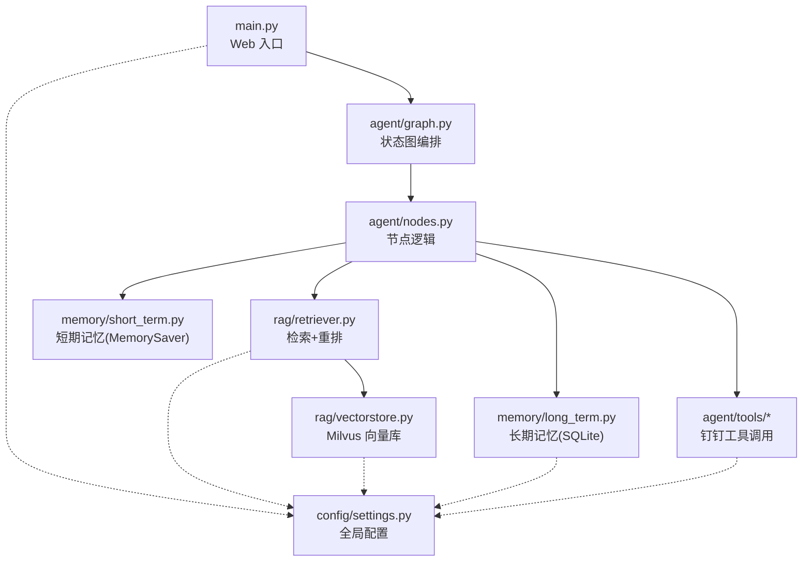
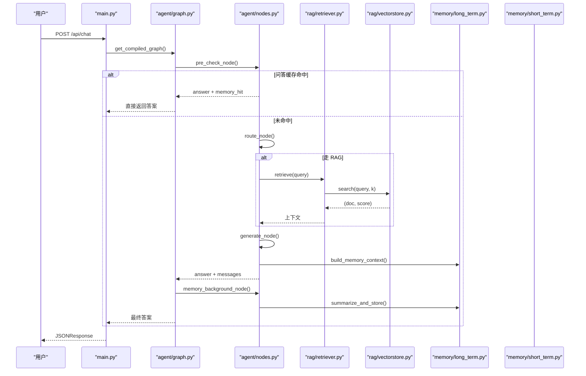
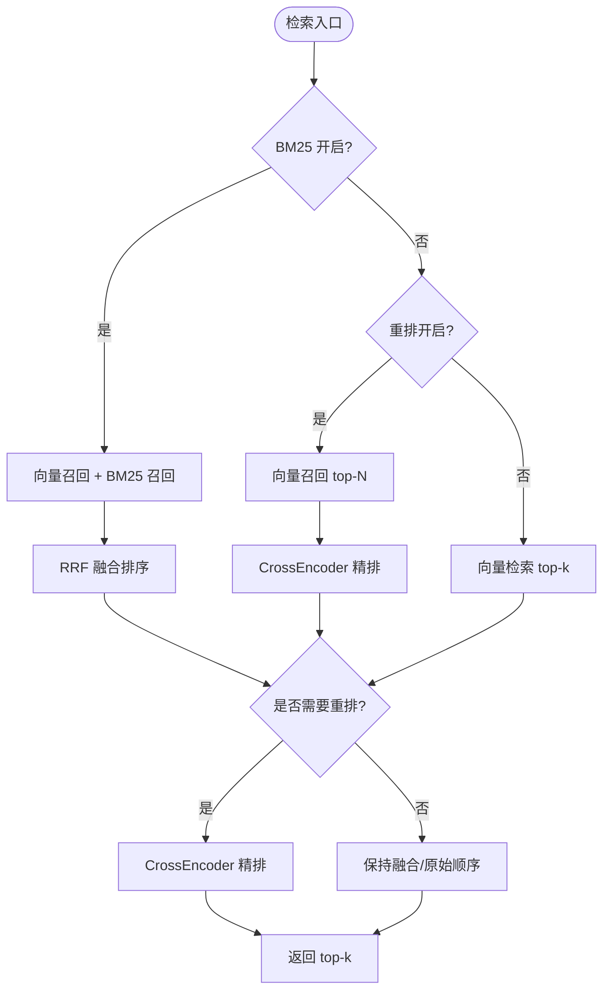
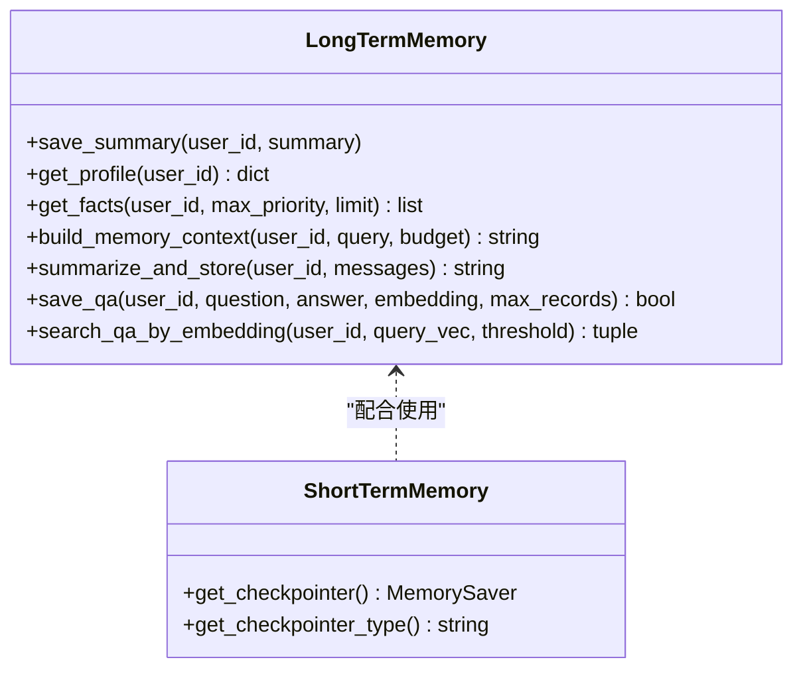
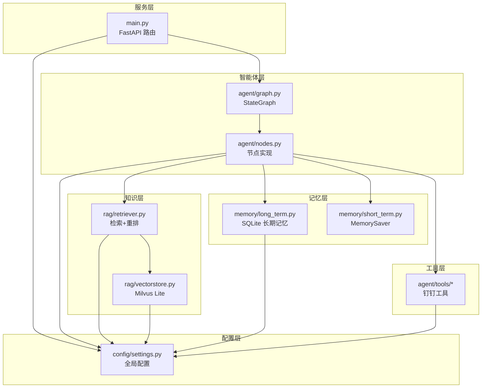
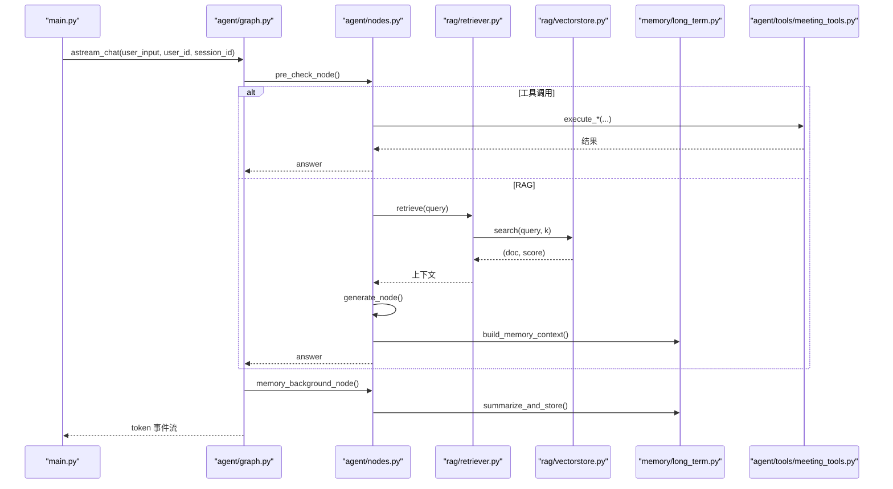

# 目录结构说明

<cite>
**本文引用的文件**
- [main.py](file://main.py)
- [config/settings.py](file://config/settings.py)
- [agent/graph.py](file://agent/graph.py)
- [agent/nodes.py](file://agent/nodes.py)
- [rag/retriever.py](file://rag/retriever.py)
- [rag/vectorstore.py](file://rag/vectorstore.py)
- [memory/long_term.py](file://memory/long_term.py)
- [memory/short_term.py](file://memory/short_term.py)
- [agent/tools/meeting_tools.py](file://agent/tools/meeting_tools.py)
</cite>

## 目录与职责总览
本项目采用“按功能域分目录”的组织方式，核心模块职责如下：
- agent：智能体工作流编排、节点实现、工具调用、安全与限流等。
- rag：检索增强生成（RAG）相关能力，包括向量库、检索器、重排序、OCR、入库、文件监听等。
- memory：长期记忆（SQLite 持久化）与短期记忆（进程内 checkpointer）。
- config：全局配置管理（环境变量/.env），统一被各模块读取。
- main：FastAPI 服务入口，提供 Web 聊天接口、健康检查、启动预热与 SSE 流式输出。

**图表来源**
- [main.py:45-136](file://main.py#L45-L136)
- [agent/graph.py:44-102](file://agent/graph.py#L44-L102)
- [agent/nodes.py:92-158](file://agent/nodes.py#L92-L158)
- [rag/retriever.py:18-52](file://rag/retriever.py#L18-L52)
- [rag/vectorstore.py:29-76](file://rag/vectorstore.py#L29-L76)
- [memory/long_term.py:30-47](file://memory/long_term.py#L30-L47)
- [memory/short_term.py:13-20](file://memory/short_term.py#L13-L20)
- [config/settings.py:19-216](file://config/settings.py#L19-L216)

**章节来源**
- [main.py:1-387](file://main.py#L1-L387)
- [config/settings.py:1-216](file://config/settings.py#L1-L216)

## 核心组件分析

### agent 模块
- graph.py：基于 LangGraph StateGraph 构建并编译智能体工作流，定义节点与边，支持同步/异步流式调用。
- nodes.py：实现预检查、路由、RAG 检索、联网搜索、长期记忆加载、生成回答、后台记忆更新、工具调用等节点逻辑。
- tools/*：封装钉钉待办/会议等工具的执行与结果格式化；time_parser 解析自然语言时间；tool_schemas 提供抽取提示词。

关键流程要点：
- 预检查阶段包含问答缓存匹配与路由判断，命中则短路返回，未命中进入四路分流（知识库/联网搜索/长期记忆/工具）。
- 生成完成后后台执行记忆更新（摘要合并、关键事实抽取、会话压缩摘要），不阻塞响应。
- 工具调用支持写操作确认机制，查询类直接执行。

**图表来源**
- [main.py:154-209](file://main.py#L154-L209)
- [agent/graph.py:44-102](file://agent/graph.py#L44-L102)
- [agent/nodes.py:92-158](file://agent/nodes.py#L92-L158)
- [rag/retriever.py:18-52](file://rag/retriever.py#L18-L52)
- [rag/vectorstore.py:164-184](file://rag/vectorstore.py#L164-L184)
- [memory/long_term.py:424-497](file://memory/long_term.py#L424-L497)

**章节来源**
- [agent/graph.py:1-255](file://agent/graph.py#L1-L255)
- [agent/nodes.py:1-780](file://agent/nodes.py#L1-L780)
- [agent/tools/meeting_tools.py:1-225](file://agent/tools/meeting_tools.py#L1-L225)

### rag 模块
- retriever.py：两阶段检索（向量召回 + CrossEncoder 重排），支持 BM25 多路召回与 RRF 融合，并提供上下文格式化。
- vectorstore.py：Milvus Lite 本地文件持久化的向量库封装，支持文本与图像文档混合存储，提供增删查与统计。
- 其他文件（embeddings、reranker、bm25、ingest、ocr、web_search、file_watcher）分别负责嵌入模型、重排序、关键词检索、文档入库、OCR、联网搜索与文件监听。

数据流向：
- 检索器根据配置选择路径：BM25 开启时并行召回后 RRF 融合；否则仅向量召回；均可选择是否重排。
- 向量库通过 Milvus Lite 本地 .db 文件持久化，写入加锁避免并发冲突。

**图表来源**
- [rag/retriever.py:18-52](file://rag/retriever.py#L18-L52)
- [rag/retriever.py:55-110](file://rag/retriever.py#L55-L110)
- [rag/vectorstore.py:164-184](file://rag/vectorstore.py#L164-L184)

**章节来源**
- [rag/retriever.py:1-140](file://rag/retriever.py#L1-L140)
- [rag/vectorstore.py:1-282](file://rag/vectorstore.py#L1-L282)

### memory 模块
- long_term.py：基于 SQLite 的长期记忆，分层结构化存储（用户画像、关键事实、历史摘要、会话压缩摘要、问答记忆缓存），支持增量摘要合并与规则快速抽取。
- short_term.py：基于 LangGraph MemorySaver 的短期记忆，按 session_id 维护会话上下文。

设计要点：
- 长期记忆采用预算控制的分层注入策略，P0（画像/高优先级事实）硬保留，P1/P2 按预算填充。
- 问答记忆缓存可跳过 LLM 直接复用历史答案，提升性能与一致性。
- 短期记忆由 checkpointer 管理，保证多轮对话连贯性。

**图表来源**
- [memory/long_term.py:30-47](file://memory/long_term.py#L30-L47)
- [memory/long_term.py:424-497](file://memory/long_term.py#L424-L497)
- [memory/long_term.py:729-800](file://memory/long_term.py#L729-L800)
- [memory/short_term.py:13-20](file://memory/short_term.py#L13-L20)

**章节来源**
- [memory/long_term.py:1-820](file://memory/long_term.py#L1-L820)
- [memory/short_term.py:1-28](file://memory/short_term.py#L1-L28)

### config 模块
- settings.py：集中管理所有子系统配置（LLM、Embedding、向量库、RAG、OCR、联网搜索、记忆、安全过滤、限流熔断、工具调用、LangSmith 等），提供属性解析与路径处理。

使用方式：
- 通过 get_settings() 获取单例配置，供各模块按需读取。
- 支持从环境变量或 .env 文件加载，便于部署与环境隔离。

**章节来源**
- [config/settings.py:1-216](file://config/settings.py#L1-L216)

## 架构总览

**图表来源**
- [main.py:45-136](file://main.py#L45-L136)
- [agent/graph.py:44-102](file://agent/graph.py#L44-L102)
- [agent/nodes.py:92-158](file://agent/nodes.py#L92-L158)
- [rag/retriever.py:18-52](file://rag/retriever.py#L18-L52)
- [rag/vectorstore.py:29-76](file://rag/vectorstore.py#L29-L76)
- [memory/long_term.py:424-497](file://memory/long_term.py#L424-L497)
- [memory/short_term.py:13-20](file://memory/short_term.py#L13-L20)
- [config/settings.py:19-216](file://config/settings.py#L19-L216)

## 依赖关系与数据流

- 入口到工作流：main.py 接收请求，调用 agent/graph.py 的编译图进行同步或异步流式执行。
- 节点到检索：nodes.py 的 retrieve_node 调用 rag/retriever.py，后者根据配置选择 BM25 多路召回或直接向量检索，并可启用 CrossEncoder 重排。
- 检索到向量库：retriever.py 通过 rag/vectorstore.py 访问 Milvus Lite，读写受写锁保护，确保并发安全。
- 节点到记忆：load_memory_node 从 memory/long_term.py 构建长期记忆上下文；graph 在生成后调用 memory_background_node 进行摘要合并与关键事实抽取；短期记忆由 checkpointer 管理。
- 节点到工具：tool_node 根据意图识别调用 agent/tools/* 中的具体工具，支持写操作确认。
- 配置贯穿：所有模块通过 config/settings.py 获取运行时参数，便于统一管理与环境切换。

**图表来源**
- [main.py:228-314](file://main.py#L228-L314)
- [agent/graph.py:208-255](file://agent/graph.py#L208-L255)
- [agent/nodes.py:647-780](file://agent/nodes.py#L647-L780)
- [rag/retriever.py:18-52](file://rag/retriever.py#L18-L52)
- [rag/vectorstore.py:164-184](file://rag/vectorstore.py#L164-L184)
- [memory/long_term.py:613-633](file://memory/long_term.py#L613-L633)
- [agent/tools/meeting_tools.py:17-47](file://agent/tools/meeting_tools.py#L17-L47)

## 性能与可靠性要点
- 启动预热：main.py 在启动时预热 LLM 连接与向量库索引，降低首请求延迟。
- 流式输出：SSE 流式接口支持整体超时保护，避免连接卡死。
- 并发安全：向量库写入加锁，SQLite 长记忆使用 WAL 模式与线程锁，避免并发冲突。
- 降级与容错：主模型失败自动尝试备用模型；检索失败回退为原始结果；文件监听失败不影响服务可用性。

[本节为通用指导，无需特定文件引用]

## 故障排查指南
- 向量库为空：启动时会检测并触发全量重建；若仍为空，检查 data/docs 清单与入库任务日志。
- 检索结果为空：检查 rerank_enabled 与 rag_bm25_enabled 配置；确认向量库集合存在且已 flush。
- 长期记忆异常：检查 SQLite 文件权限与 WAL 模式；查看摘要合并与关键事实抽取的异常日志。
- 工具调用失败：确认 dingtalk_lib 可用与会话上下文；写操作需用户确认后再执行。

**章节来源**
- [main.py:80-136](file://main.py#L80-L136)
- [rag/vectorstore.py:193-223](file://rag/vectorstore.py#L193-L223)
- [memory/long_term.py:30-47](file://memory/long_term.py#L30-L47)
- [agent/tools/meeting_tools.py:50-129](file://agent/tools/meeting_tools.py#L50-L129)

## 结论
本项目的目录组织清晰、职责明确：main 作为服务入口，agent 编排智能体工作流，rag 提供检索增强能力，memory 保障跨会话记忆，config 统一管理配置。通过模块化设计与完善的错误处理、性能优化与降级策略，便于新开发者快速理解与维护扩展。建议后续扩展遵循现有分层与命名规范，新增功能优先以节点或工具形式接入，并通过 settings 暴露可配置项。

[本节为总结性内容，无需特定文件引用]