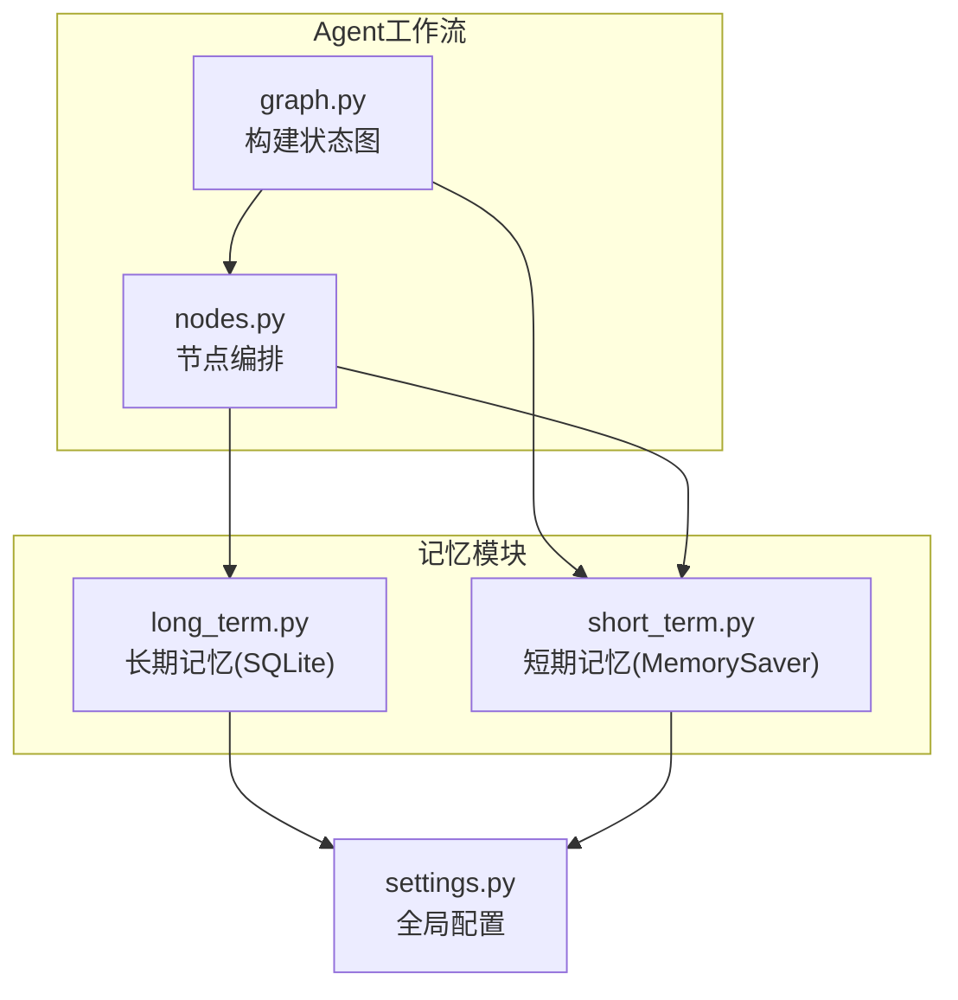
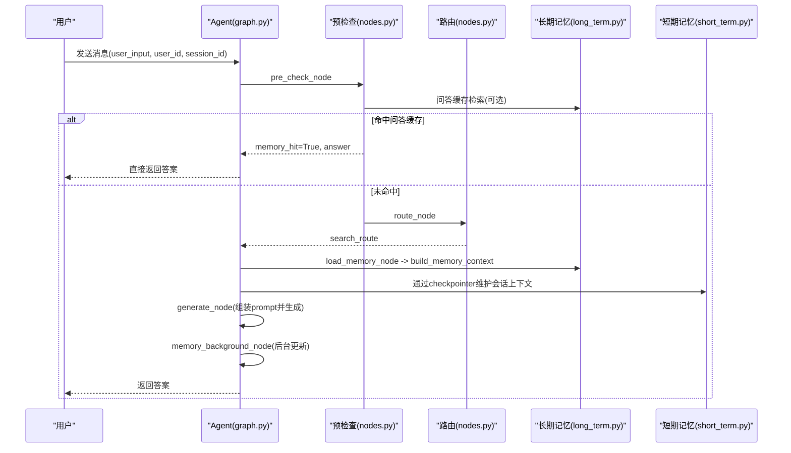
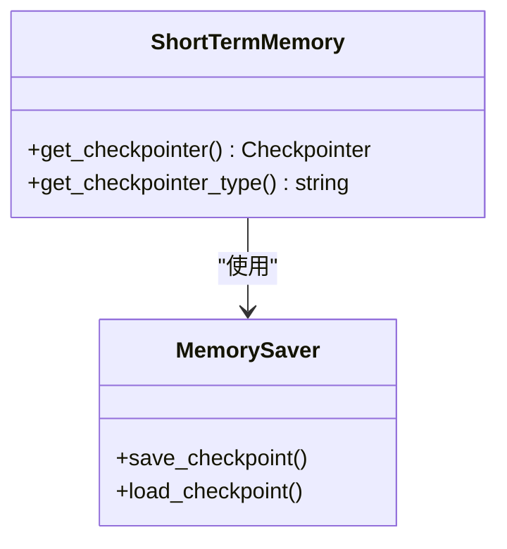
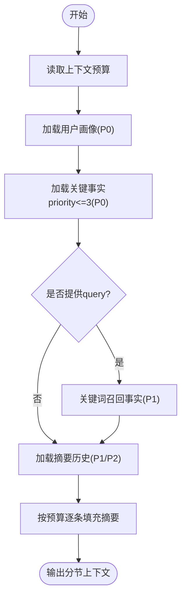
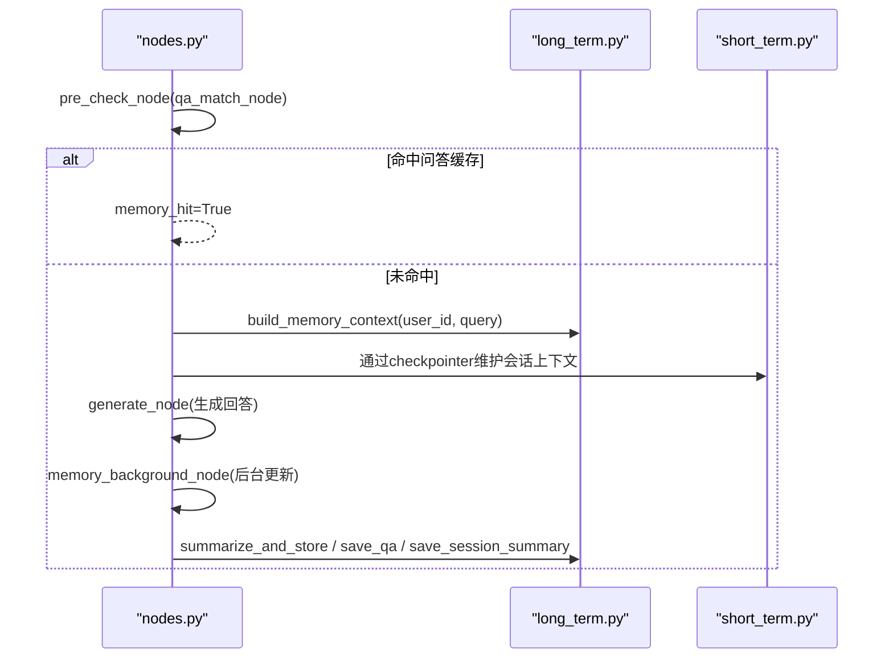
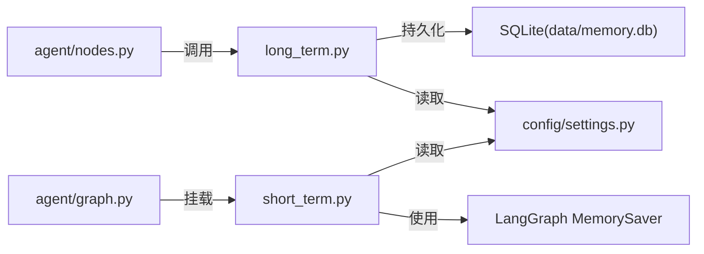

# 记忆管理模块目录

<cite>
**本文引用的文件**
- [memory/short_term.py](file://memory/short_term.py)
- [memory/long_term.py](file://memory/long_term.py)
- [config/settings.py](file://config/settings.py)
- [agent/graph.py](file://agent/graph.py)
- [agent/nodes.py](file://agent/nodes.py)
</cite>

## 目录
1. [简介](#简介)
2. [项目结构](#项目结构)
3. [核心组件](#核心组件)
4. [架构总览](#架构总览)
5. [详细组件分析](#详细组件分析)
6. [依赖关系分析](#依赖关系分析)
7. [性能与优化](#性能与优化)
8. [故障排查指南](#故障排查指南)
9. [结论](#结论)
10. [附录：接口与扩展指南](#附录接口与扩展指南)

## 简介
本模块提供智能体的“短期会话记忆”和“长期用户记忆”能力，支撑多轮对话连贯性与跨会话的用户画像、关键事实、问答缓存等持久化能力。短期记忆基于进程内检查点（MemorySaver），按会话线程维护交互历史；长期记忆基于 SQLite 持久化，采用分层结构化存储与预算控制，确保高优先级信息不丢失，并通过后台异步任务更新摘要与压缩会话上下文。

## 项目结构
记忆相关代码位于 memory 目录，分为两个子模块：
- short_term.py：短期会话记忆，使用 LangGraph 的 MemorySaver 作为 checkpointer，按 thread_id（= session_id）维护会话上下文。
- long_term.py：长期用户记忆，基于 SQLite 持久化，包含用户画像、关键事实、摘要历史、会话压缩摘要、问答记忆缓存等表结构与读写逻辑。

配置集中在 config/settings.py，提供数据库路径、摘要触发频率、上下文预算、窗口大小、问答缓存阈值等开关与参数。

图表来源
- [agent/graph.py:44-102](file://agent/graph.py#L44-L102)
- [agent/nodes.py:344-360](file://agent/nodes.py#L344-L360)
- [memory/short_term.py:13-27](file://memory/short_term.py#L13-L27)
- [memory/long_term.py:30-47](file://memory/long_term.py#L30-L47)
- [config/settings.py:114-133](file://config/settings.py#L114-L133)

章节来源
- [memory/short_term.py:1-28](file://memory/short_term.py#L1-L28)
- [memory/long_term.py:1-15](file://memory/long_term.py#L1-L15)
- [config/settings.py:114-133](file://config/settings.py#L114-L133)
- [agent/graph.py:44-102](file://agent/graph.py#L44-L102)
- [agent/nodes.py:344-360](file://agent/nodes.py#L344-L360)

## 核心组件
- 短期会话记忆（short_term.py）
  - 单例 MemorySaver，按 thread_id 维护会话上下文，支持多轮对话连贯性。
  - 提供 get_checkpointer() 与 get_checkpointer_type() 获取后端类型标识。
- 长期用户记忆（long_term.py）
  - SQLite 持久化，WAL 模式提升并发读性能。
  - 分层结构化记忆：用户画像（P0）、关键事实（P0/P1）、摘要历史（P1/P2）、会话压缩摘要、问答记忆缓存。
  - 提供保存/查询/摘要生成/增量合并/关键词召回/相似度检索等接口。
- 配置（settings.py）
  - 记忆相关开关与参数：数据库路径、摘要周期、上下文预算、短期窗口、问答缓存阈值与上限等。

章节来源
- [memory/short_term.py:13-27](file://memory/short_term.py#L13-L27)
- [memory/long_term.py:30-47](file://memory/long_term.py#L30-L47)
- [memory/long_term.py:50-125](file://memory/long_term.py#L50-L125)
- [config/settings.py:114-133](file://config/settings.py#L114-L133)

## 架构总览
记忆在 Agent 工作流中的位置与调用链如下：
- 预检查阶段进行问答缓存匹配（相似问题直接复用历史答案）。
- 路由后可能进入知识库检索、联网搜索或加载长期记忆。
- 生成回答后，后台执行关键信息抽取与长期记忆更新（摘要、事实、会话压缩摘要、问答缓存）。

图表来源
- [agent/graph.py:44-102](file://agent/graph.py#L44-L102)
- [agent/nodes.py:92-151](file://agent/nodes.py#L92-L151)
- [agent/nodes.py:232-281](file://agent/nodes.py#L232-L281)
- [agent/nodes.py:344-360](file://agent/nodes.py#L344-L360)
- [memory/long_term.py:424-497](file://memory/long_term.py#L424-L497)
- [memory/short_term.py:13-27](file://memory/short_term.py#L13-L27)

## 详细组件分析

### 短期会话记忆（short_term.py）
- 设计要点
  - 使用 LangGraph 的 MemorySaver 作为 checkpointer，按 thread_id（即 session_id）维护会话上下文。
  - 进程内内存存储，无需外部服务，适合轻量部署与评估场景。
- 生命周期
  - 启动时懒加载创建单例 MemorySaver。
  - 每次图执行通过 thread_id 隔离不同会话的上下文。
- 集成方式
  - graph.py 在编译图时自动挂载 checkpointer；若传入 None 则从 memory.short_term.get_checkpointer() 获取。
- 性能特性
  - 无网络 IO，低延迟；但进程重启后上下文丢失。

图表来源
- [memory/short_term.py:13-27](file://memory/short_term.py#L13-L27)
- [agent/graph.py:94-102](file://agent/graph.py#L94-L102)

章节来源
- [memory/short_term.py:1-28](file://memory/short_term.py#L1-L28)
- [agent/graph.py:94-102](file://agent/graph.py#L94-L102)

### 长期用户记忆（long_term.py）
- 数据模型与表结构
  - user_memory：用户对话摘要与轮次计数。
  - user_prefs：旧版偏好表（兼容迁移）。
  - summary_history：摘要历史（保留最近若干条）。
  - user_profile：用户画像字段（name/nickname/role/project/company）。
  - user_facts：关键事实（带优先级 priority 1-10）。
  - session_summary：会话压缩摘要（覆盖消息条数 covered_until）。
  - qa_memory：问答记忆缓存（question/answer/embedding/hit_count）。
  - memory_meta：元数据（如迁移标记）。
- 存储机制
  - SQLite 连接单例，开启 WAL 模式与 busy_timeout，提升并发读性能。
  - 写操作通过线程锁 _db_lock 串行化，避免并发写入冲突。
- 分层上下文构建（build_memory_context）
  - P0：用户画像 + 关键事实（priority<=3）硬保留，不受预算限制。
  - P1：关键词召回事实 + 最近 2 条摘要，按预算填充。
  - P2：更早摘要，剩余预算填充，超额丢弃。
- 摘要与事实管理
  - summarize_and_store：LLM 生成/合并摘要，提取关键事实并落库（priority=3）。
  - save_summary/save_fact/get_summary/get_history：摘要与事实的增删改查。
- 会话压缩摘要
  - save_session_summary/get_session_summary/get_session_coverage：当短期窗口超出时，将旧消息压缩为摘要并持久化，防止上下文硬丢失。
- 问答记忆缓存
  - save_qa/search_qa_by_embedding：将问答对与向量存入 SQLite，后续相似问题通过余弦相似度检索命中，直接复用答案，跳过 LLM。
- 规则快速抽取
  - extract_key_info/apply_extraction：零 LLM 成本快速抽取姓名、项目、公司等关键信息并落库，保证高优先级信息当轮生效。

图表来源
- [memory/long_term.py:424-497](file://memory/long_term.py#L424-L497)
- [memory/long_term.py:50-125](file://memory/long_term.py#L50-L125)

章节来源
- [memory/long_term.py:30-47](file://memory/long_term.py#L30-L47)
- [memory/long_term.py:50-125](file://memory/long_term.py#L50-L125)
- [memory/long_term.py:172-221](file://memory/long_term.py#L172-L221)
- [memory/long_term.py:224-313](file://memory/long_term.py#L224-L313)
- [memory/long_term.py:340-407](file://memory/long_term.py#L340-L407)
- [memory/long_term.py:424-497](file://memory/long_term.py#L424-L497)
- [memory/long_term.py:561-633](file://memory/long_term.py#L561-L633)
- [memory/long_term.py:636-697](file://memory/long_term.py#L636-L697)
- [memory/long_term.py:729-818](file://memory/long_term.py#L729-L818)

### 工作流集成（graph.py 与 nodes.py）
- 图构建与 checkpointer 挂载
  - graph.py 在编译图时自动挂载 MemorySaver，按 thread_id 维护短期上下文。
- 预检查与问答缓存
  - nodes.py 的 pre_check_node 先执行 qa_match_node，命中则短路到 END，直接返回历史答案。
- 长期记忆加载
  - load_memory_node 调用 long_term.build_memory_context 与 get_session_summary，注入系统提示与历史摘要。
- 后台记忆更新
  - memory_background_node 顺序执行 extract_facts_node 与 memory_update_node，内部异常不影响主链路。
  - memory_update_node 周期性触发 summarize_and_store，并在短期窗口超出时刷新会话压缩摘要。
  - _save_qa_cache 将本轮问答对与向量存入问答记忆，供后续相似问题复用。

图表来源
- [agent/nodes.py:92-151](file://agent/nodes.py#L92-L151)
- [agent/nodes.py:232-281](file://agent/nodes.py#L232-L281)
- [agent/nodes.py:344-360](file://agent/nodes.py#L344-L360)
- [agent/nodes.py:535-643](file://agent/nodes.py#L535-L643)
- [memory/long_term.py:424-497](file://memory/long_term.py#L424-L497)
- [memory/long_term.py:561-633](file://memory/long_term.py#L561-L633)
- [memory/long_term.py:729-818](file://memory/long_term.py#L729-L818)

章节来源
- [agent/graph.py:44-102](file://agent/graph.py#L44-L102)
- [agent/nodes.py:92-151](file://agent/nodes.py#L92-L151)
- [agent/nodes.py:232-281](file://agent/nodes.py#L232-L281)
- [agent/nodes.py:344-360](file://agent/nodes.py#L344-L360)
- [agent/nodes.py:535-643](file://agent/nodes.py#L535-L643)

## 依赖关系分析
- 短期记忆依赖 LangGraph 的 MemorySaver，用于会话级上下文持久化。
- 长期记忆依赖 SQLite，通过 settings.py 配置数据库路径与行为参数。
- 工作流节点依赖 long_term 提供的上下文构建、摘要生成、问答缓存检索等接口。
- 配置集中管理，便于统一调整记忆策略与性能参数。

图表来源
- [memory/short_term.py:13-27](file://memory/short_term.py#L13-L27)
- [memory/long_term.py:30-47](file://memory/long_term.py#L30-L47)
- [config/settings.py:114-133](file://config/settings.py#L114-L133)
- [agent/graph.py:94-102](file://agent/graph.py#L94-L102)
- [agent/nodes.py:344-360](file://agent/nodes.py#L344-L360)

章节来源
- [memory/short_term.py:13-27](file://memory/short_term.py#L13-L27)
- [memory/long_term.py:30-47](file://memory/long_term.py#L30-L47)
- [config/settings.py:114-133](file://config/settings.py#L114-L133)
- [agent/graph.py:94-102](file://agent/graph.py#L94-L102)
- [agent/nodes.py:344-360](file://agent/nodes.py#L344-L360)

## 性能与优化
- 短期记忆
  - 进程内 MemorySaver，低延迟；注意进程重启后上下文丢失。
  - 通过 thread_id 隔离会话，避免上下文污染。
- 长期记忆
  - SQLite WAL 模式提升并发读性能；写操作通过线程锁串行化，避免竞争。
  - 分层上下文构建与预算控制，确保高优先级信息不丢失，同时控制 prompt 长度。
  - 问答记忆缓存减少重复 LLM 调用，提高响应速度与降低成本。
  - 会话压缩摘要避免短窗口外消息被硬丢，保持主线上下文连贯。
- 配置调优建议
  - memory_summary_every：控制摘要触发频率，平衡实时性与开销。
  - memory_context_budget：控制长期记忆上下文长度，避免过大影响生成质量。
  - memory_short_window 与 memory_history_budget：控制短期历史窗口与字符预算。
  - memory_qa_threshold 与 memory_qa_max_records：调节问答缓存命中率与存储上限。

[本节为通用性能讨论，不直接分析具体文件]

## 故障排查指南
- 长期记忆加载失败
  - 现象：load_memory_node 捕获异常并降级为空上下文。
  - 排查：检查 SQLite 文件路径与权限；确认 _init_tables 成功执行。
- 问答缓存检索失败
  - 现象：qa_match_node 捕获异常并降级为未命中。
  - 排查：确认 embedding 可用；检查 qa_memory 表结构与索引；调整 threshold。
- 后台记忆更新失败
  - 现象：memory_update_node 捕获异常但不阻断主链路。
  - 排查：检查 summarize_and_store 与 save_qa 的异常日志；确认 LLM 与 SQLite 可用性。
- 会话压缩摘要未刷新
  - 现象：_refresh_session_summary 未触发或摘要为空。
  - 排查：确认短期窗口设置与消息数量；检查 covered_until 与阈值判断逻辑。

章节来源
- [agent/nodes.py:344-360](file://agent/nodes.py#L344-L360)
- [agent/nodes.py:232-281](file://agent/nodes.py#L232-L281)
- [agent/nodes.py:535-643](file://agent/nodes.py#L535-L643)
- [memory/long_term.py:50-125](file://memory/long_term.py#L50-L125)
- [memory/long_term.py:729-818](file://memory/long_term.py#L729-L818)

## 结论
记忆管理模块通过短期会话记忆与长期用户记忆的协同，实现了多轮对话连贯性与跨会话的用户画像、关键事实、问答缓存等能力。短期记忆基于进程内 MemorySaver，简单高效；长期记忆基于 SQLite，采用分层结构化存储与预算控制，确保高优先级信息不丢失。工作流集成良好，后台异步更新不阻塞主链路，具备可扩展性与可维护性。

[本节为总结性内容，不直接分析具体文件]

## 附录：接口与扩展指南

### 短期会话记忆接口
- get_checkpointer()：返回 MemorySaver 单例，用于图编译时挂载。
- get_checkpointer_type()：返回当前 checkpointer 类型标识（默认 "memory"）。

章节来源
- [memory/short_term.py:13-27](file://memory/short_term.py#L13-L27)

### 长期用户记忆接口
- 摘要与事实
  - save_summary(user_id, summary)：保存/更新用户对话摘要。
  - get_summary(user_id)：获取最新摘要。
  - get_history(user_id, limit)：获取最近若干条摘要历史。
  - save_fact(user_id, fact, priority, source)：保存关键事实。
  - get_facts(user_id, max_priority, limit)：获取关键事实列表。
  - search_facts(user_id, keywords, limit)：关键词召回事实。
- 会话压缩摘要
  - save_session_summary(session_id, user_id, summary, covered_until)：保存会话压缩摘要。
  - get_session_summary(session_id)：获取会话压缩摘要。
  - get_session_coverage(session_id)：获取已覆盖的消息条数。
- 问答记忆缓存
  - save_qa(user_id, question, answer, embedding, max_records)：保存问答对与向量。
  - search_qa_by_embedding(user_id, query_vec, threshold)：相似度检索命中历史答案。
- 上下文构建
  - build_memory_context(user_id, query, budget)：分层构建长期记忆上下文。
- 增量摘要
  - summarize_and_store(user_id, messages)：生成/合并摘要并落库。
- 规则快速抽取
  - apply_extraction(user_id, user_input)：快速抽取高优先级信息并落库。

章节来源
- [memory/long_term.py:172-221](file://memory/long_term.py#L172-L221)
- [memory/long_term.py:224-313](file://memory/long_term.py#L224-L313)
- [memory/long_term.py:340-407](file://memory/long_term.py#L340-L407)
- [memory/long_term.py:424-497](file://memory/long_term.py#L424-L497)
- [memory/long_term.py:561-633](file://memory/long_term.py#L561-L633)
- [memory/long_term.py:636-697](file://memory/long_term.py#L636-L697)
- [memory/long_term.py:729-818](file://memory/long_term.py#L729-L818)

### 配置项说明（记忆相关）
- long_term_db_path：长期记忆 SQLite 数据库路径。
- memory_summary_every：每多少轮对话触发一次长期记忆摘要。
- memory_context_budget：长期记忆上下文字符预算。
- memory_short_window：短期历史窗口（注入生成的最近消息条数）。
- memory_history_budget：短期历史字符预算。
- memory_qa_cache_enabled：问答记忆缓存开关。
- memory_qa_threshold：问答记忆命中的余弦相似度阈值。
- memory_qa_max_records：每用户最多保留的问答记忆条数。

章节来源
- [config/settings.py:114-133](file://config/settings.py#L114-L133)

### 扩展开发指南
- 新增长期记忆字段
  - 在 _init_tables 中增加新表或字段，并确保幂等初始化。
  - 在对应接口中实现读写逻辑，并在 build_memory_context 中考虑预算与优先级。
- 自定义问答缓存策略
  - 调整 memory_qa_threshold 与 memory_qa_max_records，或扩展相似度算法。
- 替换短期记忆后端
  - 实现新的 checkpointer 并替换 get_checkpointer() 的实现，确保与 LangGraph 兼容。
- 集成外部存储
  - 将 SQLite 替换为其他持久化方案（如 Redis、PostgreSQL），需保持接口一致性与事务安全。

[本节为扩展指导，不直接分析具体文件]