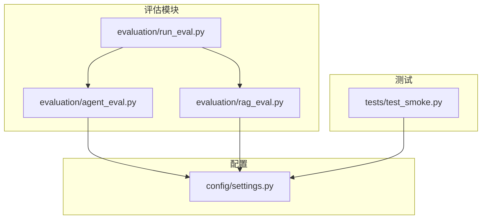
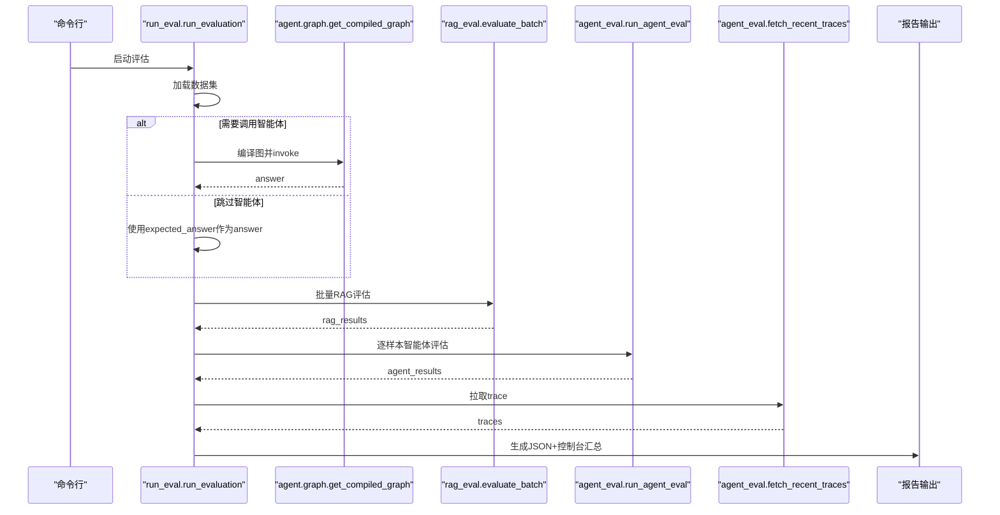
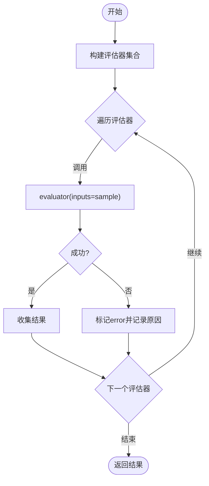
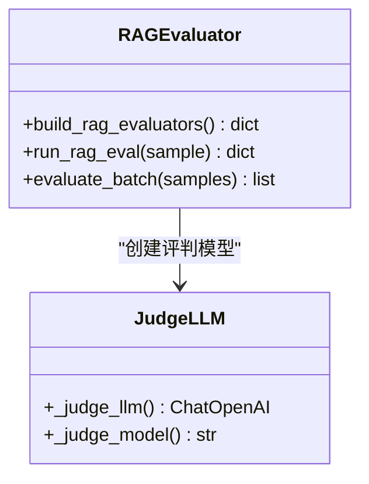
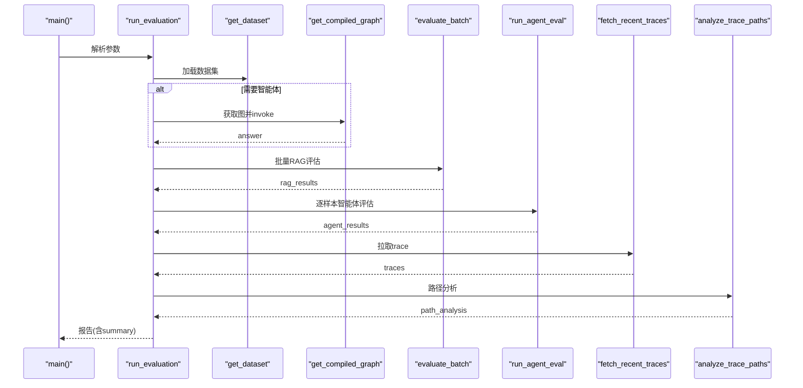
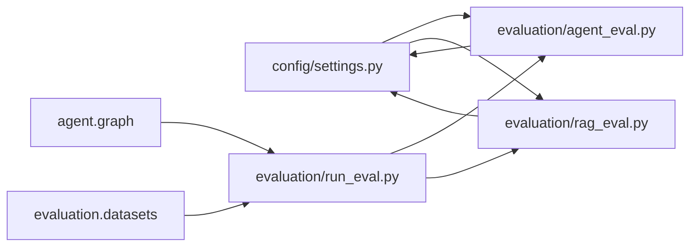

# 评估测试模块目录

<cite>
**本文引用的文件**
- [evaluation/agent_eval.py](file://evaluation/agent_eval.py)
- [evaluation/rag_eval.py](file://evaluation/rag_eval.py)
- [evaluation/run_eval.py](file://evaluation/run_eval.py)
- [tests/test_smoke.py](file://tests/test_smoke.py)
- [config/settings.py](file://config/settings.py)
</cite>

## 目录
1. [简介](#简介)
2. [项目结构](#项目结构)
3. [核心组件](#核心组件)
4. [架构总览](#架构总览)
5. [详细组件分析](#详细组件分析)
6. [依赖关系分析](#依赖关系分析)
7. [性能与基准](#性能与基准)
8. [故障排查指南](#故障排查指南)
9. [结论](#结论)
10. [附录：使用与编写指南](#附录使用与编写指南)

## 简介
本文件面向“智能体评估、RAG检索评估、测试执行脚本”的目录结构与测试框架，系统性说明评估指标定义、测试用例编写方法、性能基准测试与结果分析方法。目标是帮助读者快速理解并正确使用评估体系，同时为扩展新的评估维度提供清晰指引。

## 项目结构
评估相关代码集中在 evaluation 目录，冒烟测试位于 tests 目录，配置集中于 config 目录。整体组织遵循“按功能划分”的原则：
- evaluation：智能体评估、RAG评估、统一运行入口
- tests：冒烟测试，覆盖导入、基础能力与关键路径
- config：全局配置（含 LLM、LangSmith、RAG、OCR、搜索等）

图表来源
- [evaluation/run_eval.py:23-105](file://evaluation/run_eval.py#L23-L105)
- [evaluation/agent_eval.py:18-70](file://evaluation/agent_eval.py#L18-L70)
- [evaluation/rag_eval.py:24-121](file://evaluation/rag_eval.py#L24-L121)
- [config/settings.py:157-161](file://config/settings.py#L157-L161)

章节来源
- [evaluation/agent_eval.py:1-139](file://evaluation/agent_eval.py#L1-L139)
- [evaluation/rag_eval.py:1-121](file://evaluation/rag_eval.py#L1-L121)
- [evaluation/run_eval.py:1-156](file://evaluation/run_eval.py#L1-L156)
- [tests/test_smoke.py:1-366](file://tests/test_smoke.py#L1-L366)
- [config/settings.py:1-216](file://config/settings.py#L1-L216)

## 核心组件
- 智能体评估器（agent_eval）
  - 构建三个评估器：正确性、幻觉检测、推理路径合理性
  - 通过 OpenEvals 的 LLM-as-a-Judge 实现评分与推理说明
  - 支持从 LangSmith 拉取 trace 进行路径成功率统计
- RAG 评估器（rag_eval）
  - 构建四个评估器：检索相关性、忠实度、帮助度、答案相关性
  - 批量评估接口，返回每个样本的评估结果
- 统一运行入口（run_eval）
  - 加载数据集、可选调用智能体获取回答、执行 RAG 与智能体评估
  - 拉取 LangSmith trace 做路径分析，输出 JSON 报告与控制台汇总
- 冒烟测试（test_smoke）
  - 验证配置、记忆、图编译、RAG 上下文格式化、向量库函数、重排序、联网搜索等基础能力
  - 包含对评估模块导入与数据集可用性的断言

章节来源
- [evaluation/agent_eval.py:33-70](file://evaluation/agent_eval.py#L33-L70)
- [evaluation/rag_eval.py:63-121](file://evaluation/rag_eval.py#L63-L121)
- [evaluation/run_eval.py:23-105](file://evaluation/run_eval.py#L23-L105)
- [tests/test_smoke.py:170-177](file://tests/test_smoke.py#L170-L177)

## 架构总览
评估流程由 run_eval 编排，串联数据加载、智能体调用（可选）、RAG 评估、智能体评估、LangSmith trace 分析与报告输出。

图表来源
- [evaluation/run_eval.py:23-105](file://evaluation/run_eval.py#L23-L105)
- [evaluation/rag_eval.py:89-121](file://evaluation/rag_eval.py#L89-L121)
- [evaluation/agent_eval.py:57-70](file://evaluation/agent_eval.py#L57-L70)
- [evaluation/agent_eval.py:96-139](file://evaluation/agent_eval.py#L96-L139)

## 详细组件分析

### 智能体评估模块（agent_eval）
- 评估维度
  - 正确性：对比回答与参考答案的一致性
  - 幻觉检测：判断回答是否基于参考上下文，避免编造
  - 推理路径合理性：结合 LangSmith trace 统计成功率
- 评判模型
  - 通过配置读取 llm_judge_model、llm_api_key、llm_base_url，构造 ChatOpenAI 实例
- 评估器构建
  - 使用 OpenEvals 的 create_llm_as_judge 与预置 prompt 模板
- 运行方式
  - run_agent_eval 对单个样本执行全部评估器，异常时记录错误信息
- LangSmith 集成
  - get_langsmith_client 根据 langsmith_api_key 初始化客户端
  - fetch_recent_traces 拉取最近运行，analyze_trace_paths 计算成功率

图表来源
- [evaluation/agent_eval.py:33-70](file://evaluation/agent_eval.py#L33-L70)

章节来源
- [evaluation/agent_eval.py:18-70](file://evaluation/agent_eval.py#L18-L70)
- [evaluation/agent_eval.py:73-139](file://evaluation/agent_eval.py#L73-L139)
- [config/settings.py:29-48](file://config/settings.py#L29-L48)
- [config/settings.py:157-161](file://config/settings.py#L157-L161)

### RAG 评估模块（rag_eval）
- 评估维度
  - 检索相关性：文档是否与问题相关
  - 忠实度：答案是否基于检索到的上下文
  - 帮助度：回答对用户是否有用
  - 答案相关性：回答是否切题
- 评估器构建
  - 使用统一的 _make_evaluator 封装 create_llm_as_judge，传入对应 prompt 与输入映射
- 批量评估
  - evaluate_batch 对样本列表逐一评估，附加 evaluation 字段到原样本

图表来源
- [evaluation/rag_eval.py:24-87](file://evaluation/rag_eval.py#L24-L87)
- [evaluation/rag_eval.py:89-121](file://evaluation/rag_eval.py#L89-L121)

章节来源
- [evaluation/rag_eval.py:1-121](file://evaluation/rag_eval.py#L1-L121)
- [config/settings.py:29-48](file://config/settings.py#L29-L48)

### 评估运行入口（run_eval）
- 功能
  - 加载数据集（来自 evaluation.datasets.get_dataset）
  - 可选调用智能体获取回答（通过 agent.graph.get_compiled_graph）
  - 执行 RAG 评估与智能体评估
  - 拉取 LangSmith trace 并进行路径分析
  - 输出 JSON 报告与控制台汇总表格
- 参数
  - --no-agent：跳过智能体调用，使用数据集自带 expected_answer
  - --output/-o：指定报告输出路径
- 汇总逻辑
  - _summarize 聚合各维度平均分
  - _print_summary 打印结构化摘要

图表来源
- [evaluation/run_eval.py:23-105](file://evaluation/run_eval.py#L23-L105)
- [evaluation/run_eval.py:108-143](file://evaluation/run_eval.py#L108-L143)
- [evaluation/run_eval.py:146-156](file://evaluation/run_eval.py#L146-L156)

章节来源
- [evaluation/run_eval.py:1-156](file://evaluation/run_eval.py#L1-L156)

### 冒烟测试（test_smoke）
- 覆盖范围
  - 配置导入与校验
  - 长期记忆规则抽取、预算控制、上下文压缩
  - 短期窗口压缩与摘要注入
  - 问答缓存相似度匹配
  - AgentState 类型定义、图编译
  - 评估模块导入与数据集可用性
  - RAG 上下文格式化、多模态 Embedding、向量库函数
  - 重排序与联网搜索模块导入与配置项
- 运行方式
  - pytest 或直接执行脚本

章节来源
- [tests/test_smoke.py:15-26](file://tests/test_smoke.py#L15-L26)
- [tests/test_smoke.py:39-93](file://tests/test_smoke.py#L39-L93)
- [tests/test_smoke.py:96-117](file://tests/test_smoke.py#L96-L117)
- [tests/test_smoke.py:119-147](file://tests/test_smoke.py#L119-L147)
- [tests/test_smoke.py:150-167](file://tests/test_smoke.py#L150-L167)
- [tests/test_smoke.py:170-177](file://tests/test_smoke.py#L170-L177)
- [tests/test_smoke.py:180-189](file://tests/test_smoke.py#L180-L189)
- [tests/test_smoke.py:192-210](file://tests/test_smoke.py#L192-L210)
- [tests/test_smoke.py:213-221](file://tests/test_smoke.py#L213-L221)
- [tests/test_smoke.py:224-234](file://tests/test_smoke.py#L224-L234)
- [tests/test_smoke.py:237-250](file://tests/test_smoke.py#L237-L250)
- [tests/test_smoke.py:253-273](file://tests/test_smoke.py#L253-L273)
- [tests/test_smoke.py:276-315](file://tests/test_smoke.py#L276-L315)
- [tests/test_smoke.py:318-326](file://tests/test_smoke.py#L318-L326)

## 依赖关系分析
- 外部依赖
  - OpenEvals：用于 LLM-as-a-Judge 与预置 prompt
  - LangChain OpenAI：构造评判模型
  - LangSmith：拉取 trace 做路径分析
- 内部依赖
  - config.settings：集中管理所有配置项（LLM、RAG、LangSmith 等）
  - agent.graph：编译并运行智能体图（可选）
  - evaluation.datasets：提供评估数据集

图表来源
- [evaluation/run_eval.py:23-105](file://evaluation/run_eval.py#L23-L105)
- [evaluation/agent_eval.py:18-70](file://evaluation/agent_eval.py#L18-L70)
- [evaluation/rag_eval.py:24-87](file://evaluation/rag_eval.py#L24-L87)
- [config/settings.py:29-48](file://config/settings.py#L29-L48)
- [config/settings.py:157-161](file://config/settings.py#L157-L161)

章节来源
- [evaluation/run_eval.py:23-105](file://evaluation/run_eval.py#L23-L105)
- [evaluation/agent_eval.py:18-70](file://evaluation/agent_eval.py#L18-L70)
- [evaluation/rag_eval.py:24-87](file://evaluation/rag_eval.py#L24-L87)
- [config/settings.py:29-48](file://config/settings.py#L29-L48)
- [config/settings.py:157-161](file://config/settings.py#L157-L161)

## 性能与基准
- 评估耗时
  - RAG 与智能体评估均依赖 LLM 评判，单次评估可能涉及多次模型调用；批量评估会逐条打印进度
- 资源占用
  - 评判模型 temperature 固定为 0，保证稳定性；可通过配置切换模型以平衡质量与成本
- 建议基准
  - 在相同数据集上重复运行，记录平均耗时与分数方差
  - 调整 rerank_top_k、rag_top_k、rerank_candidate_count 等参数观察效果变化
  - 关闭或开启 LangSmith trace 拉取，比较端到端耗时差异

[本节为通用指导，不直接分析具体文件]

## 故障排查指南
- 未配置 LangSmith API Key
  - 现象：无法拉取 trace，路径分析为空
  - 处理：设置 langsmith_api_key，或通过环境变量配置
- 评判模型不可用
  - 现象：评估失败，返回 error 标志与原因
  - 处理：检查 llm_judge_model、llm_api_key、llm_base_url 配置
- 智能体调用失败
  - 现象：answer 被替换为错误提示
  - 处理：检查 agent.graph 编译与 invoke 配置（thread_id、session_id）
- 数据集为空或导入失败
  - 现象：评估无样本
  - 处理：确认 evaluation.datasets.get_dataset 可正常返回数据

章节来源
- [evaluation/agent_eval.py:73-93](file://evaluation/agent_eval.py#L73-L93)
- [evaluation/agent_eval.py:96-123](file://evaluation/agent_eval.py#L96-L123)
- [evaluation/run_eval.py:37-72](file://evaluation/run_eval.py#L37-L72)
- [config/settings.py:157-161](file://config/settings.py#L157-L161)

## 结论
该评估体系通过 OpenEvals 的 LLM-as-a-Judge 实现了多维度自动化评测，并结合 LangSmith trace 进行路径合理性分析。run_eval 提供了统一的运行入口与报告输出，便于持续集成与回归测试。配合冒烟测试，可确保系统基础能力稳定。建议在 CI 中定期运行评估，监控关键指标趋势，及时定位退化问题。

[本节为总结性内容，不直接分析具体文件]

## 附录：使用与编写指南

### 使用方法
- 运行完整评估
  - python -m evaluation.run_eval
- 跳过智能体调用（仅评估器验证）
  - python -m evaluation.run_eval --no-agent
- 输出 JSON 报告
  - python -m evaluation.run_eval --output report.json

章节来源
- [evaluation/run_eval.py:146-156](file://evaluation/run_eval.py#L146-L156)

### 评估指标定义
- 智能体评估
  - 正确性：回答与参考答案一致性
  - 幻觉检测：回答是否基于参考上下文
  - 推理路径合理性：基于 LangSmith trace 的成功率
- RAG 评估
  - 检索相关性：文档与问题的相关度
  - 忠实度：答案是否基于检索上下文
  - 帮助度：回答对用户是否有用
  - 答案相关性：回答是否切题

章节来源
- [evaluation/agent_eval.py:1-10](file://evaluation/agent_eval.py#L1-L10)
- [evaluation/rag_eval.py:1-11](file://evaluation/rag_eval.py#L1-L11)

### 测试用例编写指南
- 新增评估维度
  - 在对应模块中添加新的 evaluator，使用 create_llm_as_judge 与预置 prompt
  - 在 run_*_eval 中循环执行并收集结果
- 新增数据集
  - 在 evaluation.datasets 中提供 get_dataset，确保包含 question、answer、expected_answer、reference_context、reference_docs
- 冒烟测试
  - 针对新模块添加导入与基本行为断言，确保不引入回归问题

章节来源
- [evaluation/agent_eval.py:33-70](file://evaluation/agent_eval.py#L33-L70)
- [evaluation/rag_eval.py:63-121](file://evaluation/rag_eval.py#L63-L121)
- [tests/test_smoke.py:170-177](file://tests/test_smoke.py#L170-L177)

### 性能基准测试
- 建议步骤
  - 固定数据集与模型配置，重复运行 N 次，记录平均耗时与标准差
  - 调整 rerank_top_k、rag_top_k、rerank_candidate_count，观察效果与耗时变化
  - 对比开启/关闭 LangSmith trace 拉取的端到端耗时
- 指标采集
  - 使用 run_eval 输出的 summary 与各维度平均分
  - 记录 path_analysis 中的成功率与失败数

章节来源
- [evaluation/run_eval.py:108-143](file://evaluation/run_eval.py#L108-L143)
- [evaluation/agent_eval.py:126-139](file://evaluation/agent_eval.py#L126-L139)

### 结果分析方法
- 关注点
  - 各维度平均分是否达到预期阈值
  - 路径成功率是否稳定，失败 trace 是否存在共性错误
  - 异常样本的 reasoning 字段，定位具体问题
- 行动建议
  - 若正确性下降，检查参考答案质量与检索上下文
  - 若幻觉上升，强化 groundedness 约束或优化检索策略
  - 若路径失败率高，检查 LangSmith 追踪配置与智能体节点健壮性

章节来源
- [evaluation/run_eval.py:108-143](file://evaluation/run_eval.py#L108-L143)
- [evaluation/agent_eval.py:126-139](file://evaluation/agent_eval.py#L126-L139)