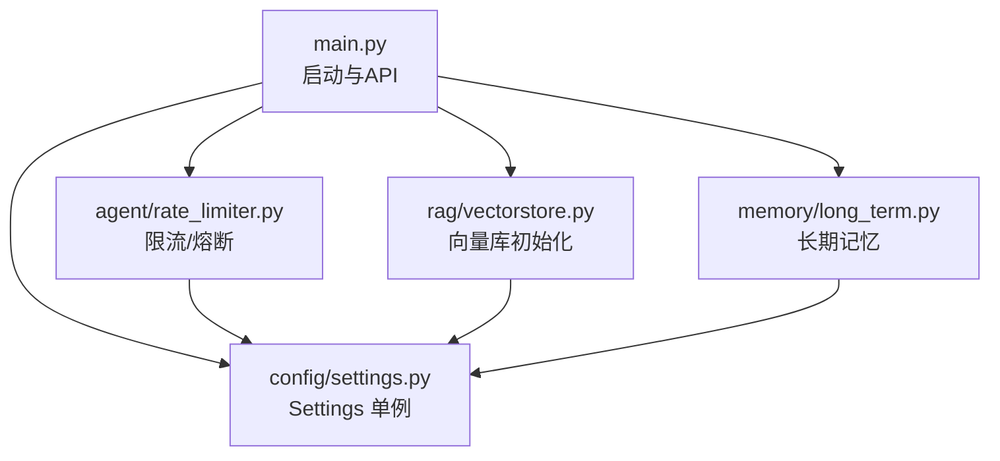
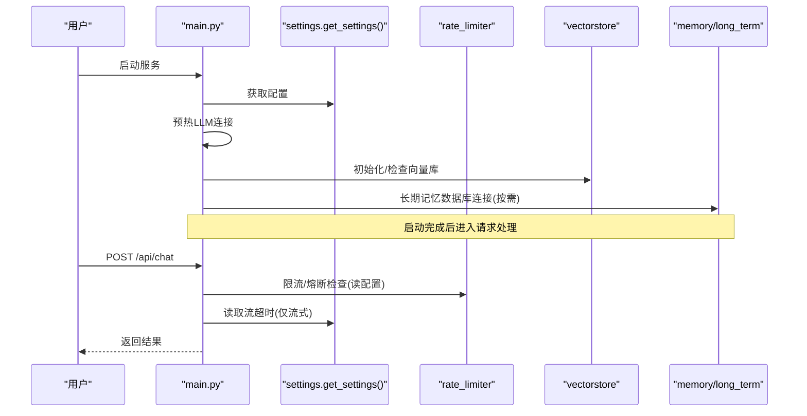
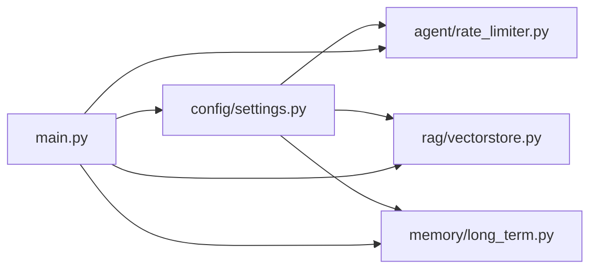

# 配置管理模块目录

<cite>
**本文引用的文件**
- [config/settings.py](file://config/settings.py)
- [main.py](file://main.py)
- [agent/rate_limiter.py](file://agent/rate_limiter.py)
- [memory/long_term.py](file://memory/long_term.py)
- [rag/vectorstore.py](file://rag/vectorstore.py)
- [requirements.txt](file://requirements.txt)
</cite>

## 目录
1. [简介](#简介)
2. [项目结构](#项目结构)
3. [核心组件](#核心组件)
4. [架构总览](#架构总览)
5. [详细组件分析](#详细组件分析)
6. [依赖关系分析](#依赖关系分析)
7. [性能与调优建议](#性能与调优建议)
8. [故障排查指南](#故障排查指南)
9. [结论](#结论)
10. [附录：配置项清单与环境适配](#附录配置项清单与环境适配)

## 简介
本模块负责应用的全局配置管理，基于 pydantic-settings 从环境变量与 .env 文件加载配置，提供类型校验、默认值、路径解析与属性派生能力。配置覆盖大语言模型、向量库、RAG、OCR、记忆、安全过滤、限流熔断、工具调用、LangSmith 追踪等子系统。启动时通过主入口进行 LLM 连接预热、向量库初始化与知识库增量同步，并支持运行时文件监听自动入库。

## 项目结构
- 配置定义位于 config/settings.py，集中声明所有可配置参数与派生属性。
- 主入口 main.py 在启动阶段执行预热与初始化逻辑，并在流式接口中读取流超时配置。
- 各子系统通过 get_settings() 获取全局配置单例，实现解耦与统一来源。

图表来源
- [main.py:45-135](file://main.py#L45-L135)
- [config/settings.py:19-215](file://config/settings.py#L19-L215)
- [agent/rate_limiter.py:22-146](file://agent/rate_limiter.py#L22-L146)
- [rag/vectorstore.py:42-76](file://rag/vectorstore.py#L42-L76)
- [memory/long_term.py:30-47](file://memory/long_term.py#L30-L47)

章节来源
- [main.py:45-135](file://main.py#L45-L135)
- [config/settings.py:19-215](file://config/settings.py#L19-L215)

## 核心组件
- Settings 类：集中声明全部配置项，使用 pydantic-settings 完成类型校验、默认值、环境变量与 .env 文件加载。
- get_settings()：缓存的单例访问器，避免重复实例化。
- 派生属性：如 ocr_language_list、supported_extensions_list、milvus_db_path、long_term_db_file、docs_dir 等，用于将字符串配置转换为结构化列表或绝对路径，并保证目录存在。

关键特性
- 优先级：环境变量 > .env 文件（UTF-8）。
- 大小写不敏感，忽略多余字段。
- 路径自动规范化与父目录创建。
- 列表型配置以逗号分隔字符串形式提供，通过属性解析为 Python list。

章节来源
- [config/settings.py:19-215](file://config/settings.py#L19-L215)

## 架构总览
配置在系统启动时被加载，随后被多个子系统消费：
- 主入口在启动时预热 LLM 连接池、检查并初始化向量库、可选地预热 BM25 索引、启动文件监听。
- 流式接口根据配置设置整体超时保护。
- 安全过滤、限流熔断、记忆、向量检索等均在请求处理链路中读取配置。

图表来源
- [main.py:45-135](file://main.py#L45-L135)
- [main.py:228-314](file://main.py#L228-L314)
- [config/settings.py:19-215](file://config/settings.py#L19-L215)
- [agent/rate_limiter.py:22-146](file://agent/rate_limiter.py#L22-L146)
- [rag/vectorstore.py:42-76](file://rag/vectorstore.py#L42-L76)
- [memory/long_term.py:30-47](file://memory/long_term.py#L30-L47)

## 详细组件分析

### 配置加载与验证机制
- 使用 BaseSettings 与 SettingsConfigDict 指定 .env 路径、编码、忽略额外字段、大小写不敏感。
- 所有字段具备类型注解，pydantic 在实例化时进行类型校验与转换。
- 通过 lru_cache 缓存 get_settings() 返回的实例，提升性能。

章节来源
- [config/settings.py:19-27](file://config/settings.py#L19-L27)
- [config/settings.py:212-215](file://config/settings.py#L212-L215)

### 环境变量管理与默认值
- 所有子系统的关键参数均有合理默认值，便于本地快速运行。
- 可通过环境变量覆盖默认值；若未设置则回退到默认值。
- 列表型配置（如 OCR 语言、支持扩展名、敏感词）以逗号分隔字符串形式提供，并通过属性解析为列表。

章节来源
- [config/settings.py:29-161](file://config/settings.py#L29-L161)
- [config/settings.py:163-176](file://config/settings.py#L163-L176)

### 动态配置更新与热行为
- 当前实现为进程内单例，get_settings() 返回缓存实例。修改 .env 后需重启服务以生效。
- 运行时文件监听（RAG_AUTO_SYNC_ENABLED=true）可在不重启的情况下对知识库文档变更触发增量入库，属于数据层动态更新，非配置热更新。

章节来源
- [config/settings.py:212-215](file://config/settings.py#L212-L215)
- [main.py:80-135](file://main.py#L80-L135)

### 路径与资源管理
- milvus_db_path：将相对路径转为项目根下的绝对路径，并确保父目录存在。
- long_term_db_file：同理处理长期记忆 SQLite 路径。
- docs_dir：知识文档目录解析与自动创建，失败仅告警不阻断。

章节来源
- [config/settings.py:178-209](file://config/settings.py#L178-L209)

### 启动预热与初始化流程
- 启动时后台线程预热路由小模型与主模型连接池，降低首请求延迟。
- 启动时检查向量库是否为空，若为空且存在入库清单则全量重建；否则增量更新。
- 可选预热 BM25 索引（当开启多路召回时）。
- 启动文件监听，运行时自动同步知识库变更。

章节来源
- [main.py:45-135](file://main.py#L45-L135)

### 流式接口超时保护
- 流式接口根据 stream_timeout 配置设置整体超时，防止连接卡死；超时后返回已生成的 token。

章节来源
- [main.py:228-314](file://main.py#L228-L314)
- [config/settings.py:47-48](file://config/settings.py#L47-L48)

### 安全过滤与输入校验
- 支持关键词黑名单与 prompt 注入检测，默认关闭，需在配置中启用。
- 命中拦截直接拒绝请求，不进入 Agent 链路。

章节来源
- [agent/safety.py:1-67](file://agent/safety.py#L1-L67)
- [config/settings.py:135-141](file://config/settings.py#L135-L141)

### 限流与熔断
- 限流：按 user_id 滑动窗口限制每分钟请求数，默认关闭（阈值<=0）。
- 熔断：连续失败达到阈值后进入 open 状态，冷却期过后进入 half_open 试探一次，成功恢复 closed，失败继续熔断。

章节来源
- [agent/rate_limiter.py:1-146](file://agent/rate_limiter.py#L1-L146)
- [config/settings.py:143-149](file://config/settings.py#L143-L149)

### 向量库与 RAG 配置
- Milvus Lite：通过本地 .db 文件持久化，无需独立部署服务；集合名、索引类型、距离度量均可配置。
- RAG：top_k、分数过滤阈值、最小相关度、切片大小与重叠、文档目录、自动同步开关与防抖时间、BM25 多路召回开关与候选数、RRF 融合常数、查询改写开关、重排序开关与模型、设备、候选数与 top_k。

章节来源
- [config/settings.py:54-100](file://config/settings.py#L54-L100)
- [rag/vectorstore.py:42-76](file://rag/vectorstore.py#L42-L76)

### 记忆系统配置
- 长期记忆 SQLite 路径、摘要触发轮次、上下文预算、短期历史窗口与字符预算、RAG 上下文字符预算、是否启用 LLM 抽取、问答记忆缓存开关、相似度阈值与最大记录数。

章节来源
- [config/settings.py:114-133](file://config/settings.py#L114-L133)
- [memory/long_term.py:30-47](file://memory/long_term.py#L30-L47)

### OCR 与联网搜索
- OCR：语言列表、GPU 开关、文本长度阈值、支持的文件扩展名。
- 联网搜索：开关、最大结果数、超时。

章节来源
- [config/settings.py:102-112](file://config/settings.py#L102-L112)

### 工具调用与 LangSmith
- 工具调用：总开关、写操作确认。
- LangSmith：API Key、项目名、追踪开关、端点。

章节来源
- [config/settings.py:151-161](file://config/settings.py#L151-L161)

## 依赖关系分析
- 配置依赖 pydantic-settings 完成加载与校验。
- 主入口依赖 FastAPI/Uvicorn 提供服务。
- 向量库依赖 pymilvus/milvus-lite/langchain-milvus。
- 记忆依赖 SQLite（内置），并发读通过 WAL 模式优化。
- 评估与追踪依赖 langsmith。

图表来源
- [config/settings.py:19-215](file://config/settings.py#L19-L215)
- [main.py:45-135](file://main.py#L45-L135)
- [agent/rate_limiter.py:22-146](file://agent/rate_limiter.py#L22-L146)
- [rag/vectorstore.py:42-76](file://rag/vectorstore.py#L42-L76)
- [memory/long_term.py:30-47](file://memory/long_term.py#L30-L47)

章节来源
- [requirements.txt:1-53](file://requirements.txt#L1-L53)

## 性能与调优建议
- LLM 连接预热：已在启动时预热路由与主模型连接池，减少首请求延迟。
- 向量库 gRPC keepalive：针对 BGE 模型首次加载耗时较长场景，禁用空闲 ping 以避免 Milvus Lite 断连。
- 流式超时：合理设置 stream_timeout，避免长连接阻塞。
- RAG 参数：调整 rag_top_k、rag_score_filter、rag_min_relevance、rag_chunk_size、rag_chunk_overlap 以平衡召回质量与成本。
- 多路召回：开启 rag_bm25_enabled 并使用合适的 rag_rrf_k 提升精确匹配召回率。
- 重排序：rerank_candidate_count 与 rerank_top_k 控制候选规模与最终输出数量。
- 记忆预算：memory_context_budget、memory_history_budget、rag_context_budget 控制上下文大小，避免超出模型窗口。
- 限流与熔断：生产环境建议开启 rate_limit_per_minute 与 circuit_breaker_threshold，保障稳定性。

[本节为通用指导，不直接分析具体文件]

## 故障排查指南
- 向量库初始化失败：检查 milvus_db_file 路径权限与磁盘空间；确认 milvus_collection、index_type、metric_type 配置正确。
- 文件监听启动失败：检查 docs_dir 是否存在及写入权限；关注日志中的警告信息。
- 流式接口超时：根据 stream_timeout 调整客户端超时与服务端超时策略。
- 限流/熔断触发：检查 rate_limit_per_minute 与 circuit_breaker_threshold 配置；查看健康检查返回的熔断状态。
- 安全过滤误拦：检查 input_blocked_keywords 与注入检测模式，必要时放宽规则。

章节来源
- [main.py:80-135](file://main.py#L80-L135)
- [main.py:228-314](file://main.py#L228-L314)
- [agent/rate_limiter.py:96-117](file://agent/rate_limiter.py#L96-L117)
- [rag/vectorstore.py:42-76](file://rag/vectorstore.py#L42-L76)

## 结论
配置管理模块通过集中化的 Settings 类与 pydantic-settings 提供了类型安全、可验证、易维护的配置体系。配合启动预热、向量库初始化、文件监听与流式超时保护，形成了稳定高效的运行基线。生产部署建议开启限流与熔断，并根据业务需求调整 RAG、重排序与记忆预算等参数。

[本节为总结性内容，不直接分析具体文件]

## 附录：配置项清单与环境适配

### 配置项分类与说明
- 大语言模型（LLM）
  - 模型名称、基础 URL、API Key、温度、评判模型、路由小模型、最大重试次数、请求超时、降级模型、备用模型列表、流式整体超时。
- Embedding
  - 模型名称、设备（CPU/GPU）。
- 向量库（Milvus Lite）
  - 数据库文件路径、集合名、索引类型、距离度量、检索 top_k、分数过滤阈值、最小相关度、切片大小与重叠、文档目录。
- 知识库自动同步
  - 开关、防抖时间（秒）。
- 多路召回（BM25）
  - 开关、候选数、RRF 融合常数。
- 查询改写
  - 开关。
- 重排序（Reranker）
  - 开关、模型、设备、候选数、top_k。
- OCR
  - 语言列表、GPU 开关、文本长度阈值、支持的文件扩展名。
- 联网搜索
  - 开关、最大结果数、超时。
- 记忆
  - 长期记忆数据库路径、摘要触发轮次、上下文预算、短期历史窗口与字符预算、RAG 上下文字符预算、是否启用 LLM 抽取、问答记忆缓存开关、相似度阈值、最大记录数。
- 输入安全过滤
  - 开关、敏感词黑名单、prompt 注入检测开关。
- 限流与熔断
  - 每分钟请求上限、熔断阈值、冷却时间。
- 工具调用
  - 总开关、写操作确认。
- LangSmith
  - API Key、项目名、追踪开关、端点。

### 推荐配置值（参考）
- LLM：llm_model=qwen-plus，llm_base_url=官方兼容接口地址，llm_api_key=你的密钥，llm_temperature=0.7，llm_max_retries=3，llm_request_timeout=60，stream_timeout=60。
- 向量库：milvus_db_file=data/milvus/milvus_lite.db，milvus_collection=dingtalk_kb，milvus_index_type=FLAT，milvus_metric_type=L2，rag_top_k=4，rag_score_filter=1.2，rag_min_relevance=0.3，rag_chunk_size=500，rag_chunk_overlap=80，rag_docs_dir=data/docs。
- 自动同步：rag_auto_sync_enabled=true，rag_auto_sync_debounce=2.0。
- 多路召回：rag_bm25_enabled=false（可按需开启），rag_bm25_candidate_count=10，rag_rrf_k=60。
- 重排序：rerank_enabled=true，rerank_model=BAAI/bge-reranker-base，rerank_device=cpu，rerank_candidate_count=20，rerank_top_k=4。
- OCR：ocr_languages=ch_sim,en，ocr_use_gpu=false，ocr_min_text_length=50，supported_file_extensions=.txt,.md,.pdf,.docx,.xlsx,.png,.jpg,.jpeg,.bmp,.tiff。
- 联网搜索：web_search_enabled=true，web_search_max_results=5，web_search_timeout=10。
- 记忆：long_term_db_path=data/memory.db，memory_summary_every=6，memory_context_budget=1600，memory_short_window=8，memory_history_budget=2000，rag_context_budget=2500，memory_extract_llm_enabled=true，memory_qa_cache_enabled=true，memory_qa_threshold=0.90，memory_qa_max_records=200。
- 安全过滤：input_filter_enabled=false（生产建议开启），input_blocked_keywords=按需配置，input_injection_check_enabled=true。
- 限流与熔断：rate_limit_per_minute=0（生产建议设置），circuit_breaker_threshold=0（生产建议设置），circuit_breaker_recovery=60。
- 工具调用：tool_calling_enabled=false（按需开启），tool_confirmation_required=true。
- LangSmith：langsmith_api_key=按需配置，langsmith_project=dingtalk-ai-agent，langsmith_tracing=false，langsmith_endpoint=https://api.smith.langchain.com。

### 部署环境适配指南
- 开发环境：保持默认值即可，确保 .env 中配置正确的 LLM API Key。
- 生产环境：
  - 开启限流与熔断，设置合理的 rate_limit_per_minute 与 circuit_breaker_threshold。
  - 根据业务负载调整 RAG 与重排序参数，控制上下文预算与候选规模。
  - 如需离线或镜像加速，设置 HuggingFace 镜像与离线模式（由主入口在启动前设置 HF_ENDPOINT）。
  - 确保 data 目录具有写入权限，以便 Milvus Lite 与长期记忆数据库持久化。
  - 如需启用知识库自动同步，确保 docs_dir 可写且 watchdog 可用。

章节来源
- [config/settings.py:29-161](file://config/settings.py#L29-L161)
- [main.py:13-19](file://main.py#L13-L19)
- [requirements.txt:1-53](file://requirements.txt#L1-L53)