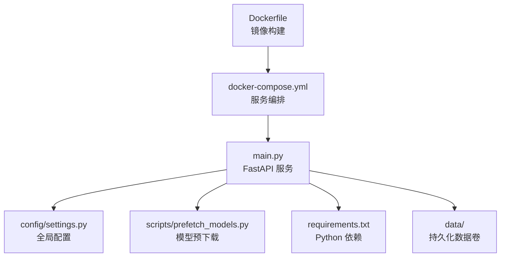
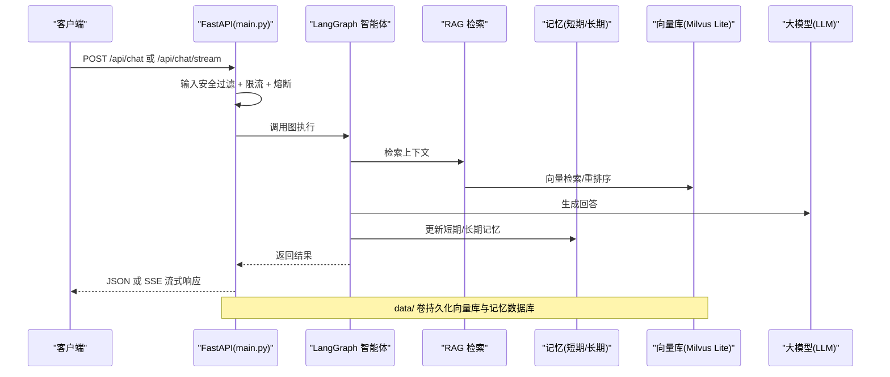
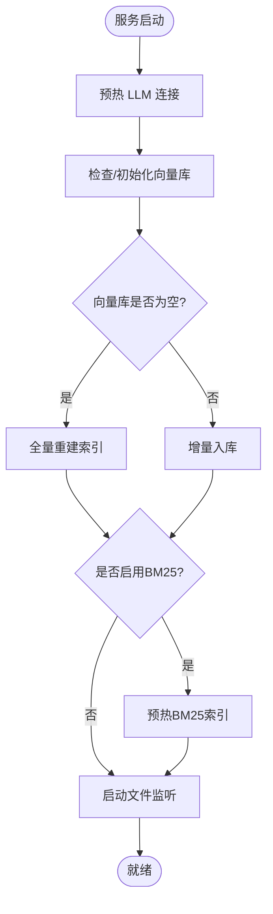

# 部署指南

<cite>
**本文引用的文件**
- [Dockerfile](file://Dockerfile)
- [docker-compose.yml](file://docker-compose.yml)
- [requirements.txt](file://requirements.txt)
- [main.py](file://main.py)
- [config/settings.py](file://config/settings.py)
- [.env.example](file://.env.example)
- [scripts/prefetch_models.py](file://scripts/prefetch_models.py)
- [Docker部署指南.md](file://Docker部署指南.md)
- [README.md](file://README.md)
</cite>

## 目录
1. [简介](#简介)
2. [项目结构](#项目结构)
3. [核心组件](#核心组件)
4. [架构总览](#架构总览)
5. [详细组件分析](#详细组件分析)
6. [依赖与配置](#依赖与配置)
7. [部署方式与步骤](#部署方式与步骤)
8. [生产环境配置建议](#生产环境配置建议)
9. [性能与容量规划](#性能与容量规划)
10. [故障排查](#故障排查)
11. [结论](#结论)
12. [附录：环境变量清单](#附录环境变量清单)

## 简介
本指南面向运维人员，提供钉钉AI智能体助手的完整部署方案，包括容器化构建、生产环境配置、依赖安装与环境搭建。文档覆盖 Docker 镜像构建、Compose 编排、模型预下载、数据持久化、健康检查、反向代理与监控等关键实践，并给出常见问题定位与解决方案。

## 项目结构
本项目采用模块化设计，核心入口为 FastAPI 应用，结合 LangGraph 智能体、RAG 检索、记忆系统与向量库（Milvus Lite）实现企业级问答能力。部署相关的关键文件如下：
- 镜像定义与运行参数：Dockerfile、docker-compose.yml
- 依赖清单：requirements.txt
- 运行时配置：config/settings.py 与 .env/.env.example
- 启动入口与健康检查：main.py
- 构建期模型预下载：scripts/prefetch_models.py

**图表来源**
- [Dockerfile:1-51](file://Dockerfile#L1-L51)
- [docker-compose.yml:1-26](file://docker-compose.yml#L1-L26)
- [main.py:1-387](file://main.py#L1-L387)
- [config/settings.py:1-216](file://config/settings.py#L1-L216)
- [requirements.txt:1-53](file://requirements.txt#L1-L53)
- [scripts/prefetch_models.py:1-99](file://scripts/prefetch_models.py#L1-L99)

**章节来源**
- [Dockerfile:1-51](file://Dockerfile#L1-L51)
- [docker-compose.yml:1-26](file://docker-compose.yml#L1-L26)
- [main.py:1-387](file://main.py#L1-L387)
- [config/settings.py:1-216](file://config/settings.py#L1-L216)
- [requirements.txt:1-53](file://requirements.txt#L1-L53)
- [scripts/prefetch_models.py:1-99](file://scripts/prefetch_models.py#L1-L99)

## 核心组件
- Web 服务与接口：基于 FastAPI 的聊天接口、流式 SSE 接口与健康检查端点。
- 智能体与工作流：LangGraph 图驱动的路由、检索、生成、记忆更新流程。
- RAG 检索：多模态 Embedding、向量库 Milvus Lite、重排序与可选 BM25 多路召回。
- 记忆系统：短期会话状态（进程内 MemorySaver）与长期结构化记忆（SQLite）。
- 配置管理：pydantic-settings 统一加载环境变量与 .env 文件。
- 模型预下载：构建期下载 Embedding/Reranker/OCR 模型，确保离线冷启动。

**章节来源**
- [main.py:45-136](file://main.py#L45-L136)
- [config/settings.py:19-216](file://config/settings.py#L19-L216)
- [scripts/prefetch_models.py:28-94](file://scripts/prefetch_models.py#L28-L94)

## 架构总览
下图展示从请求进入、安全校验、限流熔断、智能体路由到检索与生成的整体流程，以及健康检查与数据持久化位置。

**图表来源**
- [main.py:154-314](file://main.py#L154-L314)
- [config/settings.py:54-100](file://config/settings.py#L54-L100)

## 详细组件分析

### 服务启动与预热
- 启动时后台线程预热 LLM 连接池与向量库索引，降低首请求延迟。
- 若向量库为空但存在入库清单，自动触发全量重建；否则增量同步。
- 可选开启 BM25 索引预热与文件监听（watchdog），支持运行时知识库变更自动同步。

**图表来源**
- [main.py:45-136](file://main.py#L45-L136)

**章节来源**
- [main.py:45-136](file://main.py#L45-L136)

### 健康检查与可观测性
- 提供 /health 端点，返回服务状态与 checkpointer 类型，便于编排系统探针检测。
- 日志级别默认 INFO，可按需调整以适配生产日志采集。

**章节来源**
- [main.py:317-326](file://main.py#L317-L326)

### 配置管理与环境变量
- 使用 pydantic-settings 从环境变量与 .env 文件加载配置，支持路径解析与自动创建目录。
- 关键配置项涵盖 LLM、Embedding、向量库、RAG、OCR、记忆、限流熔断、工具调用与评估追踪等。

**章节来源**
- [config/settings.py:19-216](file://config/settings.py#L19-L216)
- [.env.example:1-103](file://.env.example#L1-L103)

## 依赖与配置
- Python 依赖通过 requirements.txt 管理，包含 LangChain/LangGraph、OpenAI SDK、Milvus Lite、sentence-transformers、transformers、torch、fastapi/uvicorn 等。
- 构建期使用国内源加速 apt、pip 与 HuggingFace 模型下载，提升稳定性与速度。
- 运行时强制 CPU 模式与离线模式，避免冷启动网络依赖。

**章节来源**
- [requirements.txt:1-53](file://requirements.txt#L1-L53)
- [Dockerfile:19-45](file://Dockerfile#L19-L45)

## 部署方式与步骤

### 前置条件
- 已安装 Docker 与 Docker Compose。
- 准备 .env 文件，至少配置 LLM_API_KEY、LLM_BASE_URL、LLM_MODEL 等必要项。
- 将项目放置于纯英文路径，避免构建期编码异常。

**章节来源**
- [Docker部署指南.md:13-57](file://Docker部署指南.md#L13-L57)
- [.env.example:1-103](file://.env.example#L1-L103)

### 容器化构建与启动
- 构建镜像（首次较慢，含模型预下载）：
  - docker compose build
- 后台启动服务：
  - docker compose up -d
- 查看日志与健康检查：
  - docker compose logs -f agent
  - curl http://localhost:8000/health

**章节来源**
- [docker-compose.yml:1-26](file://docker-compose.yml#L1-L26)
- [Docker部署指南.md:89-108](file://Docker部署指南.md#L89-L108)

### 数据持久化与备份
- data/ 目录通过 volumes 挂载至容器，用于持久化：
  - 长期记忆 SQLite（memory.db）
  - Milvus Lite 向量库（milvus_lite.db）
  - 知识文档（docs/）
- 定期备份 data/ 目录，防止数据丢失。

**章节来源**
- [docker-compose.yml:12-15](file://docker-compose.yml#L12-L15)
- [config/settings.py:179-194](file://config/settings.py#L179-L194)

### 知识库入库与增量同步
- 将知识文档放入 data/docs/，执行入库：
  - docker compose run --rm agent python -m rag.ingest
  - 如需重建索引：python -m rag.ingest --rebuild
- 开启 RAG_AUTO_SYNC_ENABLED=true 后，文件监听会自动增量入库，无需重启服务。

**章节来源**
- [README.md:101-106](file://README.md#L101-L106)
- [config/settings.py:77-81](file://config/settings.py#L77-L81)

### 本地开发模式
- 直接运行 Web 服务：
  - uvicorn main:app --host 0.0.0.0 --port 8000 --reload
- 本地 REPL 调试：
  - python main.py --repl

**章节来源**
- [README.md:108-123](file://README.md#L108-L123)
- [main.py:364-382](file://main.py#L364-L382)

## 生产环境配置建议
- 反向代理：在容器外使用 Nginx 反代 8000 端口，配置 HTTPS 与缓存策略。
- 资源限制：在 compose 中设置 deploy.resources.limits 限制 CPU/内存。
- 日志收集：配置 logging driver，避免日志膨胀，集中采集与分析。
- 镜像版本：固定基础镜像 tag，避免 latest 带来的不确定性。
- 健康检查：已配置 healthcheck，配合编排系统的就绪探针使用。
- 重启策略：已配置 restart: unless-stopped，宿主机重启后自动恢复。

**章节来源**
- [docker-compose.yml:20-25](file://docker-compose.yml#L20-L25)
- [Docker部署指南.md:445-455](file://Docker部署指南.md#L445-L455)

## 性能与容量规划
- 单 worker 运行：短期记忆为进程内 MemorySaver，多 worker/多实例会导致会话状态不一致。
- 模型预下载：构建期下载 Embedding/Reranker/OCR，镜像体积约 4-6 GB，冷启动无需联网。
- 向量库与记忆：Milvus Lite 与 SQLite 均落盘 data/，注意磁盘容量与 I/O 性能。
- 流式超时：stream_timeout 控制整体超时，避免连接卡死。

**章节来源**
- [Dockerfile:49-50](file://Dockerfile#L49-L50)
- [scripts/prefetch_models.py:28-94](file://scripts/prefetch_models.py#L28-L94)
- [config/settings.py:47-48](file://config/settings.py#L47-L48)

## 故障排查
- 构建阶段
  - 找不到 requirements.txt：确认在项目根目录执行构建命令。
  - pip 安装 torch 超时：重试或临时切换源。
  - 模型下载失败：重试构建或先在本机预下载模型并挂载 hf_cache。
  - Windows 中文路径报错：将项目移至纯英文路径。
- 运行阶段
  - 容器立即退出：查看日志、检查 .env 配置与端口占用。
  - 健康检查不通过：服务启动慢或异常，查看应用日志，适当调大 start_period。
  - 无法访问宿主机服务：宿主机服务需绑定 0.0.0.0，或使用 host.docker.internal。
  - 数据卷权限不足（Linux）：调整 data/ 目录权限或属主。
  - 工具调用不可用：确认 TOOL_CALLING_ENABLED 与钉钉权限配置。
  - HuggingFace 模型下载超时：重试构建或挂载 hf_cache，运行时已设置离线模式。

**章节来源**
- [Docker部署指南.md:326-442](file://Docker部署指南.md#L326-L442)

## 结论
本项目提供开箱即用的容器化部署方案，内置模型预下载与数据持久化，适合快速上线与稳定运行。通过合理的配置与运维实践，可在生产环境中获得高可用、可扩展的企业级 AI 智能体服务。

## 附录：环境变量清单
以下为常用环境变量及其作用说明（来自 .env.example 与 settings.py）：
- LLM_*：大语言模型配置（模型名、基地址、API Key、温度、降级模型等）
- EMBEDDING_*：Embedding 模型与设备
- MILVUS_*：Milvus Lite 数据库路径、集合名、索引类型与度量
- RAG_*：RAG 检索参数（top_k、分数阈值、切片大小与重叠、文档目录、自动同步开关与防抖时间）
- RERANK_*：重排序开关、模型与设备、候选数与 top-k
- WEB_SEARCH_*：联网搜索开关、最大结果数与超时
- OCR_*：OCR 语言、GPU 使用与最小文本长度
- SUPPORTED_FILE_EXTENSIONS：支持的文件扩展名
- LONG_TERM_DB_PATH：长期记忆数据库路径
- MEMORY_*：记忆相关预算与窗口配置
- DINGTALK_*：钉钉应用与机器人凭证
- TOOL_CALLING_*：工具调用开关与确认要求
- LANGSMITH_*：LangSmith 评估与追踪配置

**章节来源**
- [.env.example:1-103](file://.env.example#L1-L103)
- [config/settings.py:29-161](file://config/settings.py#L29-L161)