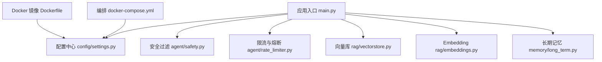
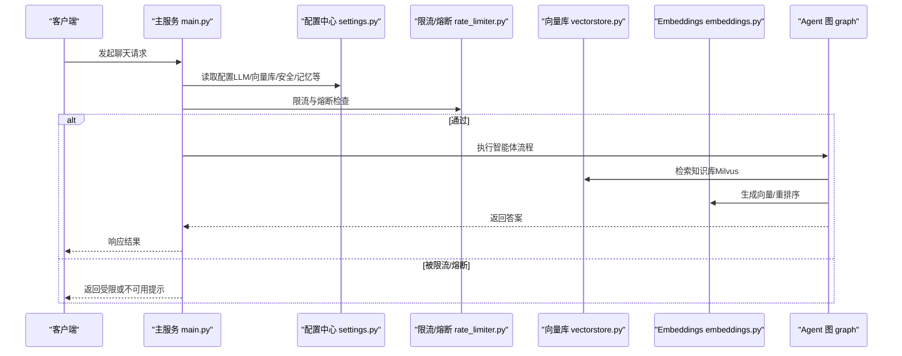
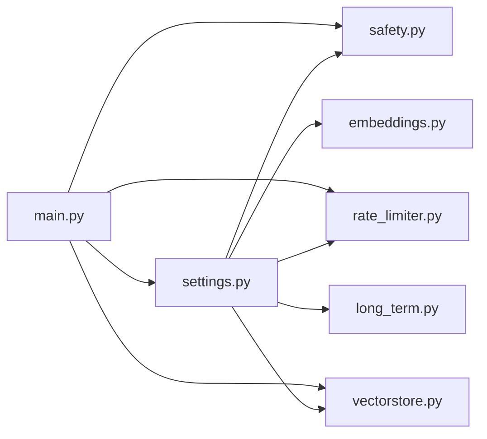

# 配置管理

<cite>
**本文引用的文件**
- [config/settings.py](file://config/settings.py)
- [main.py](file://main.py)
- [agent/safety.py](file://agent/safety.py)
- [agent/rate_limiter.py](file://agent/rate_limiter.py)
- [rag/vectorstore.py](file://rag/vectorstore.py)
- [rag/embeddings.py](file://rag/embeddings.py)
- [memory/long_term.py](file://memory/long_term.py)
- [Dockerfile](file://Dockerfile)
- [docker-compose.yml](file://docker-compose.yml)
- [.gitignore](file://.gitignore)
</cite>

## 目录
1. [简介](#简介)
2. [项目结构](#项目结构)
3. [核心组件](#核心组件)
4. [架构总览](#架构总览)
5. [详细组件分析](#详细组件分析)
6. [依赖关系分析](#依赖关系分析)
7. [性能考量](#性能考量)
8. [故障排查指南](#故障排查指南)
9. [结论](#结论)
10. [附录：环境变量清单与推荐值](#附录：环境变量清单与推荐值)

## 简介
本章节系统性说明本项目的配置管理机制，覆盖环境变量加载、模型参数设置、向量库配置、安全策略、限流熔断、记忆系统、OCR、联网搜索等。文档面向不同部署环境（本地开发、容器化、生产）提供配置项作用、默认值、推荐设置与最佳实践，帮助快速完成部署与调优。

## 项目结构
配置由统一的 Settings 类集中管理，通过 pydantic-settings 从环境变量或 .env 文件加载；运行时各模块按需读取配置，保证单一事实来源。启动时 main.py 会预热 LLM 连接、初始化向量库并可选启动文件监听，确保首请求低延迟与知识库一致性。

图表来源
- [main.py:45-135](file://main.py#L45-L135)
- [config/settings.py:19-216](file://config/settings.py#L19-L216)
- [rag/vectorstore.py:42-76](file://rag/vectorstore.py#L42-L76)
- [rag/embeddings.py:164-179](file://rag/embeddings.py#L164-L179)
- [memory/long_term.py:424-456](file://memory/long_term.py#L424-L456)

章节来源
- [main.py:45-135](file://main.py#L45-L135)
- [config/settings.py:19-216](file://config/settings.py#L19-L216)

## 核心组件
- 统一配置中心：Settings 类集中定义所有可配置项，支持环境变量与 .env 双源加载，提供路径解析与列表解析等便捷属性。
- 启动预热：启动时预热 LLM 连接池、检查并重建向量库索引、可选启动文件监听，降低首请求延迟并保障数据一致性。
- 安全与防护：输入安全过滤（关键词黑名单 + prompt 注入检测）、滑动窗口限流、三态熔断器。
- 检索与生成：Embedding 多模态/纯文本自动选择、Milvus Lite 向量库、BM25 多路召回、Reranker 重排序、查询改写。
- 记忆系统：短期会话上下文（进程内 MemorySaver）+ 长期记忆（SQLite 持久化），含摘要周期、预算控制、问答缓存。
- OCR 与联网搜索：PDF/图片 OCR 语言与设备开关、联网搜索开关与超时。
- 运行环境与容器化：HF 镜像加速、离线模式、CPU-only 推理、端口暴露与健康检查。

章节来源
- [config/settings.py:19-216](file://config/settings.py#L19-L216)
- [main.py:45-135](file://main.py#L45-L135)
- [agent/safety.py:35-68](file://agent/safety.py#L35-L68)
- [agent/rate_limiter.py:22-147](file://agent/rate_limiter.py#L22-L147)
- [rag/vectorstore.py:42-76](file://rag/vectorstore.py#L42-L76)
- [rag/embeddings.py:164-179](file://rag/embeddings.py#L164-L179)
- [memory/long_term.py:424-456](file://memory/long_term.py#L424-L456)

## 架构总览
下图展示配置在系统中的流转与关键节点调用关系。

图表来源
- [main.py:154-209](file://main.py#L154-L209)
- [agent/rate_limiter.py:22-147](file://agent/rate_limiter.py#L22-L147)
- [rag/vectorstore.py:42-76](file://rag/vectorstore.py#L42-L76)
- [rag/embeddings.py:164-179](file://rag/embeddings.py#L164-L179)

## 详细组件分析

### 统一配置中心（Settings）
- 加载机制：优先环境变量，其次 .env 文件；忽略多余字段、大小写不敏感。
- 大语言模型：主模型、路由小模型、评判模型、重试次数、超时、降级模型与备用模型列表、流式整体超时。
- Embedding：模型名与设备（cpu/gpu），自动选择 Jina 多模态或 BGE 纯文本。
- 向量库：Milvus Lite 数据库文件路径、集合名、索引类型、度量类型、检索 top_k、分数阈值、最小相关度、切片大小与重叠、文档目录、自动同步开关与防抖时间。
- 多路召回：BM25 开关、候选数、RRF 融合常数。
- 查询改写：LLM 改写开关。
- 重排序：开关、模型、设备、候选数与 top_k。
- OCR：语言列表、GPU 开关、最小文本长度、支持扩展名。
- 联网搜索：开关、最大结果数、超时。
- 记忆：长期记忆 SQLite 路径、摘要触发轮次、长短期预算、结构化抽取开关、问答缓存开关与阈值、记录上限。
- 安全：输入过滤开关、敏感词黑名单、prompt 注入检测开关。
- 限流与熔断：每分钟请求上限、连续失败阈值、冷却时间。
- 工具调用：总开关、写操作确认。
- LangSmith：API Key、项目名、追踪开关、端点。
- 便捷属性：解析逗号分隔为列表、计算绝对路径并自动创建目录。

推荐实践
- 生产环境务必设置 llm_api_key，并启用 llm_max_retries 与 llm_request_timeout。
- 使用 Milvus Lite 时保持 milvus_index_type=FLAT、milvus_metric_type=L2，避免非法 URI。
- 开启 rerank_enabled 提升回答质量；若资源紧张可关闭。
- 根据业务调整 rag_chunk_size 与 rag_chunk_overlap，变更后需重建索引。
- 建议开启 memory_qa_cache_enabled 并合理设置 memory_qa_threshold，减少重复问题的大模型调用。
- 在生产开启 input_filter_enabled 并配置敏感词，以抵御恶意输入。

章节来源
- [config/settings.py:19-216](file://config/settings.py#L19-L216)

### 启动预热与向量库初始化
- 启动时后台线程预热 LLM 连接（路由小模型与主模型），显著降低首条请求延迟。
- 启动时检查向量库是否为空且存在入库清单，必要时全量重建；否则增量更新。
- 如启用 BM25 多路召回，预热构建 BM25 索引。
- 可选启动文件监听，实现运行时知识库变更自动同步。

推荐实践
- 首次部署或数据迁移后，确保 data/docs 下有文档，以便启动时自动入库。
- 若使用容器，注意挂载 data 目录以持久化向量库与记忆。

章节来源
- [main.py:45-135](file://main.py#L45-L135)

### 安全策略（输入过滤）
- 功能：关键词黑名单匹配 + prompt 注入模式检测。
- 行为：命中即拒绝，返回明确原因；默认关闭，需在 .env 中启用。
- 建议：生产环境开启，定期维护敏感词列表；结合外部网关做更严格校验。

章节来源
- [agent/safety.py:35-68](file://agent/safety.py#L35-L68)
- [config/settings.py:135-142](file://config/settings.py#L135-L142)

### 限流与熔断
- 限流：按 user_id 的滑动窗口（60 秒），超过每分钟上限则拒绝。
- 熔断：连续失败达到阈值进入 open 状态，冷却期过后进入 half_open 试探一次，成功恢复 closed，失败继续 open。
- 建议：生产环境开启限流与熔断，合理设置阈值与冷却时间，保护后端与 LLM 服务。

章节来源
- [agent/rate_limiter.py:22-147](file://agent/rate_limiter.py#L22-L147)
- [config/settings.py:143-149](file://config/settings.py#L143-L149)

### 向量库配置（Milvus Lite）
- 配置项：数据库文件路径、集合名、索引类型、度量类型、top_k、分数阈值、最小相关度、切片大小与重叠、文档目录、自动同步开关与防抖。
- 行为：使用 Milvus Lite 本地文件持久化；gRPC keepalive 优化避免空闲断连；动态字段存储异构 metadata。
- 建议：
  - 使用 FLAT 索引与 L2 距离，适合 Milvus Lite。
  - 根据语料规模调整 rag_top_k 与 rag_min_relevance，平衡召回与幻觉风险。
  - 调整 rag_chunk_size 与 rag_chunk_overlap 后需重建索引。
  - 开启 rag_auto_sync_enabled 实现热更新，但注意防抖时间避免频繁写入。

章节来源
- [config/settings.py:54-81](file://config/settings.py#L54-L81)
- [rag/vectorstore.py:42-76](file://rag/vectorstore.py#L42-L76)

### Embedding 与重排序
- Embedding：自动根据模型名选择 Jina 多模态或 BGE 纯文本；支持 CPU/GPU 设备切换。
- 重排序：可选开启，对候选集进行精细排序，提高最终 top-k 质量。
- 建议：
  - 资源有限时使用 BGE 纯文本模型以提升速度。
  - 需要图像理解时启用多模态模型，并确保 GPU 可用。
  - 合理设置 rerank_candidate_count 与 rerank_top_k，兼顾质量与延迟。

章节来源
- [rag/embeddings.py:164-179](file://rag/embeddings.py#L164-L179)
- [config/settings.py:95-100](file://config/settings.py#L95-L100)

### 记忆系统（长期与短期）
- 短期记忆：进程内 MemorySaver，维护最近消息窗口与字符预算，超窗注入会话压缩摘要。
- 长期记忆：SQLite 持久化，分层结构化（用户画像、关键事实、历史摘要），按预算填充，P0 硬保留关键信息。
- 问答缓存：相似问题直接复用历史答案，减少大模型调用。
- 建议：
  - 调整 memory_short_window 与 memory_history_budget 控制上下文长度。
  - 设置 memory_summary_every 控制摘要频率，避免频繁写入。
  - 合理设置 memory_context_budget 与 rag_context_budget，防止上下文过长导致成本上升。
  - 开启 memory_qa_cache_enabled 并设置合适阈值，提升效率。

章节来源
- [memory/long_term.py:424-456](file://memory/long_term.py#L424-L456)
- [config/settings.py:114-133](file://config/settings.py#L114-L133)

### OCR 与联网搜索
- OCR：支持中英文识别，可切换 GPU；当页面文本较少时触发 OCR。
- 联网搜索：可开关，限制最大结果数与超时。
- 建议：
  - 有 GPU 时开启 ocr_use_gpu 提升 OCR 速度。
  - 生产环境根据合规要求决定是否启用 web_search_enabled。

章节来源
- [config/settings.py:102-112](file://config/settings.py#L102-L112)

### 运行环境与容器化
- HF 镜像加速与离线模式：构建期预下载模型，运行期无需联网。
- CPU-only：强制 CPU 推理，简化部署。
- 健康检查：/health 返回服务状态与 checkpointer 类型。
- 建议：
  - 使用 docker-compose 挂载 data 目录持久化向量库与记忆。
  - 将 .env 通过 env_file 注入，避免打入镜像。

章节来源
- [Dockerfile:35-50](file://Dockerfile#L35-L50)
- [docker-compose.yml:5-26](file://docker-compose.yml#L5-L26)
- [main.py:317-326](file://main.py#L317-L326)

## 依赖关系分析
- 配置中心被安全、限流熔断、向量库、Embedding、记忆等模块共同依赖，形成“配置驱动”的松耦合架构。
- 启动阶段 main.py 协调预热与初始化，确保各子系统就绪。
- 向量库与 Embedding 强依赖配置中的模型名与设备；重排序与多路召回增强检索质量。

图表来源
- [config/settings.py:19-216](file://config/settings.py#L19-L216)
- [main.py:45-135](file://main.py#L45-L135)

章节来源
- [config/settings.py:19-216](file://config/settings.py#L19-L216)
- [main.py:45-135](file://main.py#L45-L135)

## 性能考量
- 首请求延迟：通过启动预热 LLM 连接与 BM25 索引，显著降低冷启动开销。
- 检索质量与延迟：rerank_enabled 提升质量但增加延迟；可根据资源权衡。
- 上下文预算：memory_context_budget 与 rag_context_budget 控制注入长度，避免超长上下文带来的成本与性能问题。
- 向量库 gRPC keepalive：禁用空闲 ping，避免 Milvus Lite 断连。
- 并发与持久化：SQLite WAL 模式支持并发读；向量库写入加锁避免冲突。

[本节为通用性能指导，不直接分析具体文件]

## 故障排查指南
- 向量库为空或索引不一致：启动时会检测并重建；若仍异常，检查 data/docs 与 manifest 文件。
- 模型加载失败：确认 HF_ENDPOINT 与离线模式设置；构建期已预下载模型，运行期应无需联网。
- 健康检查不通过：查看服务日志，确认端口占用与依赖服务可用性。
- 输入被拦截：检查 input_filter_enabled 与敏感词列表；必要时放宽规则。
- 限流/熔断触发：检查 rate_limit_per_minute 与 circuit_breaker_threshold；观察错误率与下游稳定性。

章节来源
- [main.py:80-135](file://main.py#L80-L135)
- [Dockerfile:35-50](file://Dockerfile#L35-L50)
- [agent/safety.py:35-68](file://agent/safety.py#L35-L68)
- [agent/rate_limiter.py:22-147](file://agent/rate_limiter.py#L22-L147)

## 结论
本项目采用集中式配置管理，结合启动预热、安全过滤、限流熔断、向量库与记忆系统等能力，提供了开箱即用且可扩展的智能体平台。通过合理的环境变量与 .env 配置，可在不同部署环境下快速上线并稳定运行。建议在生产环境中开启安全与防护能力，并根据业务需求调优检索与记忆参数。

[本节为总结性内容，不直接分析具体文件]

## 附录：环境变量清单与推荐值
以下列出主要环境变量及其作用、默认值与推荐设置。请根据实际部署环境调整。

- 大语言模型
  - LLM_MODEL：主模型名，默认 qwen-plus。推荐：qwen-plus 或更高版本。
  - LLM_BASE_URL：OpenAI 兼容接口地址，默认 DashScope 兼容端点。
  - LLM_API_KEY：千问 API Key，必填。生产环境务必保密。
  - LLM_TEMPERATURE：生成温度，默认 0.7。创意任务可调高，确定性任务调低。
  - LLM_JUDGE_MODEL：评判模型，默认 qwen-plus。评估场景使用。
  - LLM_ROUTER_MODEL：路由小模型，默认 qwen-turbo。降低成本与延迟。
  - LLM_MAX_RETRIES：最大重试次数，默认 3。网络抖动或限流时有效。
  - LLM_REQUEST_TIMEOUT：单次请求超时（秒），默认 60。根据模型响应时间调整。
  - LLM_FALLBACK_MODEL：主模型失败时的降级模型，默认 qwen-turbo。
  - LLM_FALLBACK_MODELS：备用模型列表（逗号分隔），留空则回退到单模型降级。
  - STREAM_TIMEOUT：流式整体超时（秒），默认 60。防止连接卡死。

- Embedding
  - EMBEDDING_MODEL：模型名，默认 jinaai/jina-clip-v2。如需纯文本，可使用含 bge 的模型名。
  - EMBEDDING_DEVICE：设备，默认 cpu。GPU 可用时可设为 gpu 提升速度。

- 向量库（Milvus Lite）
  - MILVUS_DB_FILE：数据库文件路径，默认 data/milvus/milvus_lite.db。
  - MILVUS_COLLECTION：集合名，默认 dingtalk_kb。
  - MILVUS_INDEX_TYPE：索引类型，默认 FLAT。Milvus Lite 仅支持 FLAT。
  - MILVUS_METRIC_TYPE：度量类型，默认 L2。越小越相关。
  - RAG_TOP_K：检索 top_k，默认 4。
  - RAG_SCORE_FILTER：检索分数过滤阈值，默认 1.2。低于此值的文档丢弃。
  - RAG_MIN_RELEVANCE：最低相关度，默认 0.3。低于此值不注入上下文。
  - RAG_CHUNK_SIZE：文档切片大小（字符），默认 500。调整后需重建索引。
  - RAG_CHUNK_OVERLAP：相邻切片重叠（字符），默认 80。
  - RAG_DOCS_DIR：知识文档目录，默认 data/docs。
  - RAG_AUTO_SYNC_ENABLED：自动同步开关，默认 true。
  - RAG_AUTO_SYNC_DEBOUNCE：防抖时间（秒），默认 2.0。

- 多路召回与查询改写
  - RAG_BM25_ENABLED：BM25 开关，默认 false。开启后与向量检索并行召回。
  - RAG_BM25_CANDIDATE_COUNT：BM25 候选数，默认 10。
  - RAG_RRF_K：RRF 融合常数，默认 60。
  - RAG_QUERY_REWRITE_ENABLED：查询改写开关，默认 false。

- 重排序
  - RERANK_ENABLED：重排序开关，默认 true。
  - RERANK_MODEL：重排序模型，默认 BAAI/bge-reranker-base。
  - RERANK_DEVICE：设备，默认 cpu。
  - RERANK_CANDIDATE_COUNT：候选数，默认 20。
  - RERANK_TOP_K：重排序后 top_k，默认 4。

- OCR
  - OCR_LANGUAGES：语言列表（逗号分隔），默认 ch_sim,en。
  - OCR_USE_GPU：是否使用 GPU，默认 false。
  - OCR_MIN_TEXT_LENGTH：触发 OCR 的最小文本长度，默认 50。
  - SUPPORTED_FILE_EXTENSIONS：支持的文件扩展名（逗号分隔）。

- 联网搜索
  - WEB_SEARCH_ENABLED：开关，默认 true。
  - WEB_SEARCH_MAX_RESULTS：最大结果数，默认 5。
  - WEB_SEARCH_TIMEOUT：搜索超时（秒），默认 10。

- 记忆
  - LONG_TERM_DB_PATH：长期记忆 SQLite 路径，默认 data/memory.db。
  - MEMORY_SUMMARY_EVERY：摘要触发轮次，默认 6。
  - MEMORY_CONTEXT_BUDGET：长期记忆上下文字符预算，默认 1600。
  - MEMORY_SHORT_WINDOW：短期历史窗口（条数），默认 8。
  - MEMORY_HISTORY_BUDGET：短期历史字符预算，默认 2000。
  - RAG_CONTEXT_BUDGET：RAG/联网搜索上下文字符预算，默认 2500。
  - MEMORY_EXTRACT_LLM_ENABLED：LLM 结构化抽取开关，默认 true。
  - MEMORY_QA_CACHE_ENABLED：问答缓存开关，默认 true。
  - MEMORY_QA_THRESHOLD：相似度阈值，默认 0.90。
  - MEMORY_QA_MAX_RECORDS：每用户最多问答记录数，默认 200。

- 安全
  - INPUT_FILTER_ENABLED：输入过滤开关，默认 false。生产建议开启。
  - INPUT_BLOCKED_KEYWORDS：敏感词黑名单（逗号分隔）。
  - INPUT_INJECTION_CHECK_ENABLED：prompt 注入检测开关，默认 true。

- 限流与熔断
  - RATE_LIMIT_PER_MINUTE：每分钟请求上限，默认 0（不限流）。生产建议设置。
  - CIRCUIT_BREAKER_THRESHOLD：连续失败阈值，默认 0（不熔断）。生产建议设置。
  - CIRCUIT_BREAKER_RECOVERY：冷却时间（秒），默认 60。

- 工具调用
  - TOOL_CALLING_ENABLED：工具调用总开关，默认 false。
  - TOOL_CONFIRMATION_REQUIRED：写操作确认，默认 true。

- LangSmith
  - LANGSMITH_API_KEY：API Key，默认空。
  - LANGSMITH_PROJECT：项目名，默认 dingtalk-ai-agent。
  - LANGSMITH_TRACING：追踪开关，默认 false。
  - LANGSMITH_ENDPOINT：端点，默认 https://api.smith.langchain.com。

- 运行环境（容器）
  - HF_ENDPOINT：HuggingFace 镜像地址，默认 https://hf-mirror.com。
  - HF_HUB_OFFLINE：离线模式，默认 1（容器内）。
  - TRANSFORMERS_OFFLINE：Transformers 离线模式，默认 1（容器内）。
  - EMBEDDING_DEVICE：设备，默认 cpu（容器内）。
  - OCR_USE_GPU：OCR 是否使用 GPU，默认 false（容器内）。

章节来源
- [config/settings.py:29-161](file://config/settings.py#L29-L161)
- [Dockerfile:35-50](file://Dockerfile#L35-L50)
- [.gitignore:1-2](file://.gitignore#L1-L2)