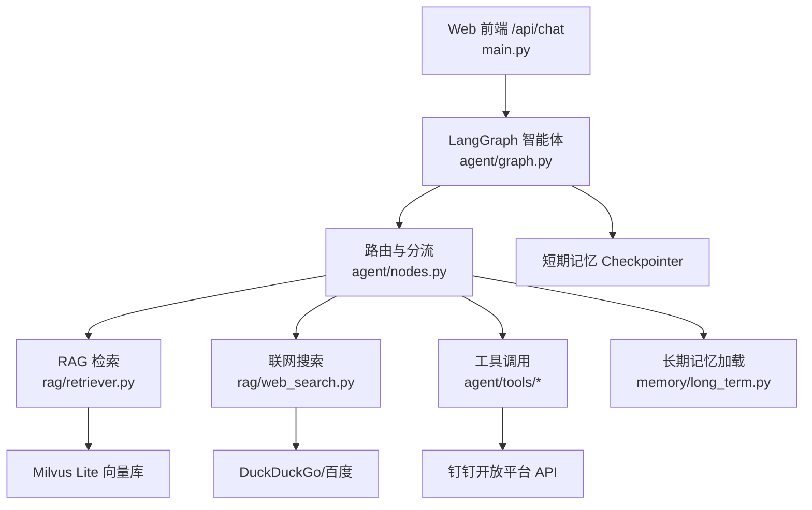
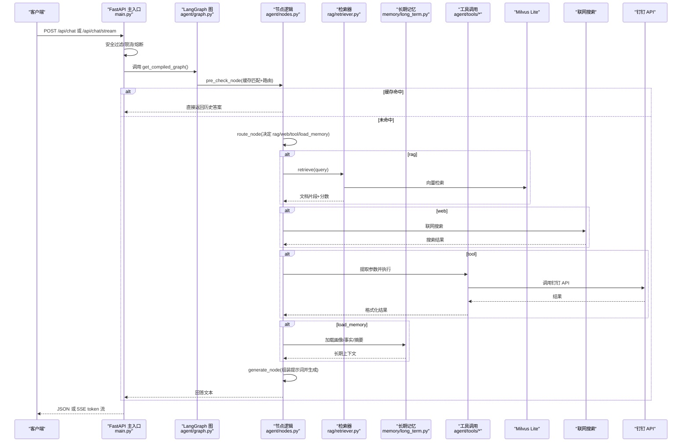
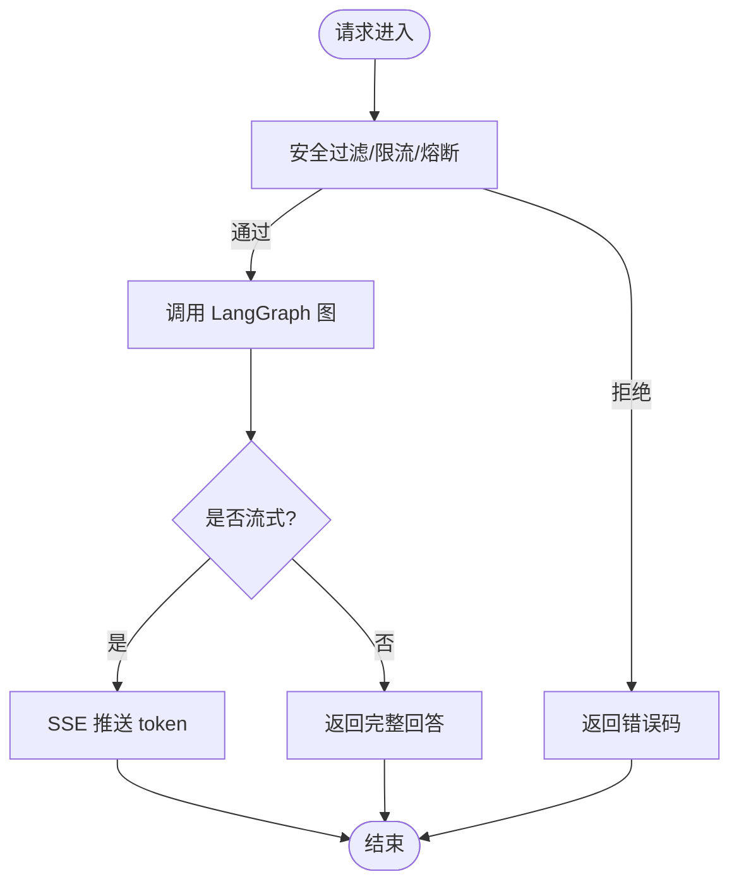
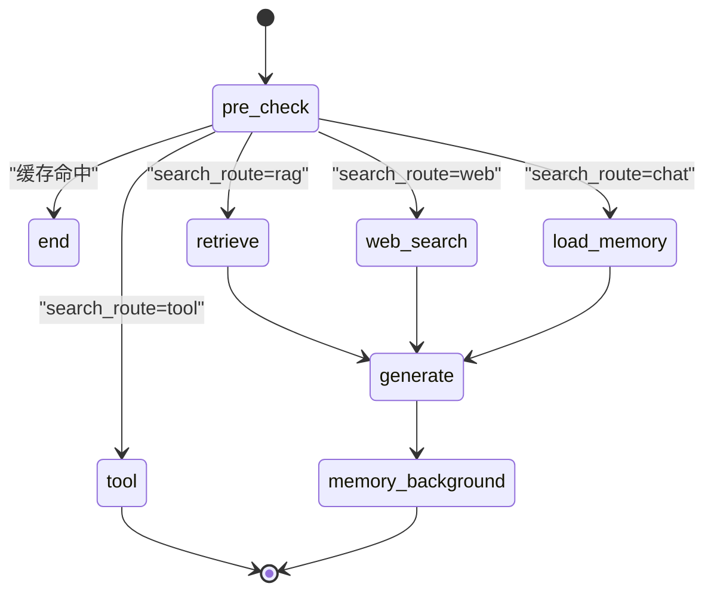
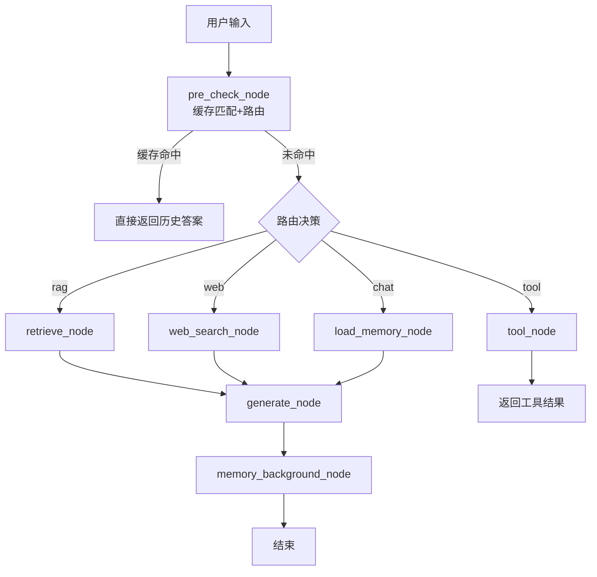
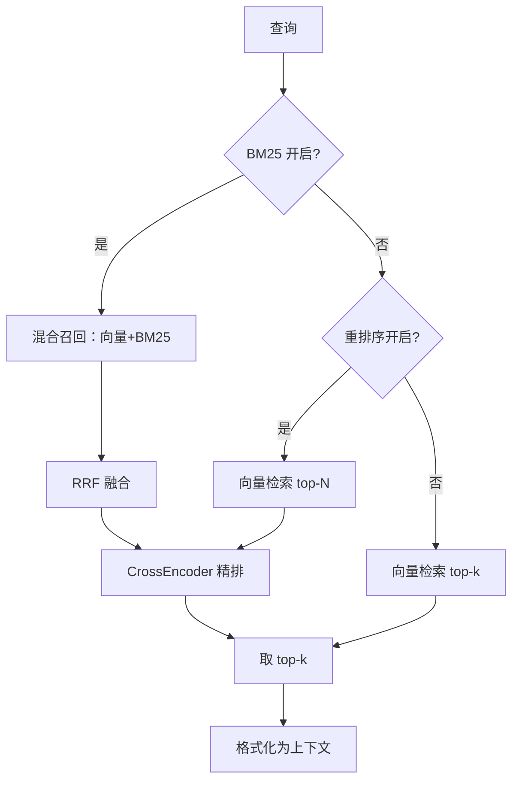
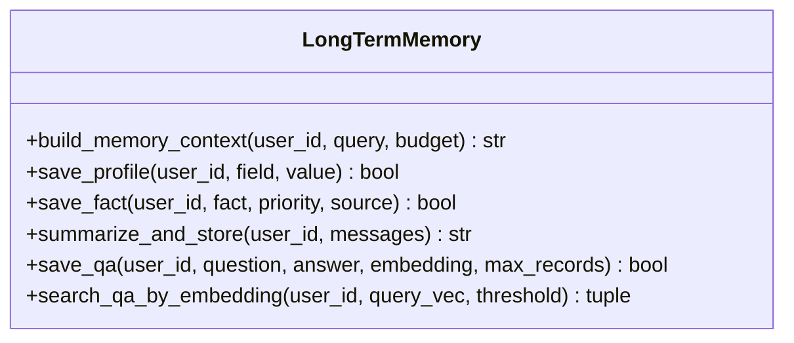
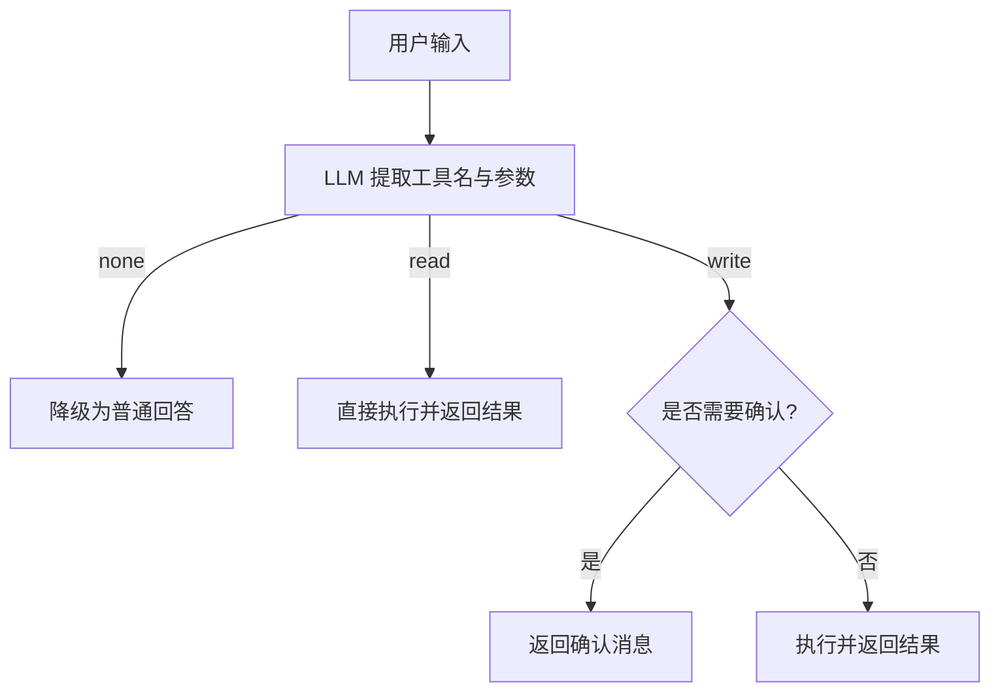
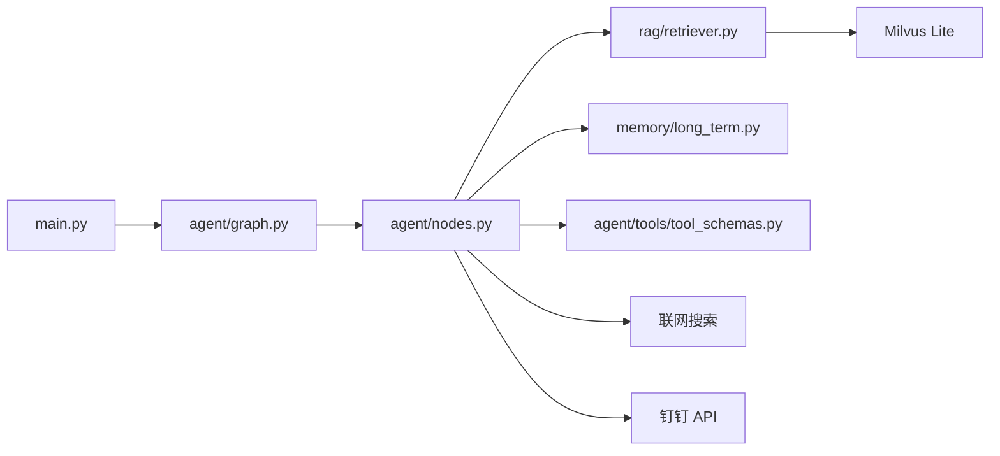

# 项目概览

<cite>
**本文引用的文件**
- [main.py](file://main.py)
- [config/settings.py](file://config/settings.py)
- [agent/graph.py](file://agent/graph.py)
- [agent/nodes.py](file://agent/nodes.py)
- [rag/retriever.py](file://rag/retriever.py)
- [memory/long_term.py](file://memory/long_term.py)
- [agent/tools/tool_schemas.py](file://agent/tools/tool_schemas.py)
- [requirements.txt](file://requirements.txt)
- [Dockerfile](file://Dockerfile)
- [README.md](file://README.md)
</cite>

## 目录
1. [简介](#简介)
2. [项目结构](#项目结构)
3. [核心组件](#核心组件)
4. [架构总览](#架构总览)
5. [详细组件分析](#详细组件分析)
6. [依赖关系分析](#依赖关系分析)
7. [性能与可用性](#性能与可用性)
8. [故障排查指南](#故障排查指南)
9. [结论](#结论)
10. [附录：快速上手与部署](#附录快速上手与部署)

## 简介
本项目是一个基于 LangChain + LangGraph 的企业级 AI 智能体助手，面向钉钉场景提供智能对话、RAG 检索增强生成、记忆管理（短期窗口+长期结构化）、工具调用（待办/会议）等能力。系统通过 FastAPI 暴露 Web 聊天接口与流式 SSE 接口，支持本地 REPL 调试；内置知识库自动同步、多路召回与重排序、联网搜索、输入安全过滤、限流与熔断等工程化特性。

主要目标：
- 以自然语言驱动企业知识问答与办公任务执行
- 提供稳定、可观测、可扩展的智能体工作流
- 降低首请求延迟，提升检索质量与回答准确性
- 为初学者提供清晰的模块划分与定位指引

## 项目结构
- 入口与服务：main.py（FastAPI 应用、健康检查、SSE 流式接口、启动预热）
- 配置中心：config/settings.py（集中管理 LLM、Embedding、向量库、RAG、记忆、工具、限流熔断等）
- 智能体编排：agent/graph.py（LangGraph 状态图构建）、agent/nodes.py（节点函数实现）
- RAG 检索：rag/retriever.py（检索器）、vectorstore/embeddings/reranker/web_search/ingest/file_watcher/ocr/bm25
- 记忆系统：memory/short_term.py（进程内 checkpointer）、memory/long_term.py（SQLite 持久化）
- 工具调用：agent/tools/*（Function Calling Schema 与执行器）
- 评估与测试：evaluation/*、tests/*
- 运行与部署：Dockerfile、docker-compose.yml、requirements.txt、scripts/prefetch_models.py

图表来源
- [main.py:145-210](file://main.py#L145-L210)
- [agent/graph.py:44-102](file://agent/graph.py#L44-L102)
- [agent/nodes.py:92-151](file://agent/nodes.py#L92-L151)
- [rag/retriever.py:18-53](file://rag/retriever.py#L18-L53)

章节来源
- [main.py:1-387](file://main.py#L1-L387)
- [README.md:170-212](file://README.md#L170-L212)

## 核心组件
- 服务入口与接口：提供 REST 与 SSE 流式接口，统一鉴权前置（安全过滤、限流、熔断），并调用智能体工作流
- 智能体工作流：预检查（缓存命中+路由判断）→ 四路分流（RAG/联网搜索/长期记忆/工具调用）→ 生成回答 → 后台记忆更新
- RAG 检索：向量检索 + BM25 多路召回 + CrossEncoder 重排序 + 相关度阈值过滤 + 上下文格式化
- 记忆系统：短期会话压缩摘要（窗口+字符预算）+ 长期结构化记忆（画像/事实/摘要/问答缓存）
- 工具调用：Function Calling 提取意图与参数，写操作需确认，读操作直接执行
- 配置与运维：集中配置、模型预热、向量库增量入库、文件监听自动同步、健康检查

章节来源
- [main.py:45-135](file://main.py#L45-L135)
- [agent/graph.py:1-24](file://agent/graph.py#L1-L24)
- [rag/retriever.py:1-53](file://rag/retriever.py#L1-L53)
- [memory/long_term.py:1-15](file://memory/long_term.py#L1-L15)
- [agent/tools/tool_schemas.py:1-26](file://agent/tools/tool_schemas.py#L1-L26)

## 架构总览
下图展示从 Web 请求到智能体工作流、再到外部资源（向量库、搜索引擎、钉钉 API）的端到端流程。

图表来源
- [main.py:154-314](file://main.py#L154-L314)
- [agent/graph.py:44-102](file://agent/graph.py#L44-L102)
- [agent/nodes.py:92-151](file://agent/nodes.py#L92-L151)
- [rag/retriever.py:18-53](file://rag/retriever.py#L18-L53)
- [memory/long_term.py:424-497](file://memory/long_term.py#L424-L497)
- [agent/tools/tool_schemas.py:8-26](file://agent/tools/tool_schemas.py#L8-L26)

## 详细组件分析

### 服务入口与接口（main.py）
- 启动时预热 LLM 连接与向量库索引，降低首请求延迟
- 提供根页面、REST 聊天接口、健康检查、SSE 流式接口
- 统一前置校验：输入安全过滤、限流、熔断，异常记录与恢复
- 流式接口具备整体超时保护，避免连接卡死

图表来源
- [main.py:154-314](file://main.py#L154-L314)

章节来源
- [main.py:45-135](file://main.py#L45-L135)
- [main.py:154-314](file://main.py#L154-L314)

### 智能体工作流（agent/graph.py）
- 使用 LangGraph StateGraph 构建状态图，节点包括：pre_check、load_memory、retrieve、web_search、tool、generate、memory_background
- 条件边根据 search_route 分流至不同分支，tool 分支直接返回结果
- 编译时挂载 checkpointer，按 thread_id 维护短期上下文
- 提供 chat、chat_stream、astream_chat 三种调用方式

图表来源
- [agent/graph.py:44-102](file://agent/graph.py#L44-L102)

章节来源
- [agent/graph.py:1-24](file://agent/graph.py#L1-L24)
- [agent/graph.py:44-102](file://agent/graph.py#L44-L102)
- [agent/graph.py:117-255](file://agent/graph.py#L117-L255)

### 节点逻辑（agent/nodes.py）
- pre_check_node：合并问答缓存匹配与路由判断，优先处理 pending_confirmation 状态
- route_node/_decide_route：LLM 路由 + 关键词兜底，时效性问题优先走联网搜索
- retrieve_node：可选查询改写 → 检索 → 相关度阈值过滤 → 上下文格式化
- web_search_node：联网搜索并复用 rag_context 字段
- load_memory_node：加载长期记忆上下文与会话摘要
- generate_node：组装 system prompt 与历史消息，流式生成回答，失败降级备用模型
- memory_background_node：后台抽取关键信息、更新长期记忆、刷新会话摘要、保存问答缓存
- tool_node：Function Calling 提取工具名与参数，写操作需确认，读操作直接执行

图表来源
- [agent/nodes.py:92-151](file://agent/nodes.py#L92-L151)
- [agent/nodes.py:284-341](file://agent/nodes.py#L284-L341)
- [agent/nodes.py:344-360](file://agent/nodes.py#L344-L360)
- [agent/nodes.py:499-532](file://agent/nodes.py#L499-L532)
- [agent/nodes.py:630-690](file://agent/nodes.py#L630-L690)

章节来源
- [agent/nodes.py:23-212](file://agent/nodes.py#L23-L212)
- [agent/nodes.py:232-341](file://agent/nodes.py#L232-L341)
- [agent/nodes.py:344-360](file://agent/nodes.py#L344-L360)
- [agent/nodes.py:499-532](file://agent/nodes.py#L499-L532)
- [agent/nodes.py:630-690](file://agent/nodes.py#L630-L690)

### RAG 检索（rag/retriever.py）
- 两阶段检索：向量召回 top-N → CrossEncoder 精排 top-k
- 多路召回：BM25 开启时并行召回，RRF 融合后精排
- 相关度阈值过滤：仅在纯向量路径下生效，避免分数语义不一致
- 上下文格式化：统一归一化分数，标注来源与标题

图表来源
- [rag/retriever.py:18-53](file://rag/retriever.py#L18-L53)
- [rag/retriever.py:55-110](file://rag/retriever.py#L55-L110)
- [rag/retriever.py:113-140](file://rag/retriever.py#L113-L140)

章节来源
- [rag/retriever.py:1-140](file://rag/retriever.py#L1-L140)

### 长期记忆（memory/long_term.py）
- 分层结构化记忆：用户画像（P0）、关键事实（P0/P1）、历史摘要（P1/P2）、会话压缩摘要、问答缓存
- 预算控制：按字符预算逐层填充，P0 硬保留不受预算约束
- 规则快速抽取：零 LLM 成本提取高优先级信息（姓名、项目、公司）
- 问答缓存：相似问题直接复用历史答案，跳过大模型生成

图表来源
- [memory/long_term.py:424-497](file://memory/long_term.py#L424-L497)
- [memory/long_term.py:613-633](file://memory/long_term.py#L613-L633)
- [memory/long_term.py:729-800](file://memory/long_term.py#L729-L800)

章节来源
- [memory/long_term.py:1-15](file://memory/long_term.py#L1-L15)
- [memory/long_term.py:424-497](file://memory/long_term.py#L424-L497)
- [memory/long_term.py:613-633](file://memory/long_term.py#L613-L633)
- [memory/long_term.py:729-800](file://memory/long_term.py#L729-L800)

### 工具调用（agent/tools/tool_schemas.py）
- 定义 6 个钉钉操作工具的 Function Calling Schema（创建/查询待办、创建/取消/修改/查询会议）
- 时间格式采用 ISO 8601，attendees 为姓名或手机号列表
- 写操作需用户确认，读操作直接执行

图表来源
- [agent/tools/tool_schemas.py:8-26](file://agent/tools/tool_schemas.py#L8-L26)
- [agent/nodes.py:646-690](file://agent/nodes.py#L646-L690)

章节来源
- [agent/tools/tool_schemas.py:1-121](file://agent/tools/tool_schemas.py#L1-L121)
- [agent/nodes.py:646-690](file://agent/nodes.py#L646-L690)

## 依赖关系分析
- 核心框架：LangChain/LangGraph、FastAPI、uvicorn
- 模型与向量库：OpenAI 兼容接口（千问）、Milvus Lite、sentence-transformers、transformers、torch、rank-bm25
- 多模态文档处理：pypdf、python-docx、openpyxl、easyocr
- 运行时特性：watchdog（文件监听）、httpx（HTTP 客户端）
- 评估与追踪：langsmith、openevals

图表来源
- [requirements.txt:1-53](file://requirements.txt#L1-L53)
- [main.py:154-314](file://main.py#L154-L314)
- [agent/graph.py:44-102](file://agent/graph.py#L44-L102)

章节来源
- [requirements.txt:1-53](file://requirements.txt#L1-L53)

## 性能与可用性
- 启动预热：在应用启动时建立 LLM 连接池与 DNS 解析，显著降低首请求延迟
- 向量库预热：启动时检查 Milvus Lite 数据一致性，必要时全量重建；开启 BM25 时预热索引
- 流式响应：SSE 流式输出 token，支持整体超时保护，避免连接卡死
- 多路召回与重排序：提升检索质量，减少幻觉
- 记忆优化：短期窗口+字符预算防丢失，长期分层注入保证关键信息不丢
- 单 Worker 运行：短期记忆为进程内 MemorySaver，禁止多进程导致状态不一致

章节来源
- [main.py:45-135](file://main.py#L45-L135)
- [main.py:228-314](file://main.py#L228-L314)
- [rag/retriever.py:18-53](file://rag/retriever.py#L18-L53)
- [memory/long_term.py:424-497](file://memory/long_term.py#L424-L497)
- [Dockerfile:41-50](file://Dockerfile#L41-L50)

## 故障排查指南
- 输入被拒绝（403）：检查安全过滤配置与敏感词黑名单
- 限流（429）：调整 rate_limit_per_minute 或检查并发请求
- 熔断（503）：连续失败达到阈值触发，等待冷却后自动恢复
- 流式超时：调整 stream_timeout，检查网络与 LLM 服务状态
- 检索为空：检查向量库是否已入库、BM25 开关与候选数、重排序开关与 top_k
- 记忆未更新：检查长期记忆数据库路径、WAL 模式与写入锁
- 工具调用失败：确认钉钉凭证与权限，检查写操作确认流程

章节来源
- [main.py:166-185](file://main.py#L166-L185)
- [main.py:241-260](file://main.py#L241-L260)
- [config/settings.py:135-149](file://config/settings.py#L135-L149)
- [memory/long_term.py:30-47](file://memory/long_term.py#L30-L47)

## 结论
本项目以 LangGraph 为核心编排智能体工作流，结合 RAG、记忆管理与工具调用，形成完整的钉钉 AI 智能体解决方案。通过启动预热、多路召回、重排序、流式响应与记忆预算控制，系统在性能与质量上取得平衡。模块化设计便于扩展与维护，适合企业级场景落地。

## 附录：快速上手与部署
- 环境要求：Python 3.12+
- 安装依赖：pip install -r requirements.txt
- 配置：复制 .env.example 并填写千问 API Key、base_url 等
- 构建知识库：将文档放入 data/docs/，执行入库脚本
- 运行服务：uvicorn main:app --host 0.0.0.0 --port 8000 --reload
- Docker 部署：docker compose build && docker compose up -d

章节来源
- [README.md:43-130](file://README.md#L43-L130)
- [Dockerfile:1-50](file://Dockerfile#L1-L50)