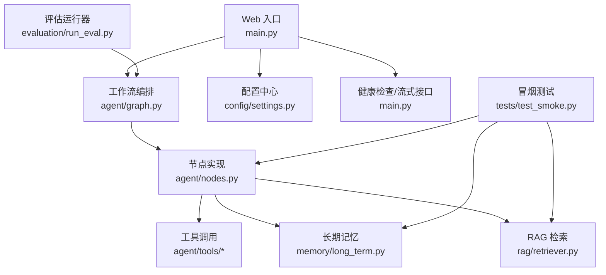
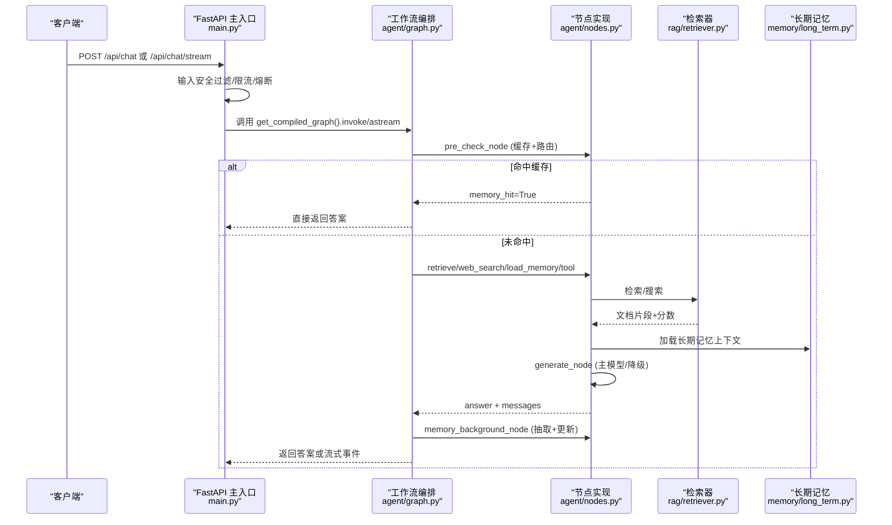
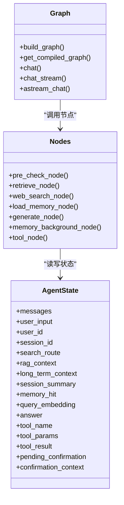
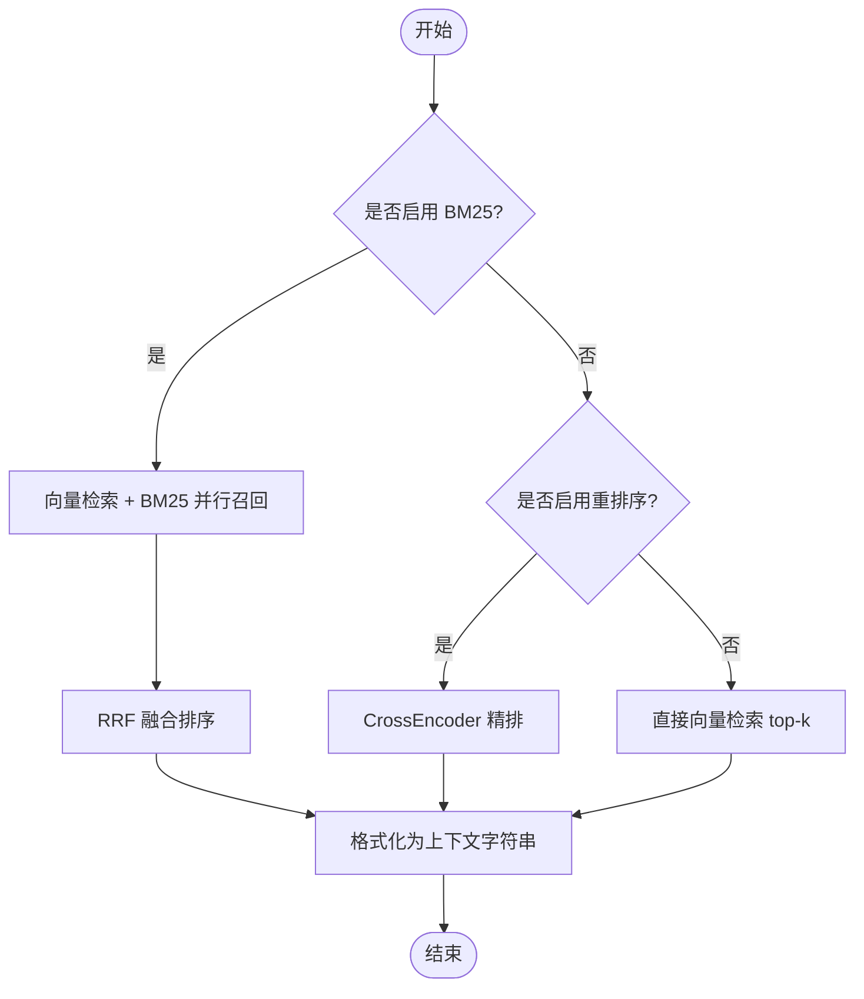
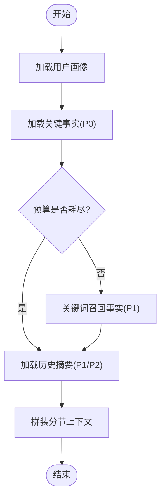
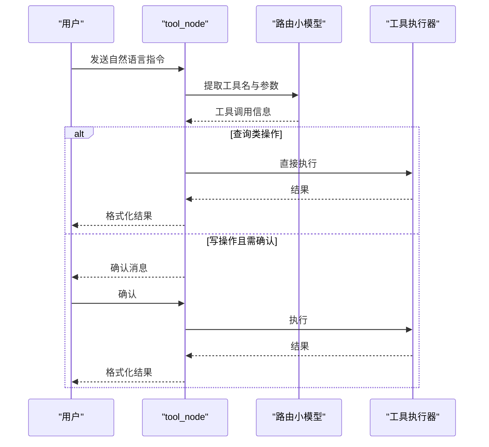
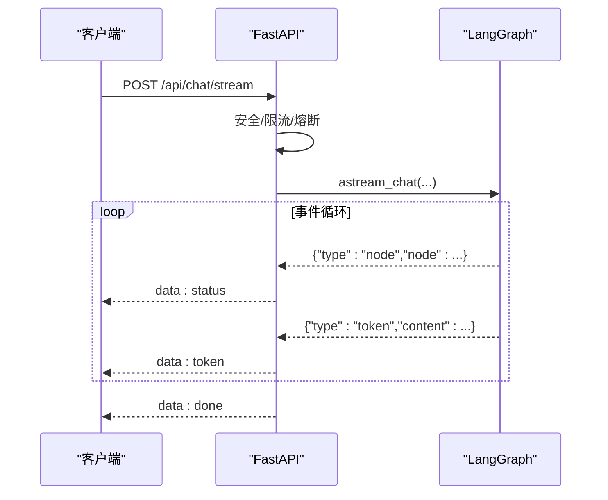
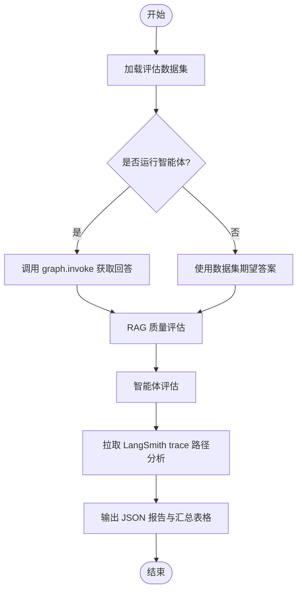
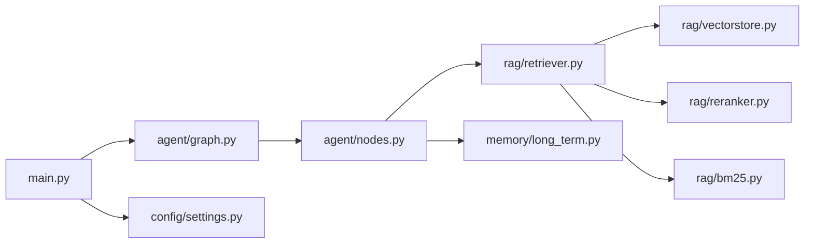

# 开发指南

<cite>
**本文引用的文件**
- [main.py](file://main.py)
- [requirements.txt](file://requirements.txt)
- [config/settings.py](file://config/settings.py)
- [agent/graph.py](file://agent/graph.py)
- [agent/nodes.py](file://agent/nodes.py)
- [agent/state.py](file://agent/state.py)
- [rag/retriever.py](file://rag/retriever.py)
- [memory/long_term.py](file://memory/long_term.py)
- [evaluation/run_eval.py](file://evaluation/run_eval.py)
- [tests/test_smoke.py](file://tests/test_smoke.py)
- [Docker部署指南.md](file://Docker部署指南.md)
</cite>

## 目录
1. [简介](#简介)
2. [项目结构](#项目结构)
3. [核心组件](#核心组件)
4. [架构总览](#架构总览)
5. [详细组件分析](#详细组件分析)
6. [依赖关系分析](#依赖关系分析)
7. [性能与优化](#性能与优化)
8. [故障排查](#故障排查)
9. [结论](#结论)
10. [附录：开发与协作规范](#附录开发与协作规范)

## 简介
本指南面向贡献者与扩展开发者，提供完整的开发环境搭建、调试技巧、测试方法、评估框架使用，以及扩展 RAG、新增工具、自定义节点处理逻辑等任务说明。同时给出代码规范、提交规范与协作流程建议，帮助团队高效协作与持续交付。

## 项目结构
本项目采用分层模块化设计：
- Web 服务入口与路由：main.py
- 配置管理：config/settings.py（集中化环境变量与默认值）
- 智能体工作流编排：agent/graph.py（LangGraph StateGraph）
- 节点实现：agent/nodes.py（预检查、检索、生成、记忆、工具调用等）
- 状态定义：agent/state.py（AgentState TypedDict）
- RAG 检索与重排：rag/retriever.py、rag/vectorstore.py、rag/reranker.py 等
- 长期记忆：memory/long_term.py（SQLite 持久化、分层上下文构建）
- 评估体系：evaluation/run_eval.py、evaluation/rag_eval.py、evaluation/agent_eval.py
- 冒烟测试：tests/test_smoke.py
- 容器化部署：Dockerfile、docker-compose.yml、Docker部署指南.md

图表来源
- [main.py:145-314](file://main.py#L145-L314)
- [agent/graph.py:44-102](file://agent/graph.py#L44-L102)
- [agent/nodes.py:92-158](file://agent/nodes.py#L92-L158)
- [rag/retriever.py:18-53](file://rag/retriever.py#L18-L53)
- [memory/long_term.py:424-497](file://memory/long_term.py#L424-L497)
- [evaluation/run_eval.py:23-105](file://evaluation/run_eval.py#L23-L105)
- [tests/test_smoke.py:15-177](file://tests/test_smoke.py#L15-L177)

章节来源
- [main.py:1-387](file://main.py#L1-L387)
- [config/settings.py:1-216](file://config/settings.py#L1-L216)

## 核心组件
- 配置中心：通过 pydantic-settings 统一加载环境变量与 .env，提供 LLM、Embedding、向量库、记忆、安全、限流熔断、工具调用、评估等全局开关与参数。
- 工作流编排：基于 LangGraph 的状态图，将“预检查→分流→检索/搜索/记忆→生成→后台记忆更新”串联为可维护的流水线。
- 节点实现：每个节点负责单一职责（缓存匹配、路由判断、RAG 检索、联网搜索、长期记忆加载、生成回答、工具调用、后台记忆更新）。
- RAG 检索：支持向量检索 + BM25 多路召回 + RRF 融合 + CrossEncoder 重排序，并提供上下文格式化。
- 长期记忆：SQLite 分层存储（画像、事实、摘要、会话压缩、问答缓存），按预算与优先级注入上下文。
- 评估框架：批量运行数据集，评估 RAG 质量与智能体表现，拉取 LangSmith trace 做路径合理性分析。
- 测试与冒烟：覆盖导入、配置读取、记忆存取、检索格式化、模块可用性验证等。

章节来源
- [config/settings.py:19-161](file://config/settings.py#L19-L161)
- [agent/graph.py:44-102](file://agent/graph.py#L44-L102)
- [agent/nodes.py:92-158](file://agent/nodes.py#L92-L158)
- [rag/retriever.py:18-53](file://rag/retriever.py#L18-L53)
- [memory/long_term.py:424-497](file://memory/long_term.py#L424-L497)
- [evaluation/run_eval.py:23-105](file://evaluation/run_eval.py#L23-L105)
- [tests/test_smoke.py:15-177](file://tests/test_smoke.py#L15-L177)

## 架构总览
系统以 FastAPI 暴露 Web 接口，启动时预热 LLM 连接与向量库索引；请求进入后经过安全过滤、限流与熔断，再进入 LangGraph 工作流执行；最终返回答案或流式 token。评估模块可独立运行，对数据集进行批量评测并输出报告。

图表来源
- [main.py:154-314](file://main.py#L154-L314)
- [agent/graph.py:44-102](file://agent/graph.py#L44-L102)
- [agent/nodes.py:92-158](file://agent/nodes.py#L92-L158)
- [rag/retriever.py:18-53](file://rag/retriever.py#L18-L53)
- [memory/long_term.py:424-497](file://memory/long_term.py#L424-L497)

## 详细组件分析

### 工作流与状态（LangGraph）
- 状态定义：AgentState 包含消息历史、用户与会话标识、路由结果、检索上下文、长期记忆上下文、会话摘要、问答命中标志、工具调用相关字段等。
- 图构建：注册节点与边，pre_check 条件边根据 search_route 分流到 tool/retrieve/web_search/load_memory/generate，generate 完成后进入 memory_background 异步更新记忆。
- 流式支持：chat_stream 与 astream_chat 统一封装 updates/messages 双模式事件，过滤内部节点消息，仅透传 generate 增量与必要节点进度。

图表来源
- [agent/state.py:12-51](file://agent/state.py#L12-L51)
- [agent/graph.py:44-102](file://agent/graph.py#L44-L102)
- [agent/nodes.py:92-158](file://agent/nodes.py#L92-L158)

章节来源
- [agent/state.py:1-54](file://agent/state.py#L1-L54)
- [agent/graph.py:1-255](file://agent/graph.py#L1-L255)
- [agent/nodes.py:1-780](file://agent/nodes.py#L1-L780)

### RAG 检索与重排序
- 检索策略：BM25 开启时进行向量检索与关键词检索并行召回，RRF 融合；否则根据 rerank_enabled 决定是否进行 CrossEncoder 精排或直接 top-k。
- 上下文格式化：将检索结果转为带来源与相关度的文本块，供生成节点注入 prompt。
- 阈值过滤：仅在纯向量检索路径下应用最小相关度过滤，避免跨分数语义导致的误判。

图表来源
- [rag/retriever.py:18-53](file://rag/retriever.py#L18-L53)
- [rag/retriever.py:55-110](file://rag/retriever.py#L55-L110)
- [rag/retriever.py:113-140](file://rag/retriever.py#L113-L140)

章节来源
- [rag/retriever.py:1-140](file://rag/retriever.py#L1-L140)

### 长期记忆与问答缓存
- 分层上下文：P0 画像与关键事实硬保留；P1 最近摘要与关键词召回事实按预算填充；P2 更早摘要剩余预算填充。
- 会话压缩：短期窗口超出时生成会话摘要注入历史，防止上下文硬丢失。
- 问答缓存：相似问题直接复用历史答案，减少大模型调用；相似度阈值控制严格程度。

图表来源
- [memory/long_term.py:424-497](file://memory/long_term.py#L424-L497)
- [memory/long_term.py:613-633](file://memory/long_term.py#L613-L633)
- [memory/long_term.py:729-800](file://memory/long_term.py#L729-L800)

章节来源
- [memory/long_term.py:1-820](file://memory/long_term.py#L1-L820)

### 工具调用（待办/会议）
- 意图识别：通过路由小模型从用户输入提取工具名与参数。
- 确认机制：写操作需用户确认（可配置），确认后执行工具并返回结果。
- 结果格式化：不同工具类型对应不同格式化函数，返回用户可读文本。

图表来源
- [agent/nodes.py:647-780](file://agent/nodes.py#L647-L780)

章节来源
- [agent/nodes.py:647-780](file://agent/nodes.py#L647-L780)

### Web 接口与流式响应
- 同步接口：/api/chat 直接调用 graph.invoke 返回完整答案。
- 流式接口：/api/chat/stream 使用 SSE 推送 node 进度与 token 增量，整体超时保护与熔断记录。
- 健康检查：/health 返回服务状态与 checkpointer 类型。

图表来源
- [main.py:228-314](file://main.py#L228-L314)
- [agent/graph.py:190-255](file://agent/graph.py#L190-L255)

章节来源
- [main.py:145-314](file://main.py#L145-L314)
- [agent/graph.py:190-255](file://agent/graph.py#L190-L255)

### 评估框架使用
- 运行方式：python -m evaluation.run_eval 或 --no-agent 跳过智能体调用。
- 流程：加载数据集 → 运行智能体获取回答（可选）→ RAG 质量评估 → 智能体评估 → LangSmith trace 路径分析 → 输出 JSON 报告与控制台汇总。
- 指标：各维度平均分汇总，便于对比不同配置或模型。

图表来源
- [evaluation/run_eval.py:23-105](file://evaluation/run_eval.py#L23-L105)
- [evaluation/run_eval.py:108-156](file://evaluation/run_eval.py#L108-L156)

章节来源
- [evaluation/run_eval.py:1-156](file://evaluation/run_eval.py#L1-L156)

## 依赖关系分析
- 外部依赖：langchain、langgraph、openai、pymilvus、sentence-transformers、huggingface-hub、transformers、torch、fastapi、uvicorn、pydantic、watchdog、rank-bm25、easyocr 等。
- 模块耦合：
  - main.py 依赖 agent/graph.py、agent/safety.py、agent/rate_limiter.py、config/settings.py、rag/vectorstore.py、rag/ingest.py、rag/bm25.py、rag/file_watcher.py。
  - agent/graph.py 依赖 agent/nodes.py、agent/state.py、memory/short_term.py。
  - agent/nodes.py 依赖 config/settings.py、rag/retriever.py、rag/web_search.py、memory/long_term.py、agent/prompts.py、agent/tools/*。
  - rag/retriever.py 依赖 rag/vectorstore.py、rag/reranker.py、rag/bm25.py。
  - memory/long_term.py 依赖 config/settings.py、langchain_openai（摘要生成）。
- 潜在循环：无直接循环依赖；模块间通过函数与配置解耦。

图表来源
- [main.py:154-314](file://main.py#L154-L314)
- [agent/graph.py:44-102](file://agent/graph.py#L44-L102)
- [agent/nodes.py:92-158](file://agent/nodes.py#L92-L158)
- [rag/retriever.py:18-53](file://rag/retriever.py#L18-L53)
- [config/settings.py:19-161](file://config/settings.py#L19-L161)

章节来源
- [requirements.txt:1-53](file://requirements.txt#L1-L53)
- [main.py:154-314](file://main.py#L154-L314)
- [agent/graph.py:44-102](file://agent/graph.py#L44-L102)
- [agent/nodes.py:92-158](file://agent/nodes.py#L92-L158)
- [rag/retriever.py:18-53](file://rag/retriever.py#L18-L53)
- [config/settings.py:19-161](file://config/settings.py#L19-L161)

## 性能与优化
- 启动预热：在应用启动时预热 LLM 连接（TLS 握手、DNS 解析、连接池建立）与向量库索引，降低首请求延迟。
- 流式响应：SSE 推送 token 增量，提升用户体验；设置整体超时保护，避免连接卡死。
- 检索优化：BM25 多路召回 + RRF 融合提升精确匹配召回率；CrossEncoder 重排序提高相关性；纯向量路径下应用相关度阈值过滤。
- 记忆优化：分层上下文与预算控制，避免过长上下文导致成本与延迟上升；会话压缩摘要防止历史丢失。
- 降级与重试：主模型失败自动降级到备用模型；LLM 调用支持最大重试次数与超时配置。

[本节为通用性能讨论，不直接分析具体文件]

## 故障排查
- 启动失败：检查 .env 配置是否齐全（LLM_API_KEY、LLM_BASE_URL、LLM_MODEL 等）；查看日志确认模型下载与初始化是否成功。
- 健康检查不通过：服务启动慢（模型加载耗时）或异常；查看应用日志与端口占用情况。
- 工具调用不可用：确认 TOOL_CALLING_ENABLED=true 与钉钉权限；检查路由是否正确识别为 tool。
- 向量库为空：启动时自动检测并触发全量重建；若仍为空，检查数据目录权限与 manifest 清单。
- 流式超时：调整 stream_timeout；检查网络与 LLM 服务可用性。

章节来源
- [Docker部署指南.md:324-442](file://Docker部署指南.md#L324-L442)
- [main.py:45-135](file://main.py#L45-L135)
- [main.py:228-314](file://main.py#L228-L314)

## 结论
本项目以 LangGraph 为核心编排智能体工作流，结合 RAG、长期记忆与工具调用，提供高可用、可扩展的 AI 助手能力。通过统一的配置中心、完善的评估与测试体系，以及容器化部署方案，便于团队协作与持续交付。建议遵循本文的开发与协作规范，确保代码质量与稳定性。

[本节为总结性内容，不直接分析具体文件]

## 附录：开发与协作规范

### 开发环境搭建
- 安装 Python 依赖：pip install -r requirements.txt
- 配置环境变量：创建 .env 文件，填写 LLM_API_KEY、LLM_BASE_URL、LLM_MODEL、DINGTALK_APP_KEY、DINGTALK_APP_SECRET 等必填项
- 启动服务：uvicorn main:app --host 0.0.0.0 --port 8000 --reload
- 本地 REPL 调试：python main.py --repl

章节来源
- [requirements.txt:1-53](file://requirements.txt#L1-L53)
- [Docker部署指南.md:28-47](file://Docker部署指南.md#L28-L47)
- [main.py:364-387](file://main.py#L364-L387)

### 调试技巧
- 使用 /health 检查服务状态
- 查看日志定位错误（LLM 调用、检索失败、记忆写入异常等）
- 流式接口观察 node 进度与 token 增量，快速定位瓶颈
- 使用 REPL 模式交互式测试智能体

章节来源
- [main.py:317-327](file://main.py#L317-L327)
- [main.py:329-363](file://main.py#L329-L363)

### 测试方法
- 冒烟测试：python -m pytest tests/test_smoke.py -v 或 python tests/test_smoke.py
- 覆盖范围：配置导入、记忆规则抽取与上下文构建、短期窗口压缩、问答缓存、RAG 上下文格式化、OCR/Embedding/Reranker/WebSearch 模块导入、向量库函数定义等

章节来源
- [tests/test_smoke.py:1-366](file://tests/test_smoke.py#L1-L366)

### 评估框架使用
- 运行评估：python -m evaluation.run_eval
- 跳过智能体：python -m evaluation.run_eval --no-agent
- 输出报告：python -m evaluation.run_eval --output report.json

章节来源
- [evaluation/run_eval.py:1-156](file://evaluation/run_eval.py#L1-L156)

### 扩展指南
- 添加新工具：
  - 在 agent/tools/ 下实现工具执行与格式化函数
  - 在 agent/nodes.py 的 _execute_tool 中注册工具名与执行器
  - 在 tool_schemas.py 中补充提示词与参数校验
- 扩展 RAG 功能：
  - 修改 rag/retriever.py 中的检索策略（如增加新的召回源或融合算法）
  - 调整 config/settings.py 中的检索参数（BM25、重排序、阈值等）
- 自定义节点处理逻辑：
  - 在 agent/nodes.py 中新增节点函数
  - 在 agent/graph.py 中注册节点与边，调整条件路由
  - 在 agent/state.py 中扩展 AgentState 字段（如需）

章节来源
- [agent/nodes.py:647-780](file://agent/nodes.py#L647-L780)
- [rag/retriever.py:18-53](file://rag/retriever.py#L18-L53)
- [config/settings.py:54-100](file://config/settings.py#L54-L100)
- [agent/graph.py:44-102](file://agent/graph.py#L44-L102)
- [agent/state.py:12-51](file://agent/state.py#L12-L51)

### 代码规范
- 命名：模块与函数使用小写下划线，类名使用驼峰
- 注释：关键逻辑添加中文注释，说明意图与边界条件
- 错误处理：对外部依赖调用包裹 try/except，静默降级或记录日志
- 配置：所有可调参数集中在 config/settings.py，避免硬编码

[本节为通用规范建议，不直接分析具体文件]

### 提交规范
- 提交信息：简洁明了，包含变更目的与影响范围
- 分支策略：feature/* 用于新功能，fix/* 用于修复，hotfix/* 用于紧急修复
- 代码审查：至少一名 reviewer 批准后方可合并
- 测试：提交前运行冒烟测试与评估脚本，确保无回归

[本节为通用协作建议，不直接分析具体文件]

### 协作流程
- 需求评审：明确目标与验收标准
- 开发迭代：小步快跑，频繁提交与沟通
- 集成测试：定期运行评估与冒烟测试，确保系统稳定性
- 发布准备：更新文档与配置，进行预发布验证

[本节为通用协作建议，不直接分析具体文件]