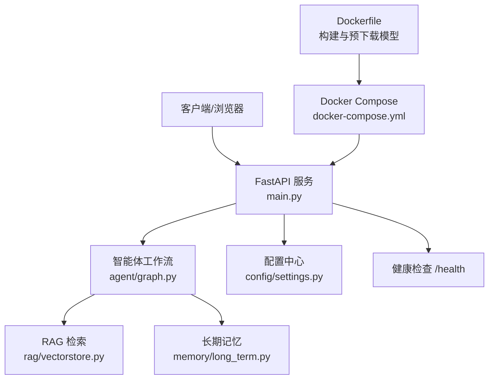
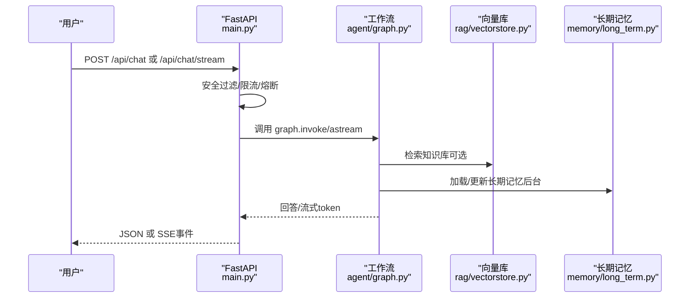
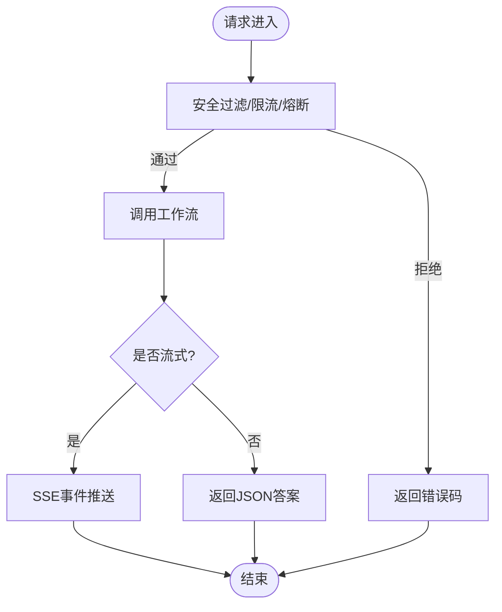
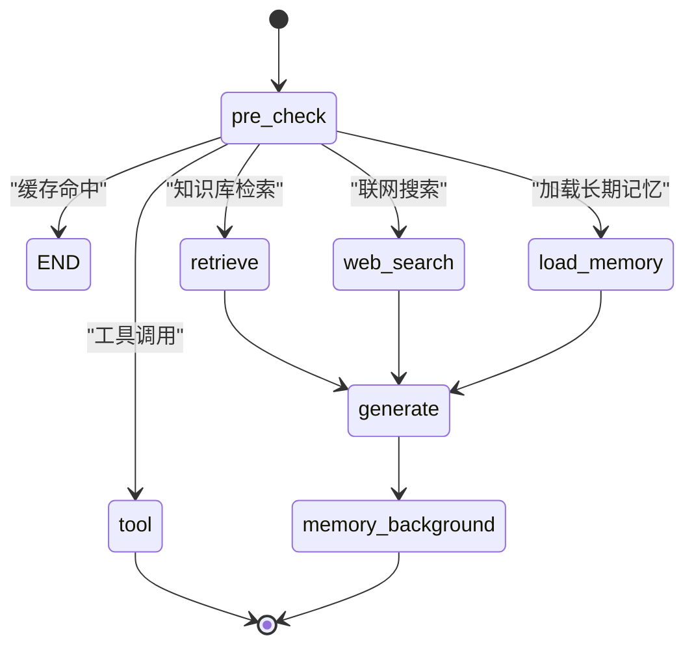
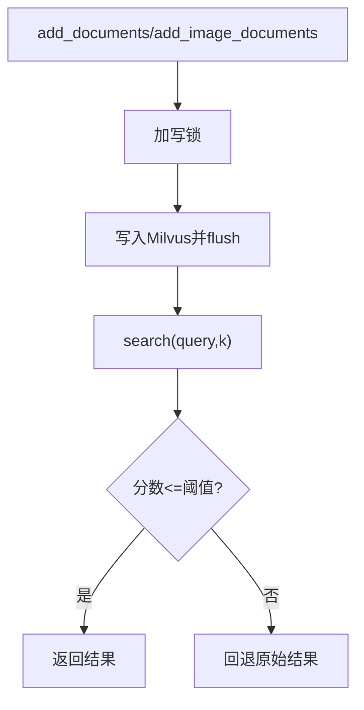
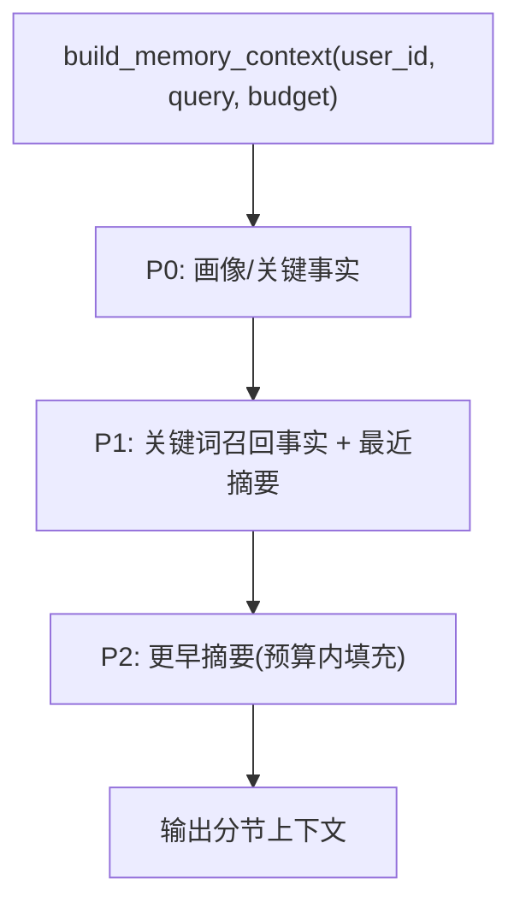
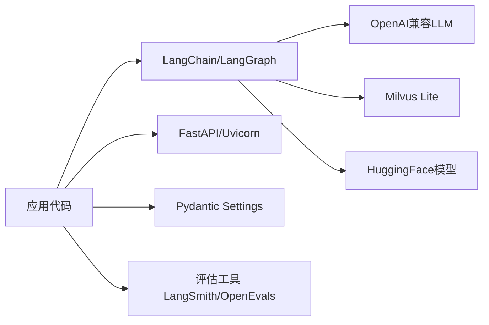

# 开发流程

<cite>
**本文引用的文件**
- [main.py](file://main.py)
- [requirements.txt](file://requirements.txt)
- [Dockerfile](file://Dockerfile)
- [docker-compose.yml](file://docker-compose.yml)
- [config/settings.py](file://config/settings.py)
- [agent/graph.py](file://agent/graph.py)
- [rag/vectorstore.py](file://rag/vectorstore.py)
- [memory/long_term.py](file://memory/long_term.py)
- [tests/test_smoke.py](file://tests/test_smoke.py)
- [.gitignore](file://.gitignore)
- [Docker部署指南.md](file://Docker部署指南.md)
- [需求分析文档.md](file://需求分析文档.md)
</cite>

## 目录
1. [简介](#简介)
2. [项目结构](#项目结构)
3. [核心组件](#核心组件)
4. [架构总览](#架构总览)
5. [详细组件分析](#详细组件分析)
6. [依赖分析](#依赖分析)
7. [性能与稳定性](#性能与稳定性)
8. [代码规范与提交规范](#代码规范与提交规范)
9. [分支管理与协作流程](#分支管理与协作流程)
10. [版本控制与发布流程](#版本控制与发布流程)
11. [代码审查与质量门禁](#代码审查与质量门禁)
12. [依赖管理](#依赖管理)
13. [故障排查](#故障排查)
14. [结论](#结论)

## 简介
本指南面向钉钉AI智能体助手项目的开发与运维团队，提供从代码规范、提交规范、分支管理、协作流程到版本控制、依赖管理、发布流程的一体化标准。结合项目现有实现（FastAPI服务、LangGraph工作流、Milvus Lite向量库、SQLite长期记忆、Docker化部署），给出可落地的Git工作流建议、代码质量检查工具链与团队协作最佳实践，确保高效、稳定、可追溯的交付节奏。

## 项目结构
- 入口与服务：FastAPI主入口、健康检查、Web聊天接口、SSE流式接口
- 智能体编排：基于LangGraph的状态图与工作流节点
- RAG检索：Milvus Lite向量库、多模态Embedding、重排序、BM25多路召回、文件监听自动入库
- 记忆系统：短期记忆（进程内checkpointer）、长期记忆（SQLite分层结构化）
- 配置与环境：pydantic-settings统一配置，环境变量/.env驱动
- 测试与评估：冒烟测试、RAG与Agent评估流水线
- 容器化：Docker镜像构建、Compose编排、健康检查与数据持久化

**图示来源**
- [main.py:145-326](file://main.py#L145-L326)
- [agent/graph.py:44-102](file://agent/graph.py#L44-L102)
- [rag/vectorstore.py:29-76](file://rag/vectorstore.py#L29-L76)
- [memory/long_term.py:30-47](file://memory/long_term.py#L30-L47)
- [config/settings.py:19-216](file://config/settings.py#L19-L216)
- [docker-compose.yml:4-26](file://docker-compose.yml#L4-L26)
- [Dockerfile:1-51](file://Dockerfile#L1-L51)

**章节来源**
- [main.py:1-387](file://main.py#L1-L387)
- [docker-compose.yml:1-26](file://docker-compose.yml#L1-L26)
- [Dockerfile:1-51](file://Dockerfile#L1-L51)

## 核心组件
- Web服务与健康检查：提供REST与SSE接口，内置限流、熔断与安全过滤
- 智能体工作流：预检查、路由分流、检索/搜索/工具/生成、后台记忆更新
- 向量检索：Milvus Lite本地持久化，支持文本与图像混合检索，重排序与BM25多路召回
- 记忆系统：短期会话上下文、长期结构化记忆（画像/事实/摘要/QA缓存）
- 配置管理：集中化环境变量与默认值，路径与开关统一治理
- 容器化：构建期模型预下载、运行期CPU离线模式、数据卷持久化

**章节来源**
- [main.py:45-136](file://main.py#L45-L136)
- [agent/graph.py:1-102](file://agent/graph.py#L1-L102)
- [rag/vectorstore.py:1-106](file://rag/vectorstore.py#L1-L106)
- [memory/long_term.py:1-125](file://memory/long_term.py#L1-L125)
- [config/settings.py:19-216](file://config/settings.py#L19-L216)

## 架构总览
下图展示请求从进入FastAPI到智能体工作流、RAG检索与记忆更新的完整链路，以及启动时的预热与自动入库流程。

**图示来源**
- [main.py:154-314](file://main.py#L154-L314)
- [agent/graph.py:117-255](file://agent/graph.py#L117-L255)
- [rag/vectorstore.py:164-184](file://rag/vectorstore.py#L164-L184)
- [memory/long_term.py:424-497](file://memory/long_term.py#L424-L497)

## 详细组件分析

### FastAPI 服务与接口
- 启动预热：LLM连接预热、向量库初始化与增量入库、BM25索引预热、文件监听启动
- 接口：根页面、健康检查、同步聊天、流式聊天（SSE）
- 安全与稳定性：输入安全过滤、滑动窗口限流、三态熔断器、超时保护

**图示来源**
- [main.py:45-136](file://main.py#L45-L136)
- [main.py:154-314](file://main.py#L154-L314)

**章节来源**
- [main.py:1-387](file://main.py#L1-L387)

### 智能体工作流（LangGraph）
- 状态图：START→pre_check→条件边分流（tool/retrieve/web_search/load_memory/generate）→END
- 优化：问答缓存命中短路、工具直接返回、后台异步记忆更新
- 流式：统一封装node/token事件，兼容同步与异步

**图示来源**
- [agent/graph.py:1-102](file://agent/graph.py#L1-L102)

**章节来源**
- [agent/graph.py:1-255](file://agent/graph.py#L1-L255)

### 向量检索（Milvus Lite）
- 单例与写入锁：避免并发写入冲突，flush保证可查
- 多模态：文本与图像共存collection，动态字段存储metadata
- 检索：相似度+阈值过滤，降级策略保障可用性

**图示来源**
- [rag/vectorstore.py:79-106](file://rag/vectorstore.py#L79-L106)
- [rag/vectorstore.py:164-184](file://rag/vectorstore.py#L164-L184)

**章节来源**
- [rag/vectorstore.py:1-282](file://rag/vectorstore.py#L1-L282)

### 长期记忆（SQLite）
- 分层预算：P0画像/关键事实硬保留；P1关键词召回+最近摘要；P2旧摘要按剩余预算填充
- 规则快速抽取：零成本提取姓名/项目/公司等高优先级信息
- QA缓存：相似问题直接复用历史答案，降低大模型调用

**图示来源**
- [memory/long_term.py:424-497](file://memory/long_term.py#L424-L497)

**章节来源**
- [memory/long_term.py:1-820](file://memory/long_term.py#L1-L820)

### 配置与环境
- 集中配置：pydantic-settings从环境变量与.env读取，提供默认值与属性解析
- 关键开关：RAG/BM25/OCR/限流/熔断/工具调用等运行时能力开关
- 路径处理：绝对路径解析与目录自动创建

**章节来源**
- [config/settings.py:1-216](file://config/settings.py#L1-L216)

## 依赖分析
- 核心框架：LangChain/LangGraph/OpenAI兼容接口
- 模型与向量库：sentence-transformers、pymilvus、milvus-lite、BGE Embedding/Reranker
- 多模态文档处理：PDF/Word/Excel/OCR
- Web服务：FastAPI/uvicorn/httpx
- 配置与数据：pydantic/pydantic-settings
- 评估：langsmith/openevals

**图示来源**
- [requirements.txt:1-53](file://requirements.txt#L1-L53)

**章节来源**
- [requirements.txt:1-53](file://requirements.txt#L1-L53)

## 性能与稳定性
- 启动预热：LLM连接与向量库预热，减少首请求延迟
- 流式响应：SSE整体超时保护，避免连接卡死
- 限流与熔断：滑动窗口限流、三态熔断器，保护后端资源
- 检索优化：阈值过滤、重排序、BM25多路召回、QA缓存命中短路
- 记忆预算：分层预算与滚动摘要，控制上下文大小

[本节为通用性能讨论，不直接分析具体文件]

## 代码规范与提交规范
- 代码风格
  - Python遵循PEP 8；函数/类/模块命名清晰；类型注解完善
  - 复杂逻辑使用模块化拆分，单一职责原则
  - 日志分级记录，关键路径添加必要日志
- 注释与文档
  - 公共接口需包含docstring说明参数、返回值与异常
  - 对外暴露的配置项在settings中集中维护并附说明
- 提交信息
  - 格式：type(scope): subject
  - type包括：feat/fix/docs/style/refactor/test/chore/build/ci
  - 示例：feat(agent): 增加问答记忆缓存命中短路
- 变更范围
  - 仅修改最小必要范围；避免无关格式化改动
  - 敏感信息不得入仓（密钥、Token等）

[本节为通用规范说明，不直接分析具体文件]

## 分支管理与协作流程
- 分支模型
  - main：受保护分支，仅允许合并经过评审的稳定版本
  - develop：集成分支，日常功能合并与测试
  - feature/*：功能分支，从develop切出，完成后PR回merge
  - hotfix/*：紧急修复分支，从main切出，修复后同时合并到main与develop
- 分支命名
  - feature/<模块>-<简述>，如 feature/rag-bm25
  - fix/<问题编号>-<简述>
  - hotfix/<问题编号>-<简述>
- 提交流程
  - 本地先执行冒烟测试与基础检查
  - Push后发起Pull Request，至少一名Reviewer审核
  - CI通过后合并至目标分支

[本节为通用协作流程说明，不直接分析具体文件]

## 版本控制与发布流程
- 版本标签
  - 语义化版本：vMAJOR.MINOR.PATCH
  - 发布前打tag并推送至远端
- 发布步骤
  - 确认所有PR已合并且CI通过
  - 更新版本号与变更日志
  - 构建镜像并验证健康检查
  - 发布到生产环境，灰度观察指标
- 回滚策略
  - 保留上一稳定镜像tag
  - 一键回滚到上一个可用版本

[本节为通用发布流程说明，不直接分析具体文件]

## 代码审查与质量门禁
- 代码审查要点
  - 正确性：边界条件、异常处理、降级策略
  - 可维护性：模块划分、命名、复杂度控制
  - 安全性：输入校验、鉴权、敏感信息隔离
  - 性能：热点路径、I/O与网络调用、缓存与限流
- 质量门禁
  - 冒烟测试：tests/test_smoke.py 全量通过
  - 静态检查：flake8/ruff（建议引入）
  - 单元测试：新增/修改逻辑需补充用例
  - 依赖扫描：requirements锁定版本，定期升级
- 自动化
  - 建议在CI中集成lint、test、build、health-check

**章节来源**
- [tests/test_smoke.py:1-365](file://tests/test_smoke.py#L1-L365)

## 依赖管理
- 依赖清单
  - requirements.txt统一管理第三方包版本
  - 构建期与运行期依赖分离（Dockerfile中单独安装torch/cpu轮子）
- 版本锁定
  - 建议使用pip-tools/poetry锁定精确版本，便于复现
- 国内加速
  - pip清华源、HF镜像、Docker基础镜像加速已在Dockerfile中配置
- 安全与合规
  - 定期审计依赖漏洞，及时升级
  - 禁止将密钥与敏感配置写入仓库

**章节来源**
- [requirements.txt:1-53](file://requirements.txt#L1-L53)
- [Dockerfile:19-30](file://Dockerfile#L19-L30)

## 故障排查
- 常见问题
  - 构建失败：检查requirements与Dockerfile依赖；确认网络与镜像源
  - 模型下载失败：检查HF镜像与离线模式；必要时挂载本地缓存
  - 健康检查不通过：查看服务日志，确认端口占用与依赖服务
  - 中文路径问题：将项目置于纯英文路径下
- 定位方法
  - docker compose logs -f agent 查看实时日志
  - 进入容器执行curl /health验证
  - 检查.env配置与权限（data目录可写）

**章节来源**
- [Docker部署指南.md:324-442](file://Docker部署指南.md#L324-L442)
- [docker-compose.yml:20-26](file://docker-compose.yml#L20-L26)

## 结论
本指南基于项目现有实现，提供了标准化的开发流程与协作规范，涵盖代码与提交规范、分支管理、版本控制、依赖管理、发布流程、代码审查与质量门禁，并结合Docker化部署与监控健康检查，确保团队高效协作与稳定交付。建议逐步引入静态检查与自动化CI，持续完善质量门禁与可观测性，提升工程化水平。