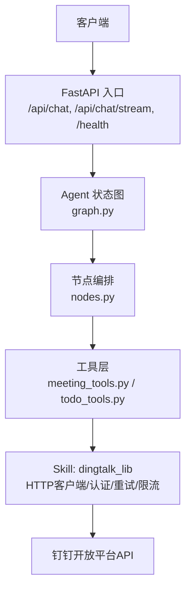
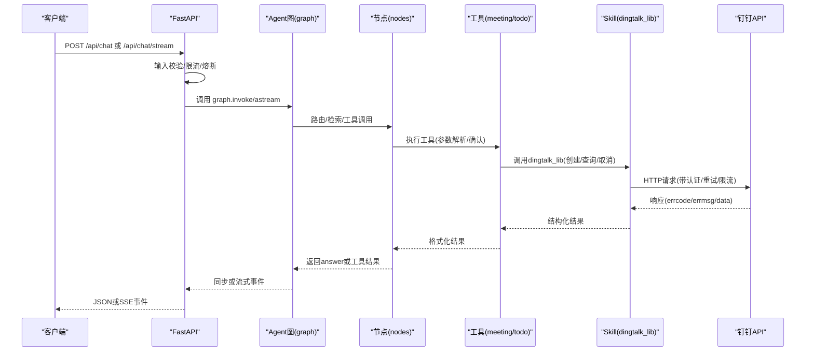
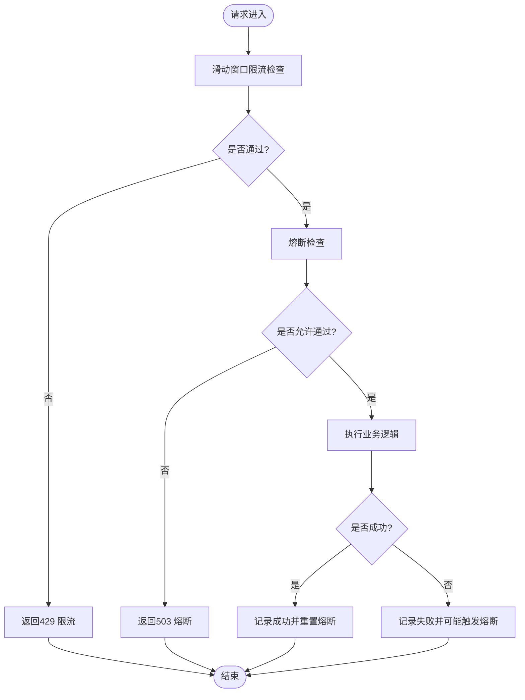
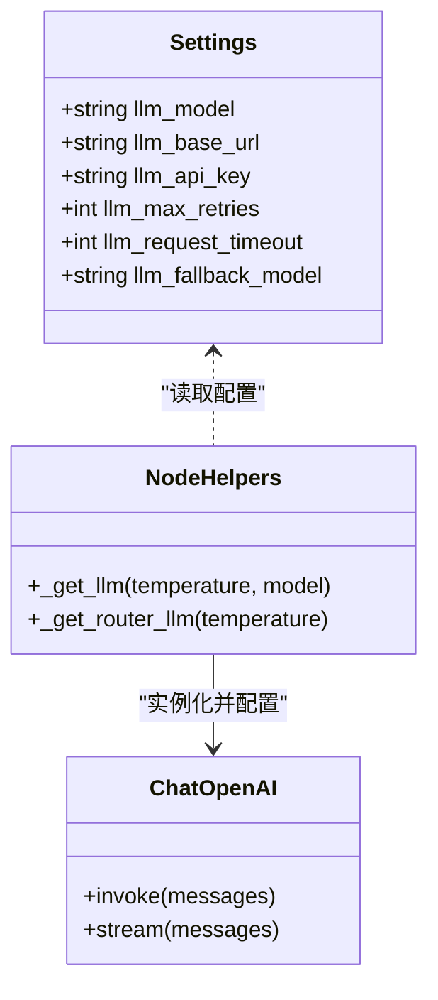
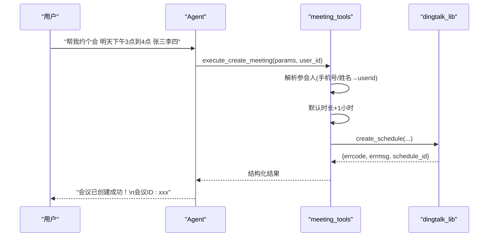
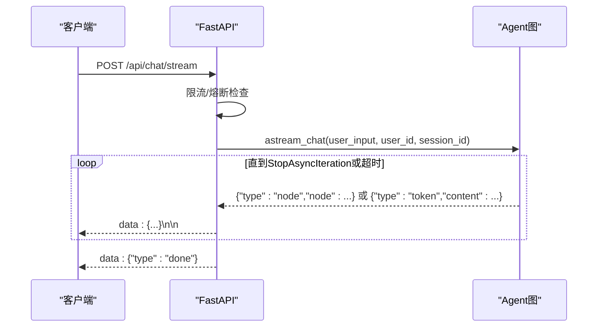
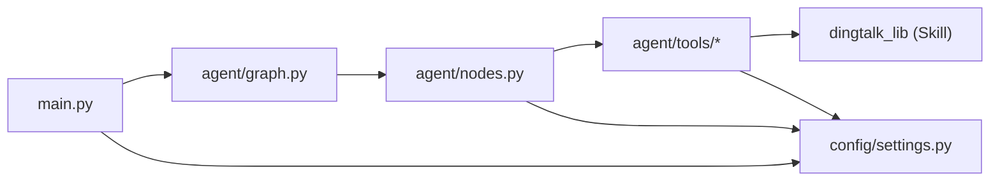

# API集成

<cite>
**本文引用的文件**
- [main.py](file://main.py)
- [config/settings.py](file://config/settings.py)
- [agent/rate_limiter.py](file://agent/rate_limiter.py)
- [agent/graph.py](file://agent/graph.py)
- [agent/nodes.py](file://agent/nodes.py)
- [agent/tools/meeting_tools.py](file://agent/tools/meeting_tools.py)
- [agent/tools/todo_tools.py](file://agent/tools/todo_tools.py)
- [需求分析文档.md](file://需求分析文档.md)
</cite>

## 目录
1. [简介](#简介)
2. [项目结构](#项目结构)
3. [核心组件](#核心组件)
4. [架构总览](#架构总览)
5. [详细组件分析](#详细组件分析)
6. [依赖关系分析](#依赖关系分析)
7. [性能与可靠性](#性能与可靠性)
8. [故障排除指南](#故障排除指南)
9. [结论](#结论)
10. [附录：配置清单与最佳实践](#附录配置清单与最佳实践)

## 简介
本指南面向需要在项目中安全、稳定地集成外部服务与API的工程师，重点围绕HTTP客户端封装、认证机制、请求重试、错误处理、限流控制等主题展开。以钉钉API集成为例，说明如何从主服务中通过工具层调用Skill提供的dingtalk_lib，完成企业access_token获取、消息发送、会议/待办管理等操作；同时给出缓存策略、超时保护、熔断降级、SSE流式响应等工程化实践。

## 项目结构
本项目采用“主服务 + Agent工作流 + 工具层 + Skill解耦”的分层设计：
- 主服务（FastAPI）提供Web聊天接口与健康检查，负责输入校验、限流、熔断、SSE流式输出。
- Agent工作流（LangGraph）编排预检查、路由、检索、联网搜索、工具调用、生成回答与记忆更新。
- 工具层（meeting_tools、todo_tools）将自然语言意图转换为对钉钉API的具体调用，并格式化结果。
- Skill（独立于源码）提供dingtalk_lib，封装钉钉HTTP客户端、签名校验、token缓存、消息发送等能力，主服务通过sys.path动态导入，保持解耦。

图表来源
- [main.py:154-314](file://main.py#L154-L314)
- [agent/graph.py:44-102](file://agent/graph.py#L44-L102)
- [agent/nodes.py:92-200](file://agent/nodes.py#L92-L200)
- [agent/tools/meeting_tools.py:17-128](file://agent/tools/meeting_tools.py#L17-L128)
- [agent/tools/todo_tools.py:18-44](file://agent/tools/todo_tools.py#L18-L44)

章节来源
- [main.py:1-387](file://main.py#L1-L387)
- [agent/graph.py:1-255](file://agent/graph.py#L1-L255)
- [agent/nodes.py:1-200](file://agent/nodes.py#L1-L200)
- [agent/tools/meeting_tools.py:1-225](file://agent/tools/meeting_tools.py#L1-L225)
- [agent/tools/todo_tools.py:1-84](file://agent/tools/todo_tools.py#L1-L84)

## 核心组件
- HTTP客户端封装与认证：由Skill中的dingtalk_lib提供，主服务通过工具层间接调用，避免在主代码中硬编码HTTP细节。
- 请求重试与超时：LLM侧通过ChatOpenAI的max_retries与request_timeout实现；钉钉侧由dingtalk_lib内部实现（结合令牌缓存与重试）。
- 错误处理：统一在工具层返回结构化结果（errcode/errmsg），并在上层进行格式化与用户提示。
- 限流控制：按user_id滑动窗口限制每分钟请求数，防止滥用。
- 熔断保护：连续失败达到阈值后进入熔断，冷却期过后半开试探，恢复成功后关闭熔断。
- 流式响应：SSE事件流包含status/token/error/done，支持整体超时保护与部分结果返回。

章节来源
- [config/settings.py:29-48](file://config/settings.py#L29-L48)
- [agent/nodes.py:23-60](file://agent/nodes.py#L23-L60)
- [agent/rate_limiter.py:17-147](file://agent/rate_limiter.py#L17-L147)
- [main.py:154-314](file://main.py#L154-L314)

## 架构总览
下图展示一次完整请求的生命周期：从FastAPI入口到Agent工作流、工具层、Skill的dingtalk_lib，最终访问钉钉API，并将结果回传至客户端。

图表来源
- [main.py:154-314](file://main.py#L154-L314)
- [agent/graph.py:117-200](file://agent/graph.py#L117-L200)
- [agent/nodes.py:92-200](file://agent/nodes.py#L92-L200)
- [agent/tools/meeting_tools.py:17-128](file://agent/tools/meeting_tools.py#L17-L128)
- [agent/tools/todo_tools.py:18-44](file://agent/tools/todo_tools.py#L18-L44)

## 详细组件分析

### 限流与熔断（rate_limiter）
- 滑动窗口限流：按user_id维护最近60秒内的请求时间戳队列，超过配置的每分钟上限则拒绝。
- 熔断器：记录连续失败次数，达到阈值进入open状态；冷却期过后进入half_open放行一次试探；成功则closed恢复，失败继续open。
- 集成点：在Web接口入口处调用check_rate_limit与check_circuit，并在成功/失败时分别record_success/record_failure。

图表来源
- [agent/rate_limiter.py:22-47](file://agent/rate_limiter.py#L22-L47)
- [agent/rate_limiter.py:51-147](file://agent/rate_limiter.py#L51-L147)
- [main.py:173-185](file://main.py#L173-L185)

章节来源
- [agent/rate_limiter.py:1-147](file://agent/rate_limiter.py#L1-L147)
- [main.py:173-185](file://main.py#L173-L185)

### LLM客户端封装与重试（nodes/_get_llm）
- 使用ChatOpenAI封装主模型与路由小模型，统一注入model、api_key、base_url、temperature、max_retries、request_timeout。
- 重试与超时：针对网络抖动与429限流等可重试错误，设置最大重试次数与单次请求超时。
- 降级：当主模型失败时可切换至降级模型（配置项llm_fallback_model/fallback_models）。

图表来源
- [config/settings.py:29-48](file://config/settings.py#L29-L48)
- [agent/nodes.py:23-60](file://agent/nodes.py#L23-L60)

章节来源
- [agent/nodes.py:23-60](file://agent/nodes.py#L23-L60)
- [config/settings.py:29-48](file://config/settings.py#L29-L48)

### 钉钉工具层与会话管理（meeting_tools / todo_tools）
- 工具层职责：将LLM提取的参数转换为钉钉API所需格式，解析参会人（手机号/姓名→userid），默认时长计算，结果格式化为用户可读文本。
- 确认流程：写操作需用户确认（配置tool_confirmation_required），确认后执行实际API调用。
- 错误处理：工具层统一返回errcode/errmsg，失败不抛异常，便于上层友好提示。

图表来源
- [agent/tools/meeting_tools.py:17-47](file://agent/tools/meeting_tools.py#L17-L47)
- [agent/tools/meeting_tools.py:185-213](file://agent/tools/meeting_tools.py#L185-L213)

章节来源
- [agent/tools/meeting_tools.py:1-225](file://agent/tools/meeting_tools.py#L1-L225)
- [agent/tools/todo_tools.py:1-84](file://agent/tools/todo_tools.py#L1-L84)

### SSE流式接口与超时保护（main.py）
- 事件类型：status（节点进度）、token（增量内容）、error（异常信息）、done（结束标记）。
- 整体超时：基于配置的stream_timeout，超时后停止拉取并返回已生成的token，防止连接卡死。
- 熔断联动：正常完成记为成功，异常记为失败并累计触发熔断。

图表来源
- [main.py:228-314](file://main.py#L228-L314)
- [agent/graph.py:190-254](file://agent/graph.py#L190-L254)

章节来源
- [main.py:228-314](file://main.py#L228-L314)
- [agent/graph.py:190-254](file://agent/graph.py#L190-L254)

### 钉钉回调与认证（Skill侧）
- 回调接收：钉钉回调端点迁移至Skill独立服务（webhook_server.py），不在主服务中暴露。
- 签名校验：HMAC-SHA256校验请求来源合法性，含时间戳防重放（默认1小时有效期）。
- Token缓存：企业access_token本地缓存并自动过期，减少频繁申请。

章节来源
- [需求分析文档.md:193-208](file://需求分析文档.md#L193-L208)
- [需求分析文档.md:426-436](file://需求分析文档.md#L426-L436)

## 依赖关系分析
- 主服务依赖Agent图与工作流节点，节点依赖工具层，工具层依赖Skill的dingtalk_lib。
- 配置集中管理于settings，所有子系统（LLM、RAG、记忆、限流熔断、钉钉工具开关）均通过环境变量或.env加载。
- 钉钉能力完全以Skill形式提供，主服务仅通过工具层间接调用，保持解耦与可插拔。

图表来源
- [main.py:154-314](file://main.py#L154-L314)
- [agent/graph.py:44-102](file://agent/graph.py#L44-L102)
- [agent/nodes.py:23-60](file://agent/nodes.py#L23-L60)
- [agent/tools/meeting_tools.py:9-14](file://agent/tools/meeting_tools.py#L9-L14)
- [agent/tools/todo_tools.py:10-15](file://agent/tools/todo_tools.py#L10-L15)
- [config/settings.py:19-161](file://config/settings.py#L19-L161)

章节来源
- [config/settings.py:19-161](file://config/settings.py#L19-L161)
- [agent/tools/meeting_tools.py:9-14](file://agent/tools/meeting_tools.py#L9-L14)
- [agent/tools/todo_tools.py:10-15](file://agent/tools/todo_tools.py#L10-L15)

## 性能与可靠性
- 预热优化：启动时预热LLM连接（TLS握手、DNS解析、连接池建立），降低首请求延迟。
- 向量库预热：启动时检查并重建BM25索引，避免首请求阻塞。
- 流式超时：SSE整体超时保护，确保长耗时任务不会导致连接卡死。
- 限流与熔断：防止雪崩与资源耗尽，提升系统韧性。
- 降级策略：主模型失败时尝试降级模型，保障可用性。

章节来源
- [main.py:45-77](file://main.py#L45-L77)
- [main.py:80-135](file://main.py#L80-L135)
- [main.py:266-304](file://main.py#L266-L304)
- [config/settings.py:29-48](file://config/settings.py#L29-L48)
- [agent/rate_limiter.py:51-147](file://agent/rate_limiter.py#L51-L147)

## 故障排除指南
- 限流触发：若收到429，检查rate_limit_per_minute配置与用户请求频率，必要时放宽限制或优化客户端重试退避。
- 熔断触发：若收到503，检查circuit_breaker_threshold与circuit_breaker_recovery，排查下游服务健康状态。
- LLM超时/重试：调整llm_request_timeout与llm_max_retries，观察网络质量与服务端限流情况。
- 钉钉回调失败：确认webhook_server运行正常，核对DINGTALK_ROBOT_SECRET与签名校验逻辑，检查时间戳有效期。
- 工具调用失败：查看工具层返回的errcode/errmsg，定位具体API错误（如参会人未找到、权限不足等）。

章节来源
- [main.py:173-185](file://main.py#L173-L185)
- [main.py:248-260](file://main.py#L248-L260)
- [agent/rate_limiter.py:22-47](file://agent/rate_limiter.py#L22-L47)
- [agent/rate_limiter.py:51-147](file://agent/rate_limiter.py#L51-L147)
- [需求分析文档.md:193-208](file://需求分析文档.md#L193-L208)

## 结论
本项目通过分层架构与Skill解耦，实现了对外部服务（尤其是钉钉API）的安全、可靠集成。限流与熔断保障了系统稳定性，流式响应提升了用户体验，工具层统一了错误处理与结果格式化。建议在生产环境中合理配置重试、超时、限流与熔断参数，并结合监控与日志持续优化。

## 附录：配置清单与最佳实践
- 关键配置项（来自settings）
  - LLM：llm_model、llm_base_url、llm_api_key、llm_temperature、llm_max_retries、llm_request_timeout、llm_fallback_model、llm_fallback_models
  - 流式：stream_timeout
  - 限流与熔断：rate_limit_per_minute、circuit_breaker_threshold、circuit_breaker_recovery
  - 工具调用：tool_calling_enabled、tool_confirmation_required
- 最佳实践
  - 使用环境变量或.env管理敏感配置，避免硬编码。
  - 为外部API调用设置合理的超时与重试策略，避免级联失败。
  - 启用限流与熔断，保护后端资源与用户体验。
  - 对写操作引入用户确认流程，防止误操作。
  - 使用SSE流式接口提升交互体验，并设置整体超时保护。
  - 定期评估与调优RAG与LLM参数，平衡准确性与成本。

章节来源
- [config/settings.py:29-161](file://config/settings.py#L29-L161)
- [main.py:154-314](file://main.py#L154-L314)
- [agent/tools/meeting_tools.py:162-182](file://agent/tools/meeting_tools.py#L162-L182)
- [agent/tools/todo_tools.py:72-83](file://agent/tools/todo_tools.py#L72-L83)