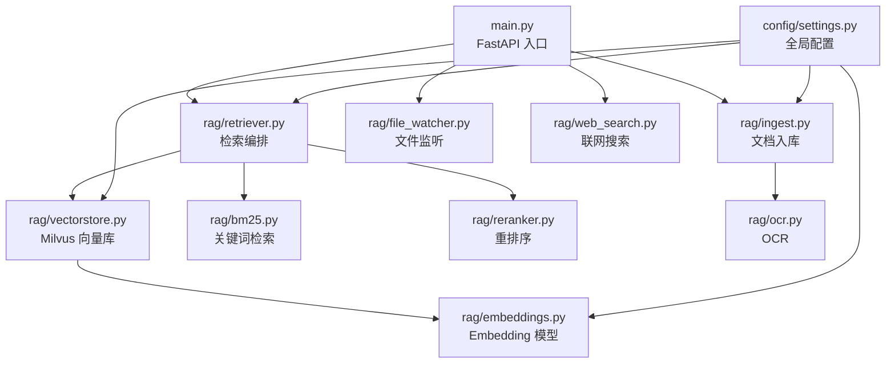
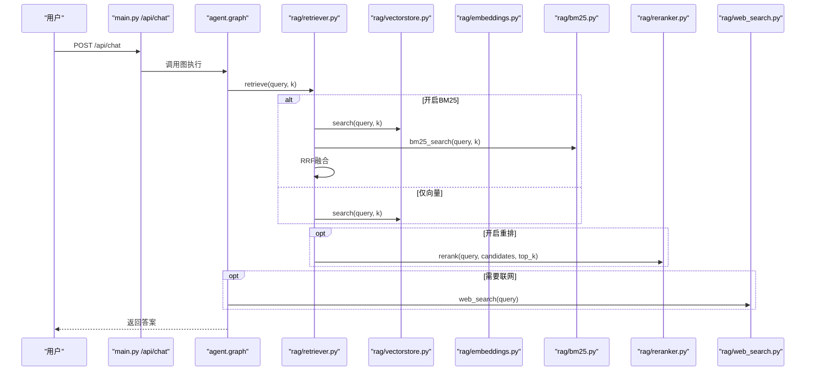
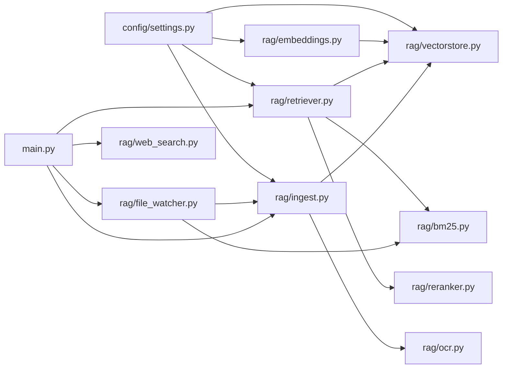

# RAG扩展

<cite>
**本文引用的文件**
- [main.py](file://main.py)
- [config/settings.py](file://config/settings.py)
- [rag/embeddings.py](file://rag/embeddings.py)
- [rag/vectorstore.py](file://rag/vectorstore.py)
- [rag/retriever.py](file://rag/retriever.py)
- [rag/bm25.py](file://rag/bm25.py)
- [rag/reranker.py](file://rag/reranker.py)
- [rag/ingest.py](file://rag/ingest.py)
- [rag/ocr.py](file://rag/ocr.py)
- [rag/file_watcher.py](file://rag/file_watcher.py)
- [rag/web_search.py](file://rag/web_search.py)
</cite>

## 目录
1. [简介](#简介)
2. [项目结构](#项目结构)
3. [核心组件](#核心组件)
4. [架构总览](#架构总览)
5. [详细组件分析与扩展指南](#详细组件分析与扩展指南)
6. [依赖关系分析](#依赖关系分析)
7. [性能考量与优化建议](#性能考量与优化建议)
8. [故障排查指南](#故障排查指南)
9. [结论](#结论)
10. [附录：配置项速查](#附录：配置项速查)

## 简介
本指南面向需要在现有RAG系统上进行扩展的开发者，覆盖以下目标：
- 自定义嵌入模型集成（文本/多模态）
- 向量存储后端替换（Milvus Lite 到其他实现）
- 检索器优化（多路召回、重排序、RRF融合）
- 文档处理管道扩展（新增格式支持、OCR增强、增量入库）
- 高级功能：接入外部搜索引擎、优化检索性能、运行时自动同步

系统已具备：
- 多模态Embedding（Jina CLIP v2）与纯文本Embedding（BGE）双实现
- Milvus Lite 本地持久化向量库（文本+图像同库）
- 两阶段检索（向量召回 + CrossEncoder重排），可选BM25多路召回与RRF融合
- PDF/图片OCR、Word/Excel解析、增量入库与运行时文件监听
- 联网搜索（DuckDuckGo/百度）与流式SSE接口

## 项目结构
RAG相关代码集中在 rag/ 目录，配置在 config/，主入口在 main.py。关键模块职责如下：
- embeddings：Embedding模型封装与选择
- vectorstore：向量库封装（Milvus Lite），提供增删改查
- retriever：检索编排（向量/BM25/重排/格式化）
- bm25：内存BM25索引与检索
- reranker：CrossEncoder重排序
- ingest：文档加载、切分、增量入库
- ocr：PDF/图片OCR
- file_watcher：运行时文件监听与自动增量入库
- web_search：联网搜索（DDGS/百度）

图表来源
- [main.py:45-135](file://main.py#L45-L135)
- [rag/retriever.py:18-52](file://rag/retriever.py#L18-L52)
- [rag/vectorstore.py:29-76](file://rag/vectorstore.py#L29-L76)
- [rag/bm25.py:22-66](file://rag/bm25.py#L22-L66)
- [rag/reranker.py:30-51](file://rag/reranker.py#L30-L51)
- [rag/ingest.py:289-388](file://rag/ingest.py#L289-L388)
- [rag/ocr.py:94-141](file://rag/ocr.py#L94-L141)
- [rag/file_watcher.py:107-140](file://rag/file_watcher.py#L107-L140)
- [rag/web_search.py:76-94](file://rag/web_search.py#L76-L94)
- [config/settings.py:19-107](file://config/settings.py#L19-L107)

章节来源
- [main.py:45-135](file://main.py#L45-L135)
- [config/settings.py:19-107](file://config/settings.py#L19-L107)

## 核心组件
- 嵌入模型：Jina CLIP v2（多模态）与 BGE（纯文本），通过 get_embeddings() 按配置自动选择
- 向量存储：Milvus Lite 单例，支持文本与图像混合存储，读写加锁保证一致性
- 检索器：支持“仅向量”、“向量+重排”、“向量+BM25+RRF+重排”多种模式
- 文档入库：增量指纹驱动，支持txt/md/pdf/docx/xlsx及常见图片格式，PDF含OCR兜底
- 文件监听：watchdog事件+防抖队列，触发增量入库并重置BM25索引
- 联网搜索：DDGS优先，失败回退百度，结果统一格式化

章节来源
- [rag/embeddings.py:29-179](file://rag/embeddings.py#L29-L179)
- [rag/vectorstore.py:29-190](file://rag/vectorstore.py#L29-L190)
- [rag/retriever.py:18-139](file://rag/retriever.py#L18-L139)
- [rag/ingest.py:24-182](file://rag/ingest.py#L24-L182)
- [rag/file_watcher.py:34-105](file://rag/file_watcher.py#L34-L105)
- [rag/web_search.py:19-94](file://rag/web_search.py#L19-L94)

## 架构总览
下图展示一次用户请求从Web接口到检索、生成、记忆更新的完整流程，以及启动时的知识库预热与自动同步机制。

图表来源
- [main.py:154-209](file://main.py#L154-L209)
- [rag/retriever.py:18-52](file://rag/retriever.py#L18-L52)
- [rag/vectorstore.py:164-190](file://rag/vectorstore.py#L164-L190)
- [rag/bm25.py:69-97](file://rag/bm25.py#L69-L97)
- [rag/reranker.py:54-97](file://rag/reranker.py#L54-L97)
- [rag/web_search.py:76-94](file://rag/web_search.py#L76-L94)

## 详细组件分析与扩展指南

### 1) 自定义嵌入模型集成
- 现有实现
  - JinaClipEmbeddings：多模态（文本+图像），输出维度1024，支持embed_documents/embed_query与embed_images/embed_query_image
  - BgeEmbeddings：纯文本，使用sentence-transformers，输出维度512，速度快
  - get_embeddings()：根据配置embedding_model自动选择BGE或Jina
- 扩展步骤
  - 新增一个类实现langchain Embeddings接口（embed_documents/embed_query），参考现有类结构
  - 在get_embeddings()中增加分支逻辑，依据配置项选择新模型
  - 若需支持图像编码，参照JinaClipEmbeddings提供embed_images方法；否则仅文本路径
  - 更新config/settings.py中的embedding_model默认值或环境变量，确保正确路由
- 注意事项
  - 延迟加载模型（首次调用时初始化），避免启动耗时
  - 设备选择（cpu/gpu）通过embedding_device控制
  - 归一化策略：保持与向量库距离度量一致（当前L2）

章节来源
- [rag/embeddings.py:29-179](file://rag/embeddings.py#L29-L179)
- [config/settings.py:50-52](file://config/settings.py#L50-L52)

### 2) 向量存储后端替换
- 现有实现
  - 基于LangChain Milvus封装，Milvus Lite本地文件持久化
  - 支持文本与图像混合存储（动态字段enable_dynamic_field）
  - 写入加锁保护并发安全，flush确保可查询
- 扩展步骤
  - 在vectorstore.py中抽象get_vectorstore()为工厂函数，便于替换后端
  - 若替换为其他向量库（如FAISS、Chroma、Elasticsearch等），需实现：
    - add_documents/add_image_documents
    - similarity_search_with_score或等价检索接口
    - delete、count_documents、drop_collection等管理操作
  - 保持Document结构与metadata约定一致（text/pk/vector/动态字段）
- 注意事项
  - 距离度量需与Embedding归一化匹配（当前L2）
  - 索引类型与参数需在配置中暴露并可切换
  - 写路径加锁与flush策略需在新后端保持一致语义

章节来源
- [rag/vectorstore.py:29-106](file://rag/vectorstore.py#L29-L106)
- [rag/vectorstore.py:109-161](file://rag/vectorstore.py#L109-L161)
- [rag/vectorstore.py:164-245](file://rag/vectorstore.py#L164-L245)

### 3) 检索器优化（多路召回、重排序、RRF融合）
- 现有实现
  - retriever.retrieve()支持三种模式：
    - 仅向量检索
    - 向量+重排
    - 向量+BM25并行召回→RRF融合→（可选）重排
  - BM25使用字符级分词，无需额外中文分词依赖
  - 重排使用CrossEncoder（bge-reranker-base），提升精度
- 扩展步骤
  - 新增检索路：例如接入外部搜索引擎结果作为候选，参与RRF融合
  - 调整RRF常数rag_rrf_k以平衡不同路的贡献
  - 在retriever._hybrid_recall中增加新的召回源，统一返回(Document, score)元组
  - 若新召回源分数方向不同，RRF天然兼容（仅依赖排名）
- 注意事项
  - 候选数量rerank_candidate_count需合理设置，避免重排开销过大
  - BM25索引构建在启动时预热，增量变更后由file_watcher重置索引

章节来源
- [rag/retriever.py:18-110](file://rag/retriever.py#L18-L110)
- [rag/bm25.py:22-66](file://rag/bm25.py#L22-L66)
- [rag/reranker.py:54-97](file://rag/reranker.py#L54-L97)
- [rag/file_watcher.py:90-105](file://rag/file_watcher.py#L90-L105)

### 4) 文档处理管道扩展（新增格式支持、OCR增强）
- 现有实现
  - 支持.txt/.md/.pdf/.docx/.xlsx及.png/.jpg/.jpeg/.bmp/.tiff
  - PDF：先pypdf提取文本，过少则渲染页面OCR；同时为每页生成图像Document用于跨模态检索
  - 图片：OCR提取文本+图像Document
  - 增量入库：manifest记录hash/mtime/chunk_ids，支持删除清理
- 扩展步骤
  - 新增格式：在load_file中增加分支，实现对应加载器，返回Document列表
  - 更新SUPPORTED_EXTENSIONS与IMAGE_EXTENSIONS常量
  - 若新格式含表格/公式/复杂排版，考虑引入专用解析器（如markdown表格、LaTeX）
  - OCR增强：在ocr.py中扩展语言包或更换OCR引擎（如PaddleOCR），并在settings中暴露配置
- 注意事项
  - 图像Document的metadata.image_path需指向有效路径，供embed_images使用
  - 大文件处理需考虑内存占用与分块策略
  - 增量更新时，旧chunk需先删除再插入，避免重复

章节来源
- [rag/ingest.py:24-182](file://rag/ingest.py#L24-L182)
- [rag/ingest.py:198-216](file://rag/ingest.py#L198-L216)
- [rag/ingest.py:258-274](file://rag/ingest.py#L258-L274)
- [rag/ocr.py:46-69](file://rag/ocr.py#L46-L69)
- [rag/ocr.py:94-141](file://rag/ocr.py#L94-L141)

### 5) 接入外部搜索引擎（替代/补充联网搜索）
- 现有实现
  - DuckDuckGo优先，失败回退百度
  - 结果统一格式化为上下文字符串
- 扩展步骤
  - 在web_search.py中新增搜索引擎适配器（如Google Custom Search、Bing、Arxiv等）
  - 在web_search()中增加优先级与回退逻辑
  - 若新引擎返回结构化数据，适配format_search_results
  - 可通过配置开关控制是否启用该引擎
- 注意事项
  - 注意各引擎的速率限制与反爬策略
  - 超时与重试策略需完善，避免阻塞主流程

章节来源
- [rag/web_search.py:19-94](file://rag/web_search.py#L19-L94)
- [rag/web_search.py:97-133](file://rag/web_search.py#L97-L133)

### 6) 运行时自动同步与性能优化
- 现有实现
  - 启动时检查向量库是否为空，必要时全量重建
  - 文件监听（watchdog）+防抖队列，变更触发增量入库
  - BM25索引在变更后重置，确保检索一致性
- 扩展步骤
  - 调整防抖时间rag_auto_sync_debounce以平衡实时性与性能
  - 对超大知识库，考虑分片索引或异步批量写入
  - 监控向量库大小与查询延迟，必要时升级索引类型（Milvus支持更多索引）
- 注意事项
  - 文件监听仅支持顶层目录（非递归），如需子目录需扩展Observer配置
  - 写入冲突已通过线程锁保护，但需注意磁盘IO瓶颈

章节来源
- [main.py:80-135](file://main.py#L80-L135)
- [rag/file_watcher.py:71-105](file://rag/file_watcher.py#L71-L105)
- [rag/vectorstore.py:97-106](file://rag/vectorstore.py#L97-L106)

## 依赖关系分析
- embeddings依赖config.settings获取模型名与设备
- vectorstore依赖embeddings进行向量化，依赖Milvus客户端
- retriever依赖vectorstore与bm25，可选reranker
- ingest依赖ocr、vectorstore，维护manifest
- file_watcher依赖ingest与bm25，监听文件系统
- web_search独立，结果供上层组装上下文

图表来源
- [config/settings.py:19-107](file://config/settings.py#L19-L107)
- [rag/embeddings.py:164-179](file://rag/embeddings.py#L164-L179)
- [rag/vectorstore.py:29-76](file://rag/vectorstore.py#L29-L76)
- [rag/retriever.py:18-52](file://rag/retriever.py#L18-L52)
- [rag/ingest.py:289-388](file://rag/ingest.py#L289-L388)
- [rag/file_watcher.py:107-140](file://rag/file_watcher.py#L107-L140)
- [rag/web_search.py:76-94](file://rag/web_search.py#L76-L94)
- [main.py:80-135](file://main.py#L80-L135)

章节来源
- [config/settings.py:19-107](file://config/settings.py#L19-L107)
- [rag/retriever.py:18-52](file://rag/retriever.py#L18-L52)
- [rag/vectorstore.py:29-76](file://rag/vectorstore.py#L29-L76)

## 性能考量与优化建议
- 模型加载
  - 使用延迟初始化，避免启动时下载/加载模型
  - 通过HF_ENDPOINT镜像加速模型下载
- 向量检索
  - 调整rag_top_k与rerank_candidate_count平衡召回与重排开销
  - 使用FLAT索引适合小规模数据，大规模可评估其他索引类型
- 多路召回
  - BM25开启时注意索引构建成本，启动时预热
  - RRF融合常数rag_rrf_k影响融合效果，需实验调优
- 文件监听
  - 防抖时间过长影响实时性，过短导致频繁入库
  - 大文件分块写入时，防抖可有效合并事件
- 网络搜索
  - 设置合理超时与最大结果数，避免慢查询拖慢整体响应
  - 主备引擎回退策略保证可用性

[本节为通用性能讨论，不直接分析具体文件]

## 故障排查指南
- 向量库为空但存在清单
  - 现象：启动时检测到向量库为空且存在manifest，触发全量重建
  - 处理：确认data/docs目录存在且包含支持格式文件，重新运行入库
  - 参考：[main.py:80-135](file://main.py#L80-L135)
- BM25索引为空
  - 现象：检索时无关键词命中，仅向量检索
  - 处理：确认向量库中有文本文档，重启服务以重建索引
  - 参考：[rag/bm25.py:22-66](file://rag/bm25.py#L22-L66)
- 重排序失败
  - 现象：重排序异常，回退到原始向量检索结果
  - 处理：检查网络与模型缓存，确认HF_ENDPOINT配置正确
  - 参考：[rag/reranker.py:77-97](file://rag/reranker.py#L77-L97)
- 文件监听未生效
  - 现象：修改文件后未触发入库
  - 处理：确认rag_auto_sync_enabled=true，检查docs_dir权限与watchdog安装
  - 参考：[rag/file_watcher.py:107-140](file://rag/file_watcher.py#L107-L140)
- 联网搜索无结果
  - 现象：DDGS无结果，回退百度仍无结果
  - 处理：检查网络连通性，调整max_results或更换引擎
  - 参考：[rag/web_search.py:76-94](file://rag/web_search.py#L76-L94)

章节来源
- [main.py:80-135](file://main.py#L80-L135)
- [rag/bm25.py:22-66](file://rag/bm25.py#L22-L66)
- [rag/reranker.py:77-97](file://rag/reranker.py#L77-L97)
- [rag/file_watcher.py:107-140](file://rag/file_watcher.py#L107-L140)
- [rag/web_search.py:76-94](file://rag/web_search.py#L76-L94)

## 结论
本RAG系统提供了可扩展的嵌入模型、向量存储、检索编排、文档处理与联网搜索能力。通过模块化设计与配置驱动，开发者可以：
- 快速集成新的嵌入模型与向量后端
- 扩展多路召回与重排序策略
- 新增文档格式支持与OCR能力
- 接入外部搜索引擎并优化检索性能
- 利用运行时自动同步实现知识库热更新

建议在扩展前明确业务需求（精度/速度/成本），并通过A/B测试验证配置与算法变更的效果。

[本节为总结性内容，不直接分析具体文件]

## 附录：配置项速查
- 嵌入模型
  - embedding_model：选择BGE或Jina CLIP
  - embedding_device：cpu/gpu
- 向量库
  - milvus_db_file：本地数据库文件路径
  - milvus_collection：集合名称
  - milvus_index_type：索引类型（当前FLAT）
  - milvus_metric_type：距离度量（L2）
  - rag_top_k：默认返回条数
  - rag_score_filter：过滤阈值
- 检索
  - rag_bm25_enabled：是否开启BM25
  - rag_bm25_candidate_count：BM25候选数
  - rag_rrf_k：RRF常数
  - rerank_enabled：是否重排
  - rerank_model：重排模型
  - rerank_candidate_count：重排候选数
  - rerank_top_k：重排后返回数
- 文档处理
  - rag_chunk_size：切片大小
  - rag_chunk_overlap：重叠大小
  - rag_docs_dir：文档目录
  - supported_file_extensions：支持格式
- OCR
  - ocr_languages：语言列表
  - ocr_use_gpu：是否GPU
  - ocr_min_text_length：触发OCR阈值
- 自动同步
  - rag_auto_sync_enabled：是否监听
  - rag_auto_sync_debounce：防抖时间
- 联网搜索
  - web_search_enabled：是否启用
  - web_search_max_results：最大结果数
  - web_search_timeout：超时秒数

章节来源
- [config/settings.py:50-112](file://config/settings.py#L50-L112)