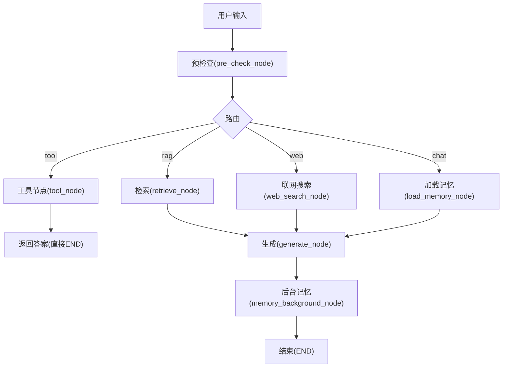
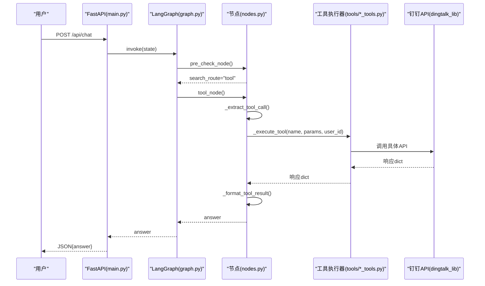
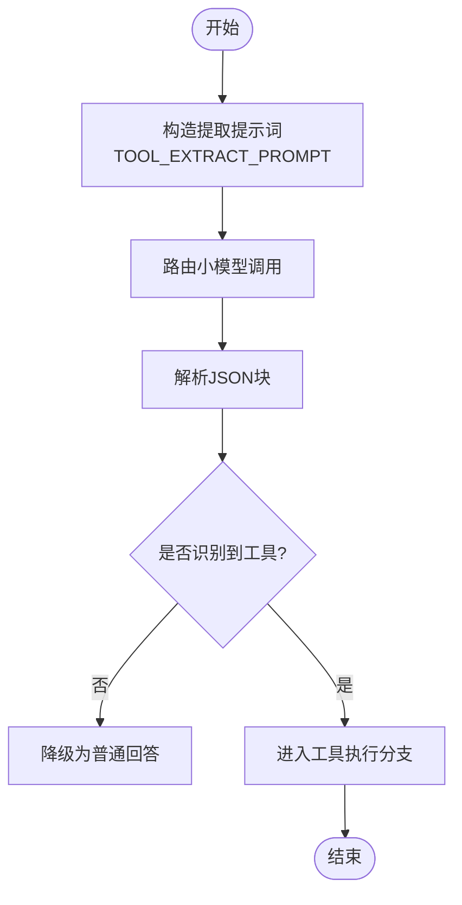
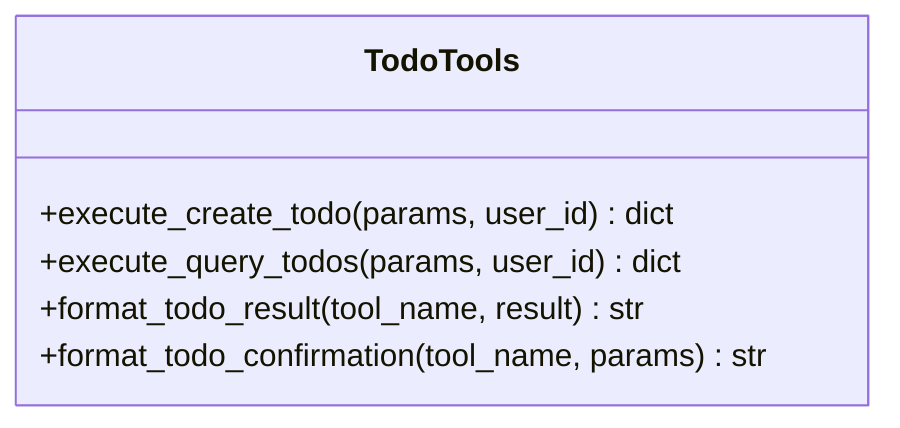
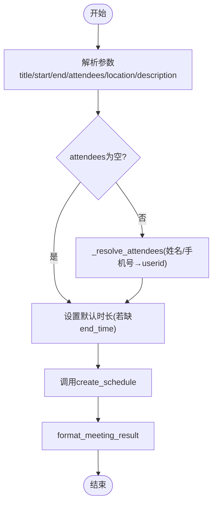
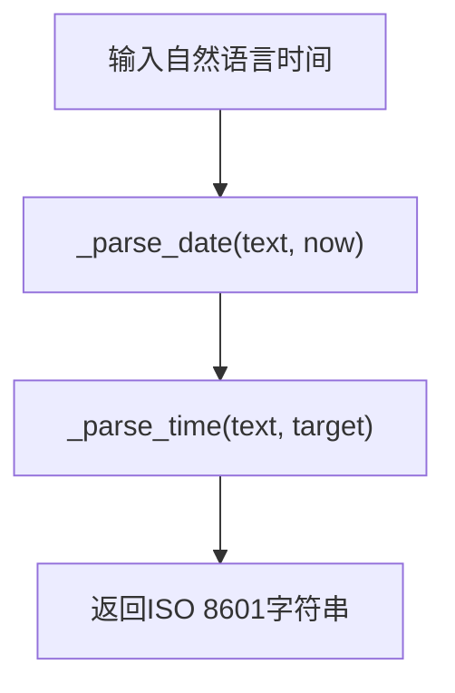
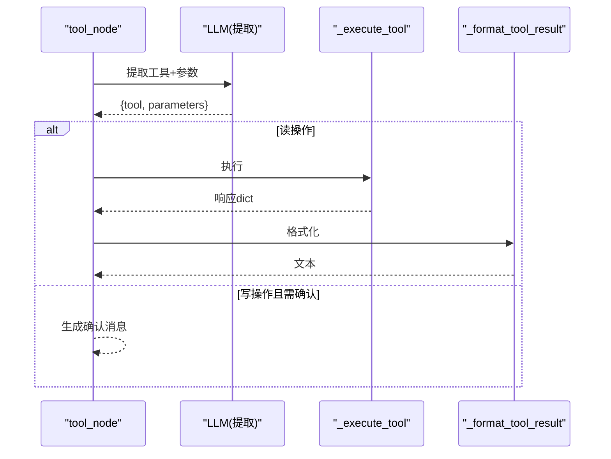
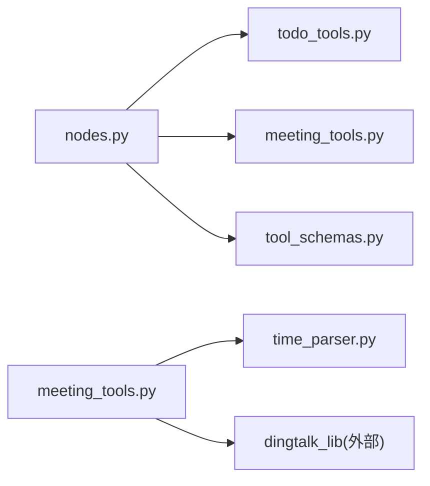

# 工具开发

<cite>
**本文引用的文件**
- [agent/tools/meeting_tools.py](file://agent/tools/meeting_tools.py)
- [agent/tools/todo_tools.py](file://agent/tools/todo_tools.py)
- [agent/tools/tool_schemas.py](file://agent/tools/tool_schemas.py)
- [agent/tools/time_parser.py](file://agent/tools/time_parser.py)
- [agent/nodes.py](file://agent/nodes.py)
- [agent/graph.py](file://agent/graph.py)
- [main.py](file://main.py)
- [agent/state.py](file://agent/state.py)
</cite>

## 目录
1. [简介](#简介)
2. [项目结构](#项目结构)
3. [核心组件](#核心组件)
4. [架构总览](#架构总览)
5. [详细组件分析](#详细组件分析)
6. [依赖关系分析](#依赖关系分析)
7. [性能考虑](#性能考虑)
8. [故障排查指南](#故障排查指南)
9. [结论](#结论)
10. [附录：新增工具开发清单](#附录新增工具开发清单)

## 简介
本指南面向希望在本项目中新增钉钉工具（如会议、待办等）的开发者。文档围绕“工具函数设计模式、参数解析机制、错误处理策略、结果格式化规范”展开，并以会议工具和待办工具为例，完整展示从工具注册、接口定义到调用流程与确认机制的开发路径，同时给出最佳实践与常见问题解决方案。

## 项目结构
工具系统位于 agent/tools 目录，包含：
- tool_schemas.py：工具 Schema 与提取提示词，供 LLM Function Calling 使用
- todo_tools.py：待办工具执行器与结果/确认格式化
- meeting_tools.py：会议工具执行器与结果/确认格式化，含参会人解析与时间补全
- time_parser.py：自然语言时间解析为 ISO 8601

工作流编排在 agent/graph.py 中，节点逻辑在 agent/nodes.py 中，入口在 main.py。状态模型在 agent/state.py。

图表来源
- [agent/graph.py:44-102](file://agent/graph.py#L44-L102)
- [agent/nodes.py:93-150](file://agent/nodes.py#L93-L150)

章节来源
- [agent/graph.py:44-102](file://agent/graph.py#L44-L102)
- [agent/nodes.py:93-150](file://agent/nodes.py#L93-L150)

## 核心组件
- 工具 Schema 与提取提示词：集中定义工具名、描述、参数结构与必填项，并统一由 LLM 基于提示词抽取参数。
- 工具执行器：每个领域（待办/会议）一个模块，提供 execute_xxx(params, user_id) 与 format_xxx_result/tool_confirmation。
- 时间解析：将中文自然时间转换为 ISO 8601，支持“本周/明天/下午3点”等表达。
- 工具路由与执行：nodes.py 中的 tool_node 负责参数提取、写操作确认、分发执行与结果格式化。
- 工作流编排：graph.py 将 tool_node 接入 LangGraph 状态图，工具调用后直接返回结果，不经过 generate。

章节来源
- [agent/tools/tool_schemas.py:1-121](file://agent/tools/tool_schemas.py#L1-L121)
- [agent/tools/todo_tools.py:1-84](file://agent/tools/todo_tools.py#L1-L84)
- [agent/tools/meeting_tools.py:1-225](file://agent/tools/meeting_tools.py#L1-L225)
- [agent/tools/time_parser.py:1-120](file://agent/tools/time_parser.py#L1-L120)
- [agent/nodes.py:646-779](file://agent/nodes.py#L646-L779)
- [agent/graph.py:44-102](file://agent/graph.py#L44-L102)

## 架构总览
下图展示了从用户输入到工具调用的端到端流程，包括参数提取、写操作确认、执行与结果格式化。

图表来源
- [main.py:154-209](file://main.py#L154-L209)
- [agent/graph.py:44-102](file://agent/graph.py#L44-L102)
- [agent/nodes.py:646-779](file://agent/nodes.py#L646-L779)
- [agent/tools/todo_tools.py:18-44](file://agent/tools/todo_tools.py#L18-L44)
- [agent/tools/meeting_tools.py:17-128](file://agent/tools/meeting_tools.py#L17-L128)

## 详细组件分析

### 工具 Schema 与参数提取
- 工具定义：在 tool_schemas.py 中声明工具名称、描述、参数类型与必填字段，便于 LLM 理解与校验。
- 参数提取：通过 TOOL_EXTRACT_PROMPT 引导 LLM 输出 {tool, parameters} 的 JSON；nodes.py 的 _extract_tool_call 调用路由小模型完成抽取。
- 读/写分类：READ_TOOLS 与 WRITE_TOOLS 用于区分是否需要用户确认。

图表来源
- [agent/tools/tool_schemas.py:7-26](file://agent/tools/tool_schemas.py#L7-L26)
- [agent/nodes.py:693-709](file://agent/nodes.py#L693-L709)

章节来源
- [agent/tools/tool_schemas.py:1-121](file://agent/tools/tool_schemas.py#L1-L121)
- [agent/nodes.py:693-709](file://agent/nodes.py#L693-L709)

### 待办工具（todo_tools.py）
- 执行器：
  - create_todo：接收 title、due_time、description、priority，调用 dingtalk_lib.create_todo。
  - query_todos：按 status 查询待办列表。
- 结果格式化：format_todo_result 将 API 响应转为可读文本，失败时统一返回友好错误。
- 确认消息：format_todo_confirmation 用于写操作前的二次确认。

图表来源
- [agent/tools/todo_tools.py:18-84](file://agent/tools/todo_tools.py#L18-L84)

章节来源
- [agent/tools/todo_tools.py:1-84](file://agent/tools/todo_tools.py#L1-L84)

### 会议工具（meeting_tools.py）
- 执行器：
  - create_meeting：解析 attendees（姓名/手机号→用户ID），默认时长1小时，调用 create_schedule。
  - cancel_meeting/update_meeting：优先用 meeting_id，否则按标题匹配最近30天日程。
  - query_meetings：未指定时间范围时默认查询“本周”。
- 辅助能力：
  - _resolve_attendees：手机号正则匹配后查通讯录，否则按姓名搜索。
  - _add_one_hour：ISO 时间加1小时，异常回退原值。
- 结果格式化：format_meeting_result 对创建/取消/更新/查询分别输出友好文案。
- 确认消息：format_meeting_confirmation 针对写操作进行二次确认。

图表来源
- [agent/tools/meeting_tools.py:17-47](file://agent/tools/meeting_tools.py#L17-L47)
- [agent/tools/meeting_tools.py:185-225](file://agent/tools/meeting_tools.py#L185-L225)

章节来源
- [agent/tools/meeting_tools.py:1-225](file://agent/tools/meeting_tools.py#L1-L225)

### 自然语言时间解析（time_parser.py）
- parse_natural_time：将“明天下午3点”等表达转为 ISO 8601。
- parse_natural_date_range：将“本周/本月/下周”等转为起止时间。
- 内部 _parse_date/_parse_time：日期与时间的规则化解析。

图表来源
- [agent/tools/time_parser.py:11-63](file://agent/tools/time_parser.py#L11-L63)
- [agent/tools/time_parser.py:66-120](file://agent/tools/time_parser.py#L66-L120)

章节来源
- [agent/tools/time_parser.py:1-120](file://agent/tools/time_parser.py#L1-L120)

### 工具路由与执行（nodes.py）
- tool_node：
  - 步骤1：LLM 提取工具名与参数。
  - 步骤2：读操作（query_todos/query_meetings）直接执行。
  - 步骤3：写操作根据配置决定是否需用户确认。
  - 步骤4：执行工具并格式化结果返回。
- _execute_tool：按工具名分发到对应执行器，异常捕获并返回统一错误格式。
- _format_tool_result：根据工具类别委派至各自 format_*_result。
- _format_confirmation：根据工具类别委派至各自 format_*_confirmation。

图表来源
- [agent/nodes.py:646-779](file://agent/nodes.py#L646-L779)

章节来源
- [agent/nodes.py:646-779](file://agent/nodes.py#L646-L779)

### 工作流集成（graph.py）
- 构建 StateGraph，注册 tool 节点，并将 tool → END 直接连接，避免多余生成步骤。
- 条件边 pre_check_condition 根据 search_route 分流到 tool/retrieve/web_search/load_memory/generate。
- 提供 chat/chat_stream/astream_chat 便捷入口，并在流式事件中对 tool 节点的 answer 进行透传。

章节来源
- [agent/graph.py:44-102](file://agent/graph.py#L44-L102)
- [agent/graph.py:117-138](file://agent/graph.py#L117-L138)
- [agent/graph.py:190-255](file://agent/graph.py#L190-L255)

### 入口与接口（main.py）
- Web 接口：/api/chat 同步调用 graph.invoke；/api/chat/stream 流式 SSE 输出。
- 启动预热：预热 LLM 连接与向量库索引，降低首请求延迟。
- 安全与限流：输入安全过滤、速率限制、熔断保护。

章节来源
- [main.py:45-135](file://main.py#L45-L135)
- [main.py:154-209](file://main.py#L154-L209)
- [main.py:228-314](file://main.py#L228-L314)

## 依赖关系分析
- nodes.py 依赖 tools/*_tools.py 的具体实现，并通过 _execute_tool 动态导入，降低耦合。
- meeting_tools.py 依赖 dingtalk_lib（通过 sys.path 注入 skill scripts 路径）。
- tool_schemas.py 被 nodes.py 的 _extract_tool_call 使用，作为 LLM 的参数提取依据。
- time_parser.py 被 meeting_tools.py 的查询逻辑复用，统一时间范围解析。

图表来源
- [agent/nodes.py:712-746](file://agent/nodes.py#L712-L746)
- [agent/tools/meeting_tools.py:9-14](file://agent/tools/meeting_tools.py#L9-L14)
- [agent/tools/meeting_tools.py:116-128](file://agent/tools/meeting_tools.py#L116-L128)

章节来源
- [agent/nodes.py:712-746](file://agent/nodes.py#L712-L746)
- [agent/tools/meeting_tools.py:9-14](file://agent/tools/meeting_tools.py#L9-L14)
- [agent/tools/meeting_tools.py:116-128](file://agent/tools/meeting_tools.py#L116-L128)

## 性能考虑
- 工具调用直连 END：避免不必要的 LLM 生成，减少延迟。
- 路由短路：关键词与实时性判断优先，减少 LLM 调用。
- 启动预热：LLM 连接与向量库索引预热，降低首请求耗时。
- 流式输出：SSE 流式返回 token，提升交互体验。
- 并发与超时：流式接口具备整体超时保护，防止长连接卡死。

[本节为通用指导，无需特定文件引用]

## 故障排查指南
- 工具未识别：检查 TOOL_EXTRACT_PROMPT 与工具 Schema 是否一致；查看 nodes.py 的 _extract_tool_call 日志。
- 写操作未执行：确认 settings.tool_confirmation_required 是否为 True，以及用户是否回复了“确认”。
- 参会人解析失败：检查手机号格式与会务系统通讯录；_resolve_attendees 会保留无效值，后续 API 可能跳过。
- 时间解析异常：确保传入时间为 ISO 8601；time_parser 的 _add_one_hour 会在异常时回退原值。
- API 调用失败：工具执行器统一返回 errcode != 0 的结构，_format_tool_result 会转为用户友好文案。

章节来源
- [agent/nodes.py:693-746](file://agent/nodes.py#L693-L746)
- [agent/tools/meeting_tools.py:185-225](file://agent/tools/meeting_tools.py#L185-L225)
- [agent/tools/todo_tools.py:47-69](file://agent/tools/todo_tools.py#L47-L69)
- [agent/tools/meeting_tools.py:131-159](file://agent/tools/meeting_tools.py#L131-L159)

## 结论
本项目提供了清晰、可扩展的工具开发框架：通过统一的 Schema 与提示词驱动参数提取，结合读/写操作的差异化处理与确认机制，实现了高可用、可维护的工具生态。会议与待办工具展示了完整的开发范式，新增工具只需遵循相同模式即可快速接入。

[本节为总结，无需特定文件引用]

## 附录：新增工具开发清单
- 定义工具 Schema：在 tool_schemas.py 中添加 name、description、parameters 与 required 字段。
- 编写执行器：新建或扩展 tools/*_tools.py，实现 execute_xxx(params, user_id) 与 format_xxx_result/tool_confirmation。
- 注册执行器：在 nodes.py 的 _execute_tool 中增加分支，将工具名映射到执行器。
- 读/写分类：如需确认，加入 WRITE_TOOLS；否则放入 READ_TOOLS。
- 测试与验证：通过 /api/chat 或 REPL 模式验证意图识别、确认流程与结果格式化。

章节来源
- [agent/tools/tool_schemas.py:29-121](file://agent/tools/tool_schemas.py#L29-L121)
- [agent/nodes.py:712-746](file://agent/nodes.py#L712-L746)
- [main.py:329-382](file://main.py#L329-L382)