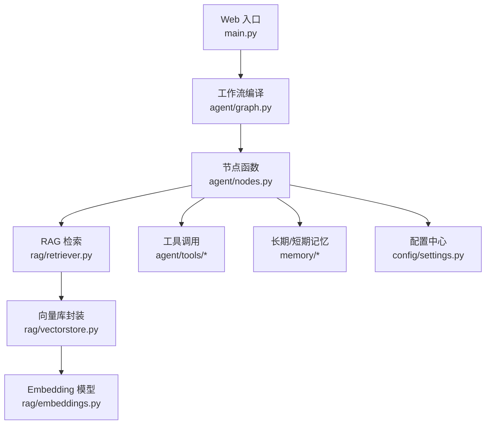
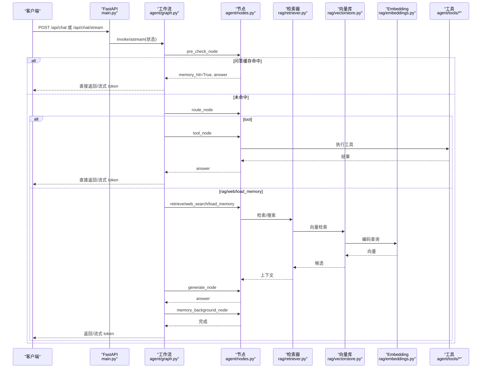
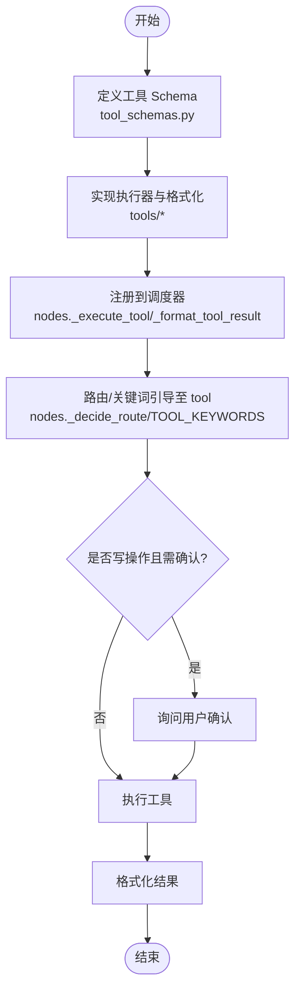
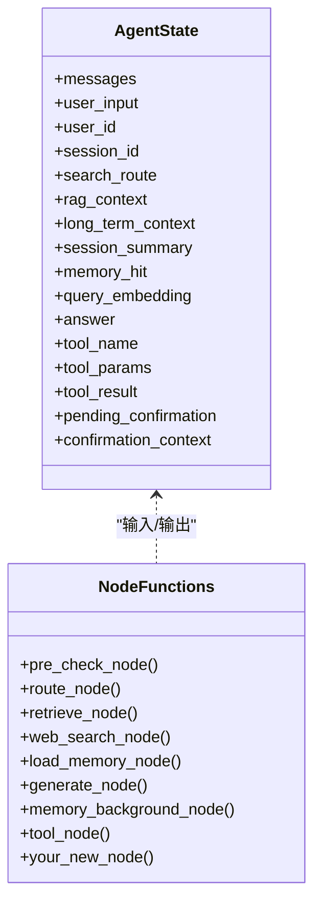
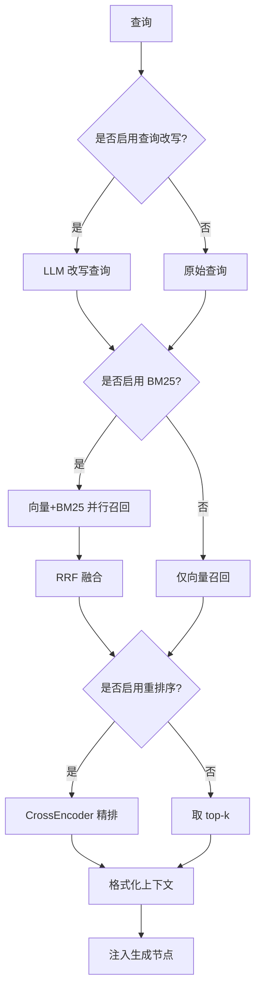
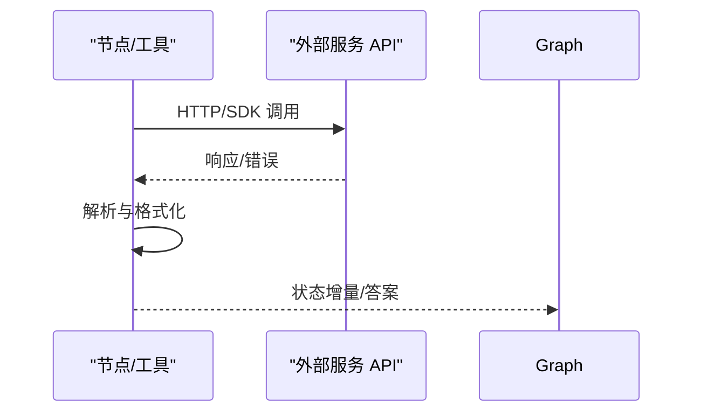
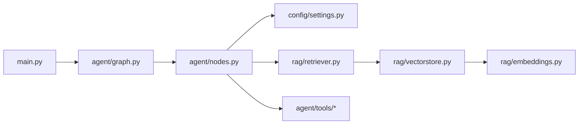

# 扩展开发

<cite>
**本文引用的文件**
- [main.py](file://main.py)
- [agent/graph.py](file://agent/graph.py)
- [agent/nodes.py](file://agent/nodes.py)
- [agent/state.py](file://agent/state.py)
- [config/settings.py](file://config/settings.py)
- [rag/retriever.py](file://rag/retriever.py)
- [rag/vectorstore.py](file://rag/vectorstore.py)
- [rag/embeddings.py](file://rag/embeddings.py)
- [agent/tools/tool_schemas.py](file://agent/tools/tool_schemas.py)
- [agent/tools/todo_tools.py](file://agent/tools/todo_tools.py)
</cite>

## 目录
1. [简介](#简介)
2. [项目结构](#项目结构)
3. [核心组件](#核心组件)
4. [架构总览](#架构总览)
5. [详细组件分析](#详细组件分析)
6. [依赖关系分析](#依赖关系分析)
7. [性能考量](#性能考量)
8. [故障排查指南](#故障排查指南)
9. [结论](#结论)
10. [附录](#附录)

## 简介
本指南面向希望扩展系统能力的开发者，覆盖以下目标：
- 添加新工具（如新增业务 API 调用）
- 自定义节点处理逻辑（在 LangGraph 工作流中插入/替换节点）
- 扩展 RAG 能力（检索、重排、嵌入、向量库等）
- 集成外部服务（通过工具或节点接入第三方 API）

文档基于现有代码实现，提供可操作的步骤、最佳实践与注意事项，帮助快速、安全地扩展功能。

## 项目结构
系统采用“工作流编排 + 模块化能力”的架构：
- 入口与 Web 接口：main.py
- 工作流编排：agent/graph.py（定义状态图、节点注册、条件边）
- 节点实现：agent/nodes.py（预检查、路由、RAG、联网搜索、生成、记忆更新、工具调用）
- 状态定义：agent/state.py（AgentState 字段）
- 配置管理：config/settings.py（全局开关与参数）
- RAG 子系统：rag/*（retriever、vectorstore、embeddings、web_search 等）
- 工具子系统：agent/tools/*（Schema、执行器、格式化）

图表来源
- [main.py:154-209](file://main.py#L154-L209)
- [agent/graph.py:44-102](file://agent/graph.py#L44-L102)
- [agent/nodes.py:92-158](file://agent/nodes.py#L92-L158)
- [rag/retriever.py:18-52](file://rag/retriever.py#L18-L52)
- [rag/vectorstore.py:29-76](file://rag/vectorstore.py#L29-L76)
- [rag/embeddings.py:164-179](file://rag/embeddings.py#L164-L179)
- [config/settings.py:19-156](file://config/settings.py#L19-L156)

章节来源
- [main.py:154-209](file://main.py#L154-L209)
- [agent/graph.py:44-102](file://agent/graph.py#L44-L102)

## 核心组件
- 工作流（LangGraph StateGraph）：定义 START→pre_check→分流→generate→memory_background→END 的主路径，支持缓存命中短路、工具直出、后台记忆更新。
- 节点体系：预检查（缓存+路由）、RAG 检索、联网搜索、长期记忆加载、生成回答、后台记忆更新、工具调用。
- 状态 AgentState：承载消息历史、用户输入、路由结果、上下文、答案、工具相关字段等。
- 配置 Settings：集中管理 LLM、Embedding、向量库、RAG、记忆、工具开关等。
- RAG 检索器：多路召回（向量+BM25）、RRF 融合、可选重排序、上下文格式化。
- 工具系统：Schema 描述 + LLM 参数提取 + 执行器分发 + 确认机制 + 结果格式化。

章节来源
- [agent/graph.py:44-102](file://agent/graph.py#L44-L102)
- [agent/nodes.py:92-158](file://agent/nodes.py#L92-L158)
- [agent/state.py:12-51](file://agent/state.py#L12-L51)
- [config/settings.py:19-156](file://config/settings.py#L19-L156)
- [rag/retriever.py:18-52](file://rag/retriever.py#L18-L52)
- [agent/tools/tool_schemas.py:1-121](file://agent/tools/tool_schemas.py#L1-L121)

## 架构总览
下图展示从请求到响应的完整流程，包括缓存命中、路由分流、RAG/联网搜索、生成、工具调用与后台记忆更新。

图表来源
- [main.py:154-209](file://main.py#L154-L209)
- [agent/graph.py:44-102](file://agent/graph.py#L44-L102)
- [agent/nodes.py:92-158](file://agent/nodes.py#L92-L158)
- [rag/retriever.py:18-52](file://rag/retriever.py#L18-L52)
- [rag/vectorstore.py:164-184](file://rag/vectorstore.py#L164-L184)
- [rag/embeddings.py:164-179](file://rag/embeddings.py#L164-L179)

## 详细组件分析

### 1) 如何添加新工具
目标：新增一个工具（例如“创建项目”），使其能被 LLM 识别并执行，必要时加入确认流程。

步骤与要点：
- 定义工具 Schema 与提取提示
  - 在 agent/tools/tool_schemas.py 中添加新的工具名称、描述、参数结构与必填项；同时维护 WRITE_TOOLS/READ_TOOLS 集合以控制是否需要确认。
  - 若需要更精确的参数抽取，可在 TOOL_EXTRACT_PROMPT 中补充该工具的说明。
- 实现工具执行器
  - 新建或扩展现有工具模块（如 todo_tools.py/meeting_tools.py），实现 execute_xxx(params, user_id) 与 format_xxx_result(tool_name, result)。
  - 执行器内部调用外部服务 API，统一返回包含 errcode/errmsg 的结构化响应。
- 注册到工具调度
  - 在 agent/nodes.py 的 _execute_tool 中增加分支，将工具名映射到对应执行器。
  - 在 _format_tool_result 中增加分支，将工具结果格式化为人类可读文本。
  - 如需确认，确保工具名在 WRITE_TOOLS 中，并在 settings.tool_confirmation_required 开启时走确认流程。
- 路由与关键词
  - 在 nodes.py 的路由判断中，可通过 TOOL_KEYWORDS 或 LLM 路由将意图导向 tool 分支。
- 测试与验证
  - 使用 Web REPL 或 /api/chat 接口进行端到端测试，确认参数提取、确认流程、执行与格式化均正常。

图表来源
- [agent/tools/tool_schemas.py:1-121](file://agent/tools/tool_schemas.py#L1-L121)
- [agent/tools/todo_tools.py:18-84](file://agent/tools/todo_tools.py#L18-L84)
- [agent/nodes.py:646-779](file://agent/nodes.py#L646-L779)
- [config/settings.py:151-156](file://config/settings.py#L151-L156)

章节来源
- [agent/tools/tool_schemas.py:1-121](file://agent/tools/tool_schemas.py#L1-L121)
- [agent/tools/todo_tools.py:18-84](file://agent/tools/todo_tools.py#L18-L84)
- [agent/nodes.py:646-779](file://agent/nodes.py#L646-L779)
- [config/settings.py:151-156](file://config/settings.py#L151-L156)

最佳实践
- 工具参数尽量明确、类型清晰，减少歧义；时间统一 ISO 8601。
- 所有外部 API 调用必须捕获异常并返回结构化错误，避免中断主链路。
- 写操作默认开启确认，防止误操作。
- 为工具添加单元测试或冒烟测试，覆盖成功、失败、边界参数。

注意事项
- 不要修改 _execute_tool 的通用签名，保持向后兼容。
- 若工具依赖外部 SDK，确保导入路径正确（如 todo_tools 通过 sys.path 动态引入）。
- 工具 Schema 变更需要同步更新 TOOL_EXTRACT_PROMPT，保证 LLM 能准确识别。

### 2) 如何自定义节点处理逻辑
目标：在工作流中插入/替换节点，实现新的处理阶段（如内容审核、翻译、摘要等）。

步骤与要点：
- 定义节点函数
  - 在 agent/nodes.py 中新增节点函数，接收 AgentState，返回增量状态字典。
  - 遵循“失败不阻断主链路”的原则，内部 try/except 记录日志并降级。
- 注册节点与边
  - 在 agent/graph.py 的 build_graph 中使用 g.add_node 注册节点。
  - 使用 g.add_edge 或 add_conditional_edges 将节点接入工作流（如 pre_check→new_node→retrieve/generate）。
- 调整路由与条件
  - 若新节点影响分流，需在 pre_check_condition 或 route_condition 中增加分支。
- 状态字段扩展
  - 如需传递数据，在 agent/state.py 的 AgentState 中新增字段，并在节点间读写。
- 流式事件透传
  - 若新节点产出 token，需在 graph.py 的 _emit_message_events 中适配，确保前端能看到进度与增量。

图表来源
- [agent/state.py:12-51](file://agent/state.py#L12-L51)
- [agent/nodes.py:92-158](file://agent/nodes.py#L92-L158)
- [agent/graph.py:57-92](file://agent/graph.py#L57-L92)

章节来源
- [agent/graph.py:57-92](file://agent/graph.py#L57-L92)
- [agent/nodes.py:92-158](file://agent/nodes.py#L92-L158)
- [agent/state.py:12-51](file://agent/state.py#L12-L51)

最佳实践
- 节点职责单一，避免在一个节点中做过多事情。
- 对耗时操作（如网络请求、模型调用）设置超时与重试策略。
- 使用配置开关控制新功能启用，便于灰度发布。
- 对关键路径增加日志埋点，便于问题定位。

注意事项
- 不要破坏现有节点间的状态契约（字段名与语义）。
- 新增节点应兼容流式模式，避免阻塞 SSE 推送。
- 条件边变更需谨慎，避免引入循环或不可达路径。

### 3) 如何扩展 RAG 功能
目标：增强检索质量与灵活性（如多路召回、重排序、查询改写、OCR、图像检索等）。

步骤与要点：
- 检索器扩展
  - 在 rag/retriever.py 中实现新的召回策略（如混合检索、知识图谱检索），并通过 retrieve 函数暴露。
  - 若新增 BM25 或多路召回，注意 RRF 融合与分数归一化逻辑。
- 重排序扩展
  - 在 reranker 中接入新的 CrossEncoder 或自研模型，调整 top_k 与候选数。
- 嵌入模型扩展
  - 在 rag/embeddings.py 中实现新的 Embeddings 类，并在 get_embeddings 中按配置选择。
- 向量库扩展
  - 在 rag/vectorstore.py 中扩展 add_documents/add_image_documents/search 等方法，支持新元数据或索引策略。
- 查询改写与 OCR
  - 在 nodes.py 的 retrieve_node 中启用 query_rewrite（settings.rag_query_rewrite_enabled）。
  - 在 ingest 流程中启用 OCR（settings.ocr_*），支持 PDF/图片解析。
- 配置与开关
  - 通过 config/settings.py 中的 RAG 相关开关控制行为（BM25、重排序、阈值、窗口等）。

图表来源
- [rag/retriever.py:18-52](file://rag/retriever.py#L18-L52)
- [rag/retriever.py:55-110](file://rag/retriever.py#L55-L110)
- [rag/embeddings.py:164-179](file://rag/embeddings.py#L164-L179)
- [rag/vectorstore.py:164-184](file://rag/vectorstore.py#L164-L184)
- [config/settings.py:83-100](file://config/settings.py#L83-L100)

章节来源
- [rag/retriever.py:18-52](file://rag/retriever.py#L18-L52)
- [rag/embeddings.py:164-179](file://rag/embeddings.py#L164-L179)
- [rag/vectorstore.py:164-184](file://rag/vectorstore.py#L164-L184)
- [config/settings.py:83-100](file://config/settings.py#L83-L100)

最佳实践
- 多路召回优先保障召回率，重排序提升准确率。
- 分数归一化要一致，避免过滤逻辑反转。
- 对大模型调用（改写、重排）设置超时与降级策略。
- 对向量库写入加锁，避免并发冲突。

注意事项
- 切换嵌入模型需重建索引或至少重新编码查询。
- BM25 与向量距离的语义不同，统一阈值需谨慎。
- 图像检索需确保 metadata 中包含 image_path 等必要字段。

### 4) 如何集成外部服务
目标：通过工具或节点接入第三方 API（如 CRM、ERP、短信、支付等）。

步骤与要点：
- 工具方式（推荐）
  - 参照“添加新工具”，实现执行器与格式化，统一返回结构化响应。
  - 在 nodes.py 的 _execute_tool 中注册工具名与执行器映射。
- 节点方式
  - 新增节点函数，封装外部服务调用逻辑，返回状态增量。
  - 在工作流中插入节点，并根据结果决定后续分支。
- 安全与限流
  - 对外部 API 调用增加重试、超时、熔断与限流保护。
  - 敏感信息（密钥、令牌）通过环境变量或配置中心管理。
- 监控与追踪
  - 使用 LangSmith 或日志系统记录调用链路与性能指标。

图表来源
- [agent/nodes.py:712-746](file://agent/nodes.py#L712-L746)
- [config/settings.py:143-156](file://config/settings.py#L143-L156)

章节来源
- [agent/nodes.py:712-746](file://agent/nodes.py#L712-L746)
- [config/settings.py:143-156](file://config/settings.py#L143-L156)

最佳实践
- 外部调用封装为独立模块，便于替换与测试。
- 统一错误码与消息，便于前端展示与后端统计。
- 对幂等操作设计重试，非幂等操作需防重放。

注意事项
- 避免在主链路中进行长时间阻塞调用，必要时异步化。
- 对第三方服务的可用性要有降级方案（如缓存、默认值）。

## 依赖关系分析
- main.py 依赖 agent/graph.py 获取编译后的工作流，并通过 FastAPI 暴露 REST/SSE 接口。
- agent/graph.py 依赖 agent/nodes.py 中的节点函数，以及 agent/state.py 的状态定义。
- agent/nodes.py 依赖 config/settings.py 的配置、rag/* 的检索能力、memory/* 的记忆能力、agent/tools/* 的工具能力。
- rag/retriever.py 依赖 rag/vectorstore.py 与 rag/reranker.py（可选），并使用 rag/embeddings.py 的嵌入模型。
- rag/vectorstore.py 依赖 rag/embeddings.py 与 Milvus Lite。

图表来源
- [main.py:154-209](file://main.py#L154-L209)
- [agent/graph.py:44-102](file://agent/graph.py#L44-L102)
- [agent/nodes.py:92-158](file://agent/nodes.py#L92-L158)
- [rag/retriever.py:18-52](file://rag/retriever.py#L18-L52)
- [rag/vectorstore.py:29-76](file://rag/vectorstore.py#L29-L76)
- [rag/embeddings.py:164-179](file://rag/embeddings.py#L164-L179)

章节来源
- [main.py:154-209](file://main.py#L154-L209)
- [agent/graph.py:44-102](file://agent/graph.py#L44-L102)
- [agent/nodes.py:92-158](file://agent/nodes.py#L92-L158)
- [rag/retriever.py:18-52](file://rag/retriever.py#L18-L52)
- [rag/vectorstore.py:29-76](file://rag/vectorstore.py#L29-L76)
- [rag/embeddings.py:164-179](file://rag/embeddings.py#L164-L179)

## 性能考量
- 启动预热：main.py 在启动时预热 LLM 连接与向量库，降低首请求延迟。
- 流式输出：SSE 流式返回 token，提升用户体验。
- 缓存命中：问答记忆命中直接返回，跳过生成链路。
- 后台记忆：记忆更新在后台执行，不阻塞响应。
- 多路召回与重排序：平衡召回率与准确率，合理设置候选数与 top_k。
- 向量库写入锁：避免并发写入冲突，保证一致性。

章节来源
- [main.py:45-135](file://main.py#L45-L135)
- [agent/graph.py:141-255](file://agent/graph.py#L141-L255)
- [rag/vectorstore.py:22-27](file://rag/vectorstore.py#L22-L27)

## 故障排查指南
- 路由失败：检查 TOOL_KEYWORDS/ROUTER_KEYWORDS/WEN_SEARCH_KEYWORDS 与 settings 开关是否正确。
- 工具执行失败：查看 _execute_tool 与工具执行器的异常日志，确认外部 API 可用性与参数格式。
- RAG 检索为空：检查向量库是否有数据、嵌入模型是否正常、检索阈值是否过严。
- 流式超时：调整 stream_timeout，检查外部服务响应时间与网络状况。
- 记忆更新失败：查看 memory_background_node 的异常日志，确认数据库与压缩逻辑。

章节来源
- [agent/nodes.py:161-211](file://agent/nodes.py#L161-L211)
- [agent/nodes.py:712-746](file://agent/nodes.py#L712-L746)
- [rag/retriever.py:18-52](file://rag/retriever.py#L18-L52)
- [main.py:228-314](file://main.py#L228-L314)

## 结论
通过工作流编排、模块化节点与工具系统，本系统提供了高度可扩展的架构。开发者可以：
- 快速添加新工具，复用参数提取、确认与格式化机制。
- 灵活插入/替换节点，扩展处理能力。
- 增强 RAG 能力，提升检索质量与鲁棒性。
- 安全集成外部服务，保障稳定性与可观测性。

建议遵循最佳实践与注意事项，逐步灰度发布新功能，结合评估与监控持续优化。

## 附录
- 常用配置项参考：config/settings.py
- 工作流节点参考：agent/nodes.py
- 工具 Schema 参考：agent/tools/tool_schemas.py
- 检索器参考：rag/retriever.py
- 向量库参考：rag/vectorstore.py
- 嵌入模型参考：rag/embeddings.py