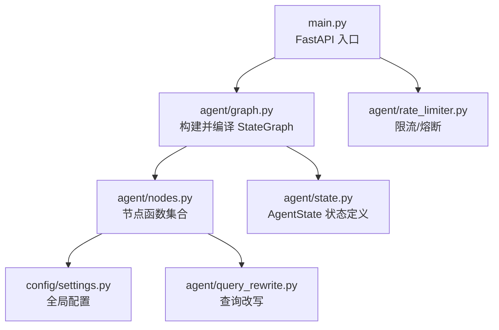
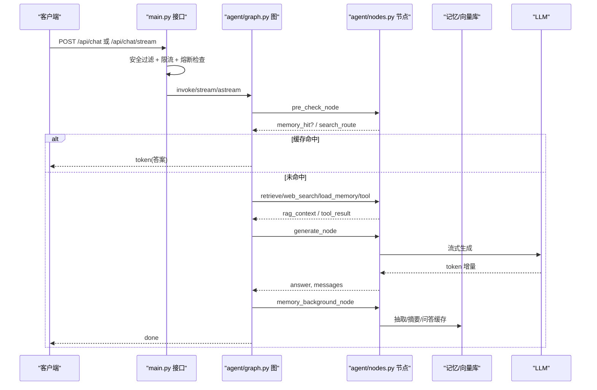
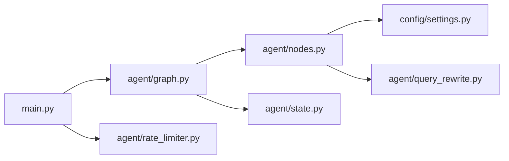

# 节点扩展

<cite>
**本文引用的文件**
- [agent/graph.py](file://agent/graph.py)
- [agent/nodes.py](file://agent/nodes.py)
- [agent/state.py](file://agent/state.py)
- [main.py](file://main.py)
- [config/settings.py](file://config/settings.py)
- [agent/query_rewrite.py](file://agent/query_rewrite.py)
- [agent/rate_limiter.py](file://agent/rate_limiter.py)
</cite>

## 目录
1. [简介](#简介)
2. [项目结构](#项目结构)
3. [核心组件](#核心组件)
4. [架构总览](#架构总览)
5. [详细组件分析](#详细组件分析)
6. [依赖关系分析](#依赖关系分析)
7. [性能考量](#性能考量)
8. [故障排查指南](#故障排查指南)
9. [结论](#结论)
10. [附录：自定义节点开发清单](#附录自定义节点开发清单)

## 简介
本指南面向希望在 LangGraph 工作流中添加“自定义处理节点”的开发者，结合本项目现有实现，系统说明：
- 节点定义规范与状态契约
- 状态管理机制（短期/长期记忆、会话上下文）
- 节点间通信方式（状态字段、条件边、流式事件）
- 错误处理策略（降级、重试、熔断、超时）
- 以现有节点为例，演示如何创建新的业务逻辑节点
- 如何处理异步操作、实现节点重试与降级等高级能力

## 项目结构
本项目基于 LangGraph 的 StateGraph 编排智能体工作流。核心入口在 graph.py 中构建图、注册节点与边；nodes.py 实现各节点函数；state.py 定义 AgentState 状态结构；main.py 提供 Web API 与流式 SSE 接口；settings.py 集中管理配置；rate_limiter.py 提供限流与熔断；query_rewrite.py 提供查询改写能力。

**图表来源**
- [main.py:154-314](file://main.py#L154-L314)
- [agent/graph.py:44-102](file://agent/graph.py#L44-L102)
- [agent/nodes.py:92-151](file://agent/nodes.py#L92-L151)
- [agent/state.py:12-51](file://agent/state.py#L12-L51)
- [config/settings.py:19-156](file://config/settings.py#L19-L156)
- [agent/query_rewrite.py:26-59](file://agent/query_rewrite.py#L26-L59)
- [agent/rate_limiter.py:22-147](file://agent/rate_limiter.py#L22-L147)

**章节来源**
- [agent/graph.py:44-102](file://agent/graph.py#L44-L102)
- [agent/nodes.py:92-151](file://agent/nodes.py#L92-L151)
- [agent/state.py:12-51](file://agent/state.py#L12-L51)
- [main.py:154-314](file://main.py#L154-L314)
- [config/settings.py:19-156](file://config/settings.py#L19-L156)
- [agent/query_rewrite.py:26-59](file://agent/query_rewrite.py#L26-L59)
- [agent/rate_limiter.py:22-147](file://agent/rate_limiter.py#L22-L147)

## 核心组件
- 状态定义 AgentState：统一描述消息历史、用户输入、路由结果、检索上下文、长期/短期记忆、问答命中标志、工具调用上下文等。所有节点通过读写该状态进行通信。
- 节点函数：每个节点接收 AgentState，返回增量更新字典（覆盖型字段），由 LangGraph 合并到状态中。
- 图构建：在 graph.py 中注册节点、添加边与条件边，决定执行顺序与分支。
- 流式输出：graph.py 提供 chat_stream 与 astream_chat，将节点进度与 token 增量统一为事件流，供 main.py 的 SSE 接口使用。
- 配置中心：settings.py 集中控制模型、RAG、搜索、记忆、限流熔断、工具开关等。
- 安全与稳定性：rate_limiter.py 提供限流与熔断；main.py 在入口处做安全过滤、限流、熔断检查。

**章节来源**
- [agent/state.py:12-51](file://agent/state.py#L12-L51)
- [agent/graph.py:44-102](file://agent/graph.py#L44-L102)
- [agent/nodes.py:92-151](file://agent/nodes.py#L92-L151)
- [main.py:154-314](file://main.py#L154-L314)
- [config/settings.py:19-156](file://config/settings.py#L19-L156)
- [agent/rate_limiter.py:22-147](file://agent/rate_limiter.py#L22-L147)

## 架构总览
下图展示了从请求进入、预检查、分流、生成到后台记忆更新的完整流程，以及流式事件透传机制。

**图表来源**
- [main.py:154-314](file://main.py#L154-L314)
- [agent/graph.py:44-102](file://agent/graph.py#L44-L102)
- [agent/nodes.py:92-151](file://agent/nodes.py#L92-L151)
- [agent/nodes.py:284-341](file://agent/nodes.py#L284-L341)
- [agent/nodes.py:499-532](file://agent/nodes.py#L499-L532)
- [agent/nodes.py:630-643](file://agent/nodes.py#L630-L643)

## 详细组件分析

### 状态管理与通信
- AgentState 是节点间唯一通信载体。新增节点应仅读写其明确定义的字段，避免隐式耦合。
- 消息历史 messages 使用 add_messages reducer 自动累加，其他字段为覆盖型写入。
- 关键状态字段：
  - user_input、user_id、session_id：基础标识与会话
  - search_route：路由结果（rag/web/chat/tool）
  - rag_context：检索/搜索结果
  - long_term_context、session_summary：长期与短期记忆上下文
  - memory_hit：问答命中标志，命中时短路至 END
  - query_embedding：用于问答缓存落库
  - answer：最终回答
  - 工具相关：tool_name、tool_params、tool_result、pending_confirmation、confirmation_context

**章节来源**
- [agent/state.py:12-51](file://agent/state.py#L12-L51)

### 节点定义规范
- 节点函数签名：def node(state: AgentState) -> dict
- 返回值：增量更新字典，键名需对应 AgentState 字段
- 节点职责单一：如 pre_check_node 负责缓存匹配+路由；retrieve_node 专注检索；generate_node 专注生成；memory_background_node 专注后台记忆更新
- 条件路由：通过条件边函数返回目标节点名，如 pre_check_condition、route_condition

示例参考路径：
- 预检查节点：[pre_check_node:92-128](file://agent/nodes.py#L92-L128)、[pre_check_condition:131-151](file://agent/nodes.py#L131-L151)
- 检索节点：[retrieve_node:284-321](file://agent/nodes.py#L284-L321)
- 联网搜索节点：[web_search_node:324-341](file://agent/nodes.py#L324-L341)
- 生成节点：[generate_node:499-532](file://agent/nodes.py#L499-L532)
- 后台记忆节点：[memory_background_node:630-643](file://agent/nodes.py#L630-L643)

**章节来源**
- [agent/nodes.py:92-151](file://agent/nodes.py#L92-L151)
- [agent/nodes.py:284-341](file://agent/nodes.py#L284-L341)
- [agent/nodes.py:499-532](file://agent/nodes.py#L499-L532)
- [agent/nodes.py:630-643](file://agent/nodes.py#L630-L643)

### 节点间通信与图编排
- 图构建：在 build_graph 中 add_node 注册节点，add_edge/add_conditional_edges 定义流转
- 线性边：load_memory→generate、retrieve→generate、web_search→generate、tool→END、generate→memory_background→END
- 条件边：pre_check→{end|tool|retrieve|web_search|load_memory|generate}

新增节点步骤：
1. 在 nodes.py 实现节点函数
2. 在 graph.py 的 build_graph 中 add_node
3. 添加边或条件边，接入现有流程
4. 如需流式事件，确保 generate 或其他节点产出 AIMessageChunk，并由 _emit_message_events 统一转为 token 事件

**章节来源**
- [agent/graph.py:44-102](file://agent/graph.py#L44-L102)
- [agent/graph.py:141-205](file://agent/graph.py#L141-L205)
- [agent/graph.py:208-255](file://agent/graph.py#L208-L255)

### 错误处理策略
- 节点内 try/except 包裹外部调用，失败时静默降级（如检索失败返回空上下文、LLM 路由失败走关键词兜底）
- 生成节点主模型失败后尝试备用模型列表，全部失败返回友好提示
- 入口层安全过滤、限流、熔断保护，异常记录并返回标准错误码
- 流式接口整体超时保护，超时后返回已生成内容并结束

参考路径：
- 路由兜底：[route_node/_decide_route:154-212](file://agent/nodes.py#L154-L212)
- 生成降级：[generate_node/_try_fallback_generate:467-497](file://agent/nodes.py#L467-L497)
- 检索/搜索降级：[retrieve_node/web_search_node:284-341](file://agent/nodes.py#L284-L341)
- 入口防护：[main.py 接口:154-314](file://main.py#L154-L314)

**章节来源**
- [agent/nodes.py:154-212](file://agent/nodes.py#L154-L212)
- [agent/nodes.py:467-497](file://agent/nodes.py#L467-L497)
- [agent/nodes.py:284-341](file://agent/nodes.py#L284-L341)
- [main.py:154-314](file://main.py#L154-L314)

### 异步操作与流式输出
- 同步调用：chat() 使用 graph.invoke
- 同步流式：chat_stream() 使用 graph.stream，模式 ["updates", "messages"]
- 异步流式：astream_chat() 使用 graph.astream，模式 ["updates", "messages"]
- 事件转换：_emit_message_events 将节点进度与 token 增量统一为 {"type":"node"/"token"} 事件
- 前端 SSE：main.py 的 /api/chat/stream 将事件转换为 SSE 数据帧

参考路径：
- 流式封装：[chat_stream/astream_chat/_emit_message_events:141-255](file://agent/graph.py#L141-L255)
- SSE 接口：[api_chat_stream:228-314](file://main.py#L228-L314)

**章节来源**
- [agent/graph.py:141-255](file://agent/graph.py#L141-L255)
- [main.py:228-314](file://main.py#L228-L314)

### 重试与降级
- LLM 重试：_get_llm/_get_router_llm 传入 max_retries 与 request_timeout
- 生成降级：主模型失败依次尝试备用模型列表，全部失败返回错误提示
- 路由降级：LLM 路由失败回退关键词判断
- 检索降级：检索/搜索失败返回空上下文，不阻断主链路
- 熔断器：连续失败达到阈值后进入 open 状态，冷却后 half_open 试探，成功恢复 closed

参考路径：
- LLM 实例化：[_get_llm/_get_router_llm:23-60](file://agent/nodes.py#L23-L60)
- 生成降级：[_try_fallback_generate:467-497](file://agent/nodes.py#L467-L497)
- 路由降级：[_decide_route:161-212](file://agent/nodes.py#L161-L212)
- 熔断器：[CircuitBreaker/check_circuit:51-147](file://agent/rate_limiter.py#L51-L147)

**章节来源**
- [agent/nodes.py:23-60](file://agent/nodes.py#L23-L60)
- [agent/nodes.py:467-497](file://agent/nodes.py#L467-L497)
- [agent/nodes.py:161-212](file://agent/nodes.py#L161-L212)
- [agent/rate_limiter.py:51-147](file://agent/rate_limiter.py#L51-L147)

### 以现有节点为例：创建新业务逻辑节点
假设需要新增一个“合规审查节点”compliance_node，用于对生成内容进行合规校验，并在不通过时触发人工审核流程。

步骤：
1. 在 nodes.py 实现 compliance_node(state) -> dict，读取 state 中的 answer/messages，执行校验逻辑，返回 {answer, messages, compliance_flag}
2. 在 graph.py 的 build_graph 中 add_node("compliance", compliance_node)
3. 在 generate 之后添加边 generate→compliance，并在 compliance 处添加条件边：
   - 通过 → memory_background
   - 不通过 → 人工审核节点（可新增 review_node）或直接 END
4. 若需流式事件，确保 generate 产生的 AIMessageChunk 能被 _emit_message_events 正确透传
5. 在 settings.py 增加配置项（如 compliance_enabled、review_callback_url）以支持开关与回调

参考路径：
- 节点实现位置：[nodes.py:1-780](file://agent/nodes.py#L1-L780)
- 图构建与边：[graph.py build_graph:44-102](file://agent/graph.py#L44-L102)
- 流式事件：[graph.py _emit_message_events:141-205](file://agent/graph.py#L141-L205)
- 配置项：[settings.py:19-156](file://config/settings.py#L19-L156)

**章节来源**
- [agent/nodes.py:1-780](file://agent/nodes.py#L1-L780)
- [agent/graph.py:44-102](file://agent/graph.py#L44-L102)
- [agent/graph.py:141-205](file://agent/graph.py#L141-L205)
- [config/settings.py:19-156](file://config/settings.py#L19-L156)

### 处理异步操作
- 对于耗时操作（如外部 API、数据库写入），建议在节点内部使用 try/except 包裹，失败时降级并记录日志
- 若需真正异步执行且不阻塞响应，可在 memory_background_node 的模式下，将非关键任务放入后台线程或队列（注意线程安全）
- 流式接口整体超时保护，避免连接卡死

参考路径：
- 后台记忆：[memory_background_node:630-643](file://agent/nodes.py#L630-L643)
- 流式超时：[main.py api_chat_stream:228-314](file://main.py#L228-L314)

**章节来源**
- [agent/nodes.py:630-643](file://agent/nodes.py#L630-L643)
- [main.py:228-314](file://main.py#L228-L314)

### 实现节点重试与降级的高级功能
- 重试：在节点内部对外部调用设置重试次数与超时（如 LLM 调用），或使用装饰器包装
- 降级：当主路径失败时，切换到备用路径（如备用模型、关键词路由、空上下文继续生成）
- 熔断：在入口层使用 rate_limiter 的熔断器，防止雪崩
- 监控：通过日志与指标记录节点执行时间与错误率，便于定位瓶颈

参考路径：
- LLM 重试：[_get_llm:23-60](file://agent/nodes.py#L23-L60)
- 路由降级：[_decide_route:161-212](file://agent/nodes.py#L161-L212)
- 熔断器：[rate_limiter.py:51-147](file://agent/rate_limiter.py#L51-L147)

**章节来源**
- [agent/nodes.py:23-60](file://agent/nodes.py#L23-L60)
- [agent/nodes.py:161-212](file://agent/nodes.py#L161-L212)
- [agent/rate_limiter.py:51-147](file://agent/rate_limiter.py#L51-L147)

## 依赖关系分析
- graph.py 依赖 nodes.py 的节点函数与 state.py 的状态定义
- nodes.py 依赖 settings.py 的配置、query_rewrite.py 的查询改写、以及外部模块（LLM、RAG、记忆、工具）
- main.py 依赖 graph.py 的图与 rate_limiter.py 的安全防护
- 配置项影响节点行为（如 web_search_enabled、tool_calling_enabled、memory_qa_cache_enabled）

**图表来源**
- [main.py:154-314](file://main.py#L154-L314)
- [agent/graph.py:44-102](file://agent/graph.py#L44-L102)
- [agent/nodes.py:92-151](file://agent/nodes.py#L92-L151)
- [agent/state.py:12-51](file://agent/state.py#L12-L51)
- [config/settings.py:19-156](file://config/settings.py#L19-L156)
- [agent/query_rewrite.py:26-59](file://agent/query_rewrite.py#L26-L59)
- [agent/rate_limiter.py:22-147](file://agent/rate_limiter.py#L22-L147)

**章节来源**
- [agent/graph.py:44-102](file://agent/graph.py#L44-L102)
- [agent/nodes.py:92-151](file://agent/nodes.py#L92-L151)
- [agent/state.py:12-51](file://agent/state.py#L12-L51)
- [main.py:154-314](file://main.py#L154-L314)
- [config/settings.py:19-156](file://config/settings.py#L19-L156)
- [agent/query_rewrite.py:26-59](file://agent/query_rewrite.py#L26-L59)
- [agent/rate_limiter.py:22-147](file://agent/rate_limiter.py#L22-L147)

## 性能考量
- 首请求延迟优化：启动时预热 LLM 连接与向量库索引，减少首次请求冷启动时间
- 流式输出：使用 stream_mode=["updates","messages"] 逐 token 推送，提升用户体验
- 检索优化：查询改写、多路召回、重排序、相关度阈值过滤，平衡召回与精度
- 记忆压缩：短期窗口与字符预算控制，避免上下文过大导致生成缓慢
- 限流与熔断：按用户维度限流，连续失败熔断，保护后端服务

参考路径：
- 预热：[main.py warmup_llm/warmup_vectorstore:45-135](file://main.py#L45-L135)
- 流式：[graph.py chat_stream/astream_chat:190-255](file://agent/graph.py#L190-L255)
- 检索：[agent/nodes.py retrieve_node:284-321](file://agent/nodes.py#L284-L321)
- 记忆：[agent/nodes.py build_chat_history/memory_update_node:427-564](file://agent/nodes.py#L427-L564)
- 限流熔断：[agent/rate_limiter.py:22-147](file://agent/rate_limiter.py#L22-L147)

**章节来源**
- [main.py:45-135](file://main.py#L45-L135)
- [agent/graph.py:190-255](file://agent/graph.py#L190-L255)
- [agent/nodes.py:284-321](file://agent/nodes.py#L284-L321)
- [agent/nodes.py:427-564](file://agent/nodes.py#L427-L564)
- [agent/rate_limiter.py:22-147](file://agent/rate_limiter.py#L22-L147)

## 故障排查指南
- 路由失败：检查 LLM 路由是否可用，确认关键词兜底逻辑生效
- 检索失败：检查 RAG 配置与向量库状态，确认检索结果是否为空
- 生成失败：检查主模型与备用模型配置，查看降级路径是否生效
- 流式超时：检查 stream_timeout 配置与服务端网络状况
- 熔断触发：检查连续失败次数与冷却时间，确认熔断器状态

参考路径：
- 路由兜底：[agent/nodes.py route_node/_decide_route:154-212](file://agent/nodes.py#L154-L212)
- 检索降级：[agent/nodes.py retrieve_node/web_search_node:284-341](file://agent/nodes.py#L284-L341)
- 生成降级：[agent/nodes.py generate_node/_try_fallback_generate:467-497](file://agent/nodes.py#L467-L497)
- 流式超时：[main.py api_chat_stream:228-314](file://main.py#L228-L314)
- 熔断状态：[agent/rate_limiter.py CircuitBreaker:51-147](file://agent/rate_limiter.py#L51-L147)

**章节来源**
- [agent/nodes.py:154-212](file://agent/nodes.py#L154-L212)
- [agent/nodes.py:284-341](file://agent/nodes.py#L284-L341)
- [agent/nodes.py:467-497](file://agent/nodes.py#L467-L497)
- [main.py:228-314](file://main.py#L228-L314)
- [agent/rate_limiter.py:51-147](file://agent/rate_limiter.py#L51-L147)

## 结论
通过遵循本指南的节点定义规范、状态管理机制、通信方式与错误处理策略，可以在 LangGraph 工作流中安全、高效地添加自定义处理节点。建议优先复用现有模式（如预检查、检索、生成、后台记忆），并结合配置开关与降级路径，确保系统的稳定性与可扩展性。

## 附录：自定义节点开发清单
- 定义节点函数：def node(state: AgentState) -> dict
- 读写状态：仅修改 AgentState 中明确定义的字段
- 注册节点：在 graph.py 的 build_graph 中 add_node
- 添加边：线性边或条件边，接入现有流程
- 错误处理：try/except 包裹外部调用，失败时降级并记录日志
- 流式支持：确保 generate 或其他节点产出 AIMessageChunk，由 _emit_message_events 统一转事件
- 配置项：在 settings.py 增加开关与参数，支持动态控制
- 测试验证：使用 REPL 或 Web 接口测试节点行为与流式输出

参考路径：
- 节点实现：[agent/nodes.py:1-780](file://agent/nodes.py#L1-L780)
- 图构建：[agent/graph.py build_graph:44-102](file://agent/graph.py#L44-L102)
- 流式事件：[agent/graph.py _emit_message_events:141-205](file://agent/graph.py#L141-L205)
- 配置项：[config/settings.py:19-156](file://config/settings.py#L19-L156)

**章节来源**
- [agent/nodes.py:1-780](file://agent/nodes.py#L1-L780)
- [agent/graph.py:44-102](file://agent/graph.py#L44-L102)
- [agent/graph.py:141-205](file://agent/graph.py#L141-L205)
- [config/settings.py:19-156](file://config/settings.py#L19-L156)