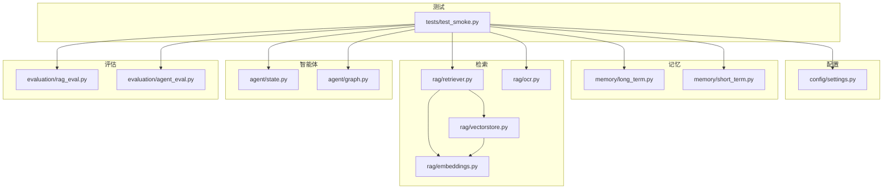
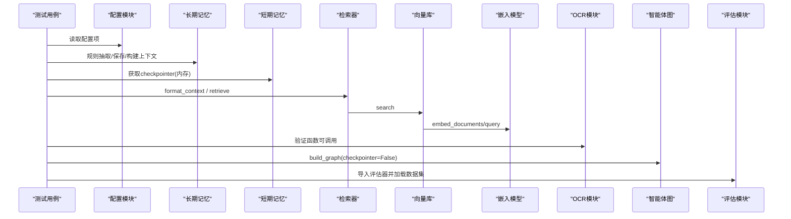
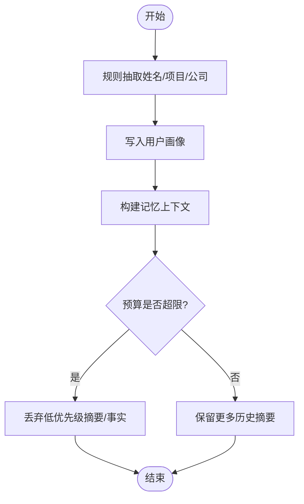
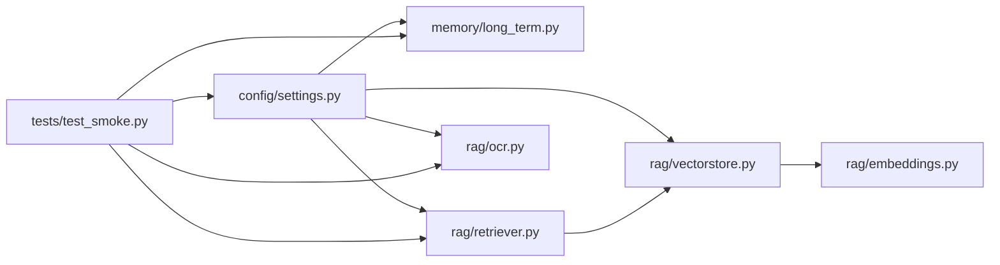

# 单元测试

<cite>
**本文引用的文件**
- [tests/test_smoke.py](file://tests/test_smoke.py)
- [config/settings.py](file://config/settings.py)
- [memory/long_term.py](file://memory/long_term.py)
- [memory/short_term.py](file://memory/short_term.py)
- [rag/retriever.py](file://rag/retriever.py)
- [rag/ocr.py](file://rag/ocr.py)
- [agent/state.py](file://agent/state.py)
- [agent/graph.py](file://agent/graph.py)
- [rag/embeddings.py](file://rag/embeddings.py)
- [rag/vectorstore.py](file://rag/vectorstore.py)
- [evaluation/rag_eval.py](file://evaluation/rag_eval.py)
- [evaluation/agent_eval.py](file://evaluation/agent_eval.py)
</cite>

## 目录
1. [简介](#简介)
2. [项目结构](#项目结构)
3. [核心组件](#核心组件)
4. [架构总览](#架构总览)
5. [详细组件分析](#详细组件分析)
6. [依赖关系分析](#依赖关系分析)
7. [性能考量](#性能考量)
8. [故障排查指南](#故障排查指南)
9. [结论](#结论)
10. [附录](#附录)

## 简介
本指南基于冒烟测试 tests/test_smoke.py 的完整实现，系统化说明如何编写与运行项目的单元测试。内容覆盖配置模块测试、记忆系统测试（长期/短期）、RAG 检索器测试、OCR 模块测试等；解释测试框架使用、断言方法、测试数据准备与清理机制；并提供测试最佳实践（测试隔离、Mock 使用、异步测试处理），帮助开发者理解测试覆盖范围与质量要求。

## 项目结构
本项目采用按功能域划分的模块化组织：
- config：全局配置管理（pydantic-settings）
- memory：长期记忆（SQLite）与短期记忆（LangGraph MemorySaver）
- rag：检索、重排序、向量库、多模态嵌入、OCR、网页搜索
- agent：状态定义、图构建与工作流节点
- evaluation：RAG 与智能体评估工具
- tests：冒烟测试入口

图表来源
- [tests/test_smoke.py:15-366](file://tests/test_smoke.py#L15-L366)
- [config/settings.py:19-216](file://config/settings.py#L19-L216)
- [memory/long_term.py:1-820](file://memory/long_term.py#L1-L820)
- [memory/short_term.py:1-28](file://memory/short_term.py#L1-L28)
- [rag/retriever.py:1-140](file://rag/retriever.py#L1-L140)
- [rag/vectorstore.py:1-282](file://rag/vectorstore.py#L1-L282)
- [rag/embeddings.py:1-180](file://rag/embeddings.py#L1-L180)
- [rag/ocr.py:1-142](file://rag/ocr.py#L1-L142)
- [agent/state.py:1-54](file://agent/state.py#L1-L54)
- [agent/graph.py:1-255](file://agent/graph.py#L1-L255)
- [evaluation/rag_eval.py:1-121](file://evaluation/rag_eval.py#L1-L121)
- [evaluation/agent_eval.py:1-139](file://evaluation/agent_eval.py#L1-L139)

章节来源
- [tests/test_smoke.py:15-366](file://tests/test_smoke.py#L15-L366)

## 核心组件
- 配置模块：集中管理 LLM、Embedding、向量库、记忆、OCR、联网搜索等参数，提供单例 get_settings()。
- 长期记忆：基于 SQLite，分层结构化存储（画像/事实/摘要/问答缓存），支持预算控制与关键词召回。
- 短期记忆：基于 LangGraph MemorySaver，进程内会话上下文。
- RAG 检索器：向量检索 + BM25（可选）+ 重排序（可选），并格式化上下文。
- OCR 模块：图片/PDF 文本提取与 OCR 兜底。
- 智能体状态与图：AgentState 定义流转字段；build_graph 编译工作流。
- 评估模块：RAG 与智能体评估器构建与批量执行。

章节来源
- [config/settings.py:19-216](file://config/settings.py#L19-L216)
- [memory/long_term.py:1-820](file://memory/long_term.py#L1-L820)
- [memory/short_term.py:1-28](file://memory/short_term.py#L1-L28)
- [rag/retriever.py:1-140](file://rag/retriever.py#L1-L140)
- [rag/ocr.py:1-142](file://rag/ocr.py#L1-L142)
- [agent/state.py:1-54](file://agent/state.py#L1-L54)
- [agent/graph.py:1-255](file://agent/graph.py#L1-L255)
- [evaluation/rag_eval.py:1-121](file://evaluation/rag_eval.py#L1-L121)
- [evaluation/agent_eval.py:1-139](file://evaluation/agent_eval.py#L1-L139)

## 架构总览
冒烟测试通过 pytest 或 Python 直接运行，覆盖导入、配置读取、记忆存取、检索格式化、OCR 函数存在性、评估模块导入等关键路径。下图展示测试到各模块的调用关系。

图表来源
- [tests/test_smoke.py:15-366](file://tests/test_smoke.py#L15-L366)
- [config/settings.py:19-216](file://config/settings.py#L19-L216)
- [memory/long_term.py:1-820](file://memory/long_term.py#L1-L820)
- [memory/short_term.py:1-28](file://memory/short_term.py#L1-L28)
- [rag/retriever.py:1-140](file://rag/retriever.py#L1-L140)
- [rag/vectorstore.py:1-282](file://rag/vectorstore.py#L1-L282)
- [rag/embeddings.py:1-180](file://rag/embeddings.py#L1-L180)
- [rag/ocr.py:1-142](file://rag/ocr.py#L1-L142)
- [agent/graph.py:1-255](file://agent/graph.py#L1-L255)
- [evaluation/rag_eval.py:1-121](file://evaluation/rag_eval.py#L1-L121)
- [evaluation/agent_eval.py:1-139](file://evaluation/agent_eval.py#L1-L139)

## 详细组件分析

### 配置模块测试
- 目标：确保 get_settings() 可用且关键字段已正确配置（如 llm_model、embedding_model、ocr_min_text_length、ocr_language_list 等）。
- 断言要点：非空字符串、正整数、列表长度大于 0。
- 最佳实践：在 CI 中校验 .env 或环境变量是否齐全；对必填项设置默认值并在测试中显式断言。

章节来源
- [tests/test_smoke.py:15-25](file://tests/test_smoke.py#L15-L25)
- [config/settings.py:19-216](file://config/settings.py#L19-L216)

### 记忆系统测试（长期记忆）
- 规则抽取与跨轮召回：
  - 使用 apply_extraction 将“我叫张三”写入画像，并通过 build_memory_context 验证上下文包含姓名与分节格式。
  - 多次 save_summary 后仍应保留关键信息（P0 硬保留策略）。
- 预算控制：
  - 构造大量事实与摘要，验证 build_memory_context 输出长度受控（允许 P0 硬保留小幅超出）。
- 问答缓存：
  - 使用 save_qa/search_qa_by_embedding 验证相似度匹配与阈值过滤；相同问题更新而非重复插入。
- 数据清理：
  - 每个测试使用唯一 uid，并在 finally 中清理 user_profile/user_facts/user_memory/summary_history/user_prefs/qa_memory/session_summary 对应记录。

图表来源
- [memory/long_term.py:424-497](file://memory/long_term.py#L424-L497)
- [memory/long_term.py:682-697](file://memory/long_term.py#L682-L697)
- [memory/long_term.py:729-800](file://memory/long_term.py#L729-L800)

章节来源
- [tests/test_smoke.py:39-147](file://tests/test_smoke.py#L39-L147)
- [memory/long_term.py:1-820](file://memory/long_term.py#L1-L820)

### 短期记忆压缩测试
- 目标：验证 build_chat_history 在超窗情况下仅保留最近消息，并将更早对话摘要注入首条。
- 断言要点：输出消息数量符合窗口大小；字符预算压力下从最旧消息开始丢弃。

章节来源
- [tests/test_smoke.py:96-116](file://tests/test_smoke.py#L96-L116)
- [memory/short_term.py:1-28](file://memory/short_term.py#L1-L28)

### RAG 检索器测试
- 目标：在不依赖外部向量库的情况下，验证 format_context 能正确格式化文档与元数据。
- 扩展建议：可进一步 mock vectorstore.search 以验证 retrieve 流程（BM25/重排序分支）。

章节来源
- [tests/test_smoke.py:180-189](file://tests/test_smoke.py#L180-L189)
- [rag/retriever.py:113-139](file://rag/retriever.py#L113-L139)

### OCR 模块测试
- 目标：验证 OCR 相关函数可被导入且为可调用的对象（不实际加载模型）。
- 扩展建议：可使用小尺寸图片进行端到端 OCR 测试，或使用 Mock 替换 easyocr.Reader。

章节来源
- [tests/test_smoke.py:213-221](file://tests/test_smoke.py#L213-L221)
- [rag/ocr.py:26-142](file://rag/ocr.py#L26-L142)

### 多模态嵌入类测试
- 目标：验证 JinaClipEmbeddings 类与方法存在（embed_documents/embed_query/embed_images/embed_query_image），以及 get_embeddings 工厂函数可用。
- 注意：避免在测试中实际加载模型，仅做存在性与类型检查。

章节来源
- [tests/test_smoke.py:224-234](file://tests/test_smoke.py#L224-L234)
- [rag/embeddings.py:29-128](file://rag/embeddings.py#L29-L128)
- [rag/embeddings.py:164-180](file://rag/embeddings.py#L164-L180)

### 文件扩展名与重排序/联网搜索配置测试
- 目标：验证 SUPPORTED_EXTENSIONS、IMAGE_EXTENSIONS 与 settings.supported_extensions_list 一致；重排序与联网搜索配置项存在且合法。
- 断言要点：布尔开关、正整数上限、超时时间合理。

章节来源
- [tests/test_smoke.py:237-315](file://tests/test_smoke.py#L237-L315)
- [config/settings.py:95-133](file://config/settings.py#L95-L133)

### 智能体状态与图构建测试
- 目标：验证 AgentState 字段定义；build_graph(checkpointer=False) 可编译无 checkpointer 模式。
- 扩展建议：增加带 checkpointer 的图构建与简单 invoke 测试。

章节来源
- [tests/test_smoke.py:150-167](file://tests/test_smoke.py#L150-L167)
- [agent/state.py:12-51](file://agent/state.py#L12-L51)
- [agent/graph.py:44-102](file://agent/graph.py#L44-L102)

### 评估模块导入测试
- 目标：验证 RAG 与智能体评估器构建函数可导入，且数据集非空。
- 扩展建议：在离线模式下 mock judge LLM 以运行最小化评估流程。

章节来源
- [tests/test_smoke.py:170-177](file://tests/test_smoke.py#L170-L177)
- [evaluation/rag_eval.py:63-121](file://evaluation/rag_eval.py#L63-L121)
- [evaluation/agent_eval.py:33-70](file://evaluation/agent_eval.py#L33-L70)

## 依赖关系分析
- 测试到模块的耦合点：
  - 配置模块被所有子系统读取，测试需保证环境变量/.env 有效。
  - 长期记忆依赖 SQLite 与线程锁，测试需隔离用户数据并清理。
  - 检索器依赖向量库与嵌入模型，测试可通过只测 format_context 降低外部依赖。
  - OCR 模块首次调用会下载模型权重，测试应避免实际推理。
- 潜在循环依赖：
  - long_term.py 在 _get_conn 中延迟导入 settings，避免启动时循环导入。
- 外部依赖：
  - Milvus Lite、easyocr、transformers、langchain_milvus 等，建议在测试环境中预装或 Mock。

图表来源
- [config/settings.py:19-216](file://config/settings.py#L19-L216)
- [memory/long_term.py:1-820](file://memory/long_term.py#L1-L820)
- [rag/retriever.py:1-140](file://rag/retriever.py#L1-L140)
- [rag/vectorstore.py:1-282](file://rag/vectorstore.py#L1-L282)
- [rag/embeddings.py:1-180](file://rag/embeddings.py#L1-L180)
- [rag/ocr.py:1-142](file://rag/ocr.py#L1-L142)
- [tests/test_smoke.py:15-366](file://tests/test_smoke.py#L15-L366)

章节来源
- [tests/test_smoke.py:15-366](file://tests/test_smoke.py#L15-L366)

## 性能考量
- 长期记忆预算控制：
  - P0 层（画像/关键事实）硬保留，P1/P2 层按预算填充，避免上下文过长影响生成效率。
- 向量检索与重排序：
  - 关闭 BM25 或重排序可降低延迟；测试中可通过配置切换分支。
- OCR 模型加载：
  - 延迟初始化 Reader，避免启动开销；测试中仅验证函数存在性。
- 并发与锁：
  - 长期记忆写操作使用线程锁串行化；向量库写操作加锁避免并发冲突。

[本节为通用指导，无需具体文件引用]

## 故障排查指南
- 配置缺失：
  - 若 get_settings() 抛出异常，检查 .env 或环境变量是否包含必要键（如 llm_api_key、milvus_db_file 等）。
- 数据库连接失败：
  - 确认 data/memory.db 与 data/milvus/milvus_lite.db 路径可写；WAL 模式需权限。
- OCR 模型下载失败：
  - 检查网络与 HF_ENDPOINT 镜像配置；必要时手动下载模型权重。
- 向量库连接异常：
  - 确认 Milvus Lite 版本与 gRPC keepalive 配置；必要时重置 collection。
- 评估模块报错：
  - 未配置 LANGSMITH_API_KEY 时会跳过客户端初始化；judge LLM 不可用时评估结果含 error 标记。

章节来源
- [config/settings.py:19-216](file://config/settings.py#L19-L216)
- [memory/long_term.py:30-47](file://memory/long_term.py#L30-L47)
- [rag/ocr.py:26-43](file://rag/ocr.py#L26-L43)
- [rag/vectorstore.py:29-76](file://rag/vectorstore.py#L29-L76)
- [evaluation/agent_eval.py:73-93](file://evaluation/agent_eval.py#L73-L93)

## 结论
本指南基于冒烟测试覆盖了配置、记忆、检索、OCR、智能体图与评估等关键模块的导入与基本功能验证。通过合理的测试隔离、数据清理与最小依赖策略，可在本地与 CI 环境快速发现回归问题。建议逐步补充更深入的集成测试与 Mock 用例，进一步提升覆盖率与稳定性。

[本节为总结，无需具体文件引用]

## 附录

### 如何运行测试
- 使用 pytest：
  - python -m pytest tests/test_smoke.py -v
- 直接运行：
  - python tests/test_smoke.py

章节来源
- [tests/test_smoke.py:1-5](file://tests/test_smoke.py#L1-L5)

### 测试最佳实践
- 测试隔离：
  - 每个测试使用唯一用户标识，避免共享状态污染。
  - 在 finally 块中清理数据库记录，确保幂等。
- Mock 使用：
  - 对耗时或外部依赖（如 easyocr、Milvus、LLM）进行 Mock，仅验证接口行为。
- 异步测试处理：
  - 对于 astream_chat 等异步入口，建议使用 pytest-asyncio 编写异步测试，验证事件流与去重逻辑。
- 断言方法：
  - 使用 assert 明确断言返回值、长度、包含关系与边界条件；对异常路径添加 try/except 并断言错误信息。
- 数据准备：
  - 构造最小可行样本（如短文本、小图片），减少测试时间与资源消耗。
- 覆盖率与质量：
  - 结合 coverage 统计行覆盖率；关注关键路径（检索、记忆、配置）的覆盖度。

[本节为通用指导，无需具体文件引用]