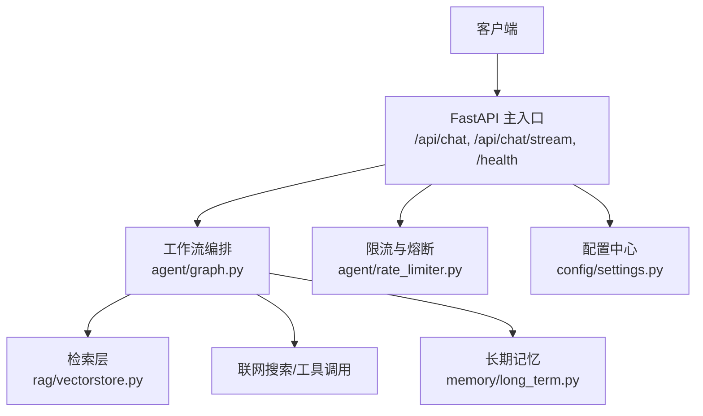
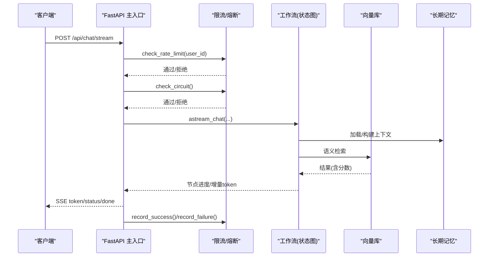
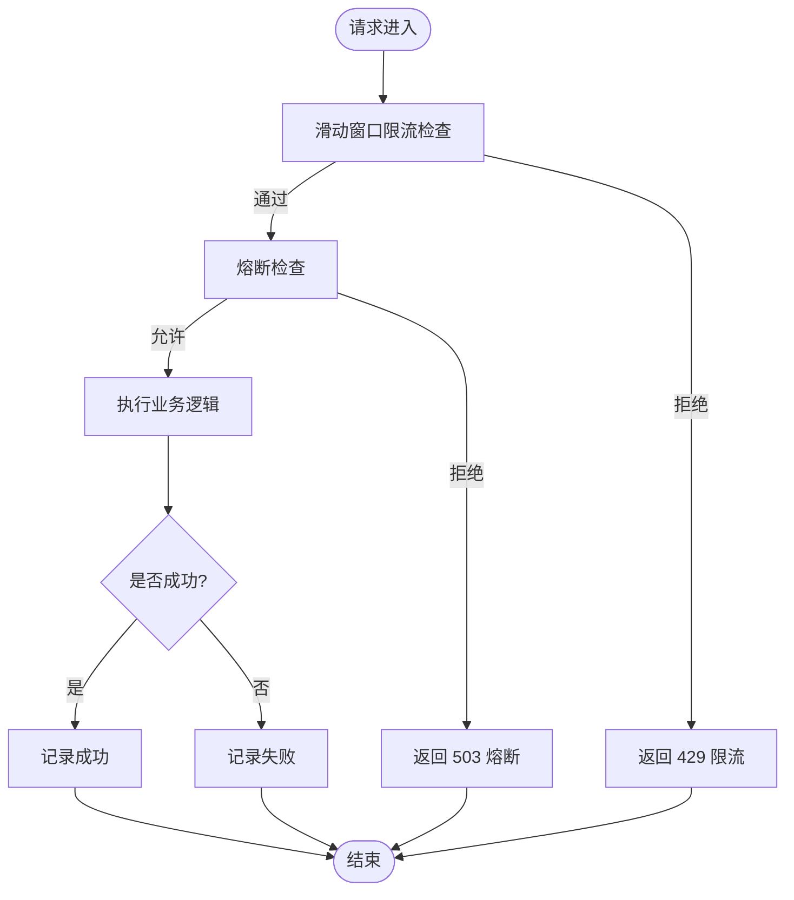
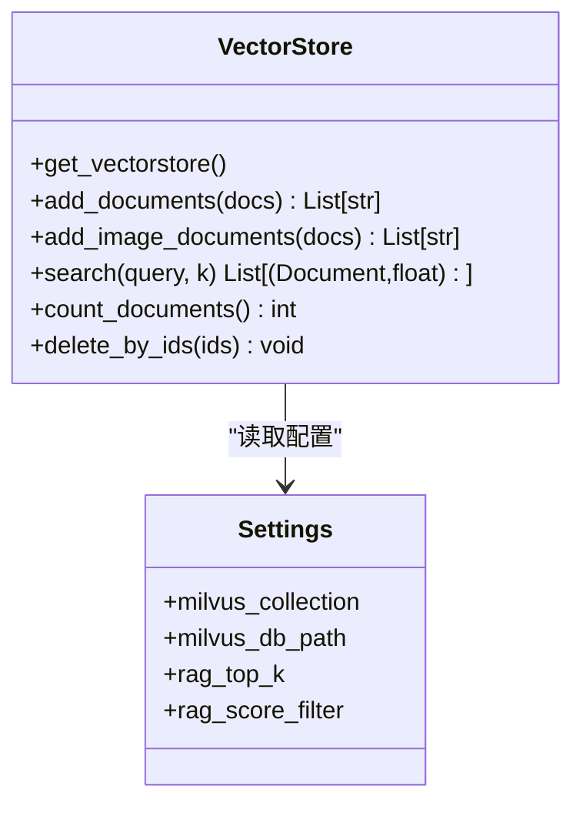
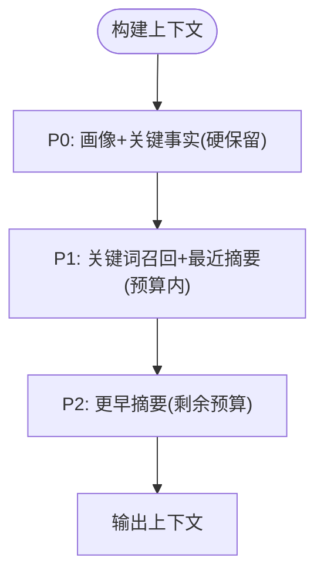
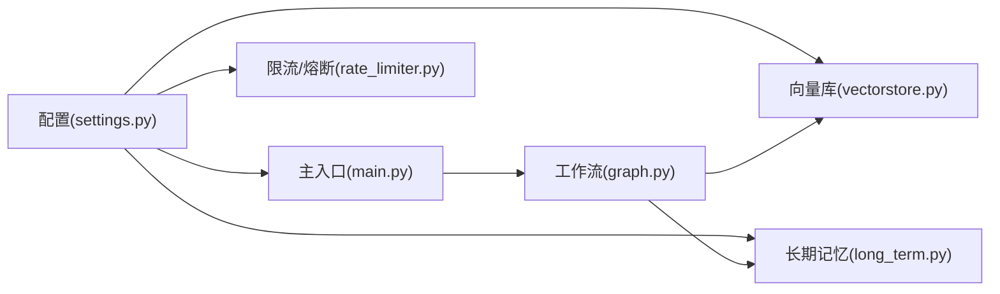

# 性能测试

<cite>
**本文引用的文件**
- [main.py](file://main.py)
- [agent/rate_limiter.py](file://agent/rate_limiter.py)
- [config/settings.py](file://config/settings.py)
- [agent/graph.py](file://agent/graph.py)
- [rag/vectorstore.py](file://rag/vectorstore.py)
- [memory/long_term.py](file://memory/long_term.py)
- [tests/test_smoke.py](file://tests/test_smoke.py)
- [evaluation/rag_eval.py](file://evaluation/rag_eval.py)
- [requirements.txt](file://requirements.txt)
- [需求分析文档.md](file://需求分析文档.md)
</cite>

## 目录
1. [简介](#简介)
2. [项目结构](#项目结构)
3. [核心组件](#核心组件)
4. [架构总览](#架构总览)
5. [详细组件分析](#详细组件分析)
6. [依赖关系分析](#依赖关系分析)
7. [性能考量与优化建议](#性能考量与优化建议)
8. [故障排查指南](#故障排查指南)
9. [结论](#结论)
10. [附录：基准与压测脚本模板](#附录基准与压测脚本模板)

## 简介
本指南面向开发者，基于仓库中现有代码与配置，提供一套可落地的性能测试方法，涵盖负载测试、压力测试与性能基准测试。重点覆盖以下方面：
- 响应时间测量（端到端、分阶段）
- 内存使用监控（进程内与外部服务）
- 并发处理能力测试（限流与熔断验证）
- 检索与生成链路瓶颈识别
- 持续监控与优化闭环

本项目已内置多项对性能友好的设计与开关（如启动预热、限流与熔断、WAL 模式、向量库写入锁、流式超时保护等），为性能测试提供了良好基础。

## 项目结构
与性能相关的关键路径包括：
- Web 入口与接口：主入口提供同步与流式聊天接口，健康检查端点用于服务可用性探测
- 工作流编排：状态图定义节点顺序与并行分支，支持流式事件输出
- 限流与熔断：按用户维度滑动窗口限流；连续失败触发熔断并半开试探
- 向量检索：Milvus Lite 本地持久化，带写入锁与 flush 策略
- 长期记忆：SQLite WAL 模式，分层预算控制上下文长度
- 评估模块：RAG 质量评估器可用于回归与稳定性评测

图表来源
- [main.py:154-314](file://main.py#L154-L314)
- [agent/graph.py:44-102](file://agent/graph.py#L44-L102)
- [rag/vectorstore.py:29-76](file://rag/vectorstore.py#L29-L76)
- [memory/long_term.py:30-47](file://memory/long_term.py#L30-L47)
- [agent/rate_limiter.py:22-47](file://agent/rate_limiter.py#L22-L47)
- [config/settings.py:143-149](file://config/settings.py#L143-L149)

章节来源
- [main.py:154-314](file://main.py#L154-L314)
- [agent/graph.py:44-102](file://agent/graph.py#L44-L102)
- [rag/vectorstore.py:29-76](file://rag/vectorstore.py#L29-L76)
- [memory/long_term.py:30-47](file://memory/long_term.py#L30-L47)
- [agent/rate_limiter.py:22-47](file://agent/rate_limiter.py#L22-L47)
- [config/settings.py:143-149](file://config/settings.py#L143-L149)

## 核心组件
- 限流器（滑动窗口）：按 user_id 每分钟请求数上限，默认关闭，可通过配置开启
- 熔断器：连续失败达阈值后进入 open，冷却后 half_open 试探一次，成功恢复 closed
- 向量库单例与写入锁：避免并发写入冲突，flush 确保可查
- 长期记忆 SQLite：WAL 模式提升并发读能力，busy_timeout 降低写阻塞风险
- 流式接口整体超时：防止长连接卡死，保障资源释放
- 启动预热：LLM 连接、向量库索引预热，降低首请求延迟

章节来源
- [agent/rate_limiter.py:50-147](file://agent/rate_limiter.py#L50-L147)
- [rag/vectorstore.py:22-27](file://rag/vectorstore.py#L22-L27)
- [rag/vectorstore.py:79-106](file://rag/vectorstore.py#L79-L106)
- [memory/long_term.py:30-47](file://memory/long_term.py#L30-L47)
- [main.py:45-135](file://main.py#L45-L135)
- [main.py:228-314](file://main.py#L228-L314)

## 架构总览
下图展示一次流式聊天请求从接入到返回的完整时序，包含限流、熔断、工作流节点与流式事件处理。

图表来源
- [main.py:228-314](file://main.py#L228-L314)
- [agent/graph.py:208-255](file://agent/graph.py#L208-L255)
- [rag/vectorstore.py:164-184](file://rag/vectorstore.py#L164-L184)
- [memory/long_term.py:424-497](file://memory/long_term.py#L424-L497)
- [agent/rate_limiter.py:22-47](file://agent/rate_limiter.py#L22-L47)

## 详细组件分析

### 限流与熔断（并发与稳定性）
- 滑动窗口限流：以 user_id 为单位维护最近 60 秒的请求时间戳队列，超过阈值则拒绝
- 熔断器状态机：closed → open（连续失败达阈值）→ half_open（冷却期过后放行一次试探）→ closed/half_open 失败回 open
- 集成点：在同步与流式接口入口处统一执行，异常或超时分别记录成功/失败

图表来源
- [agent/rate_limiter.py:22-47](file://agent/rate_limiter.py#L22-L47)
- [agent/rate_limiter.py:50-147](file://agent/rate_limiter.py#L50-L147)
- [main.py:173-185](file://main.py#L173-L185)
- [main.py:248-260](file://main.py#L248-L260)

章节来源
- [agent/rate_limiter.py:22-47](file://agent/rate_limiter.py#L22-L47)
- [agent/rate_limiter.py:50-147](file://agent/rate_limiter.py#L50-L147)
- [main.py:173-185](file://main.py#L173-L185)
- [main.py:248-260](file://main.py#L248-L260)

### 向量检索与写入（吞吐与一致性）
- 单例初始化：首次访问时创建 Milvus 实例，启用动态字段与 gRPC keepalive 调优
- 写入保护：add_documents/add_image_documents/delete_by_ids 均加写锁，写入后 flush 保证可查
- 检索过滤：相似度距离阈值过滤低相关结果，空结果回退原始返回

图表来源
- [rag/vectorstore.py:29-76](file://rag/vectorstore.py#L29-L76)
- [rag/vectorstore.py:79-106](file://rag/vectorstore.py#L79-L106)
- [rag/vectorstore.py:164-184](file://rag/vectorstore.py#L164-L184)
- [config/settings.py:54-75](file://config/settings.py#L54-L75)

章节来源
- [rag/vectorstore.py:29-76](file://rag/vectorstore.py#L29-L76)
- [rag/vectorstore.py:79-106](file://rag/vectorstore.py#L79-L106)
- [rag/vectorstore.py:164-184](file://rag/vectorstore.py#L164-L184)
- [config/settings.py:54-75](file://config/settings.py#L54-L75)

### 长期记忆（预算控制与并发）
- WAL 模式与 busy_timeout：提升并发读能力，降低写阻塞
- 分层预算：P0 画像与关键事实硬保留，P1/P2 摘要按预算填充，超出丢弃旧条
- 问答缓存：相似问题直接复用历史答案，减少 LLM 调用

图表来源
- [memory/long_term.py:30-47](file://memory/long_term.py#L30-L47)
- [memory/long_term.py:424-497](file://memory/long_term.py#L424-L497)

章节来源
- [memory/long_term.py:30-47](file://memory/long_term.py#L30-L47)
- [memory/long_term.py:424-497](file://memory/long_term.py#L424-L497)

### 流式接口与超时保护（用户体验与资源管理）
- 整体超时：按配置 stream_timeout 限制流式拉取，超时返回已生成内容
- 事件类型：status/token/error/done，便于前端渲染与错误提示
- 熔断联动：正常完成记成功，异常记失败累计触发熔断

章节来源
- [main.py:228-314](file://main.py#L228-L314)
- [config/settings.py:47-48](file://config/settings.py#L47-L48)

## 依赖关系分析
- 配置驱动：所有性能相关开关由 settings 集中管理（限流、熔断、检索参数、流式超时等）
- 工作流编排：graph 将检索、记忆、工具调用、生成串联，支持流式事件透传
- 外部依赖：FastAPI/Uvicorn 提供 Web 服务；Milvus Lite 提供向量存储；SQLite 提供长期记忆

图表来源
- [config/settings.py:143-149](file://config/settings.py#L143-L149)
- [main.py:154-314](file://main.py#L154-L314)
- [agent/graph.py:44-102](file://agent/graph.py#L44-L102)
- [rag/vectorstore.py:29-76](file://rag/vectorstore.py#L29-L76)
- [memory/long_term.py:30-47](file://memory/long_term.py#L30-L47)

章节来源
- [config/settings.py:143-149](file://config/settings.py#L143-L149)
- [main.py:154-314](file://main.py#L154-L314)
- [agent/graph.py:44-102](file://agent/graph.py#L44-L102)
- [rag/vectorstore.py:29-76](file://rag/vectorstore.py#L29-L76)
- [memory/long_term.py:30-47](file://memory/long_term.py#L30-L47)

## 性能考量与优化建议
- 启动预热
  - LLM 连接预热：在应用启动时发起最小请求，建立 TLS/DNS/连接池，显著降低首请求延迟
  - 向量库与 BM25 索引预热：启动时检查并重建/增量更新知识库，必要时预热 BM25 索引
- 限流与熔断
  - 合理设置 rate_limit_per_minute 与 circuit_breaker_threshold/recovery，保护后端与外部服务
  - 结合健康检查端点观察熔断状态，定位不稳定依赖
- 检索优化
  - 调整 rag_top_k、rag_score_filter、rerank_candidate_count/rerank_top_k，平衡召回与延迟
  - 多路召回（BM25）仅在需要时开启，注意候选融合带来的额外开销
- 记忆预算
  - memory_context_budget/memory_history_budget 控制上下文大小，避免过长导致生成延迟与幻觉
  - 问答缓存命中可显著减少 LLM 调用，提高吞吐
- 流式体验
  - 根据网络与服务能力调整 stream_timeout，避免长时间占用连接
  - 前端按 status/token 逐步渲染，提升感知速度
- 监控指标建议
  - 端到端耗时：/api/chat 与 /api/chat/stream 的 p50/p95/p99
  - 分阶段耗时：预检查、检索、生成、记忆更新的耗时分布
  - 资源使用：CPU、内存、磁盘 IO（Milvus .db）、SQLite WAL 文件大小
  - 错误率：限流 429、熔断 503、异常 500 的比例与时序
  - 缓存命中率：问答缓存命中次数/总查询次数
  - 向量库统计：collection 行数、检索耗时、过滤比例

[本节为通用指导，不直接分析具体文件]

## 故障排查指南
- 限流触发
  - 现象：大量 429 响应
  - 排查：确认 rate_limit_per_minute 配置与用户行为；检查是否存在同一 user_id 高频请求
- 熔断触发
  - 现象：大量 503 响应
  - 排查：查看连续失败原因（LLM 超时/网络抖动/下游不可用）；适当提高 recovery 或修复上游
- 检索慢
  - 现象：检索耗时高
  - 排查：增大 rag_top_k 或调整 rerank 参数；检查向量库数据量与索引类型；必要时开启 BM25 多路召回
- 记忆上下文过长
  - 现象：生成延迟增加、幻觉增多
  - 排查：降低 memory_context_budget 或 memory_history_budget；检查摘要合并逻辑与关键词召回范围
- 流式卡顿
  - 现象：SSE 长时间无 token
  - 排查：检查 stream_timeout 是否过短；确认后端节点是否阻塞；观察熔断与限流状态

章节来源
- [agent/rate_limiter.py:22-47](file://agent/rate_limiter.py#L22-L47)
- [agent/rate_limiter.py:50-147](file://agent/rate_limiter.py#L50-L147)
- [main.py:228-314](file://main.py#L228-L314)
- [config/settings.py:143-149](file://config/settings.py#L143-L149)

## 结论
本项目在限流、熔断、预热、WAL 模式、写入锁等方面具备完善的性能基础。通过系统化的负载/压力/基准测试，结合上述监控指标与优化建议，可有效识别瓶颈并持续提升系统性能与稳定性。建议在 CI/CD 中集成自动化性能回归，确保变更不会引入性能退化。

[本节为总结性内容，不直接分析具体文件]

## 附录：基准与压测脚本模板
以下为可直接复用的脚本思路与步骤，结合仓库现有接口与配置进行实施。

- 环境准备
  - 安装依赖：参考 requirements.txt
  - 配置环境变量：在 .env 中设置 LLM、Embedding、向量库、限流与熔断等参数
  - 启动服务：uvicorn main:app --host 0.0.0.0 --port 8000 --reload

- 负载测试（模拟稳定并发）
  - 目标：验证系统在预期并发下的稳定性与 SLA
  - 工具：locust、k6、wrk 等
  - 用例：
    - 同步接口：POST /api/chat，user_input 多样化，user_id 均匀分布
    - 流式接口：POST /api/chat/stream，记录首 token 时间与总耗时
    - 健康检查：GET /health，验证服务可用性与熔断状态
  - 指标：QPS、RT(p50/p95/p99)、错误率、限流/熔断触发次数

- 压力测试（寻找峰值与拐点）
  - 目标：发现系统瓶颈与容量上限
  - 方法：逐步提升并发与速率，观察 RT 与错误率拐点
  - 关注：LLM 超时、向量库写入锁竞争、SQLite 写阻塞、内存增长

- 性能基准测试（回归与对比）
  - 目标：量化各组件耗时，回归检测性能变化
  - 方法：
    - 端到端基准：多次调用 /api/chat，统计平均与分位耗时
    - 分阶段基准：在工作流节点埋点（或使用日志/追踪），统计检索、生成、记忆更新耗时
    - 检索基准：构造不同长度/复杂度的查询，统计向量检索耗时与过滤比例
    - 记忆基准：构造大量事实与摘要，验证 build_memory_context 的预算控制与耗时
  - 报告：保存 JSON 报告，纳入版本对比

- 内存使用监控
  - 进程内：使用 psutil 或系统工具监控 Python 进程 RSS/虚拟内存
  - 外部服务：监控 Milvus Lite 文件体积与 SQLite WAL 文件增长
  - 基线：记录冷启动与热启动的内存差异，评估预热效果

- 并发处理能力测试
  - 限流验证：设置 rate_limit_per_minute，验证不同 user_id 的限流行为
  - 熔断验证：注入失败场景（如 LLM 超时），验证熔断与恢复流程
  - 并发写入：批量入库文档，验证写入锁与 flush 的一致性

- 持续监控与优化闭环
  - 在生产或准生产环境部署轻量探针，采集 RT、错误率、限流/熔断状态
  - 结合 LangSmith/OpenEvals 评估结果，关联性能与质量指标
  - 定期回归基准测试，确保变更不引入性能退化

章节来源
- [requirements.txt:1-53](file://requirements.txt#L1-L53)
- [main.py:45-135](file://main.py#L45-L135)
- [main.py:154-314](file://main.py#L154-L314)
- [agent/rate_limiter.py:22-47](file://agent/rate_limiter.py#L22-L47)
- [rag/vectorstore.py:79-106](file://rag/vectorstore.py#L79-L106)
- [memory/long_term.py:424-497](file://memory/long_term.py#L424-L497)
- [evaluation/rag_eval.py:63-121](file://evaluation/rag_eval.py#L63-L121)
- [需求分析文档.md:261-275](file://需求分析文档.md#L261-L275)