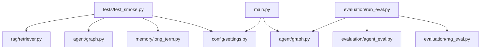
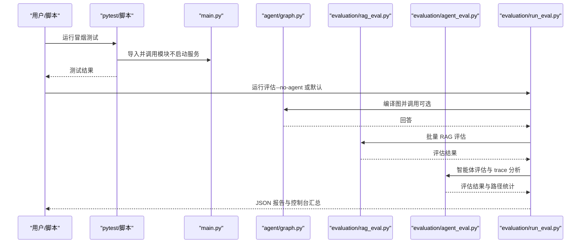
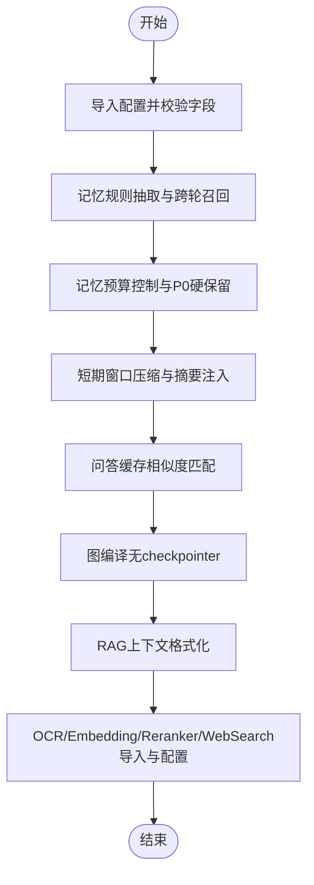
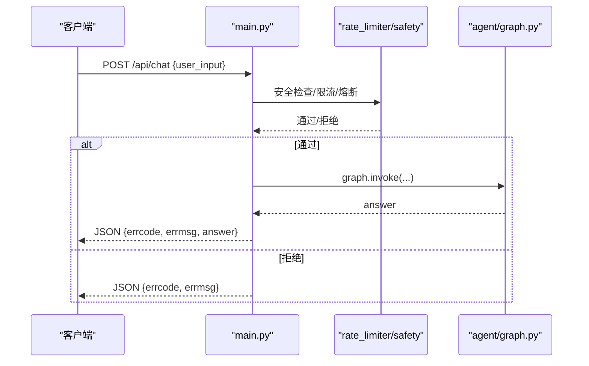
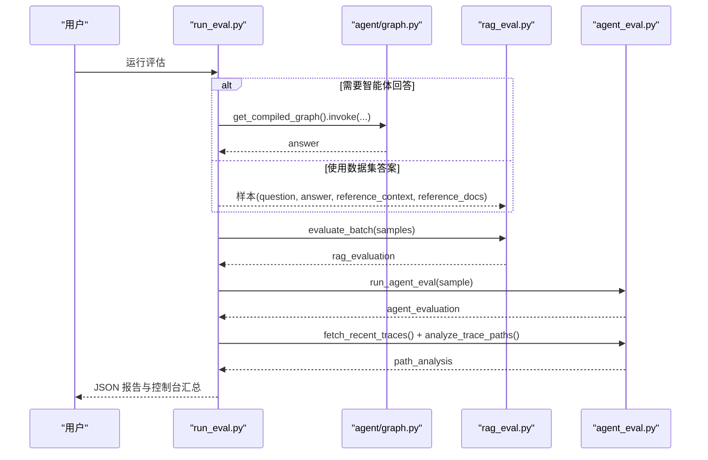
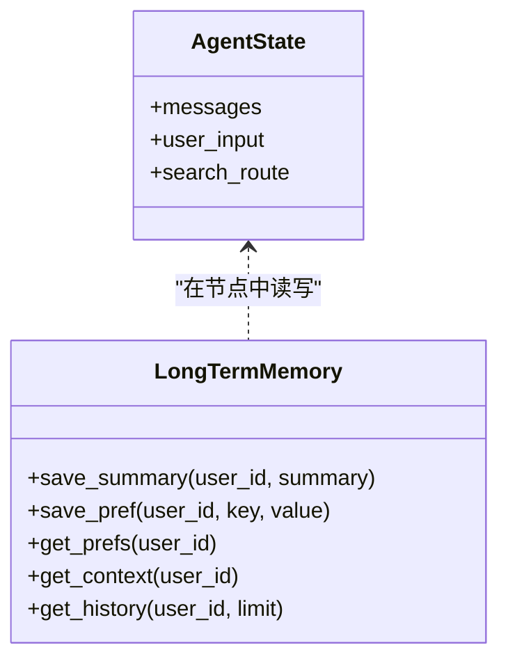
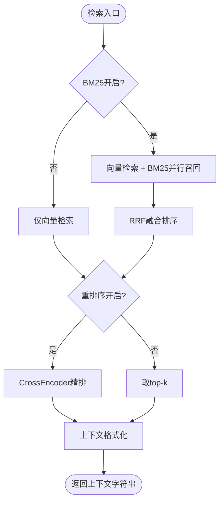
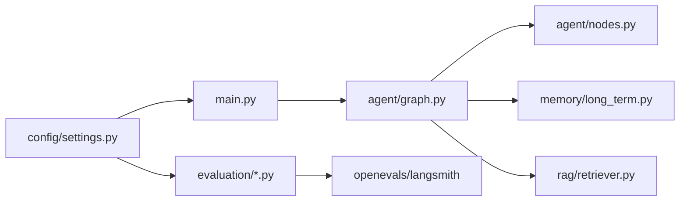

# 测试与评估

<cite>
**本文引用的文件**
- [tests/test_smoke.py](file://tests/test_smoke.py)
- [evaluation/run_eval.py](file://evaluation/run_eval.py)
- [evaluation/rag_eval.py](file://evaluation/rag_eval.py)
- [evaluation/agent_eval.py](file://evaluation/agent_eval.py)
- [main.py](file://main.py)
- [config/settings.py](file://config/settings.py)
- [agent/graph.py](file://agent/graph.py)
- [memory/long_term.py](file://memory/long_term.py)
- [rag/retriever.py](file://rag/retriever.py)
- [requirements.txt](file://requirements.txt)
</cite>

## 目录
1. [简介](#简介)
2. [项目结构](#项目结构)
3. [核心组件](#核心组件)
4. [架构总览](#架构总览)
5. [详细组件分析](#详细组件分析)
6. [依赖关系分析](#依赖关系分析)
7. [性能考量](#性能考量)
8. [故障排查指南](#故障排查指南)
9. [结论](#结论)
10. [附录](#附录)

## 简介
本指南面向开发者与质量保障人员，提供完整的测试与评估实践：包括单元测试编写、集成测试方法、性能评估框架使用、评估指标说明、结果分析与优化建议。目标是确保代码质量与系统性能，覆盖从模块导入到端到端智能体工作流的验证。

## 项目结构
本项目采用分层模块化组织，测试与评估相关的关键位置如下：
- 单元测试与冒烟测试：tests/test_smoke.py
- 评估运行入口与流水线：evaluation/run_eval.py
- RAG 质量评估器：evaluation/rag_eval.py
- 智能体评估器与 LangSmith trace 分析：evaluation/agent_eval.py
- Web 服务入口（含健康检查、流式接口）：main.py
- 全局配置：config/settings.py
- 智能体图与工作流：agent/graph.py
- 长期记忆与缓存：memory/long_term.py
- 检索与上下文格式化：rag/retriever.py
- 依赖清单：requirements.txt

图表来源
- [tests/test_smoke.py:15-189](file://tests/test_smoke.py#L15-L189)
- [evaluation/run_eval.py:23-105](file://evaluation/run_eval.py#L23-L105)
- [evaluation/rag_eval.py:63-121](file://evaluation/rag_eval.py#L63-L121)
- [evaluation/agent_eval.py:33-70](file://evaluation/agent_eval.py#L33-L70)
- [main.py:154-210](file://main.py#L154-L210)
- [config/settings.py:19-161](file://config/settings.py#L19-L161)
- [agent/graph.py:44-102](file://agent/graph.py#L44-L102)
- [memory/long_term.py:172-196](file://memory/long_term.py#L172-L196)
- [rag/retriever.py:18-53](file://rag/retriever.py#L18-L53)

章节来源
- [tests/test_smoke.py:15-189](file://tests/test_smoke.py#L15-L189)
- [evaluation/run_eval.py:23-105](file://evaluation/run_eval.py#L23-L105)
- [main.py:154-210](file://main.py#L154-L210)
- [config/settings.py:19-161](file://config/settings.py#L19-L161)

## 核心组件
- 冒烟测试套件：覆盖配置读取、记忆存取、短期窗口压缩、RAG 上下文格式化、OCR/Embedding/Reranker/WebSearch 模块导入与基础能力校验。
- 评估流水线：加载数据集，可选调用智能体获取回答，执行 RAG 质量评估与智能体评估，拉取 LangSmith trace 做路径合理性分析，输出 JSON 报告与控制台汇总。
- 配置中心：集中管理 LLM、向量库、检索策略、重排序、OCR、联网搜索、记忆、限流熔断、LangSmith 等参数。
- 智能体图：基于 LangGraph 的状态机，支持预检查、四路分流（检索/搜索/记忆/工具）、生成与后台记忆更新。
- 长期记忆：SQLite 持久化，分层结构化存储，预算控制与关键信息硬保留，问答缓存命中复用。
- 检索器：向量检索 + BM25 多路召回（可选）+ RRF 融合 + CrossEncoder 重排序（可选），上下文格式化。

章节来源
- [tests/test_smoke.py:15-189](file://tests/test_smoke.py#L15-L189)
- [evaluation/run_eval.py:23-105](file://evaluation/run_eval.py#L23-L105)
- [config/settings.py:19-161](file://config/settings.py#L19-L161)
- [agent/graph.py:44-102](file://agent/graph.py#L44-L102)
- [memory/long_term.py:172-196](file://memory/long_term.py#L172-L196)
- [rag/retriever.py:18-53](file://rag/retriever.py#L18-L53)

## 架构总览
评估与测试的整体流程如下：
- 单元测试：快速验证各模块可导入与基本功能，确保环境依赖正确。
- 集成测试：通过 Web 接口或 REPL 进行端到端调用，验证安全过滤、限流熔断、流式响应等。
- 评估流水线：按样本批量运行智能体（可选），执行 RAG 质量评估与智能体评估，结合 LangSmith trace 分析推理路径。

图表来源
- [tests/test_smoke.py:15-189](file://tests/test_smoke.py#L15-L189)
- [evaluation/run_eval.py:23-105](file://evaluation/run_eval.py#L23-L105)
- [evaluation/rag_eval.py:63-121](file://evaluation/rag_eval.py#L63-L121)
- [evaluation/agent_eval.py:33-70](file://evaluation/agent_eval.py#L33-L70)
- [main.py:154-210](file://main.py#L154-L210)
- [agent/graph.py:44-102](file://agent/graph.py#L44-L102)

## 详细组件分析

### 单元测试与冒烟测试
- 目标：验证配置读取、记忆存取、短期窗口压缩、RAG 上下文格式化、OCR/Embedding/Reranker/WebSearch 模块导入与基础能力。
- 关键点：
  - 配置模块导入与字段校验，确保必填项存在且合理。
  - 记忆规则抽取、跨轮召回、摘要不冲掉关键信息；预算控制与 P0 硬保留。
  - 短期历史窗口构建与压缩，字符预算下丢弃最旧消息。
  - 问答缓存相似度匹配与阈值过滤，相同问题更新而非重复插入。
  - AgentState 类型定义、图编译无 checkpointer 模式。
  - RAG 上下文格式化函数、OCR/Embedding/Reranker/WebSearch 模块导入与配置项读取。
- 运行方式：
  - pytest：python -m pytest tests/test_smoke.py -v
  - 直接执行：python tests/test_smoke.py

图表来源
- [tests/test_smoke.py:15-189](file://tests/test_smoke.py#L15-L189)

章节来源
- [tests/test_smoke.py:15-189](file://tests/test_smoke.py#L15-L189)

### 集成测试方法
- Web 接口：
  - 聊天接口：POST /api/chat，输入安全过滤、限流、熔断、异常处理。
  - 流式接口：POST /api/chat/stream，SSE 事件类型 status/token/error/done，整体超时保护。
  - 健康检查：GET /health，返回服务状态与 checkpointer 类型。
- 本地 REPL：
  - python main.py --repl，交互式测试智能体，流式输出。
- 建议用例：
  - 空输入校验、非法输入拦截、限流触发、熔断触发、流式超时场景、正常问答链路。

图表来源
- [main.py:154-210](file://main.py#L154-L210)
- [agent/graph.py:44-102](file://agent/graph.py#L44-L102)

章节来源
- [main.py:154-210](file://main.py#L154-L210)

### 性能评估框架使用
- 评估入口：evaluation/run_eval.py
  - 加载数据集，可选调用智能体获取回答，执行 RAG 质量评估与智能体评估，拉取 LangSmith trace 做路径合理性分析，输出 JSON 报告与控制台汇总。
  - 命令行选项：--no-agent（跳过智能体调用，使用数据集自带答案），--output/-o（输出 JSON 报告路径）。
- RAG 质量评估：evaluation/rag_eval.py
  - 维度：检索相关性、忠实度（groundedness）、帮助度、答案相关性。
  - 使用 OpenEvals 的 create_llm_as_judge 与预置 prompt，批量评估。
- 智能体评估：evaluation/agent_eval.py
  - 维度：正确性、幻觉检测、推理路径合理性（plan_adherence）。
  - 结合 LangSmith 客户端拉取最近 trace，统计成功率与失败数。

图表来源
- [evaluation/run_eval.py:23-105](file://evaluation/run_eval.py#L23-L105)
- [evaluation/rag_eval.py:63-121](file://evaluation/rag_eval.py#L63-L121)
- [evaluation/agent_eval.py:33-70](file://evaluation/agent_eval.py#L33-L70)
- [agent/graph.py:44-102](file://agent/graph.py#L44-L102)

章节来源
- [evaluation/run_eval.py:23-105](file://evaluation/run_eval.py#L23-L105)
- [evaluation/rag_eval.py:63-121](file://evaluation/rag_eval.py#L63-L121)
- [evaluation/agent_eval.py:33-70](file://evaluation/agent_eval.py#L33-L70)

### 数据模型与状态
- 智能体状态：AgentState 包含 messages、user_input、search_route 等字段，用于状态图流转。
- 长期记忆：SQLite 表 user_profile、user_facts、summary_history、session_summary、qa_memory 等，支持迁移与索引。

图表来源
- [agent/graph.py:44-102](file://agent/graph.py#L44-L102)
- [memory/long_term.py:172-196](file://memory/long_term.py#L172-L196)

章节来源
- [agent/graph.py:44-102](file://agent/graph.py#L44-L102)
- [memory/long_term.py:172-196](file://memory/long_term.py#L172-L196)

### 复杂逻辑组件：检索与上下文格式化
- 检索流程：
  - 多路召回（BM25 开启时向量检索 + BM25 并行，RRF 融合）。
  - 重排序（CrossEncoder 精排，可选）。
  - 上下文格式化（统一归一化分数，标注来源与标题）。
- 复杂度：
  - RRF 融合时间复杂度 O(N log N)，N 为候选文档数。
  - 重排序对候选集进行打分，时间复杂度 O(M)，M 为候选数。

图表来源
- [rag/retriever.py:18-53](file://rag/retriever.py#L18-L53)
- [rag/retriever.py:55-110](file://rag/retriever.py#L55-L110)
- [rag/retriever.py:113-140](file://rag/retriever.py#L113-L140)

章节来源
- [rag/retriever.py:18-53](file://rag/retriever.py#L18-L53)
- [rag/retriever.py:55-110](file://rag/retriever.py#L55-L110)
- [rag/retriever.py:113-140](file://rag/retriever.py#L113-L140)

## 依赖关系分析
- 外部依赖：
  - LangChain/LangGraph：工作流与状态图。
  - OpenAI兼容接口：LLM 调用与评判模型。
  - Milvus Lite：本地向量库持久化。
  - HuggingFace/Transformers：Embedding 与重排序模型。
  - FastAPI/Uvicorn：Web 服务。
  - Pydantic/Pydantic-settings：配置管理。
  - LangSmith/OpenEvals：评估与追踪。
- 内部依赖：
  - 配置中心被各模块引用，确保一致性与可维护性。
  - 智能体图依赖节点实现（检索、搜索、记忆、工具、生成）。
  - 评估模块依赖智能体图与配置中心。

图表来源
- [config/settings.py:19-161](file://config/settings.py#L19-L161)
- [main.py:154-210](file://main.py#L154-L210)
- [agent/graph.py:44-102](file://agent/graph.py#L44-L102)
- [evaluation/run_eval.py:23-105](file://evaluation/run_eval.py#L23-L105)

章节来源
- [requirements.txt:1-53](file://requirements.txt#L1-L53)
- [config/settings.py:19-161](file://config/settings.py#L19-L161)

## 性能考量
- 首请求延迟优化：
  - 启动时预热 LLM 连接（TLS握手、DNS解析、连接池建立），显著降低首次请求延迟。
  - 向量库为空时自动全量重建，避免首请求阻塞。
  - BM25 索引预热，避免首请求构建索引。
- 流式接口保护：
  - 整体超时保护，超时后返回已生成的 token，防止连接卡死。
- 检索优化：
  - 多路召回与 RRF 融合提升召回率。
  - 重排序精排提升相关性。
- 记忆预算控制：
  - 长期记忆上下文预算限制，P0 关键信息硬保留，避免上下文过长导致性能下降。

章节来源
- [main.py:45-135](file://main.py#L45-L135)
- [rag/retriever.py:18-53](file://rag/retriever.py#L18-L53)
- [memory/long_term.py:172-196](file://memory/long_term.py#L172-L196)

## 故障排查指南
- 配置缺失：
  - 检查 config/settings.py 中的必填项是否配置，如 llm_model、embedding_model、ocr_min_text_length 等。
- 模块导入失败：
  - 确认 requirements.txt 依赖已安装，环境变量（如 HF_ENDPOINT）设置正确。
- 评估失败：
  - 检查 LLM 配置（llm_api_key、llm_base_url、llm_judge_model）。
  - 检查 LangSmith 配置（langsmith_api_key、langsmith_project）。
- 检索异常：
  - 检查向量库状态与索引，必要时重建。
  - 调整检索参数（rag_top_k、rag_score_filter、rerank_top_k）。
- 流式超时：
  - 调整 stream_timeout，检查网络与服务端负载。

章节来源
- [config/settings.py:19-161](file://config/settings.py#L19-L161)
- [evaluation/run_eval.py:23-105](file://evaluation/run_eval.py#L23-L105)
- [main.py:228-314](file://main.py#L228-L314)

## 结论
通过系统的单元测试、集成测试与评估流水线，可以全面验证钉钉AI智能体助手的代码质量与系统性能。建议在日常开发中持续运行冒烟测试与评估脚本，结合 LangSmith trace 分析优化推理路径，利用配置中心灵活调整检索与生成策略，确保系统在真实场景下的稳定性与准确性。

## 附录
- 常用命令：
  - 运行冒烟测试：python -m pytest tests/test_smoke.py -v
  - 运行评估（带智能体）：python -m evaluation.run_eval
  - 运行评估（不带智能体）：python -m evaluation.run_eval --no-agent
  - 输出报告：python -m evaluation.run_eval --output report.json
  - 启动 Web 服务：uvicorn main:app --host 0.0.0.0 --port 8000 --reload
  - 本地 REPL：python main.py --repl

章节来源
- [tests/test_smoke.py:1-5](file://tests/test_smoke.py#L1-L5)
- [evaluation/run_eval.py:10-14](file://evaluation/run_eval.py#L10-L14)
- [main.py:364-382](file://main.py#L364-L382)