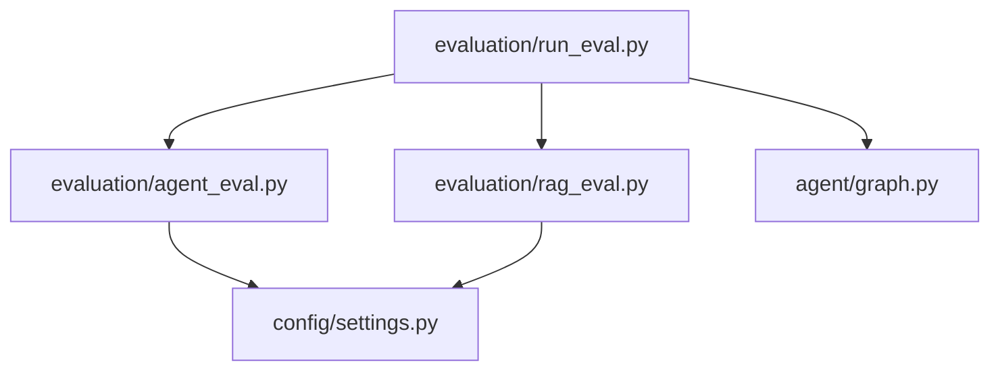
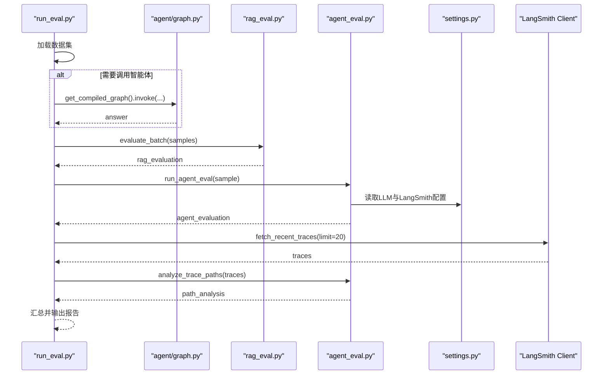
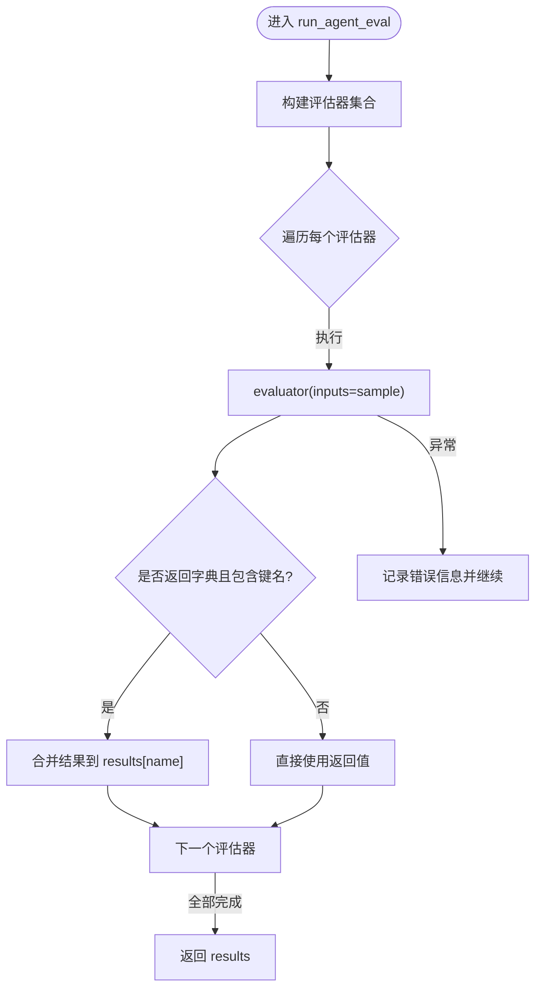
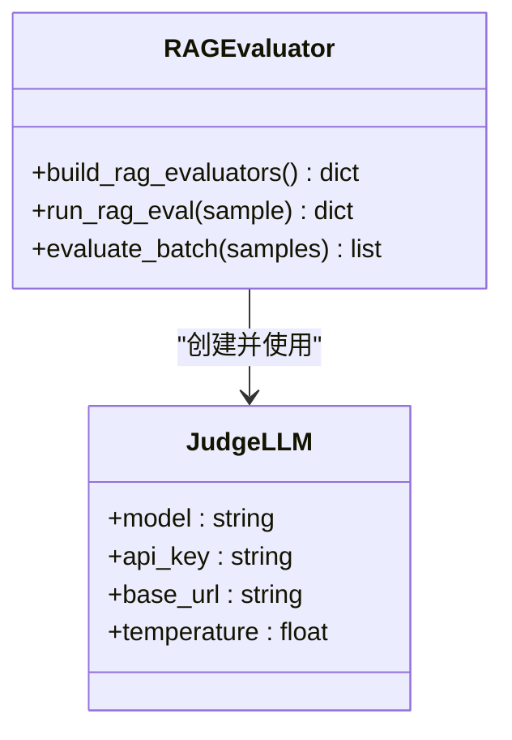
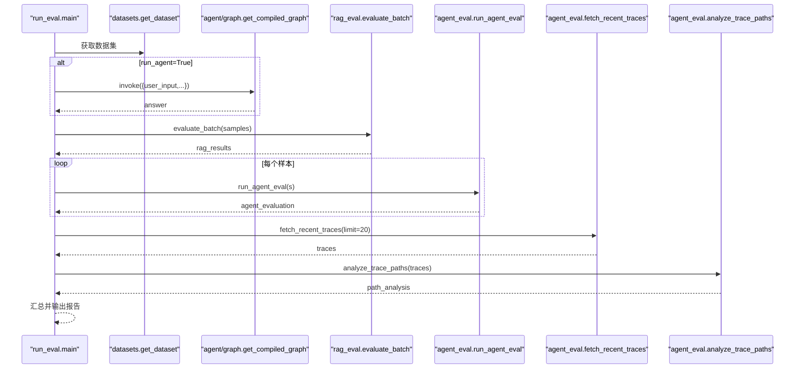
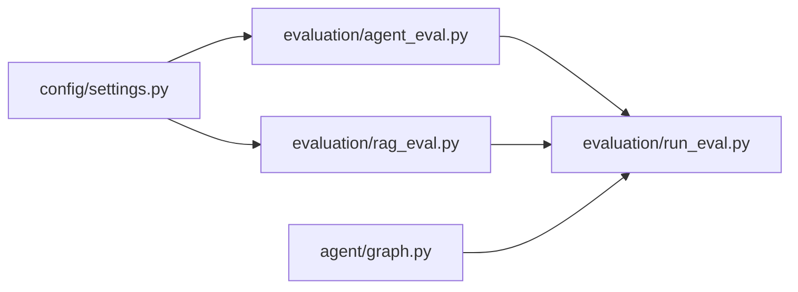

# Agent评估器

<cite>
**本文引用的文件**
- [evaluation/agent_eval.py](file://evaluation/agent_eval.py)
- [evaluation/run_eval.py](file://evaluation/run_eval.py)
- [evaluation/rag_eval.py](file://evaluation/rag_eval.py)
- [config/settings.py](file://config/settings.py)
- [agent/graph.py](file://agent/graph.py)
</cite>

## 目录
1. [简介](#简介)
2. [项目结构](#项目结构)
3. [核心组件](#核心组件)
4. [架构总览](#架构总览)
5. [详细组件分析](#详细组件分析)
6. [依赖关系分析](#依赖关系分析)
7. [性能考量](#性能考量)
8. [故障排查指南](#故障排查指南)
9. [结论](#结论)
10. [附录：使用示例与最佳实践](#附录使用示例与最佳实践)

## 简介
本文件面向“智能体回答质量评估”的实现，围绕三个关键维度展开：正确性（correctness）、幻觉检测（hallucination）、推理路径合理性（plan_adherence）。文档说明 OpenEvals 框架的集成方式、评判 LLM 的配置方法、评估数据集格式要求；并给出评估器的构建过程、单个样本评估执行、LangSmith 客户端集成与 trace 分析功能。最后提供完整的代码级调用路径与最佳实践指导，帮助读者快速搭建并运行端到端的评估流程。

## 项目结构
评估相关代码集中在 evaluation 目录下，配合配置模块 config/settings.py 与智能体图 agent/graph.py，形成“数据→智能体→评估→报告”的闭环。

图表来源
- [evaluation/run_eval.py:23-105](file://evaluation/run_eval.py#L23-L105)
- [evaluation/rag_eval.py:63-120](file://evaluation/rag_eval.py#L63-L120)
- [evaluation/agent_eval.py:33-70](file://evaluation/agent_eval.py#L33-L70)
- [config/settings.py:19-161](file://config/settings.py#L19-L161)
- [agent/graph.py:44-114](file://agent/graph.py#L44-L114)

章节来源
- [evaluation/run_eval.py:23-105](file://evaluation/run_eval.py#L23-L105)
- [evaluation/rag_eval.py:63-120](file://evaluation/rag_eval.py#L63-L120)
- [evaluation/agent_eval.py:33-70](file://evaluation/agent_eval.py#L33-L70)
- [config/settings.py:19-161](file://config/settings.py#L19-L161)
- [agent/graph.py:44-114](file://agent/graph.py#L44-L114)

## 核心组件
- 智能体评估器集合：基于 OpenEvals 的 create_llm_as_judge，封装 correctness、hallucination、plan_adherence 三个评估器。
- RAG 质量评估器集合：基于 OpenEvals 预置 prompt，覆盖检索相关性、忠实度、帮助度、答案相关性。
- 评估运行入口：加载数据集、可选调用智能体获取回答、批量执行 RAG 与智能体评估、拉取 LangSmith trace 做路径合理性分析、输出汇总报告。
- 配置管理：集中管理 LLM、LangSmith 等参数，支持环境变量与 .env 文件。
- 智能体图：LangGraph 状态图，提供 get_compiled_graph 用于评估时调用智能体生成回答。

章节来源
- [evaluation/agent_eval.py:33-70](file://evaluation/agent_eval.py#L33-L70)
- [evaluation/rag_eval.py:63-120](file://evaluation/rag_eval.py#L63-L120)
- [evaluation/run_eval.py:23-105](file://evaluation/run_eval.py#L23-L105)
- [config/settings.py:19-161](file://config/settings.py#L19-L161)
- [agent/graph.py:44-114](file://agent/graph.py#L44-L114)

## 架构总览
评估流程从 run_evaluation 开始，依次完成：
1) 加载评估数据集（由外部 datasets 模块提供）
2) 可选调用智能体图生成回答
3) 执行 RAG 质量评估
4) 执行智能体评估（correctness、hallucination、plan_adherence）
5) 拉取 LangSmith trace 并分析路径合理性
6) 汇总评分并输出 JSON 报告与控制台表格

图表来源
- [evaluation/run_eval.py:23-105](file://evaluation/run_eval.py#L23-L105)
- [evaluation/rag_eval.py:113-120](file://evaluation/rag_eval.py#L113-L120)
- [evaluation/agent_eval.py:57-70](file://evaluation/agent_eval.py#L57-L70)
- [evaluation/agent_eval.py:73-138](file://evaluation/agent_eval.py#L73-L138)
- [config/settings.py:157-161](file://config/settings.py#L157-L161)
- [agent/graph.py:109-114](file://agent/graph.py#L109-L114)

## 详细组件分析

### 智能体评估器（agent_eval.py）
- 构建评估器集合：通过 create_llm_as_judge 绑定对应 prompt 与输入字段映射，分别实现 correctness、hallucination、plan_adherence。
- 单样本评估：遍历评估器执行，捕获异常并返回统一结构 {score, reasoning, error}。
- LangSmith 集成：
  - get_langsmith_client：根据 settings 中的 langsmith_api_key 初始化客户端，未配置或失败时返回 None。
  - fetch_recent_traces：按 project_name 拉取最近根运行，提取 run_id、name、status、inputs、outputs、error。
  - analyze_trace_paths：统计 total/succeeded/failed/success_rate，作为 plan_adherence 的辅助指标。

图表来源
- [evaluation/agent_eval.py:57-70](file://evaluation/agent_eval.py#L57-L70)

章节来源
- [evaluation/agent_eval.py:33-70](file://evaluation/agent_eval.py#L33-L70)
- [evaluation/agent_eval.py:73-138](file://evaluation/agent_eval.py#L73-L138)

### RAG 质量评估器（rag_eval.py）
- 构建评估器集合：基于 OpenEvals 预置 prompt，分别评估 retrieval_relevance、groundedness、helpfulness、answer_relevance。
- 单样本评估：对每个评估器执行，捕获异常并返回统一结构。
- 批量评估：遍历样本，附加 evaluation 字段后返回。

图表来源
- [evaluation/rag_eval.py:24-44](file://evaluation/rag_eval.py#L24-L44)
- [evaluation/rag_eval.py:63-120](file://evaluation/rag_eval.py#L63-L120)

章节来源
- [evaluation/rag_eval.py:63-120](file://evaluation/rag_eval.py#L63-L120)

### 评估运行入口（run_eval.py）
- 流程编排：加载数据集 → 可选调用智能体图 → RAG 评估 → 智能体评估 → LangSmith trace 分析 → 汇总输出。
- 智能体调用：通过 get_compiled_graph().invoke 传入 user_input、user_id、session_id，得到 answer。
- 报告汇总：计算各维度平均分，打印控制台表格，可选保存 JSON 报告。

图表来源
- [evaluation/run_eval.py:23-105](file://evaluation/run_eval.py#L23-L105)
- [agent/graph.py:109-114](file://agent/graph.py#L109-L114)

章节来源
- [evaluation/run_eval.py:23-105](file://evaluation/run_eval.py#L23-L105)

### 配置管理（settings.py）
- LLM 配置：llm_model、llm_base_url、llm_api_key、llm_judge_model、llm_temperature 等。
- LangSmith 配置：langsmith_api_key、langsmith_project、langsmith_endpoint、langsmith_tracing。
- 其他：RAG、向量库、记忆、OCR、联网搜索、限流熔断等。

章节来源
- [config/settings.py:19-161](file://config/settings.py#L19-L161)

## 依赖关系分析
- agent_eval.py 依赖 openevals.llm.create_llm_as_judge 与 openevals.prompts 中的三个提示模板，并通过 config.settings 获取 LLM 与 LangSmith 配置。
- rag_eval.py 依赖 openevals.prompts 中的四个 RAG 提示模板，同样通过 config.settings 获取评判模型。
- run_eval.py 依赖 agent.graph.get_compiled_graph 以调用智能体，依赖 evaluation.rag_eval 与 evaluation.agent_eval 完成评估。
- 所有模块共享 config.settings 提供的统一配置源。

图表来源
- [evaluation/agent_eval.py:14-30](file://evaluation/agent_eval.py#L14-L30)
- [evaluation/rag_eval.py:15-44](file://evaluation/rag_eval.py#L15-L44)
- [evaluation/run_eval.py:23-105](file://evaluation/run_eval.py#L23-L105)
- [agent/graph.py:109-114](file://agent/graph.py#L109-L114)
- [config/settings.py:19-161](file://config/settings.py#L19-L161)

章节来源
- [evaluation/agent_eval.py:14-30](file://evaluation/agent_eval.py#L14-L30)
- [evaluation/rag_eval.py:15-44](file://evaluation/rag_eval.py#L15-L44)
- [evaluation/run_eval.py:23-105](file://evaluation/run_eval.py#L23-L105)
- [agent/graph.py:109-114](file://agent/graph.py#L109-L114)
- [config/settings.py:19-161](file://config/settings.py#L19-L161)

## 性能考量
- 评判 LLM 温度设为 0.0，保证评估稳定性与可重复性。
- 批量评估时逐条处理，避免一次性大请求导致超时或内存压力。
- LangSmith trace 拉取限制数量（默认 20），控制网络与解析开销。
- 异常捕获确保单个评估器失败不影响整体流程。

[本节为通用性能建议，不直接分析具体文件]

## 故障排查指南
- 未配置 LangSmith API Key：get_langsmith_client 会打印提示并返回 None，trace 分析将跳过。
- 评估失败：run_agent_eval 与 run_rag_eval 在异常分支中记录 error 标志与原因，便于定位问题。
- 智能体调用失败：run_eval 中捕获异常并将 answer 标记为失败信息，避免中断后续评估。
- 配置缺失：settings 中 llm_* 与 langsmith_* 必须正确设置，否则评估器无法正常工作。

章节来源
- [evaluation/agent_eval.py:73-93](file://evaluation/agent_eval.py#L73-L93)
- [evaluation/agent_eval.py:57-70](file://evaluation/agent_eval.py#L57-L70)
- [evaluation/run_eval.py:38-62](file://evaluation/run_eval.py#L38-L62)
- [config/settings.py:157-161](file://config/settings.py#L157-L161)

## 结论
该评估体系通过 OpenEvals 的 LLM-as-a-Judge 模式，结合 RAG 与智能体评估维度，辅以 LangSmith trace 分析，形成了从数据到报告的完整评估链路。通过统一的配置管理与健壮的错误处理，能够在不同环境下稳定运行，并提供可解释的评分与推理依据。

[本节为总结性内容，不直接分析具体文件]

## 附录：使用示例与最佳实践

### 评估数据集格式要求
- 每个样本需包含以下字段：
  - question：用户问题
  - expected_answer：期望答案（用于 correctness）
  - reference_context：参考上下文（用于 hallucination 与 groundedness）
  - reference_docs：参考文档列表（用于 retrieval_relevance）
- 若跳过智能体调用（--no-agent），则 answer 字段可直接使用 expected_answer。

章节来源
- [evaluation/run_eval.py:56-72](file://evaluation/run_eval.py#L56-L72)
- [evaluation/rag_eval.py:89-110](file://evaluation/rag_eval.py#L89-L110)

### 评判 LLM 配置方法
- 在 settings 中配置 llm_judge_model、llm_api_key、llm_base_url。
- 评估器内部通过 _judge_llm 创建 ChatOpenAI 实例，temperature 固定为 0.0。

章节来源
- [evaluation/agent_eval.py:18-30](file://evaluation/agent_eval.py#L18-L30)
- [evaluation/rag_eval.py:32-44](file://evaluation/rag_eval.py#L32-L44)
- [config/settings.py:29-48](file://config/settings.py#L29-L48)

### OpenEvals 框架集成方式
- 使用 create_llm_as_judge 绑定 prompt 与输入字段映射，生成评估器。
- 智能体评估使用 CORRECTNESS_PROMPT、HALLUCINATION_PROMPT、PLAN_ADHERENCE_PROMPT。
- RAG 评估使用 RAG_RETRIEVAL_RELEVANCE_PROMPT、RAG_GROUNDEDNESS_PROMPT、RAG_HELPFULNESS_PROMPT、ANSWER_RELEVANCE_PROMPT。

章节来源
- [evaluation/agent_eval.py:14-54](file://evaluation/agent_eval.py#L14-L54)
- [evaluation/rag_eval.py:15-86](file://evaluation/rag_eval.py#L15-L86)

### 评估器构建过程
- build_agent_evaluators：返回 correctness、hallucination、plan_adherence 三个评估器。
- build_rag_evaluators：返回 retrieval_relevance、groundedness、helpfulness、answer_relevance 四个评估器。

章节来源
- [evaluation/agent_eval.py:33-54](file://evaluation/agent_eval.py#L33-L54)
- [evaluation/rag_eval.py:63-86](file://evaluation/rag_eval.py#L63-L86)

### 单个样本评估执行
- run_agent_eval：遍历评估器执行，捕获异常并返回统一结构。
- run_rag_eval：同上，针对 RAG 维度。

章节来源
- [evaluation/agent_eval.py:57-70](file://evaluation/agent_eval.py#L57-L70)
- [evaluation/rag_eval.py:89-110](file://evaluation/rag_eval.py#L89-L110)

### LangSmith 客户端集成与 trace 分析
- get_langsmith_client：根据 langsmith_api_key 初始化客户端。
- fetch_recent_traces：按 project_name 拉取最近根运行，提取必要字段。
- analyze_trace_paths：统计成功率，作为 plan_adherence 的辅助指标。

章节来源
- [evaluation/agent_eval.py:73-138](file://evaluation/agent_eval.py#L73-L138)
- [config/settings.py:157-161](file://config/settings.py#L157-L161)

### 完整调用路径示例（无代码片段）
- 运行评估：python -m evaluation.run_eval --output report.json
- 仅评估（不调用智能体）：python -m evaluation.run_eval --no-agent --output report.json
- 评估流程内部调用链：
  - run_evaluation → get_dataset → graph.invoke（可选）→ evaluate_batch → run_agent_eval → fetch_recent_traces → analyze_trace_paths → 汇总输出

章节来源
- [evaluation/run_eval.py:146-155](file://evaluation/run_eval.py#L146-L155)
- [evaluation/run_eval.py:23-105](file://evaluation/run_eval.py#L23-L105)

### 最佳实践
- 始终为评估器配置稳定的评判 LLM（temperature=0.0）。
- 合理设置 LangSmith project_name 与 limit，避免过多 trace 拉取造成延迟。
- 在评估前验证数据集字段完整性，确保 question、expected_answer、reference_context、reference_docs 存在。
- 遇到评估失败时优先检查 LLM 配置与网络连接，再查看异常日志中的 reason。

[本节为通用实践建议，不直接分析具体文件]