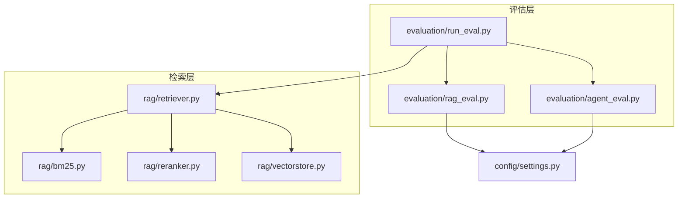
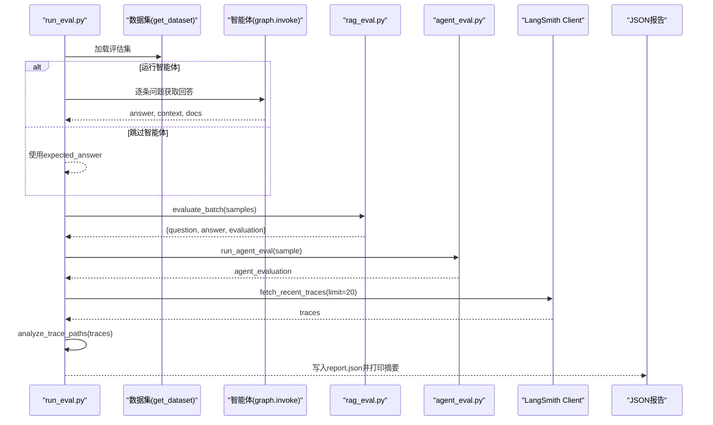
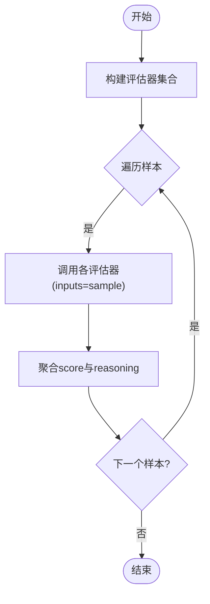
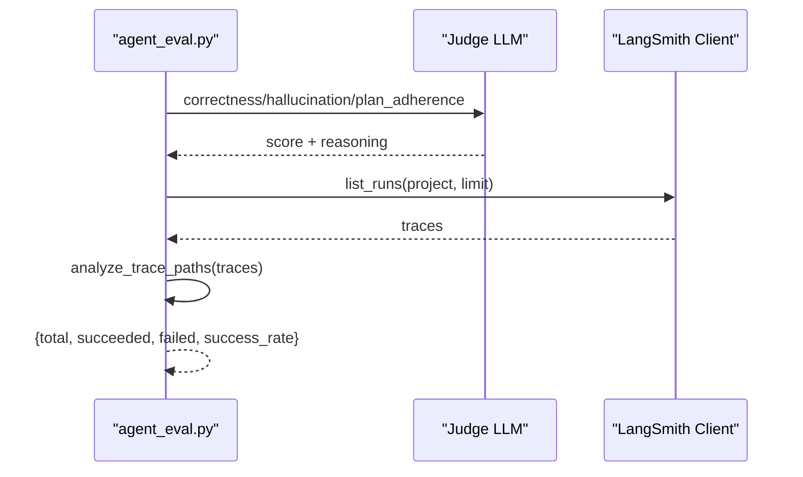
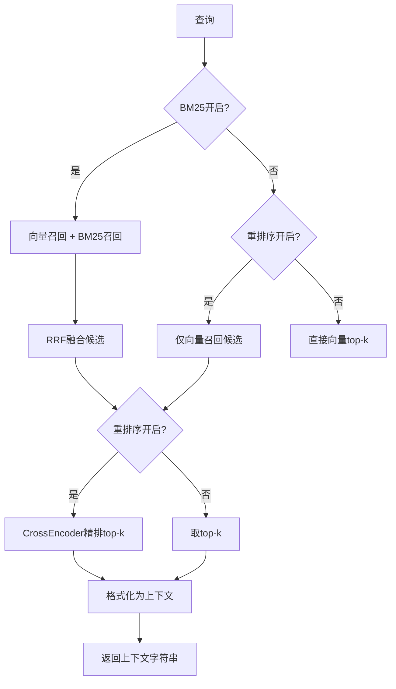
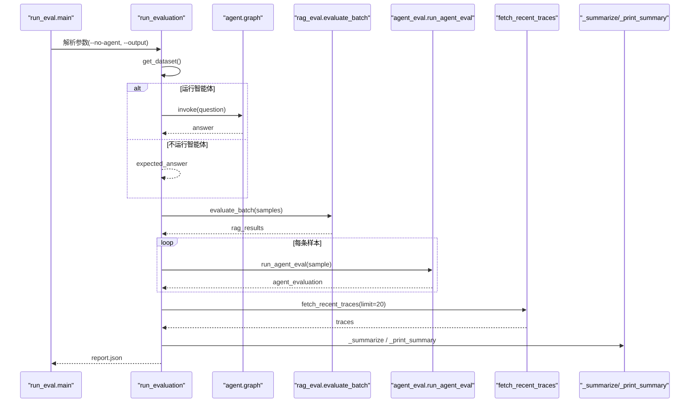
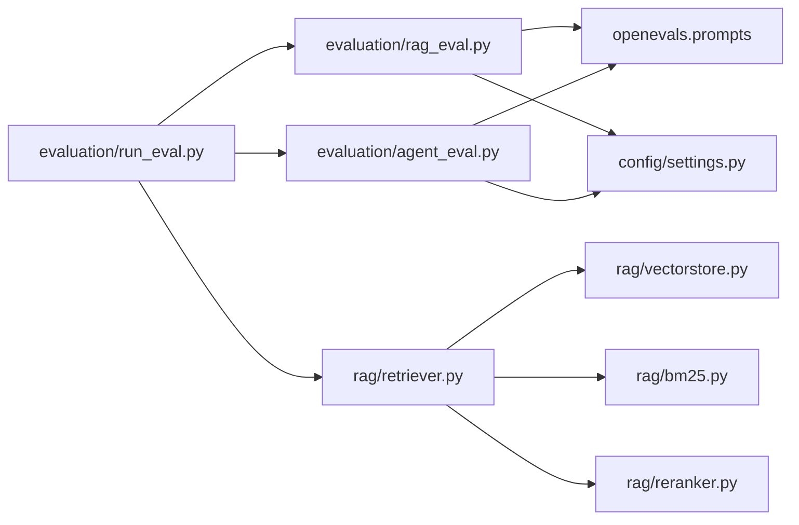

# RAG评估器

<cite>
**本文引用的文件**
- [evaluation/rag_eval.py](file://evaluation/rag_eval.py)
- [evaluation/agent_eval.py](file://evaluation/agent_eval.py)
- [evaluation/run_eval.py](file://evaluation/run_eval.py)
- [rag/retriever.py](file://rag/retriever.py)
- [rag/bm25.py](file://rag/bm25.py)
- [rag/reranker.py](file://rag/reranker.py)
- [rag/vectorstore.py](file://rag/vectorstore.py)
- [config/settings.py](file://config/settings.py)
</cite>

## 目录
1. [简介](#简介)
2. [项目结构](#项目结构)
3. [核心组件](#核心组件)
4. [架构总览](#架构总览)
5. [详细组件分析](#详细组件分析)
6. [依赖关系分析](#依赖关系分析)
7. [性能考量](#性能考量)
8. [故障排查指南](#故障排查指南)
9. [结论](#结论)
10. [附录](#附录)

## 简介
本RAG评估器面向检索增强生成系统，提供端到端的评估能力：覆盖检索准确率、重排序效果、上下文相关性、答案忠实度与帮助度等关键指标。通过OpenEvals的LLM-as-Judge机制，结合LangSmith trace路径分析，形成“检索质量 + 生成质量”的综合评测体系。支持批量评估执行、结果汇总与JSON报告输出，便于持续集成与回归测试。

## 项目结构
评估相关代码集中在 evaluation 目录，并与 rag（检索与重排序）、config（全局配置）紧密协作。运行入口为 run_eval.py，负责加载数据集、调用智能体获取回答、执行RAG与Agent评估、拉取LangSmith trace并输出报告。

图表来源
- [evaluation/run_eval.py:23-105](file://evaluation/run_eval.py#L23-L105)
- [evaluation/rag_eval.py:63-120](file://evaluation/rag_eval.py#L63-L120)
- [evaluation/agent_eval.py:33-70](file://evaluation/agent_eval.py#L33-L70)
- [rag/retriever.py:18-52](file://rag/retriever.py#L18-L52)
- [rag/bm25.py:22-97](file://rag/bm25.py#L22-L97)
- [rag/reranker.py:30-98](file://rag/reranker.py#L30-L98)
- [rag/vectorstore.py:164-184](file://rag/vectorstore.py#L164-L184)
- [config/settings.py:83-100](file://config/settings.py#L83-L100)

章节来源
- [evaluation/run_eval.py:23-105](file://evaluation/run_eval.py#L23-L105)
- [config/settings.py:83-100](file://config/settings.py#L83-L100)

## 核心组件
- RAG评估器：基于OpenEvals构建四个维度评估器（检索相关性、忠实度、帮助度、答案相关性），对单个样本或批量样本进行评分与推理说明输出。
- Agent评估器：评估正确性、幻觉检测、计划遵循度；可拉取LangSmith trace进行路径合理性统计。
- 检索与重排序：向量检索（Milvus Lite）+ 可选BM25关键词召回 + RRF融合 + CrossEncoder重排序，最终格式化上下文字符串供生成使用。
- 配置中心：集中管理LLM、Embedding、向量库、BM25、重排序、LangSmith等参数。

章节来源
- [evaluation/rag_eval.py:63-120](file://evaluation/rag_eval.py#L63-L120)
- [evaluation/agent_eval.py:33-70](file://evaluation/agent_eval.py#L33-L70)
- [rag/retriever.py:18-52](file://rag/retriever.py#L18-L52)
- [config/settings.py:83-100](file://config/settings.py#L83-L100)

## 架构总览
评估流程从CLI入口开始，依次完成数据加载、智能体回答获取（可选）、RAG与Agent评估、LangSmith trace分析与报告输出。检索链路在评估过程中作为上下文来源被复用，确保评估与生产一致。

图表来源
- [evaluation/run_eval.py:23-105](file://evaluation/run_eval.py#L23-L105)
- [evaluation/rag_eval.py:89-120](file://evaluation/rag_eval.py#L89-L120)
- [evaluation/agent_eval.py:96-138](file://evaluation/agent_eval.py#L96-L138)

## 详细组件分析

### RAG评估器（检索相关性、忠实度、帮助度、答案相关性）
- 构建四个评估器，分别映射输入字段到OpenEvals预置Prompt，统一通过create_llm_as_judge封装。
- 单样本评估函数对每个评估器调用并聚合结果，异常时记录错误信息。
- 批量评估按顺序处理，附带进度提示，返回包含原始样本与评估结果的列表。

图表来源
- [evaluation/rag_eval.py:63-120](file://evaluation/rag_eval.py#L63-L120)

章节来源
- [evaluation/rag_eval.py:63-120](file://evaluation/rag_eval.py#L63-L120)

### Agent评估器（正确性、幻觉、计划遵循）与LangSmith路径分析
- 构建三个评估器，分别评估回答正确性、是否幻觉、是否遵循预期计划。
- 支持拉取LangSmith最近trace，统计成功/失败数量与成功率，用于路径合理性分析。

图表来源
- [evaluation/agent_eval.py:33-70](file://evaluation/agent_eval.py#L33-L70)
- [evaluation/agent_eval.py:96-138](file://evaluation/agent_eval.py#L96-L138)

章节来源
- [evaluation/agent_eval.py:33-70](file://evaluation/agent_eval.py#L33-L70)
- [evaluation/agent_eval.py:96-138](file://evaluation/agent_eval.py#L96-L138)

### 检索与重排序（向量检索、BM25、RRF融合、CrossEncoder重排）
- 两阶段检索：先多路召回（向量+BM25，RRF融合），再CrossEncoder精排；若关闭BM25或重排序则回退相应策略。
- 上下文格式化将不同来源分数归一化展示，便于人类阅读与调试。

图表来源
- [rag/retriever.py:18-52](file://rag/retriever.py#L18-L52)
- [rag/retriever.py:55-110](file://rag/retriever.py#L55-L110)
- [rag/retriever.py:113-139](file://rag/retriever.py#L113-L139)
- [rag/bm25.py:22-97](file://rag/bm25.py#L22-L97)
- [rag/reranker.py:30-98](file://rag/reranker.py#L30-L98)
- [rag/vectorstore.py:164-184](file://rag/vectorstore.py#L164-L184)

章节来源
- [rag/retriever.py:18-52](file://rag/retriever.py#L18-L52)
- [rag/bm25.py:22-97](file://rag/bm25.py#L22-L97)
- [rag/reranker.py:30-98](file://rag/reranker.py#L30-L98)
- [rag/vectorstore.py:164-184](file://rag/vectorstore.py#L164-L184)

### 评估运行入口（批量评估、报告输出）
- 支持两种模式：运行智能体获取回答或使用数据集自带期望答案。
- 执行RAG与Agent评估后，拉取LangSmith trace进行路径分析，汇总各维度平均分并输出JSON报告与控制台表格。

图表来源
- [evaluation/run_eval.py:23-105](file://evaluation/run_eval.py#L23-L105)
- [evaluation/run_eval.py:108-143](file://evaluation/run_eval.py#L108-L143)
- [evaluation/run_eval.py:146-155](file://evaluation/run_eval.py#L146-L155)

章节来源
- [evaluation/run_eval.py:23-105](file://evaluation/run_eval.py#L23-L105)
- [evaluation/run_eval.py:108-143](file://evaluation/run_eval.py#L108-L143)
- [evaluation/run_eval.py:146-155](file://evaluation/run_eval.py#L146-L155)

### 配置项与开关（影响评估与检索行为）
- LLM与评判模型：llm_model、llm_judge_model、llm_base_url、llm_api_key等。
- 向量库：milvus_collection、milvus_db_file、索引类型与度量类型、检索阈值与top-k。
- BM25与RRF：开关、候选数、融合常数k。
- 重排序：开关、模型、设备、候选数与top-k。
- LangSmith：API Key、项目名、端点、追踪开关。

章节来源
- [config/settings.py:29-48](file://config/settings.py#L29-L48)
- [config/settings.py:54-75](file://config/settings.py#L54-L75)
- [config/settings.py:83-100](file://config/settings.py#L83-L100)
- [config/settings.py:157-161](file://config/settings.py#L157-L161)

## 依赖关系分析
- evaluation模块依赖OpenEvals与LangChain OpenAI客户端，用于LLM-as-Judge评估。
- retrieval模块依赖Milvus Lite、rank_bm25、sentence_transformers（CrossEncoder）。
- 配置模块集中管理所有子系统参数，被评估与检索模块共同读取。

图表来源
- [evaluation/rag_eval.py:15-21](file://evaluation/rag_eval.py#L15-L21)
- [evaluation/agent_eval.py:14-15](file://evaluation/agent_eval.py#L14-L15)
- [rag/retriever.py:15-16](file://rag/retriever.py#L15-L16)
- [rag/bm25.py:57-64](file://rag/bm25.py#L57-L64)
- [rag/reranker.py:39-49](file://rag/reranker.py#L39-L49)
- [config/settings.py:29-48](file://config/settings.py#L29-L48)

章节来源
- [evaluation/rag_eval.py:15-21](file://evaluation/rag_eval.py#L15-L21)
- [evaluation/agent_eval.py:14-15](file://evaluation/agent_eval.py#L14-L15)
- [rag/retriever.py:15-16](file://rag/retriever.py#L15-L16)
- [rag/bm25.py:57-64](file://rag/bm25.py#L57-L64)
- [rag/reranker.py:39-49](file://rag/reranker.py#L39-L49)
- [config/settings.py:29-48](file://config/settings.py#L29-L48)

## 性能考量
- 重排序延迟：CrossEncoder计算量大，建议合理设置候选数与top-k，避免过大候选导致耗时增加。
- BM25索引构建：首次构建需扫描向量库文本，建议在入库完成后一次性构建并在进程内缓存。
- 向量检索过滤：通过阈值过滤低相关文档，减少无效上下文注入，降低生成噪声。
- 并发与锁：写入操作加锁避免与文件监听线程冲突；检索为读操作无需额外锁。
- 模型加载：重排序与Embedding模型首次加载较慢，建议预热或在启动时初始化。

[本节为通用性能指导，不直接分析具体文件]

## 故障排查指南
- 评估失败：当某个评估器抛出异常时，会记录error标志与原因，检查LLM配置与网络连通性。
- 重排序失败：若CrossEncoder加载或预测失败，将回退到原始向量检索结果，检查模型下载与设备配置。
- BM25不可用：未安装rank_bm25或向量库无文本时，BM25检索为空，需安装依赖或确认知识库已入库。
- LangSmith连接：未配置API Key或初始化失败时，trace拉取将被跳过，不影响主评估流程。
- 向量库写入：flush失败不影响内存可用，但可能影响即时查询，必要时重试或重启服务。

章节来源
- [evaluation/rag_eval.py:101-110](file://evaluation/rag_eval.py#L101-L110)
- [evaluation/agent_eval.py:61-70](file://evaluation/agent_eval.py#L61-L70)
- [evaluation/agent_eval.py:73-93](file://evaluation/agent_eval.py#L73-L93)
- [rag/reranker.py:95-98](file://rag/reranker.py#L95-L98)
- [rag/bm25.py:57-64](file://rag/bm25.py#L57-L64)
- [rag/vectorstore.py:96-106](file://rag/vectorstore.py#L96-L106)

## 结论
本RAG评估器以OpenEvals为核心，结合LangSmith trace分析，提供了从检索到生成的全链路评估能力。通过可配置的BM25与重排序策略，既能保证召回率又能提升排序精度。批量评估与JSON报告输出便于自动化集成与持续改进。开发者可根据业务需求调整配置与Prompt，持续优化检索质量与生成效果。

[本节为总结性内容，不直接分析具体文件]

## 附录
- 使用方式
  - 运行全部评估：python -m evaluation.run_eval
  - 跳过智能体调用（使用数据集自带答案）：python -m evaluation.run_eval --no-agent
  - 输出JSON报告：python -m evaluation.run_eval --output report.json
- 关键指标说明
  - 检索相关性：衡量检索文档与问题的相关程度
  - 忠实度：答案是否严格基于上下文，避免幻觉
  - 帮助度：回答对用户实际需求的帮助程度
  - 答案相关性：回答是否切题且聚焦问题
  - 正确性/幻觉/计划遵循：Agent层面的综合质量评估
- 可视化建议
  - 将JSON报告导入数据分析工具，绘制各维度平均分趋势图
  - 对比开启/关闭BM25与重排序的效果差异
  - 结合LangSmith trace成功率分析路径稳定性

[本节为补充说明，不直接分析具体文件]