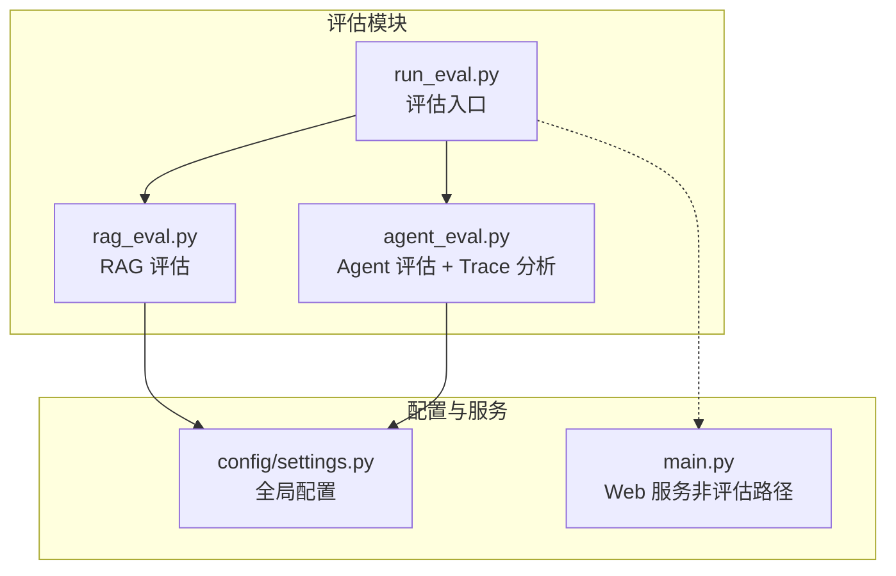
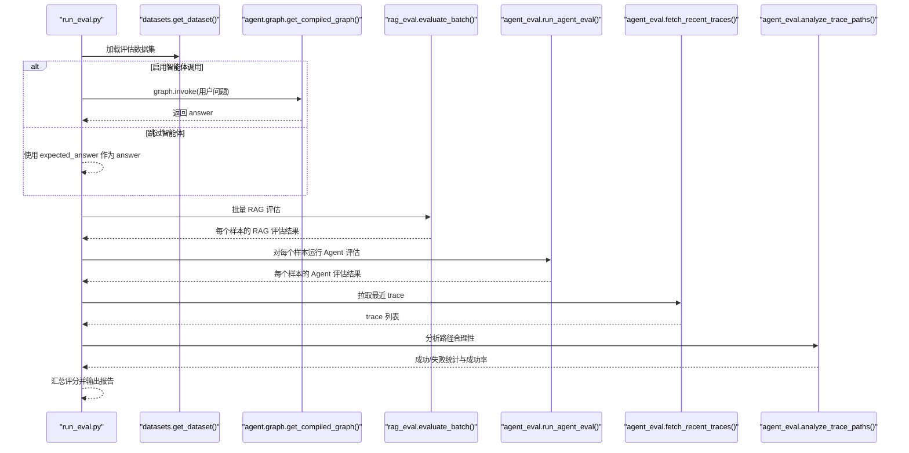
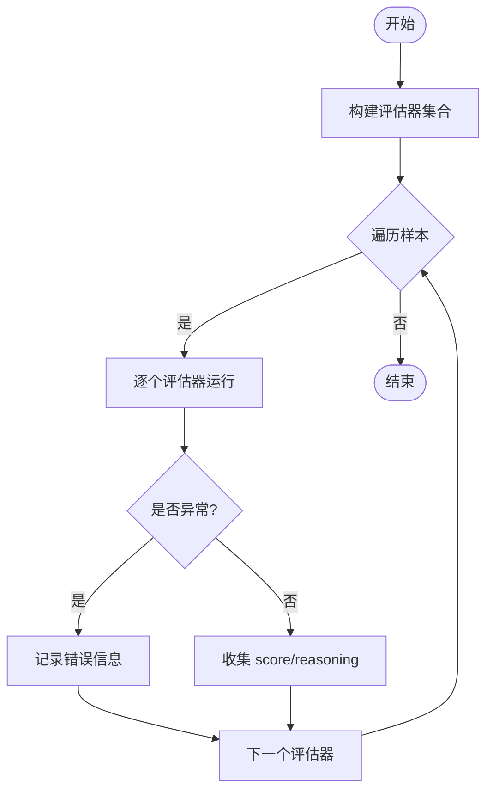
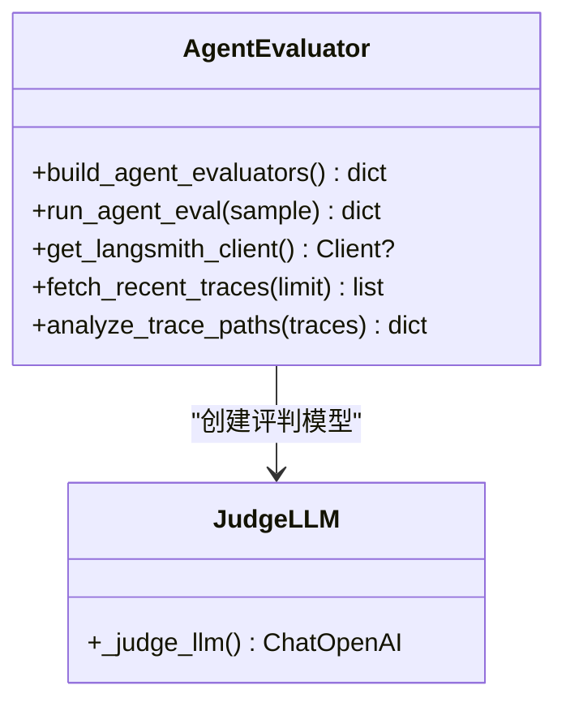
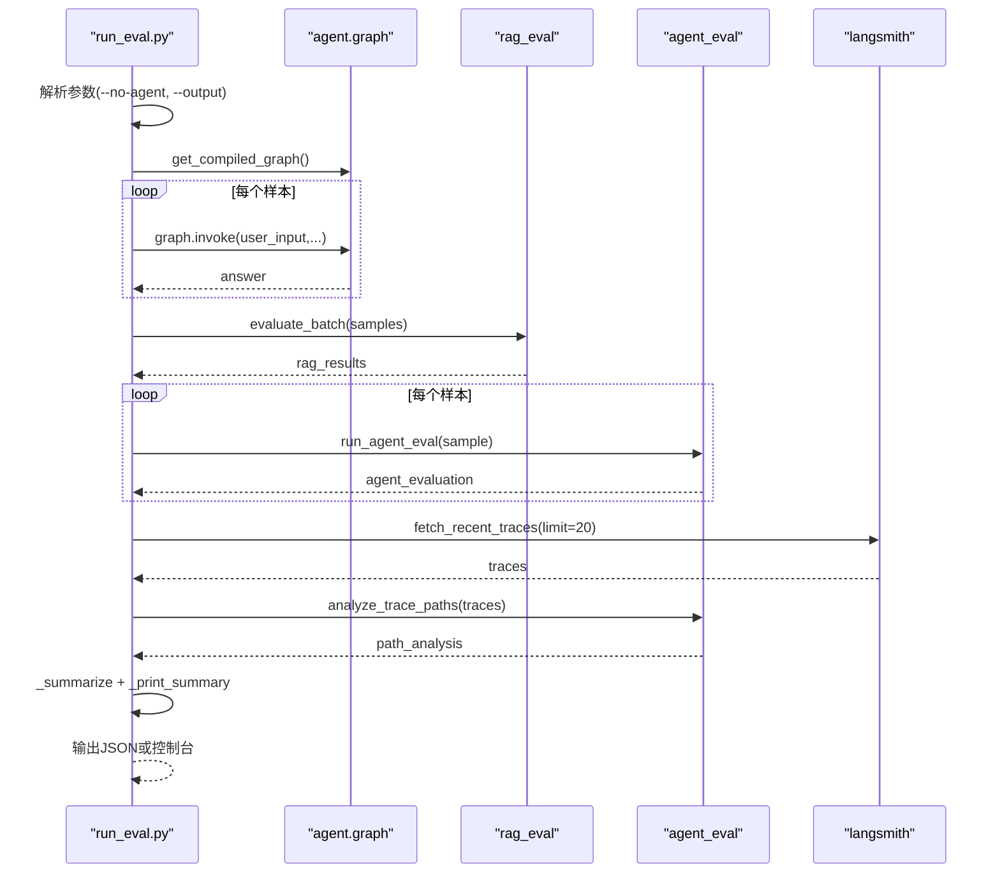
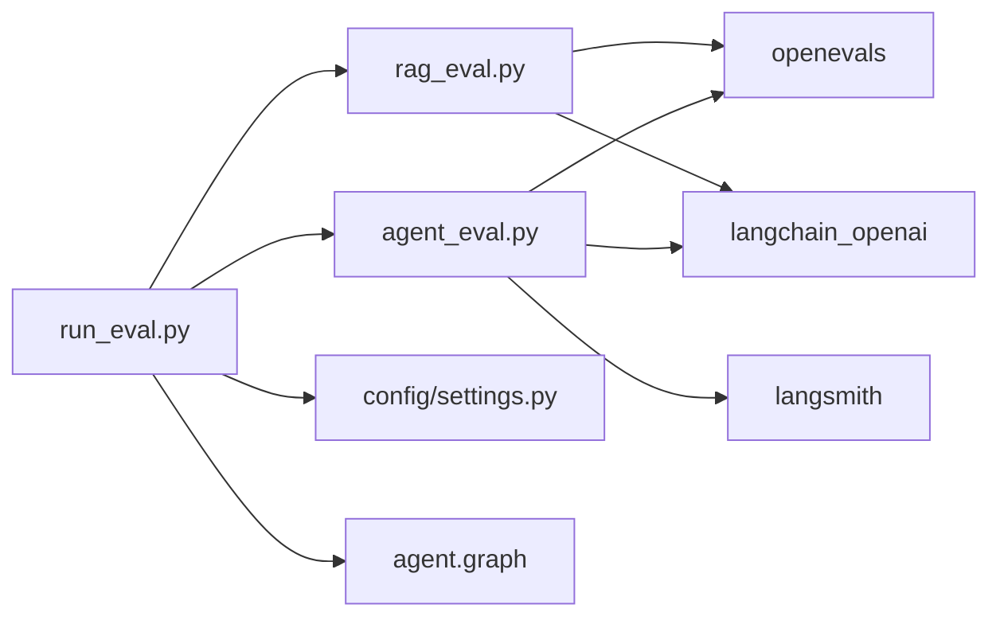

# 评估框架

<cite>
**本文引用的文件**
- [evaluation/agent_eval.py](file://evaluation/agent_eval.py)
- [evaluation/rag_eval.py](file://evaluation/rag_eval.py)
- [evaluation/run_eval.py](file://evaluation/run_eval.py)
- [config/settings.py](file://config/settings.py)
- [main.py](file://main.py)
- [requirements.txt](file://requirements.txt)
</cite>

## 目录
1. [简介](#简介)
2. [项目结构](#项目结构)
3. [核心组件](#核心组件)
4. [架构总览](#架构总览)
5. [详细组件分析](#详细组件分析)
6. [依赖关系分析](#依赖关系分析)
7. [性能考量](#性能考量)
8. [故障排查指南](#故障排查指南)
9. [结论](#结论)
10. [附录](#附录)

## 简介
本评估框架面向“智能体（Agent）”与“检索增强生成（RAG）”两大子系统，提供可复用的评估器构建、指标定义、批量评估执行、结果汇总与可视化输出能力。通过 OpenEvals 的 LLM-as-a-Judge 机制，对回答正确性、幻觉检测、推理路径合理性、检索相关性、答案忠实度、帮助度与答案相关性等维度进行自动化评测；同时结合 LangSmith 拉取运行 trace，用于路径合理性分析与成功率统计。评估入口支持可选跳过智能体调用（仅验证评估器），并输出 JSON 报告与控制台汇总表，便于持续集成与回归测试。

## 项目结构
评估相关代码集中在 evaluation 目录下，包含：
- agent_eval.py：智能体评估器构建与执行、LangSmith trace 拉取与路径分析
- rag_eval.py：RAG 质量评估器构建与批量执行
- run_eval.py：评估运行入口 CLI，负责数据集加载、智能体调用（可选）、RAG 与 Agent 评估、trace 分析、报告输出

配置由 config/settings.py 统一管理，涵盖 LLM、向量库、RAG、记忆、限流熔断、LangSmith 等参数。主服务 main.py 提供 Web 接口与启动预热逻辑，评估流程在独立脚本中运行，不阻塞服务。

图表来源
- [evaluation/run_eval.py:23-105](file://evaluation/run_eval.py#L23-L105)
- [evaluation/rag_eval.py:63-120](file://evaluation/rag_eval.py#L63-L120)
- [evaluation/agent_eval.py:33-139](file://evaluation/agent_eval.py#L33-L139)
- [config/settings.py:157-161](file://config/settings.py#L157-L161)

章节来源
- [evaluation/run_eval.py:23-105](file://evaluation/run_eval.py#L23-L105)
- [evaluation/rag_eval.py:63-120](file://evaluation/rag_eval.py#L63-L120)
- [evaluation/agent_eval.py:33-139](file://evaluation/agent_eval.py#L33-L139)
- [config/settings.py:157-161](file://config/settings.py#L157-L161)

## 核心组件
- RAG 评估器集合：基于 OpenEvals 预置提示词，覆盖检索相关性、答案忠实度、帮助度、答案相关性四个维度，统一输入映射与评判模型实例化。
- 智能体评估器集合：覆盖正确性、幻觉检测、推理路径合理性三个维度，结合 LangSmith trace 做路径合理性分析。
- 评估运行器：加载数据集、可选调用智能体获取回答、批量执行 RAG 与 Agent 评估、拉取 trace、汇总评分、输出报告。

章节来源
- [evaluation/rag_eval.py:63-120](file://evaluation/rag_eval.py#L63-L120)
- [evaluation/agent_eval.py:33-139](file://evaluation/agent_eval.py#L33-L139)
- [evaluation/run_eval.py:23-105](file://evaluation/run_eval.py#L23-L105)

## 架构总览
评估流程采用“数据驱动 + 多评估器并行”的架构：
- 数据层：从 datasets.get_dataset() 加载样本，每个样本包含 question、expected_answer、reference_context、reference_docs 等字段。
- 执行层：可选调用智能体图（graph.invoke）获取 answer；随后对每个样本分别运行 RAG 评估器与 Agent 评估器。
- 追踪层：通过 LangSmith 客户端拉取最近运行 trace，计算成功率与失败数，辅助路径合理性分析。
- 输出层：汇总各维度平均分，打印控制台表格，并可保存为 JSON 报告。

图表来源
- [evaluation/run_eval.py:23-105](file://evaluation/run_eval.py#L23-L105)
- [evaluation/rag_eval.py:89-120](file://evaluation/rag_eval.py#L89-L120)
- [evaluation/agent_eval.py:96-139](file://evaluation/agent_eval.py#L96-L139)

## 详细组件分析

### RAG 评估器（retrieval_relevance, groundedness, helpfulness, answer_relevance）
- 构建方式：通过 create_llm_as_judge 将 OpenEvals 预置提示词与评判模型绑定，输入字段映射到样本中的 question、answer、reference_context、reference_docs。
- 执行方式：run_rag_eval 对单个样本依次调用各评估器，捕获异常并记录错误信息；evaluate_batch 批量处理并附加评估结果到样本。
- 指标说明：
  - retrieval_relevance：检索到的文档是否与问题相关
  - groundedness：答案是否基于上下文（无幻觉）
  - helpfulness：回答对用户是否有帮助
  - answer_relevance：回答是否切题

图表来源
- [evaluation/rag_eval.py:63-120](file://evaluation/rag_eval.py#L63-L120)

章节来源
- [evaluation/rag_eval.py:63-120](file://evaluation/rag_eval.py#L63-L120)

### 智能体评估器（correctness, hallucination, plan_adherence）
- 构建方式：同样基于 create_llm_as_judge，使用 CORRECTNESS_PROMPT、HALLUCINATION_PROMPT、PLAN_ADHERENCE_PROMPT，分别对应正确性、幻觉检测、推理路径合理性。
- 执行方式：run_agent_eval 对单个样本运行全部评估器，异常时记录错误；analyze_trace_paths 基于 LangSmith trace 计算成功率。
- 指标说明：
  - correctness：回答是否与参考答案一致
  - hallucination：回答是否包含编造内容
  - plan_adherence：智能体是否按预期步骤推进（结合 trace 节点执行情况）

图表来源
- [evaluation/agent_eval.py:18-70](file://evaluation/agent_eval.py#L18-L70)
- [evaluation/agent_eval.py:73-139](file://evaluation/agent_eval.py#L73-L139)

章节来源
- [evaluation/agent_eval.py:18-70](file://evaluation/agent_eval.py#L18-L70)
- [evaluation/agent_eval.py:73-139](file://evaluation/agent_eval.py#L73-L139)

### 评估运行器（run_evaluation）
- 功能：加载数据集、可选调用智能体获取回答、批量运行 RAG 与 Agent 评估、拉取 LangSmith trace、汇总评分、输出报告。
- 关键流程：
  - 数据集加载：from evaluation.datasets import get_dataset
  - 智能体调用：graph.invoke 传入 user_input、user_id、session_id，获取 answer
  - RAG 评估：evaluate_batch(samples)
  - Agent 评估：run_agent_eval(s)
  - Trace 分析：fetch_recent_traces + analyze_trace_paths
  - 汇总与输出：_summarize 计算各维度平均分，_print_summary 打印表格，可选写入 JSON

图表来源
- [evaluation/run_eval.py:23-105](file://evaluation/run_eval.py#L23-L105)
- [evaluation/agent_eval.py:96-139](file://evaluation/agent_eval.py#L96-L139)

章节来源
- [evaluation/run_eval.py:23-105](file://evaluation/run_eval.py#L23-L105)

## 依赖关系分析
- 外部依赖：
  - OpenEvals：提供 LLM-as-a-Judge 与预置提示词
  - LangChain/OpenAI：评判模型实例化
  - LangSmith：trace 拉取与项目管理
- 内部依赖：
  - 配置中心：config/settings.py 提供 LLM、RAG、LangSmith 等参数
  - 智能体图：agent.graph.get_compiled_graph() 用于获取回答
  - 数据集：evaluation.datasets.get_dataset() 提供评估样本

图表来源
- [requirements.txt:50-52](file://requirements.txt#L50-L52)
- [evaluation/rag_eval.py:15-21](file://evaluation/rag_eval.py#L15-L21)
- [evaluation/agent_eval.py:14-15](file://evaluation/agent_eval.py#L14-L15)
- [evaluation/run_eval.py:23-31](file://evaluation/run_eval.py#L23-L31)

章节来源
- [requirements.txt:50-52](file://requirements.txt#L50-L52)
- [evaluation/rag_eval.py:15-21](file://evaluation/rag_eval.py#L15-L21)
- [evaluation/agent_eval.py:14-15](file://evaluation/agent_eval.py#L14-L15)
- [evaluation/run_eval.py:23-31](file://evaluation/run_eval.py#L23-L31)

## 性能考量
- 首请求延迟优化：服务启动时预热 LLM 连接（TLS 握手、DNS 解析、连接池建立），显著降低首次调用延迟。评估脚本虽独立运行，但建议在同一环境中复用已预热的连接以提升稳定性。
- 批处理效率：RAG 评估采用逐样本顺序执行，避免并发导致的资源竞争；如需加速，可在上层封装并发策略（注意 API 限流）。
- 超时与重试：LLM 调用具备最大重试次数与请求超时配置；流式接口具备整体超时保护，防止连接卡死。
- 索引预热：向量库与 BM25 索引在服务启动时预热，减少首请求阻塞；评估过程中若频繁调用智能体，可受益于该预热效果。

章节来源
- [main.py:45-77](file://main.py#L45-L77)
- [main.py:80-135](file://main.py#L80-L135)
- [config/settings.py:38-48](file://config/settings.py#L38-L48)

## 故障排查指南
- 未配置 LangSmith：当 LANGSMITH_API_KEY 缺失时，客户端初始化失败会打印提示并返回 None，不影响评估主流程；如需路径合理性分析，请配置 langsmith_api_key 与 langsmith_endpoint。
- 评估失败记录：各评估器在异常时记录 error 标志与原因，便于定位具体失败点。
- 智能体调用失败：若 graph.invoke 抛出异常，将记录错误信息并以字符串形式填充 answer，确保后续评估仍可执行。
- 配置校验：所有 LLM、RAG、LangSmith 相关参数均集中管理于 settings.py，可通过环境变量或 .env 文件调整；如出现导入或连接错误，优先检查配置项。

章节来源
- [evaluation/agent_eval.py:73-93](file://evaluation/agent_eval.py#L73-L93)
- [evaluation/rag_eval.py:101-110](file://evaluation/rag_eval.py#L101-L110)
- [evaluation/run_eval.py:37-72](file://evaluation/run_eval.py#L37-L72)
- [config/settings.py:157-161](file://config/settings.py#L157-L161)

## 结论
本评估框架以模块化设计实现了对智能体与 RAG 的多维度自动化评测，结合 OpenEvals 与 LangSmith 提供了高质量的指标计算与路径合理性分析。通过统一的配置管理与可插拔的评估器构建，开发者可快速扩展新指标、接入新的评判模型，并在 CI/CD 中稳定执行批量评估。配合服务启动预热与超时保护，评估过程具备良好的鲁棒性与性能表现。

## 附录
- 使用方法
  - 运行全部评估：python -m evaluation.run_eval
  - 跳过智能体调用（仅验证评估器）：python -m evaluation.run_eval --no-agent
  - 输出 JSON 报告：python -m evaluation.run_eval --output report.json
- 数据集管理
  - 数据集通过 evaluation.datasets.get_dataset() 加载，样本需包含 question、expected_answer、reference_context、reference_docs 等字段
- 结果可视化
  - 控制台汇总表：自动打印各维度平均分与路径分析统计
  - JSON 报告：包含时间戳、样本数、RAG 与 Agent 评估明细、路径分析摘要与总体汇总

章节来源
- [evaluation/run_eval.py:10-14](file://evaluation/run_eval.py#L10-L14)
- [evaluation/run_eval.py:123-143](file://evaluation/run_eval.py#L123-L143)
- [evaluation/run_eval.py:146-151](file://evaluation/run_eval.py#L146-L151)