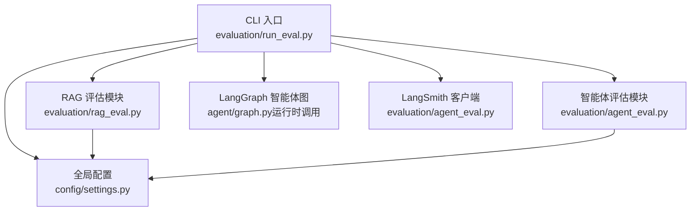
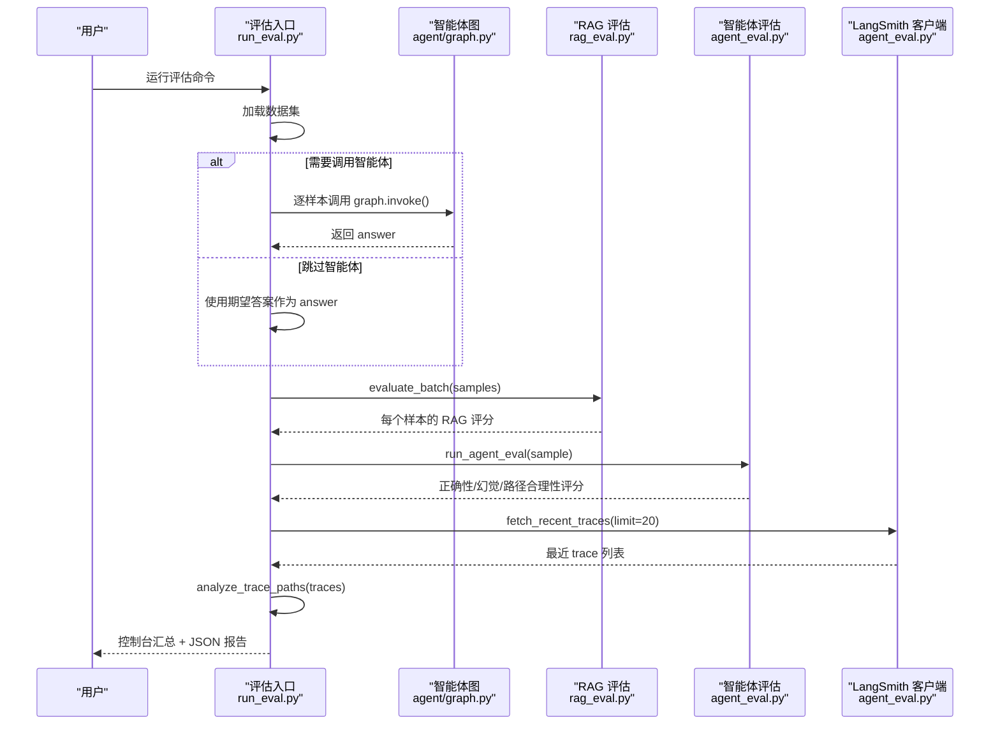
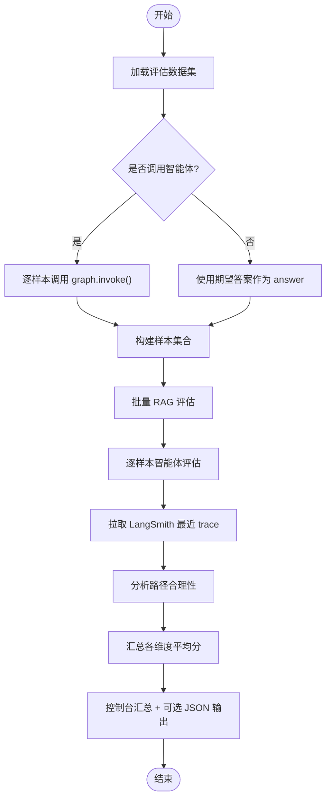
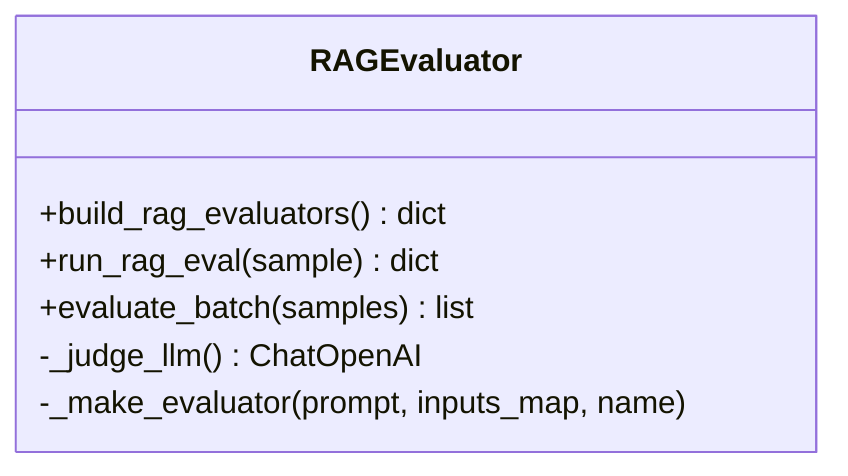
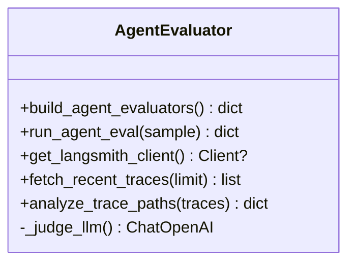
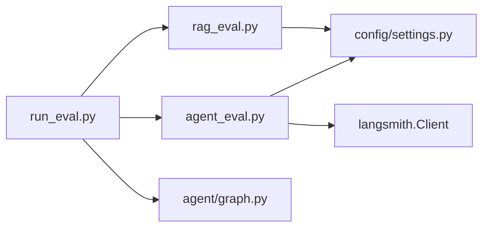

# 评估运行器

<cite>
**本文引用的文件**
- [evaluation/run_eval.py](file://evaluation/run_eval.py)
- [evaluation/rag_eval.py](file://evaluation/rag_eval.py)
- [evaluation/agent_eval.py](file://evaluation/agent_eval.py)
- [config/settings.py](file://config/settings.py)
- [main.py](file://main.py)
- [requirements.txt](file://requirements.txt)
</cite>

## 目录
1. [简介](#简介)
2. [项目结构](#项目结构)
3. [核心组件](#核心组件)
4. [架构总览](#架构总览)
5. [详细组件分析](#详细组件分析)
6. [依赖关系分析](#依赖关系分析)
7. [性能考虑](#性能考虑)
8. [故障排查指南](#故障排查指南)
9. [结论](#结论)
10. [附录](#附录)

## 简介
本文件面向开发者与评测工程师，系统化说明“评估运行器”的设计与使用方法。该运行器统一管理和执行多种评估任务：包括对智能体回答的 RAG 质量评估、智能体行为评估（正确性、幻觉检测、推理路径合理性），以及基于 LangSmith trace 的路径合理性统计。它提供命令行接口、批量评估流程、结果收集与汇总输出，并支持扩展新的评估器与集成外部工具。

## 项目结构
评估相关代码集中在 evaluation 目录下，由入口脚本编排整体流程；RAG 与智能体评估分别封装在独立模块中；配置通过全局 Settings 管理；主服务 main.py 提供 Web 能力，但评估运行器以 CLI 方式独立运行。

图表来源
- [evaluation/run_eval.py:23-105](file://evaluation/run_eval.py#L23-L105)
- [evaluation/rag_eval.py:63-120](file://evaluation/rag_eval.py#L63-L120)
- [evaluation/agent_eval.py:18-139](file://evaluation/agent_eval.py#L18-L139)
- [config/settings.py:19-161](file://config/settings.py#L19-L161)

章节来源
- [evaluation/run_eval.py:1-156](file://evaluation/run_eval.py#L1-L156)
- [evaluation/rag_eval.py:1-121](file://evaluation/rag_eval.py#L1-L121)
- [evaluation/agent_eval.py:1-139](file://evaluation/agent_eval.py#L1-L139)
- [config/settings.py:1-216](file://config/settings.py#L1-L216)

## 核心组件
- 评估入口与编排：负责加载数据集、可选地调用智能体生成答案、串联 RAG 评估与智能体评估、拉取 LangSmith trace、汇总输出报告。
- RAG 质量评估：使用 OpenEvals 的 LLM-as-Judge 对检索相关性、忠实度、帮助度、答案相关性进行自动化评分。
- 智能体评估：使用 OpenEvals 评估正确性、幻觉检测、推理路径合理性；结合 LangSmith 拉取最近 trace 做成功率与路径合理性统计。
- 配置管理：集中管理 LLM、向量库、RAG、LangSmith 等参数，评估模块按需读取。

章节来源
- [evaluation/run_eval.py:23-105](file://evaluation/run_eval.py#L23-L105)
- [evaluation/rag_eval.py:63-120](file://evaluation/rag_eval.py#L63-L120)
- [evaluation/agent_eval.py:33-70](file://evaluation/agent_eval.py#L33-L70)
- [config/settings.py:19-161](file://config/settings.py#L19-L161)

## 架构总览
评估运行器的整体工作流如下：

图表来源
- [evaluation/run_eval.py:23-105](file://evaluation/run_eval.py#L23-L105)
- [evaluation/rag_eval.py:113-120](file://evaluation/rag_eval.py#L113-L120)
- [evaluation/agent_eval.py:96-139](file://evaluation/agent_eval.py#L96-L139)

## 详细组件分析

### 评估入口与批量执行（run_eval.py）
- 功能要点
  - 加载评估数据集，构建样本集合。
  - 可选调用智能体获取回答（按 thread_id 隔离会话）。
  - 批量运行 RAG 质量评估。
  - 对每个样本运行智能体评估。
  - 拉取 LangSmith 最近 trace 并分析路径合理性。
  - 输出控制台汇总与 JSON 报告。
- 关键流程
  - 步骤1：加载数据集与构造样本。
  - 步骤2：RAG 评估（批量）。
  - 步骤3：智能体评估（逐样本）。
  - 步骤4：LangSmith trace 分析与汇总。
  - 步骤5：打印汇总与保存 JSON。

图表来源
- [evaluation/run_eval.py:23-105](file://evaluation/run_eval.py#L23-L105)

章节来源
- [evaluation/run_eval.py:23-105](file://evaluation/run_eval.py#L23-L105)

### RAG 质量评估（rag_eval.py）
- 评估维度
  - 检索相关性：评估检索文档是否与问题相关。
  - 忠实度：评估答案是否基于检索上下文，避免幻觉。
  - 帮助度：评估回答对用户是否有用。
  - 答案相关性：评估回答是否切题。
- 实现要点
  - 使用 OpenEvals 的 create_llm_as_judge 与预置 prompt。
  - 通过 _judge_llm() 从配置获取评判模型实例。
  - 批量评估函数 evaluate_batch 遍历样本并聚合结果。

图表来源
- [evaluation/rag_eval.py:24-86](file://evaluation/rag_eval.py#L24-L86)
- [evaluation/rag_eval.py:89-120](file://evaluation/rag_eval.py#L89-L120)

章节来源
- [evaluation/rag_eval.py:24-120](file://evaluation/rag_eval.py#L24-L120)

### 智能体评估与 LangSmith 集成（agent_eval.py）
- 评估维度
  - 正确性：answer 与 expected_answer 的一致性。
  - 幻觉检测：answer 是否包含编造内容。
  - 推理路径合理性：question 与 answer 的推进是否符合预期。
- 实现要点
  - 使用 OpenEvals 的 LLM-as-Judge 与对应 prompt。
  - 通过 get_langsmith_client() 获取 LangSmith 客户端（未配置时跳过）。
  - fetch_recent_traces 拉取最近根节点 trace。
  - analyze_trace_paths 计算成功率与失败数。

图表来源
- [evaluation/agent_eval.py:18-70](file://evaluation/agent_eval.py#L18-L70)
- [evaluation/agent_eval.py:73-139](file://evaluation/agent_eval.py#L73-L139)

章节来源
- [evaluation/agent_eval.py:18-139](file://evaluation/agent_eval.py#L18-L139)

### 配置管理（settings.py）
- 评估相关配置项
  - 评判模型：llm_judge_model
  - LLM 鉴权：llm_api_key、llm_base_url
  - LangSmith：langsmith_api_key、langsmith_project、langsmith_endpoint
- 设计要点
  - 通过 pydantic-settings 从环境变量或 .env 加载。
  - 提供 lru_cache 的单例访问 get_settings()。
  - 为评估模块提供统一的配置源。

章节来源
- [config/settings.py:19-161](file://config/settings.py#L19-L161)

## 依赖关系分析
- 外部依赖
  - OpenEvals：用于 LLM-as-Judge 评估。
  - LangChain/OpenAI：用于创建评判模型实例。
  - LangSmith：用于 trace 拉取与分析。
- 内部依赖
  - 评估入口依赖 agent/graph.py 调用智能体图。
  - 评估模块依赖 config/settings.py 获取配置。

图表来源
- [evaluation/run_eval.py:23-105](file://evaluation/run_eval.py#L23-L105)
- [evaluation/rag_eval.py:24-86](file://evaluation/rag_eval.py#L24-L86)
- [evaluation/agent_eval.py:18-139](file://evaluation/agent_eval.py#L18-L139)
- [config/settings.py:19-161](file://config/settings.py#L19-L161)

章节来源
- [requirements.txt:50-53](file://requirements.txt#L50-L53)
- [evaluation/run_eval.py:23-105](file://evaluation/run_eval.py#L23-L105)

## 性能考虑
- 首请求延迟优化
  - 服务启动时预热 LLM 连接（TLS 握手、DNS、连接池），降低首次评估调用延迟。
  - 参考：main.py 中的 warmup_llm。
- 批处理与并发
  - 当前评估为顺序批处理；如需提升吞吐，可在 evaluate_batch 与 run_agent_eval 中加入并发控制（如线程池或异步队列），注意限流与重试策略。
- 模型与提示
  - 使用 temperature=0.0 的评判模型，保证评分稳定性。
  - 合理设置 llm_request_timeout 与 llm_max_retries，避免长尾请求拖慢整体评估。
- 资源占用
  - 评估过程中频繁调用 LLM，建议限制并发与增加退避重试，避免触发限流。
  - 若启用 LangSmith，注意网络开销与数据量控制（limit 参数）。

章节来源
- [main.py:45-77](file://main.py#L45-L77)
- [config/settings.py:29-48](file://config/settings.py#L29-L48)
- [evaluation/rag_eval.py:32-44](file://evaluation/rag_eval.py#L32-L44)
- [evaluation/agent_eval.py:18-30](file://evaluation/agent_eval.py#L18-L30)

## 故障排查指南
- 常见错误与定位
  - 智能体调用失败：检查 agent/graph.py 可用性与配置；run_eval 中捕获异常并记录。
  - 评估失败：OpenEvals 调用异常会被捕获，结果中包含 error 标记与原因。
  - LangSmith 未配置或未初始化：get_langsmith_client 会返回 None 并打印提示；trace 分析将返回空统计。
- 日志与输出
  - 控制台打印评估进度与汇总表格。
  - JSON 报告包含每个样本的详细评分与 reasoning，便于离线分析。
- 快速自检
  - 使用 --no-agent 模式仅验证评估器与配置是否正确。
  - 检查 .env 或环境变量中 LLM 与 LangSmith 配置是否完整。

章节来源
- [evaluation/run_eval.py:37-72](file://evaluation/run_eval.py#L37-L72)
- [evaluation/rag_eval.py:98-110](file://evaluation/rag_eval.py#L98-L110)
- [evaluation/agent_eval.py:73-93](file://evaluation/agent_eval.py#L73-L93)
- [evaluation/agent_eval.py:96-123](file://evaluation/agent_eval.py#L96-L123)

## 结论
评估运行器提供了统一的评估入口与完整的流水线：从数据集加载、智能体调用（可选）、RAG 与智能体评估、到 LangSmith trace 分析与报告输出。其模块化设计便于扩展新评估器与集成外部工具；通过配置中心化管理参数，确保可维护性与一致性。配合性能优化与故障排查策略，开发者可以高效地运行与管理评估工作流。

## 附录

### 命令行接口与用法
- 基本用法
  - 运行全部评估：python -m evaluation.run_eval
  - 跳过智能体调用（使用数据集自带答案）：python -m evaluation.run_eval --no-agent
  - 输出 JSON 报告：python -m evaluation.run_eval --output report.json
- 参数说明
  - --no-agent：布尔开关，决定是否调用智能体。
  - --output/-o：字符串，指定 JSON 报告输出路径。

章节来源
- [evaluation/run_eval.py:10-14](file://evaluation/run_eval.py#L10-L14)
- [evaluation/run_eval.py:146-151](file://evaluation/run_eval.py#L146-L151)

### 自定义评估任务与扩展指南
- 新增 RAG 评估器
  - 在 rag_eval.py 中通过 _make_evaluator 添加新的评估器，绑定对应的 prompt 与输入映射。
  - 在 build_rag_evaluators 中注册新评估器名称。
- 新增智能体评估器
  - 在 agent_eval.py 中通过 create_llm_as_judge 添加新的评估器，绑定 prompt 与输入映射。
  - 在 build_agent_evaluators 中注册新评估器名称。
- 集成外部评估工具
  - 可在 run_evaluation 中插入新的评估步骤，接收 samples 并输出评分，随后纳入汇总逻辑。
- 注意事项
  - 保持输入字段一致（question、answer、expected_answer、reference_context、reference_docs）。
  - 异常处理：确保评估失败时返回结构化结果（score=None、reasoning、error=True）。

章节来源
- [evaluation/rag_eval.py:47-86](file://evaluation/rag_eval.py#L47-L86)
- [evaluation/agent_eval.py:33-70](file://evaluation/agent_eval.py#L33-L70)
- [evaluation/run_eval.py:74-88](file://evaluation/run_eval.py#L74-L88)

### 运行示例与结果解读
- 示例
  - 全量评估：python -m evaluation.run_eval
  - 仅评估器验证：python -m evaluation.run_eval --no-agent
  - 输出报告：python -m evaluation.run_eval --output report.json
- 结果解读
  - 控制台汇总：显示样本数、时间、LangSmith 路径分析统计与各维度平均分。
  - JSON 报告：包含每个样本的 RAG 评估与智能体评估详情，便于后续分析。

章节来源
- [evaluation/run_eval.py:90-105](file://evaluation/run_eval.py#L90-L105)
- [evaluation/run_eval.py:123-143](file://evaluation/run_eval.py#L123-L143)