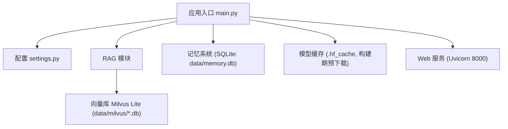
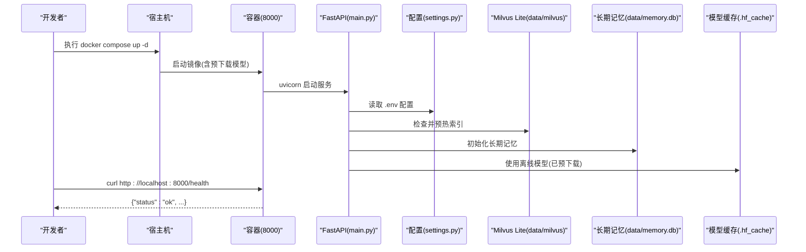

# 环境搭建

<cite>
**本文引用的文件**
- [main.py](file://main.py)
- [config/settings.py](file://config/settings.py)
- [requirements.txt](file://requirements.txt)
- [Dockerfile](file://Dockerfile)
- [docker-compose.yml](file://docker-compose.yml)
- [scripts/prefetch_models.py](file://scripts/prefetch_models.py)
- [.env.example](file://.env.example)
- [.env](file://.env)
- [README.md](file://README.md)
- [Docker部署指南.md](file://Docker部署指南.md)
- [.dockerignore](file://.dockerignore)
</cite>

## 目录
1. [简介](#简介)
2. [项目结构与环境依赖总览](#项目结构与环境依赖总览)
3. [核心组件与环境关系](#核心组件与环境关系)
4. [架构概览（与运行期环境相关）](#架构概览与运行期环境相关)
5. [详细环境搭建步骤](#详细环境搭建步骤)
6. [环境变量与模型缓存配置](#环境变量与模型缓存配置)
7. [Docker 部署与数据持久化](#docker-部署与数据持久化)
8. [依赖分析与兼容性说明](#依赖分析与兼容性说明)
9. [性能与资源建议](#性能与资源建议)
10. [常见问题排查](#常见问题排查)
11. [结论](#结论)

## 简介
本指南面向开发者，提供从零搭建可运行的钉钉AI智能体助手开发环境的完整步骤。内容覆盖：
- Python 版本要求与系统依赖
- 依赖安装与本地开发模式启动
- 环境变量配置、知识库构建与模型缓存
- Docker 镜像构建、容器编排与数据持久化
- 常见问题的定位与解决

目标是让开发者在最短时间获得可用的 Web 聊天服务、RAG 知识库与流式接口。

## 项目结构与环境依赖总览
- 应用入口与Web服务：FastAPI + Uvicorn，暴露 /api/chat、/api/chat/stream、/health 等端点
- 配置管理：基于 pydantic-settings 从 .env 与环境变量加载全局设置
- RAG 与向量库：Milvus Lite 本地文件持久化，支持多模态文档入库与检索
- 模型与缓存：构建期预下载 Embedding/Reranker/OCR 模型到镜像内缓存，运行期离线可用
- 记忆系统：短期记忆进程内存储，长期记忆 SQLite 持久化
- 工具与评估：可选的联网搜索、工具调用、LangSmith/OpenEvals 评估

图表来源
- [main.py:1-387](file://main.py#L1-L387)
- [config/settings.py:1-216](file://config/settings.py#L1-L216)
- [Dockerfile:1-51](file://Dockerfile#L1-L51)

章节来源
- [README.md:43-159](file://README.md#L43-L159)
- [Docker部署指南.md:1-468](file://Docker部署指南.md#L1-L468)

## 核心组件与环境关系
- 大语言模型（LLM）：通过 OpenAI 兼容接口接入（如千问 DashScope），需配置 API Key、Base URL、模型名
- 嵌入与重排序：Embedding 与 Reranker 模型由 HuggingFace 提供，构建期预下载到镜像缓存
- 向量库：Milvus Lite 以本地 .db 文件形式持久化，无需独立服务
- OCR：easyocr 用于图片/PDF 文本识别，构建期预下载模型
- 文件监听：watchdog 实现 docs 目录变更自动增量入库
- Web 服务：FastAPI + Uvicorn，默认端口 8000

章节来源
- [config/settings.py:29-107](file://config/settings.py#L29-L107)
- [scripts/prefetch_models.py:28-94](file://scripts/prefetch_models.py#L28-L94)
- [main.py:45-136](file://main.py#L45-L136)

## 架构概览（与运行期环境相关）

图表来源
- [docker-compose.yml:1-26](file://docker-compose.yml#L1-L26)
- [Dockerfile:1-51](file://Dockerfile#L1-L51)
- [main.py:45-136](file://main.py#L45-L136)
- [config/settings.py:15-216](file://config/settings.py#L15-L216)

## 详细环境搭建步骤

### 一、前置条件
- 操作系统：Windows 或 Linux
- Python：3.12+（推荐直接使用 Docker 方式，避免本地环境问题）
- Docker：Windows 建议使用 WSL 2；Linux 安装 Docker Engine 与 Compose 插件
- 路径：强烈建议将项目放在纯英文路径下，避免中文路径导致构建异常

章节来源
- [README.md:43-57](file://README.md#L43-L57)
- [Docker部署指南.md:13-57](file://Docker部署指南.md#L13-L57)

### 二、本地开发环境（Python 直接运行）
1. 克隆项目到本地
2. 创建并激活虚拟环境（可选但推荐）
3. 安装依赖
   - 执行：pip install -r requirements.txt
4. 准备 .env
   - 复制示例：cp .env.example .env
   - 编辑 .env，填入 LLM_API_KEY、LLM_BASE_URL、LLM_MODEL 等必要项
5. 构建知识库
   - 将知识文档放入 data/docs/（可通过 RAG_DOCS_DIR 指定其他目录）
   - 执行入库：python -m rag.ingest
   - 如需重建索引：python -m rag.ingest --rebuild
6. 启动服务
   - Web 服务模式：uvicorn main:app --host 0.0.0.0 --port 8000 --reload
   - 健康检查：curl http://localhost:8000/health
   - 浏览器访问：http://localhost:8000/ 查看前端页面
7. 本地 REPL 调试
   - 执行：python main.py --repl

章节来源
- [README.md:48-123](file://README.md#L48-L123)
- [main.py:364-387](file://main.py#L364-L387)
- [config/settings.py:19-216](file://config/settings.py#L19-L216)

### 三、Docker 部署（推荐）
1. 准备 .env
   - 在项目根目录创建 .env，至少包含 LLM_API_KEY、LLM_BASE_URL、LLM_MODEL
   - 参考 .env.example 补齐所需配置
2. 构建镜像
   - 执行：docker compose build
   - 首次构建会下载依赖与模型（约 10-30 分钟），镜像体积约 5-6GB
3. 启动服务
   - 执行：docker compose up -d
   - 查看日志：docker compose logs -f agent
   - 健康检查：curl http://localhost:8000/health
4. 知识库入库（容器内）
   - 执行：docker compose run --rm agent python -m rag.ingest
5. 常用运维
   - 停止：docker compose down
   - 重启：docker compose restart
   - 重新构建：docker compose build --no-cache
   - 进入容器：docker compose exec agent bash

章节来源
- [Docker部署指南.md:89-262](file://Docker部署指南.md#L89-L262)
- [docker-compose.yml:1-26](file://docker-compose.yml#L1-L26)
- [Dockerfile:1-51](file://Dockerfile#L1-L51)

### 四、系统依赖与网络加速
- 基础镜像：Python 3.12 slim
- apt 源：阿里云 Debian 源加速
- pip 源：清华镜像加速
- HuggingFace 模型源：hf-mirror.com
- easyocr/torch cv2 运行依赖：libgl1、libglib2.0-0（Dockerfile 中已安装）

章节来源
- [Dockerfile:8-30](file://Dockerfile#L8-L30)
- [Docker部署指南.md:5-9](file://Docker部署指南.md#L5-L9)

## 环境变量与模型缓存配置

### 关键环境变量
- LLM 相关：LLM_MODEL、LLM_BASE_URL、LLM_API_KEY、LLM_TEMPERATURE、LLM_LITE_MODEL、LLM_JUDGE_MODEL、LLM_FALLBACK_MODELS
- Embedding：EMBEDDING_MODEL、EMBEDDING_DEVICE
- 向量库：MILVUS_DB_FILE、MILVUS_COLLECTION、MILVUS_INDEX_TYPE、MILVUS_METRIC_TYPE、RAG_TOP_K、RAG_SCORE_FILTER、RAG_CHUNK_SIZE、RAG_CHUNK_OVERLAP、RAG_DOCS_DIR
- 自动同步：RAG_AUTO_SYNC_ENABLED、RAG_AUTO_SYNC_DEBOUNCE
- 重排序：RERANK_ENABLED、RERANK_MODEL、RERANK_DEVICE、RERANK_CANDIDATE_COUNT、RERANK_TOP_K
- 联网搜索：WEB_SEARCH_ENABLED、WEB_SEARCH_MAX_RESULTS、WEB_SEARCH_TIMEOUT
- OCR：OCR_LANGUAGES、OCR_USE_GPU、OCR_MIN_TEXT_LENGTH
- 支持扩展名：SUPPORTED_FILE_EXTENSIONS
- 记忆系统：LONG_TERM_DB_PATH、MEMORY_SUMMARY_EVERY、MEMORY_CONTEXT_BUDGET、MEMORY_SHORT_WINDOW、MEMORY_HISTORY_BUDGET、RAG_CONTEXT_BUDGET、MEMORY_EXTRACT_LLM_ENABLED、MEMORY_QA_CACHE_ENABLED、MEMORY_QA_THRESHOLD、MEMORY_QA_MAX_RECORDS
- 钉钉工具调用：TOOL_CALLING_ENABLED、TOOL_CONFIRMATION_REQUIRED
- LangSmith：LANGSMITH_API_KEY、LANGSMITH_PROJECT、LANGSMITH_TRACING、LANGSMITH_ENDPOINT

章节来源
- [.env.example:1-103](file://.env.example#L1-L103)
- [.env:1-115](file://.env#L1-L115)
- [config/settings.py:19-216](file://config/settings.py#L19-L216)

### 模型缓存位置与行为
- 构建期预下载：Embedding、Reranker、OCR 模型在镜像构建阶段下载至镜像内缓存
- 运行时离线：HF_HUB_OFFLINE=1、TRANSFORMERS_OFFLINE=1，确保运行时无联网下载
- Windows 符号链接警告：HF_HUB_DISABLE_SYMLINKS_WARNING=true
- 可通过挂载 .hf_cache 到宿主机复用模型缓存

章节来源
- [Dockerfile:35-45](file://Dockerfile#L35-L45)
- [scripts/prefetch_models.py:23-94](file://scripts/prefetch_models.py#L23-L94)
- [.env:22-27](file://.env#L22-L27)

## Docker 部署与数据持久化

### 容器与服务
- 单 worker 运行：短期记忆为进程内 MemorySaver，禁止多进程
- 端口映射：8000:8000
- 健康检查：/health 端点
- 重启策略：unless-stopped

章节来源
- [docker-compose.yml:1-26](file://docker-compose.yml#L1-L26)
- [Dockerfile:47-50](file://Dockerfile#L47-L50)
- [main.py:317-326](file://main.py#L317-L326)

### 数据卷与持久化
- data 目录挂载：./data:/app/data
  - 包含 Milvus Lite 数据库文件、长期记忆 SQLite、知识文档
- .env 通过 env_file 注入，不打包进镜像
- .dockerignore 排除 data/、.env、测试与文档等

章节来源
- [docker-compose.yml:12-18](file://docker-compose.yml#L12-L18)
- [.dockerignore:1-23](file://.dockerignore#L1-L23)

### 跨机器复用与升级
- 导出镜像：docker save 钉钉ai智能体助手-agent -o agent.tar
- 导入镜像：docker load -i agent.tar
- 升级：拉新代码后执行 docker compose up -d --build

章节来源
- [Docker部署指南.md:266-321](file://Docker部署指南.md#L266-L321)

## 依赖分析与兼容性说明

### Python 与核心框架
- Python 3.12+
- FastAPI、Uvicorn、pydantic、pydantic-settings
- LangChain/LangGraph 生态（langchain、langchain-core、langchain-community、langchain-openai、langchain-text-splitters、langchain-huggingface、langgraph、langgraph-checkpoint）

章节来源
- [requirements.txt:1-10](file://requirements.txt#L1-L10)
- [README.md:228-242](file://README.md#L228-L242)

### 模型与向量库
- openai（OpenAI 兼容接口）
- pymilvus、langchain-milvus、milvus-lite（本地 .db 持久化）
- sentence-transformers、transformers、torch、einops、numpy、pillow
- rank-bm25（可选，多路召回）
- watchdog（可选，文件监听）
- timm（jina-clip-v2 视觉骨干网络）

章节来源
- [requirements.txt:11-31](file://requirements.txt#L11-L31)

### 多模态文档处理
- pypdf、pypdfium2、python-docx、openpyxl
- easyocr（中英文 OCR）

章节来源
- [requirements.txt:32-38](file://requirements.txt#L32-L38)

### Web 服务与配置
- fastapi、uvicorn、python-multipart、httpx
- pydantic、pydantic-settings

章节来源
- [requirements.txt:40-49](file://requirements.txt#L40-L49)

### 评估与追踪
- langsmith、openevals

章节来源
- [requirements.txt:50-53](file://requirements.txt#L50-L53)

## 性能与资源建议
- 内存：WSL 2 建议限制 memory=8GB、processors=4（Windows）
- CPU：CPU 精简镜像，无 CUDA；如需 GPU 需另行配置
- 磁盘：镜像约 5-6GB；data/ 目录随知识库增长
- 网络：构建期依赖国内镜像加速；运行期离线模式避免网络抖动
- 并发：单 worker 运行，避免会话状态不一致

章节来源
- [Docker部署指南.md:110-125](file://Docker部署指南.md#L110-L125)
- [Dockerfile:41-50](file://Dockerfile#L41-L50)

## 常见问题排查

### 构建阶段
- 报错 “failed to compute cache key: requirements.txt not found”
  - 原因：当前目录不在项目根
  - 解决：确认在 Dockerfile 所在目录执行 docker compose build
- pip install torch 卡住或超时
  - 原因：网络问题或镜像源偶发慢
  - 解决：重试或临时切换源
- prefetch_models.py 下载模型失败
  - 原因：hf-mirror.com 偶发不可用
  - 解决：重试构建或先在本机预下载模型并挂载 .hf_cache

章节来源
- [Docker部署指南.md:326-360](file://Docker部署指南.md#L326-L360)

### 运行阶段
- 容器启动后立即退出
  - 排查：查看日志、检查 .env、检查端口占用
- 健康检查不通过
  - 原因：服务启动慢或异常
  - 排查：查看应用日志，进入容器手动测试 /health
- 容器无法访问宿主机服务
  - 原因：宿主机服务绑定到 127.0.0.1
  - 解决：绑定到 0.0.0.0 或使用 host.docker.internal
- 数据卷权限不足（Linux）
  - 原因：属主不一致
  - 解决：调整 data/ 目录权限或 chown 用户
- 工具调用功能无法使用
  - 原因：TOOL_CALLING_ENABLED=false 或权限不足
  - 解决：开启开关、配置钉钉应用权限、检查凭证与路由日志
- HuggingFace 模型下载超时
  - 原因：构建期 hf-mirror.com 不稳定
  - 解决：重试构建或挂载 .hf_cache；运行期已设置离线模式

章节来源
- [Docker部署指南.md:361-443](file://Docker部署指南.md#L361-L443)

## 结论
通过本指南，您可以：
- 在本地快速搭建 Python 开发环境并启动 Web 服务
- 使用 Docker 构建包含预下载模型的镜像，实现一键部署
- 配置环境变量与模型缓存，确保运行期稳定与离线可用
- 利用数据卷持久化知识库与记忆数据，便于升级与迁移
- 针对常见问题进行快速定位与修复

建议在正式环境使用反向代理（Nginx）与 HTTPS，定期备份 data/ 目录，固定基础镜像版本，并结合健康检查与重启策略保障服务可用性。