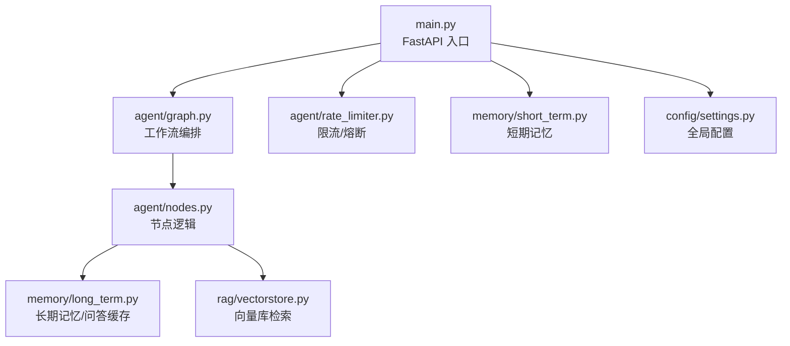
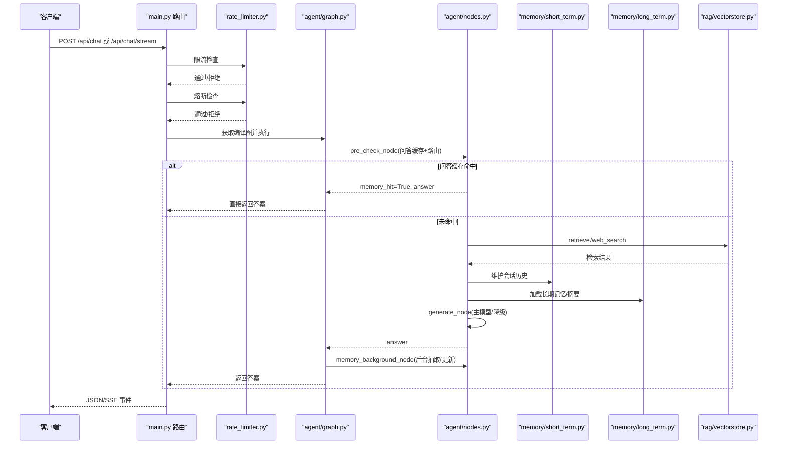
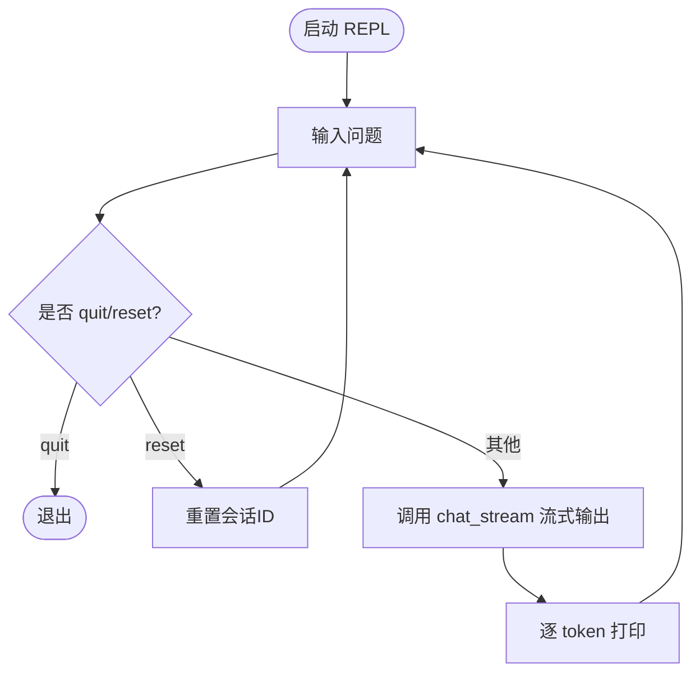
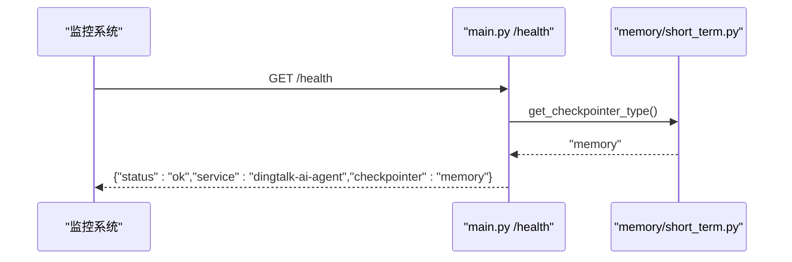
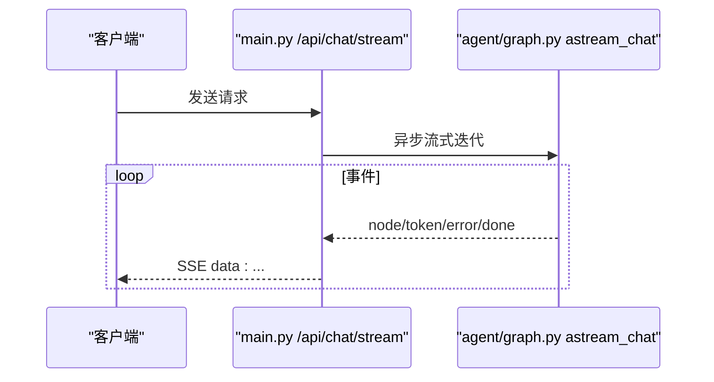
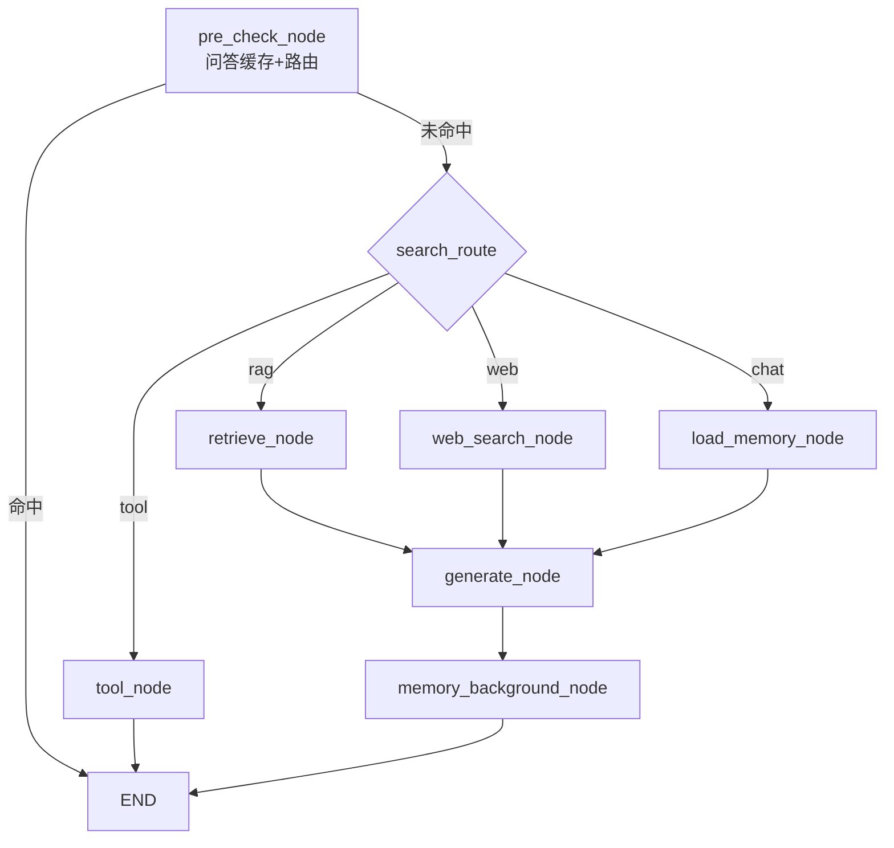
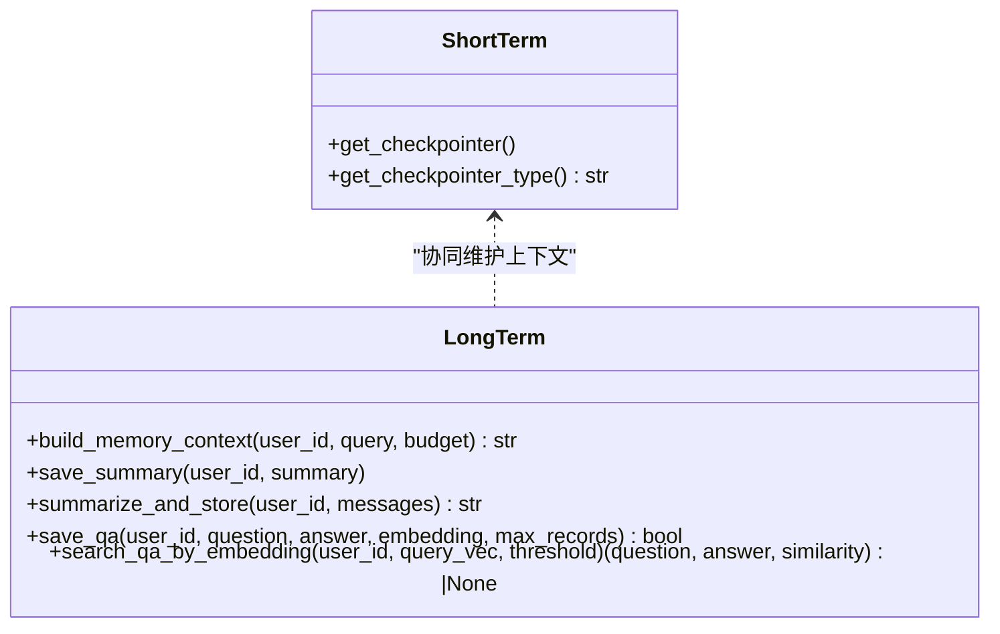
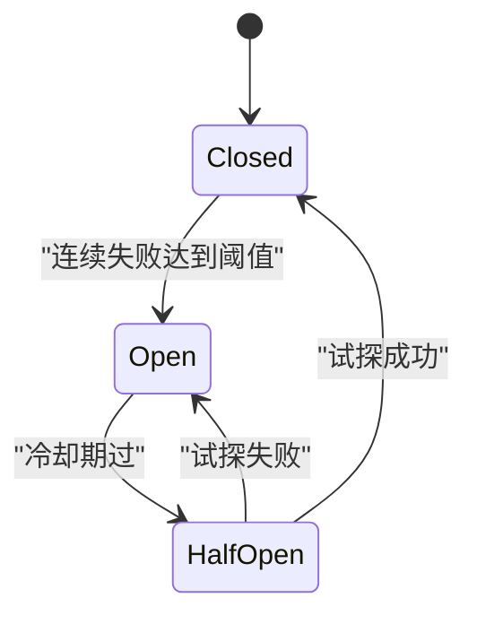
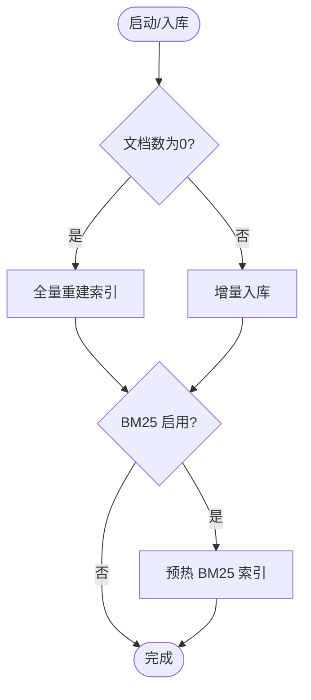
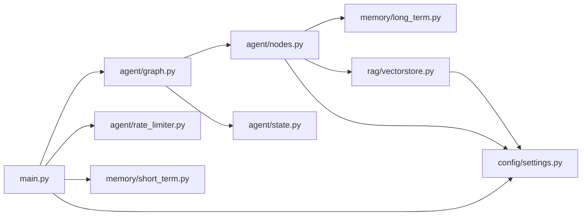

# 调试指南

<cite>
**本文引用的文件**
- [main.py](file://main.py)
- [config/settings.py](file://config/settings.py)
- [agent/graph.py](file://agent/graph.py)
- [agent/nodes.py](file://agent/nodes.py)
- [agent/state.py](file://agent/state.py)
- [agent/rate_limiter.py](file://agent/rate_limiter.py)
- [memory/short_term.py](file://memory/short_term.py)
- [memory/long_term.py](file://memory/long_term.py)
- [rag/vectorstore.py](file://rag/vectorstore.py)
- [Docker部署指南.md](file://Docker部署指南.md)
</cite>

## 目录
1. [简介](#简介)
2. [项目结构](#项目结构)
3. [核心组件](#核心组件)
4. [架构总览](#架构总览)
5. [详细组件分析](#详细组件分析)
6. [依赖关系分析](#依赖关系分析)
7. [性能考量](#性能考量)
8. [故障排查指南](#故障排查指南)
9. [结论](#结论)
10. [附录](#附录)

## 简介
本指南面向开发者与运维人员，提供针对钉钉AI智能体助手的系统化调试方法，覆盖：
- REPL 模式使用与交互式测试
- 日志分析与关键信息定位
- 性能监控与优化建议（含启动预热、流式超时、检索与重排）
- 错误排查与恢复策略（限流、熔断、降级）
- 内置健康检查与状态查看
- 常见问题诊断步骤与解决路径

目标是帮助你在本地开发与生产环境中高效定位问题、验证功能并持续优化系统稳定性与响应速度。

## 项目结构
本项目采用分层模块化组织：
- 入口与Web服务：main.py（FastAPI 应用、健康检查、SSE 流式接口、REPL 调试）
- 配置中心：config/settings.py（集中管理 LLM、RAG、记忆、限流熔断、OCR、搜索等参数）
- 智能体工作流：agent/graph.py（LangGraph StateGraph 构建）、agent/nodes.py（节点实现）、agent/state.py（状态定义）
- 记忆系统：memory/short_term.py（进程内短期上下文）、memory/long_term.py（SQLite 长期记忆、问答缓存）
- 检索与向量库：rag/vectorstore.py（Milvus Lite 封装）、以及检索/重排/嵌入等子模块
- 限流与熔断：agent/rate_limiter.py（滑动窗口限流 + 熔断器）
- 部署与运维：Docker部署指南.md（容器化、日志、健康检查、常见问题）

图表来源
- [main.py:1-387](file://main.py#L1-L387)
- [agent/graph.py:1-255](file://agent/graph.py#L1-L255)
- [agent/nodes.py:1-780](file://agent/nodes.py#L1-L780)
- [memory/short_term.py:1-28](file://memory/short_term.py#L1-L28)
- [memory/long_term.py:1-820](file://memory/long_term.py#L1-L820)
- [rag/vectorstore.py:1-282](file://rag/vectorstore.py#L1-L282)
- [config/settings.py:1-216](file://config/settings.py#L1-L216)

章节来源
- [main.py:1-387](file://main.py#L1-L387)
- [config/settings.py:1-216](file://config/settings.py#L1-L216)

## 核心组件
- Web 服务与健康检查
  - 提供 /api/chat（同步）、/api/chat/stream（SSE 流式）、/health（健康检查）
  - 启动时自动预热 LLM 连接与向量库索引，降低首请求延迟
- 智能体工作流
  - 预检查（问答缓存命中短路、路由判断）→ 四路分流（知识库检索/联网搜索/长期记忆/工具调用）→ 生成回答 → 后台记忆更新
- 记忆系统
  - 短期记忆：基于 LangGraph checkpointer（MemorySaver），按 session_id 维护会话历史
  - 长期记忆：SQLite 持久化，包含用户画像、关键事实、摘要历史、会话压缩摘要、问答缓存
- 检索与向量库
  - Milvus Lite 本地文件持久化，支持文本与图像混合；可开启 BM25 多路召回与 RRF 融合
- 限流与熔断
  - 滑动窗口限流（按 user_id 每分钟请求数）
  - 熔断器（连续失败阈值触发，冷却后半开试探）
- 配置中心
  - 集中管理所有子系统参数，支持环境变量与 .env 文件加载

章节来源
- [main.py:45-136](file://main.py#L45-L136)
- [agent/graph.py:44-114](file://agent/graph.py#L44-L114)
- [agent/nodes.py:93-151](file://agent/nodes.py#L93-L151)
- [memory/short_term.py:13-28](file://memory/short_term.py#L13-L28)
- [memory/long_term.py:424-498](file://memory/long_term.py#L424-L498)
- [rag/vectorstore.py:29-76](file://rag/vectorstore.py#L29-L76)
- [agent/rate_limiter.py:22-47](file://agent/rate_limiter.py#L22-L47)
- [config/settings.py:19-161](file://config/settings.py#L19-L161)

## 架构总览
下图展示了从请求进入到回答输出的完整流程，包括安全过滤、限流熔断、工作流节点、记忆系统与向量检索。

图表来源
- [main.py:154-314](file://main.py#L154-L314)
- [agent/graph.py:44-114](file://agent/graph.py#L44-L114)
- [agent/nodes.py:93-151](file://agent/nodes.py#L93-L151)
- [memory/short_term.py:13-28](file://memory/short_term.py#L13-L28)
- [memory/long_term.py:424-498](file://memory/long_term.py#L424-L498)
- [rag/vectorstore.py:164-184](file://rag/vectorstore.py#L164-L184)

## 详细组件分析

### REPL 调试模式
- 启动方式：python main.py --repl
- 功能：交互式输入问题，实时流式输出助手回答；支持 reset 重置会话
- 适用场景：快速验证路由、检索、生成链路；观察节点进度与 token 增量

图表来源
- [main.py:329-362](file://main.py#L329-L362)
- [agent/graph.py:190-205](file://agent/graph.py#L190-L205)

章节来源
- [main.py:329-362](file://main.py#L329-L362)
- [agent/graph.py:190-205](file://agent/graph.py#L190-L205)

### 健康检查与系统状态
- 健康端点：GET /health
- 返回内容：服务状态、服务名、checkpointer 类型（memory/sqlite 等）
- 用途：容器就绪探针、服务可用性监控

图表来源
- [main.py:317-326](file://main.py#L317-L326)
- [memory/short_term.py:23-28](file://memory/short_term.py#L23-L28)

章节来源
- [main.py:317-326](file://main.py#L317-L326)
- [memory/short_term.py:23-28](file://memory/short_term.py#L23-L28)

### 流式接口与 SSE 事件
- 接口：POST /api/chat/stream
- 事件类型：status（节点进度）、token（增量内容）、error（异常信息）、done（结束标记）
- 超时保护：整体超时后返回已生成 token，避免连接卡死

图表来源
- [main.py:228-314](file://main.py#L228-L314)
- [agent/graph.py:208-255](file://agent/graph.py#L208-L255)

章节来源
- [main.py:228-314](file://main.py#L228-L314)
- [agent/graph.py:208-255](file://agent/graph.py#L208-L255)

### 工作流与节点逻辑
- 预检查：问答缓存命中短路；否则进行路由判断（tool/rag/web/chat）
- 分流：retrieve（知识库检索）、web_search（联网搜索）、load_memory（长期记忆）、tool（工具调用）
- 生成：主模型失败自动降级到备用模型
- 后台记忆：抽取关键信息、更新长期记忆、刷新会话摘要

图表来源
- [agent/graph.py:44-114](file://agent/graph.py#L44-L114)
- [agent/nodes.py:93-151](file://agent/nodes.py#L93-L151)
- [agent/nodes.py:284-341](file://agent/nodes.py#L284-L341)
- [agent/nodes.py:499-533](file://agent/nodes.py#L499-L533)
- [agent/nodes.py:630-643](file://agent/nodes.py#L630-L643)

章节来源
- [agent/graph.py:44-114](file://agent/graph.py#L44-L114)
- [agent/nodes.py:93-151](file://agent/nodes.py#L93-L151)
- [agent/nodes.py:284-341](file://agent/nodes.py#L284-L341)
- [agent/nodes.py:499-533](file://agent/nodes.py#L499-L533)
- [agent/nodes.py:630-643](file://agent/nodes.py#L630-L643)

### 记忆系统（短期与长期）
- 短期记忆：MemorySaver 按 session_id 维护消息历史，保证多轮对话连贯性
- 长期记忆：SQLite 存储用户画像、关键事实、摘要历史、会话压缩摘要、问答缓存
- 问答缓存：相似问题直接复用历史答案，减少大模型调用

图表来源
- [memory/short_term.py:13-28](file://memory/short_term.py#L13-L28)
- [memory/long_term.py:424-498](file://memory/long_term.py#L424-L498)
- [memory/long_term.py:729-800](file://memory/long_term.py#L729-L800)

章节来源
- [memory/short_term.py:13-28](file://memory/short_term.py#L13-L28)
- [memory/long_term.py:424-498](file://memory/long_term.py#L424-L498)
- [memory/long_term.py:729-800](file://memory/long_term.py#L729-L800)

### 限流与熔断
- 限流：滑动窗口按 user_id 限制每分钟请求数
- 熔断：连续失败达阈值进入 open 状态，冷却后 half_open 试探一次，成功则 closed，失败继续 open

图表来源
- [agent/rate_limiter.py:50-122](file://agent/rate_limiter.py#L50-L122)

章节来源
- [agent/rate_limiter.py:22-47](file://agent/rate_limiter.py#L22-L47)
- [agent/rate_limiter.py:50-122](file://agent/rate_limiter.py#L50-L122)

### 向量检索与索引
- Milvus Lite 本地文件持久化，支持文本与图像混合
- 启动时自动检查并重建索引；可开启 BM25 多路召回与 RRF 融合
- 写入加锁避免并发冲突，flush 确保磁盘持久化

图表来源
- [main.py:80-135](file://main.py#L80-L135)
- [rag/vectorstore.py:193-205](file://rag/vectorstore.py#L193-L205)
- [rag/vectorstore.py:79-106](file://rag/vectorstore.py#L79-L106)

章节来源
- [main.py:80-135](file://main.py#L80-L135)
- [rag/vectorstore.py:193-205](file://rag/vectorstore.py#L193-L205)
- [rag/vectorstore.py:79-106](file://rag/vectorstore.py#L79-L106)

## 依赖关系分析
- main.py 依赖 agent/graph.py、agent/rate_limiter.py、memory/short_term.py、config/settings.py
- agent/graph.py 依赖 agent/nodes.py、agent/state.py、memory/short_term.py
- agent/nodes.py 依赖 config/settings.py、memory/long_term.py、rag/* 模块
- rag/vectorstore.py 依赖 config/settings.py、rag/embeddings.py
- 配置中心被各模块按需读取，形成松耦合

图表来源
- [main.py:1-387](file://main.py#L1-L387)
- [agent/graph.py:1-255](file://agent/graph.py#L1-L255)
- [agent/nodes.py:1-780](file://agent/nodes.py#L1-L780)
- [rag/vectorstore.py:1-282](file://rag/vectorstore.py#L1-L282)
- [config/settings.py:1-216](file://config/settings.py#L1-L216)

章节来源
- [main.py:1-387](file://main.py#L1-L387)
- [agent/graph.py:1-255](file://agent/graph.py#L1-L255)
- [agent/nodes.py:1-780](file://agent/nodes.py#L1-L780)
- [rag/vectorstore.py:1-282](file://rag/vectorstore.py#L1-L282)
- [config/settings.py:1-216](file://config/settings.py#L1-L216)

## 性能考量
- 启动预热
  - LLM 连接预热（TLS 握手、DNS 解析、连接池建立）
  - 向量库索引预热（BM25 多路召回时避免首请求阻塞）
- 流式超时保护
  - 整体超时后返回已生成 token，防止连接卡死
- 检索优化
  - 相关度阈值过滤（纯向量路径）
  - 重排序与 RRF 融合提升精确匹配召回率
- 记忆系统
  - 问答缓存命中跳过生成链路
  - 会话压缩摘要防上下文硬丢失
- 限流与熔断
  - 保护后端服务，避免雪崩

章节来源
- [main.py:45-135](file://main.py#L45-L135)
- [main.py:228-314](file://main.py#L228-L314)
- [agent/nodes.py:284-341](file://agent/nodes.py#L284-L341)
- [agent/nodes.py:499-533](file://agent/nodes.py#L499-L533)
- [memory/long_term.py:424-498](file://memory/long_term.py#L424-L498)
- [agent/rate_limiter.py:50-122](file://agent/rate_limiter.py#L50-L122)

## 故障排查指南
- 常见问题与定位
  - 服务无法启动：检查端口占用、镜像构建、模型下载；查看容器日志
  - 健康检查不通过：等待模型加载完成，查看应用日志
  - 工具调用不可用：确认工具开关、钉钉权限、密钥配置；查看路由日志
  - 向量库为空：启动时自动重建；检查数据卷挂载与权限
  - 限流/熔断触发：调整 rate_limit_per_minute、circuit_breaker_threshold、circuit_breaker_recovery
- 日志分析要点
  - 关注 [warmup]、[route]、[retrieve]、[web_search]、[generate]、[memory]、[tool]、[circuit_breaker] 等标签
  - 流式接口关注 [stream] 超时与异常
- 排查步骤
  - 使用 REPL 模式快速验证单轮问答
  - 通过 /health 检查服务状态与 checkpointer 类型
  - 使用 Docker 命令查看实时日志与资源占用
  - 调整配置项并重启验证效果

章节来源
- [Docker部署指南.md:324-443](file://Docker部署指南.md#L324-L443)
- [main.py:329-362](file://main.py#L329-L362)
- [main.py:317-326](file://main.py#L317-L326)
- [agent/rate_limiter.py:50-122](file://agent/rate_limiter.py#L50-L122)

## 结论
本指南提供了从 REPL 调试、日志分析、性能监控到错误排查的完整方法论。结合内置的健康检查、限流熔断、启动预热与流式超时保护，开发者可以快速定位问题、验证功能并持续优化系统稳定性与响应速度。建议在开发阶段优先使用 REPL 与 /health 进行验证，在生产环境结合日志与监控指标进行持续观测与调优。

## 附录
- 常用命令
  - 启动服务：uvicorn main:app --host 0.0.0.0 --port 8000 --reload
  - REPL 调试：python main.py --repl
  - 健康检查：curl http://localhost:8000/health
  - Docker 日志：docker compose logs -f agent
- 配置项参考
  - LLM：llm_model、llm_base_url、llm_api_key、llm_temperature、llm_max_retries、llm_request_timeout、llm_fallback_model、llm_fallback_models
  - RAG：rag_top_k、rag_score_filter、rag_min_relevance、rag_chunk_size、rag_chunk_overlap、rag_bm25_enabled、rag_rrf_k、rerank_enabled、rerank_model
  - 记忆：memory_summary_every、memory_context_budget、memory_short_window、memory_history_budget、memory_qa_cache_enabled、memory_qa_threshold、memory_qa_max_records
  - 限流熔断：rate_limit_per_minute、circuit_breaker_threshold、circuit_breaker_recovery
  - 流式超时：stream_timeout

章节来源
- [config/settings.py:29-161](file://config/settings.py#L29-L161)
- [main.py:364-382](file://main.py#L364-L382)