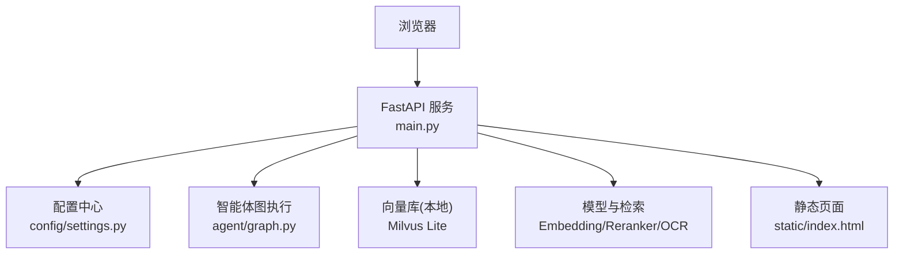

# 快速开始

<cite>
**本文引用的文件**
- [main.py](file://main.py)
- [requirements.txt](file://requirements.txt)
- [config/settings.py](file://config/settings.py)
- [Dockerfile](file://Dockerfile)
- [docker-compose.yml](file://docker-compose.yml)
- [Docker部署指南.md](file://Docker部署指南.md)
- [static/index.html](file://static/index.html)
- [scripts/prefetch_models.py](file://scripts/prefetch_models.py)
- [data/docs/.ingest_manifest.json](file://data/docs/.ingest_manifest.json)
</cite>

## 目录
1. [简介](#简介)
2. [项目结构](#项目结构)
3. [环境要求](#环境要求)
4. [安装与启动](#安装与启动)
5. [基础配置说明](#基础配置说明)
6. [服务启动方法](#服务启动方法)
7. [基本使用示例](#基本使用示例)
8. [常见问题与故障排除](#常见问题与故障排除)
9. [性能与稳定性建议](#性能与稳定性建议)
10. [结论](#结论)

## 简介
本指南面向首次接触钉钉AI智能体助手的用户，帮助你在最短时间内完成本地或容器化部署并成功运行。你将了解：
- 环境要求（Python版本、依赖库）
- 两种部署方式：本地开发与Docker部署
- 关键配置项与默认行为
- 服务启动方法与接口调用
- 常见问题的排查思路

## 项目结构
- Web服务入口与路由：主应用提供聊天接口、健康检查、SSE流式输出与前端页面
- 配置管理：集中化的环境变量/配置文件加载与属性访问
- 向量知识库：基于Milvus Lite的本地持久化向量库，支持增量入库与文件监听
- 模型预下载：构建期预下载Embedding、Reranker、OCR等模型，提升冷启动速度
- 前端界面：内置HTML聊天界面，通过SSE接收流式响应

图表来源
- [main.py:145-326](file://main.py#L145-L326)
- [config/settings.py:19-216](file://config/settings.py#L19-L216)
- [Dockerfile:35-50](file://Dockerfile#L35-L50)

章节来源
- [main.py:1-387](file://main.py#L1-L387)
- [config/settings.py:1-216](file://config/settings.py#L1-L216)
- [static/index.html:1-362](file://static/index.html#L1-L362)

## 环境要求
- Python版本：建议使用Python 3.12（镜像基础镜像为python:3.12-slim）
- 操作系统：Windows 10/11 或 Linux（Ubuntu/Debian等）
- Docker与Compose：用于容器化部署（可选但推荐）
- 网络：首次构建需联网下载依赖与模型；运行时可离线（已设置离线模式）
- 硬件：CPU即可运行；如需GPU加速可在本地开发时调整相关配置

章节来源
- [Dockerfile:1-50](file://Dockerfile#L1-L50)
- [requirements.txt:1-53](file://requirements.txt#L1-L53)

## 安装与启动
### 方式一：本地开发
- 准备Python 3.12环境
- 安装依赖：pip install -r requirements.txt
- 配置环境变量（至少LLM_API_KEY、LLM_BASE_URL、LLM_MODEL），详见“基础配置说明”
- 启动服务：python main.py
- 访问：http://localhost:8000（Web聊天）、http://localhost:8000/health（健康检查）

注意：
- 首次启动会预热LLM连接与向量库索引，可能耗时较长
- 若启用BM25或多路召回，会在启动时预热相应索引

章节来源
- [main.py:364-382](file://main.py#L364-L382)
- [main.py:45-135](file://main.py#L45-L135)
- [requirements.txt:1-53](file://requirements.txt#L1-L53)

### 方式二：Docker部署（推荐）
- 确保已安装Docker与Docker Compose
- 在项目根目录创建.env文件，填入必要配置（见“基础配置说明”）
- 构建并启动：
  - docker compose build
  - docker compose up -d
- 查看日志：docker compose logs -f agent
- 健康检查：curl http://localhost:8000/health

说明：
- 构建期会预下载全部模型到镜像内，交付后冷启动无需联网
- 数据卷映射至./data，包含长期记忆SQLite与Milvus向量库，重启不丢失
- 容器暴露端口8000，可通过反向代理对外提供服务

章节来源
- [docker-compose.yml:1-26](file://docker-compose.yml#L1-L26)
- [Dockerfile:1-50](file://Dockerfile#L1-L50)
- [Docker部署指南.md:60-136](file://Docker部署指南.md#L60-L136)
- [Docker部署指南.md:139-231](file://Docker部署指南.md#L139-L231)

## 基础配置说明
所有配置通过环境变量或.env文件注入，优先级：环境变量 > .env文件。核心配置如下：
- LLM配置：LLM_MODEL、LLM_BASE_URL、LLM_API_KEY、LLM_TEMPERATURE、LLM_MAX_RETRIES、LLM_REQUEST_TIMEOUT、LLM_FALLBACK_MODEL、LLM_FALLBACK_MODELS
- Embedding：EMBEDDING_MODEL、EMBEDDING_DEVICE（默认cpu）
- 向量库：MILVUS_DB_FILE（默认data/milvus/milvus_lite.db）、MILVUS_COLLECTION（默认dingtalk_kb）、MILVUS_INDEX_TYPE（FLAT）、MILVUS_METRIC_TYPE（L2）
- RAG参数：RAG_TOP_K、RAG_SCORE_FILTER、RAG_MIN_RELEVANCE、RAG_CHUNK_SIZE、RAG_CHUNK_OVERLAP、RAG_DOCS_DIR（默认data/docs）
- 自动同步：RAG_AUTO_SYNC_ENABLED（默认true）、RAG_AUTO_SYNC_DEBOUNCE（默认2.0）
- BM25多路召回：RAG_BM25_ENABLED（默认false）、RAG_BM25_CANDIDATE_COUNT、RAG_RRF_K
- 重排序：RERANK_ENABLED（默认true）、RERANK_MODEL、RERANK_DEVICE、RERANK_CANDIDATE_COUNT、RERANK_TOP_K
- OCR：OCR_LANGUAGES（默认ch_sim,en）、OCR_USE_GPU（默认false）、OCR_MIN_TEXT_LENGTH
- 联网搜索：WEB_SEARCH_ENABLED（默认true）、WEB_SEARCH_MAX_RESULTS、WEB_SEARCH_TIMEOUT
- 记忆：LONG_TERM_DB_PATH（默认data/memory.db）、MEMORY_SUMMARY_EVERY、MEMORY_CONTEXT_BUDGET、MEMORY_SHORT_WINDOW、MEMORY_HISTORY_BUDGET、RAG_CONTEXT_BUDGET、MEMORY_EXTRACT_LLM_ENABLED、MEMORY_QA_CACHE_ENABLED、MEMORY_QA_THRESHOLD、MEMORY_QA_MAX_RECORDS
- 输入安全：INPUT_FILTER_ENABLED（默认false）、INPUT_BLOCKED_KEYWORDS、INPUT_INJECTION_CHECK_ENABLED（默认true）
- 限流与熔断：RATE_LIMIT_PER_MINUTE（默认0不限流）、CIRCUIT_BREAKER_THRESHOLD（默认0不熔断）、CIRCUIT_BREAKER_RECOVERY（默认60秒）
- 工具调用：TOOL_CALLING_ENABLED（默认false）、TOOL_CONFIRMATION_REQUIRED（默认true）
- LangSmith：LANGSMITH_API_KEY、LANGSMITH_PROJECT、LANGSMITH_TRACING（默认false）、LANGSMITH_ENDPOINT

提示：
- 首次运行会自动扫描data/docs目录，将文档向量化入库；后续文件变更可自动增量更新（需开启自动同步）
- 若向量库为空且存在清单，将触发全量重建以恢复一致性

章节来源
- [config/settings.py:19-216](file://config/settings.py#L19-L216)
- [main.py:80-135](file://main.py#L80-L135)
- [data/docs/.ingest_manifest.json:1-200](file://data/docs/.ingest_manifest.json#L1-L200)

## 服务启动方法
- 本地启动：python main.py
  - 启动后会打印服务地址与健康检查地址
  - 支持--repl进入交互式调试模式
- Docker启动：docker compose up -d
  - 单worker模式，短期记忆为进程内MemorySaver，避免多进程竞争
  - 健康检查探针每30秒检测一次，启动宽限期60秒

章节来源
- [main.py:364-382](file://main.py#L364-L382)
- [docker-compose.yml:1-26](file://docker-compose.yml#L1-L26)

## 基本使用示例
- Web聊天界面：打开http://localhost:8000，输入问题即可看到流式回答
- REST API：
  - POST /api/chat：返回JSON，包含errcode、errmsg、answer
  - POST /api/chat/stream：SSE流式事件，包含status、token、error、done
  - GET /health：返回服务状态与checkpointer类型
- 本地REPL：python main.py --repl，按提示交互测试

示例请求（非代码片段，仅描述）：
- 发送聊天请求：POST /api/chat，body包含user_input、user_id、session_id
- 订阅流式响应：POST /api/chat/stream，读取SSE事件，渲染token增量

章节来源
- [main.py:138-326](file://main.py#L138-L326)
- [static/index.html:187-358](file://static/index.html#L187-L358)

## 常见问题与故障排除
- 构建阶段
  - pip安装torch超时：重试或切换源；镜像已配置清华源与重试策略
  - 模型预下载失败：hf-mirror.com偶发不可用，重试构建或挂载本地缓存
  - Windows路径含中文：建议移至纯英文路径，避免编码异常
- 运行阶段
  - 容器立即退出：查看日志，确认.env配置齐全，检查端口占用
  - 健康检查不通过：服务启动慢属正常，可适当调大start_period；查看应用日志定位异常
  - 无法访问宿主机服务：宿主机服务需绑定0.0.0.0或使用host.docker.internal访问
  - 数据卷权限不足（Linux）：调整data目录权限或修改容器用户
  - 工具调用不可用：确认TOOL_CALLING_ENABLED=true，钉钉应用权限已申请，密钥正确
  - HuggingFace模型下载超时：重试构建或挂载本地缓存；运行时已设置离线模式，不会再次下载

章节来源
- [Docker部署指南.md:324-442](file://Docker部署指南.md#L324-L442)
- [docker-compose.yml:20-25](file://docker-compose.yml#L20-L25)
- [Dockerfile:35-50](file://Dockerfile#L35-L50)

## 性能与稳定性建议
- 首请求延迟优化：启动时预热LLM连接与向量库索引，显著降低首次请求延迟
- 流式响应：使用/api/chat/stream获得更好的用户体验；整体超时保护防止连接卡死
- 限流与熔断：合理配置RATE_LIMIT_PER_MINUTE与CIRCUIT_BREAKER_THRESHOLD，保护后端服务
- 知识库增量更新：开启RAG_AUTO_SYNC_ENABLED后，文件变更自动触发增量入库，无需重启服务
- 多路召回：开启RAG_BM25_ENABLED可提升精确匹配召回率，但会增加计算开销
- 生产部署：建议通过Nginx反代8000端口并配置HTTPS；定期备份data目录；固定镜像版本

章节来源
- [main.py:45-135](file://main.py#L45-L135)
- [main.py:228-314](file://main.py#L228-L314)
- [config/settings.py:77-149](file://config/settings.py#L77-L149)
- [Docker部署指南.md:445-455](file://Docker部署指南.md#L445-L455)

## 结论
通过以上步骤，你可以在本地或容器中快速部署并运行钉钉AI智能体助手。建议优先采用Docker方式以获得一致的运行环境与更快的冷启动体验。根据业务需求调整配置项，结合限流、熔断与知识库自动同步，实现稳定高效的AI助手服务。