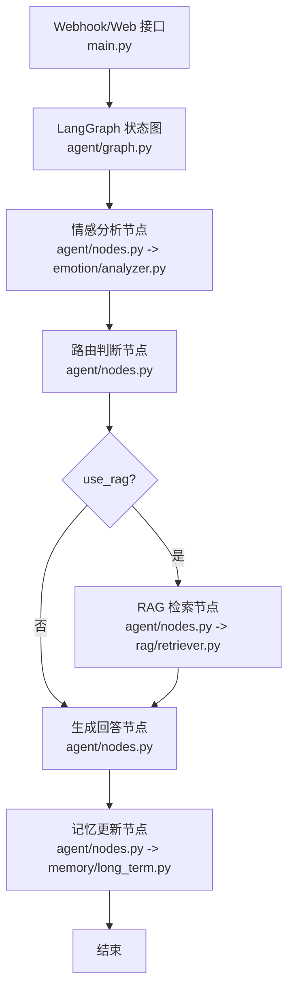
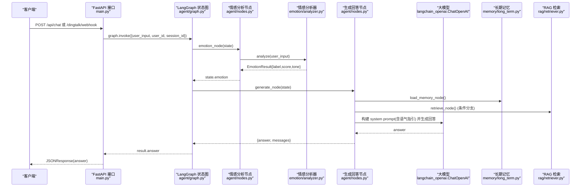
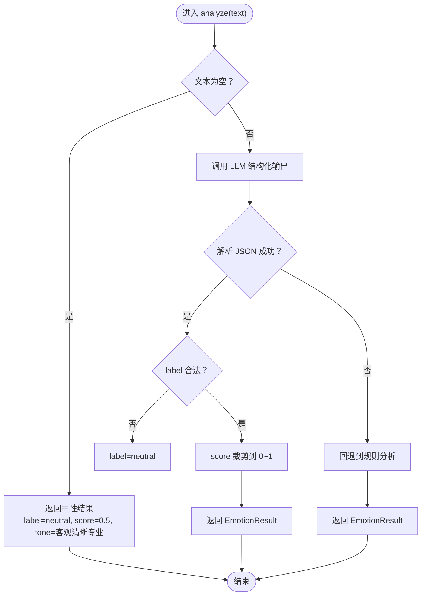
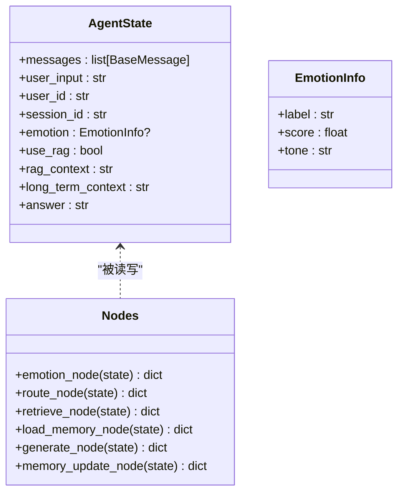
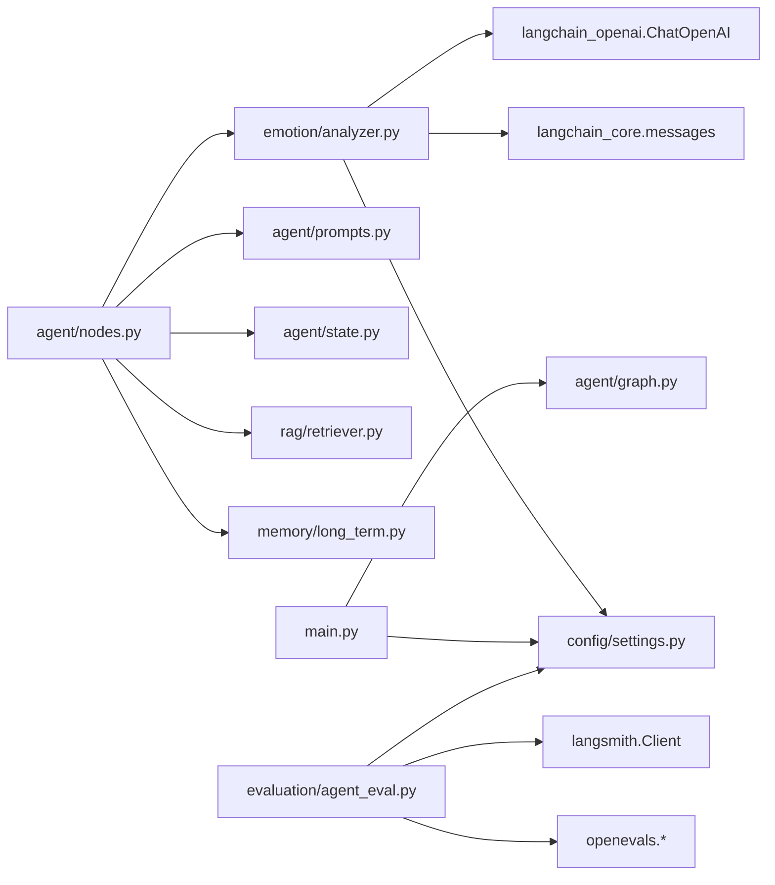

# 情感分析系统

<cite>
**本文引用的文件**   
- [emotion/analyzer.py](file://emotion/analyzer.py)
- [agent/nodes.py](file://agent/nodes.py)
- [agent/graph.py](file://agent/graph.py)
- [agent/state.py](file://agent/state.py)
- [agent/prompts.py](file://agent/prompts.py)
- [main.py](file://main.py)
- [config/settings.py](file://config/settings.py)
- [memory/long_term.py](file://memory/long_term.py)
- [rag/retriever.py](file://rag/retriever.py)
- [evaluation/agent_eval.py](file://evaluation/agent_eval.py)
- [evaluation/run_eval.py](file://evaluation/run_eval.py)
</cite>

## 目录
1. [简介](#简介)
2. [项目结构](#项目结构)
3. [核心组件](#核心组件)
4. [架构总览](#架构总览)
5. [详细组件分析](#详细组件分析)
6. [依赖关系分析](#依赖关系分析)
7. [性能考量](#性能考量)
8. [故障排查指南](#故障排查指南)
9. [结论](#结论)
10. [附录：扩展与自定义指南](#附录扩展与自定义指南)

## 简介
本技术文档围绕“情感分析系统”的实现与使用展开，重点说明以下方面：
- 情感分类算法实现原理：LLM 驱动的情感识别 + 关键词规则兜底策略。
- 情感类型定义（积极、消极、中性）及对应的语气调整策略。
- 如何根据情感分析结果动态调整回复的语气和风格，并给出具体实现示例路径。
- 情感分析的准确性评估方法与调优技巧。
- 常见情感场景的处理案例与最佳实践。
- 扩展新情感类型的指导与自定义情感分析规则的方法。

该系统将情感分析嵌入到智能体工作流中，作为生成回答前的前置节点，用于注入语气指引，从而让回答更贴合用户情绪。

## 项目结构
与情感分析相关的核心代码分布在 emotion、agent、config、memory、rag、evaluation 等模块中。整体流程为：
- 入口服务接收请求后，调用 LangGraph 状态图编排工作流。
- 工作流首先进入“情感分析”节点，得到情感标签、置信度与语气指引。
- 随后进行路由判断（是否需要 RAG），加载长期记忆，检索知识库（可选），生成回答，最后更新记忆。

图表来源
- [main.py:58-91](file://main.py#L58-L91)
- [agent/graph.py:25-69](file://agent/graph.py#L25-L69)
- [agent/nodes.py:31-42](file://agent/nodes.py#L31-L42)
- [rag/retriever.py:34-37](file://rag/retriever.py#L34-L37)
- [memory/long_term.py:203-243](file://memory/long_term.py#L203-L243)

章节来源
- [main.py:58-91](file://main.py#L58-L91)
- [agent/graph.py:25-69](file://agent/graph.py#L25-L69)

## 核心组件
- 情感分析器（emotion/analyzer.py）
  - 提供 analyze(text) 主入口，优先调用 LLM 结构化输出，失败时回退到基于关键词词典的规则分析。
  - 返回 EmotionResult（label、score、tone），其中 tone 由 TONE_MAP 映射得到。
  - 提供 get_tone_guidance(emotion) 生成语气指引文案，供生成节点注入系统 prompt。
- 工作流节点（agent/nodes.py）
  - emotion_node：调用 analyzer.analyze 并将结果写入 state.emotion。
  - generate_node：组装 system prompt，注入语气指引、长期记忆上下文与 RAG 上下文，生成回答。
- 状态定义（agent/state.py）
  - AgentState 包含 messages、user_input、user_id、session_id、emotion、use_rag、rag_context、long_term_context、answer 等字段。
  - EmotionInfo 描述情感分析结果的结构。
- Prompt 模板（agent/prompts.py）
  - SYSTEM_PROMPT_TEMPLATE 支持注入 tone_guidance、long_term_section、rag_section。
  - ROUTER_PROMPT 与 ROUTER_KEYWORDS 用于路由判断的 LLM + 关键词兜底。
- 配置（config/settings.py）
  - 集中管理 LLM、Embedding、向量库、记忆、钉钉、LangSmith 等参数。
- 长期记忆（memory/long_term.py）
  - 基于 SQLite 持久化用户摘要与偏好，周期性摘要存储，供生成节点读取。
- RAG 检索（rag/retriever.py）
  - 语义检索并格式化上下文字符串，供生成节点参考。
- 评估（evaluation/agent_eval.py, evaluation/run_eval.py）
  - 使用 OpenEvals 评估正确性、幻觉检测、计划遵循；结合 LangSmith trace 做路径合理性分析。

章节来源
- [emotion/analyzer.py:13-26](file://emotion/analyzer.py#L13-L26)
- [emotion/analyzer.py:54-67](file://emotion/analyzer.py#L54-L67)
- [emotion/analyzer.py:82-112](file://emotion/analyzer.py#L82-L112)
- [agent/nodes.py:31-42](file://agent/nodes.py#L31-L42)
- [agent/nodes.py:104-141](file://agent/nodes.py#L104-L141)
- [agent/state.py:12-46](file://agent/state.py#L12-L46)
- [agent/prompts.py:7-43](file://agent/prompts.py#L7-L43)
- [config/settings.py:16-92](file://config/settings.py#L16-L92)
- [memory/long_term.py:150-162](file://memory/long_term.py#L150-L162)
- [rag/retriever.py:34-37](file://rag/retriever.py#L34-L37)
- [evaluation/agent_eval.py:33-70](file://evaluation/agent_eval.py#L33-L70)
- [evaluation/run_eval.py:23-105](file://evaluation/run_eval.py#L23-L105)

## 架构总览
下图展示从 Webhook/Web 接口到智能体工作流的完整调用链，以及情感分析在其中的位置与作用。

图表来源
- [main.py:58-91](file://main.py#L58-L91)
- [agent/graph.py:25-69](file://agent/graph.py#L25-L69)
- [agent/nodes.py:31-42](file://agent/nodes.py#L31-L42)
- [agent/nodes.py:104-141](file://agent/nodes.py#L104-L141)
- [emotion/analyzer.py:82-112](file://emotion/analyzer.py#L82-L112)
- [rag/retriever.py:34-37](file://rag/retriever.py#L34-L37)
- [memory/long_term.py:203-243](file://memory/long_term.py#L203-L243)

## 详细组件分析

### 情感分析器（emotion/analyzer.py）
- 数据结构
  - EmotionResult：包含 label（positive/negative/neutral）、score（0~1）、tone（语气指引）。
- 语气映射表（TONE_MAP）
  - positive：热情、积极、给予肯定和鼓励
  - negative：共情、温和、安抚，先理解对方情绪再回应
  - neutral：客观、清晰、专业
- 规则兜底词典
  - _POSITIVE_WORDS、_NEGATIVE_WORDS：中文情感词集合，用于 LLM 不可用时的快速判定。
- 分析流程
  - analyze(text)：空输入直接返回中性；尝试调用 LLM 结构化输出；解析 JSON（容错提取首个 {} 块）；若失败则回退到规则分析。
  - _rule_based_analyze(text)：统计正负词命中数，按多数原则决定 label，score 随命中数递增但上限 0.95；neutral 默认 score 0.6。
  - get_tone_guidance(emotion)：将 label、score、tone 拼接成语气指引文案，供生成节点注入系统 prompt。

图表来源
- [emotion/analyzer.py:82-112](file://emotion/analyzer.py#L82-L112)
- [emotion/analyzer.py:54-67](file://emotion/analyzer.py#L54-L67)

章节来源
- [emotion/analyzer.py:13-26](file://emotion/analyzer.py#L13-L26)
- [emotion/analyzer.py:54-67](file://emotion/analyzer.py#L54-L67)
- [emotion/analyzer.py:82-112](file://emotion/analyzer.py#L82-L112)
- [emotion/analyzer.py:115-118](file://emotion/analyzer.py#L115-L118)

### 工作流节点（agent/nodes.py）
- emotion_node
  - 调用 emotion.analyzer.analyze 获取 EmotionResult，并通过 get_tone_guidance 生成语气指引，写入 state.emotion。
- route_node 与 _decide_rag
  - 短输入且无疑问词倾向于闲聊（use_rag=False）；否则调用 LLM 路由提示词判断是否需要检索；失败时回退到关键词兜底。
- retrieve_node
  - 调用 rag.retriever.retrieve_context 获取格式化的 RAG 上下文。
- load_memory_node
  - 调用 memory.long_term.get_context 拼装长期记忆上下文（偏好、摘要）。
- generate_node
  - 组装 system prompt：注入 tone_guidance、long_term_context、rag_context；取最近历史消息（不含当前轮）；调用 LLM 生成回答；记录消息历史。
- memory_update_node
  - 每 N 轮触发一次摘要生成与存储（settings.memory_summary_every）。

图表来源
- [agent/state.py:12-46](file://agent/state.py#L12-L46)
- [agent/nodes.py:31-42](file://agent/nodes.py#L31-L42)
- [agent/nodes.py:46-72](file://agent/nodes.py#L46-L72)
- [agent/nodes.py:76-86](file://agent/nodes.py#L76-L86)
- [agent/nodes.py:90-100](file://agent/nodes.py#L90-L100)
- [agent/nodes.py:104-141](file://agent/nodes.py#L104-L141)
- [agent/nodes.py:145-163](file://agent/nodes.py#L145-L163)

章节来源
- [agent/nodes.py:31-42](file://agent/nodes.py#L31-L42)
- [agent/nodes.py:46-72](file://agent/nodes.py#L46-L72)
- [agent/nodes.py:76-86](file://agent/nodes.py#L76-L86)
- [agent/nodes.py:90-100](file://agent/nodes.py#L90-L100)
- [agent/nodes.py:104-141](file://agent/nodes.py#L104-L141)
- [agent/nodes.py:145-163](file://agent/nodes.py#L145-L163)

### Prompt 模板与语气注入（agent/prompts.py）
- SYSTEM_PROMPT_TEMPLATE：支持注入 tone_guidance、long_term_section、rag_section。
- build_system_prompt：将各部分拼接为最终系统 prompt。
- ROUTER_PROMPT 与 ROUTER_KEYWORDS：用于路由判断的 LLM + 关键词兜底。

章节来源
- [agent/prompts.py:7-43](file://agent/prompts.py#L7-L43)
- [agent/prompts.py:47-62](file://agent/prompts.py#L47-L62)

### 配置与外部依赖（config/settings.py）
- LLM 配置：model、base_url、api_key、temperature、judge_model。
- Embedding 与向量库：embedding_model、chroma_persist_dir、chroma_collection、rag_top_k、rag_score_filter。
- 记忆：long_term_db_path、memory_summary_every。
- 钉钉：app_key、app_secret、robot_token、robot_secret、robot_code、api_base。
- LangSmith：api_key、project、tracing、endpoint。

章节来源
- [config/settings.py:16-92](file://config/settings.py#L16-L92)

### 长期记忆（memory/long_term.py）
- 表结构：user_memory、user_prefs、summary_history。
- 功能：保存/获取摘要与偏好、增量计数、周期性摘要生成与存储。
- summarize_and_store：使用 LLM 生成对话摘要并持久化，失败时回退简单截断。

章节来源
- [memory/long_term.py:44-72](file://memory/long_term.py#L44-L72)
- [memory/long_term.py:75-100](file://memory/long_term.py#L75-L100)
- [memory/long_term.py:150-162](file://memory/long_term.py#L150-L162)
- [memory/long_term.py:203-243](file://memory/long_term.py#L203-L243)

### RAG 检索（rag/retriever.py）
- retrieve_context：检索并格式化上下文字符串，包含来源、标题、相关度等信息。

章节来源
- [rag/retriever.py:34-37](file://rag/retriever.py#L34-L37)

### 评估体系（evaluation/agent_eval.py, evaluation/run_eval.py）
- agent_eval：构建评估器（correctness、hallucination、plan_adherence），运行评估并汇总结果。
- run_eval：执行完整评估流程，拉取 LangSmith trace 做路径合理性分析，输出报告。

章节来源
- [evaluation/agent_eval.py:33-70](file://evaluation/agent_eval.py#L33-L70)
- [evaluation/run_eval.py:23-105](file://evaluation/run_eval.py#L23-L105)

## 依赖关系分析
- 情感分析器依赖 langchain_core.messages、langchain_openai.ChatOpenAI、config.settings。
- 工作流节点依赖 agent.prompts、agent.state、emotion.analyzer、rag.retriever、memory.long_term、config.settings。
- 主入口 main.py 依赖 FastAPI、agent.graph、config.settings、dingtalk.crypto、dingtalk.client。
- 评估模块依赖 openevals.llm、openevals.prompts、langsmith.Client（可选）。

图表来源
- [emotion/analyzer.py:1-12](file://emotion/analyzer.py#L1-L12)
- [agent/nodes.py:1-12](file://agent/nodes.py#L1-L12)
- [main.py:26-34](file://main.py#L26-L34)
- [evaluation/agent_eval.py:1-15](file://evaluation/agent_eval.py#L1-L15)

章节来源
- [emotion/analyzer.py:1-12](file://emotion/analyzer.py#L1-L12)
- [agent/nodes.py:1-12](file://agent/nodes.py#L1-L12)
- [main.py:26-34](file://main.py#L26-L34)
- [evaluation/agent_eval.py:1-15](file://evaluation/agent_eval.py#L1-L15)

## 性能考量
- LLM 调用开销：情感分析与路由判断均可能调用 LLM，建议合理设置 temperature 与重试策略；LLM 不可用时自动回退规则分析，保障可用性。
- 短期记忆：使用进程内 MemorySaver，避免额外 IO 开销。
- 长期记忆：SQLite WAL 模式提升并发读性能；摘要生成周期可调节（settings.memory_summary_every）。
- RAG 检索：top-k 与分数阈值（rag_top_k、rag_score_filter）影响召回质量与延迟。
- 日志与监控：通过 logging 与 LangSmith tracing 收集运行轨迹，便于定位瓶颈。

## 故障排查指南
- 情感分析失败
  - 现象：LLM 调用异常或 JSON 解析失败。
  - 处理：自动回退到规则分析；检查 settings.llm_* 配置；查看日志中的 “[emotion] LLM 分析失败” 信息。
- 路由判断异常
  - 现象：LLM 路由失败，回退关键词兜底。
  - 处理：检查 ROUTER_PROMPT 与 ROUTER_KEYWORDS；确认用户输入是否包含疑问词或知识类关键词。
- 生成回答失败
  - 现象：LLM 生成异常。
  - 处理：检查 system prompt 构造（tone_guidance、long_term_context、rag_context）；确认历史消息长度限制；查看日志 “[generate] LLM 生成失败”。
- 长期记忆更新失败
  - 现象：摘要生成或存储失败。
  - 处理：检查 SQLite 权限与路径；确认 settings.long_term_db_path；查看日志 “[memory] 更新长期记忆失败”。
- 评估失败
  - 现象：OpenEvals 或 LangSmith 初始化失败。
  - 处理：检查 settings.langsmith_api_key；确认网络连通性；查看日志 “[langsmith] 客户端初始化失败”。

章节来源
- [emotion/analyzer.py:110-112](file://emotion/analyzer.py#L110-L112)
- [agent/nodes.py:60-67](file://agent/nodes.py#L60-L67)
- [agent/nodes.py:137-139](file://agent/nodes.py#L137-L139)
- [memory/long_term.py:237-243](file://memory/long_term.py#L237-L243)
- [evaluation/agent_eval.py:73-93](file://evaluation/agent_eval.py#L73-L93)

## 结论
本系统通过 LLM 驱动的情感识别与关键词规则兜底相结合，确保在高可用前提下实现稳定的情感分类。情感结果用于动态注入语气指引，使生成回答更贴合用户情绪。配合 RAG 与长期记忆，系统在个性化与专业性之间取得平衡。评估体系覆盖正确性、幻觉检测与计划遵循，并提供 LangSmith 路径合理性分析，便于持续优化。

## 附录：扩展与自定义指南

### 扩展新情感类型
- 修改 TONE_MAP：在 emotion/analyzer.py 中添加新的 label 与对应语气指引。
- 更新 EmotionResult 与 EmotionInfo：确保 label 字段能容纳新值。
- 调整规则词典：在 _POSITIVE_WORDS/_NEGATIVE_WORDS 中补充新情感的关键词（如“焦虑”、“期待”等）。
- 更新 Prompt：在 EMOTION_SYSTEM_PROMPT 中增加新情感的定义与判别规则。
- 测试验证：通过 REPL 或 Web 接口输入典型样本，观察 label、score、tone 是否符合预期。

章节来源
- [emotion/analyzer.py:22-26](file://emotion/analyzer.py#L22-L26)
- [emotion/analyzer.py:29-36](file://emotion/analyzer.py#L29-L36)
- [emotion/analyzer.py:70-79](file://emotion/analyzer.py#L70-L79)
- [agent/state.py:12-18](file://agent/state.py#L12-L18)

### 自定义情感分析规则
- 规则权重调整：在 _rule_based_analyze 中调整正负词命中权重与 score 计算公式。
- 新增规则维度：例如引入否定词、程度副词（非常、有点）等，提升细粒度判断能力。
- 多语言支持：扩展词典与规则以支持英文或其他语言。
- 集成外部词典：接入第三方情感词典或在线服务，增强覆盖面与准确性。

章节来源
- [emotion/analyzer.py:54-67](file://emotion/analyzer.py#L54-L67)

### 常见情感场景与最佳实践
- 积极反馈（感谢、满意）
  - 策略：热情鼓励、表达认可、提供进一步帮助。
  - 示例：用户说“谢谢，很好用”，应回复肯定并询问是否需要更多功能介绍。
- 消极抱怨（不满、愤怒）
  - 策略：共情安抚、先理解情绪再解决问题、避免争辩。
  - 示例：用户说“太差了，一直出错”，应先道歉并引导问题定位。
- 中性提问（功能咨询）
  - 策略：客观清晰、专业准确、必要时引用参考资料。
  - 示例：用户问“怎么设置提醒”，应分步骤说明并附上操作链接。
- 混合情感（先褒后贬）
  - 策略：综合判断主导情绪，兼顾双方诉求，给出平衡回复。
  - 示例：用户说“界面不错，但响应太慢”，应肯定优点并解释优化方案。

章节来源
- [emotion/analyzer.py:22-26](file://emotion/analyzer.py#L22-L26)
- [agent/prompts.py:7-15](file://agent/prompts.py#L7-L15)

### 准确性评估与调优技巧
- 数据集构建：准备涵盖各类情感与场景的样本，包含 question、expected_answer、reference_context。
- 评估指标：使用 correctness、hallucination、plan_adherence 三个维度；结合 LangSmith trace 分析路径合理性。
- 调优方向：
  - 调整 LLM 温度与提示词，提高稳定性与一致性。
  - 优化规则词典与权重，提升兜底准确率。
  - 调整 RAG top-k 与分数阈值，改善上下文质量。
  - 定期更新长期记忆摘要，保持个性化与时效性。
- 监控与回归：通过 run_eval 生成报告，对比版本间评分变化，确保改进有效。

章节来源
- [evaluation/agent_eval.py:33-70](file://evaluation/agent_eval.py#L33-L70)
- [evaluation/run_eval.py:23-105](file://evaluation/run_eval.py#L23-L105)
- [config/settings.py:38-42](file://config/settings.py#L38-L42)