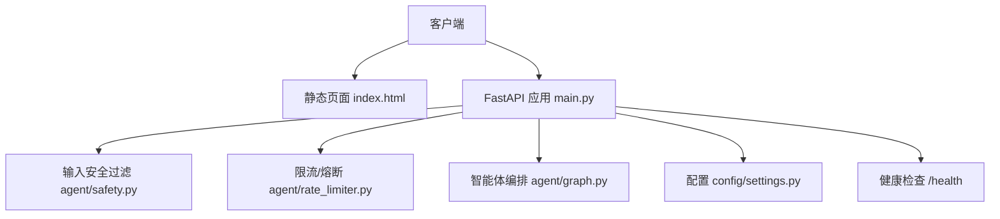
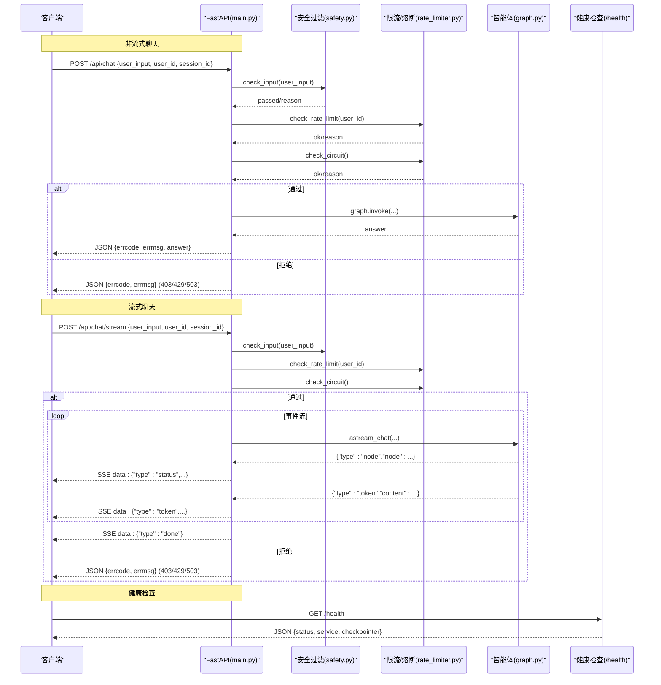
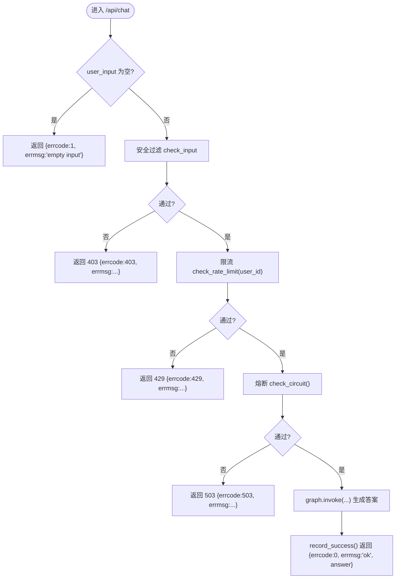
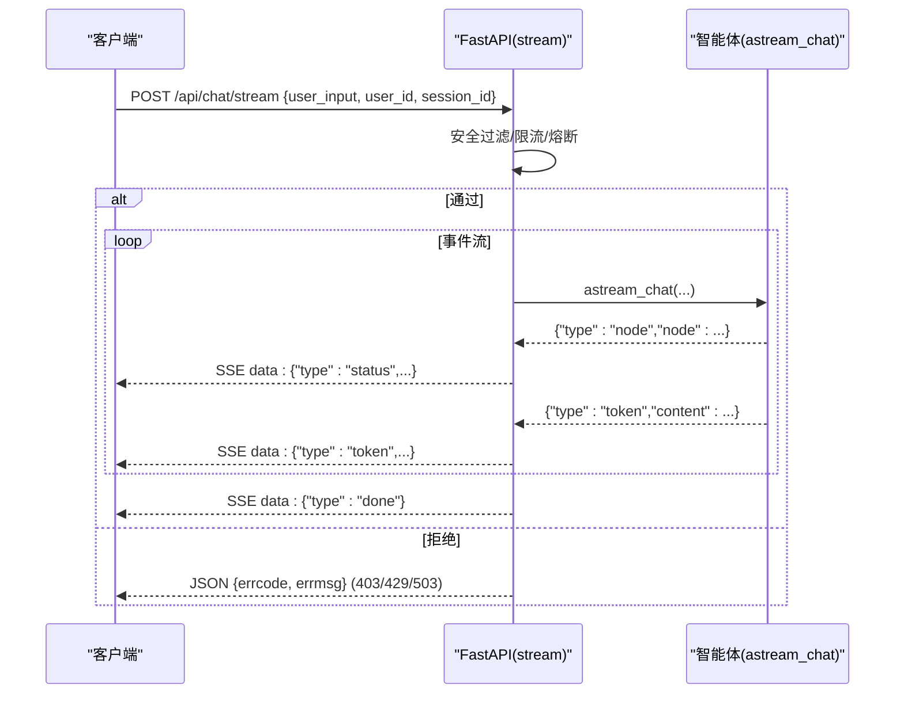
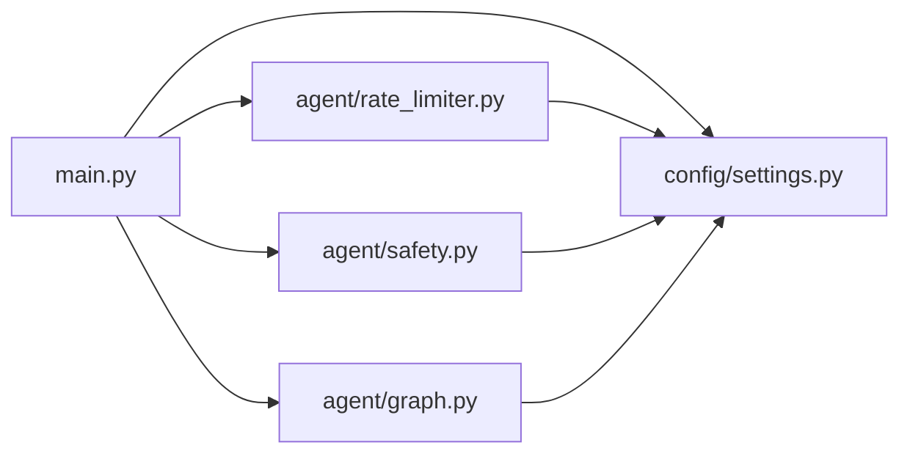

# API接口设计

<cite>
**本文引用的文件**
- [main.py](file://main.py)
- [settings.py](file://config/settings.py)
- [safety.py](file://agent/safety.py)
- [rate_limiter.py](file://agent/rate_limiter.py)
- [graph.py](file://agent/graph.py)
- [index.html](file://static/index.html)
</cite>

## 目录
1. [简介](#简介)
2. [项目结构](#项目结构)
3. [核心组件](#核心组件)
4. [架构总览](#架构总览)
5. [详细组件分析](#详细组件分析)
6. [依赖关系分析](#依赖关系分析)
7. [性能考虑](#性能考虑)
8. [故障排查指南](#故障排查指南)
9. [结论](#结论)
10. [附录：API规范与示例](#附录api规范与示例)

## 简介
本技术文档面向使用 FastAPI 提供的 RESTful API 的开发者，覆盖聊天接口、流式接口与健康检查接口的完整规范与实现细节。内容包括：
- HTTP 方法与 URL 路径、请求参数、响应格式
- 认证授权机制（当前默认无鉴权）、限流熔断策略、安全过滤措施
- SSE 流式响应的实现原理（事件类型、数据传输格式、客户端连接管理）
- 完整的 API 调用示例、错误码定义、异常处理策略
- API 版本管理与向后兼容性说明、迁移建议

## 项目结构
本项目以 FastAPI 作为 Web 框架，提供三个对外暴露的端点：
- GET /：返回前端页面（静态 HTML）
- POST /api/chat：同步聊天接口
- POST /api/chat/stream：SSE 流式聊天接口
- GET /health：健康检查

图表来源
- [main.py:29-39](file://main.py#L29-L39)
- [main.py:145-151](file://main.py#L145-L151)
- [main.py:154-209](file://main.py#L154-L209)
- [main.py:228-314](file://main.py#L228-L314)
- [main.py:317-326](file://main.py#L317-L326)
- [settings.py:19-150](file://config/settings.py#L19-L150)
- [safety.py:35-67](file://agent/safety.py#L35-L67)
- [rate_limiter.py:22-47](file://agent/rate_limiter.py#L22-L47)
- [graph.py:208-230](file://agent/graph.py#L208-L230)

章节来源
- [main.py:29-39](file://main.py#L29-L39)
- [main.py:145-151](file://main.py#L145-L151)
- [main.py:154-209](file://main.py#L154-L209)
- [main.py:228-314](file://main.py#L228-L314)
- [main.py:317-326](file://main.py#L317-L326)
- [settings.py:19-150](file://config/settings.py#L19-L150)
- [safety.py:35-67](file://agent/safety.py#L35-L67)
- [rate_limiter.py:22-47](file://agent/rate_limiter.py#L22-L47)
- [graph.py:208-230](file://agent/graph.py#L208-L230)

## 核心组件
- FastAPI 应用实例与路由定义：统一入口、启动预热、路由注册
- 输入安全过滤：关键词黑名单 + prompt 注入检测
- 限流器：按 user_id 滑动窗口每分钟请求数限制
- 熔断器：连续失败阈值触发熔断，冷却后半开试探恢复
- 智能体编排：同步/异步图执行，节点状态与 token 增量事件
- 配置中心：环境变量与 .env 统一管理，含流超时、限流/熔断开关等

章节来源
- [main.py:45-135](file://main.py#L45-L135)
- [main.py:138-209](file://main.py#L138-L209)
- [main.py:223-314](file://main.py#L223-L314)
- [safety.py:35-67](file://agent/safety.py#L35-L67)
- [rate_limiter.py:22-147](file://agent/rate_limiter.py#L22-L147)
- [graph.py:208-230](file://agent/graph.py#L208-L230)
- [settings.py:19-150](file://config/settings.py#L19-L150)

## 架构总览
下图展示了从客户端到后端各组件的交互流程，包括安全校验、限流熔断、智能体执行与 SSE 事件推送。

图表来源
- [main.py:154-209](file://main.py#L154-L209)
- [main.py:228-314](file://main.py#L228-L314)
- [main.py:317-326](file://main.py#L317-L326)
- [safety.py:35-67](file://agent/safety.py#L35-L67)
- [rate_limiter.py:22-147](file://agent/rate_limiter.py#L22-L147)
- [graph.py:208-230](file://agent/graph.py#L208-L230)

## 详细组件分析

### 聊天接口（POST /api/chat）
- 方法：POST
- 路径：/api/chat
- 请求体：ChatRequest
  - user_input: string（必填）
  - user_id: string（可选，默认 web-user）
  - session_id: string（可选，默认 web-session）
- 响应：JSON
  - errcode: integer（0 表示成功；其他为错误码）
  - errmsg: string（描述信息）
  - answer: string（回答内容，成功时返回）
- 处理流程：
  - 空输入校验
  - 输入安全过滤（关键词黑名单 + prompt 注入检测）
  - 限流检查（按 user_id 滑动窗口）
  - 熔断检查（连续失败阈值）
  - 调用智能体图执行并返回答案
  - 异常捕获并记录失败（用于熔断计数）

图表来源
- [main.py:154-209](file://main.py#L154-L209)
- [safety.py:35-67](file://agent/safety.py#L35-L67)
- [rate_limiter.py:22-47](file://agent/rate_limiter.py#L22-L47)
- [rate_limiter.py:96-117](file://agent/rate_limiter.py#L96-L117)

章节来源
- [main.py:138-209](file://main.py#L138-L209)
- [safety.py:35-67](file://agent/safety.py#L35-L67)
- [rate_limiter.py:22-47](file://agent/rate_limiter.py#L22-L47)
- [rate_limiter.py:96-117](file://agent/rate_limiter.py#L96-L117)

### 流式接口（POST /api/chat/stream）
- 方法：POST
- 路径：/api/chat/stream
- 请求体：ChatRequest（同上）
- 响应：SSE（text/event-stream）
  - 事件类型：
    - status：节点进度（如“检索知识库中...”、“生成回答中...”）
    - token：回答的 token 增量
    - error：异常信息
    - done：结束标记
  - 数据格式：data: <JSON>，每行以 \n\n 分隔
- 处理流程：
  - 空输入校验
  - 安全过滤、限流、熔断
  - 异步迭代智能体图事件，映射为 SSE 事件
  - 整体超时保护：超时后停止拉取并返回已生成的 token，发送 done
  - 正常完成或超时部分生成均记为成功（重置熔断器）
  - 异常记录失败（累计触发熔断）

图表来源
- [main.py:223-314](file://main.py#L223-L314)
- [graph.py:208-230](file://agent/graph.py#L208-L230)

章节来源
- [main.py:223-314](file://main.py#L223-L314)
- [graph.py:208-230](file://agent/graph.py#L208-L230)

### 健康检查接口（GET /health）
- 方法：GET
- 路径：/health
- 响应：JSON
  - status: string（固定为 "ok"）
  - service: string（服务名）
  - checkpointer: string（短期记忆 checkpointer 类型）

章节来源
- [main.py:317-326](file://main.py#L317-L326)

### 根路径（GET /）
- 方法：GET
- 路径：/
- 响应：HTMLResponse（返回 static/index.html）
- 用途：提供本地 Web 聊天界面，便于调试与演示

章节来源
- [main.py:145-151](file://main.py#L145-L151)
- [index.html:1-200](file://static/index.html#L1-L200)

## 依赖关系分析
- 安全过滤模块：在聊天与流式接口中前置调用，拦截敏感内容与指令注入
- 限流/熔断模块：基于用户维度的滑动窗口限流与三态熔断器，保障系统稳定性
- 智能体编排：同步/异步两种模式，分别对应普通聊天与流式聊天
- 配置中心：集中管理 LLM、RAG、OCR、限流/熔断、流超时等关键参数

图表来源
- [main.py:154-209](file://main.py#L154-L209)
- [main.py:228-314](file://main.py#L228-L314)
- [safety.py:35-67](file://agent/safety.py#L35-L67)
- [rate_limiter.py:22-147](file://agent/rate_limiter.py#L22-L147)
- [graph.py:208-230](file://agent/graph.py#L208-L230)
- [settings.py:19-150](file://config/settings.py#L19-L150)

章节来源
- [main.py:154-209](file://main.py#L154-L209)
- [main.py:228-314](file://main.py#L228-L314)
- [safety.py:35-67](file://agent/safety.py#L35-L67)
- [rate_limiter.py:22-147](file://agent/rate_limiter.py#L22-L147)
- [graph.py:208-230](file://agent/graph.py#L208-L230)
- [settings.py:19-150](file://config/settings.py#L19-L150)

## 性能考虑
- 启动预热：LLM 连接与向量库索引在启动时预热，降低首请求延迟
- 流式超时保护：整体超时后返回已生成 token，避免连接卡死
- 多路召回与重排序：可配置 BM25 与 reranker，提升检索质量与响应相关性
- 并发与阻塞：普通 def 路由由 FastAPI 自动放入线程池执行，避免阻塞事件循环
- 缓存与降级：问答记忆命中直接复用历史答案，减少大模型调用

[本节为通用性能指导，不直接分析具体文件]

## 故障排查指南
- 403 输入被拦截：检查安全过滤配置（INPUT_FILTER_ENABLED、敏感词列表、注入检测开关）
- 429 请求过于频繁：调整 RATE_LIMIT_PER_MINUTE，或优化客户端重试策略
- 503 服务不可用：检查 CIRCUIT_BREAKER_THRESHOLD 与 CIRCUIT_BREAKER_RECOVERY，确认外部依赖是否稳定
- 流式无响应：检查 STREAM_TIMEOUT 与网络环境，确认 Nginx 代理未缓冲（X-Accel-Buffering=no）
- 健康检查异常：确认短期记忆 checkpointer 可用，长期记忆数据库路径正确

章节来源
- [safety.py:35-67](file://agent/safety.py#L35-L67)
- [rate_limiter.py:22-47](file://agent/rate_limiter.py#L22-L47)
- [rate_limiter.py:96-117](file://agent/rate_limiter.py#L96-L117)
- [main.py:228-314](file://main.py#L228-L314)
- [main.py:317-326](file://main.py#L317-L326)

## 结论
本项目基于 FastAPI 提供了简洁稳定的 RESTful API，涵盖同步聊天、流式聊天与健康检查。通过输入安全过滤、限流熔断与流式超时保护，确保在高负载与不稳定外部依赖场景下的可用性。配置外置化与模块化设计便于扩展与维护。建议在生产环境中启用限流与熔断，并根据业务需求调整流超时与检索相关度阈值。

[本节为总结性内容，不直接分析具体文件]

## 附录：API规范与示例

### 接口清单
- GET /：返回前端页面（HTML）
- POST /api/chat：同步聊天
- POST /api/chat/stream：SSE 流式聊天
- GET /health：健康检查

章节来源
- [main.py:145-151](file://main.py#L145-L151)
- [main.py:154-209](file://main.py#L154-L209)
- [main.py:228-314](file://main.py#L228-L314)
- [main.py:317-326](file://main.py#L317-L326)

### 请求与响应规范
- 请求体 ChatRequest
  - user_input: string（必填）
  - user_id: string（可选，默认 web-user）
  - session_id: string（可选，默认 web-session）
- 响应体（JSON）
  - errcode: integer（0 成功；其他为错误码）
  - errmsg: string（描述信息）
  - answer: string（仅同步聊天成功时返回）
- 流式响应（SSE）
  - 媒体类型：text/event-stream
  - 事件类型：status、token、error、done
  - 数据格式：data: <JSON>\n\n

章节来源
- [main.py:138-143](file://main.py#L138-L143)
- [main.py:154-209](file://main.py#L154-L209)
- [main.py:223-314](file://main.py#L223-L314)

### 错误码定义
- 1：空输入
- 403：输入安全过滤拦截
- 429：请求过于频繁（限流）
- 503：服务暂时不可用（熔断）
- 500：内部错误（异常）

章节来源
- [main.py:163-209](file://main.py#L163-L209)
- [main.py:238-304](file://main.py#L238-L304)

### 认证与授权
- 当前默认无鉴权中间件，Web 聊天无需鉴权即可访问
- 如需接入企业级鉴权，可在 FastAPI 中添加依赖注入与中间件进行令牌校验

[本节为通用安全建议，不直接分析具体文件]

### 限流与熔断策略
- 限流：按 user_id 滑动窗口每分钟请求数上限（RATE_LIMIT_PER_MINUTE）
- 熔断：连续失败达阈值后进入 open 状态，冷却后 half_open 试探一次，成功则 closed，失败继续 open（CIRCUIT_BREAKER_THRESHOLD、CIRCUIT_BREAKER_RECOVERY）

章节来源
- [rate_limiter.py:22-47](file://agent/rate_limiter.py#L22-L47)
- [rate_limiter.py:50-147](file://agent/rate_limiter.py#L50-L147)
- [settings.py:143-149](file://config/settings.py#L143-L149)

### 安全过滤措施
- 关键词黑名单：命中敏感词直接拒绝
- Prompt 注入检测：检测常见指令注入模式
- 开关控制：INPUT_FILTER_ENABLED、INPUT_INJECTION_CHECK_ENABLED

章节来源
- [safety.py:35-67](file://agent/safety.py#L35-L67)
- [settings.py:135-141](file://config/settings.py#L135-L141)

### SSE 流式响应实现原理
- 事件类型：
  - node -> status：节点进度提示
  - token -> content：增量文本
  - error -> errmsg：异常信息
  - done：结束标记
- 数据传输格式：data: <JSON>\n\n
- 客户端连接管理：
  - 使用 fetch + ReadableStream 解析 SSE
  - 按 \n\n 分割事件，逐条解析 data: 行
  - 支持状态提示与增量渲染

章节来源
- [main.py:223-314](file://main.py#L223-L314)
- [index.html:222-295](file://static/index.html#L222-L295)

### API 版本管理与向后兼容
- 版本标识：FastAPI 应用 version="1.0.0"
- 向后兼容：
  - 新增字段采用可选参数并提供默认值
  - 保留旧字段与响应结构，逐步废弃
- 迁移指南：
  - 升级客户端时优先适配新字段，保持对旧字段的兼容
  - 变更响应结构前发布弃用公告，提供过渡期

章节来源
- [main.py:39](file://main.py#L39)

### 完整调用示例（概念性）
- 同步聊天
  - 请求：POST /api/chat，Body: {user_input, user_id, session_id}
  - 响应：{errcode, errmsg, answer}
- 流式聊天
  - 请求：POST /api/chat/stream，Body: {user_input, user_id, session_id}
  - 响应：SSE 事件流（status/token/error/done）
- 健康检查
  - 请求：GET /health
  - 响应：{status, service, checkpointer}

[本节为概念性示例，不直接引用代码片段]