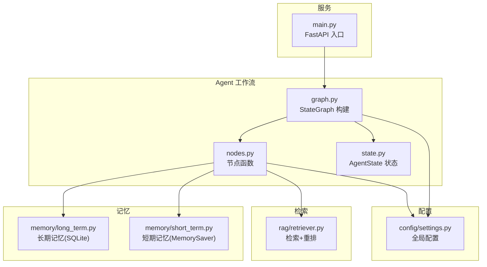
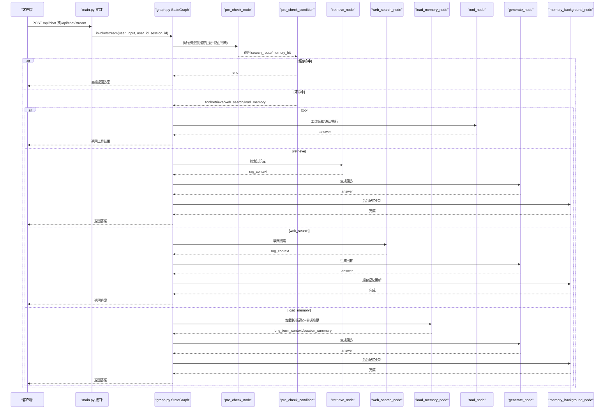
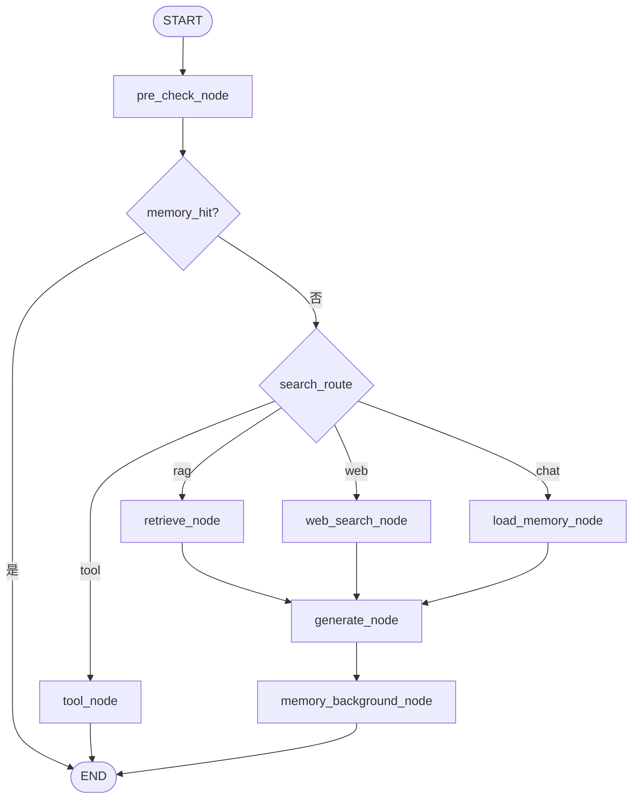
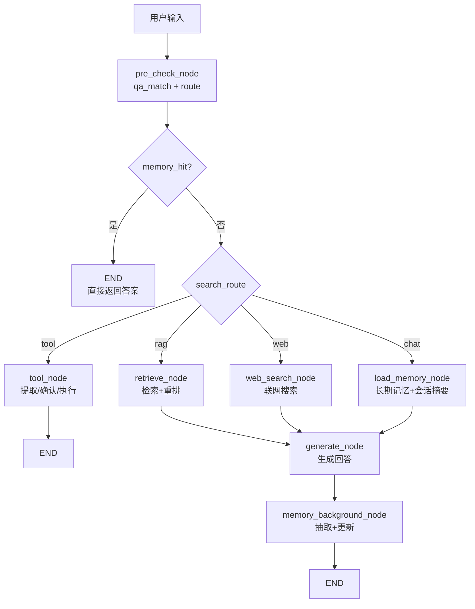
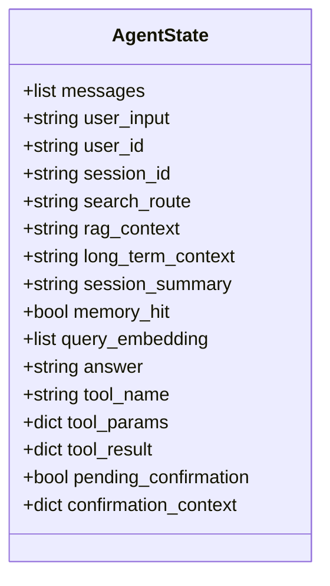
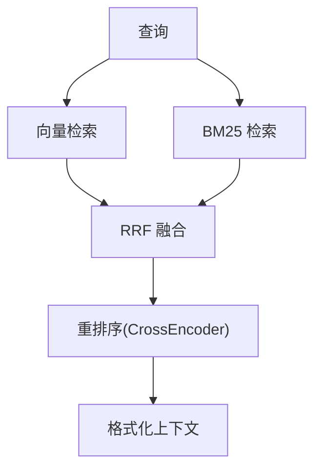
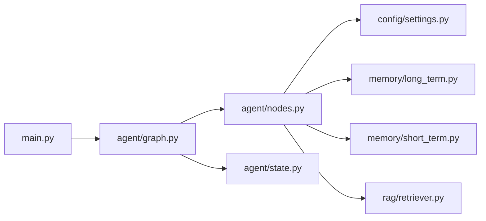

# Agent工作流系统

<cite>
**本文引用的文件**
- [agent/graph.py](file://agent/graph.py)
- [agent/state.py](file://agent/state.py)
- [agent/nodes.py](file://agent/nodes.py)
- [memory/long_term.py](file://memory/long_term.py)
- [memory/short_term.py](file://memory/short_term.py)
- [rag/retriever.py](file://rag/retriever.py)
- [config/settings.py](file://config/settings.py)
- [main.py](file://main.py)
</cite>

## 目录
1. [简介](#简介)
2. [项目结构](#项目结构)
3. [核心组件](#核心组件)
4. [架构总览](#架构总览)
5. [详细组件分析](#详细组件分析)
6. [依赖关系分析](#依赖关系分析)
7. [性能考量](#性能考量)
8. [故障排查指南](#故障排查指南)
9. [结论](#结论)
10. [附录](#附录)

## 简介
本技术文档围绕基于 LangGraph StateGraph 的 Agent 工作流系统，系统性阐述状态定义、节点编排与条件路由机制；深入解析四路分流算法（意图识别、路由决策、分支执行逻辑）；详细说明各处理节点职责（预检查、记忆加载、检索、生成等）；解释状态管理机制（会话状态、用户上下文、消息历史）；并提供完整的工作流执行流程图与状态转换图，帮助读者快速理解从请求到回答的全链路。

## 项目结构
- agent/graph.py：构建并编译 LangGraph StateGraph，注册节点与边，提供同步/异步流式调用入口
- agent/state.py：定义 AgentState 状态结构（消息历史、路由结果、RAG 上下文、长期记忆、工具调用字段等）
- agent/nodes.py：实现所有工作流节点函数（预检查、路由、问答缓存匹配、RAG 检索、联网搜索、长期记忆加载、生成、后台记忆更新、工具调用）
- memory/long_term.py：长期记忆管理（SQLite 持久化，画像/事实/摘要/会话压缩摘要/问答记忆）
- memory/short_term.py：短期记忆（LangGraph checkpointer，进程内 MemorySaver）
- rag/retriever.py：检索器（向量检索 + BM25 多路召回 + RRF 融合 + 重排序 + 上下文格式化）
- config/settings.py：全局配置（LLM、Embedding、向量库、记忆、联网搜索、限流熔断、工具开关等）
- main.py：FastAPI 服务入口（Web 聊天接口、健康检查、启动预热、SSE 流式接口）

**图表来源**
- [agent/graph.py:44-102](file://agent/graph.py#L44-L102)
- [agent/nodes.py:92-151](file://agent/nodes.py#L92-L151)
- [memory/long_term.py:424-497](file://memory/long_term.py#L424-L497)
- [memory/short_term.py:13-20](file://memory/short_term.py#L13-L20)
- [rag/retriever.py:18-52](file://rag/retriever.py#L18-L52)
- [config/settings.py:19-155](file://config/settings.py#L19-L155)
- [main.py:154-210](file://main.py#L154-L210)

**章节来源**
- [agent/graph.py:44-102](file://agent/graph.py#L44-L102)
- [agent/state.py:12-50](file://agent/state.py#L12-L50)
- [agent/nodes.py:92-151](file://agent/nodes.py#L92-L151)
- [memory/long_term.py:424-497](file://memory/long_term.py#L424-L497)
- [memory/short_term.py:13-20](file://memory/short_term.py#L13-L20)
- [rag/retriever.py:18-52](file://rag/retriever.py#L18-L52)
- [config/settings.py:19-155](file://config/settings.py#L19-L155)
- [main.py:154-210](file://main.py#L154-L210)

## 核心组件
- 状态定义（AgentState）：集中承载消息历史、用户与会话标识、路由结果、RAG 上下文、长期记忆上下文、会话摘要、问答命中标志、工具调用相关字段等
- 工作流图（StateGraph）：以 pre_check 为起点，通过条件边进行四路分流（tool/retrieve/web_search/load_memory），最终汇聚至 generate，并在 generate 后进入 memory_background 完成后台记忆更新
- 节点函数：每个节点接收/返回 AgentState 增量，负责单一职责（如检索、生成、记忆加载、工具调用）
- 记忆系统：短期记忆由 LangGraph checkpointer 维护会话上下文；长期记忆通过 SQLite 分层存储（画像、事实、摘要、会话压缩摘要、问答记忆）
- 检索系统：支持向量检索、BM25 多路召回、RRF 融合、CrossEncoder 重排序，以及上下文格式化
- 配置系统：集中管理 LLM、Embedding、向量库、记忆、联网搜索、限流熔断、工具开关等参数

**章节来源**
- [agent/state.py:12-50](file://agent/state.py#L12-L50)
- [agent/graph.py:44-102](file://agent/graph.py#L44-L102)
- [agent/nodes.py:92-151](file://agent/nodes.py#L92-L151)
- [memory/long_term.py:424-497](file://memory/long_term.py#L424-L497)
- [rag/retriever.py:18-52](file://rag/retriever.py#L18-L52)
- [config/settings.py:19-155](file://config/settings.py#L19-L155)

## 架构总览
下图展示从请求进入到回答输出的完整链路，包括预检查、四路分流、生成与后台记忆更新。

**图表来源**
- [agent/graph.py:44-102](file://agent/graph.py#L44-L102)
- [agent/nodes.py:92-151](file://agent/nodes.py#L92-L151)
- [agent/nodes.py:284-341](file://agent/nodes.py#L284-L341)
- [agent/nodes.py:344-360](file://agent/nodes.py#L344-L360)
- [agent/nodes.py:499-532](file://agent/nodes.py#L499-L532)
- [agent/nodes.py:630-643](file://agent/nodes.py#L630-L643)
- [main.py:154-210](file://main.py#L154-L210)

## 详细组件分析

### 状态定义（AgentState）
- messages：使用 add_messages reducer 自动累加历史消息
- user_input/user_id/session_id：当前输入与用户/会话标识
- search_route：路由结果（rag/web/chat/tool）
- rag_context：RAG 或联网搜索结果
- long_term_context：长期记忆上下文（画像/事实/摘要）
- session_summary：会话压缩摘要（短期记忆超窗后的更早对话摘要）
- memory_hit：问答记忆命中标志
- query_embedding：当前问题向量（用于问答对落库复用）
- answer：最终生成的回答
- 工具调用相关：tool_name、tool_params、tool_result、pending_confirmation、confirmation_context

**章节来源**
- [agent/state.py:12-50](file://agent/state.py#L12-L50)

### 工作流图与条件路由
- 节点注册：pre_check、load_memory、retrieve、web_search、tool、generate、memory_background
- 线性边：load_memory→generate、retrieve→generate、web_search→generate、tool→END、generate→memory_background→END
- 条件边：pre_check 根据 memory_hit 与 search_route 分流到 end/tool/retrieve/web_search/load_memory/generate

**图表来源**
- [agent/graph.py:44-102](file://agent/graph.py#L44-L102)
- [agent/nodes.py:92-151](file://agent/nodes.py#L92-L151)

**章节来源**
- [agent/graph.py:44-102](file://agent/graph.py#L44-L102)
- [agent/nodes.py:92-151](file://agent/nodes.py#L92-L151)

### 四路分流算法（意图识别、路由决策、分支执行）
- 意图识别：预检查节点先执行问答缓存匹配（qa_match_node），若命中则短路到 END
- 路由决策：route_node 通过 LLM + 关键词兜底判断 search_route（tool/rag/web/chat）
- 分支执行：
  - tool：工具调用（待办/会议操作），写操作需用户确认
  - retrieve：RAG 检索（查询改写→多路召回+重排序→阈值过滤→格式化）
  - web_search：联网搜索（超时保护、结果格式化）
  - load_memory：加载长期记忆上下文与会话摘要
- 生成：generate_node 组装 prompt（system + 历史 + 当前输入），主模型失败自动降级备用模型
- 后台记忆：memory_background_node 合并关键信息抽取与长期记忆更新，时效性问题不写入长期记忆

**图表来源**
- [agent/nodes.py:92-151](file://agent/nodes.py#L92-L151)
- [agent/nodes.py:232-281](file://agent/nodes.py#L232-L281)
- [agent/nodes.py:284-341](file://agent/nodes.py#L284-L341)
- [agent/nodes.py:344-360](file://agent/nodes.py#L344-L360)
- [agent/nodes.py:499-532](file://agent/nodes.py#L499-L532)
- [agent/nodes.py:630-643](file://agent/nodes.py#L630-L643)

**章节来源**
- [agent/nodes.py:92-151](file://agent/nodes.py#L92-L151)
- [agent/nodes.py:232-281](file://agent/nodes.py#L232-L281)
- [agent/nodes.py:284-341](file://agent/nodes.py#L284-L341)
- [agent/nodes.py:344-360](file://agent/nodes.py#L344-L360)
- [agent/nodes.py:499-532](file://agent/nodes.py#L499-L532)
- [agent/nodes.py:630-643](file://agent/nodes.py#L630-L643)

### 各处理节点职责详解
- 预检查节点（pre_check_node）：合并 qa_match 与 route，优先处理 pending_confirmation 状态
- 路由判断（route_node/_decide_route）：LLM + 关键词兜底，考虑工具调用、时效性、短输入等策略
- 问答记忆匹配（qa_match_node）：向量化问题并检索历史答案，命中则短路
- RAG 检索（retrieve_node）：查询改写→检索→阈值过滤→格式化
- 联网搜索（web_search_node）：调用 web_search 模块，结果写入 rag_context
- 长期记忆加载（load_memory_node）：构建长期记忆上下文与会话摘要
- 生成节点（generate_node）：组装 prompt，流式生成，主模型失败降级备用模型
- 后台记忆（memory_background_node）：关键信息抽取 + 长期记忆更新，时效性问题跳过

**章节来源**
- [agent/nodes.py:92-151](file://agent/nodes.py#L92-L151)
- [agent/nodes.py:232-281](file://agent/nodes.py#L232-L281)
- [agent/nodes.py:284-341](file://agent/nodes.py#L284-L341)
- [agent/nodes.py:344-360](file://agent/nodes.py#L344-L360)
- [agent/nodes.py:499-532](file://agent/nodes.py#L499-L532)
- [agent/nodes.py:630-643](file://agent/nodes.py#L630-L643)

### 状态管理机制
- 会话状态：通过 LangGraph checkpointer（MemorySaver）按 thread_id（session_id）维护短期上下文
- 用户上下文：长期记忆通过 SQLite 分层存储（画像/事实/摘要/会话压缩摘要/问答记忆）
- 消息历史：messages 字段使用 add_messages reducer 自动累加，生成节点注入时进行窗口与预算控制

**图表来源**
- [agent/state.py:12-50](file://agent/state.py#L12-L50)

**章节来源**
- [agent/state.py:12-50](file://agent/state.py#L12-L50)
- [memory/short_term.py:13-20](file://memory/short_term.py#L13-L20)
- [memory/long_term.py:424-497](file://memory/long_term.py#L424-L497)

### 检索与重排序流程
- 多路召回：BM25 开启时向量检索 + BM25 并行召回，RRF 融合
- 重排序：CrossEncoder 精排，取 top-k
- 上下文格式化：统一归一化分数，标注来源与标题

**图表来源**
- [rag/retriever.py:18-52](file://rag/retriever.py#L18-L52)
- [rag/retriever.py:55-110](file://rag/retriever.py#L55-L110)
- [rag/retriever.py:113-133](file://rag/retriever.py#L113-L133)

**章节来源**
- [rag/retriever.py:18-52](file://rag/retriever.py#L18-L52)
- [rag/retriever.py:55-110](file://rag/retriever.py#L55-L110)
- [rag/retriever.py:113-133](file://rag/retriever.py#L113-L133)

## 依赖关系分析
- graph.py 依赖 nodes.py 中的节点函数与 state.py 中的 AgentState
- nodes.py 依赖 config/settings.py 获取配置，依赖 memory/long_term.py 与 memory/short_term.py 进行记忆管理，依赖 rag/retriever.py 进行检索
- main.py 作为 FastAPI 入口，调用 graph.py 提供的编译图与流式接口
- 配置中心化管理，影响检索、记忆、联网搜索、工具调用等行为

**图表来源**
- [main.py:154-210](file://main.py#L154-L210)
- [agent/graph.py:44-102](file://agent/graph.py#L44-L102)
- [agent/nodes.py:92-151](file://agent/nodes.py#L92-L151)

**章节来源**
- [main.py:154-210](file://main.py#L154-L210)
- [agent/graph.py:44-102](file://agent/graph.py#L44-L102)
- [agent/nodes.py:92-151](file://agent/nodes.py#L92-L151)

## 性能考量
- 首请求延迟优化：启动时预热 LLM 连接（TLS 握手、DNS 解析、连接池建立）
- 向量库初始化：启动时检查并自动入库，避免首请求阻塞
- 流式响应：SSE 流式输出，整体超时保护，防止连接卡死
- 检索优化：BM25 多路召回 + RRF 融合 + CrossEncoder 重排序，提升精确度
- 记忆更新：后台异步执行，不阻塞主响应链路
- 降级策略：主模型失败自动尝试备用模型，保障可用性

[本节为通用性能指导，无需特定文件引用]

## 故障排查指南
- 输入安全过滤：关键词黑名单 + prompt 注入检测，失败返回 403
- 限流与熔断：按用户滑动窗口限流，连续失败触发熔断，恢复冷却时间
- 流式超时：整体超时后返回已生成 token，避免连接卡死
- 检索失败：静默降级为空上下文，不影响主链路
- 记忆更新失败：独立 try/except 兜底，任一失败不影响另一者

**章节来源**
- [main.py:154-210](file://main.py#L154-L210)
- [main.py:228-314](file://main.py#L228-L314)
- [agent/nodes.py:284-341](file://agent/nodes.py#L284-L341)
- [agent/nodes.py:630-643](file://agent/nodes.py#L630-L643)

## 结论
本工作流系统基于 LangGraph StateGraph 实现了高度模块化、可扩展的 Agent 流程。通过预检查、四路分流、生成与后台记忆更新的清晰分工，结合长期与短期记忆管理、多路检索与重排序、流式响应与降级策略，系统在准确性、性能与鲁棒性之间取得良好平衡。未来可进一步扩展工具生态、优化检索策略与记忆更新频率，以满足更复杂的业务场景。

[本节为总结性内容，无需特定文件引用]

## 附录
- 配置项说明：详见 config/settings.py，涵盖 LLM、Embedding、向量库、记忆、联网搜索、限流熔断、工具开关等
- 接口说明：详见 main.py，包含 Web 聊天接口、健康检查、SSE 流式接口
- 记忆结构：详见 memory/long_term.py，包含画像、事实、摘要、会话压缩摘要、问答记忆等表结构

[本节为补充说明，无需特定文件引用]