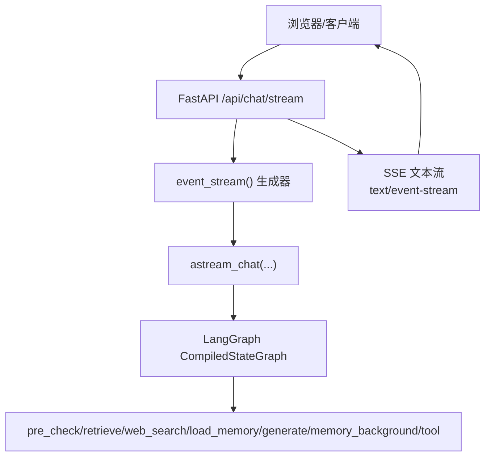
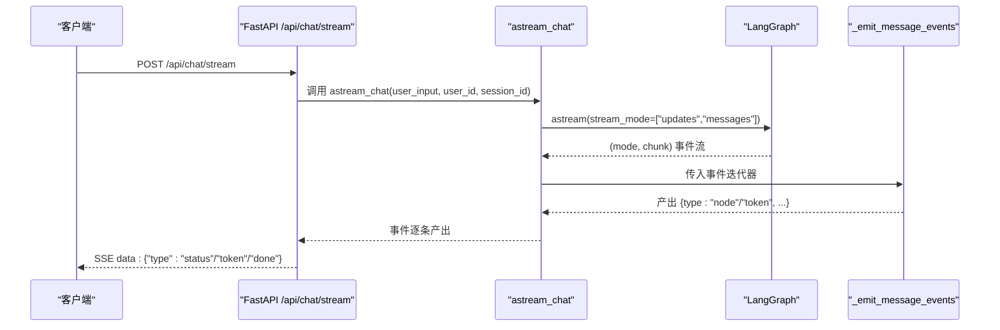
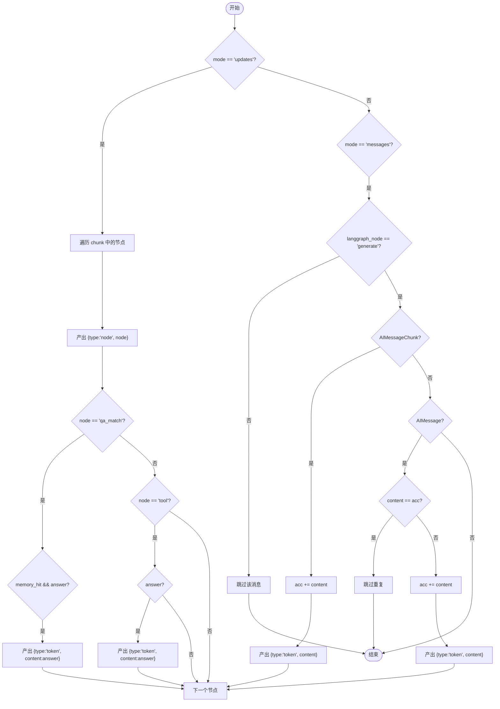
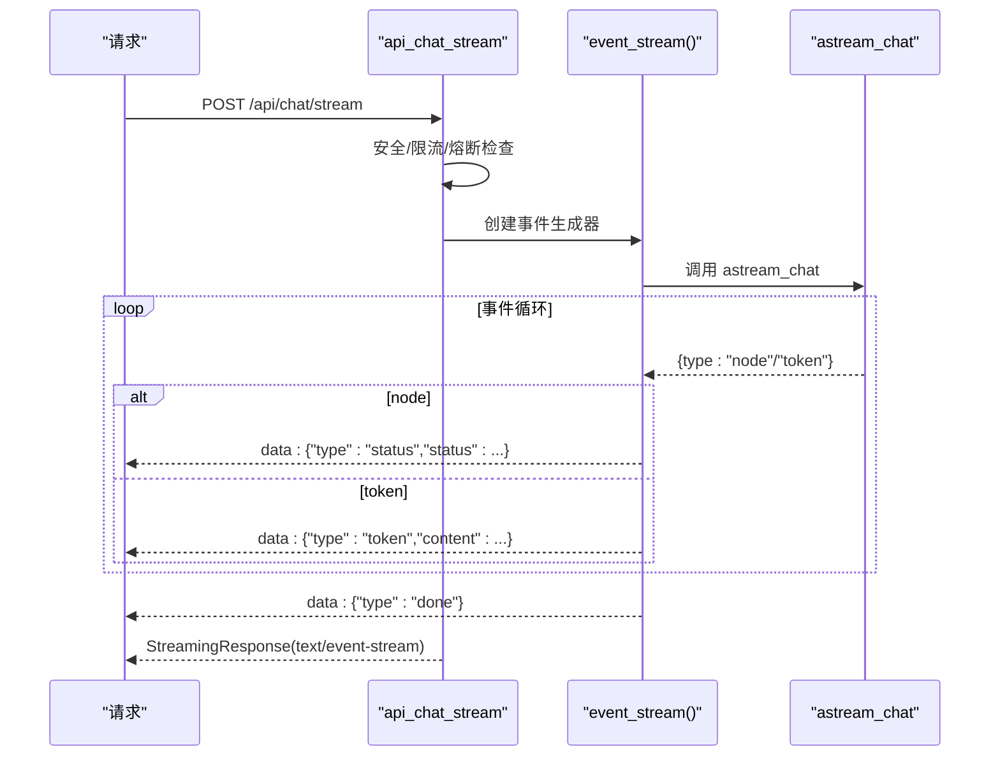
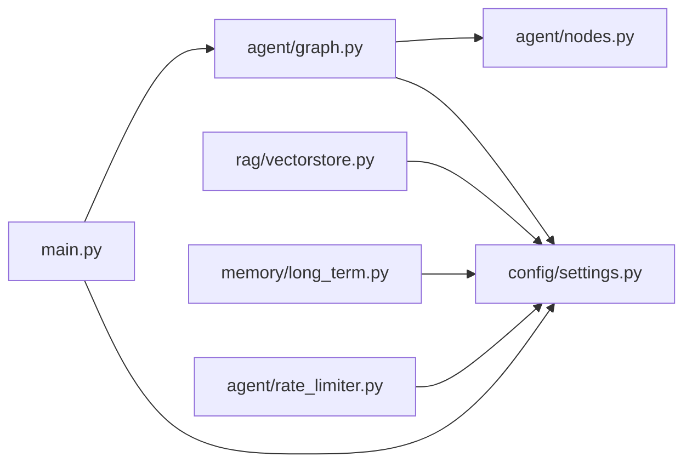

# 流式响应处理

<cite>
**本文引用的文件**
- [main.py](file://main.py)
- [agent/graph.py](file://agent/graph.py)
- [config/settings.py](file://config/settings.py)
- [static/index.html](file://static/index.html)
- [rag/vectorstore.py](file://rag/vectorstore.py)
- [agent/rate_limiter.py](file://agent/rate_limiter.py)
- [memory/long_term.py](file://memory/long_term.py)
</cite>

## 目录
1. [简介](#简介)
2. [项目结构](#项目结构)
3. [核心组件](#核心组件)
4. [架构总览](#架构总览)
5. [详细组件分析](#详细组件分析)
6. [依赖关系分析](#依赖关系分析)
7. [性能考量](#性能考量)
8. [故障诊断与监控](#故障诊断与监控)
9. [结论](#结论)
10. [附录：客户端集成指南](#附录客户端集成指南)

## 简介
本技术文档聚焦于“流式响应处理系统”，围绕以下目标展开：
- 深入解释 chat_stream 与 astream_chat 的实现原理，涵盖同步与异步流式处理、事件驱动架构、SSE 协议支持。
- 详细说明 _emit_message_events 的事件过滤与转换逻辑，包括节点事件透传、token 事件生成、重复消息过滤。
- 解析流式响应的性能优化策略，包括背压控制、缓冲区管理、连接保活等。
- 提供流式客户端集成指南（WebSocket 与 SSE），包含事件监听、错误重试等最佳实践。
- 给出流式处理的监控指标与故障诊断方法。

## 项目结构
本项目采用分层与模块化组织：
- Web 入口与 SSE 接口：main.py
- 工作流编排与流式入口：agent/graph.py
- 配置中心：config/settings.py
- 前端 SSE 消费示例：static/index.html
- 向量库连接与连接保活：rag/vectorstore.py
- 限流与熔断：agent/rate_limiter.py
- 长期记忆上下文构建：memory/long_term.py

图表来源
- [main.py:228-314](file://main.py#L228-L314)
- [agent/graph.py:208-254](file://agent/graph.py#L208-L254)

章节来源
- [main.py:1-387](file://main.py#L1-L387)
- [agent/graph.py:1-255](file://agent/graph.py#L1-L255)
- [config/settings.py:1-216](file://config/settings.py#L1-L216)

## 核心组件
- 同步流式入口 chat_stream：基于 LangGraph 的 graph.stream 同步迭代，统一转换为 node/token 事件。
- 异步流式入口 astream_chat：基于 graph.astream 异步迭代，用于 Web SSE 场景。
- 事件转换器 _emit_message_events：将 updates 与 messages 双模式事件统一为 node/token 事件，并实现去重与补发逻辑。
- SSE 接口 api_chat_stream：封装 event_stream 生成器，设置超时、状态提示、done 标记与熔断记录。
- 配置项 settings：集中管理流式超时、模型参数、RAG 参数、限流与熔断阈值等。

章节来源
- [agent/graph.py:141-254](file://agent/graph.py#L141-L254)
- [main.py:228-314](file://main.py#L228-L314)
- [config/settings.py:29-48](file://config/settings.py#L29-L48)

## 架构总览
整体采用事件驱动架构：
- 请求进入 FastAPI 路由后，校验输入安全、限流与熔断。
- 通过 astream_chat 调用 LangGraph 的 astream，以 updates 和 messages 双模式获取节点进度与 token 增量。
- _emit_message_events 对事件进行过滤、转换与去重，输出统一的 node/token 事件。
- main.py 的 event_stream 将 node 事件映射为 status 提示，将 token 事件直接转发给客户端；结束时发送 done。
- 使用 StreamingResponse 以 text/event-stream 类型返回，设置 keep-alive 与禁用代理缓冲。

图表来源
- [main.py:228-314](file://main.py#L228-L314)
- [agent/graph.py:208-254](file://agent/graph.py#L208-L254)

## 详细组件分析

### chat_stream（同步流式）
- 作用：提供同步版本的流式调用，便于 REPL 调试与本地测试。
- 流程：
  - 获取编译后的图实例。
  - 使用 graph.stream 以 ["updates", "messages"] 模式获取事件流。
  - 通过 yield from _emit_message_events 将事件统一为 node/token。
- 适用场景：非异步环境或需要阻塞式逐步消费的调试场景。

章节来源
- [agent/graph.py:190-205](file://agent/graph.py#L190-L205)
- [main.py:329-361](file://main.py#L329-L361)

### astream_chat（异步流式）
- 作用：Web SSE 接口的核心异步流式入口。
- 流程：
  - 获取编译后的图实例。
  - 使用 graph.astream 以 ["updates", "messages"] 模式获取事件流。
  - 维护 acc 累计字符串，用于跳过末尾完整消息重复。
  - 对 updates 中的 qa_match 与 tool 分支，若命中则直接补发 token 事件。
  - 对 messages 中仅透传 generate 节点的 AIMessageChunk/AIMessage，并按内容匹配去重。
- 关键点：
  - 仅透传 generate 节点的消息，避免内部路由/抽取等中间 LLM 调用污染输出。
  - 问答缓存命中与工具调用结果作为 token 事件即时返回，提升用户体验。

章节来源
- [agent/graph.py:208-254](file://agent/graph.py#L208-L254)

### _emit_message_events（事件过滤与转换）
- 职责：将 LangGraph 的双模式事件统一为 node/token 事件，并实现：
  - 节点事件透传：updates 模式下每个节点名都作为 node 事件发出。
  - 特殊路径补发：qa_match 命中时，将缓存答案作为 token 事件；tool 节点有 answer 时也补发 token。
  - Token 事件生成：仅透传 generate 节点的 AIMessageChunk/AIMessage，且按内容去重。
  - 重复消息过滤：维护 acc 累计已输出内容，当节点返回值产生的完整消息与 acc 一致时跳过。
- 复杂度：O(N) 遍历事件，acc 比较为 O(L)（L 为累计长度），总体线性时间。

图表来源
- [agent/graph.py:141-187](file://agent/graph.py#L141-L187)
- [agent/graph.py:229-254](file://agent/graph.py#L229-L254)

章节来源
- [agent/graph.py:141-187](file://agent/graph.py#L141-L187)
- [agent/graph.py:229-254](file://agent/graph.py#L229-L254)

### SSE 接口与事件流（api_chat_stream）
- 功能：
  - 输入安全校验、限流与熔断检查。
  - 设置流式整体超时保护，防止连接卡死。
  - 将 node 事件映射为 status 提示，token 事件直接转发，结束时发送 done。
  - 异常时发送 error 事件，并记录失败触发熔断。
- 关键特性：
  - 使用 asyncio.wait_for 限制每次事件读取的剩余时间，确保在整体超时内停止拉取。
  - 返回 StreamingResponse，设置 no-cache、keep-alive、X-Accel-Buffering=no 以适配 Nginx。

图表来源
- [main.py:228-314](file://main.py#L228-L314)
- [agent/graph.py:208-254](file://agent/graph.py#L208-L254)

章节来源
- [main.py:228-314](file://main.py#L228-L314)

### 前端 SSE 消费示例（static/index.html）
- 使用 fetch + ReadableStream 解析 SSE 数据流。
- 按 \n\n 分隔事件，逐行解析 data: 前缀的 JSON。
- 根据 type 字段分别处理 status、token、error，并在完成时清理状态提示。

章节来源
- [static/index.html:255-327](file://static/index.html#L255-L327)

## 依赖关系分析
- main.py 依赖 agent/graph.py 的 astream_chat 与 chat_stream。
- agent/graph.py 依赖 LangGraph 的 StateGraph 与 nodes 模块。
- config/settings.py 提供全局配置，被 main.py、agent/rate_limiter.py、rag/vectorstore.py 等模块使用。
- rag/vectorstore.py 配置 Milvus Lite 的连接保活参数，避免空闲时频繁 ping 导致断连。
- memory/long_term.py 提供长期记忆上下文构建，影响 generate 节点的 prompt 注入。

图表来源
- [main.py:228-314](file://main.py#L228-L314)
- [agent/graph.py:1-255](file://agent/graph.py#L1-L255)
- [config/settings.py:1-216](file://config/settings.py#L1-L216)
- [rag/vectorstore.py:42-76](file://rag/vectorstore.py#L42-L76)
- [memory/long_term.py:424-456](file://memory/long_term.py#L424-L456)
- [agent/rate_limiter.py:79-106](file://agent/rate_limiter.py#L79-L106)

章节来源
- [main.py:228-314](file://main.py#L228-L314)
- [agent/graph.py:1-255](file://agent/graph.py#L1-L255)
- [config/settings.py:1-216](file://config/settings.py#L1-L216)
- [rag/vectorstore.py:42-76](file://rag/vectorstore.py#L42-L76)
- [memory/long_term.py:424-456](file://memory/long_term.py#L424-L456)
- [agent/rate_limiter.py:79-106](file://agent/rate_limiter.py#L79-L106)

## 性能考量
- 背压控制：
  - 使用 async for 与 wait_for 控制事件拉取节奏，避免一次性堆积过多事件。
  - 前端按块解码与分片解析，减少内存占用。
- 缓冲区管理：
  - 服务端 StreamingResponse 直接写流，不缓存整段响应。
  - 前端使用 TextDecoder 流式解码，按 \n\n 切分事件，避免大缓冲。
- 连接保活：
  - 服务端设置 Connection: keep-alive 与 X-Accel-Buffering: no，适配 Nginx。
  - Milvus Lite 关闭无调用时的 gRPC ping，避免 too_many_pings GOAWAY 断连。
- 超时与降级：
  - 流式整体超时保护，超时后返回已生成的 token 并发送 done。
  - 熔断器在连续失败后拒绝请求，恢复冷却后试探。
- 预热与缓存：
  - 启动时预热 LLM 连接与 BM25 索引，降低首请求延迟。
  - 问答记忆缓存命中直接返回，跳过生成链路。

章节来源
- [main.py:262-314](file://main.py#L262-L314)
- [rag/vectorstore.py:42-76](file://rag/vectorstore.py#L42-L76)
- [config/settings.py:38-48](file://config/settings.py#L38-L48)
- [agent/rate_limiter.py:79-106](file://agent/rate_limiter.py#L79-L106)

## 故障诊断与监控
- 日志与告警：
  - 流式超时、异常、熔断触发均记录日志，便于定位问题。
  - 健康检查端点暴露服务状态与 checkpointer 类型。
- 监控指标建议：
  - 流式接口 QPS、平均延迟、P95/P99 延迟。
  - 事件吞吐（node/token/done/error 数量）。
  - 熔断器状态切换次数与持续时间。
  - LLM 调用成功率、重试次数、超时率。
  - RAG 检索命中率与耗时。
- 常见问题排查：
  - 前端未收到事件：检查 SSE 头、Nginx 缓冲配置、网络连通性。
  - 重复消息：确认 _emit_message_events 的 acc 去重逻辑是否生效。
  - 连接断开：检查 keep-alive 与 gRPC ping 配置，调整 Milvus Lite 保活参数。
  - 熔断误触发：检查后端依赖稳定性，适当提高熔断阈值或冷却时间。

章节来源
- [main.py:292-314](file://main.py#L292-L314)
- [main.py:317-326](file://main.py#L317-L326)
- [agent/rate_limiter.py:79-106](file://agent/rate_limiter.py#L79-L106)
- [rag/vectorstore.py:42-76](file://rag/vectorstore.py#L42-L76)

## 结论
本系统通过 LangGraph 的工作流编排与事件驱动架构，实现了高效的流式响应处理。chat_stream 与 astream_chat 分别提供同步与异步流式能力，_emit_message_events 负责事件过滤、转换与去重，确保输出的一致性与准确性。结合 SSE 协议、超时保护、熔断机制与连接保活策略，系统在性能与可靠性方面具备良好表现。前端通过标准 SSE 消费事件，易于集成与维护。

## 附录：客户端集成指南
- SSE 集成要点：
  - 使用 fetch + ReadableStream 接收 text/event-stream。
  - 按 \n\n 分隔事件，解析 data: 前缀的 JSON。
  - 处理 type 为 status、token、error、done 的事件。
  - 在网络异常时实现重试与退避策略。
- WebSocket 替代方案：
  - 如需双向通信或更复杂交互，可考虑 WebSocket，但需自行实现事件序列化与重连逻辑。
- 最佳实践：
  - 前端保持最小 UI 更新频率，避免频繁重绘。
  - 合理设置超时与重试，提升用户体验。
  - 记录错误日志与用户行为，便于后续分析与优化。

章节来源
- [static/index.html:255-327](file://static/index.html#L255-L327)
- [main.py:228-314](file://main.py#L228-L314)