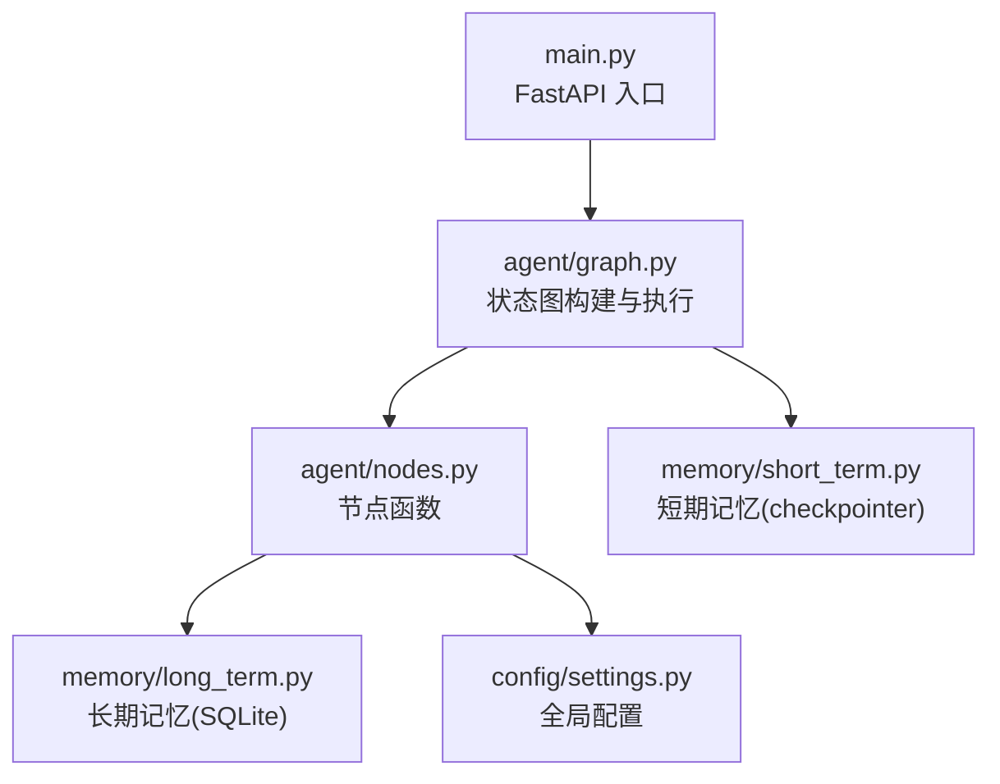
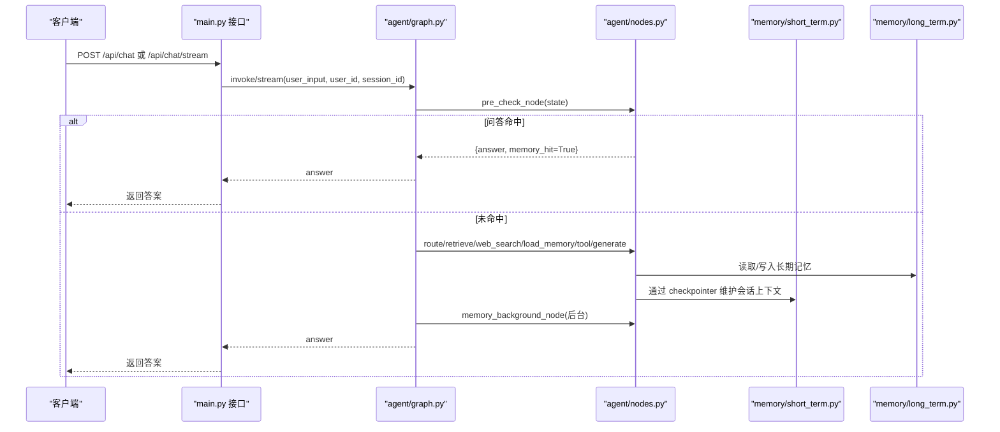
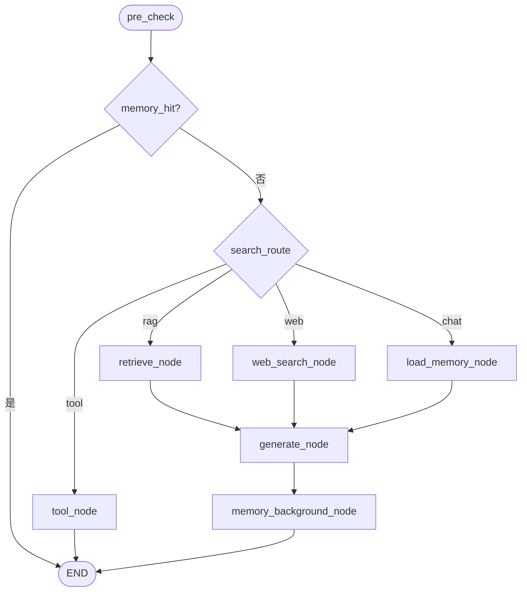
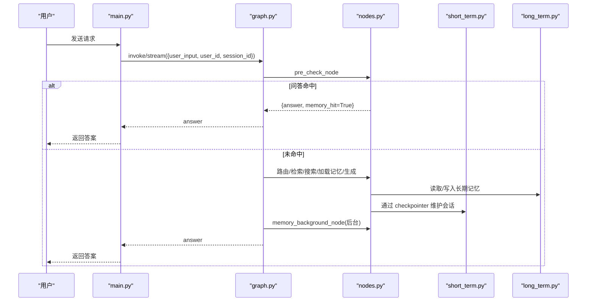
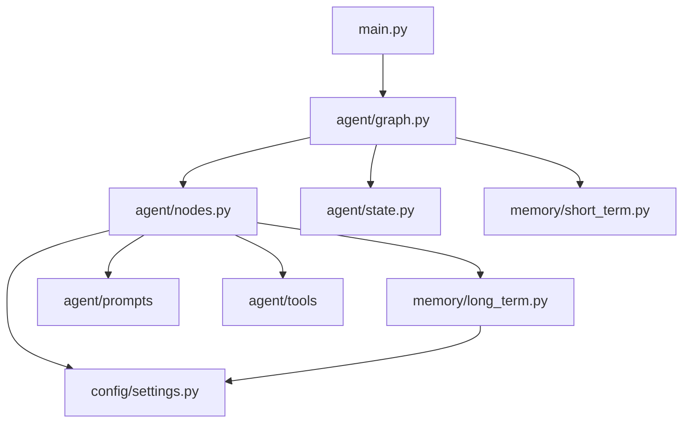

# 状态管理机制

<cite>
**本文引用的文件**
- [agent/state.py](file://agent/state.py)
- [agent/graph.py](file://agent/graph.py)
- [agent/nodes.py](file://agent/nodes.py)
- [memory/short_term.py](file://memory/short_term.py)
- [memory/long_term.py](file://memory/long_term.py)
- [config/settings.py](file://config/settings.py)
- [main.py](file://main.py)
</cite>

## 目录
1. [简介](#简介)
2. [项目结构](#项目结构)
3. [核心组件](#核心组件)
4. [架构总览](#架构总览)
5. [详细组件分析](#详细组件分析)
6. [依赖关系分析](#依赖关系分析)
7. [性能考量](#性能考量)
8. [故障排查指南](#故障排查指南)
9. [结论](#结论)
10. [附录](#附录)

## 简介
本技术文档聚焦 Agent 状态管理系统，围绕 AgentState 数据结构、节点间状态传递与合并策略、短期与长期记忆集成、checkpointer 工作机制、状态转换流程、序列化与持久化、错误处理与恢复等主题进行系统化说明。目标是帮助读者理解从请求进入到响应返回的完整状态变化过程，并掌握关键实现细节与优化点。

## 项目结构
系统基于 LangGraph StateGraph 编排工作流，核心模块包括：
- agent/state.py：定义 AgentState 状态结构
- agent/graph.py：构建并编译状态图，挂载 checkpointer，提供同步/异步调用入口
- agent/nodes.py：各节点实现（预检查、路由、检索、生成、工具调用、后台记忆更新）
- memory/short_term.py：短期记忆后端（进程内 MemorySaver）
- memory/long_term.py：长期记忆（SQLite 分层存储、摘要、问答缓存）
- config/settings.py：全局配置（LLM、RAG、记忆、限流熔断等）
- main.py：FastAPI 服务入口（HTTP/SSE 接口、健康检查、REPL）

**图表来源**
- [main.py:154-210](file://main.py#L154-L210)
- [agent/graph.py:44-102](file://agent/graph.py#L44-L102)
- [agent/nodes.py:93-151](file://agent/nodes.py#L93-L151)
- [memory/short_term.py:13-27](file://memory/short_term.py#L13-L27)
- [memory/long_term.py:50-125](file://memory/long_term.py#L50-L125)
- [config/settings.py:19-156](file://config/settings.py#L19-L156)

**章节来源**
- [agent/state.py:12-51](file://agent/state.py#L12-L51)
- [agent/graph.py:44-102](file://agent/graph.py#L44-L102)
- [memory/short_term.py:13-27](file://memory/short_term.py#L13-L27)
- [memory/long_term.py:50-125](file://memory/long_term.py#L50-L125)
- [config/settings.py:19-156](file://config/settings.py#L19-L156)
- [main.py:154-210](file://main.py#L154-L210)

## 核心组件
- AgentState：LangGraph 中流转的状态字典，包含消息历史、用户输入、会话标识、路由结果、检索上下文、长期记忆上下文、会话压缩摘要、问答命中标志、问题向量、最终回答、工具调用相关字段等。
- 状态图（StateGraph）：由 graph.py 构建，定义节点与边，支持条件分支与后台任务。
- 节点（nodes.py）：实现预检查、路由、检索、联网搜索、长期记忆加载、生成回答、工具调用、后台记忆更新等逻辑。
- 短期记忆（short_term.py）：基于 LangGraph MemorySaver，按 thread_id（= session_id）维护多轮对话上下文。
- 长期记忆（long_term.py）：SQLite 分层存储，包含用户画像、关键事实、历史摘要、会话压缩摘要、问答记忆缓存等。
- 配置（settings.py）：集中管理 LLM、RAG、记忆、限流熔断、工具调用等参数。

**章节来源**
- [agent/state.py:12-51](file://agent/state.py#L12-L51)
- [agent/graph.py:44-102](file://agent/graph.py#L44-L102)
- [agent/nodes.py:93-151](file://agent/nodes.py#L93-L151)
- [memory/short_term.py:13-27](file://memory/short_term.py#L13-L27)
- [memory/long_term.py:50-125](file://memory/long_term.py#L50-L125)
- [config/settings.py:19-156](file://config/settings.py#L19-L156)

## 架构总览
状态图工作流（简化）：
- START → pre_check（问答缓存匹配 + 路由判断）
  - 若问答命中 → END（直接复用历史答案）
  - 否则按 search_route 分流：
    - tool → END（工具调用直接返回）
    - rag → retrieve → generate → memory_background → END
    - web → web_search → generate → memory_background → END
    - chat → load_memory → generate → memory_background → END

**图表来源**
- [main.py:154-210](file://main.py#L154-L210)
- [agent/graph.py:44-102](file://agent/graph.py#L44-L102)
- [agent/nodes.py:93-151](file://agent/nodes.py#L93-L151)
- [memory/short_term.py:13-27](file://memory/short_term.py#L13-L27)
- [memory/long_term.py:50-125](file://memory/long_term.py#L50-L125)

## 详细组件分析

### AgentState 数据结构与设计原理
AgentState 是 LangGraph 状态图中的共享状态，使用 TypedDict 定义，关键字段及作用如下：
- messages：消息历史，采用 add_messages reducer 自动累加，保证多轮对话上下文连贯
- user_input：当前用户输入
- user_id：用户标识，用于长期记忆关联
- session_id：会话标识，用于短期记忆（checkpointer）隔离
- search_route：路由结果（rag/web/chat/tool），决定后续分支
- rag_context：RAG 或联网搜索结果，注入生成上下文
- long_term_context：长期记忆上下文（用户画像/已知事实/历史摘要）
- session_summary：会话压缩摘要（短期窗口超窗后的更早对话摘要）
- memory_hit：问答记忆命中标志，命中时跳过生成链路
- query_embedding：当前问题向量，供问答对落库复用
- answer：最终生成的回答
- tool_name/tool_params/tool_result/pending_confirmation/confirmation_context：工具调用相关字段，支持写操作确认与执行

设计要点：
- 消息历史使用 reducer 累加，避免覆盖丢失
- 其余字段为每次执行的覆盖型状态，便于节点增量更新
- 工具调用状态支持“待确认”机制，提升安全性

**章节来源**
- [agent/state.py:12-51](file://agent/state.py#L12-L51)

### 状态在节点间的传递机制
- 节点接收 state 作为输入，返回增量 dict，LangGraph 自动合并到状态
- 条件边根据状态字段（如 memory_hit、search_route）决定下一节点
- 工具调用路径直接返回 answer，不经过 generate 节点
- 生成完成后进入 memory_background 节点，后台执行记忆更新，不阻塞响应

**图表来源**
- [agent/nodes.py:93-151](file://agent/nodes.py#L93-L151)
- [agent/nodes.py:284-341](file://agent/nodes.py#L284-L341)
- [agent/nodes.py:344-360](file://agent/nodes.py#L344-L360)
- [agent/nodes.py:499-532](file://agent/nodes.py#L499-L532)
- [agent/nodes.py:630-643](file://agent/nodes.py#L630-L643)

**章节来源**
- [agent/graph.py:57-92](file://agent/graph.py#L57-L92)
- [agent/nodes.py:93-151](file://agent/nodes.py#L93-L151)

### 短期记忆与长期记忆的集成
- 短期记忆：基于 LangGraph MemorySaver，按 thread_id（= session_id）维护会话上下文，支持多轮对话连贯性；通过 get_checkpointer() 获取单例，类型标识为 memory
- 长期记忆：SQLite 分层存储，包含用户画像、关键事实、历史摘要、会话压缩摘要、问答记忆缓存；通过 build_memory_context 拼装上下文，summarize_and_store 增量合并摘要，save_session_summary 保存会话压缩摘要
- 集成方式：
  - 生成节点组装 prompt 时注入 long_term_context 和 session_summary
  - 后台节点周期性更新长期记忆摘要与会话压缩摘要
  - 问答记忆缓存命中时直接复用历史答案，减少 LLM 调用

**章节来源**
- [memory/short_term.py:13-27](file://memory/short_term.py#L13-L27)
- [memory/long_term.py:424-497](file://memory/long_term.py#L424-L497)
- [memory/long_term.py:613-633](file://memory/long_term.py#L613-L633)
- [agent/nodes.py:344-360](file://agent/nodes.py#L344-L360)
- [agent/nodes.py:499-532](file://agent/nodes.py#L499-L532)
- [agent/nodes.py:535-643](file://agent/nodes.py#L535-L643)

### checkpointer 的工作机制
- 默认使用进程内 MemorySaver，按 thread_id 维护状态快照
- 在 build_graph 中通过 compile(checkpointer=...) 挂载
- 支持传入 None（自动获取）、False（不挂载，用于评估无状态场景）
- 健康检查接口可查询当前 checkpointer 类型

**章节来源**
- [agent/graph.py:94-102](file://agent/graph.py#L94-L102)
- [memory/short_term.py:13-27](file://memory/short_term.py#L13-L27)
- [main.py:317-326](file://main.py#L317-L326)

### 状态转换流程图（请求到响应）

**图表来源**
- [main.py:154-210](file://main.py#L154-L210)
- [agent/graph.py:117-138](file://agent/graph.py#L117-L138)
- [agent/nodes.py:93-151](file://agent/nodes.py#L93-L151)
- [memory/short_term.py:13-27](file://memory/short_term.py#L13-L27)
- [memory/long_term.py:424-497](file://memory/long_term.py#L424-L497)

### 状态序列化和持久化
- 短期记忆：MemorySaver 将状态快照按 thread_id 序列化到内存，支持跨节点传递与恢复
- 长期记忆：SQLite 持久化，表结构包括 user_memory、user_prefs、summary_history、user_profile、user_facts、session_summary、qa_memory、memory_meta；开启 WAL 模式支持并发读
- 会话压缩摘要：当短期窗口超出时，将旧消息压缩为摘要并保存到 session_summary 表
- 问答记忆缓存：将问题向量与答案存入 qa_memory，相似问题直接复用

**章节来源**
- [memory/short_term.py:13-27](file://memory/short_term.py#L13-L27)
- [memory/long_term.py:50-125](file://memory/long_term.py#L50-L125)
- [memory/long_term.py:342-379](file://memory/long_term.py#L342-L379)
- [memory/long_term.py:729-800](file://memory/long_term.py#L729-L800)

### 错误处理与状态恢复
- 节点内部 try/except 兜底，失败时记录日志并降级（如检索失败返回空上下文、LLM 失败触发备用模型）
- 流式接口整体超时保护，超时后返回已生成 token 并标记成功
- 熔断器：连续失败达阈值后拒绝请求，恢复冷却后试探
- 问答命中短路：避免重复生成，提升性能
- 工具调用确认：写操作需用户确认，防止误操作

**章节来源**
- [agent/nodes.py:284-341](file://agent/nodes.py#L284-L341)
- [agent/nodes.py:467-496](file://agent/nodes.py#L467-L496)
- [main.py:228-314](file://main.py#L228-L314)
- [config/settings.py:143-156](file://config/settings.py#L143-L156)

## 依赖关系分析
- agent/graph.py 依赖 agent/nodes.py、agent/state.py、memory/short_term.py
- agent/nodes.py 依赖 memory/long_term.py、config/settings.py、agent/prompts、agent/tools
- memory/long_term.py 依赖 config/settings.py、sqlite3、langchain_core.messages
- main.py 依赖 agent/graph.py、agent/safety.py、agent/rate_limiter.py

**图表来源**
- [agent/graph.py:31-41](file://agent/graph.py#L31-L41)
- [agent/nodes.py:13-20](file://agent/nodes.py#L13-L20)
- [memory/long_term.py:17-23](file://memory/long_term.py#L17-L23)
- [main.py:187-199](file://main.py#L187-L199)

**章节来源**
- [agent/graph.py:31-41](file://agent/graph.py#L31-L41)
- [agent/nodes.py:13-20](file://agent/nodes.py#L13-L20)
- [memory/long_term.py:17-23](file://memory/long_term.py#L17-L23)
- [main.py:187-199](file://main.py#L187-L199)

## 性能考量
- 问答记忆缓存命中直接返回，避免 LLM 调用
- 后台记忆更新不阻塞主响应链路
- 短期记忆窗口+字符预算控制上下文长度，避免过长导致延迟
- 长期记忆分层预算（P0/P1/P2）确保关键信息不丢失
- 流式接口整体超时保护，防止连接卡死
- 启动时预热 LLM 连接与向量库，降低首请求延迟

[本节为通用性能讨论，无需特定文件引用]

## 故障排查指南
- 检查 checkpointer 类型：通过 /health 接口确认短期记忆后端
- 查看节点日志：检索/生成/记忆更新失败会打印日志
- 验证配置：确认 LLM、RAG、记忆相关配置是否正确
- 测试问答命中：调整 memory_qa_threshold 观察命中率
- 工具调用确认：检查 tool_confirmation_required 设置

**章节来源**
- [main.py:317-326](file://main.py#L317-L326)
- [agent/nodes.py:284-341](file://agent/nodes.py#L284-L341)
- [config/settings.py:114-156](file://config/settings.py#L114-L156)

## 结论
本状态管理系统以 AgentState 为核心，结合 LangGraph 状态图与短期/长期记忆，实现了高效、可靠、可扩展的智能体状态流转。通过问答缓存、后台记忆更新、流式输出、熔断限流等机制，保障了用户体验与系统稳定性。建议在生产环境中根据实际需求调整记忆预算、阈值与超时配置，并监控关键指标以持续优化。

[本节为总结，无需特定文件引用]

## 附录
- 状态字段说明：参考 agent/state.py
- 节点函数说明：参考 agent/nodes.py
- 长期记忆表结构：参考 memory/long_term.py
- 配置项说明：参考 config/settings.py
- 接口说明：参考 main.py

[本节为索引，无需特定文件引用]