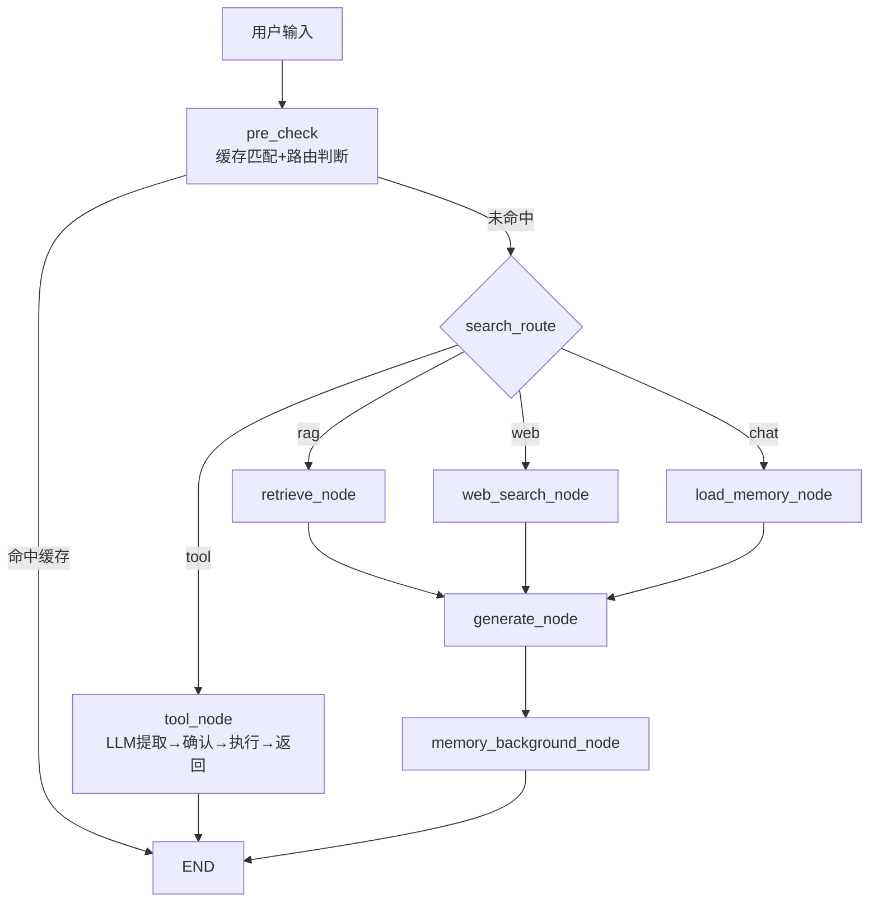
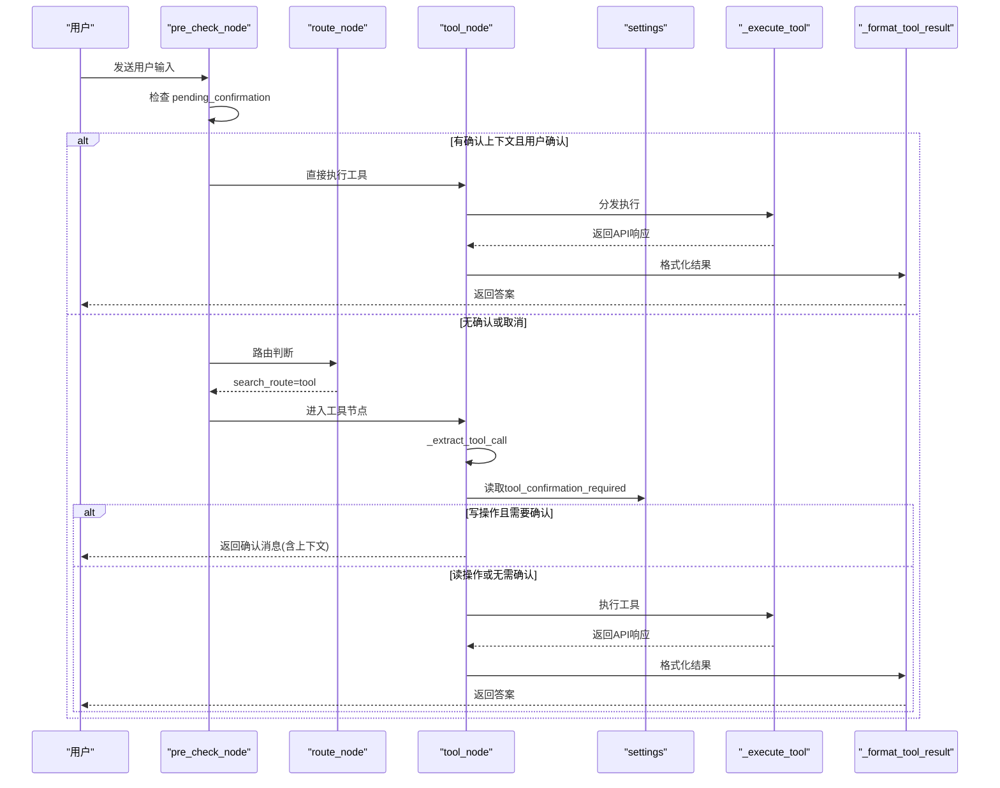
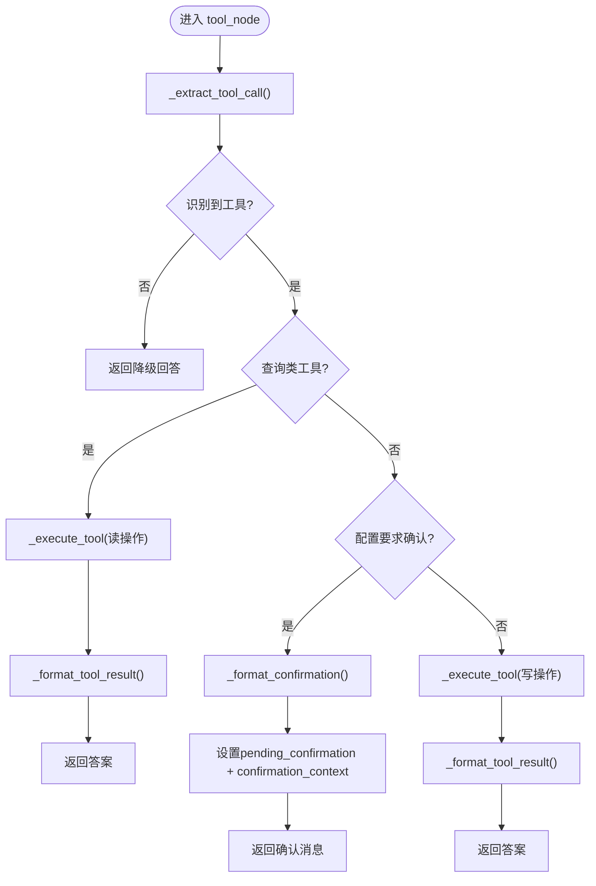
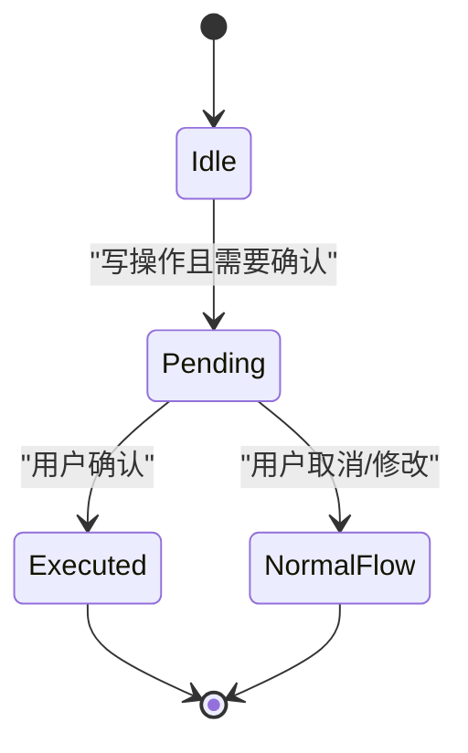
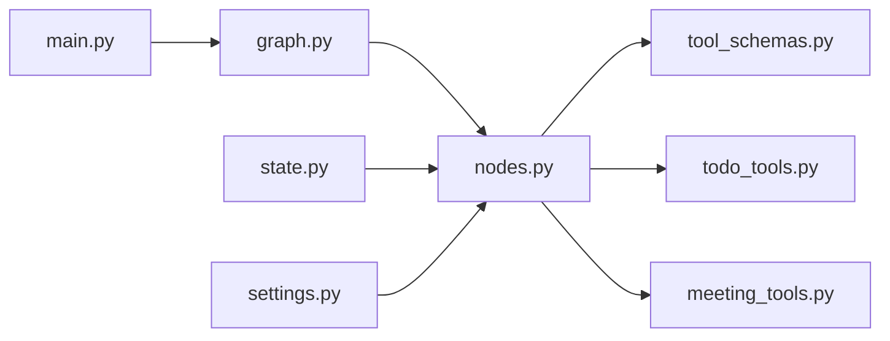

# 工具调用节点

<cite>
**本文引用的文件**
- [agent/nodes.py](file://agent/nodes.py)
- [agent/graph.py](file://agent/graph.py)
- [agent/state.py](file://agent/state.py)
- [agent/tools/tool_schemas.py](file://agent/tools/tool_schemas.py)
- [agent/tools/todo_tools.py](file://agent/tools/todo_tools.py)
- [agent/tools/meeting_tools.py](file://agent/tools/meeting_tools.py)
- [config/settings.py](file://config/settings.py)
- [main.py](file://main.py)
</cite>

## 目录
1. [简介](#简介)
2. [项目结构](#项目结构)
3. [核心组件](#核心组件)
4. [架构总览](#架构总览)
5. [详细组件分析](#详细组件分析)
6. [依赖关系分析](#依赖关系分析)
7. [性能考量](#性能考量)
8. [故障排查指南](#故障排查指南)
9. [结论](#结论)
10. [附录](#附录)

## 简介
本技术文档聚焦“工具调用节点”的实现机制与工程实践，覆盖 LLM 参数提取、工具路由分发、执行流程控制、确认机制与写操作保护、权限与安全策略、结果格式化、错误处理、状态管理、扩展接口与插件化方案、日志与监控、以及故障排查方法。目标是帮助开发者快速理解并安全地扩展工具能力。

## 项目结构
围绕工具调用相关的关键文件与职责：
- agent/nodes.py：定义 tool_node 及工具提取、执行、格式化的核心逻辑；包含预检查与确认流程。
- agent/graph.py：LangGraph 工作流编排，将 tool 节点接入整体流程，并支持流式事件透传。
- agent/state.py：AgentState 状态定义，包含工具调用相关的字段（tool_name、tool_params、tool_result、pending_confirmation、confirmation_context）。
- agent/tools/tool_schemas.py：工具 Schema 与提取 Prompt，声明可用工具、参数结构与读写分类。
- agent/tools/todo_tools.py / meeting_tools.py：具体工具执行器与结果/确认消息格式化。
- config/settings.py：全局配置，包括工具开关、确认策略等。
- main.py：Web 入口与安全过滤、限流熔断、流式 SSE 输出。

图表来源
- [agent/graph.py:44-102](file://agent/graph.py#L44-L102)
- [agent/nodes.py:93-151](file://agent/nodes.py#L93-L151)

章节来源
- [agent/graph.py:1-102](file://agent/graph.py#L1-L102)
- [agent/nodes.py:93-151](file://agent/nodes.py#L93-L151)

## 核心组件
- 工具调用节点 tool_node：负责从用户输入中识别工具意图、提取参数、根据读/写操作决定是否请求确认、执行工具并格式化结果返回。
- 工具 Schema 与提取 Prompt：集中声明工具名称、描述、参数结构，并提供 LLM 抽取提示词，保证可维护性与可扩展性。
- 工具执行器：按工具名分发到具体实现（待办/会议），封装外部 API 调用与异常处理。
- 状态管理：通过 AgentState 在节点间传递工具上下文与确认状态，确保多轮交互一致性。
- 配置开关：通过 settings 控制是否启用工具调用、是否需要写操作确认等。

章节来源
- [agent/nodes.py:647-780](file://agent/nodes.py#L647-L780)
- [agent/tools/tool_schemas.py:1-121](file://agent/tools/tool_schemas.py#L1-L121)
- [agent/state.py:12-51](file://agent/state.py#L12-L51)
- [config/settings.py:151-156](file://config/settings.py#L151-L156)

## 架构总览
工具调用在工作流中的位置与数据流：
- 预检查阶段：若存在 pending_confirmation，优先处理用户确认；否则进行问答记忆匹配与路由判断。
- 路由阶段：当 search_route=tool 时进入工具分支。
- 工具分支：LLM 提取工具名与参数 → 查询类直接执行 → 写操作需确认 → 确认后执行 → 格式化结果返回。
- 流式输出：tool 分支不经过 generate，但会在流事件中补发 answer 作为 token 事件，保证前端体验一致。

图表来源
- [agent/nodes.py:93-151](file://agent/nodes.py#L93-L151)
- [agent/nodes.py:647-780](file://agent/nodes.py#L647-L780)
- [agent/graph.py:141-255](file://agent/graph.py#L141-L255)

章节来源
- [agent/nodes.py:93-151](file://agent/nodes.py#L93-L151)
- [agent/nodes.py:647-780](file://agent/nodes.py#L647-L780)
- [agent/graph.py:141-255](file://agent/graph.py#L141-L255)

## 详细组件分析

### 工具调用节点 tool_node
- 功能要点：
  - LLM 参数提取：使用路由小模型与 TOOL_EXTRACT_PROMPT 从用户输入中提取工具名与参数。
  - 工具路由分发：根据工具名分发到对应执行器（待办/会议）。
  - 执行流程控制：查询类工具直接执行；写操作根据配置决定是否请求确认。
  - 结果格式化：统一调用工具模块的 format_* 函数生成用户可读文本。
  - 错误处理：捕获异常并返回结构化错误信息。
  - 状态管理：设置 tool_name、tool_params、tool_result、pending_confirmation、confirmation_context。

图表来源
- [agent/nodes.py:647-780](file://agent/nodes.py#L647-L780)
- [agent/tools/tool_schemas.py:116-121](file://agent/tools/tool_schemas.py#L116-L121)

章节来源
- [agent/nodes.py:647-780](file://agent/nodes.py#L647-L780)
- [agent/tools/tool_schemas.py:1-121](file://agent/tools/tool_schemas.py#L1-L121)

#### LLM 参数提取
- 使用路由小模型与专用 Prompt 提取 JSON 结构的工具调用信息。
- 失败时降级为 {"tool": "none"}，避免阻断主链路。

章节来源
- [agent/nodes.py:693-710](file://agent/nodes.py#L693-L710)
- [agent/tools/tool_schemas.py:7-26](file://agent/tools/tool_schemas.py#L7-L26)

#### 工具路由分发与执行
- 根据工具名动态导入并调用对应执行器。
- 统一异常捕获，返回 errcode/errmsg 结构。

章节来源
- [agent/nodes.py:712-747](file://agent/nodes.py#L712-L747)

#### 结果格式化
- 针对待办与会议两类工具分别格式化成功与失败场景。
- 失败时统一返回“操作失败: ...”。

章节来源
- [agent/nodes.py:749-765](file://agent/nodes.py#L749-L765)
- [agent/tools/todo_tools.py:47-84](file://agent/tools/todo_tools.py#L47-L84)
- [agent/tools/meeting_tools.py:131-183](file://agent/tools/meeting_tools.py#L131-L183)

### 工具确认机制与写操作保护
- 写操作集合：create_todo、create_meeting、cancel_meeting、update_meeting。
- 读操作集合：query_todos、query_meetings。
- 配置项 tool_confirmation_required 控制是否强制确认。
- 确认流程：
  - 工具节点返回确认消息，并设置 pending_confirmation 与 confirmation_context。
  - 下一轮 pre_check_node 检测到确认上下文且用户回复确认关键词时，直接执行工具。
  - 用户修改或取消则清除确认状态，走正常流程。

图表来源
- [agent/nodes.py:93-129](file://agent/nodes.py#L93-L129)
- [agent/nodes.py:647-691](file://agent/nodes.py#L647-L691)
- [agent/tools/tool_schemas.py:116-121](file://agent/tools/tool_schemas.py#L116-L121)

章节来源
- [agent/nodes.py:93-129](file://agent/nodes.py#L93-L129)
- [agent/nodes.py:647-691](file://agent/nodes.py#L647-L691)
- [agent/tools/tool_schemas.py:116-121](file://agent/tools/tool_schemas.py#L116-L121)

### 权限验证策略与安全控制
- 输入安全过滤：在 Web 入口对输入进行敏感词与 prompt 注入检测，拒绝不安全请求。
- 工具开关：tool_calling_enabled 控制是否允许工具路由；关闭后自动降级为 chat。
- 写操作保护：tool_confirmation_required 强制确认，防止误操作。
- 限流与熔断：按 user_id 限流，连续失败触发熔断，保护后端服务。

章节来源
- [main.py:166-185](file://main.py#L166-L185)
- [config/settings.py:135-156](file://config/settings.py#L135-L156)

### 工具执行结果格式化与错误处理
- 统一错误结构：errcode != 0 表示失败，返回 errmsg。
- 工具模块提供 format_* 函数，针对不同工具类型生成友好文本。
- 异常捕获：工具执行器内部 try/except 包裹，记录日志并返回错误。

章节来源
- [agent/nodes.py:749-765](file://agent/nodes.py#L749-L765)
- [agent/tools/todo_tools.py:47-84](file://agent/tools/todo_tools.py#L47-L84)
- [agent/tools/meeting_tools.py:131-183](file://agent/tools/meeting_tools.py#L131-L183)

### 状态管理
- AgentState 字段：
  - tool_name、tool_params、tool_result：记录工具调用上下文与结果。
  - pending_confirmation、confirmation_context：用于多轮确认交互。
- 节点间通过状态传递，确保流程连贯。

章节来源
- [agent/state.py:12-51](file://agent/state.py#L12-L51)

### 工具扩展接口与插件机制
- 扩展方式：
  - 在 tool_schemas.py 中新增工具 Schema 与提取 Prompt。
  - 在 nodes.py 的 _execute_tool 中添加新工具分发逻辑。
  - 在对应工具模块中实现 execute_* 与 format_* 函数。
- 建议：
  - 保持工具命名规范与参数结构清晰。
  - 每个工具独立模块，便于测试与维护。
  - 通过配置开关控制工具可用性。

章节来源
- [agent/tools/tool_schemas.py:29-121](file://agent/tools/tool_schemas.py#L29-L121)
- [agent/nodes.py:712-747](file://agent/nodes.py#L712-L747)

### 工具调用日志记录与性能监控
- 日志记录：
  - 工具提取失败、执行失败均打印日志，便于问题定位。
  - 路由、检索、搜索等关键路径均有日志输出。
- 性能优化：
  - 路由小模型用于轻量任务，降低延迟与成本。
  - 流式生成与 SSE 输出提升用户体验。
  - 启动预热 LLM 连接与向量库，减少首请求延迟。

章节来源
- [agent/nodes.py:198-211](file://agent/nodes.py#L198-L211)
- [agent/nodes.py:707-709](file://agent/nodes.py#L707-L709)
- [main.py:45-77](file://main.py#L45-L77)

## 依赖关系分析
- 工具调用依赖：
  - nodes.py 依赖 tool_schemas.py（Prompt 与 Schema）、todo_tools.py、meeting_tools.py（执行器）。
  - graph.py 编排 tool 节点与其他节点的关系。
  - state.py 定义状态结构。
  - settings.py 提供配置开关。
  - main.py 集成安全过滤、限流熔断与流式输出。

图表来源
- [agent/nodes.py:647-780](file://agent/nodes.py#L647-L780)
- [agent/graph.py:44-102](file://agent/graph.py#L44-L102)
- [agent/state.py:12-51](file://agent/state.py#L12-L51)
- [config/settings.py:151-156](file://config/settings.py#L151-L156)
- [main.py:166-185](file://main.py#L166-L185)

章节来源
- [agent/nodes.py:647-780](file://agent/nodes.py#L647-L780)
- [agent/graph.py:44-102](file://agent/graph.py#L44-L102)
- [agent/state.py:12-51](file://agent/state.py#L12-L51)
- [config/settings.py:151-156](file://config/settings.py#L151-L156)
- [main.py:166-185](file://main.py#L166-L185)

## 性能考量
- 路由小模型：用于意图识别与参数提取，降低延迟与成本。
- 流式输出：SSE 模式逐 token 推送，提升响应速度感知。
- 启动预热：预热 LLM 连接与向量库，减少首请求延迟。
- 后台记忆更新：不阻塞主响应链路。

章节来源
- [agent/nodes.py:46-60](file://agent/nodes.py#L46-L60)
- [main.py:45-77](file://main.py#L45-L77)
- [agent/graph.py:141-255](file://agent/graph.py#L141-L255)

## 故障排查指南
- 常见问题：
  - 工具提取失败：检查 TOOL_EXTRACT_PROMPT 与 LLM 路由模型配置。
  - 工具执行失败：查看工具模块日志与钉钉 API 返回码。
  - 确认流程异常：检查 pending_confirmation 与 confirmation_context 状态。
  - 工具未生效：确认 tool_calling_enabled 与 tool_confirmation_required 配置。
- 排查步骤：
  - 启用详细日志，观察路由与工具执行路径。
  - 使用 REPL 调试模式逐步验证工具调用。
  - 检查 Web 入口的安全过滤与限流熔断状态。

章节来源
- [agent/nodes.py:707-709](file://agent/nodes.py#L707-L709)
- [agent/nodes.py:744-747](file://agent/nodes.py#L744-L747)
- [main.py:166-185](file://main.py#L166-L185)

## 结论
工具调用节点通过 LLM 参数提取、工具路由分发、确认机制与写操作保护，实现了安全、可控的工具执行流程。结合状态管理与配置开关，系统具备良好的扩展性与可维护性。建议在生产环境中启用安全过滤、限流熔断与日志监控，确保稳定运行。

## 附录
- 工具 Schema 示例：见 tool_schemas.py。
- 工具执行器示例：见 todo_tools.py 与 meeting_tools.py。
- 配置项说明：见 settings.py。