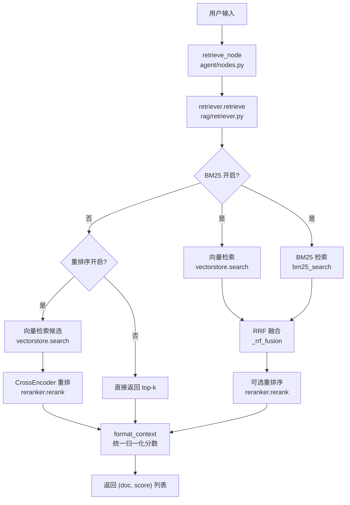
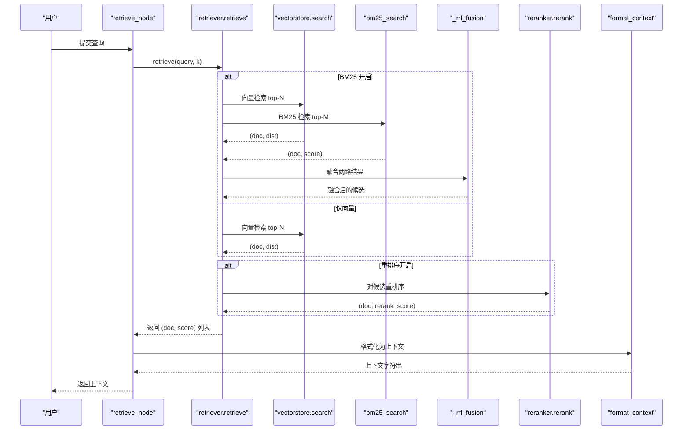
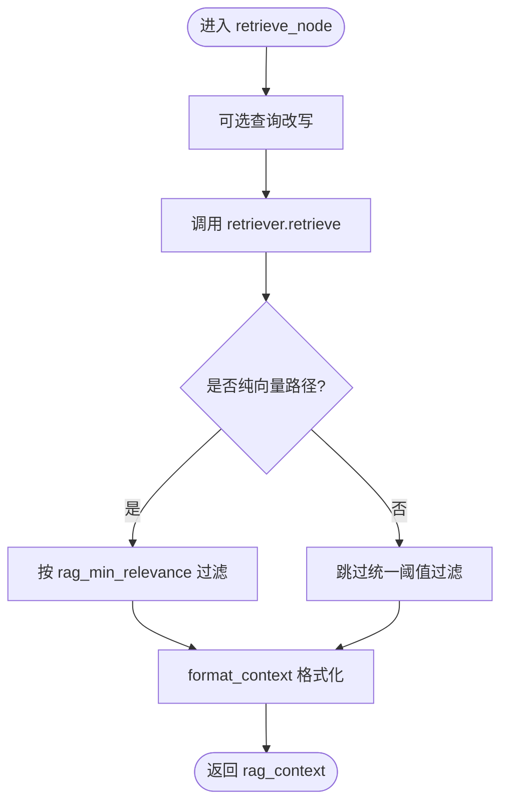
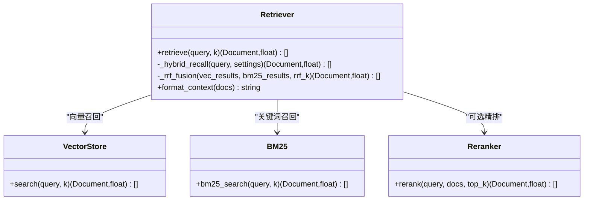
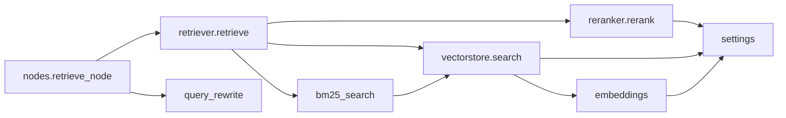

# 检索节点

<cite>
**本文引用的文件**
- [agent/nodes.py](file://agent/nodes.py)
- [rag/retriever.py](file://rag/retriever.py)
- [rag/vectorstore.py](file://rag/vectorstore.py)
- [rag/bm25.py](file://rag/bm25.py)
- [rag/reranker.py](file://rag/reranker.py)
- [rag/embeddings.py](file://rag/embeddings.py)
- [config/settings.py](file://config/settings.py)
- [evaluation/rag_eval.py](file://evaluation/rag_eval.py)
- [agent/query_rewrite.py](file://agent/query_rewrite.py)
</cite>

## 目录
1. [简介](#简介)
2. [项目结构](#项目结构)
3. [核心组件](#核心组件)
4. [架构总览](#架构总览)
5. [详细组件分析](#详细组件分析)
6. [依赖关系分析](#依赖关系分析)
7. [性能考虑](#性能考虑)
8. [故障排查指南](#故障排查指南)
9. [结论](#结论)
10. [附录](#附录)

## 简介
本技术文档聚焦“检索节点”的实现与优化，围绕 retrieve_node 的完整链路展开：向量检索、关键词检索（BM25）、混合检索策略（RRF 融合）、重排序（CrossEncoder）、相关性评分与结果排序、多源结果融合机制（权重分配、去重、质量评估），以及检索性能优化方案（索引优化、查询缓存、并行检索）和检索效果评估方法与调优指南。目标是帮助读者理解并高效调优该系统的检索能力。

## 项目结构
检索相关代码主要分布在以下模块：
- agent/nodes.py：工作流节点编排，retrieve_node 负责调用检索器并做阈值过滤与上下文格式化。
- rag/retriever.py：检索入口，支持 BM25 多路召回 + RRF 融合、纯向量检索、重排序等模式。
- rag/vectorstore.py：Milvus Lite 向量库封装，提供搜索、写入、统计等能力。
- rag/bm25.py：内存 BM25 索引与关键词检索。
- rag/reranker.py：CrossEncoder 重排序模型加载与打分。
- rag/embeddings.py：多模态/纯文本 Embedding 实现，供向量检索使用。
- config/settings.py：全局配置开关与参数（如 rerank、BM25、阈值、top-k 等）。
- evaluation/rag_eval.py：RAG 质量评估（检索相关性、忠实度、帮助度、答案相关性）。
- agent/query_rewrite.py：可选的查询改写，提升召回率。

图表来源
- [agent/nodes.py:285-321](file://agent/nodes.py#L285-L321)
- [rag/retriever.py:18-52](file://rag/retriever.py#L18-L52)
- [rag/vectorstore.py:164-184](file://rag/vectorstore.py#L164-L184)
- [rag/bm25.py:69-97](file://rag/bm25.py#L69-L97)
- [rag/reranker.py:54-98](file://rag/reranker.py#L54-L98)

章节来源
- [agent/nodes.py:285-321](file://agent/nodes.py#L285-L321)
- [rag/retriever.py:18-52](file://rag/retriever.py#L18-L52)
- [rag/vectorstore.py:164-184](file://rag/vectorstore.py#L164-L184)
- [rag/bm25.py:69-97](file://rag/bm25.py#L69-L97)
- [rag/reranker.py:54-98](file://rag/reranker.py#L54-L98)

## 核心组件
- retrieve_node：工作流中的检索节点，负责调用检索器、按配置进行相关性过滤、格式化上下文。
- retriever.retrieve：检索主流程，根据配置选择多路召回（BM25+向量）或单路向量，并进行重排序。
- vectorstore.search：Milvus 向量检索，返回带距离分数的候选集，支持低分过滤。
- bm25.bm25_search：内存 BM25 关键词检索，构建进程内索引，返回关键词匹配得分。
- reranker.rerank：CrossEncoder 精排，对候选 query-doc 对打分，输出更相关的 top-k。
- embeddings：Jina CLIP v2 或 BGE 文本/图像嵌入，支撑向量检索。
- settings：集中管理检索开关与参数（BM25、RRF k、top-k、重排序候选数、阈值等）。
- query_rewrite：可选查询改写，提高召回质量。
- rag_eval：RAG 质量评估工具，用于评测检索与生成效果。

章节来源
- [agent/nodes.py:285-321](file://agent/nodes.py#L285-L321)
- [rag/retriever.py:18-52](file://rag/retriever.py#L18-L52)
- [rag/vectorstore.py:164-184](file://rag/vectorstore.py#L164-L184)
- [rag/bm25.py:69-97](file://rag/bm25.py#L69-L97)
- [rag/reranker.py:54-98](file://rag/reranker.py#L54-L98)
- [rag/embeddings.py:29-180](file://rag/embeddings.py#L29-L180)
- [config/settings.py:54-100](file://config/settings.py#L54-L100)
- [agent/query_rewrite.py:26-59](file://agent/query_rewrite.py#L26-L59)
- [evaluation/rag_eval.py:63-121](file://evaluation/rag_eval.py#L63-L121)

## 架构总览
检索系统采用“召回 + 精排”的两阶段架构：
- 召回阶段：
  - 向量检索：基于 Milvus + Embedding 模型，返回语义相近的候选。
  - 关键词检索（可选）：BM25 内存索引，捕获精确匹配。
  - 多路召回融合：RRF（Reciprocal Rank Fusion）将向量与 BM25 结果按排名融合，不依赖原始分数方向。
- 精排阶段（可选）：
  - CrossEncoder 重排序：对候选逐对打分，得到更准确的 top-k。
- 后处理：
  - 相关性过滤：仅在纯向量路径下应用统一阈值过滤。
  - 上下文格式化：将结果转为字符串，包含来源、标题与归一化相关度展示。

图表来源
- [agent/nodes.py:285-321](file://agent/nodes.py#L285-L321)
- [rag/retriever.py:18-52](file://rag/retriever.py#L18-L52)
- [rag/vectorstore.py:164-184](file://rag/vectorstore.py#L164-L184)
- [rag/bm25.py:69-97](file://rag/bm25.py#L69-L97)
- [rag/reranker.py:54-98](file://rag/reranker.py#L54-L98)

## 详细组件分析

### retrieve_node：检索节点实现
- 功能：执行检索、按配置进行相关性过滤、格式化上下文。
- 关键点：
  - 查询改写：可启用 LLM 改写以提升召回。
  - 多路召回：由 retriever 内部决定（BM25+向量或仅向量）。
  - 相关性过滤：仅在纯向量路径下生效（避免与 rerank/BM25 分数语义冲突）。
  - 异常处理：检索失败时返回空上下文，保证主链路稳定。

图表来源
- [agent/nodes.py:285-321](file://agent/nodes.py#L285-L321)
- [agent/query_rewrite.py:26-59](file://agent/query_rewrite.py#L26-L59)
- [rag/retriever.py:18-52](file://rag/retriever.py#L18-L52)

章节来源
- [agent/nodes.py:285-321](file://agent/nodes.py#L285-L321)
- [agent/query_rewrite.py:26-59](file://agent/query_rewrite.py#L26-L59)

### retriever：多路召回与重排序
- 模式选择：
  - BM25 开启：向量检索 + BM25 并行召回 → RRF 融合 → 可选重排序 → top-k。
  - BM25 关闭 + 重排序开启：向量检索候选 → CrossEncoder 精排 → top-k。
  - BM25 关闭 + 重排序关闭：直接向量检索 top-k。
- RRF 融合：
  - 公式：score(d) = sum(1 / (k + rank))，rank 从 1 开始。
  - 优势：不依赖原始分数方向，统一向量距离与 BM25 分数；内容相同 chunk 合并分数，命中两路的文档得分更高。
- 重排序：
  - CrossEncoder 对 query-doc 对打分，分数越大越相关。
  - 失败回退到原始向量结果，保证鲁棒性。

图表来源
- [rag/retriever.py:18-110](file://rag/retriever.py#L18-L110)
- [rag/vectorstore.py:164-184](file://rag/vectorstore.py#L164-L184)
- [rag/bm25.py:69-97](file://rag/bm25.py#L69-L97)
- [rag/reranker.py:54-98](file://rag/reranker.py#L54-L98)

章节来源
- [rag/retriever.py:18-110](file://rag/retriever.py#L18-L110)
- [rag/vectorstore.py:164-184](file://rag/vectorstore.py#L164-L184)
- [rag/bm25.py:69-97](file://rag/bm25.py#L69-L97)
- [rag/reranker.py:54-98](file://rag/reranker.py#L54-L98)

### vectorstore：Milvus 向量检索
- 功能：
  - 初始化 Milvus Lite 单例，支持本地持久化。
  - 文本与图像文档共存于同一 collection，通过动态字段存储 metadata。
  - similarity_search_with_score 返回 (doc, distance)，distance 越小越相关。
  - 支持低分过滤（rag_score_filter），为空则回退原始结果。
- 并发与一致性：
  - 写操作加锁，避免文件监听线程与检索并发写入冲突。
  - flush 确保写入磁盘后可查。

章节来源
- [rag/vectorstore.py:29-76](file://rag/vectorstore.py#L29-L76)
- [rag/vectorstore.py:79-106](file://rag/vectorstore.py#L79-L106)
- [rag/vectorstore.py:109-161](file://rag/vectorstore.py#L109-L161)
- [rag/vectorstore.py:164-184](file://rag/vectorstore.py#L164-L184)

### bm25：关键词检索
- 功能：
  - 从向量库拉取文本文档构建内存 BM25 索引（字符级切分，无需额外分词）。
  - 检索时返回 (doc, score)，score 越大越相关。
  - 重置索引以支持重建后的重新构建。
- 特点：
  - 与向量检索互补，提升精确匹配召回率。
  - 无依赖 jieba，中文兼容性好。

章节来源
- [rag/bm25.py:22-66](file://rag/bm25.py#L22-L66)
- [rag/bm25.py:69-97](file://rag/bm25.py#L69-L97)
- [rag/bm25.py:100-106](file://rag/bm25.py#L100-L106)

### reranker：重排序
- 功能：
  - 延迟加载 CrossEncoder 模型（bge-reranker-base）。
  - 对候选 query-doc 对打分，返回 top-k。
  - 失败回退到原始向量结果。
- 性能：
  - CPU/GPU 设备可配，max_length=512。
  - 国内镜像加速下载。

章节来源
- [rag/reranker.py:30-51](file://rag/reranker.py#L30-L51)
- [rag/reranker.py:54-98](file://rag/reranker.py#L54-L98)

### embeddings：向量化
- 功能：
  - Jina CLIP v2：多模态（文本+图像）统一向量空间，维度 1024。
  - BGE：纯文本快速编码，维度 512。
  - 自动选择模型（根据配置 embedding_model）。
- 特点：
  - 延迟加载模型，首次调用时初始化。
  - 文本与图像均进行 L2 归一化。

章节来源
- [rag/embeddings.py:29-129](file://rag/embeddings.py#L29-L129)
- [rag/embeddings.py:131-180](file://rag/embeddings.py#L131-L180)

### settings：检索参数与开关
- 关键参数：
  - BM25：rag_bm25_enabled、rag_bm25_candidate_count、rag_rrf_k。
  - 重排序：rerank_enabled、rerank_model、rerank_device、rerank_candidate_count、rerank_top_k。
  - 向量检索：milvus_index_type、milvus_metric_type、rag_top_k、rag_score_filter、rag_min_relevance。
  - 查询改写：rag_query_rewrite_enabled。
- 作用：
  - 控制检索策略、候选数量、阈值、设备与模型选择。

章节来源
- [config/settings.py:54-100](file://config/settings.py#L54-L100)

### query_rewrite：查询改写
- 功能：
  - 用 LLM 将用户问题改写为更利于检索的形式（补全主语、去除口语化）。
  - 短查询不触发改写，失败回退原始查询。
- 价值：
  - 提升复杂问题的召回率。

章节来源
- [agent/query_rewrite.py:26-59](file://agent/query_rewrite.py#L26-L59)

## 依赖关系分析
- retrieve_node 依赖 retriever、settings、query_rewrite。
- retriever 依赖 vectorstore、bm25、reranker。
- vectorstore 依赖 embeddings、settings。
- bm25 依赖 vectorstore（获取文本文档）。
- reranker 依赖 settings（模型与设备）。
- embeddings 依赖 settings（模型名与设备）。
- rag_eval 依赖 settings（评判模型）。

图表来源
- [agent/nodes.py:285-321](file://agent/nodes.py#L285-L321)
- [rag/retriever.py:18-52](file://rag/retriever.py#L18-L52)
- [rag/vectorstore.py:164-184](file://rag/vectorstore.py#L164-L184)
- [rag/bm25.py:69-97](file://rag/bm25.py#L69-L97)
- [rag/reranker.py:54-98](file://rag/reranker.py#L54-L98)
- [rag/embeddings.py:164-180](file://rag/embeddings.py#L164-L180)
- [agent/query_rewrite.py:26-59](file://agent/query_rewrite.py#L26-L59)

章节来源
- [agent/nodes.py:285-321](file://agent/nodes.py#L285-L321)
- [rag/retriever.py:18-52](file://rag/retriever.py#L18-L52)
- [rag/vectorstore.py:164-184](file://rag/vectorstore.py#L164-L184)
- [rag/bm25.py:69-97](file://rag/bm25.py#L69-L97)
- [rag/reranker.py:54-98](file://rag/reranker.py#L54-L98)
- [rag/embeddings.py:164-180](file://rag/embeddings.py#L164-L180)
- [agent/query_rewrite.py:26-59](file://agent/query_rewrite.py#L26-L59)

## 性能考虑
- 索引优化：
  - Milvus 索引类型与度量：FLAT + L2（当前配置），适合中小规模数据；大规模可评估其他索引类型。
  - 向量维度：Jina CLIP v2 为 1024，BGE 为 512；维度越高精度可能更好但计算成本更高。
  - 切片大小与重叠：rag_chunk_size、rag_chunk_overlap 影响召回粒度与重复度。
- 查询缓存：
  - 问答记忆缓存：memory_qa_cache_enabled，相似问题直接复用历史答案，减少 LLM 调用。
  - BM25 索引进程内单例：避免重复构建。
  - Embedding 与重排序模型延迟加载与单例：减少启动开销。
- 并行检索：
  - BM25 与向量检索并行召回，缩短整体延迟。
  - 写操作加锁保护，读操作（search）无需锁，提升并发读取性能。
- 重排序成本：
  - CrossEncoder 计算量大，建议合理设置 rerank_candidate_count 与 rerank_top_k，平衡精度与延迟。
- 网络与模型加载：
  - HuggingFace 镜像加速下载模型。
  - gRPC keepalive 配置避免频繁 ping 导致断连。

[本节为通用性能讨论，未直接分析具体文件]

## 故障排查指南
- 检索失败：
  - 检查 Milvus 连接与集合是否存在；查看日志中 flush 失败告警。
  - 确认 BM25 索引是否构建成功（无文本文档时会为空）。
  - 重排序模型加载失败会回退到原始向量结果，检查设备与模型名称。
- 相关性过滤无效：
  - 仅在纯向量路径下生效；若开启 rerank/BM25，统一阈值不适用。
  - 调整 rag_min_relevance 与 rag_score_filter 以匹配业务需求。
- 性能瓶颈：
  - 降低 rerank_candidate_count 或关闭 rerank 以降低延迟。
  - 增大 BM25 候选数或调整 RRF k 以改善召回。
- 评估指标异常：
  - 检查评估样本字段（question、answer、reference_context、reference_docs）是否正确传入。
  - 评判模型配置（llm_judge_model）是否可用。

章节来源
- [rag/vectorstore.py:97-106](file://rag/vectorstore.py#L97-L106)
- [rag/bm25.py:22-66](file://rag/bm25.py#L22-L66)
- [rag/reranker.py:54-98](file://rag/reranker.py#L54-L98)
- [agent/nodes.py:285-321](file://agent/nodes.py#L285-L321)
- [evaluation/rag_eval.py:63-121](file://evaluation/rag_eval.py#L63-L121)

## 结论
检索节点通过“召回 + 精排”的两阶段架构，结合向量检索与关键词检索的多路召回、RRF 融合与 CrossEncoder 重排序，实现了高召回与高精度的平衡。通过合理的参数配置（BM25、RRF、top-k、阈值）与性能优化（索引、缓存、并行），可在不同场景下取得良好效果。配合 RAG 质量评估工具，可系统化地评测与调优检索效果。

[本节为总结，未直接分析具体文件]

## 附录

### 检索参数动态调整与相关性评分
- 动态调整：
  - BM25 开关与候选数：rag_bm25_enabled、rag_bm25_candidate_count。
  - RRF 常数：rag_rrf_k，影响融合平滑度。
  - 重排序候选数与 top-k：rerank_candidate_count、rerank_top_k。
  - 向量检索阈值：rag_score_filter（过滤低相关度）、rag_min_relevance（注入上下文阈值）。
- 相关性评分：
  - 向量检索：L2 距离，越小越相关；在 nodes 层使用 1/(1+|score|) 归一化展示。
  - BM25：关键词匹配得分，越大越相关；RRF 仅依赖排名，不直接使用原始分数。
  - 重排序：CrossEncoder 打分，越大越相关；失败回退到原始结果。

章节来源
- [config/settings.py:54-100](file://config/settings.py#L54-L100)
- [rag/retriever.py:78-110](file://rag/retriever.py#L78-L110)
- [agent/nodes.py:305-317](file://agent/nodes.py#L305-L317)

### 多源检索结果融合机制
- 权重分配：
  - RRF 融合不依赖原始分数方向，仅依据排名；命中两路的文档得分更高。
- 去重策略：
  - 以 page_content 作为键合并相同片段，累加融合分数。
- 质量评估：
  - 重排序进一步精排，提升最终 top-k 的相关性。
  - 纯向量路径下使用统一阈值过滤低质上下文。

章节来源
- [rag/retriever.py:78-110](file://rag/retriever.py#L78-L110)
- [agent/nodes.py:305-317](file://agent/nodes.py#L305-L317)

### 检索效果评估方法与调优指南
- 评估维度：
  - 检索相关性：参考文档是否与问题相关。
  - 忠实度：答案是否基于检索上下文（无幻觉）。
  - 帮助度：回答对用户是否有用。
  - 答案相关性：回答是否切题。
- 调优建议：
  - 提升召回：开启 BM25、增大候选数、调整 RRF k。
  - 提升精度：开启重排序、调整 rerank_candidate_count 与 top-k。
  - 控制噪声：调整 rag_min_relevance 与 rag_score_filter。
  - 查询优化：启用查询改写，尤其对复杂问题。

章节来源
- [evaluation/rag_eval.py:63-121](file://evaluation/rag_eval.py#L63-L121)
- [config/settings.py:54-100](file://config/settings.py#L54-L100)
- [agent/query_rewrite.py:26-59](file://agent/query_rewrite.py#L26-L59)