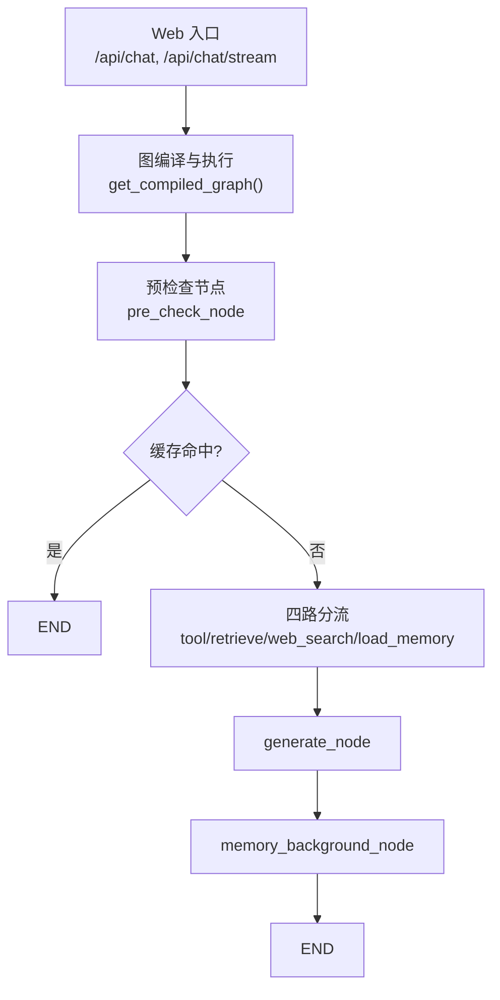
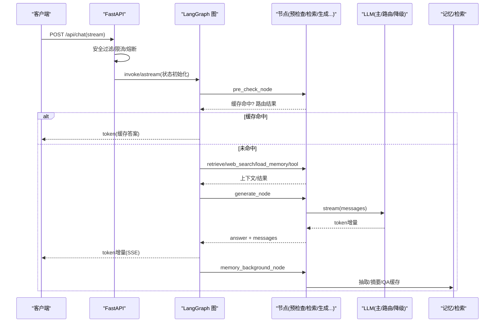
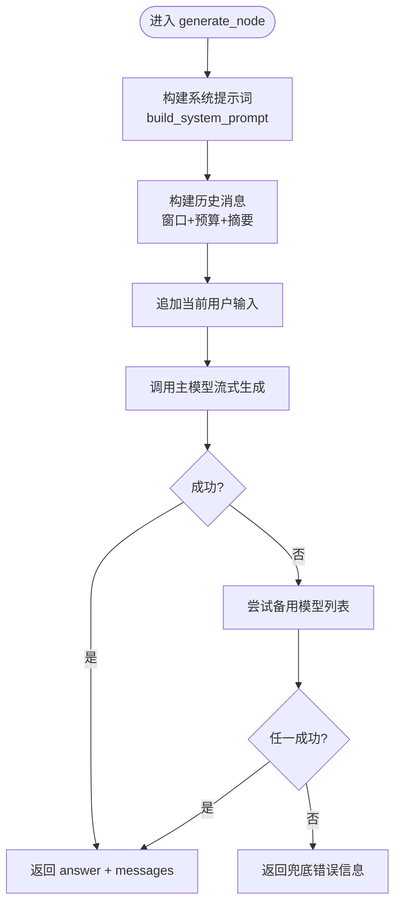
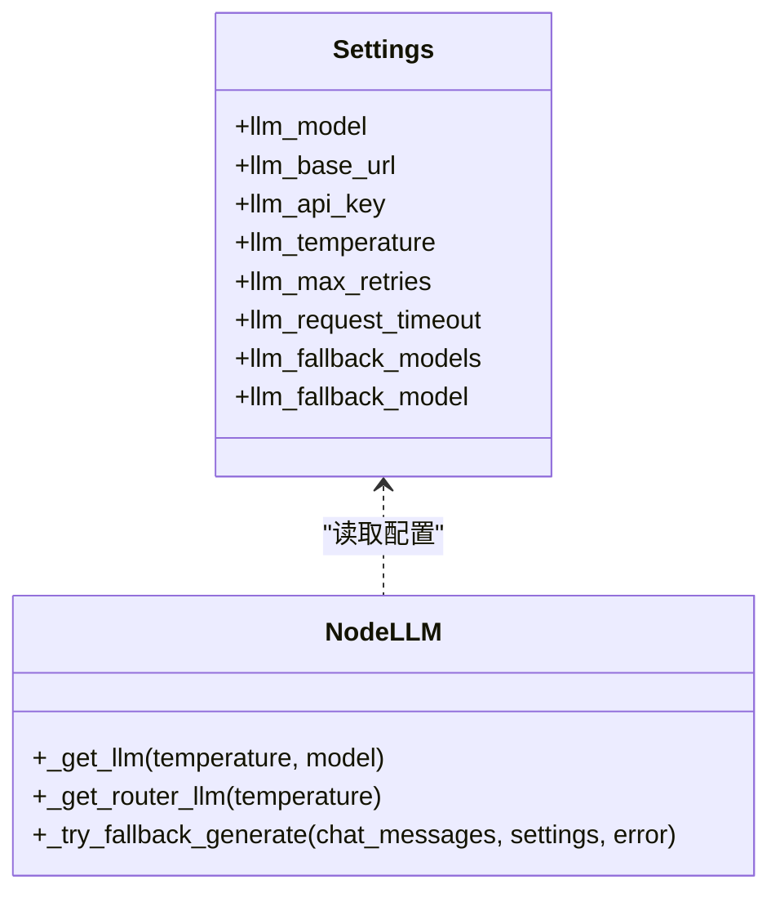
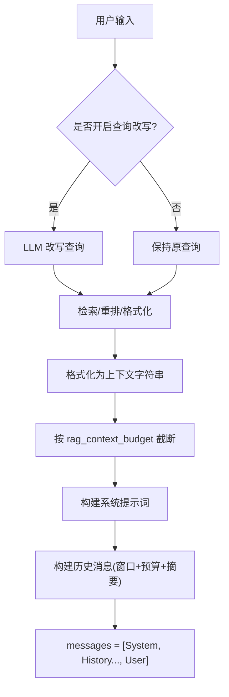
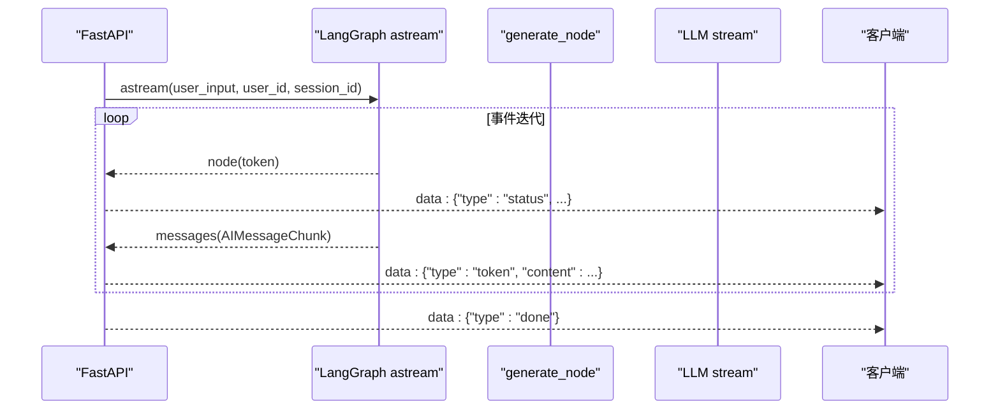
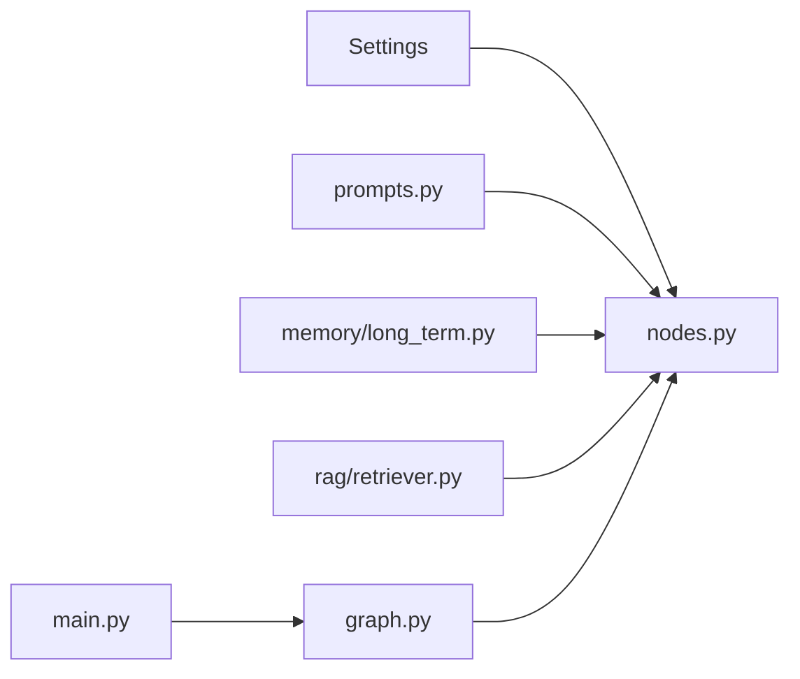

# 生成节点

<cite>
**本文引用的文件**
- [agent/nodes.py](file://agent/nodes.py)
- [agent/graph.py](file://agent/graph.py)
- [config/settings.py](file://config/settings.py)
- [main.py](file://main.py)
- [agent/prompts.py](file://agent/prompts.py)
- [memory/long_term.py](file://memory/long_term.py)
- [rag/retriever.py](file://rag/retriever.py)
- [agent/query_rewrite.py](file://agent/query_rewrite.py)
- [agent/safety.py](file://agent/safety.py)
</cite>

## 目录
1. [简介](#简介)
2. [项目结构](#项目结构)
3. [核心组件](#核心组件)
4. [架构总览](#架构总览)
5. [详细组件分析](#详细组件分析)
6. [依赖关系分析](#依赖关系分析)
7. [性能考量](#性能考量)
8. [故障排查指南](#故障排查指南)
9. [结论](#结论)
10. [附录](#附录)

## 简介
本技术文档聚焦“生成节点”的实现与优化，围绕 LLM 调用封装、提示词工程、流式响应处理、模型选择策略、参数调优（温度控制）、上下文构建、知识注入、答案过滤等后处理逻辑展开。同时给出质量评估、安全过滤、合规检查以及性能优化方案（模型缓存、批处理、并发控制）的落地实践。

## 项目结构
- 工作流编排：通过 LangGraph StateGraph 将预检查、检索、联网搜索、长期记忆加载、工具调用、生成回答、后台记忆更新等节点串联，形成可路由、可扩展的智能体流水线。
- 配置管理：集中化配置涵盖 LLM、Embedding、向量库、RAG、记忆、安全、限流熔断、工具调用开关等。
- 检索与重排：支持向量检索、BM25 多路召回、RRF 融合、CrossEncoder 重排序，并格式化上下文供生成节点使用。
- 记忆系统：分层结构化长期记忆（画像/事实/摘要/会话压缩），问答记忆缓存用于相似问题直接复用答案。
- 安全与限流：输入安全过滤、按用户限流、熔断器保护后端服务。

图表来源
- [main.py:154-209](file://main.py#L154-L209)
- [agent/graph.py:44-102](file://agent/graph.py#L44-L102)

章节来源
- [agent/graph.py:1-102](file://agent/graph.py#L1-L102)
- [main.py:154-209](file://main.py#L154-L209)

## 核心组件
- 生成节点 generate_node：组装系统提示词、历史消息、当前输入，调用主模型流式生成；失败自动降级到备用模型。
- 路由与分流：基于关键词与轻量 LLM 判断走 RAG、联网搜索、工具或闲聊路径。
- 上下文构建：长期记忆分节注入（画像/事实/摘要）、RAG 上下文字预算截断、会话压缩摘要防丢失。
- 流式响应：LLM stream 逐 token 累加，SSE 透传增量，整体超时保护。
- 安全与限流：输入安全过滤、限流、熔断。

章节来源
- [agent/nodes.py:499-532](file://agent/nodes.py#L499-L532)
- [agent/nodes.py:454-464](file://agent/nodes.py#L454-L464)
- [agent/nodes.py:467-496](file://agent/nodes.py#L467-L496)
- [agent/prompts.py:41-69](file://agent/prompts.py#L41-L69)
- [main.py:228-314](file://main.py#L228-L314)

## 架构总览
下图展示从 Web 请求到生成回答的端到端流程，包括安全校验、限流熔断、图执行、流式输出与后台记忆更新。

图表来源
- [main.py:228-314](file://main.py#L228-L314)
- [agent/graph.py:190-255](file://agent/graph.py#L190-L255)
- [agent/nodes.py:93-151](file://agent/nodes.py#L93-L151)
- [agent/nodes.py:284-341](file://agent/nodes.py#L284-L341)
- [agent/nodes.py:499-532](file://agent/nodes.py#L499-L532)

## 详细组件分析

### 生成节点 generate_node
- 功能：组装系统提示词、历史消息（窗口+预算+更早对话摘要）、当前输入，调用主模型流式生成；异常时自动尝试备用模型列表。
- 关键实现要点：
  - 系统提示词由 build_system_prompt 动态拼接长期记忆与 RAG 上下文，并按 rag_context_budget 截断。
  - 历史消息通过 build_chat_history 进行窗口裁剪与预算控制，超出部分以会话压缩摘要形式注入，避免硬丢导致上下文断裂。
  - 流式生成通过 _stream_answer 逐 token 累加完整回答，便于状态与记忆使用。
  - 降级策略：主模型失败时依次尝试 llm_fallback_models 或 llm_fallback_model，全部失败返回友好错误信息。

图表来源
- [agent/nodes.py:499-532](file://agent/nodes.py#L499-L532)
- [agent/nodes.py:454-464](file://agent/nodes.py#L454-L464)
- [agent/nodes.py:467-496](file://agent/nodes.py#L467-L496)
- [agent/prompts.py:41-69](file://agent/prompts.py#L41-L69)

章节来源
- [agent/nodes.py:499-532](file://agent/nodes.py#L499-L532)
- [agent/nodes.py:454-464](file://agent/nodes.py#L454-L464)
- [agent/nodes.py:467-496](file://agent/nodes.py#L467-L496)
- [agent/prompts.py:41-69](file://agent/prompts.py#L41-L69)

### LLM 调用封装与模型选择策略
- 主模型获取：_get_llm 统一封装 ChatOpenAI，读取配置中的模型名、基地址、API Key、温度、重试次数与超时。
- 路由小模型：_get_router_llm 用于路由判断、工具参数抽取等轻量任务，temperature=0.0 保证稳定性。
- 模型选择策略：
  - 默认主模型为 llm_model（如 qwen-plus），路由小模型为 llm_router_model（如 qwen-turbo）。
  - 主模型失败时，优先尝试 llm_fallback_models（逗号分隔优先级列表），回退到 llm_fallback_model。
  - 启动预热：在应用启动时后台线程对路由小模型与主模型发起最小请求，建立 TLS/DNS/连接池，降低首请求延迟。

图表来源
- [config/settings.py:29-48](file://config/settings.py#L29-L48)
- [agent/nodes.py:23-60](file://agent/nodes.py#L23-L60)
- [agent/nodes.py:467-496](file://agent/nodes.py#L467-L496)
- [main.py:45-77](file://main.py#L45-L77)

章节来源
- [agent/nodes.py:23-60](file://agent/nodes.py#L23-L60)
- [config/settings.py:29-48](file://config/settings.py#L29-L48)
- [main.py:45-77](file://main.py#L45-L77)

### 提示词工程与上下文构建
- 系统提示词模板：包含角色设定、长期记忆注入、参考资料注入、指令强调（必须使用已有信息作答）。
- 上下文预算：RAG 上下文按 rag_context_budget 行边界截断，避免超长导致截断乱码。
- 历史消息窗口：memory_short_window 控制最近消息条数，memory_history_budget 控制字符预算，超窗/超预算时以更早对话摘要补充。
- 查询改写：可选用 LLM 将口语化查询改写为检索友好形式，失败回退原始查询。

图表来源
- [agent/prompts.py:41-69](file://agent/prompts.py#L41-L69)
- [agent/query_rewrite.py:26-59](file://agent/query_rewrite.py#L26-L59)
- [rag/retriever.py:113-133](file://rag/retriever.py#L113-L133)
- [agent/nodes.py:427-450](file://agent/nodes.py#L427-L450)

章节来源
- [agent/prompts.py:41-69](file://agent/prompts.py#L41-L69)
- [agent/query_rewrite.py:26-59](file://agent/query_rewrite.py#L26-L59)
- [rag/retriever.py:113-133](file://rag/retriever.py#L113-L133)
- [agent/nodes.py:427-450](file://agent/nodes.py#L427-L450)

### 流式响应处理与 SSE 透传
- 流式生成：_stream_answer 使用 llm.stream 逐 token 累加完整回答，确保状态与记忆可用。
- 事件统一：graph.stream/astream 双模式输出经 _emit_message_events 过滤，仅透传 generate 节点的 AIMessageChunk，避免重复与内部 LLM 噪音。
- SSE 接口：/api/chat/stream 以 text/event-stream 推送 status/token/done/error 事件，整体超时保护防止连接卡死。

图表来源
- [agent/graph.py:141-255](file://agent/graph.py#L141-L255)
- [main.py:228-314](file://main.py#L228-L314)
- [agent/nodes.py:454-464](file://agent/nodes.py#L454-L464)

章节来源
- [agent/graph.py:141-255](file://agent/graph.py#L141-L255)
- [main.py:228-314](file://main.py#L228-L314)
- [agent/nodes.py:454-464](file://agent/nodes.py#L454-L464)

### 模型选择策略与参数调优
- 温度控制：
  - 路由/抽取类任务 temperature=0.0，保证稳定与确定性。
  - 主模型默认 temperature=0.7，可通过配置调整创造性与稳定性平衡。
- 降级策略：主模型失败时按优先级尝试备用模型列表，提升鲁棒性。
- 超时与重试：llm_request_timeout 控制单次请求总等待上限，llm_max_retries 针对限流/网络抖动重试。

章节来源
- [config/settings.py:29-48](file://config/settings.py#L29-L48)
- [agent/nodes.py:23-60](file://agent/nodes.py#L23-L60)
- [agent/nodes.py:467-496](file://agent/nodes.py#L467-L496)

### 上下文构建、知识注入与答案过滤
- 长期记忆注入：分层构建（画像/事实/摘要），P0 层硬保留，P1/P2 按预算填充，避免关键信息丢失。
- RAG 上下文：多路召回（向量+BM25）与重排序（CrossEncoder），相关度阈值过滤仅在纯向量路径生效，避免分数语义不一致。
- 答案过滤：问答记忆命中直接复用历史答案，时效性问题不匹配缓存；工具调用直接返回结果，不经过生成节点。

章节来源
- [memory/long_term.py:424-497](file://memory/long_term.py#L424-L497)
- [rag/retriever.py:18-53](file://rag/retriever.py#L18-L53)
- [agent/nodes.py:232-281](file://agent/nodes.py#L232-L281)
- [agent/nodes.py:284-341](file://agent/nodes.py#L284-L341)

### 质量评估、安全过滤与合规检查
- 安全过滤：check_input 检测敏感词与 prompt 注入模式，拦截后直接返回错误，不进入 Agent 链路。
- 限流与熔断：按用户每分钟请求数限制，连续失败达到阈值触发熔断，冷却后半开试探。
- 质量评估：可通过 LangSmith 追踪与评估模块（langsmith_tracing、langsmith_project）进行链路追踪与评测。

章节来源
- [agent/safety.py:35-68](file://agent/safety.py#L35-L68)
- [main.py:154-209](file://main.py#L154-L209)
- [config/settings.py:157-161](file://config/settings.py#L157-L161)

## 依赖关系分析
- 生成节点依赖：
  - 配置中心：Settings 提供模型、检索、记忆、安全等全局参数。
  - 提示词模块：build_system_prompt 负责系统提示词组装与上下文预算截断。
  - 记忆模块：长期记忆构建、会话摘要、问答缓存。
  - 检索模块：retrieve/format_context 提供 RAG 上下文。
  - 流式处理：graph.stream/astream 与 _emit_message_events 统一事件。

图表来源
- [config/settings.py:19-216](file://config/settings.py#L19-L216)
- [agent/prompts.py:1-128](file://agent/prompts.py#L1-L128)
- [memory/long_term.py:1-800](file://memory/long_term.py#L1-L800)
- [rag/retriever.py:1-140](file://rag/retriever.py#L1-L140)
- [agent/graph.py:1-255](file://agent/graph.py#L1-L255)
- [main.py:1-387](file://main.py#L1-L387)

章节来源
- [agent/nodes.py:499-532](file://agent/nodes.py#L499-L532)
- [agent/graph.py:44-102](file://agent/graph.py#L44-L102)
- [config/settings.py:19-216](file://config/settings.py#L19-L216)

## 性能考量
- 模型缓存与预热：
  - 启动时后台线程对路由小模型与主模型发起最小请求，建立 TLS/DNS/连接池，显著降低首请求延迟。
  - 同一 temperature 下实例复用连接池，避免重复握手开销。
- 批处理与并发控制：
  - 流式接口使用异步迭代与超时保护，避免长连接阻塞。
  - 检索阶段支持 BM25 与向量并行召回，RRF 融合减少单路偏差。
- 上下文预算与窗口：
  - 短期历史窗口与字符预算控制，避免超长上下文导致生成延迟与成本上升。
  - RAG 上下文字预算截断，减少无效噪声。
- 降级与容错：
  - 主模型失败自动降级到备用模型，提升可用性。
  - 检索/记忆/抽取失败静默降级，不阻断主链路。

章节来源
- [main.py:45-77](file://main.py#L45-L77)
- [rag/retriever.py:55-110](file://rag/retriever.py#L55-L110)
- [agent/nodes.py:427-450](file://agent/nodes.py#L427-L450)
- [agent/nodes.py:467-496](file://agent/nodes.py#L467-L496)

## 故障排查指南
- 输入被拦截：检查安全过滤配置与敏感词黑名单，确认是否命中注入检测。
- 流式无响应：检查 SSE 超时设置与整体超时保护，查看是否有长时间无 token 输出。
- 生成失败：查看主模型与备用模型日志，确认 API Key、Base URL、超时与重试配置。
- 检索为空：检查向量库是否已入库、BM25 索引是否预热、相关度阈值是否过高。
- 记忆未更新：确认后台记忆节点是否执行，轮次计数与摘要触发条件是否满足。

章节来源
- [agent/safety.py:35-68](file://agent/safety.py#L35-L68)
- [main.py:228-314](file://main.py#L228-L314)
- [agent/nodes.py:467-496](file://agent/nodes.py#L467-L496)
- [rag/retriever.py:18-53](file://rag/retriever.py#L18-L53)
- [memory/long_term.py:500-533](file://memory/long_term.py#L500-L533)

## 结论
生成节点通过统一的 LLM 封装、灵活的提示词工程、严格的上下文预算控制、健壮的流式响应与降级策略，实现了高质量、低延迟、高可用的智能体回答能力。结合安全过滤、限流熔断与性能优化（预热、批处理、并发控制），系统在复杂场景下仍保持稳定与高效。建议在生产环境中合理配置温度、超时、阈值与降级模型，并结合 LangSmith 进行持续评估与优化。

## 附录
- 关键配置项参考：
  - LLM：模型名、基地址、API Key、温度、重试、超时、降级模型。
  - RAG：Top-K、相关度阈值、切片大小、重叠、BM25 开关、重排序开关。
  - 记忆：摘要频率、上下文预算、短期窗口、问答缓存阈值与上限。
  - 安全：输入过滤开关、敏感词、注入检测。
  - 限流熔断：每分钟请求数、熔断阈值与恢复时间。

章节来源
- [config/settings.py:29-161](file://config/settings.py#L29-L161)