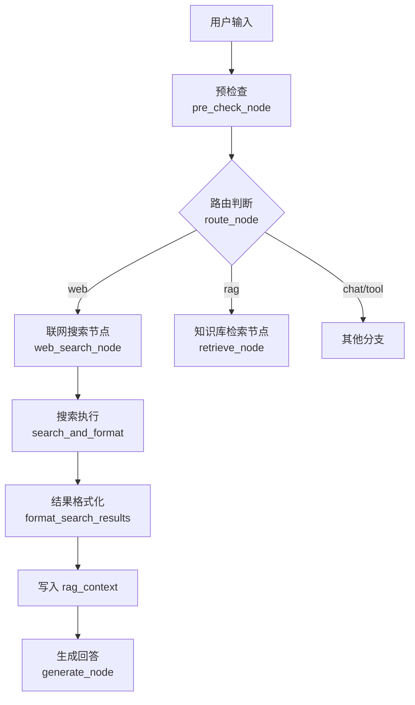
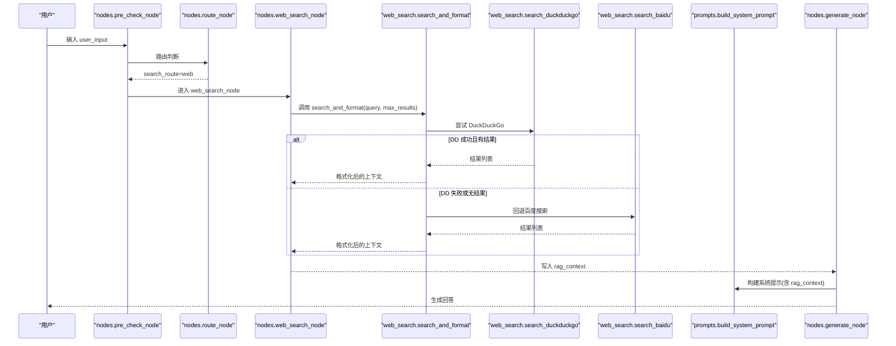
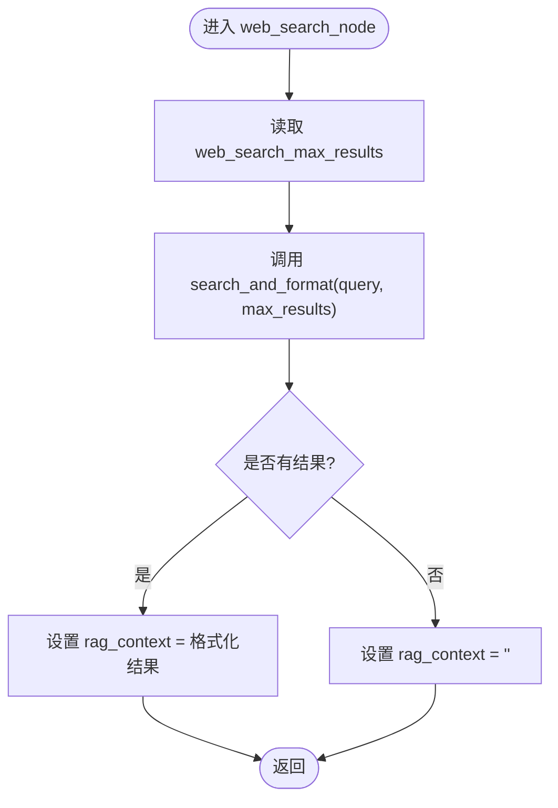
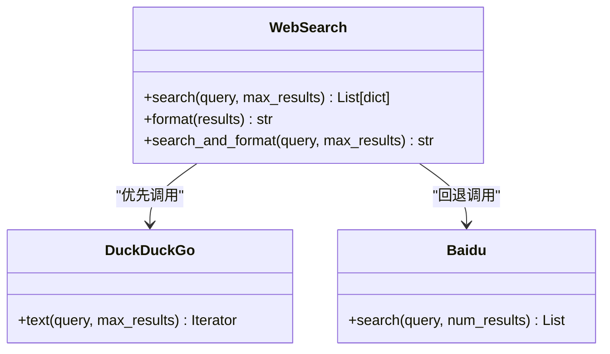
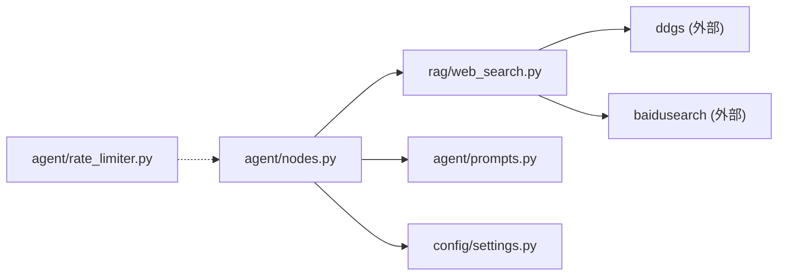

# 联网搜索节点

<cite>
**本文引用的文件**
- [rag/web_search.py](file://rag/web_search.py)
- [agent/nodes.py](file://agent/nodes.py)
- [config/settings.py](file://config/settings.py)
- [agent/prompts.py](file://agent/prompts.py)
- [agent/rate_limiter.py](file://agent/rate_limiter.py)
- [tests/test_smoke.py](file://tests/test_smoke.py)
</cite>

## 目录
1. [简介](#简介)
2. [项目结构](#项目结构)
3. [核心组件](#核心组件)
4. [架构总览](#架构总览)
5. [详细组件分析](#详细组件分析)
6. [依赖关系分析](#依赖关系分析)
7. [性能考量](#性能考量)
8. [故障排查指南](#故障排查指南)
9. [结论](#结论)
10. [附录](#附录)

## 简介
本技术文档聚焦“联网搜索节点”的实现与运行机制，围绕 web_search_node 的调用链路、外部 API 封装（DuckDuckGo/百度）、搜索结果格式化、内容过滤策略、参数配置、结果数量限制、超时与重试机制、质量评估与排序、网络异常处理与降级、缓存机制、以及监控与诊断方法进行系统化说明。目标是帮助开发者快速理解并扩展该模块，同时为运维提供可观测性与排障依据。

## 项目结构
联网搜索能力由“路由判断 → 搜索执行 → 结果格式化 → 注入生成上下文”构成，关键文件职责如下：
- agent/nodes.py：定义 web_search_node，负责从状态中取查询、读取配置、调用搜索并写入 rag_context。
- rag/web_search.py：实现双引擎搜索（DuckDuckGo 优先，百度回退），统一结果格式与一站式搜索+格式化。
- config/settings.py：集中管理联网搜索开关、最大结果数、超时等配置项。
- agent/prompts.py：定义路由关键词与系统提示组装，影响是否进入 web 分支及上下文预算截断。
- agent/rate_limiter.py：限流与熔断器，保护下游服务（LLM/工具）稳定，间接影响整体可用性。
- tests/test_smoke.py：对 web_search 模块导入与配置进行冒烟测试，保障基础可用。

图表来源
- [agent/nodes.py:92-158](file://agent/nodes.py#L92-L158)
- [agent/nodes.py:324-341](file://agent/nodes.py#L324-L341)
- [rag/web_search.py:76-133](file://rag/web_search.py#L76-L133)

章节来源
- [agent/nodes.py:92-158](file://agent/nodes.py#L92-L158)
- [rag/web_search.py:1-134](file://rag/web_search.py#L1-L134)
- [config/settings.py:109-112](file://config/settings.py#L109-L112)

## 核心组件
- 路由与入口
  - pre_check_node：合并问答缓存匹配与路由判断；若命中缓存直接短路返回。
  - route_node/_decide_route：基于 LLM 路由 + 关键词兜底，决定走 RAG、Web、Chat 或 Tool。
  - web_search_node：调用 web_search 模块，将结果以文本形式写入 rag_context。
- 搜索实现
  - search_duckduckgo：通过 ddgs 库调用 DuckDuckGo 文本搜索，标准化结果为 {title, url, snippet}。
  - search_baidu：通过 baidusearch 库调用百度搜索，标准化结果。
  - web_search：双引擎策略，优先 DuckDuckGo，失败或无结果时回退百度。
  - format_search_results：将结构化结果转为带来源标记的上下文字符串，便于后续生成使用。
  - search_and_format：一站式搜索+格式化，供 web_search_node 直接调用。
- 配置与开关
  - web_search_enabled：是否启用联网搜索。
  - web_search_max_results：单次搜索最大结果数。
  - web_search_timeout：搜索超时秒数（当前未在代码中显式传入第三方库，但作为全局配置存在）。
- 上下文注入与预算控制
  - prompts.build_system_prompt：将 rag_context 按 rag_context_budget 截断后注入系统提示。

章节来源
- [agent/nodes.py:153-222](file://agent/nodes.py#L153-L222)
- [agent/nodes.py:324-341](file://agent/nodes.py#L324-L341)
- [rag/web_search.py:19-133](file://rag/web_search.py#L19-L133)
- [config/settings.py:109-112](file://config/settings.py#L109-L112)
- [agent/prompts.py:22-69](file://agent/prompts.py#L22-L69)

## 架构总览
下图展示一次联网搜索请求从路由到生成的完整时序。

图表来源
- [agent/nodes.py:92-158](file://agent/nodes.py#L92-L158)
- [agent/nodes.py:324-341](file://agent/nodes.py#L324-L341)
- [rag/web_search.py:76-133](file://rag/web_search.py#L76-L133)
- [agent/prompts.py:41-69](file://agent/prompts.py#L41-L69)

## 详细组件分析

### web_search_node 执行流程
- 输入：AgentState 中的 user_input。
- 行为：
  - 读取配置 settings.web_search_max_results。
  - 调用 rag/web_search.search_and_format 执行搜索并格式化。
  - 若无结果，确保 rag_context 为空字符串，避免空值传播。
  - 捕获异常并记录日志，保证主链路不中断。
- 输出：更新 state.rag_context，供 generate_node 使用。

图表来源
- [agent/nodes.py:324-341](file://agent/nodes.py#L324-L341)

章节来源
- [agent/nodes.py:324-341](file://agent/nodes.py#L324-L341)

### 外部 API 调用封装（双引擎）
- DuckDuckGo（主）
  - 使用 ddgs 库发起文本搜索，遍历结果并映射为标准字段 {title, url, snippet}。
  - 异常捕获并记录警告，返回空列表以便回退。
- 百度（备）
  - 使用 baidusearch 库搜索，适配其对象属性 title/link/abstract，统一为标准字段。
  - 异常捕获并记录警告，返回空列表。
- 编排策略
  - web_search 先尝试 DuckDuckGo，若有结果则直接返回；否则记录日志并回退百度。

图表来源
- [rag/web_search.py:19-94](file://rag/web_search.py#L19-L94)

章节来源
- [rag/web_search.py:19-94](file://rag/web_search.py#L19-L94)

### 搜索结果格式化与上下文注入
- 格式化
  - format_search_results 将每个结果包装为带编号、来源 URL、标题与类型标记的块，并以换行连接。
- 上下文预算
  - prompts.build_system_prompt 将 rag_context 按 rag_context_budget 截断，避免过长导致生成不稳定。
- 路由关键词
  - WEB_SEARCH_KEYWORDS 用于关键词兜底判断是否需要联网搜索。

章节来源
- [rag/web_search.py:97-133](file://rag/web_search.py#L97-L133)
- [agent/prompts.py:22-69](file://agent/prompts.py#L22-L69)
- [agent/prompts.py:116-120](file://agent/prompts.py#L116-L120)

### 搜索参数配置与结果数量限制
- 开关与阈值
  - web_search_enabled：控制是否允许走 web 分支。
  - web_search_max_results：控制每次搜索的最大结果条数。
  - web_search_timeout：搜索超时配置（当前未在第三方库调用处显式传入，但可作为未来增强点）。
- 路由与开关联动
  - _decide_route 在检测到 web 意图时，会检查 web_search_enabled，关闭时降级为 rag。

章节来源
- [config/settings.py:109-112](file://config/settings.py#L109-L112)
- [agent/nodes.py:161-211](file://agent/nodes.py#L161-L211)

### 超时与重试机制
- 当前实现
  - web_search 内部未显式设置超时与重试；异常被捕获并记录，随后回退另一引擎。
  - 配置项 web_search_timeout 已存在，可用于后续增强（如为 ddgs/baidusearch 调用增加超时）。
- 建议增强
  - 为 DuckDuckGo/百度调用增加 request_timeout 参数（若底层库支持）。
  - 增加指数退避重试（例如网络抖动导致的瞬时失败）。
  - 在 web_search_node 层增加整体超时控制，避免阻塞生成链路。

章节来源
- [rag/web_search.py:29-73](file://rag/web_search.py#L29-L73)
- [config/settings.py:109-112](file://config/settings.py#L109-L112)

### 搜索结果的质量评估、去重与相关性排序
- 质量评估
  - 当前未实现评分模型；结果顺序由搜索引擎返回顺序决定。
  - 可通过引入 CrossEncoder 或轻量打分模型对网页片段与查询做相关性打分，再截取 top-k。
- 去重处理
  - 当前未实现 URL 或内容去重；若同一来源多次出现，可在 web_search 层按 url 去重。
- 相关性排序
  - 可借鉴 RAG 的重排序思路（CrossEncoder），对搜索结果进行精排，提升最终注入上下文的相关性。

章节来源
- [rag/web_search.py:76-133](file://rag/web_search.py#L76-L133)

### 网络异常处理与降级策略
- 异常处理
  - DuckDuckGo/百度调用均包裹 try/except，记录警告并返回空列表，避免阻断主链路。
- 降级策略
  - 双引擎回退：DDGS 失败或无结果时自动切换百度。
  - 路由降级：若 web_search_enabled=False，web 分支降级为 rag。
- 限流与熔断
  - rate_limiter 提供滑动窗口限流与熔断器，保护下游服务稳定性（虽主要针对 LLM/工具，但对整体可用性有增益）。

章节来源
- [rag/web_search.py:29-94](file://rag/web_search.py#L29-L94)
- [agent/nodes.py:161-211](file://agent/nodes.py#L161-L211)
- [agent/rate_limiter.py:1-106](file://agent/rate_limiter.py#L1-L106)

### 缓存机制
- 问答记忆缓存
  - qa_match_node 对历史问题进行向量化匹配，命中则直接复用答案，跳过生成链路。
  - 时效性问题（天气/时间表达）不走缓存，避免过时答案污染。
- 与联网搜索的关系
  - 时效性问题优先走 web 分支，减少缓存误用风险。
  - 若希望进一步降低搜索成本，可对高频查询做短期内存缓存（如 LRU），注意失效策略与数据新鲜度。

章节来源
- [agent/nodes.py:232-281](file://agent/nodes.py#L232-L281)
- [agent/nodes.py:80-89](file://agent/nodes.py#L80-L89)

## 依赖关系分析
- 模块耦合
  - nodes.py 依赖 web_search.py 完成搜索与格式化，依赖 prompts.py 进行上下文预算控制。
  - settings.py 提供统一配置入口，被 nodes.py 与 web_search.py（未来增强）引用。
  - rate_limiter.py 提供限流/熔断，保护整体链路稳定性。
- 外部依赖
  - ddgs、baidusearch：第三方搜索库，需确保安装与环境可达。
- 潜在循环依赖
  - 当前未见循环 import；各模块通过函数级延迟导入避免启动期耦合。

图表来源
- [agent/nodes.py:324-341](file://agent/nodes.py#L324-L341)
- [rag/web_search.py:29-73](file://rag/web_search.py#L29-L73)
- [agent/rate_limiter.py:1-106](file://agent/rate_limiter.py#L1-L106)

章节来源
- [agent/nodes.py:324-341](file://agent/nodes.py#L324-L341)
- [rag/web_search.py:29-73](file://rag/web_search.py#L29-L73)
- [agent/rate_limiter.py:1-106](file://agent/rate_limiter.py#L1-L106)

## 性能考量
- 路由优化
  - 时效性问题快速识别，避免不必要的 LLM 路由开销。
- 搜索效率
  - 双引擎回退提高成功率；建议为外部库调用增加超时与重试，降低偶发失败影响。
- 上下文预算
  - 通过 rag_context_budget 控制注入长度，避免超长上下文影响生成质量与速度。
- 缓存与降级
  - 问答记忆缓存命中可完全跳过生成；web 分支可考虑短期查询缓存（注意新鲜度）。
- 限流与熔断
  - 在高并发场景下，结合 rate_limiter 保护系统稳定性。

## 故障排查指南
- 常见问题定位
  - 搜索无结果：检查 web_search_enabled 与路由关键词；确认 ddgs/baidusearch 可用。
  - 超时/网络错误：查看日志中的警告信息；必要时为外部库调用增加超时与重试。
  - 上下文过长：调整 rag_context_budget，避免截断过多关键信息。
- 日志与监控
  - 关注 web_search_node 与 web_search 模块的日志输出，统计成功/失败率、耗时。
  - 结合 rate_limiter 的限流/熔断日志，识别瓶颈与异常峰值。
- 回归测试
  - 使用 tests/test_smoke.py 验证模块导入与配置项有效性。

章节来源
- [rag/web_search.py:29-94](file://rag/web_search.py#L29-L94)
- [agent/nodes.py:324-341](file://agent/nodes.py#L324-L341)
- [tests/test_smoke.py:276-297](file://tests/test_smoke.py#L276-L297)

## 结论
联网搜索节点通过“路由判断 + 双引擎搜索 + 格式化注入”的方式，为智能体提供实时信息获取能力。当前实现具备基本的异常处理与降级策略，但在超时重试、结果质量评估、去重与排序方面仍有增强空间。建议逐步引入超时控制、重试机制、相关性打分与去重逻辑，并结合缓存与限流/熔断，进一步提升稳定性与性能。

## 附录
- 配置项速查
  - web_search_enabled：是否启用联网搜索。
  - web_search_max_results：单次搜索最大结果数。
  - web_search_timeout：搜索超时秒数（待增强）。
  - rag_context_budget：注入上下文的字符预算。
- 相关测试
  - test_web_search_module_import：验证模块导入。
  - test_web_search_config：验证配置项读取。

章节来源
- [config/settings.py:109-112](file://config/settings.py#L109-L112)
- [tests/test_smoke.py:276-297](file://tests/test_smoke.py#L276-L297)