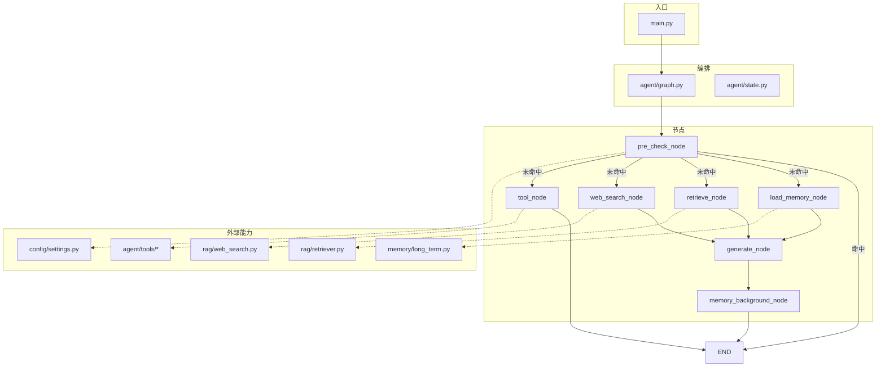
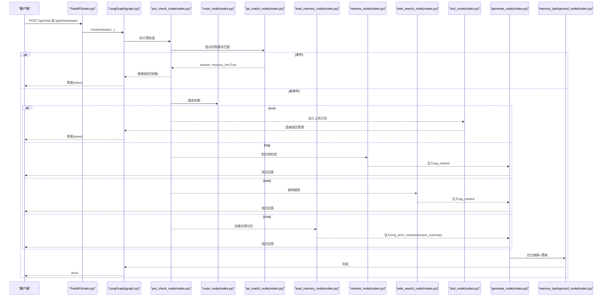
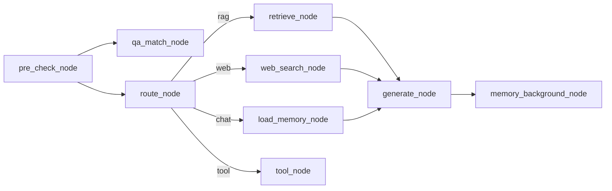
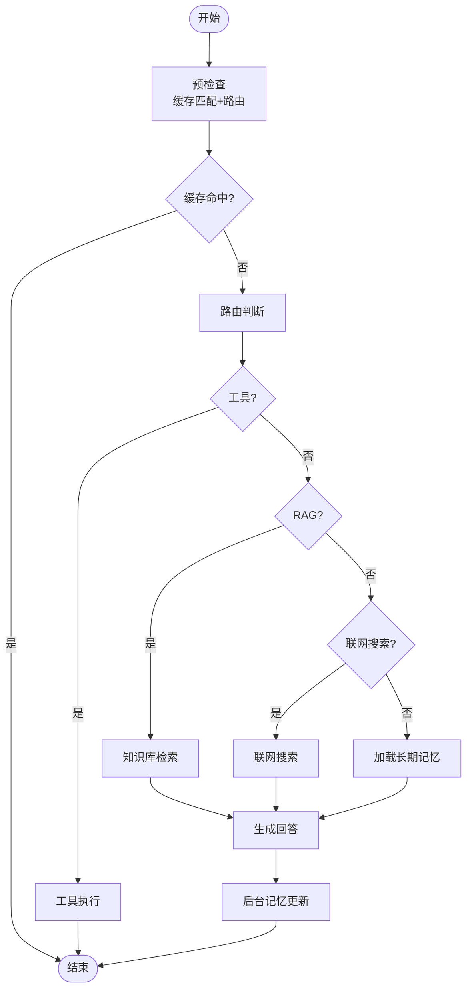

# 节点处理系统

<cite>
**本文引用的文件**
- [agent/nodes.py](file://agent/nodes.py)
- [agent/graph.py](file://agent/graph.py)
- [agent/state.py](file://agent/state.py)
- [config/settings.py](file://config/settings.py)
- [memory/long_term.py](file://memory/long_term.py)
- [rag/retriever.py](file://rag/retriever.py)
- [rag/web_search.py](file://rag/web_search.py)
- [agent/tools/tool_schemas.py](file://agent/tools/tool_schemas.py)
- [agent/tools/todo_tools.py](file://agent/tools/todo_tools.py)
- [agent/tools/meeting_tools.py](file://agent/tools/meeting_tools.py)
- [main.py](file://main.py)
</cite>

## 目录
1. [简介](#简介)
2. [项目结构](#项目结构)
3. [核心组件](#核心组件)
4. [架构总览](#架构总览)
5. [详细组件分析](#详细组件分析)
6. [依赖关系分析](#依赖关系分析)
7. [性能考量](#性能考量)
8. [故障排查指南](#故障排查指南)
9. [结论](#结论)
10. [附录](#附录)

## 简介
本技术文档围绕 Agent 节点处理系统，系统性说明各节点职责、输入输出、参数配置、错误处理与执行顺序。重点覆盖：
- pre_check_node（预检查）：问答缓存匹配 + 路由判断
- load_memory_node（记忆加载）：长期记忆上下文与会话摘要
- retrieve_node（检索）：知识库多路召回与重排序
- web_search_node（联网搜索）：外部 API 调用
- tool_node（工具调用）：意图识别、确认机制与执行
- generate_node（生成）：LLM 调用与流式响应、降级策略
- memory_background_node（后台记忆）：异步抽取与更新

## 项目结构
系统基于 LangGraph StateGraph 编排工作流，节点函数位于 agent/nodes.py，图构建在 agent/graph.py，状态定义在 agent/state.py。配置集中管理于 config/settings.py；记忆持久化在 memory/long_term.py；检索与联网搜索分别在 rag/retriever.py 与 rag/web_search.py；工具实现位于 agent/tools/*。

图表来源
- [agent/graph.py:44-102](file://agent/graph.py#L44-L102)
- [agent/nodes.py:93-128](file://agent/nodes.py#L93-L128)

章节来源
- [agent/graph.py:1-102](file://agent/graph.py#L1-L102)
- [agent/state.py:12-51](file://agent/state.py#L12-L51)

## 核心组件
- 状态模型 AgentState：承载消息历史、用户标识、会话标识、路由结果、RAG/联网上下文、长期记忆上下文、会话摘要、问答命中标志、向量、答案、工具相关字段等。
- 工作流图：START → pre_check → 条件分流 → 分支执行 → generate → memory_background → END。
- 配置中心：统一提供 LLM、Embedding、向量库、RAG、联网搜索、记忆、工具开关等参数。

章节来源
- [agent/state.py:12-51](file://agent/state.py#L12-L51)
- [agent/graph.py:44-102](file://agent/graph.py#L44-L102)
- [config/settings.py:19-156](file://config/settings.py#L19-L156)

## 架构总览
下图展示从请求到响应的完整流程，包括缓存短路、五路分流、后台记忆更新与流式事件透传。

图表来源
- [agent/graph.py:44-102](file://agent/graph.py#L44-L102)
- [agent/nodes.py:93-128](file://agent/nodes.py#L93-L128)
- [agent/nodes.py:154-211](file://agent/nodes.py#L154-L211)
- [agent/nodes.py:233-281](file://agent/nodes.py#L233-L281)
- [agent/nodes.py:285-321](file://agent/nodes.py#L285-L321)
- [agent/nodes.py:325-341](file://agent/nodes.py#L325-L341)
- [agent/nodes.py:345-360](file://agent/nodes.py#L345-L360)
- [agent/nodes.py:499-532](file://agent/nodes.py#L499-L532)
- [agent/nodes.py:631-643](file://agent/nodes.py#L631-L643)

## 详细组件分析

### pre_check_node（预检查节点）
- 职责：合并问答缓存匹配与路由判断；优先处理 pending_confirmation（用户确认工具操作）。
- 输入：AgentState（包含 user_input、user_id、session_id、pending_confirmation、confirmation_context 等）。
- 输出：可能包含 answer、memory_hit、query_embedding、messages 等增量字段。
- 关键逻辑：
  - 若存在 pending_confirmation 且用户回复为确认语义，则直接执行待确认工具并返回答案，同时标记 memory_hit=True 以短路后续链路。
  - 先执行 qa_match_node，命中则直接返回答案并短路。
  - 否则执行 route_node 进行路由判断。
- 错误处理：内部子节点异常均被 try/except 包裹，失败时静默降级，不阻断主链路。
- 配置依赖：settings.memory_qa_cache_enabled、settings.tool_calling_enabled、settings.web_search_enabled。

章节来源
- [agent/nodes.py:93-128](file://agent/nodes.py#L93-L128)
- [agent/nodes.py:131-150](file://agent/nodes.py#L131-L150)
- [agent/nodes.py:233-281](file://agent/nodes.py#L233-L281)
- [agent/nodes.py:154-211](file://agent/nodes.py#L154-L211)
- [config/settings.py:114-156](file://config/settings.py#L114-L156)

#### 预检查条件路由
- 规则：memory_hit=True → END；否则按 search_route 分流至 tool/retrieve/web_search/load_memory/generate。

章节来源
- [agent/nodes.py:131-150](file://agent/nodes.py#L131-L150)
- [agent/graph.py:77-92](file://agent/graph.py#L77-L92)

### route_node（路由判断）
- 职责：决定使用 RAG、联网搜索、闲聊或工具调用。
- 输入：AgentState.user_input。
- 输出：search_route（"rag"/"web"/"chat"/"tool"）。
- 关键逻辑：
  - 工具关键词优先（需开启 tool_calling_enabled）。
  - 时效性问题（含明确时间表达或天气查询）优先走 web_search（需开启 web_search_enabled）。
  - 短输入且不含疑问/搜索/工具词倾向闲聊。
  - 调用路由小模型（temperature=0.0）做最终判断，失败回退关键词兜底。
- 错误处理：LLM 路由失败时打印日志并回退关键词策略。

章节来源
- [agent/nodes.py:154-211](file://agent/nodes.py#L154-L211)
- [config/settings.py:151-156](file://config/settings.py#L151-L156)

### qa_match_node（问答记忆匹配）
- 职责：将新问题与历史问题相似度匹配，命中则复用历史答案，跳过生成链路。
- 输入：AgentState.user_input、user_id、settings.memory_qa_cache_enabled。
- 输出：answer、memory_hit=True、query_embedding、messages（用于短期历史连贯）。
- 关键逻辑：
  - 关闭缓存或输入过短/无 user_id 直接返回未命中。
  - 时效性问题不匹配缓存，避免过时答案。
  - 向量化后在长期记忆中检索相似问答对，阈值由 settings.memory_qa_threshold 控制。
- 错误处理：向量化或检索失败静默降级为未命中。

章节来源
- [agent/nodes.py:233-281](file://agent/nodes.py#L233-L281)
- [memory/long_term.py:784-820](file://memory/long_term.py#L784-L820)
- [config/settings.py:128-133](file://config/settings.py#L128-L133)

### retrieve_node（检索节点）
- 职责：执行知识库检索，按相关度阈值过滤后写入 rag_context。
- 输入：AgentState.user_input、settings.rerank_enabled、settings.rag_bm25_enabled、settings.rag_min_relevance。
- 输出：rag_context（格式化后的上下文字符串）。
- 关键逻辑：
  - 可选查询改写（失败回退原始查询）。
  - 多路召回：BM25 开启时向量+BM25 并行，RRF 融合；否则仅向量检索。
  - 可选重排序（CrossEncoder），取 top-k。
  - 纯向量路径下按 min_rel 过滤低相关文档。
- 错误处理：检索失败时返回空上下文，不阻断主链路。

章节来源
- [agent/nodes.py:285-321](file://agent/nodes.py#L285-L321)
- [rag/retriever.py:18-53](file://rag/retriever.py#L18-L53)
- [rag/retriever.py:55-110](file://rag/retriever.py#L55-L110)
- [rag/retriever.py:113-140](file://rag/retriever.py#L113-L140)
- [config/settings.py:54-100](file://config/settings.py#L54-L100)

### web_search_node（联网搜索节点）
- 职责：调用外部搜索引擎获取实时信息，结果写入 rag_context。
- 输入：AgentState.user_input、settings.web_search_max_results。
- 输出：rag_context（格式化为带来源标记的文本块）。
- 关键逻辑：
  - 双引擎：DuckDuckGo 优先，失败回退百度。
  - 结果统一格式化为上下文字符串供生成节点使用。
- 错误处理：任一引擎失败记录日志并回退另一引擎；全部失败返回空上下文。

章节来源
- [agent/nodes.py:325-341](file://agent/nodes.py#L325-L341)
- [rag/web_search.py:19-94](file://rag/web_search.py#L19-L94)
- [rag/web_search.py:97-134](file://rag/web_search.py#L97-L134)
- [config/settings.py:109-112](file://config/settings.py#L109-L112)

### load_memory_node（记忆加载节点）
- 职责：从 SQLite 分层加载长期记忆上下文与会话压缩摘要。
- 输入：AgentState.user_id、session_id、user_input。
- 输出：long_term_context、session_summary。
- 关键逻辑：
  - 构建分层记忆上下文（画像/关键事实/历史摘要），受预算限制。
  - 读取会话压缩摘要（短期记忆超窗后的更早对话摘要）。
- 错误处理：数据库访问或 LLM 摘要失败时静默降级为空上下文。

章节来源
- [agent/nodes.py:345-360](file://agent/nodes.py#L345-L360)
- [memory/long_term.py:424-497](file://memory/long_term.py#L424-L497)
- [memory/long_term.py:342-380](file://memory/long_term.py#L342-L380)

### extract_facts_node（关键信息抽取）
- 职责：快速抽取高优先级信息（规则路径零 LLM 成本），可选 LLM 结构化抽取。
- 输入：AgentState.user_id、user_input、answer。
- 输出：无（副作用：保存 profile/facts）。
- 关键逻辑：
  - 规则快速路径：正则匹配姓名、项目、公司等，立即落库。
  - 可选 LLM 抽取 JSON，解析后保存 profile 与 facts（限制条数与优先级范围）。
- 错误处理：LLM 抽取失败静默跳过。

章节来源
- [agent/nodes.py:364-412](file://agent/nodes.py#L364-L412)
- [memory/long_term.py:636-698](file://memory/long_term.py#L636-L698)

### generate_node（生成节点）
- 职责：组装 prompt（system + 历史 + 当前输入），调用 LLM 流式生成回答，支持主模型失败自动降级。
- 输入：AgentState.user_input、rag_context、long_term_context、messages、session_summary。
- 输出：answer、messages（追加本轮人机对话）。
- 关键逻辑：
  - 构建 system_prompt（注入 long_term_context 与 rag_context）。
  - 构建聊天历史：窗口 + 字符预算 + 更早对话摘要防丢失。
  - 主模型流式生成；失败时依次尝试备用模型列表。
- 错误处理：主模型失败记录日志并降级；备用模型全部失败返回友好提示。

章节来源
- [agent/nodes.py:499-532](file://agent/nodes.py#L499-L532)
- [agent/nodes.py:454-464](file://agent/nodes.py#L454-L464)
- [agent/nodes.py:467-496](file://agent/nodes.py#L467-L496)
- [config/settings.py:29-48](file://config/settings.py#L29-L48)

### memory_update_node（周期记忆更新）
- 职责：周期性更新长期记忆摘要，并在短期窗口超出时刷新会话压缩摘要；保存问答记忆。
- 输入：AgentState.user_id、messages、settings.memory_summary_every。
- 输出：无（副作用：更新摘要、会话摘要、问答缓存）。
- 关键逻辑：
  - 每 N 轮触发一次摘要（增量合并，保留关键信息）。
  - 短期窗口超限时压缩旧消息为会话摘要。
  - 仅缓存知识类回答（RAG/Web），过滤短输入/回答与错误兜底。
- 错误处理：各步骤独立 try/except，任一失败不影响其他。

章节来源
- [agent/nodes.py:536-564](file://agent/nodes.py#L536-L564)
- [agent/nodes.py:567-628](file://agent/nodes.py#L567-L628)
- [memory/long_term.py:500-518](file://memory/long_term.py#L500-L518)
- [memory/long_term.py:613-633](file://memory/long_term.py#L613-L633)

### memory_background_node（后台记忆节点）
- 职责：合并执行关键信息抽取与长期记忆更新，两者内部均有独立兜底，不阻塞主响应链路。
- 输入：AgentState（同上）。
- 输出：无（副作用：保存 profile/facts、摘要、问答缓存）。
- 关键逻辑：
  - 时效性问题不保存长期记忆（避免污染）。
  - 顺序执行 extract_facts_node 与 memory_update_node。
- 错误处理：内部异常均被捕获，不影响主流程。

章节来源
- [agent/nodes.py:631-643](file://agent/nodes.py#L631-L643)

### tool_node（工具调用节点）
- 职责：LLM 提取工具名与参数 → 查询类直接执行 → 写操作需用户确认 → 执行工具 → 格式化结果返回。
- 输入：AgentState.user_input、user_id、settings.tool_confirmation_required。
- 输出：answer、tool_name、tool_params、tool_result 或 pending_confirmation + confirmation_context。
- 关键逻辑：
  - 通过 TOOL_EXTRACT_PROMPT 让路由小模型提取工具与参数。
  - 读操作（query_todos/query_meetings）直接执行。
  - 写操作（create_todo/create_meeting/cancel_meeting/update_meeting）默认需确认。
  - 工具执行分发到具体工具模块，结果格式化为可读文本。
- 错误处理：LLM 提取失败返回友好提示；工具执行失败返回错误信息。

章节来源
- [agent/nodes.py:647-690](file://agent/nodes.py#L647-L690)
- [agent/nodes.py:693-746](file://agent/nodes.py#L693-L746)
- [agent/tools/tool_schemas.py:8-26](file://agent/tools/tool_schemas.py#L8-L26)
- [agent/tools/todo_tools.py:18-84](file://agent/tools/todo_tools.py#L18-L84)
- [agent/tools/meeting_tools.py:17-225](file://agent/tools/meeting_tools.py#L17-L225)
- [config/settings.py:151-156](file://config/settings.py#L151-L156)

## 依赖关系分析
- 节点间耦合：
  - pre_check_node 依赖 qa_match_node 与 route_node。
  - retrieve_node 依赖 rag.retriever 与配置。
  - web_search_node 依赖 rag.web_search 与配置。
  - load_memory_node 依赖 memory.long_term 与配置。
  - generate_node 依赖 LLM 实例与历史构建逻辑。
  - memory_background_node 依赖 extract_facts_node 与 memory_update_node。
- 外部依赖：
  - LLM：ChatOpenAI（千问兼容接口），支持重试与超时。
  - 向量库：Milvus Lite（本地持久化）。
  - 搜索引擎：DuckDuckGo 与百度。
  - 钉钉工具：dingtalk_lib（待办/会议）。
- 潜在循环依赖：无显式循环，模块导入按需延迟以避免启动开销。

图表来源
- [agent/nodes.py:93-128](file://agent/nodes.py#L93-L128)
- [agent/nodes.py:154-211](file://agent/nodes.py#L154-L211)
- [agent/nodes.py:285-321](file://agent/nodes.py#L285-L321)
- [agent/nodes.py:325-341](file://agent/nodes.py#L325-L341)
- [agent/nodes.py:345-360](file://agent/nodes.py#L345-L360)
- [agent/nodes.py:499-532](file://agent/nodes.py#L499-L532)
- [agent/nodes.py:631-643](file://agent/nodes.py#L631-L643)

章节来源
- [agent/nodes.py:93-643](file://agent/nodes.py#L93-L643)
- [rag/retriever.py:18-53](file://rag/retriever.py#L18-L53)
- [rag/web_search.py:19-94](file://rag/web_search.py#L19-L94)
- [memory/long_term.py:424-497](file://memory/long_term.py#L424-L497)

## 性能考量
- 首请求预热：服务启动时预热路由小模型与主模型连接，降低首次延迟。
- 缓存短路：问答记忆命中直接返回，跳过整条生成链路。
- 后台任务：记忆抽取与更新在后台执行，不阻塞响应。
- 流式输出：generate_node 使用 stream 逐 token 输出，提升交互体验。
- 降级策略：主模型失败自动尝试备用模型列表，提高鲁棒性。
- 检索优化：多路召回（BM25+向量）与 RRF 融合，结合重排序提升精度。
- 上下文预算：短期历史窗口与字符预算控制，避免上下文溢出。

章节来源
- [main.py:45-77](file://main.py#L45-L77)
- [agent/nodes.py:233-281](file://agent/nodes.py#L233-L281)
- [agent/nodes.py:499-532](file://agent/nodes.py#L499-L532)
- [rag/retriever.py:18-53](file://rag/retriever.py#L18-L53)

## 故障排查指南
- 路由失败：检查 settings.tool_calling_enabled、settings.web_search_enabled；查看日志中“[route] LLM 路由失败”提示。
- 检索失败：确认向量库是否已初始化（服务启动时自动检查并入库）；查看“[retrieve] 检索失败”日志。
- 联网搜索失败：检查网络连通性与搜索引擎可用性；查看“[web_search] 联网搜索失败”日志。
- 生成失败：检查 LLM 配置（base_url、api_key、timeout）；查看“[generate] 主模型生成失败”及备用模型尝试日志。
- 记忆更新失败：检查 SQLite 权限与 WAL 模式；查看“[memory] 更新长期记忆失败”等日志。
- 工具调用失败：确认 dingtalk_lib 可导入与权限；查看“[tool] 执行工具 ... 失败”日志。

章节来源
- [agent/nodes.py:180-211](file://agent/nodes.py#L180-L211)
- [agent/nodes.py:298-321](file://agent/nodes.py#L298-L321)
- [agent/nodes.py:329-341](file://agent/nodes.py#L329-L341)
- [agent/nodes.py:525-532](file://agent/nodes.py#L525-L532)
- [agent/nodes.py:545-564](file://agent/nodes.py#L545-L564)
- [agent/nodes.py:723-746](file://agent/nodes.py#L723-L746)

## 结论
该节点处理系统通过 LangGraph 编排实现了高内聚、低耦合的模块化设计，具备缓存短路、多路检索、联网搜索、工具调用、后台记忆更新等能力。各节点职责清晰、错误处理完善、性能优化到位，适合生产环境部署与扩展。

## 附录

### 节点执行流程图

图表来源
- [agent/graph.py:44-102](file://agent/graph.py#L44-L102)
- [agent/nodes.py:93-128](file://agent/nodes.py#L93-L128)
- [agent/nodes.py:154-211](file://agent/nodes.py#L154-L211)
- [agent/nodes.py:285-321](file://agent/nodes.py#L285-L321)
- [agent/nodes.py:325-341](file://agent/nodes.py#L325-L341)
- [agent/nodes.py:345-360](file://agent/nodes.py#L345-L360)
- [agent/nodes.py:499-532](file://agent/nodes.py#L499-L532)
- [agent/nodes.py:631-643](file://agent/nodes.py#L631-L643)

### 调试方法
- 本地 REPL：运行 main.py --repl，交互式测试智能体（流式输出）。
- Web 接口：POST /api/chat 获取同步回答；POST /api/chat/stream 获取 SSE 流式事件。
- 健康检查：GET /health 检查服务状态与 checkpointer 类型。
- 日志观察：关注各节点日志前缀（如 [route]、[retrieve]、[web_search]、[generate]、[memory]、[tool]）。

章节来源
- [main.py:329-387](file://main.py#L329-L387)
- [main.py:154-210](file://main.py#L154-L210)
- [main.py:228-314](file://main.py#L228-L314)
- [main.py:317-326](file://main.py#L317-L326)