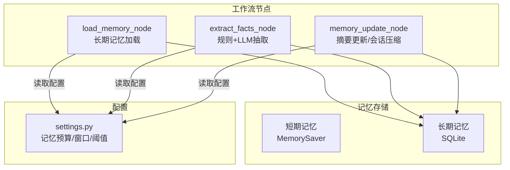
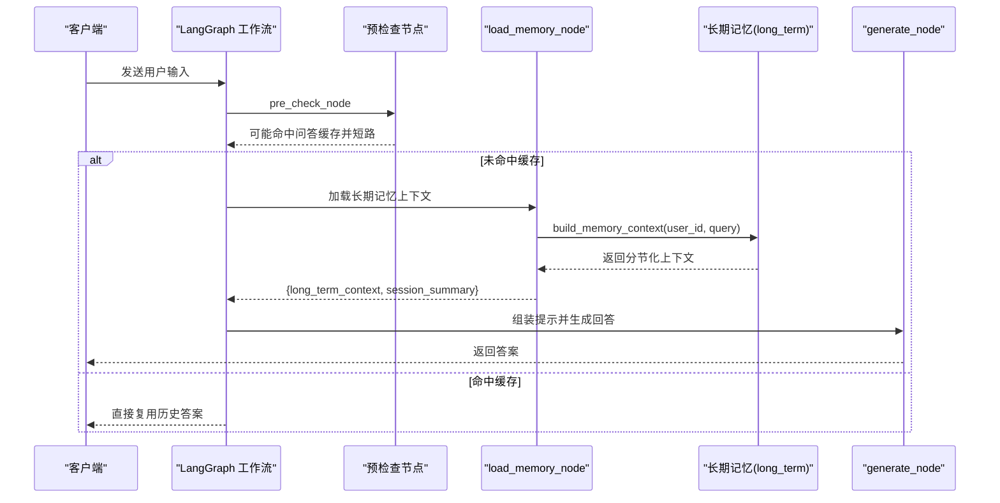
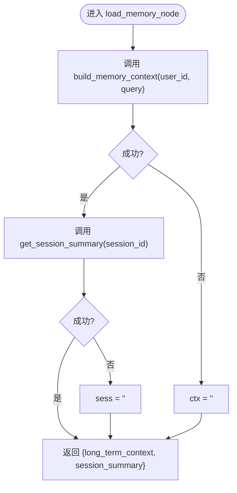
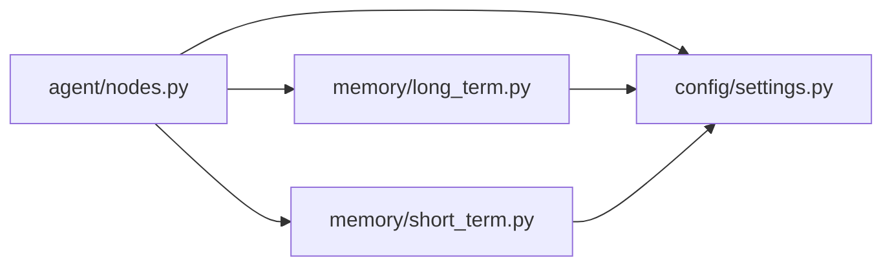

# 记忆加载节点

<cite>
**本文引用的文件**
- [memory/short_term.py](file://memory/short_term.py)
- [memory/long_term.py](file://memory/long_term.py)
- [agent/nodes.py](file://agent/nodes.py)
- [agent/state.py](file://agent/state.py)
- [config/settings.py](file://config/settings.py)
</cite>

## 目录
1. [简介](#简介)
2. [项目结构](#项目结构)
3. [核心组件](#核心组件)
4. [架构总览](#架构总览)
5. [详细组件分析](#详细组件分析)
6. [依赖关系分析](#依赖关系分析)
7. [性能与优化](#性能与优化)
8. [故障排查指南](#故障排查指南)
9. [结论](#结论)
10. [附录](#附录)

## 简介
本技术文档聚焦“记忆加载节点”的实现机制，围绕 load_memory_node 展开，系统阐述：
- 用户上下文获取、历史对话加载、偏好设置提取
- 短期记忆与长期记忆的访问策略
- 记忆数据格式转换与标准化处理
- 性能优化（缓存、分页、增量更新）
- 隐私保护与访问控制
- 记忆冲突解决与版本管理方案

该节点在 LangGraph 工作流中承担“从长期记忆中分层构建上下文并注入生成提示”的关键职责，确保智能体在多轮对话中具备个性化、连贯且可控的上下文能力。

## 项目结构
记忆相关代码主要分布在 memory 与 agent 两个模块：
- memory/short_term.py：基于进程内 MemorySaver 的短期记忆（会话级上下文）
- memory/long_term.py：基于 SQLite 的长期记忆（用户画像、关键事实、摘要历史、问答缓存等）
- agent/nodes.py：工作流节点编排，包含 load_memory_node、记忆抽取与更新、会话压缩摘要刷新等
- agent/state.py：AgentState 状态定义，承载消息历史、路由结果、记忆上下文等
- config/settings.py：全局配置，涵盖记忆预算、窗口大小、QA 缓存阈值等

图表来源
- [agent/nodes.py:344-360](file://agent/nodes.py#L344-L360)
- [memory/long_term.py:30-47](file://memory/long_term.py#L30-L47)
- [config/settings.py:114-133](file://config/settings.py#L114-L133)

章节来源
- [agent/nodes.py:344-360](file://agent/nodes.py#L344-L360)
- [memory/short_term.py:1-28](file://memory/short_term.py#L1-L28)
- [memory/long_term.py:1-15](file://memory/long_term.py#L1-L15)
- [config/settings.py:114-133](file://config/settings.py#L114-L133)

## 核心组件
- 短期记忆（Short-term Memory）
  - 基于 LangGraph checkpointer 的进程内 MemorySaver，按 thread_id（= session_id）维护会话上下文与交互历史，支持多轮对话连贯性。
- 长期记忆（Long-term Memory）
  - 基于 SQLite 的分层结构化记忆：用户画像（user_profile）、关键事实（user_facts，带优先级）、摘要历史（summary_history）、会话压缩摘要（session_summary）、问答记忆缓存（qa_memory）。
- 记忆加载节点（load_memory_node）
  - 调用 long_term.build_memory_context 构建分节化的长期记忆上下文，并加载会话压缩摘要，供后续生成节点使用。
- 记忆抽取与更新
  - 规则快速抽取（零 LLM 成本）+ 可选 LLM 结构化抽取；周期性增量合并摘要，并在短期窗口超限时刷新会话压缩摘要。
- 配置中心（settings）
  - 提供记忆预算、窗口大小、QA 缓存阈值、是否启用 LLM 抽取等开关与参数。

章节来源
- [memory/short_term.py:1-28](file://memory/short_term.py#L1-L28)
- [memory/long_term.py:1-15](file://memory/long_term.py#L1-L15)
- [agent/nodes.py:344-360](file://agent/nodes.py#L344-L360)
- [agent/nodes.py:363-413](file://agent/nodes.py#L363-L413)
- [agent/nodes.py:535-643](file://agent/nodes.py#L535-L643)
- [config/settings.py:114-133](file://config/settings.py#L114-L133)

## 架构总览
记忆加载节点处于工作流“路由后”的分支，负责将长期记忆上下文与短期会话摘要组装到生成提示中，同时配合后台节点完成信息抽取与摘要更新。

图表来源
- [agent/nodes.py:92-151](file://agent/nodes.py#L92-L151)
- [agent/nodes.py:232-281](file://agent/nodes.py#L232-L281)
- [agent/nodes.py:344-360](file://agent/nodes.py#L344-L360)
- [memory/long_term.py:424-497](file://memory/long_term.py#L424-L497)

## 详细组件分析

### 短期记忆：会话上下文与交互历史
- 实现方式：通过 LangGraph checkpointer 的 MemorySaver，以 thread_id（即 session_id）为键维护会话上下文与消息历史。
- 特点：进程内存储，无需外部服务；天然支持多轮对话的上下文连贯性。
- 使用场景：作为工作流状态中的 messages 字段，由 add_messages reducer 自动累加，用于构建最近 N 条消息的聊天历史。

章节来源
- [memory/short_term.py:1-28](file://memory/short_term.py#L1-L28)
- [agent/state.py:12-54](file://agent/state.py#L12-L54)

### 长期记忆：分层结构与访问策略
- 数据结构
  - user_profile：用户画像（单值可更新，最高优先级）
  - user_facts：关键事实（多条，带优先级 1-10）
  - summary_history：摘要历史（保留最近若干条）
  - session_summary：会话压缩摘要（短期记忆超窗后的滚动摘要）
  - qa_memory：问答记忆缓存（问题向量 + 历史答案，相似问题直接复用）
  - memory_meta：元数据（迁移标记等）
- 访问策略（build_memory_context）
  - P0 硬保留：用户画像 + 关键事实（priority<=3），永不截断
  - P1 预算填充：最近摘要 + 关键词召回事实，按预算逐条填充，超额丢弃旧条
  - P2 剩余预算：更早摘要，按剩余预算填充，超额丢弃
- 数据格式与标准化
  - 输出为分节字符串（【用户画像】/【已知事实】/【历史摘要】），便于提示词模板解析与显式指令使用
  - 摘要历史限制条数（如最近 20 条），避免无限增长
  - 会话压缩摘要记录覆盖范围（covered_until），用于增量刷新

章节来源
- [memory/long_term.py:50-125](file://memory/long_term.py#L50-L125)
- [memory/long_term.py:424-497](file://memory/long_term.py#L424-L497)
- [memory/long_term.py:172-221](file://memory/long_term.py#L172-L221)
- [memory/long_term.py:340-403](file://memory/long_term.py#L340-L403)

### 记忆加载节点：load_memory_node
- 功能：从长期记忆分层加载上下文与会话压缩摘要，返回 long_term_context 与 session_summary
- 错误处理：异常时降级为空上下文，不阻断主链路
- 集成点：被工作流条件边路由至 load_memory 分支，随后进入 generate_node 组装提示并生成回答

图表来源
- [agent/nodes.py:344-360](file://agent/nodes.py#L344-L360)
- [memory/long_term.py:424-497](file://memory/long_term.py#L424-L497)
- [memory/long_term.py:360-379](file://memory/long_term.py#L360-L379)

章节来源
- [agent/nodes.py:344-360](file://agent/nodes.py#L344-L360)

### 用户上下文获取、历史对话加载、偏好设置提取
- 用户上下文获取
  - 通过 state.user_id 与 state.session_id 定位用户与会话
  - 长期记忆上下文由 build_memory_context 按预算分层构建
  - 会话压缩摘要由 get_session_summary 获取，用于补充超出窗口的历史
- 历史对话加载
  - 短期记忆：state.messages 由 add_messages 累加，构建_chat_history 取最近 window 条并按 budget 裁剪
  - 长期记忆：summary_history 提供历史摘要列表，按时间倒序取最近若干条
- 偏好设置提取
  - 规则快速抽取：正则匹配姓名、项目、公司等关键字段，写入 user_profile/user_facts
  - LLM 结构化抽取：可选开关，解析 JSON 输出并保存 profile/facts
  - 旧版偏好表 user_prefs 启动时自动迁移至新结构，兼容保留

章节来源
- [agent/nodes.py:427-450](file://agent/nodes.py#L427-L450)
- [memory/long_term.py:138-169](file://memory/long_term.py#L138-L169)
- [memory/long_term.py:224-259](file://memory/long_term.py#L224-L259)
- [memory/long_term.py:650-698](file://memory/long_term.py#L650-L698)

### 短期记忆与长期记忆的访问策略
- 短期记忆
  - 基于 MemorySaver 的进程内存储，按 session_id 维护消息历史
  - 构建 chat history 时采用“窗口 + 字符预算”策略，超出部分若存在会话压缩摘要则以 SystemMessage 注入，避免硬丢
- 长期记忆
  - 分层预算控制：P0 硬保留（画像/关键事实），P1/P2 按预算填充（摘要/召回事实）
  - 会话压缩摘要：当短期窗口超限时，对滑出窗口的旧消息进行压缩并持久化，下次加载时注入提示

章节来源
- [memory/short_term.py:1-28](file://memory/short_term.py#L1-L28)
- [agent/nodes.py:427-450](file://agent/nodes.py#L427-L450)
- [memory/long_term.py:424-497](file://memory/long_term.py#L424-L497)
- [agent/nodes.py:602-628](file://agent/nodes.py#L602-L628)

### 记忆数据的格式转换与标准化处理
- 长期记忆上下文
  - 分节字符串：【用户画像】/【已知事实】/【历史摘要】，便于提示词模板解析
  - 摘要历史限制条数（如最近 20 条），避免无限增长
- 会话压缩摘要
  - 记录 covered_until（已覆盖的消息条数），用于增量刷新与去重
- 问答记忆缓存
  - 问题向量序列化/反序列化（BLOB），余弦相似度检索，命中则直接复用答案
- 消息文本转换
  - _messages_to_text 将 BaseMessage 列表转为对话文本，仅取最近 limit 条用于摘要生成

章节来源
- [memory/long_term.py:424-497](file://memory/long_term.py#L424-L497)
- [memory/long_term.py:340-403](file://memory/long_term.py#L340-L403)
- [memory/long_term.py:700-800](file://memory/long_term.py#L700-L800)
- [memory/long_term.py:552-559](file://memory/long_term.py#L552-L559)

### 性能优化：缓存、分页、增量更新
- 缓存策略
  - 问答记忆缓存：相似问题直接复用历史答案，跳过大模型生成；每用户上限可配置（默认 200 条）
  - 连接池：SQLite 连接单例，开启 WAL 模式支持并发读
- 分页加载
  - 摘要历史限制条数（如最近 20 条），避免全量加载
  - 构建 chat history 时按 window 与 budget 裁剪，仅注入最近消息
- 增量更新
  - 摘要增量合并：携带旧摘要生成新摘要，强制保留关键信息，key_facts 单独落库防丢失
  - 会话压缩摘要：仅在新增滑出窗口的消息达到阈值（≥4 条）时重新摘要，避免每轮重复调用 LLM

章节来源
- [memory/long_term.py:30-47](file://memory/long_term.py#L30-L47)
- [memory/long_term.py:172-196](file://memory/long_term.py#L172-L196)
- [memory/long_term.py:561-633](file://memory/long_term.py#L561-L633)
- [agent/nodes.py:535-643](file://agent/nodes.py#L535-L643)
- [agent/nodes.py:602-628](file://agent/nodes.py#L602-L628)

### 隐私保护与访问控制
- 数据隔离
  - 所有读写操作均基于 user_id 与 session_id 限定，避免跨用户污染
- 敏感信息最小化
  - 仅抽取必要字段（姓名、项目、公司等），并通过优先级分层控制注入长度
- 安全过滤
  - 配置项 input_filter_enabled 与 input_injection_check_enabled 可开启输入黑名单与 prompt 注入检测
- 访问控制建议
  - 生产环境建议结合身份认证与权限校验，限制 user_id 的来源可信性
  - 对 SQLite 文件进行文件系统级权限控制，防止未授权访问

章节来源
- [config/settings.py:135-141](file://config/settings.py#L135-L141)
- [memory/long_term.py:224-259](file://memory/long_term.py#L224-L259)
- [memory/long_term.py:650-698](file://memory/long_term.py#L650-L698)

### 记忆冲突解决策略与版本管理
- 冲突解决
  - 用户画像字段：ON CONFLICT(user_id, field) DO UPDATE，同值不更新，减少冗余
  - 关键事实：完全重复则仅提升优先级/更新时间，避免重复条目
  - 问答记忆：相同问题更新答案，超上限淘汰最旧记录
- 版本管理
  - 元数据表 memory_meta 记录迁移标记（如 prefs_migrated），启动时执行一次性迁移
  - 摘要历史保留最近若干条，避免无限增长；会话压缩摘要记录 covered_until，支持增量刷新

章节来源
- [memory/long_term.py:138-169](file://memory/long_term.py#L138-L169)
- [memory/long_term.py:224-259](file://memory/long_term.py#L224-L259)
- [memory/long_term.py:261-314](file://memory/long_term.py#L261-L314)
- [memory/long_term.py:729-781](file://memory/long_term.py#L729-L781)

## 依赖关系分析
- 节点依赖
  - load_memory_node 依赖 long_term.build_memory_context 与 get_session_summary
  - extract_facts_node 依赖 apply_extraction（规则快速抽取）与 save_profile/save_fact（LLM 抽取）
  - memory_update_node 依赖 increment_turn、summarize_and_store、_refresh_session_summary、_save_qa_cache
- 配置依赖
  - settings.memory_context_budget、memory_short_window、memory_history_budget、memory_qa_threshold 等直接影响记忆加载与生成质量
- 外部依赖
  - SQLite 连接单例与 WAL 模式
  - LangChain OpenAI ChatOpenAI（用于摘要生成与结构化抽取）

图表来源
- [agent/nodes.py:344-360](file://agent/nodes.py#L344-L360)
- [memory/long_term.py:30-47](file://memory/long_term.py#L30-L47)
- [config/settings.py:114-133](file://config/settings.py#L114-L133)

章节来源
- [agent/nodes.py:344-360](file://agent/nodes.py#L344-L360)
- [memory/long_term.py:30-47](file://memory/long_term.py#L30-L47)
- [config/settings.py:114-133](file://config/settings.py#L114-L133)

## 性能与优化
- 短期记忆
  - 窗口 + 预算裁剪：仅注入最近 N 条消息，超预算从最旧开始丢弃
  - 会话压缩摘要：避免硬丢历史，以摘要形式保留主线上下文
- 长期记忆
  - 分层预算控制：P0 硬保留，P1/P2 按预算填充，确保关键信息不丢失
  - 问答记忆缓存：相似问题直接复用答案，显著降低 LLM 调用成本
  - SQLite WAL 模式：支持并发读，写操作串行化但不会阻塞读
- 增量更新
  - 摘要增量合并：携带旧摘要生成新摘要，关键事实单独落库
  - 会话压缩摘要刷新阈值：仅当新增滑出窗口消息达到阈值时触发，避免频繁 LLM 调用

[本节为通用性能讨论，不直接分析具体文件]

## 故障排查指南
- 长期记忆加载失败
  - 现象：load_memory_node 捕获异常并降级为空上下文
  - 排查：检查 SQLite 连接与表结构初始化，确认 memory_context_budget 配置合理
- 会话压缩摘要刷新失败
  - 现象：_refresh_session_summary 捕获异常
  - 排查：检查 messages 列表是否为空、window 配置是否合理、LLM 调用是否可用
- 问答记忆缓存未命中
  - 现象：qa_match_node 未命中缓存
  - 排查：检查 memory_qa_cache_enabled、memory_qa_threshold、embedding 生成是否成功
- 规则抽取失败
  - 现象：extract_facts_node 捕获异常
  - 排查：检查用户输入格式、正则表达式是否匹配、LLM 抽取开关是否启用

章节来源
- [agent/nodes.py:344-360](file://agent/nodes.py#L344-L360)
- [agent/nodes.py:363-413](file://agent/nodes.py#L363-L413)
- [agent/nodes.py:535-643](file://agent/nodes.py#L535-L643)
- [memory/long_term.py:561-633](file://memory/long_term.py#L561-L633)

## 结论
记忆加载节点通过分层预算控制、会话压缩摘要、问答记忆缓存等技术，实现了高效、可控、个性化的上下文注入。短期记忆保障多轮连贯性，长期记忆确保关键信息不丢失，二者协同工作，为智能体提供稳定可靠的记忆能力。在生产环境中，建议结合身份认证、权限控制与配置调优，进一步提升安全性与性能。

[本节为总结性内容，不直接分析具体文件]

## 附录
- 配置项参考
  - memory_context_budget：长期记忆上下文字符预算（默认 1600）
  - memory_short_window：短期历史窗口（默认 8）
  - memory_history_budget：短期历史字符预算（默认 2000）
  - memory_qa_cache_enabled：问答记忆缓存开关（默认 True）
  - memory_qa_threshold：问答记忆命中阈值（默认 0.90）
  - memory_qa_max_records：每用户最多保留问答记忆条数（默认 200）

章节来源
- [config/settings.py:114-133](file://config/settings.py#L114-L133)