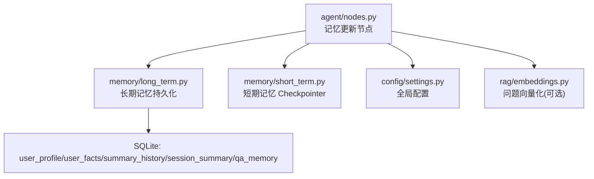
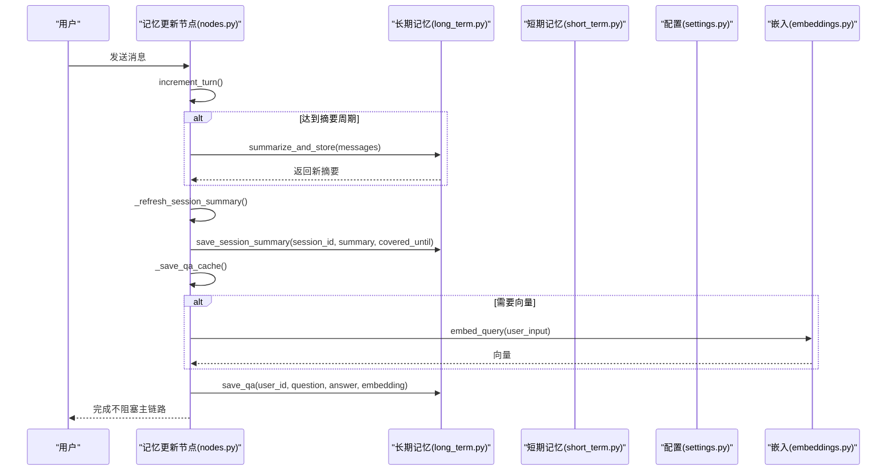
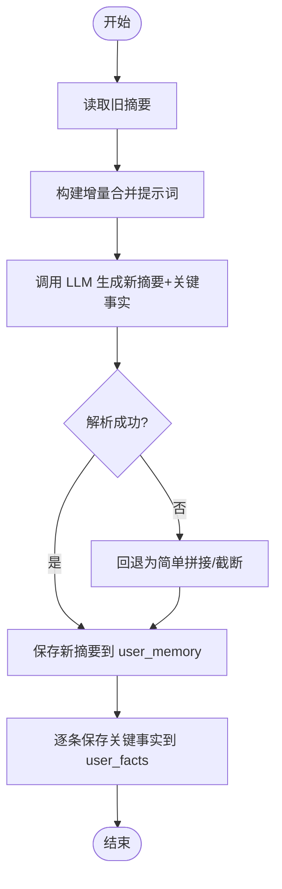
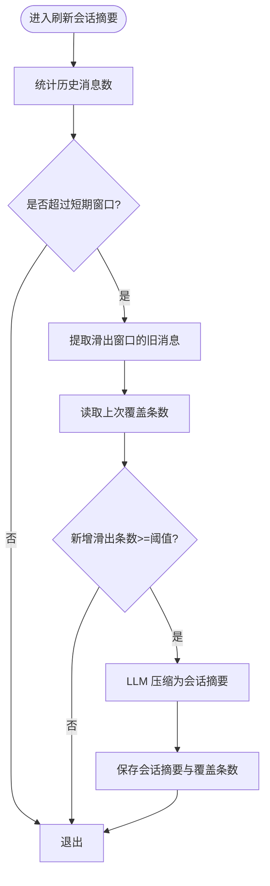
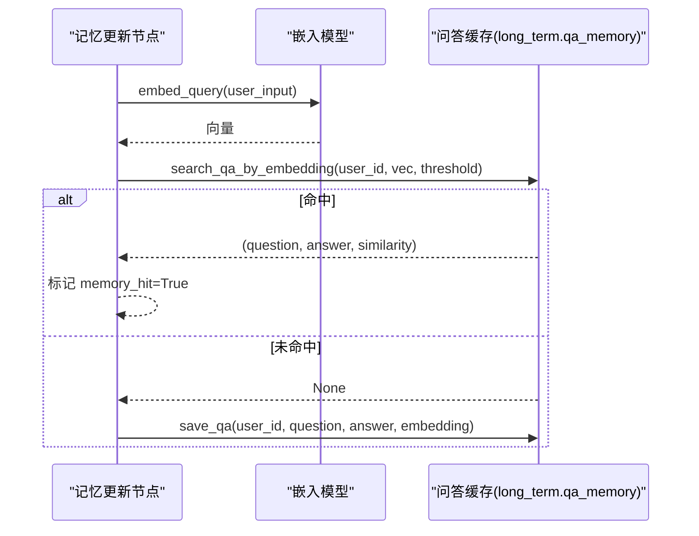
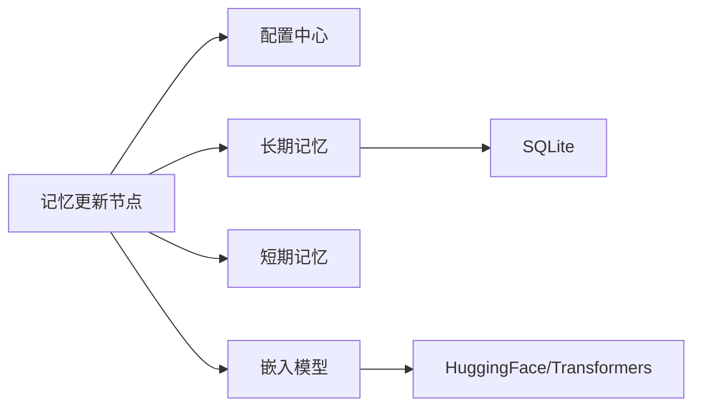

# 记忆更新节点

<cite>
**本文引用的文件**
- [memory/long_term.py](file://memory/long_term.py)
- [agent/nodes.py](file://agent/nodes.py)
- [config/settings.py](file://config/settings.py)
- [rag/embeddings.py](file://rag/embeddings.py)
- [memory/short_term.py](file://memory/short_term.py)
</cite>

## 目录
1. [简介](#简介)
2. [项目结构](#项目结构)
3. [核心组件](#核心组件)
4. [架构总览](#架构总览)
5. [详细组件分析](#详细组件分析)
6. [依赖关系分析](#依赖关系分析)
7. [性能考量](#性能考量)
8. [故障排查指南](#故障排查指南)
9. [结论](#结论)
10. [附录](#附录)

## 简介
本技术文档聚焦“记忆更新节点”的实现机制与工程实践，围绕以下目标展开：
- 长期记忆摘要生成、会话压缩、问答缓存保存的完整流程
- 记忆更新策略、触发条件与频率控制
- 一致性保证、冲突解决与版本管理
- 存储优化、索引策略与清理机制
- 记忆质量评估、性能监控与故障恢复

该节点位于智能体工作流中，负责在对话轮次推进时周期性更新长期记忆、维护会话压缩摘要，并将本轮问答对（知识类）写入问答缓存，从而提升后续相似问题的响应速度与一致性。

## 项目结构
记忆系统由短期记忆与长期记忆两部分组成：
- 短期记忆：基于进程内 MemorySaver，按会话线程维护上下文历史，保障多轮连贯性
- 长期记忆：基于 SQLite，持久化用户画像、关键事实、摘要历史、会话压缩摘要与问答缓存

图表来源
- [agent/nodes.py:535-643](file://agent/nodes.py#L535-L643)
- [memory/long_term.py:50-125](file://memory/long_term.py#L50-L125)
- [memory/short_term.py:13-20](file://memory/short_term.py#L13-L20)
- [config/settings.py:114-133](file://config/settings.py#L114-L133)
- [rag/embeddings.py:164-180](file://rag/embeddings.py#L164-L180)

章节来源
- [agent/nodes.py:535-643](file://agent/nodes.py#L535-L643)
- [memory/long_term.py:50-125](file://memory/long_term.py#L50-L125)
- [memory/short_term.py:13-20](file://memory/short_term.py#L13-L20)
- [config/settings.py:114-133](file://config/settings.py#L114-L133)
- [rag/embeddings.py:164-180](file://rag/embeddings.py#L164-L180)

## 核心组件
- 记忆更新节点：周期性增量合并摘要、刷新会话压缩摘要、保存问答缓存
- 长期记忆模块：分层结构化存储（画像/事实/摘要/会话摘要/问答缓存），预算控制与关键词召回
- 短期记忆模块：进程内会话上下文检查点
- 配置中心：记忆相关开关、阈值、窗口与预算等参数集中管理
- 嵌入模块：为问答缓存提供向量表示，用于相似度检索

章节来源
- [agent/nodes.py:535-643](file://agent/nodes.py#L535-L643)
- [memory/long_term.py:424-498](file://memory/long_term.py#L424-L498)
- [memory/short_term.py:13-20](file://memory/short_term.py#L13-L20)
- [config/settings.py:114-133](file://config/settings.py#L114-L133)
- [rag/embeddings.py:164-180](file://rag/embeddings.py#L164-L180)

## 架构总览
记忆更新节点在每次对话后执行，完成三项任务：
- 每 N 轮触发一次长期记忆摘要的增量合并与落库
- 当短期窗口超出时，将滑出窗口的旧消息压缩为会话摘要并持久化
- 将本轮问答对（知识类）以问题向量形式存入问答缓存，供后续相似问题直接复用

图表来源
- [agent/nodes.py:535-643](file://agent/nodes.py#L535-L643)
- [memory/long_term.py:561-633](file://memory/long_term.py#L561-L633)
- [memory/long_term.py:602-628](file://memory/long_term.py#L602-L628)
- [memory/long_term.py:729-781](file://memory/long_term.py#L729-L781)
- [rag/embeddings.py:164-180](file://rag/embeddings.py#L164-L180)

## 详细组件分析

### 长期记忆摘要生成与增量合并
- 增量合并：携带旧摘要与新对话，强制保留关键信息（姓名、称呼、偏好等），输出 JSON 包含摘要与关键事实列表
- 关键事实单独落库：优先级较低但重要，避免被摘要覆盖；高优先级字段走规则快速抽取，零 LLM 成本
- 摘要历史：保留最近若干条，便于回溯与重建上下文
- 预算控制：加载上下文时按 P0/P1/P2 分层填充，确保关键信息不被截断

图表来源
- [memory/long_term.py:532-633](file://memory/long_term.py#L532-L633)

章节来源
- [memory/long_term.py:532-633](file://memory/long_term.py#L532-L633)

### 会话压缩（短期记忆超窗后的滚动摘要）
- 触发条件：当历史消息数超过配置的短期窗口时，将滑出窗口的旧消息进行压缩
- 防抖策略：仅当新增滑出消息数量达到阈值时才重新摘要，避免频繁调用 LLM
- 持久化：会话摘要按 session_id 存储，记录已覆盖的消息条数，支持增量更新

图表来源
- [agent/nodes.py:602-628](file://agent/nodes.py#L602-L628)
- [memory/long_term.py:342-379](file://memory/long_term.py#L342-L379)

章节来源
- [agent/nodes.py:602-628](file://agent/nodes.py#L602-L628)
- [memory/long_term.py:342-379](file://memory/long_term.py#L342-L379)

### 问答缓存保存与命中
- 保存条件：仅缓存 RAG/联网搜索的知识类回答，过滤过短输入/回答与错误兜底；命中缓存的轮次不重复写入
- 向量检索：使用嵌入模型将问题编码为向量，余弦相似度达阈值时直接复用历史答案
- 容量控制：每用户最多保留固定条数，超出按更新时间淘汰最旧记录

图表来源
- [agent/nodes.py:567-599](file://agent/nodes.py#L567-L599)
- [memory/long_term.py:729-781](file://memory/long_term.py#L729-L781)
- [rag/embeddings.py:164-180](file://rag/embeddings.py#L164-L180)

章节来源
- [agent/nodes.py:567-599](file://agent/nodes.py#L567-L599)
- [memory/long_term.py:729-781](file://memory/long_term.py#L729-L781)
- [rag/embeddings.py:164-180](file://rag/embeddings.py#L164-L180)

### 记忆更新策略、触发条件与频率控制
- 触发条件：每轮对话后执行，内部独立 try/except 保证失败不阻断主链路
- 频率控制：通过配置 memory_summary_every 控制摘要更新频率（默认每 6 轮）
- 会话压缩：仅在滑出消息达到阈值时触发，避免频繁 LLM 调用
- 时效性问题：明确时间/天气等查询不保存长期记忆，避免过时信息污染

章节来源
- [agent/nodes.py:535-643](file://agent/nodes.py#L535-L643)
- [config/settings.py:114-133](file://config/settings.py#L114-L133)

### 一致性保证、冲突解决与版本管理
- 并发安全：SQLite 写操作通过进程内锁串行化，读操作开启 WAL 模式支持并发读
- 冲突解决：
  - 用户画像字段：同字段值相同则不更新；不同值则覆盖并更新时间戳
  - 关键事实：完全重复仅提升优先级/更新时间；新增则插入
  - 问答缓存：相同问题更新答案与向量；超上限按更新时间淘汰最旧
- 版本管理：
  - 摘要历史表保留最近若干条，便于回溯
  - 会话摘要记录覆盖条数，支持增量更新
  - 元数据表记录迁移标记，确保幂等迁移

章节来源
- [memory/long_term.py:25-47](file://memory/long_term.py#L25-L47)
- [memory/long_term.py:138-169](file://memory/long_term.py#L138-L169)
- [memory/long_term.py:226-247](file://memory/long_term.py#L226-L247)
- [memory/long_term.py:263-290](file://memory/long_term.py#L263-L290)
- [memory/long_term.py:729-781](file://memory/long_term.py#L729-L781)

### 记忆存储优化、索引策略与清理机制
- 存储优化：
  - 分层预算：P0 硬保留不受总预算约束，P1/P2 按预算逐条填充
  - 增量合并：避免覆盖式丢失关键信息
  - 向量序列化：BLOB 存储浮点向量，减少外部依赖
- 索引策略：
  - 摘要历史：按用户与创建时间倒序索引
  - 关键事实：按用户、优先级与更新时间索引
  - 问答缓存：按用户与更新时间索引
- 清理机制：
  - 摘要历史：仅保留最近若干条
  - 问答缓存：每用户上限，超出按更新时间淘汰
  - 会话摘要：覆盖条数控制，避免重复压缩

章节来源
- [memory/long_term.py:424-498](file://memory/long_term.py#L424-L498)
- [memory/long_term.py:50-125](file://memory/long_term.py#L50-L125)
- [memory/long_term.py:729-781](file://memory/long_term.py#L729-L781)

### 记忆质量评估、性能监控与故障恢复
- 质量评估：
  - 增量合并强制保留关键信息，降低丢失风险
  - 关键词召回补充相关事实，提升上下文相关性
  - 问答缓存命中率可间接反映记忆有效性
- 性能监控：
  - 日志输出：各阶段失败均打印日志，便于定位
  - 配置开关：可关闭 LLM 抽取、问答缓存等以降低开销
- 故障恢复：
  - 降级策略：LLM 不可用时回退为简单截断或拼接
  - 备用模型：主模型失败时尝试备用模型列表
  - 静默降级：嵌入或检索失败不影响主链路

章节来源
- [memory/long_term.py:561-611](file://memory/long_term.py#L561-L611)
- [agent/nodes.py:467-496](file://agent/nodes.py#L467-L496)
- [agent/nodes.py:535-643](file://agent/nodes.py#L535-L643)

## 依赖关系分析
记忆更新节点依赖多个子系统，形成松耦合、可插拔的架构：
- 配置中心：集中管理记忆相关参数，支持运行时调整
- 长期记忆：SQLite 持久化，提供结构化存储与查询接口
- 短期记忆：进程内检查点，保障会话连贯性
- 嵌入模型：为问答缓存提供向量表示，支持相似度检索

图表来源
- [agent/nodes.py:535-643](file://agent/nodes.py#L535-L643)
- [config/settings.py:114-133](file://config/settings.py#L114-L133)
- [memory/long_term.py:50-125](file://memory/long_term.py#L50-L125)
- [rag/embeddings.py:164-180](file://rag/embeddings.py#L164-L180)

章节来源
- [agent/nodes.py:535-643](file://agent/nodes.py#L535-L643)
- [config/settings.py:114-133](file://config/settings.py#L114-L133)
- [memory/long_term.py:50-125](file://memory/long_term.py#L50-L125)
- [rag/embeddings.py:164-180](file://rag/embeddings.py#L164-L180)

## 性能考量
- 延迟优化：
  - 问答缓存命中可直接跳过 LLM 生成，显著降低延迟
  - 会话压缩仅在必要时触发，避免频繁调用
  - 短期窗口与字符预算控制注入上下文大小，减少 LLM 输入长度
- 资源占用：
  - SQLite WAL 模式提升并发读性能
  - 嵌入模型按需加载，避免启动时下载
  - 向量序列化减少内存占用
- 可扩展性：
  - 配置开关支持动态启用/禁用功能
  - 备用模型列表支持多模型降级
  - 模块化设计便于替换存储后端或嵌入模型

[本节为通用性能讨论，无需特定文件引用]

## 故障排查指南
- 常见问题：
  - LLM 不可用：检查 API Key、Base URL、超时配置
  - 嵌入模型加载失败：检查网络镜像、设备配置
  - SQLite 写入失败：检查数据库路径、权限、锁竞争
- 排查步骤：
  - 查看日志输出，定位失败阶段
  - 检查配置项是否正确设置
  - 验证数据库表结构与索引
  - 测试问答缓存命中率与效果
- 恢复措施：
  - 启用备用模型降级
  - 关闭非必要功能（如 LLM 抽取、问答缓存）
  - 清理过期数据，释放存储空间

章节来源
- [agent/nodes.py:535-643](file://agent/nodes.py#L535-L643)
- [memory/long_term.py:561-611](file://memory/long_term.py#L561-L611)
- [config/settings.py:114-133](file://config/settings.py#L114-L133)

## 结论
记忆更新节点通过周期性摘要、会话压缩与问答缓存，实现了高效、可靠的记忆管理机制。其设计充分考虑了性能、一致性与可维护性，支持灵活配置与故障恢复。在实际应用中，建议根据业务需求调整配置参数，并持续监控记忆质量与系统性能。

[本节为总结性内容，无需特定文件引用]

## 附录
- 配置项说明：
  - memory_summary_every：摘要更新频率（默认 6 轮）
  - memory_context_budget：长期记忆上下文字符预算（默认 1600）
  - memory_short_window：短期历史窗口（默认 8 条）
  - memory_history_budget：短期历史字符预算（默认 2000）
  - memory_qa_cache_enabled：问答缓存开关（默认开启）
  - memory_qa_threshold：问答缓存相似度阈值（默认 0.90）
  - memory_qa_max_records：每用户问答缓存上限（默认 200）

章节来源
- [config/settings.py:114-133](file://config/settings.py#L114-L133)