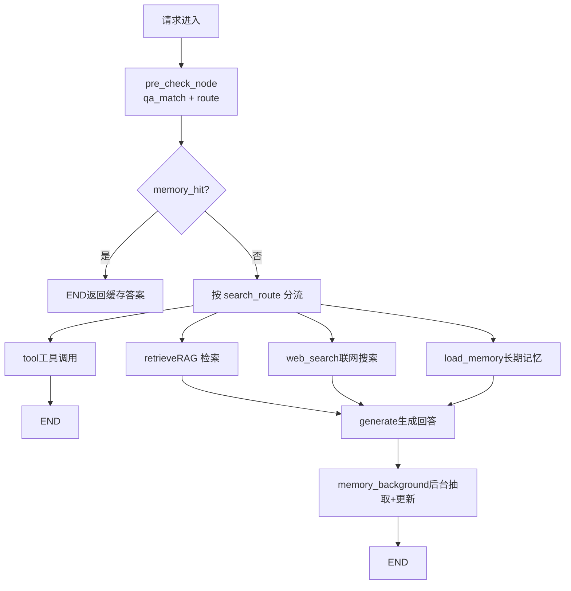
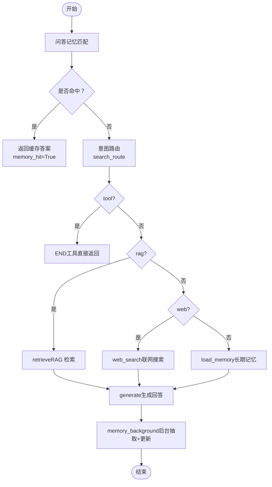
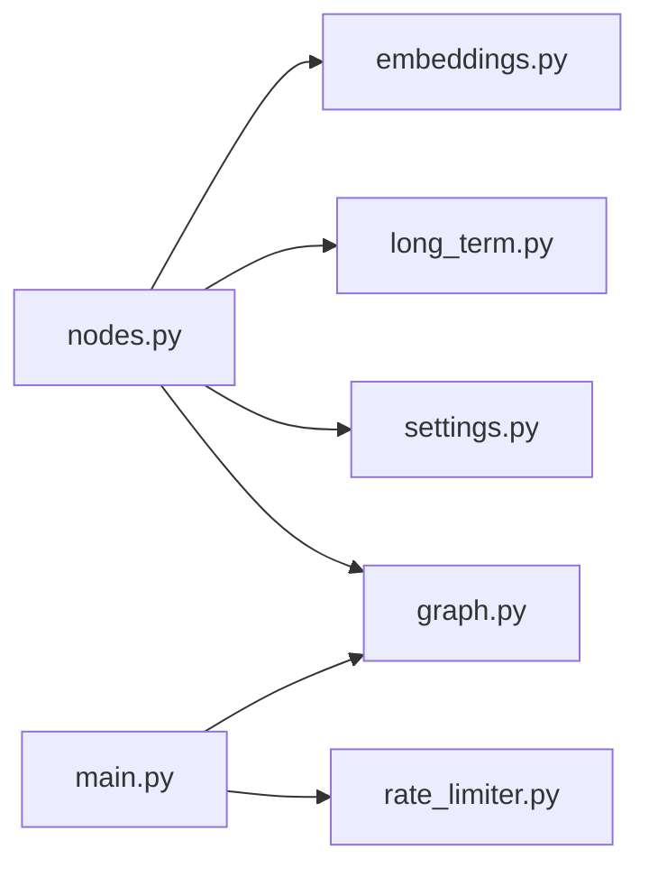

# 预检查节点

<cite>
**本文引用的文件**
- [agent/nodes.py](file://agent/nodes.py)
- [memory/long_term.py](file://memory/long_term.py)
- [rag/embeddings.py](file://rag/embeddings.py)
- [config/settings.py](file://config/settings.py)
- [agent/graph.py](file://agent/graph.py)
- [main.py](file://main.py)
- [tests/test_smoke.py](file://tests/test_smoke.py)
</cite>

## 目录
1. [简介](#简介)
2. [项目结构](#项目结构)
3. [核心组件](#核心组件)
4. [架构总览](#架构总览)
5. [详细组件分析](#详细组件分析)
6. [依赖关系分析](#依赖关系分析)
7. [性能考量](#性能考量)
8. [故障排查指南](#故障排查指南)
9. [结论](#结论)
10. [附录](#附录)

## 简介
本技术文档聚焦“预检查节点”的实现与工作原理，围绕以下目标展开：
- 深入解释 pre_check_node 的问答缓存匹配算法、相似度计算、阈值判断逻辑
- 说明缓存键生成策略、缓存存储结构与过期机制
- 阐述预检查失败时的降级处理流程，以及与后续四路分流机制的衔接
- 提供性能优化策略（缓存预热、批量查询、并发控制等）
- 给出故障排查指南与监控指标建议

## 项目结构
预检查节点位于智能体工作流的最前端，负责两件事：
- 问答记忆命中短路：若当前问题与历史问题高度相似，直接复用历史答案，跳过后续检索与生成链路
- 路由判断：通过规则+小模型意图识别，决定走工具调用、知识库检索、联网搜索或闲聊生成



图表来源
- [agent/graph.py:1-28](file://agent/graph.py#L1-L28)
- [agent/nodes.py:92-151](file://agent/nodes.py#L92-L151)

章节来源
- [agent/graph.py:1-28](file://agent/graph.py#L1-L28)
- [agent/nodes.py:92-151](file://agent/nodes.py#L92-L151)

## 核心组件
- pre_check_node：合并执行 qa_match_node 与 route_node，命中则短路到 END，否则继续分流
- qa_match_node：将用户输入向量化后在问答记忆中做余弦相似度检索，超过阈值即命中
- route_node/_decide_route：规则短路 + 小模型意图识别 + 关键词兜底，输出 search_route
- memory_update_node/_save_qa_cache：将本轮问答对写入问答记忆（仅知识类回答）
- long_term.py：问答记忆表结构、保存与检索实现（含余弦相似度计算）
- embeddings：文本向量化（BGE/Jina CLIP），供 qa_match 使用
- settings：全局配置项（开关、阈值、容量等）

章节来源
- [agent/nodes.py:92-151](file://agent/nodes.py#L92-L151)
- [agent/nodes.py:232-281](file://agent/nodes.py#L232-L281)
- [memory/long_term.py:700-820](file://memory/long_term.py#L700-L820)
- [rag/embeddings.py:164-180](file://rag/embeddings.py#L164-L180)
- [config/settings.py:114-133](file://config/settings.py#L114-L133)

## 架构总览
预检查节点处于 LangGraph 状态图起始位置，承担“快速短路 + 意图路由”的职责。其关键特性：
- 优先处理 pending_confirmation 的用户确认，避免重复工具调用
- 先做问答记忆匹配，命中则直接返回答案并标记 memory_hit=True，后续条件边短路至 END
- 未命中时进行路由判断，输出 search_route，由 pre_check_condition 分发到 tool/retrieve/web_search/load_memory/generate

```mermaid
sequenceDiagram
participant U as "用户"
participant API as "FastAPI /api/chat"
participant G as "LangGraph 图"
participant PC as "pre_check_node"
participant QM as "qa_match_node"
participant RT as "route_node"
participant END as "END"
U->>API : "发送消息"
API->>G : "invoke(state)"
G->>PC : "执行预检查"
PC->>QM : "向量检索问答记忆"
alt 命中
QM-->>PC : "answer, memory_hit=True"
PC-->>G : "返回结果"
G->>END : "短路结束"
else 未命中
QM-->>PC : "memory_hit=False, query_embedding"
PC->>RT : "意图路由"
RT-->>PC : "search_route"
PC-->>G : "返回结果"
G->>END : "按分流继续执行"
end
```

图表来源
- [agent/nodes.py:92-151](file://agent/nodes.py#L92-L151)
- [agent/nodes.py:232-281](file://agent/nodes.py#L232-L281)
- [agent/graph.py:77-92](file://agent/graph.py#L77-L92)

## 详细组件分析

### 预检查节点 pre_check_node
- 功能：合并问答缓存匹配与路由判断；若 pending_confirmation 存在且用户确认，则直接执行工具并短路到 END
- 顺序：先 qa_match_node，命中则直接返回；否则执行 route_node，得到 search_route
- 输出：answer（命中时）、memory_hit、query_embedding（用于后续复用）、messages（命中时写入短期历史）

章节来源
- [agent/nodes.py:92-128](file://agent/nodes.py#L92-L128)
- [agent/nodes.py:131-151](file://agent/nodes.py#L131-L151)

### 问答记忆匹配 qa_match_node
- 前置条件：开启 memory_qa_cache_enabled；user_id 存在；user_input 长度≥4；非时效性问题
- 向量化：调用 rag.embeddings.get_embeddings().embed_query(user_input)
- 检索：调用 memory.long_term.search_qa_by_embedding(user_id, vec, threshold)
- 命中：返回 answer、memory_hit=True、query_embedding，并写入短期消息上下文
- 失败降级：向量化或检索异常均静默降级为未命中，不阻断主链路

章节来源
- [agent/nodes.py:232-281](file://agent/nodes.py#L232-L281)
- [rag/embeddings.py:164-180](file://rag/embeddings.py#L164-L180)

### 相似度计算与阈值判断
- 相似度：余弦相似度，实现于 memory/long_term.py 的 _cosine
- 阈值：memory_qa_threshold（默认 0.90），可通过配置调整
- 复杂度：对每用户所有带 embedding 的记录逐一计算余弦相似度，时间复杂度 O(N·D)，N 为记录数，D 为向量维度
- 优化点：
  - 限制每用户最大记录数 memory_qa_max_records（默认 200）
  - 淘汰最旧记录，避免无限增长
  - 命中后更新 hit_count 与 updated_at，利于热数据保留

章节来源
- [memory/long_term.py:717-726](file://memory/long_term.py#L717-L726)
- [memory/long_term.py:784-820](file://memory/long_term.py#L784-L820)
- [config/settings.py:128-133](file://config/settings.py#L128-L133)

### 缓存键生成策略
- 存储键：以 user_id + question 作为唯一键（相同问题更新答案与 embedding）
- 索引：按 user_id 和 updated_at 排序，便于淘汰与检索
- 设计理由：同一用户的历史问答独立管理，避免跨用户污染；question 精确匹配保证高置信度复用

章节来源
- [memory/long_term.py:110-122](file://memory/long_term.py#L110-L122)
- [memory/long_term.py:729-781](file://memory/long_term.py#L729-L781)

### 缓存存储结构
- 表名：qa_memory
- 字段：id、user_id、question、answer、embedding（BLOB）、hit_count、created_at、updated_at
- 索引：idx_qa_user(user_id, updated_at DESC)
- 序列化：embedding 以 float32 小端序序列化为 BLOB

章节来源
- [memory/long_term.py:110-122](file://memory/long_term.py#L110-L122)
- [memory/long_term.py:700-715](file://memory/long_term.py#L700-L715)

### 过期机制
- 无显式 TTL 过期；采用“容量上限 + 时间淘汰”策略
- 当记录数超过 memory_qa_max_records，删除最旧记录（按 updated_at 升序）
- 命中会刷新 updated_at，提升热题留存概率

章节来源
- [memory/long_term.py:769-780](file://memory/long_term.py#L769-L780)
- [config/settings.py:128-133](file://config/settings.py#L128-L133)

### 预检查失败时的降级处理
- 向量化失败：捕获异常并返回 memory_hit=False，继续路由流程
- 检索失败：捕获异常并将 hit 置空，继续路由流程
- 路由失败：LLM 路由异常时回退到关键词兜底（工具优先 → RAG 优先 → 联网搜索 → 闲聊）
- 生成失败：主模型失败时尝试备用模型列表（llm_fallback_models 或 llm_fallback_model）

章节来源
- [agent/nodes.py:255-281](file://agent/nodes.py#L255-L281)
- [agent/nodes.py:180-211](file://agent/nodes.py#L180-L211)
- [agent/nodes.py:467-496](file://agent/nodes.py#L467-L496)

### 与四路分流机制的衔接
- pre_check_condition：根据 memory_hit 与 search_route 决定分流路径
  - memory_hit=True → END（短路）
  - search_route=tool → tool
  - search_route=rag → retrieve
  - search_route=web → web_search
  - 其他 → load_memory
- 工具调用直接返回结果，不经过 generate；其余分支最终汇聚到 generate，再进入 memory_background 后台更新

章节来源
- [agent/nodes.py:131-151](file://agent/nodes.py#L131-L151)
- [agent/graph.py:68-92](file://agent/graph.py#L68-L92)

### 流程图：预检查与分流


图表来源
- [agent/nodes.py:131-151](file://agent/nodes.py#L131-L151)
- [agent/nodes.py:232-281](file://agent/nodes.py#L232-L281)
- [agent/graph.py:68-92](file://agent/graph.py#L68-L92)

## 依赖关系分析
- nodes.py 依赖：
  - rag.embeddings：获取 Embedding 单例，用于向量化
  - memory.long_term：保存与检索问答记忆
  - config.settings：读取开关与阈值
  - agent.graph：定义工作流与条件边
- long_term.py 依赖：
  - sqlite3：持久化存储
  - struct：向量序列化
- embeddings.py 依赖：
  - torch/transformers 或 sentence-transformers：模型加载与推理
- main.py 依赖：
  - FastAPI：接口入口与 SSE 流式响应
  - rate_limiter：限流与熔断



图表来源
- [agent/nodes.py:1-21](file://agent/nodes.py#L1-L21)
- [memory/long_term.py:1-23](file://memory/long_term.py#L1-L23)
- [rag/embeddings.py:1-22](file://rag/embeddings.py#L1-L22)
- [config/settings.py:1-27](file://config/settings.py#L1-L27)
- [agent/graph.py:1-28](file://agent/graph.py#L1-L28)
- [main.py:1-40](file://main.py#L1-L40)

章节来源
- [agent/nodes.py:1-21](file://agent/nodes.py#L1-L21)
- [memory/long_term.py:1-23](file://memory/long_term.py#L1-L23)
- [rag/embeddings.py:1-22](file://rag/embeddings.py#L1-L22)
- [config/settings.py:1-27](file://config/settings.py#L1-L27)
- [agent/graph.py:1-28](file://agent/graph.py#L1-L28)
- [main.py:1-40](file://main.py#L1-L40)

## 性能考量
- 缓存命中率优化
  - 合理设置 memory_qa_threshold（默认 0.90），平衡召回与准确率
  - 控制 memory_qa_max_records（默认 200），避免冷数据稀释相似度
  - 命中后刷新 updated_at，提升热题留存
- 向量化成本
  - 使用 BGE 或 Jina CLIP v2，CPU 下 BGE 更快（约 30x）
  - 复用 query_embedding：qa_match 产出的向量可被 retrieve 复用，避免重复编码
- 启动预热
  - LLM 连接预热（router_llm 与 main_llm）
  - 向量库与 BM25 索引预热，降低首请求延迟
- 并发与超时
  - SQLite WAL 模式支持并发读
  - 流式接口整体超时保护，防止连接卡死
- 降级与容错
  - 路由失败回退关键词
  - 生成失败多模型降级
  - 检索失败返回空上下文，不阻断生成

章节来源
- [rag/embeddings.py:131-180](file://rag/embeddings.py#L131-L180)
- [main.py:45-135](file://main.py#L45-L135)
- [main.py:228-314](file://main.py#L228-L314)
- [memory/long_term.py:30-47](file://memory/long_term.py#L30-L47)
- [config/settings.py:114-133](file://config/settings.py#L114-L133)

## 故障排查指南
- 常见问题定位
  - 问答记忆未命中：检查 memory_qa_cache_enabled、user_id、user_input 长度、是否为时效性问题
  - 向量化失败：查看 embeddings 初始化日志与设备配置（CPU/GPU）
  - 检索失败：检查 SQLite 连接与表结构，确认 embedding 字段非空
  - 路由失败：查看 LLM 路由异常日志，确认关键词兜底生效
  - 生成失败：检查主模型与备用模型配置，确认 fallback 列表有效
- 监控指标建议
  - 预检查命中率：memory_hit 比例
  - 相似度分布：命中记录的 score 分布，评估阈值合理性
  - 缓存容量：每用户 qa_memory 记录数，接近 memory_qa_max_records 时需扩容或调优
  - 路由分布：tool/rag/web/chat 占比，评估意图识别效果
  - 生成成功率：主模型与备用模型成功次数、失败原因
  - 流式超时：整体超时次数与部分生成比例
- 测试验证
  - 单元测试覆盖问答记忆存取与相似度匹配（高相似命中、低相似不命中、相同问题更新）
  - 图编译与节点执行路径验证（无 checkpointer 模式）

章节来源
- [memory/long_term.py:729-820](file://memory/long_term.py#L729-L820)
- [tests/test_smoke.py:131-147](file://tests/test_smoke.py#L131-L147)
- [tests/test_smoke.py:161-167](file://tests/test_smoke.py#L161-L167)

## 结论
预检查节点通过“问答记忆命中短路 + 意图路由”显著降低首条请求延迟与 LLM 调用成本。其核心在于：
- 高效的相似度检索与合理的阈值控制
- 稳定的降级与容错机制
- 与四路分流的无缝衔接
- 完善的预热与监控体系

在生产环境中，建议结合业务特征调优阈值与容量，持续观察命中率与延迟指标，确保系统稳定高效运行。

## 附录
- 配置项参考
  - memory_qa_cache_enabled：问答记忆缓存开关
  - memory_qa_threshold：相似度阈值
  - memory_qa_max_records：每用户最大记录数
  - web_search_enabled：联网搜索开关
  - tool_calling_enabled：工具调用开关
  - stream_timeout：流式接口整体超时

章节来源
- [config/settings.py:114-133](file://config/settings.py#L114-L133)
- [config/settings.py:109-112](file://config/settings.py#L109-L112)
- [config/settings.py:151-155](file://config/settings.py#L151-L155)
- [config/settings.py:47-48](file://config/settings.py#L47-L48)