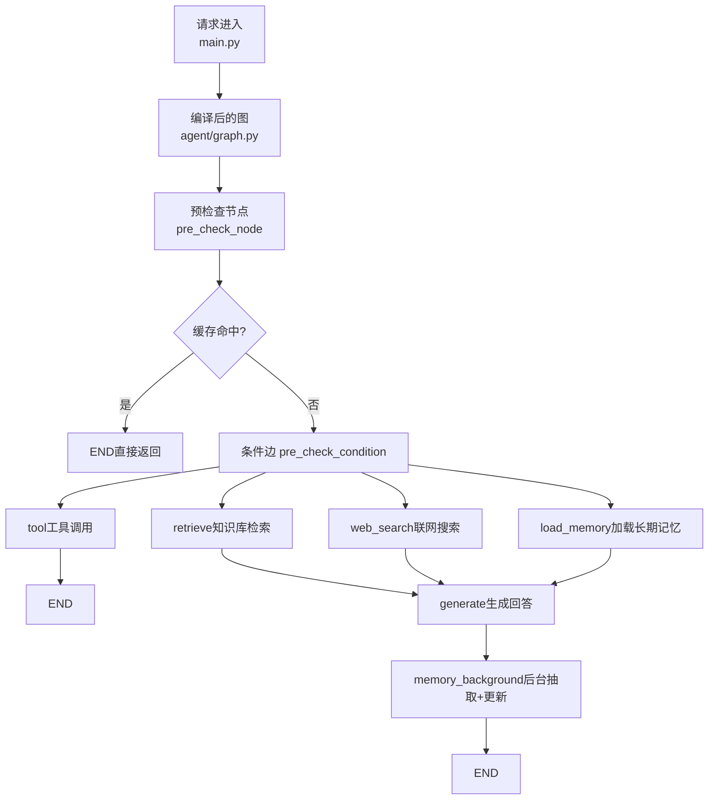
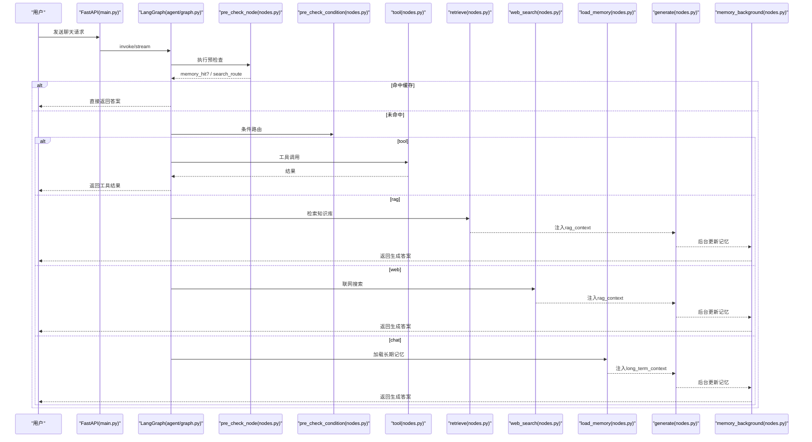
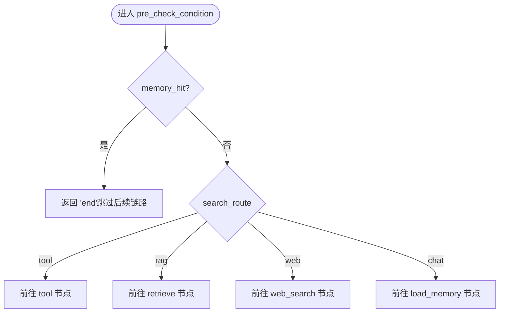
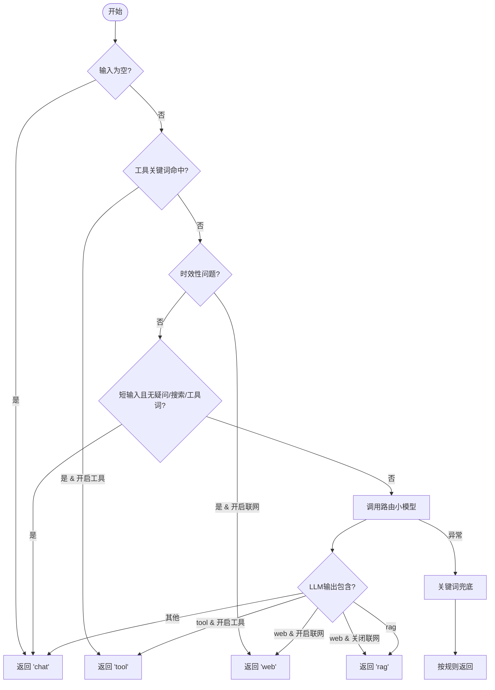
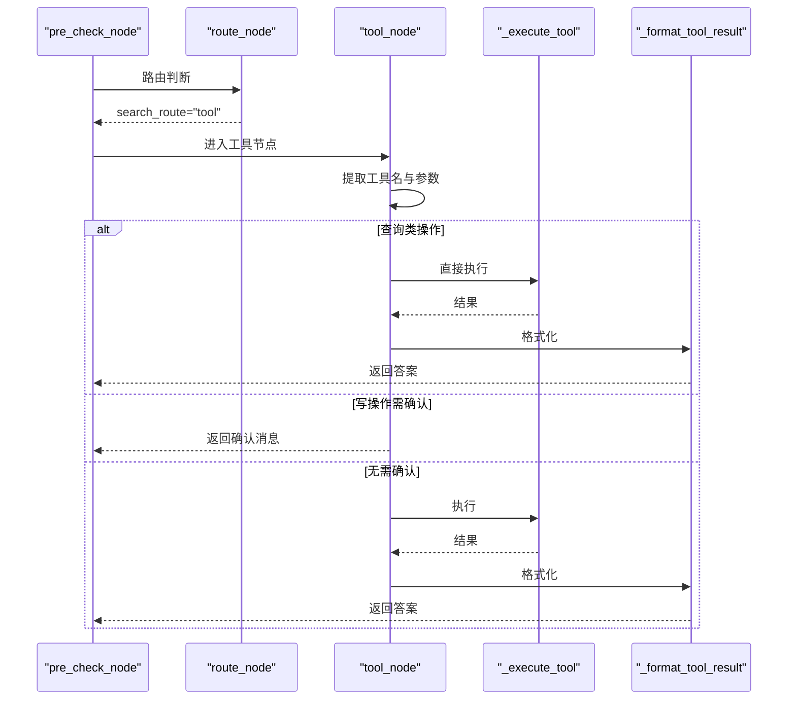
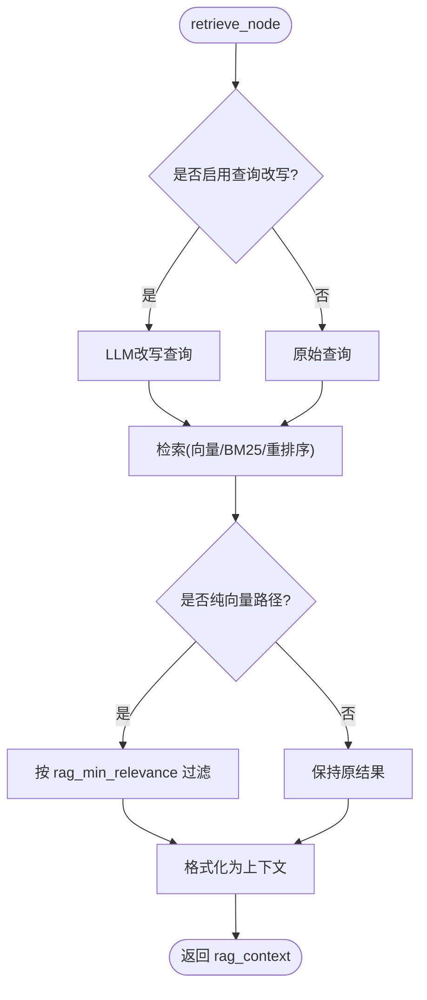
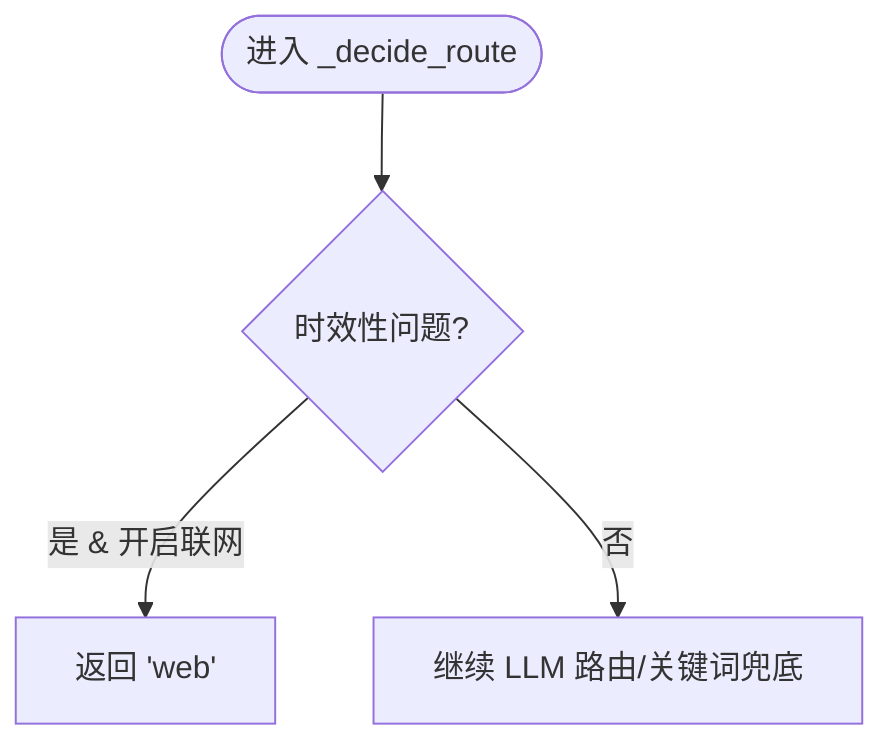
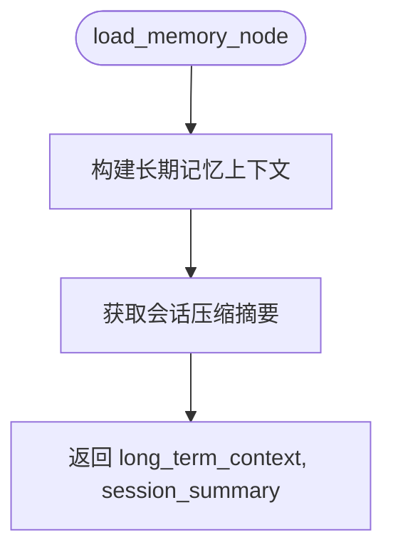
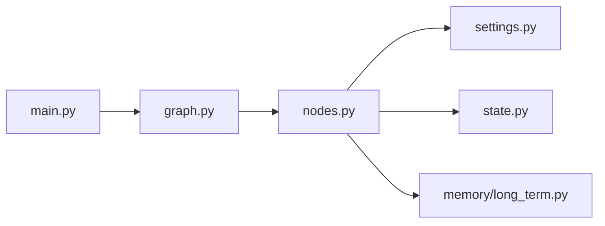

# 路由机制

<cite>
**本文引用的文件**
- [agent/graph.py](file://agent/graph.py)
- [agent/nodes.py](file://agent/nodes.py)
- [config/settings.py](file://config/settings.py)
- [main.py](file://main.py)
- [agent/state.py](file://agent/state.py)
- [memory/long_term.py](file://memory/long_term.py)
</cite>

## 目录
1. [简介](#简介)
2. [项目结构](#项目结构)
3. [核心组件](#核心组件)
4. [架构总览](#架构总览)
5. [详细组件分析](#详细组件分析)
6. [依赖关系分析](#依赖关系分析)
7. [性能考虑](#性能考虑)
8. [故障排查指南](#故障排查指南)
9. [结论](#结论)
10. [附录](#附录)

## 简介
本技术文档聚焦 Agent 的“四路分流”路由机制，围绕意图识别、路由决策与条件分支逻辑展开，重点解释 pre_check_condition 的路由判断流程，包括工具调用检测、知识库检索优先级、联网搜索触发条件、记忆加载时机。同时给出路由策略的可配置性与扩展性设计，提供快速路径、短路机制、负载均衡等优化方案，并配套监控调试手段与常见问题排查方法。

## 项目结构
Agent 路由基于 LangGraph 的状态图编排，入口为 graph.py 构建工作流，节点逻辑集中在 nodes.py；全局开关与阈值在 settings.py；状态定义在 state.py；长期记忆上下文构建在 memory/long_term.py；Web 接口与启动预热在 main.py。

图表来源
- [agent/graph.py:44-102](file://agent/graph.py#L44-L102)
- [agent/nodes.py:93-150](file://agent/nodes.py#L93-L150)

章节来源
- [agent/graph.py:1-102](file://agent/graph.py#L1-L102)
- [agent/nodes.py:1-150](file://agent/nodes.py#L1-L150)
- [config/settings.py:1-216](file://config/settings.py#L1-L216)
- [main.py:1-136](file://main.py#L1-L136)

## 核心组件
- 预检查节点：合并问答缓存匹配与路由判断，支持待确认工具执行优先处理。
- 条件路由：根据 memory_hit 与 search_route 决定走 tool/retrieve/web_search/load_memory/generate/end。
- 路由判断：LLM 小模型意图识别 + 关键词兜底，含时效性问题快速短路。
- 知识检索：RAG 检索与重排序、BM25 多路召回、查询改写。
- 联网搜索：按配置开关与超时控制。
- 长期记忆：分层构建用户画像、关键事实、历史摘要，会话压缩摘要防丢失。
- 后台记忆：异步抽取与更新，不阻塞主响应链路。
- 工具调用：参数提取、写操作确认、结果格式化。

章节来源
- [agent/nodes.py:93-150](file://agent/nodes.py#L93-L150)
- [agent/nodes.py:154-230](file://agent/nodes.py#L154-L230)
- [agent/nodes.py:285-341](file://agent/nodes.py#L285-L341)
- [agent/nodes.py:345-360](file://agent/nodes.py#L345-L360)
- [agent/nodes.py:631-643](file://agent/nodes.py#L631-L643)
- [agent/nodes.py:647-780](file://agent/nodes.py#L647-L780)
- [memory/long_term.py:424-456](file://memory/long_term.py#L424-L456)

## 架构总览
整体采用“预检查 + 四路分流 + 后台记忆”的工作流：
- START → pre_check（qa_match + route）
- 若 qa_match 命中 → END（复用历史答案）
- 否则 → pre_check_condition 分流至 tool/retrieve/web_search/load_memory
- retrieve/web_search/load_memory 均汇入 generate
- generate 完成后后台执行 memory_background（抽取+更新），不阻塞响应

图表来源
- [agent/graph.py:44-102](file://agent/graph.py#L44-L102)
- [agent/nodes.py:93-150](file://agent/nodes.py#L93-L150)
- [agent/nodes.py:154-230](file://agent/nodes.py#L154-L230)
- [agent/nodes.py:285-341](file://agent/nodes.py#L285-L341)
- [agent/nodes.py:345-360](file://agent/nodes.py#L345-L360)
- [agent/nodes.py:499-532](file://agent/nodes.py#L499-L532)
- [agent/nodes.py:631-643](file://agent/nodes.py#L631-L643)

## 详细组件分析

### 预检查与四路分流
- pre_check_node：先处理 pending_confirmation（用户确认工具操作），再执行 qa_match_node（问答缓存匹配），命中则短路到 END；否则执行 route_node 得到 search_route。
- pre_check_condition：若 memory_hit 为真则返回 end；否则依据 search_route 分流：
  - tool → tool（工具调用）
  - rag → retrieve（知识库检索）
  - web → web_search（联网搜索）
  - 其他（chat）→ load_memory（加载长期记忆后生成）
  - 保留 generate 分支供未来直通场景

图表来源
- [agent/nodes.py:131-150](file://agent/nodes.py#L131-L150)

章节来源
- [agent/nodes.py:93-150](file://agent/nodes.py#L93-L150)

### 意图识别与路由决策
- route_node：调用 _decide_route(user_input) 写入 search_route。
- _decide_route 决策顺序：
  1) 空输入 → chat
  2) 工具关键词命中且开启工具调用 → tool（快速短路）
  3) 时效性问题（天气/明确时间表达）且开启联网搜索 → web（绕过 LLM 提速）
  4) 短输入且不含疑问/搜索/工具词 → chat
  5) 调用路由小模型进行意图识别（temperature=0.0）
     - 若包含 tool 且开启工具调用 → tool
     - 若包含 web 且关闭联网搜索 → 降级为 rag；否则 web
     - 若包含 rag → rag
     - 否则 → chat
  6) 异常时回退到关键词兜底（工具优先 → RAG 优先 → 联网搜索 → chat）

图表来源
- [agent/nodes.py:161-211](file://agent/nodes.py#L161-L211)

章节来源
- [agent/nodes.py:154-211](file://agent/nodes.py#L154-L211)

### 工具调用检测与执行
- 工具关键词优先短路：TOOL_KEYWORDS 命中且 tool_calling_enabled 为真时直接走 tool。
- 工具参数提取：使用路由小模型从用户输入解析工具名与参数。
- 写操作确认：当 tool_confirmation_required 为真时，写操作需用户确认后再执行。
- 执行与格式化：_execute_tool 分发到具体工具实现，_format_tool_result 将结果转为可读文本。

图表来源
- [agent/nodes.py:647-780](file://agent/nodes.py#L647-L780)

章节来源
- [agent/nodes.py:647-780](file://agent/nodes.py#L647-L780)

### 知识库检索优先级与过滤
- retrieve_node：可选查询改写 → 检索 → 相关度阈值过滤（仅在纯向量路径生效）→ 格式化上下文。
- 相关度过滤：当 rerank_enabled 与 rag_bm25_enabled 均为假时，使用 rag_min_relevance 过滤低质文档，避免注入噪声。
- 多路召回：可启用 BM25 与向量并行召回，RRF 融合排序提升精确匹配召回率。
- 重排序：默认启用 CrossEncoder 精排，失败时回退原始结果。

图表来源
- [agent/nodes.py:285-321](file://agent/nodes.py#L285-L321)
- [config/settings.py:83-100](file://config/settings.py#L83-L100)

章节来源
- [agent/nodes.py:285-321](file://agent/nodes.py#L285-L321)
- [config/settings.py:83-100](file://config/settings.py#L83-L100)

### 联网搜索触发条件
- 时效性问题快速短路：_is_realtime_query 检测天气或明确时间表达，若 web_search_enabled 为真则直接走 web_search。
- 路由小模型输出包含 web 且未关闭联网搜索时，也走 web_search。
- 失败或无结果时降级为空白上下文，不影响主链路。

图表来源
- [agent/nodes.py:80-90](file://agent/nodes.py#L80-L90)
- [agent/nodes.py:161-174](file://agent/nodes.py#L161-L174)

章节来源
- [agent/nodes.py:80-90](file://agent/nodes.py#L80-L90)
- [agent/nodes.py:161-174](file://agent/nodes.py#L161-L174)

### 记忆加载时机
- load_memory_node：在 chat 分支下加载长期记忆上下文与会话压缩摘要，注入 generate 节点。
- 长期记忆上下文构建：分层 P0/P1/P2，保证用户画像与关键事实硬保留，摘要层按预算填充。
- 会话压缩摘要：短期窗口超出时压缩旧消息，防止上下文硬丢失。

图表来源
- [agent/nodes.py:345-360](file://agent/nodes.py#L345-L360)
- [memory/long_term.py:424-456](file://memory/long_term.py#L424-L456)

章节来源
- [agent/nodes.py:345-360](file://agent/nodes.py#L345-L360)
- [memory/long_term.py:424-456](file://memory/long_term.py#L424-L456)

### 后台记忆更新
- memory_background_node：顺序执行 extract_facts_node 与 memory_update_node，内部独立 try/except 兜底，任一失败不影响另一者。
- 时效性问题不保存长期记忆，避免过时信息污染记忆库。

章节来源
- [agent/nodes.py:631-643](file://agent/nodes.py#L631-L643)

## 依赖关系分析
- graph.py 通过 add_conditional_edges 将 pre_check 的输出映射到不同节点，形成五路分流（含 end）。
- nodes.py 中的各节点依赖 config/settings.py 的全局开关与阈值，如 tool_calling_enabled、web_search_enabled、rerank_enabled、rag_bm25_enabled 等。
- state.py 定义了 AgentState 字段，承载 messages、user_input、search_route、rag_context、long_term_context、session_summary、answer、工具相关字段等。
- memory/long_term.py 提供长期记忆上下文构建与会话摘要能力。

图表来源
- [agent/graph.py:44-102](file://agent/graph.py#L44-L102)
- [agent/nodes.py:1-211](file://agent/nodes.py#L1-L211)
- [config/settings.py:1-216](file://config/settings.py#L1-L216)
- [agent/state.py:12-54](file://agent/state.py#L12-L54)
- [memory/long_term.py:424-456](file://memory/long_term.py#L424-L456)
- [main.py:1-136](file://main.py#L1-L136)

章节来源
- [agent/graph.py:44-102](file://agent/graph.py#L44-L102)
- [agent/nodes.py:1-211](file://agent/nodes.py#L1-L211)
- [config/settings.py:1-216](file://config/settings.py#L1-L216)
- [agent/state.py:12-54](file://agent/state.py#L12-L54)
- [memory/long_term.py:424-456](file://memory/long_term.py#L424-L456)
- [main.py:1-136](file://main.py#L1-L136)

## 性能考虑
- 快速路径与短路机制
  - 问答缓存命中直接返回，跳过整条生成链路。
  - 工具关键词与时效性问题快速短路，减少 LLM 调用。
  - 纯向量路径下的相关度阈值过滤，降低无效上下文注入。
- 负载均衡与容错
  - 主模型失败自动降级到备用模型列表，依次尝试直至成功。
  - 联网搜索失败或无结果时降级为空白上下文，不阻断主链路。
  - 流式接口整体超时保护，超时后返回已生成的 token，防止连接卡死。
- 预热与索引优化
  - 启动时预热 LLM 连接（TLS握手、DNS解析、连接池建立），显著降低首条请求延迟。
  - 启动时检查向量库并自动增量入库，必要时全量重建；BM25 索引预热避免首请求阻塞。
- 后台任务非阻塞
  - memory_background 异步执行抽取与更新，不阻塞响应链路。

章节来源
- [agent/nodes.py:121-128](file://agent/nodes.py#L121-L128)
- [agent/nodes.py:161-211](file://agent/nodes.py#L161-L211)
- [agent/nodes.py:467-496](file://agent/nodes.py#L467-L496)
- [agent/nodes.py:631-643](file://agent/nodes.py#L631-L643)
- [main.py:45-136](file://main.py#L45-L136)
- [main.py:228-314](file://main.py#L228-L314)

## 故障排查指南
- 路由误判
  - 检查 tool_calling_enabled、web_search_enabled 配置是否正确。
  - 查看 _decide_route 的关键词命中与 LLM 路由输出，必要时调整关键词或阈值。
- 检索质量不佳
  - 调整 rag_min_relevance、rag_top_k、rerank_top_k、rag_bm25_candidate_count。
  - 检查 rerank_enabled 与 rag_bm25_enabled 的组合对过滤逻辑的影响。
- 联网搜索失败
  - 检查 web_search_timeout 与网络连通性；失败时关注降级行为。
- 长期记忆加载失败
  - 检查 memory/long_term.py 的 build_memory_context 与 get_session_summary 异常日志。
- 工具调用失败
  - 检查 _execute_tool 的分发与工具实现；确认 tool_confirmation_required 设置。
- 流式超时
  - 调整 stream_timeout；关注记录的成功/失败计数以评估熔断器状态。

章节来源
- [config/settings.py:109-155](file://config/settings.py#L109-L155)
- [agent/nodes.py:285-341](file://agent/nodes.py#L285-L341)
- [agent/nodes.py:345-360](file://agent/nodes.py#L345-L360)
- [agent/nodes.py:647-780](file://agent/nodes.py#L647-L780)
- [main.py:228-314](file://main.py#L228-L314)

## 结论
该路由机制通过“预检查 + 四路分流 + 后台记忆”的设计，实现了高可用、可扩展的智能体工作流。意图识别采用 LLM 小模型与关键词兜底结合，兼顾速度与准确率；工具调用、知识库检索、联网搜索与长期记忆加载各司其职，并通过配置开关灵活控制。性能方面提供了多种快速路径与短路机制，配合预热、降级与超时保护，确保服务稳定性与用户体验。

## 附录
- 状态字段说明（AgentState）
  - messages：多轮消息历史（reducer 累加）
  - user_input：当前用户输入
  - user_id/session_id：用户与会话标识
  - search_route：路由结果（rag/web/chat/tool）
  - rag_context：检索或搜索结果上下文
  - long_term_context：长期记忆上下文
  - session_summary：会话压缩摘要
  - memory_hit：问答缓存命中标志
  - query_embedding：问题向量（用于 QA 缓存落库）
  - answer：最终回答
  - 工具相关：tool_name、tool_params、tool_result、pending_confirmation、confirmation_context

章节来源
- [agent/state.py:12-54](file://agent/state.py#L12-L54)