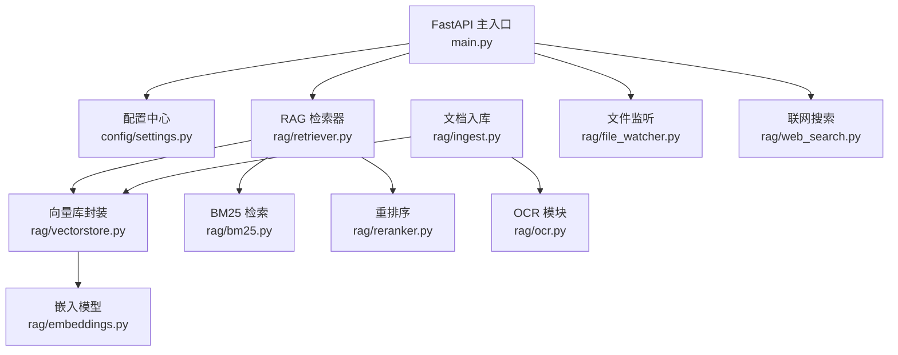
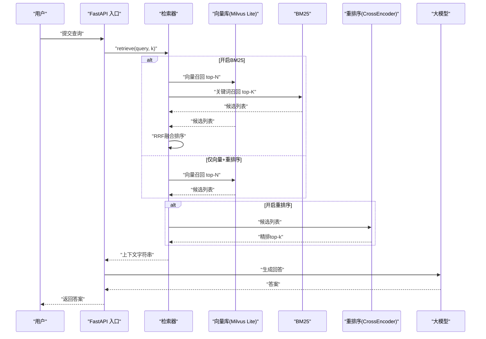
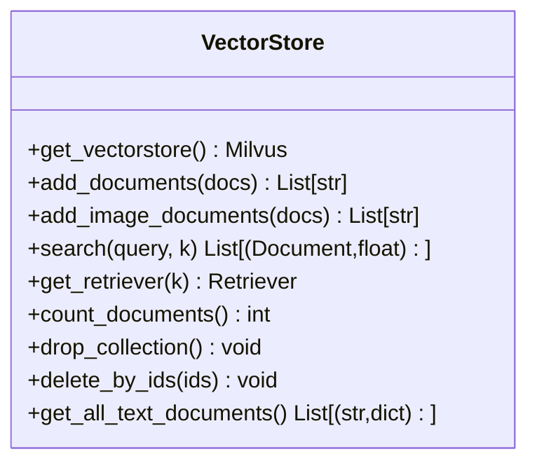
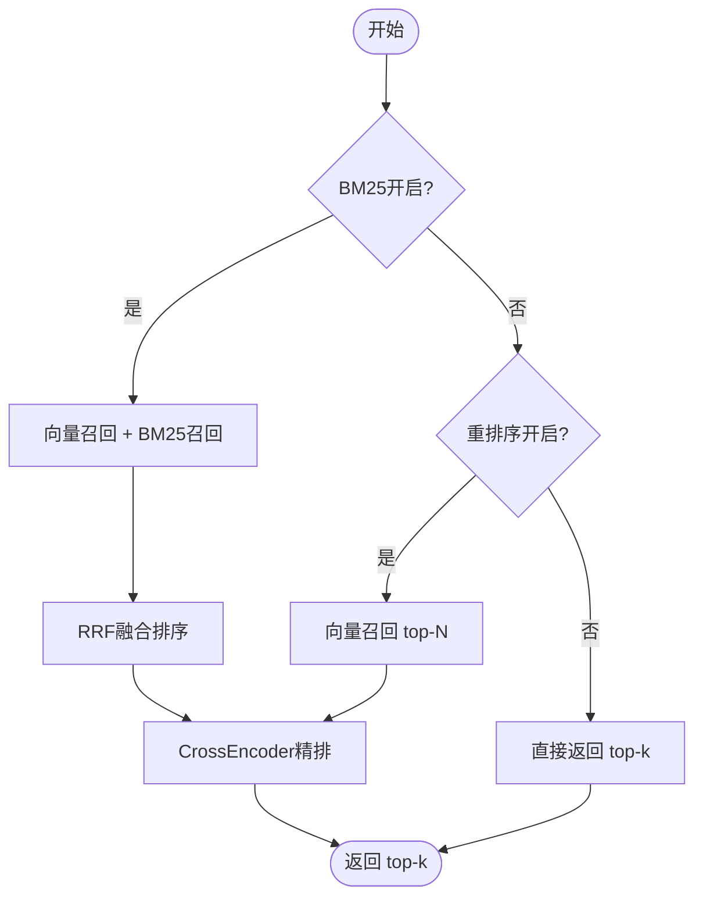
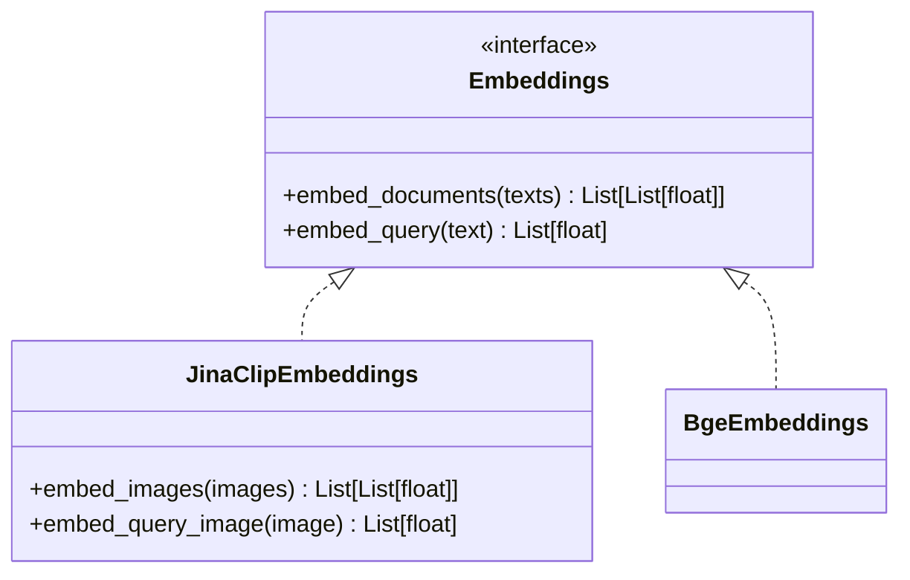
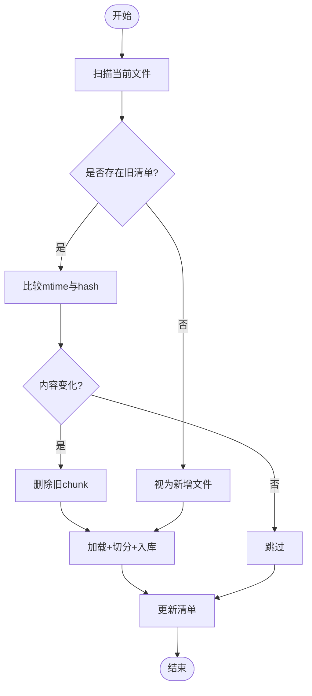
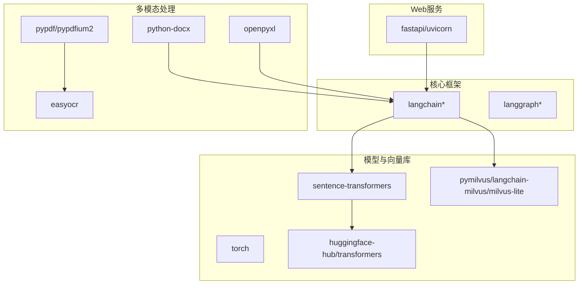

# RAG检索系统

<cite>
**本文引用的文件**
- [main.py](file://main.py)
- [config/settings.py](file://config/settings.py)
- [rag/vectorstore.py](file://rag/vectorstore.py)
- [rag/retriever.py](file://rag/retriever.py)
- [rag/embeddings.py](file://rag/embeddings.py)
- [rag/bm25.py](file://rag/bm25.py)
- [rag/reranker.py](file://rag/reranker.py)
- [rag/ingest.py](file://rag/ingest.py)
- [rag/ocr.py](file://rag/ocr.py)
- [rag/file_watcher.py](file://rag/file_watcher.py)
- [rag/web_search.py](file://rag/web_search.py)
- [requirements.txt](file://requirements.txt)
</cite>

## 目录
1. [简介](#简介)
2. [项目结构](#项目结构)
3. [核心组件](#核心组件)
4. [架构总览](#架构总览)
5. [详细组件分析](#详细组件分析)
6. [依赖关系分析](#依赖关系分析)
7. [性能考量](#性能考量)
8. [故障排查指南](#故障排查指南)
9. [结论](#结论)
10. [附录](#附录)

## 简介
本技术文档面向“RAG检索系统”的完整实现，覆盖多模态文档处理、向量化存储、语义检索、重排序优化、混合检索策略（向量相似度与BM25关键词检索结合）、Milvus Lite集成、嵌入模型选择与配置、数据入库流程、检索查询流程以及性能优化策略。系统以LangChain为核心编排，使用Milvus Lite作为本地持久化向量数据库，支持文本与图像统一编码与检索；通过CrossEncoder进行精排提升召回质量；提供运行时知识库自动同步能力，确保增量更新无需重启服务。

## 项目结构
- 入口与服务：FastAPI主入口负责启动预热、健康检查、聊天接口与流式输出。
- 配置管理：集中式配置加载，涵盖LLM、Embedding、向量库、OCR、检索、记忆等参数。
- RAG模块：
  - 向量库封装：Milvus Lite集合管理、索引、写入与查询。
  - 检索器：两阶段检索（向量召回+重排序），可选BM25混合召回与RRF融合。
  - 嵌入模型：Jina CLIP v2多模态与BGE纯文本双实现，按配置自动选择。
  - BM25：内存索引构建与关键词检索。
  - 重排序：CrossEncoder对候选结果精排。
  - 文档入库：多格式解析、OCR、切分、增量入库与清单管理。
  - OCR：PDF与图片文字识别，扫描页兜底。
  - 文件监听：watchdog事件驱动增量入库与BM25索引重置。
  - 联网搜索：DuckDuckGo优先，百度备用，统一格式化。

**图表来源**
- [main.py:45-135](file://main.py#L45-L135)
- [config/settings.py:19-100](file://config/settings.py#L19-L100)
- [rag/retriever.py:18-52](file://rag/retriever.py#L18-L52)
- [rag/vectorstore.py:29-76](file://rag/vectorstore.py#L29-L76)
- [rag/bm25.py:22-66](file://rag/bm25.py#L22-L66)
- [rag/reranker.py:30-51](file://rag/reranker.py#L30-L51)
- [rag/embeddings.py:29-66](file://rag/embeddings.py#L29-L66)
- [rag/ingest.py:289-388](file://rag/ingest.py#L289-L388)
- [rag/ocr.py:26-43](file://rag/ocr.py#L26-L43)
- [rag/file_watcher.py:107-140](file://rag/file_watcher.py#L107-L140)
- [rag/web_search.py:76-94](file://rag/web_search.py#L76-L94)

**章节来源**
- [main.py:45-135](file://main.py#L45-L135)
- [config/settings.py:19-100](file://config/settings.py#L19-L100)

## 核心组件
- 向量库封装（Milvus Lite）：延迟初始化单例，支持文本与图像异构metadata共存，FLAT索引与L2距离度量，读写并发保护与flush持久化。
- 检索器：支持三种模式——仅向量检索、向量+重排序、向量+BM25混合召回+RRF融合+重排序。
- 嵌入模型：Jina CLIP v2（多模态，1024维）与BGE（纯文本，512维），按配置自动选择，CPU/GPU设备可配。
- BM25：进程内单例索引，字符级切分，从向量库拉取文本文档构建，检索返回相关度分数。
- 重排序：CrossEncoder（bge-reranker-base）对候选逐对打分，失败回退原始结果。
- 文档入库：多格式解析（txt/md/pdf/docx/xlsx/图片），OCR兜底，递归切分，增量指纹驱动，清单管理。
- 文件监听：watchdog事件触发增量入库，防抖避免频繁写入，自动重置BM25索引。
- 联网搜索：DuckDuckGo优先，百度备用，统一上下文格式化。

**章节来源**
- [rag/vectorstore.py:29-76](file://rag/vectorstore.py#L29-L76)
- [rag/retriever.py:18-52](file://rag/retriever.py#L18-L52)
- [rag/embeddings.py:29-66](file://rag/embeddings.py#L29-L66)
- [rag/bm25.py:22-66](file://rag/bm25.py#L22-L66)
- [rag/reranker.py:30-51](file://rag/reranker.py#L30-L51)
- [rag/ingest.py:289-388](file://rag/ingest.py#L289-L388)
- [rag/file_watcher.py:107-140](file://rag/file_watcher.py#L107-L140)
- [rag/web_search.py:76-94](file://rag/web_search.py#L76-L94)

## 架构总览
系统采用“检索增强生成”的两阶段架构：先召回再精排，结合多路召回与重排序提升准确率；同时支持多模态文档统一编码与跨模态检索。

**图表来源**
- [rag/retriever.py:18-52](file://rag/retriever.py#L18-L52)
- [rag/vectorstore.py:164-184](file://rag/vectorstore.py#L164-L184)
- [rag/bm25.py:69-97](file://rag/bm25.py#L69-L97)
- [rag/reranker.py:54-98](file://rag/reranker.py#L54-L98)
- [main.py:154-209](file://main.py#L154-L209)

## 详细组件分析

### Milvus Lite 向量库封装
- 延迟初始化单例，连接参数指向本地 .db 文件启用Milvus Lite，禁用空闲ping避免断连。
- 动态字段支持文本/图像异构metadata共存；主键为varchar(uuid)，手动管理。
- 写入加锁避免文件监听线程与检索路径并发冲突；显式flush确保磁盘持久化。
- 提供计数、删除集合、按id删除、全量文本拉取（用于BM25索引构建）。

**图表来源**
- [rag/vectorstore.py:29-76](file://rag/vectorstore.py#L29-L76)
- [rag/vectorstore.py:79-106](file://rag/vectorstore.py#L79-L106)
- [rag/vectorstore.py:109-161](file://rag/vectorstore.py#L109-L161)
- [rag/vectorstore.py:164-184](file://rag/vectorstore.py#L164-L184)
- [rag/vectorstore.py:193-281](file://rag/vectorstore.py#L193-L281)

**章节来源**
- [rag/vectorstore.py:29-76](file://rag/vectorstore.py#L29-L76)
- [rag/vectorstore.py:79-106](file://rag/vectorstore.py#L79-L106)
- [rag/vectorstore.py:109-161](file://rag/vectorstore.py#L109-L161)
- [rag/vectorstore.py:164-184](file://rag/vectorstore.py#L164-L184)
- [rag/vectorstore.py:193-281](file://rag/vectorstore.py#L193-L281)

### 检索器与混合检索策略
- 三模式：仅向量检索；向量+重排序；向量+BM25混合召回+RRF融合+重排序。
- RRF融合公式 score(d)=sum(1/(k+rank))，仅依赖排名，统一不同分数语义。
- 上下文格式化将向量距离与重排序分数归一化为0~1区间展示。

**图表来源**
- [rag/retriever.py:18-52](file://rag/retriever.py#L18-L52)
- [rag/retriever.py:55-110](file://rag/retriever.py#L55-L110)
- [rag/retriever.py:113-139](file://rag/retriever.py#L113-L139)

**章节来源**
- [rag/retriever.py:18-52](file://rag/retriever.py#L18-L52)
- [rag/retriever.py:55-110](file://rag/retriever.py#L55-L110)
- [rag/retriever.py:113-139](file://rag/retriever.py#L113-L139)

### 嵌入模型选择与配置
- Jina CLIP v2：多模态统一向量空间（文本+图像），1024维，延迟加载，L2归一化。
- BGE：纯文本快速编码，512维，适合纯文本知识库场景。
- 自动选择逻辑：根据配置中的模型名是否包含“bge”决定使用哪个实现。

**图表来源**
- [rag/embeddings.py:29-66](file://rag/embeddings.py#L29-L66)
- [rag/embeddings.py:67-94](file://rag/embeddings.py#L67-L94)
- [rag/embeddings.py:96-128](file://rag/embeddings.py#L96-L128)
- [rag/embeddings.py:131-161](file://rag/embeddings.py#L131-L161)
- [rag/embeddings.py:164-179](file://rag/embeddings.py#L164-L179)

**章节来源**
- [rag/embeddings.py:29-66](file://rag/embeddings.py#L29-L66)
- [rag/embeddings.py:67-94](file://rag/embeddings.py#L67-L94)
- [rag/embeddings.py:96-128](file://rag/embeddings.py#L96-L128)
- [rag/embeddings.py:131-161](file://rag/embeddings.py#L131-L161)
- [rag/embeddings.py:164-179](file://rag/embeddings.py#L164-L179)

### BM25 关键词检索
- 进程内单例索引，首次构建时从向量库拉取全部文本文档（跳过图像）。
- 中文按字符级切分，无需额外分词依赖；检索时过滤零分文档。
- 支持重置索引以适配向量库重建后的数据一致性。

**章节来源**
- [rag/bm25.py:22-66](file://rag/bm25.py#L22-L66)
- [rag/bm25.py:69-97](file://rag/bm25.py#L69-L97)
- [rag/bm25.py:100-106](file://rag/bm25.py#L100-L106)

### 重排序优化
- CrossEncoder（bge-reranker-base）对query-doc对逐对打分，精度更高但计算量大。
- 候选数不足或重排序失败时回退到原始向量检索结果，保证可用性。
- 延迟初始化单例，首次调用下载模型权重。

**章节来源**
- [rag/reranker.py:30-51](file://rag/reranker.py#L30-L51)
- [rag/reranker.py:54-98](file://rag/reranker.py#L54-L98)

### 数据入库流程
- 多格式解析：txt/md直接读取；pdf文本优先，扫描件OCR兜底并生成页面图像；docx用Docx2txtLoader；xlsx遍历sheet单元格；图片OCR提取文本并生成图像文档。
- 文本切分：RecursiveCharacterTextSplitter，图像文档不参与切分直接保留。
- 增量入库：基于mtime预筛与hash确认，修改文件先删旧chunk再入库；删除文件清理孤儿chunk；清单记录每个文件的hash、mtime与chunk_ids。
- 启动预热：服务启动时检查向量库是否为空，为空则自动全量重建；BM25索引预热避免首请求阻塞。

**图表来源**
- [rag/ingest.py:289-388](file://rag/ingest.py#L289-L388)
- [rag/ingest.py:34-91](file://rag/ingest.py#L34-L91)
- [rag/ingest.py:94-182](file://rag/ingest.py#L94-L182)
- [rag/ingest.py:185-216](file://rag/ingest.py#L185-L216)
- [rag/ingest.py:227-256](file://rag/ingest.py#L227-L256)

**章节来源**
- [rag/ingest.py:289-388](file://rag/ingest.py#L289-L388)
- [rag/ingest.py:34-91](file://rag/ingest.py#L34-L91)
- [rag/ingest.py:94-182](file://rag/ingest.py#L94-L182)
- [rag/ingest.py:185-216](file://rag/ingest.py#L185-L216)
- [rag/ingest.py:227-256](file://rag/ingest.py#L227-L256)

### OCR 处理
- PDF：pypdf提取文本，若某页文本过少则渲染为图片并用easyocr识别；同时生成每页图像用于多模态检索。
- 图片：easyocr识别文本，置信度阈值过滤；生成图像文档用于跨模态检索。
- Reader单例延迟初始化，支持GPU加速。

**章节来源**
- [rag/ocr.py:26-43](file://rag/ocr.py#L26-L43)
- [rag/ocr.py:46-69](file://rag/ocr.py#L46-L69)
- [rag/ocr.py:72-91](file://rag/ocr.py#L72-L91)
- [rag/ocr.py:94-141](file://rag/ocr.py#L94-L141)

### 运行时知识库自动同步
- watchdog监听docs_dir增删改事件，投递信号到进程内队列。
- 消费线程防抖清空积压信号，执行增量入库；BM25索引开启时自动重置。
- 幂等保护避免重复启动监听器。

**章节来源**
- [rag/file_watcher.py:34-69](file://rag/file_watcher.py#L34-L69)
- [rag/file_watcher.py:71-105](file://rag/file_watcher.py#L71-L105)
- [rag/file_watcher.py:107-151](file://rag/file_watcher.py#L107-L151)

### 联网搜索
- DuckDuckGo优先，无结果时回退百度；统一格式化为上下文字符串供生成节点使用。
- 支持最大结果数与超时配置。

**章节来源**
- [rag/web_search.py:19-44](file://rag/web_search.py#L19-L44)
- [rag/web_search.py:47-73](file://rag/web_search.py#L47-L73)
- [rag/web_search.py:76-94](file://rag/web_search.py#L76-L94)
- [rag/web_search.py:97-133](file://rag/web_search.py#L97-L133)

## 依赖关系分析
- 核心框架：langchain、langchain-core、langchain-community、langchain-openai、langgraph等。
- 模型与向量库：openai、pymilvus、langchain-milvus、milvus-lite、sentence-transformers、huggingface-hub、transformers、torch、timm、numpy、pillow。
- 多模态文档处理：pypdf、pypdfium2、python-docx、openpyxl、easyocr。
- Web服务：fastapi、uvicorn、python-multipart、httpx。
- 配置与评估：pydantic、pydantic-settings、langsmith、openevals。

**图表来源**
- [requirements.txt:1-53](file://requirements.txt#L1-L53)

**章节来源**
- [requirements.txt:1-53](file://requirements.txt#L1-L53)

## 性能考量
- 模型延迟加载：嵌入模型与重排序模型首次调用时才加载，避免启动开销。
- 向量库连接优化：禁用空闲ping避免Milvus Lite断连；FLAT索引适合小规模数据，查询稳定。
- 写入并发保护：写操作加锁避免文件监听线程与检索路径冲突。
- 混合检索策略：BM25提升精确匹配召回率，RRF融合统一不同分数语义。
- 重排序容错：失败回退原始结果，保证服务可用性。
- 启动预热：LLM连接预热、向量库检查与自动入库、BM25索引预热降低首请求延迟。
- 文件监听防抖：避免大文件分块写入频繁触发入库。

[本节为通用性能指导，不直接分析具体文件]

## 故障排查指南
- 向量库为空但存在清单：服务启动时检测到不一致会触发全量重建。
- BM25索引构建失败：检查rank-bm25是否安装，向量库是否有文本文档。
- 重排序失败：检查CrossEncoder模型是否成功加载，网络是否可达镜像端点。
- 文件监听未生效：检查watchdog是否安装，docs_dir权限是否正确，防抖时间是否过长。
- OCR失败：检查easyocr模型是否下载完成，GPU是否可用，图片格式是否支持。
- 联网搜索失败：检查DuckDuckGo与百度引擎可用性，网络连通性。

**章节来源**
- [main.py:80-135](file://main.py#L80-L135)
- [rag/bm25.py:56-66](file://rag/bm25.py#L56-L66)
- [rag/reranker.py:77-98](file://rag/reranker.py#L77-L98)
- [rag/file_watcher.py:107-151](file://rag/file_watcher.py#L107-L151)
- [rag/ocr.py:26-43](file://rag/ocr.py#L26-L43)
- [rag/web_search.py:76-94](file://rag/web_search.py#L76-L94)

## 结论
本RAG检索系统实现了从多模态文档处理到语义检索、重排序优化的完整闭环，结合Milvus Lite本地持久化与混合检索策略，在准确性与性能之间取得平衡。通过运行时自动同步与启动预热机制，系统具备良好的可扩展性与稳定性。建议在生产环境中根据数据规模调整索引类型与重排序候选数，并结合评估指标持续优化检索质量。

[本节为总结性内容，不直接分析具体文件]

## 附录
- 配置项说明：详见配置模块，涵盖LLM、Embedding、向量库、OCR、检索、记忆等参数。
- 使用示例：
  - 启动服务：uvicorn main:app --host 0.0.0.0 --port 8000 --reload
  - 增量入库：python -m rag.ingest
  - 全量重建：python -m rag.ingest --rebuild
  - 本地调试：python main.py --repl

**章节来源**
- [config/settings.py:19-216](file://config/settings.py#L19-L216)
- [main.py:364-386](file://main.py#L364-L386)
- [rag/ingest.py:391-401](file://rag/ingest.py#L391-L401)