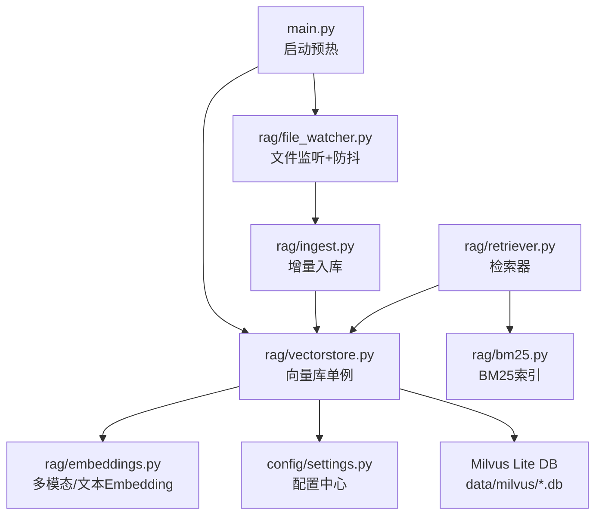
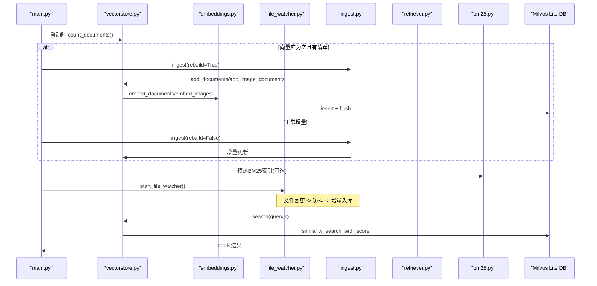
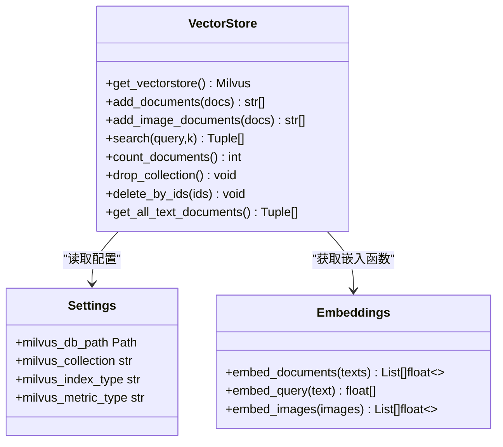
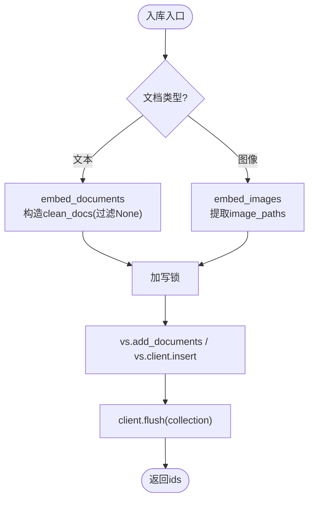
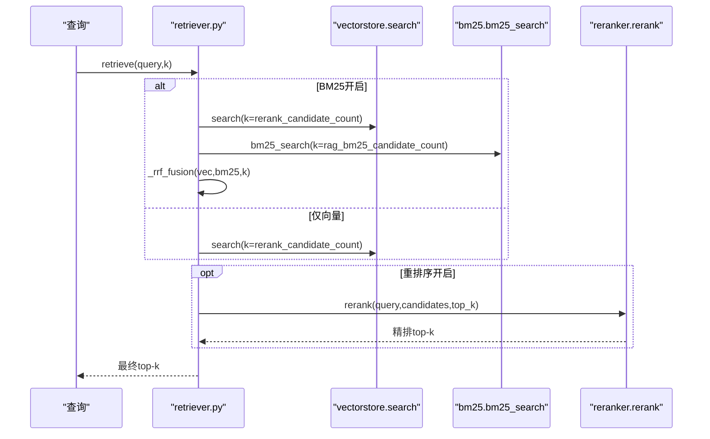
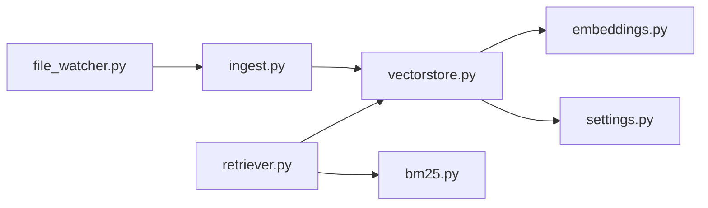

# 向量存储系统

<cite>
**本文引用的文件**
- [rag/vectorstore.py](file://rag/vectorstore.py)
- [rag/embeddings.py](file://rag/embeddings.py)
- [rag/file_watcher.py](file://rag/file_watcher.py)
- [config/settings.py](file://config/settings.py)
- [main.py](file://main.py)
- [rag/ingest.py](file://rag/ingest.py)
- [rag/retriever.py](file://rag/retriever.py)
- [rag/bm25.py](file://rag/bm25.py)
- [data/milvus/milvus_lite.db/collections/dingtalk_kb/schema.json](file://data/milvus/milvus_lite.db/collections/dingtalk_kb/schema.json)
</cite>

## 目录
1. [简介](#简介)
2. [项目结构](#项目结构)
3. [核心组件](#核心组件)
4. [架构总览](#架构总览)
5. [详细组件分析](#详细组件分析)
6. [依赖关系分析](#依赖关系分析)
7. [性能与优化](#性能与优化)
8. [故障排查指南](#故障排查指南)
9. [结论](#结论)
10. [附录：API 参考与示例](#附录api-参考与示例)

## 简介
本技术文档围绕 Milvus Lite 向量数据库的集成实现，系统性说明单例模式设计、连接池管理、索引配置优化；多模态文档支持机制（文本与图像共存于同一 collection 的动态字段设计）；写入锁机制避免文件监听线程与检索路径并发冲突；并完整文档化核心 API（add_documents、add_image_documents、search 等）的参数、返回值和使用场景。同时给出数据持久化策略、flush 机制与性能优化技巧，以及向量库初始化、集合管理、查询优化的完整示例指引。

## 项目结构
本项目将向量存储能力封装在 rag 模块中，通过配置中心统一参数，结合主进程启动流程完成向量库预热、自动入库与文件监听。关键目录与职责如下：
- rag/vectorstore.py：Milvus 向量库封装，提供单例、写入锁、多模态入库与检索
- rag/embeddings.py：多模态 Embedding（Jina CLIP v2）与纯文本 Embedding（BGE）
- rag/file_watcher.py：基于 watchdog 的文件监听与防抖消费线程，触发增量入库
- config/settings.py：全局配置（Milvus Lite、索引类型、度量、切片大小、BM25、重排序等）
- main.py：FastAPI 入口，服务启动时预热 LLM、向量库、BM25 索引并启动文件监听
- rag/ingest.py：文档加载、切分、增量入库与清单管理
- rag/retriever.py：检索器（向量 + BM25 + 重排序融合）
- rag/bm25.py：内存 BM25 索引构建与检索
- data/milvus/...：Milvus Lite 本地 .db 文件及集合 schema、manifest

图表来源
- [main.py:80-135](file://main.py#L80-L135)
- [rag/vectorstore.py:29-76](file://rag/vectorstore.py#L29-L76)
- [rag/file_watcher.py:107-140](file://rag/file_watcher.py#L107-L140)
- [rag/ingest.py:289-388](file://rag/ingest.py#L289-L388)
- [rag/retriever.py:18-52](file://rag/retriever.py#L18-L52)
- [rag/bm25.py:22-66](file://rag/bm25.py#L22-L66)
- [config/settings.py:54-84](file://config/settings.py#L54-L84)

章节来源
- [main.py:80-135](file://main.py#L80-L135)
- [config/settings.py:54-84](file://config/settings.py#L54-L84)

## 核心组件
- 向量库单例与写入锁：get_vectorstore() 延迟初始化 LangChain Milvus 实例，模块级 _write_lock 保护 add/delete/insert/flush，避免文件监听消费线程与检索路径并发写入冲突。
- 多模态 Embedding：Jina CLIP v2 文本/图像统一向量空间；BGE 纯文本快速编码；通过 get_embeddings() 按配置选择。
- 动态字段设计：启用 enable_dynamic_field，metadata 每个 key 作为独立动态字段，使文本与图像异构 metadata 共存于同一 collection。
- 增量入库与清单：ingest.py 维护 .ingest_manifest.json，记录文件 hash/mtime/chunk_ids，实现增量更新与孤儿清理。
- 检索器：retriever.py 组合向量检索、BM25 召回与 RRF 融合，可选 CrossEncoder 重排序。
- 文件监听：file_watcher.py 使用 watchdog 事件回调投递信号到队列，消费线程防抖后调用 ingest(rebuild=False)。

章节来源
- [rag/vectorstore.py:22-26](file://rag/vectorstore.py#L22-L26)
- [rag/embeddings.py:29-179](file://rag/embeddings.py#L29-L179)
- [rag/ingest.py:219-388](file://rag/ingest.py#L219-L388)
- [rag/retriever.py:18-52](file://rag/retriever.py#L18-L52)
- [rag/file_watcher.py:71-140](file://rag/file_watcher.py#L71-L140)

## 架构总览
系统以 FastAPI 应用为入口，启动时并行预热 LLM 连接、检查并初始化向量库、构建 BM25 索引（可选），并启动文件监听。运行时用户查询经 retriever 进行多路召回与重排序，底层由 vectorstore 调用 Milvus Lite 进行相似度检索。

图表来源
- [main.py:80-135](file://main.py#L80-L135)
- [rag/vectorstore.py:79-184](file://rag/vectorstore.py#L79-L184)
- [rag/embeddings.py:67-128](file://rag/embeddings.py#L67-L128)
- [rag/file_watcher.py:71-140](file://rag/file_watcher.py#L71-L140)
- [rag/ingest.py:289-388](file://rag/ingest.py#L289-L388)
- [rag/retriever.py:18-52](file://rag/retriever.py#L18-L52)
- [rag/bm25.py:22-66](file://rag/bm25.py#L22-L66)

## 详细组件分析

### 向量库单例与连接池管理
- 单例模式：get_vectorstore() 使用模块级变量 _vs 缓存 LangChain Milvus 实例，首次访问时延迟初始化，避免启动时阻塞。
- 连接池与 gRPC keepalive：connection_args.uri 指向本地 .db 文件启用 Milvus Lite；grpc_options 禁用空闲 ping，避免 BGE 模型首次加载期间频繁 keepalive 导致 too_many_pings GOAWAY 断连。
- 索引与度量：index_params 指定 index_type=FLAT、metric_type=L2；auto_id=False，手动传入 uuid 字符串作为 pk。
- 动态字段：enable_dynamic_field=True，允许 metadata 任意键值作为动态字段，支撑文本与图像异构元数据共存。

图表来源
- [rag/vectorstore.py:29-76](file://rag/vectorstore.py#L29-L76)
- [config/settings.py:54-84](file://config/settings.py#L54-L84)
- [rag/embeddings.py:67-128](file://rag/embeddings.py#L67-L128)

章节来源
- [rag/vectorstore.py:29-76](file://rag/vectorstore.py#L29-L76)
- [config/settings.py:54-84](file://config/settings.py#L54-L84)

### 多模态文档支持与动态字段设计
- 文本文档：通过 embed_documents 编码，存入 text、vector 字段，metadata 展开为动态字段（如 source、title、page、ocr_used）。
- 图像文档：通过 embed_images 编码，使用 vs.client.insert 直接写入实体，text 为占位描述，image_path 与 type=image 作为动态字段。
- 动态字段优势：无需预定义 schema，文本与图像异构 metadata 可共存；查询时可过滤 type=image 排除无关键词价值的图像块。

图表来源
- [rag/vectorstore.py:79-161](file://rag/vectorstore.py#L79-L161)
- [rag/ingest.py:258-274](file://rag/ingest.py#L258-L274)

章节来源
- [rag/vectorstore.py:79-161](file://rag/vectorstore.py#L79-L161)
- [rag/ingest.py:258-274](file://rag/ingest.py#L258-L274)

### 写入锁机制与并发安全
- 问题背景：文件监听消费线程可能触发增量入库，而检索路径也可能并发写入（如重建或批量导入），需避免对 Milvus Lite 的并发写入冲突。
- 解决方案：模块级 threading.Lock(_write_lock) 包裹所有写操作（add_documents、add_image_documents、delete_by_ids），读操作（search）不加锁，因为 Milvus Lite 支持读写并发。
- 效果：确保同一时刻仅一个写线程执行，避免 WAL/Parquet 写入竞争与 flush 冲突。

章节来源
- [rag/vectorstore.py:22-26](file://rag/vectorstore.py#L22-L26)
- [rag/vectorstore.py:96-106](file://rag/vectorstore.py#L96-L106)
- [rag/vectorstore.py:157-161](file://rag/vectorstore.py#L157-L161)
- [rag/vectorstore.py:236-245](file://rag/vectorstore.py#L236-L245)

### 数据持久化与 flush 机制
- 持久化位置：Milvus Lite 本地 .db 文件（data/milvus/milvus_lite.db），集合 schema 固定字段为 pk（varchar）、text（varchar）、vector（float_vector），其余 metadata 作为动态字段。
- flush 时机：每次写入后显式调用 client.flush(collection)，确保数据落盘并可被查询；删除后也 flush。
- 清单与增量：.ingest_manifest.json 记录每个文件的 hash、mtime、chunk_ids，用于增量更新与孤儿清理。

章节来源
- [data/milvus/milvus_lite.db/collections/dingtalk_kb/schema.json:1-45](file://data/milvus/milvus_lite.db/collections/dingtalk_kb/schema.json#L1-L45)
- [rag/vectorstore.py:99-106](file://rag/vectorstore.py#L99-L106)
- [rag/vectorstore.py:236-245](file://rag/vectorstore.py#L236-L245)
- [rag/ingest.py:219-256](file://rag/ingest.py#L219-L256)

### 索引配置与优化
- 索引类型：FLAT（Milvus Lite 支持），度量类型 L2（欧氏距离，越小越相关）。
- 维度：根据 Embedding 模型输出维度（Jina CLIP v2 为 1024，BGE 为 512），schema 中 vector 字段 dim 与实际一致。
- 优化建议：
  - 控制 chunk_size 与 overlap，平衡召回率与上下文长度。
  - 开启 BM25 多路召回与 RRF 融合提升精确匹配召回率。
  - 使用 reranker 精排提高最终 top-k 质量。
  - 调整 rag_score_filter 过滤低相关度结果。

章节来源
- [config/settings.py:54-84](file://config/settings.py#L54-L84)
- [rag/retriever.py:78-110](file://rag/retriever.py#L78-L110)

### 检索流程与多路召回
- 基础检索：search(query, k) 调用 vs.similarity_search_with_score，并按 rag_score_filter 过滤低相关度结果。
- 多路召回：当 rag_bm25_enabled=true 时，并行执行向量检索与 BM25 检索，使用 RRF 融合两路结果。
- 重排序：若 rerank_enabled=true，对候选集执行 CrossEncoder 精排，取 top-k。

图表来源
- [rag/retriever.py:18-52](file://rag/retriever.py#L18-L52)
- [rag/retriever.py:55-110](file://rag/retriever.py#L55-L110)
- [rag/vectorstore.py:164-184](file://rag/vectorstore.py#L164-L184)
- [rag/bm25.py:69-97](file://rag/bm25.py#L69-L97)

章节来源
- [rag/retriever.py:18-52](file://rag/retriever.py#L18-L52)
- [rag/vectorstore.py:164-184](file://rag/vectorstore.py#L164-L184)
- [rag/bm25.py:69-97](file://rag/bm25.py#L69-L97)

### 文件监听与增量入库
- 监听机制：watchdog 事件回调检测新增/修改/删除/移动文件，向进程内 queue 投递哨兵。
- 防抖策略：消费线程取出第一个信号后，持续清空 debounce 窗口内积压信号，直到窗口内无新事件才执行 ingest(rebuild=False)。
- 增量逻辑：比较 mtime 与 hash，变化则先删旧 chunk 再重新入库，未变化跳过；已删除文件清理孤儿 chunk。

章节来源
- [rag/file_watcher.py:34-105](file://rag/file_watcher.py#L34-L105)
- [rag/ingest.py:289-388](file://rag/ingest.py#L289-L388)

## 依赖关系分析
- 模块耦合：
  - vectorstore 依赖 embeddings、settings、langchain_milvus。
  - retriever 依赖 vectorstore、bm25、reranker（可选）。
  - file_watcher 依赖 ingest、settings。
  - ingest 依赖 vectorstore、ocr、splitter。
- 外部依赖：
  - Milvus Lite 本地 .db 文件。
  - HuggingFace 模型（Jina CLIP v2、BGE）。
  - watchdog、rank_bm25（可选）。

图表来源
- [rag/vectorstore.py:18-19](file://rag/vectorstore.py#L18-L19)
- [rag/retriever.py:15-16](file://rag/retriever.py#L15-L16)
- [rag/file_watcher.py:22-23](file://rag/file_watcher.py#L22-L23)
- [rag/ingest.py:19-20](file://rag/ingest.py#L19-L20)

章节来源
- [rag/vectorstore.py:18-19](file://rag/vectorstore.py#L18-L19)
- [rag/retriever.py:15-16](file://rag/retriever.py#L15-L16)
- [rag/file_watcher.py:22-23](file://rag/file_watcher.py#L22-L23)
- [rag/ingest.py:19-20](file://rag/ingest.py#L19-L20)

## 性能与优化
- 模型加载优化：Embedding 模型延迟加载（_ensure_model），避免启动时下载与初始化耗时。
- 连接池优化：禁用空闲 gRPC ping，防止 too_many_pings GOAWAY 断连。
- 检索优化：
  - 调整 rag_top_k、rag_score_filter 控制召回数量与质量。
  - 开启 BM25 多路召回与 RRF 融合提升精确匹配召回率。
  - 使用 reranker 精排提高 top-k 相关性。
- 写入优化：写入锁串行化写操作，减少 WAL/Parquet 竞争；显式 flush 保证一致性。
- 增量优化：mtime 预筛 + hash 确认，未变化文件快速跳过；清单记录 chunk_ids 便于精准删除。

[本节为通用性能讨论，不直接分析具体文件]

## 故障排查指南
- 向量库为空但存在清单：启动时检测到 count_documents()==0 且存在 manifest，触发全量重建 ingest(rebuild=True)。
- BM25 索引构建失败：若 rank_bm25 未安装或向量库无文本文档，BM25 检索不可用，回退为仅向量检索。
- 文件监听失效：检查 rag_auto_sync_enabled 开关与 docs_dir 权限；查看日志中 watcher 启动与事件处理信息。
- 写入冲突：确认写入操作均受 _write_lock 保护；若出现 flush 失败，检查磁盘空间与 Milvus Lite 状态。

章节来源
- [main.py:80-135](file://main.py#L80-L135)
- [rag/bm25.py:56-66](file://rag/bm25.py#L56-L66)
- [rag/file_watcher.py:107-140](file://rag/file_watcher.py#L107-L140)
- [rag/vectorstore.py:99-106](file://rag/vectorstore.py#L99-L106)

## 结论
本系统通过 Milvus Lite 本地持久化、动态字段设计、写入锁机制与增量入库策略，实现了文本与图像多模态文档的统一存储与检索。结合 BM25 多路召回与重排序，提升了检索质量与鲁棒性。启动预热、文件监听与防抖机制保障了运行时知识库的实时同步与高可用性。

[本节为总结性内容，不直接分析具体文件]

## 附录：API 参考与示例

### 核心 API 说明
- add_documents(docs: List[Document]) -> List[str]
  - 功能：将文本文档列表加入向量库并持久化。
  - 参数：docs 为已切分的 Document 列表（文本块）。
  - 返回：新增文档的 id 列表（uuid 字符串）。
  - 场景：文本入库、PDF/Word/Excel 文本块入库。
  - 注意：过滤 metadata 中的 None 值；写入加锁；写入后 flush。
  - 参考路径：[rag/vectorstore.py:79-106](file://rag/vectorstore.py#L79-L106)

- add_image_documents(docs: List[Document]) -> List[str]
  - 功能：将图像文档列表加入向量库并持久化。
  - 参数：docs 的 metadata 必须含 image_path。
  - 返回：新增文档的 id 列表。
  - 场景：图片 OCR 文本入库 + 图像多模态向量入库。
  - 注意：使用 vs.client.insert 直接写入；写入加锁；写入后 flush。
  - 参考路径：[rag/vectorstore.py:109-161](file://rag/vectorstore.py#L109-L161)

- search(query: str, k: int = 4) -> List[Tuple[Document, float]]
  - 功能：带分数的语义检索（文本查询 → 检索文本+图像混合结果）。
  - 参数：query 查询文本；k 返回 top-k 结果数。
  - 返回：(Document, score) 元组列表，score 为 L2 距离（越小越相关）。
  - 场景：RAG 检索上下文、多模态跨模态检索。
  - 注意：按 rag_score_filter 过滤低相关度结果。
  - 参考路径：[rag/vectorstore.py:164-184](file://rag/vectorstore.py#L164-L184)

- get_retriever(k: int = 4)
  - 功能：返回 LangChain retriever 对象，便于在链中使用。
  - 参考路径：[rag/vectorstore.py:187-190](file://rag/vectorstore.py#L187-L190)

- count_documents() -> int
  - 功能：返回 collection 中的文档数（用于启动时检查是否需要自动入库）。
  - 参考路径：[rag/vectorstore.py:193-205](file://rag/vectorstore.py#L193-L205)

- drop_collection() -> None
  - 功能：删除当前 collection（用于 --rebuild 重建索引时清空旧数据）。
  - 参考路径：[rag/vectorstore.py:208-223](file://rag/vectorstore.py#L208-L223)

- delete_by_ids(ids: List[str]) -> None
  - 功能：按主键 id 列表删除向量库中的文档（用于增量更新时清理文件旧 chunk）。
  - 参考路径：[rag/vectorstore.py:225-245](file://rag/vectorstore.py#L225-L245)

- get_all_text_documents() -> List[Tuple[str, dict]]
  - 功能：拉取 collection 中全部文档的文本与 metadata（用于 BM25 索引构建）。
  - 注意：跳过图像文档（type=image）。
  - 参考路径：[rag/vectorstore.py:248-281](file://rag/vectorstore.py#L248-L281)

### 完整示例指引
- 向量库初始化：
  - 启动时调用 warmup_vectorstore()，内部检查 count_documents() 并触发 ingest(rebuild=False 或 True)。
  - 参考路径：[main.py:80-135](file://main.py#L80-L135)

- 集合管理：
  - 重建索引：调用 drop_collection() 后重新 ingest(rebuild=True)。
  - 参考路径：[rag/vectorstore.py:208-223](file://rag/vectorstore.py#L208-L223)、[rag/ingest.py:289-310](file://rag/ingest.py#L289-L310)

- 查询优化：
  - 调整 rag_top_k、rag_score_filter、rag_bm25_enabled、rerank_enabled 等配置。
  - 参考路径：[config/settings.py:54-100](file://config/settings.py#L54-L100)、[rag/retriever.py:18-52](file://rag/retriever.py#L18-L52)

[本节为 API 参考与示例指引，不直接展示代码内容]