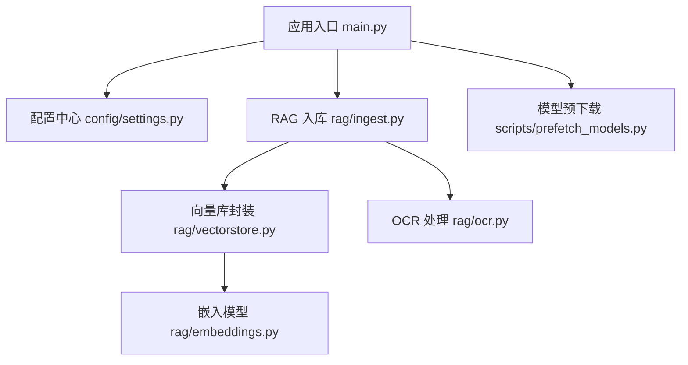
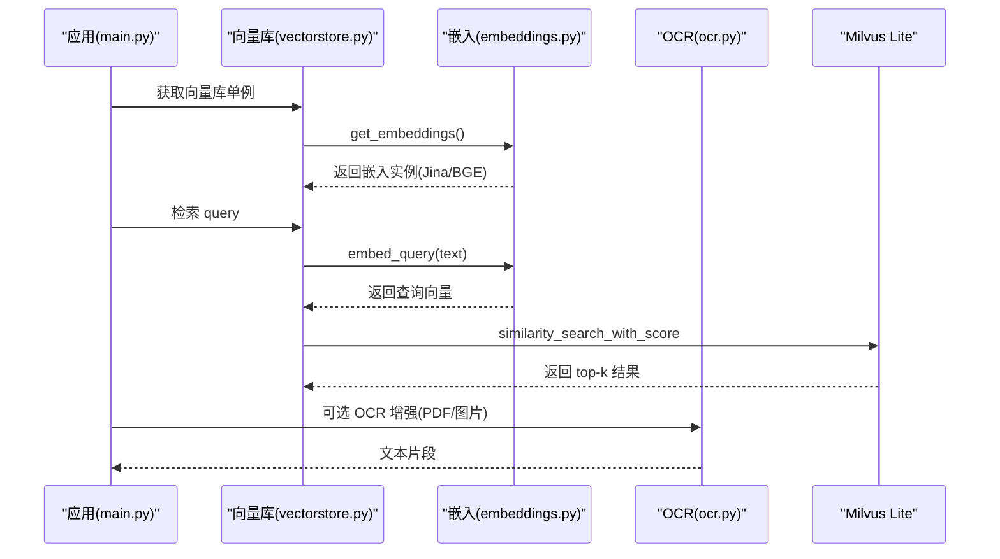
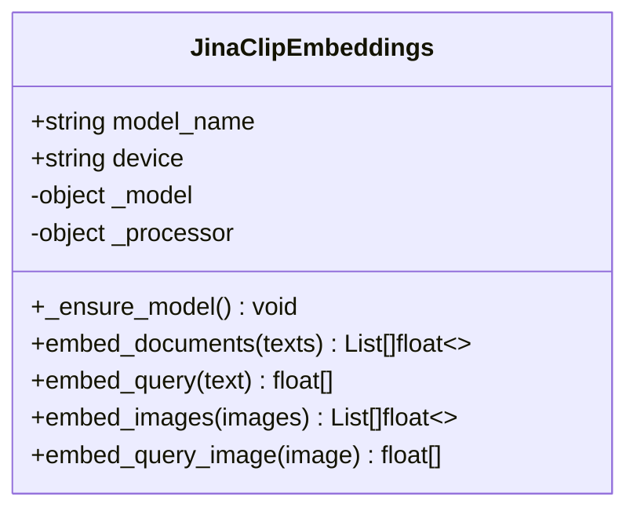
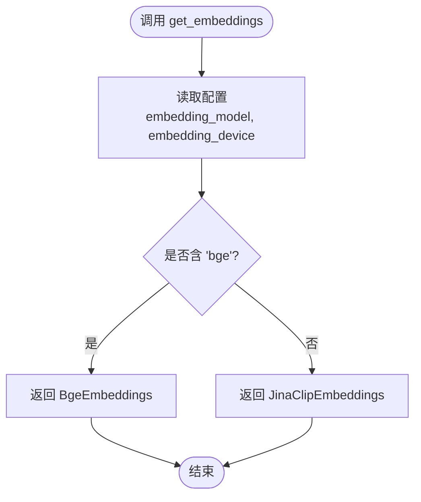
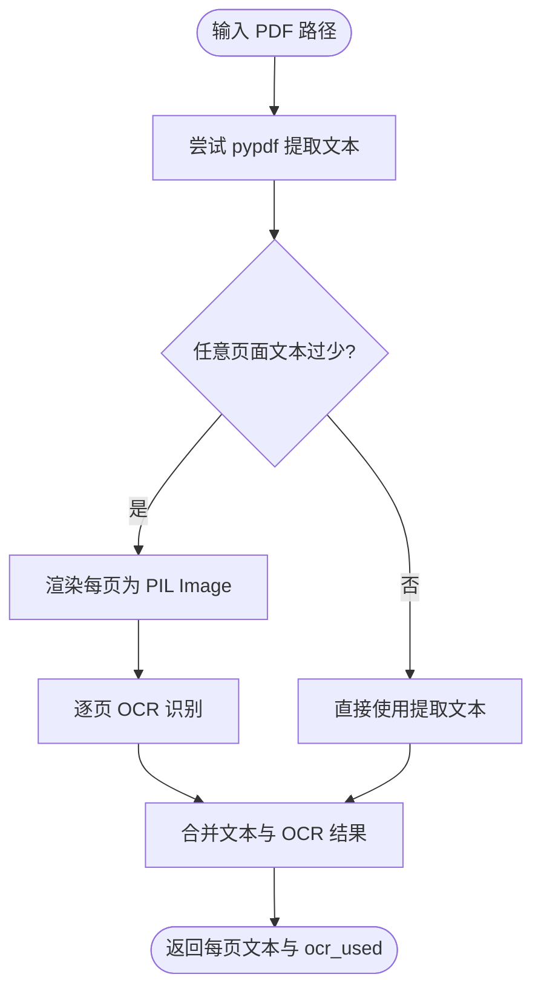
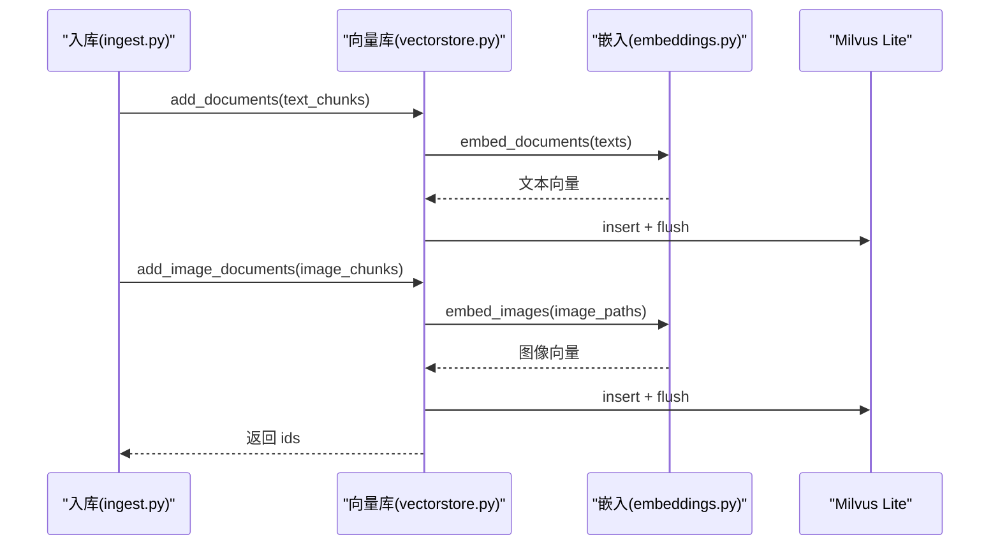
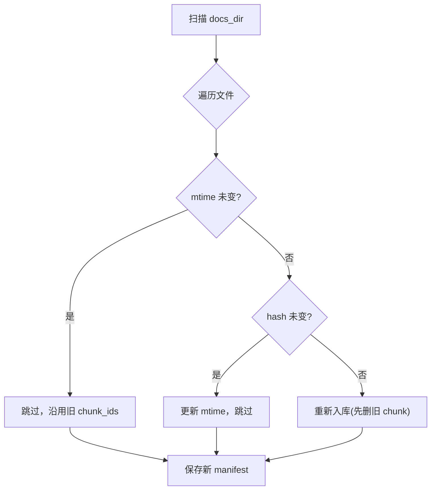
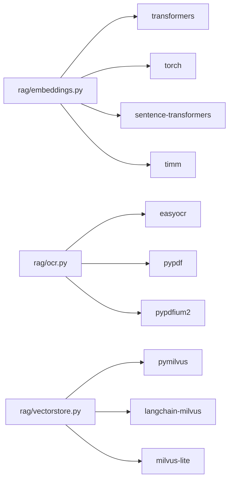

# 嵌入模型系统

<cite>
**本文引用的文件**
- [rag/embeddings.py](file://rag/embeddings.py)
- [rag/ocr.py](file://rag/ocr.py)
- [config/settings.py](file://config/settings.py)
- [main.py](file://main.py)
- [scripts/prefetch_models.py](file://scripts/prefetch_models.py)
- [rag/vectorstore.py](file://rag/vectorstore.py)
- [rag/ingest.py](file://rag/ingest.py)
- [requirements.txt](file://requirements.txt)
</cite>

## 目录
1. [简介](#简介)
2. [项目结构](#项目结构)
3. [核心组件](#核心组件)
4. [架构总览](#架构总览)
5. [详细组件分析](#详细组件分析)
6. [依赖关系分析](#依赖关系分析)
7. [性能与优化](#性能与优化)
8. [故障排查指南](#故障排查指南)
9. [结论](#结论)
10. [附录：配置与部署示例](#附录配置与部署示例)

## 简介
本技术文档围绕“嵌入模型系统”展开，重点说明多模态嵌入模型的架构设计、统一接口（文本向量化与图片OCR处理）、模型加载策略、缓存机制与性能优化方案。文档还详细解释工厂函数 get_embeddings() 的实现原理与模型选择逻辑，并深入剖析 embed_documents 与 embed_images 的批量处理、错误处理与降级策略。最后提供不同嵌入模型（BGE 系列、CLIP 等多模态模型）的对比分析与适用场景，以及本地部署与云端推理的配置示例。

## 项目结构
嵌入模型系统主要位于 rag 子模块中，配合配置中心 config/settings.py 统一管理参数，并通过 vectorstore.py 与 ingest.py 完成向量入库与检索流程；ocr.py 提供 OCR 能力以支持扫描页和图片文字提取；main.py 在启动时进行服务预热与索引初始化；scripts/prefetch_models.py 用于构建期预下载模型权重。

图表来源
- [main.py:45-135](file://main.py#L45-L135)
- [config/settings.py:19-107](file://config/settings.py#L19-L107)
- [rag/ingest.py:1-402](file://rag/ingest.py#L1-L402)
- [rag/vectorstore.py:1-282](file://rag/vectorstore.py#L1-L282)
- [rag/embeddings.py:1-180](file://rag/embeddings.py#L1-L180)
- [rag/ocr.py:1-142](file://rag/ocr.py#L1-L142)
- [scripts/prefetch_models.py:1-99](file://scripts/prefetch_models.py#L1-L99)

章节来源
- [main.py:45-135](file://main.py#L45-L135)
- [config/settings.py:19-107](file://config/settings.py#L19-L107)
- [rag/ingest.py:1-402](file://rag/ingest.py#L1-L402)
- [rag/vectorstore.py:1-282](file://rag/vectorstore.py#L1-L282)
- [rag/embeddings.py:1-180](file://rag/embeddings.py#L1-L180)
- [rag/ocr.py:1-142](file://rag/ocr.py#L1-L142)
- [scripts/prefetch_models.py:1-99](file://scripts/prefetch_models.py#L1-L99)

## 核心组件
- 多模态嵌入类 JinaClipEmbeddings：实现文本与图像在同一向量空间编码，支持跨模态检索。
- 纯文本嵌入类 BgeEmbeddings：使用 sentence-transformers，适合纯文本知识库场景，速度快。
- 工厂函数 get_embeddings()：根据配置自动选择 BGE 或 Jina CLIP 多模态嵌入。
- OCR 模块：easyocr 对图片/扫描页做文字识别，PDF 逐页处理（文本优先，OCR 兜底）。
- 向量库封装：Milvus Lite 本地持久化，支持文本与图像混合存储与检索。
- 文档入库：增量更新、文件指纹驱动、切片与图像文档分别入库。
- 模型预下载：构建期预下载 Embedding、重排序、OCR 模型，确保镜像可用。

章节来源
- [rag/embeddings.py:29-179](file://rag/embeddings.py#L29-L179)
- [rag/ocr.py:26-142](file://rag/ocr.py#L26-L142)
- [rag/vectorstore.py:29-184](file://rag/vectorstore.py#L29-L184)
- [rag/ingest.py:34-183](file://rag/ingest.py#L34-L183)
- [scripts/prefetch_models.py:28-99](file://scripts/prefetch_models.py#L28-L99)

## 架构总览
嵌入模型系统采用“延迟加载 + 单例缓存”的策略，避免启动时即下载模型；通过配置中心动态选择模型类型；向量库使用 Milvus Lite 本地文件持久化，支持文本与图像混合检索；OCR 作为兜底增强 PDF 与图片的文本召回能力。

图表来源
- [main.py:80-135](file://main.py#L80-L135)
- [rag/vectorstore.py:29-184](file://rag/vectorstore.py#L29-L184)
- [rag/embeddings.py:164-179](file://rag/embeddings.py#L164-L179)
- [rag/ocr.py:94-142](file://rag/ocr.py#L94-L142)

## 详细组件分析

### 多模态嵌入类 JinaClipEmbeddings
- 功能：实现 langchain Embeddings 接口，额外提供 embed_images / embed_query_image 方法，将文本与图像映射到同一向量空间（维度 1024），支持跨模态检索。
- 模型加载：延迟加载，首次调用 _ensure_model() 时通过 transformers AutoModel/AutoProcessor 从 HuggingFace 加载，设置设备与 eval 模式。
- 文本编码：embed_documents 批量处理，使用 processor 分词与填充，调用 get_text_features 并 L2 归一化。
- 图像编码：embed_images 支持 PIL.Image 或路径列表，转换为 RGB 后调用 get_image_features 并 L2 归一化。
- 错误处理：异常由上层捕获；日志记录加载与处理过程。

图表来源
- [rag/embeddings.py:29-129](file://rag/embeddings.py#L29-L129)

章节来源
- [rag/embeddings.py:29-129](file://rag/embeddings.py#L29-L129)

### 纯文本嵌入类 BgeEmbeddings
- 功能：基于 sentence-transformers 的纯文本嵌入，默认模型 bge-small-zh-v1.5，维度 512，CPU 下速度显著优于多模态模型。
- 模型加载：延迟加载 SentenceTransformer，设备可配置。
- 编码：embed_documents 与 embed_query 均使用 encode 并 normalize_embeddings=True。

图表来源
- [rag/embeddings.py:131-161](file://rag/embeddings.py#L131-L161)

章节来源
- [rag/embeddings.py:131-161](file://rag/embeddings.py#L131-L161)

### 工厂函数 get_embeddings()
- 作用：返回 Embeddings 单例，依据配置自动选择 BGE 或 Jina CLIP。
- 选择逻辑：若 embedding_model 包含 "bge"，则返回 BgeEmbeddings；否则返回 JinaClipEmbeddings。
- 设备与模型名：从配置读取 embedding_device 与 embedding_model。

图表来源
- [rag/embeddings.py:164-179](file://rag/embeddings.py#L164-L179)
- [config/settings.py:50-52](file://config/settings.py#L50-L52)

章节来源
- [rag/embeddings.py:164-179](file://rag/embeddings.py#L164-L179)
- [config/settings.py:50-52](file://config/settings.py#L50-L52)

### OCR 模块与 PDF 处理
- OCR 单例：get_reader() 延迟初始化 easyocr.Reader，语言列表与 GPU 开关来自配置。
- 图片 OCR：ocr_image 接受 PIL.Image 或路径，转为 numpy 数组后调用 readtext，过滤置信度阈值拼接文本。
- PDF 处理：ocr_pdf 先尝试 pypdf 提取文本，若任一页面文本过短（低于阈值），渲染为图片并使用 OCR 兜底；返回每页文本与是否使用 OCR 的标志。
- 错误处理：pypdf 失败时记录警告并回退到全量 OCR；单页 OCR 失败记录警告并跳过该页。

图表来源
- [rag/ocr.py:26-69](file://rag/ocr.py#L26-L69)
- [rag/ocr.py:94-142](file://rag/ocr.py#L94-L142)
- [config/settings.py:102-107](file://config/settings.py#L102-L107)

章节来源
- [rag/ocr.py:26-69](file://rag/ocr.py#L26-L69)
- [rag/ocr.py:94-142](file://rag/ocr.py#L94-L142)
- [config/settings.py:102-107](file://config/settings.py#L102-L107)

### 向量库封装与混合检索
- 单例与连接：get_vectorstore() 延迟初始化 LangChain Milvus，指向本地 .db 文件，启用动态字段以支持异构 metadata。
- 文本入库：add_documents 生成主键、清理 None 值、写入并 flush。
- 图像入库：add_image_documents 提取 image_path，调用 embed_images 编码，直接通过底层 MilvusClient.insert 写入实体。
- 检索：search 使用 similarity_search_with_score，按配置过滤低相关度结果，为空时回退原始结果。

图表来源
- [rag/ingest.py:258-274](file://rag/ingest.py#L258-L274)
- [rag/vectorstore.py:79-161](file://rag/vectorstore.py#L79-L161)
- [rag/embeddings.py:67-124](file://rag/embeddings.py#L67-L124)

章节来源
- [rag/vectorstore.py:29-184](file://rag/vectorstore.py#L29-L184)
- [rag/ingest.py:258-274](file://rag/ingest.py#L258-L274)

### 文档入库与增量更新
- 文件加载：load_file 根据扩展名分发到对应加载器（txt/md/pdf/docx/xlsx/image）。
- 切分：split_documents 对文本使用 RecursiveCharacterTextSplitter，图像文档不参与切分直接保留。
- 增量策略：manifest 记录文件哈希与 chunk_ids；mtime 快速判断，再计算 hash 确认变化；修改文件先删旧 chunk 再入库；删除文件清理孤儿 chunk。
- 错误处理：加载失败记录错误并跳过；OCR 失败记录警告；flush 失败不影响内存可用性。

图表来源
- [rag/ingest.py:289-388](file://rag/ingest.py#L289-L388)

章节来源
- [rag/ingest.py:289-388](file://rag/ingest.py#L289-L388)

### 模型预下载与启动预热
- 预下载脚本：prefetch_models.py 依次触发 Embedding、重排序、easyocr 的下载与校验，失败则终止构建。
- 启动预热：main.py 启动时后台线程预热 LLM 连接与向量库，必要时触发全量重建与 BM25 索引预热。

章节来源
- [scripts/prefetch_models.py:28-99](file://scripts/prefetch_models.py#L28-L99)
- [main.py:45-135](file://main.py#L45-L135)

## 依赖关系分析
- 嵌入模型依赖：transformers、torch、sentence-transformers、timm（jina-clip-v2 自定义建模代码需要）。
- OCR 依赖：easyocr、pypdf、pypdfium2、PIL。
- 向量库依赖：pymilvus、langchain-milvus、milvus-lite。
- Web 服务依赖：fastapi、uvicorn、httpx。
- 配置管理：pydantic、pydantic-settings。

图表来源
- [requirements.txt:1-53](file://requirements.txt#L1-L53)
- [rag/embeddings.py:1-180](file://rag/embeddings.py#L1-L180)
- [rag/ocr.py:1-142](file://rag/ocr.py#L1-L142)
- [rag/vectorstore.py:1-282](file://rag/vectorstore.py#L1-L282)

章节来源
- [requirements.txt:1-53](file://requirements.txt#L1-L53)

## 性能与优化
- 延迟加载与单例缓存：
  - 嵌入模型与 OCR Reader 均采用延迟加载，避免启动时下载与初始化开销。
  - get_embeddings() 使用 lru_cache 保证进程内单例，减少重复创建成本。
- 批处理与归一化：
  - embed_documents 与 embed_images 支持批量处理，提升吞吐。
  - 输出向量进行 L2 归一化，利于相似度计算。
- 设备与镜像加速：
  - 支持 CPU/GPU 设备切换；HF_ENDPOINT 设置为 hf-mirror.com 加速下载。
- 向量库连接优化：
  - Milvus Lite gRPC keepalive 配置降低空闲 ping 频率，避免 too_many_pings 断连。
- 增量入库与指纹检测：
  - 通过 mtime 与 md5 快速判断文件变化，减少不必要的全量处理。
- 启动预热：
  - 后台线程预热 LLM 连接与向量库，必要时触发全量重建与 BM25 索引预热，降低首请求延迟。

[本节为通用性能讨论，不直接分析具体文件]

## 故障排查指南
- 模型下载失败：
  - 检查 HF_ENDPOINT 是否正确设置；网络不稳定时可重试或使用离线模式（HF_HUB_OFFLINE=1）。
  - 使用 scripts/prefetch_models.py 在构建期预下载模型，确保镜像可用。
- OCR 识别失败：
  - 检查 easyocr 模型是否已下载；GPU 开关与语言列表配置是否正确。
  - PDF 文本提取失败时，系统会回退到 OCR；单页 OCR 失败会记录警告并继续处理其他页。
- 向量库写入失败：
  - flush 失败不影响内存可用；写入加锁避免并发冲突；collection 不存在时会创建。
- 检索结果为空：
  - 检查 rag_score_filter 阈值是否过高；若无结果，系统会回退返回原始检索结果。
- 启动预热失败：
  - 预热失败仅记录日志，不影响服务可用性；可手动执行 ingest 或 prefetch 脚本修复。

章节来源
- [rag/ocr.py:117-138](file://rag/ocr.py#L117-L138)
- [rag/vectorstore.py:96-106](file://rag/vectorstore.py#L96-L106)
- [rag/vectorstore.py:174-184](file://rag/vectorstore.py#L174-L184)
- [main.py:45-135](file://main.py#L45-L135)
- [scripts/prefetch_models.py:66-78](file://scripts/prefetch_models.py#L66-L78)

## 结论
本嵌入模型系统通过多模态嵌入（Jina CLIP v2）与纯文本嵌入（BGE）的统一接口，结合 OCR 增强与 Milvus Lite 本地持久化，实现了高效的文本与图像混合检索。系统采用延迟加载、单例缓存、批处理与增量更新等策略，兼顾性能与稳定性。通过配置中心灵活选择模型与设备，并提供构建期预下载与启动预热，确保生产环境可用性与响应速度。

[本节为总结性内容，不直接分析具体文件]

## 附录：配置与部署示例

### 配置项说明（部分）
- 嵌入模型与设备：
  - embedding_model：默认 jinaai/jina-clip-v2；若包含 "bge" 则走 BGE 路径。
  - embedding_device：默认 cpu，可改为 cuda 以利用 GPU。
- OCR 配置：
  - ocr_languages：默认 ch_sim,en；逗号分隔。
  - ocr_use_gpu：默认 False。
  - ocr_min_text_length：默认 50；PDF 页面文本少于该值触发 OCR。
- 向量库：
  - milvus_db_file：默认 data/milvus/milvus_lite.db。
  - milvus_collection：默认 dingtalk_kb。
  - rag_top_k：默认 4；rag_score_filter：默认 1.2。

章节来源
- [config/settings.py:50-107](file://config/settings.py#L50-L107)

### 本地部署步骤
- 安装依赖：pip install -r requirements.txt
- 预下载模型：python scripts/prefetch_models.py
- 启动服务：uvicorn main:app --host 0.0.0.0 --port 8000 --reload
- 健康检查：访问 http://localhost:8000/health

章节来源
- [requirements.txt:1-53](file://requirements.txt#L1-L53)
- [scripts/prefetch_models.py:81-99](file://scripts/prefetch_models.py#L81-L99)
- [main.py:364-387](file://main.py#L364-L387)

### 云端推理配置示例
- 环境变量：
  - HF_ENDPOINT=https://hf-mirror.com（国内加速）
  - HF_HUB_OFFLINE=1（离线模式，需提前下载模型）
  - 其他配置通过 .env 文件或环境变量注入（如 embedding_model、embedding_device、ocr_languages 等）
- 容器化：
  - 使用 Dockerfile 构建镜像，并在构建阶段运行 scripts/prefetch_models.py 预下载模型。
  - 启动容器后，服务自动预热向量库与 LLM 连接。

章节来源
- [main.py:13-19](file://main.py#L13-L19)
- [config/settings.py:19-27](file://config/settings.py#L19-L27)
- [scripts/prefetch_models.py:23-25](file://scripts/prefetch_models.py#L23-L25)

### 不同嵌入模型对比与适用场景
- Jina CLIP v2（多模态）：
  - 特点：文本与图像统一向量空间，支持跨模态检索；维度 1024；首次加载较慢。
  - 适用：图文混合知识库、跨模态检索场景。
- BGE 系列（纯文本）：
  - 特点：中文优化，维度 512；CPU 下速度显著快于多模态模型。
  - 适用：纯文本知识库、对速度敏感的场景。
- CLIP 系列（多模态）：
  - 特点：OpenAI CLIP 等模型具备强大的跨模态对齐能力；通常需较大资源。
  - 适用：高质量跨模态检索与生成任务。
- 选择建议：
  - 若知识库以文本为主且追求速度，选择 BGE。
  - 若需同时检索文本与图像，选择 Jina CLIP v2 或其他多模态模型。

[本节为概念性对比，不直接分析具体文件]