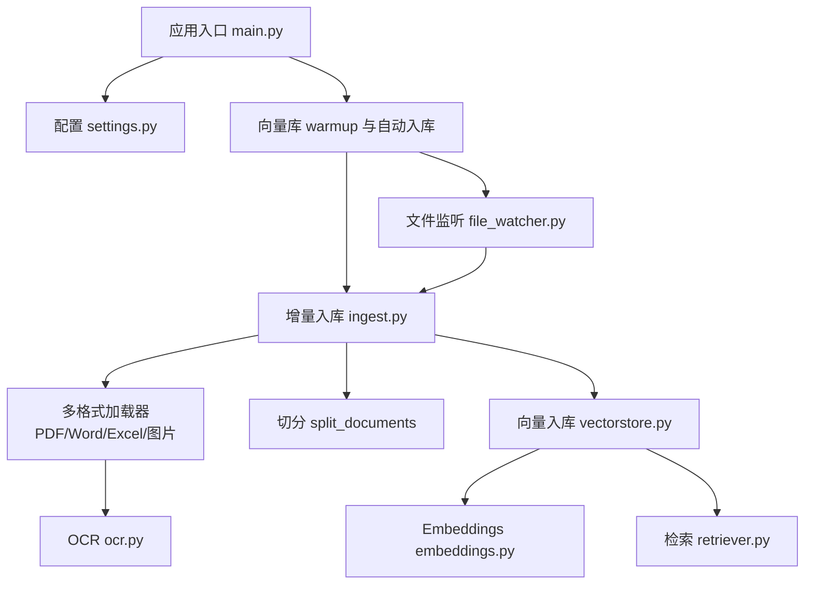
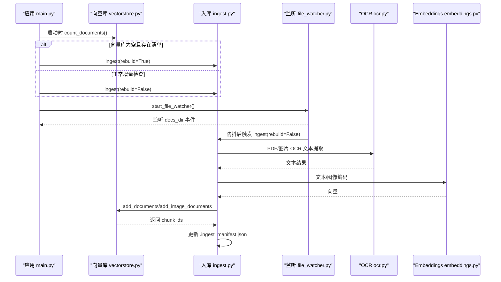
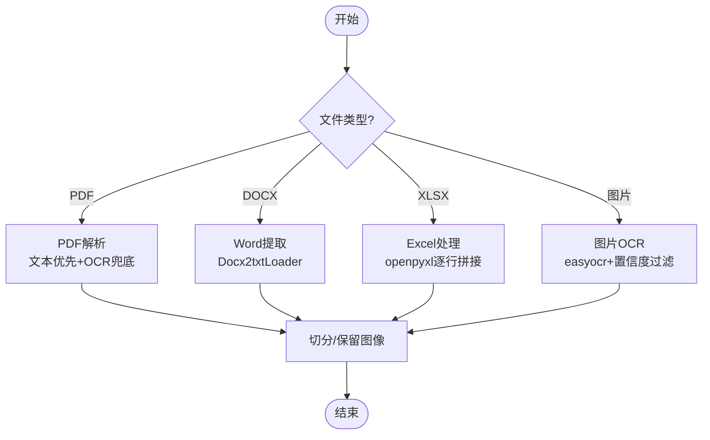
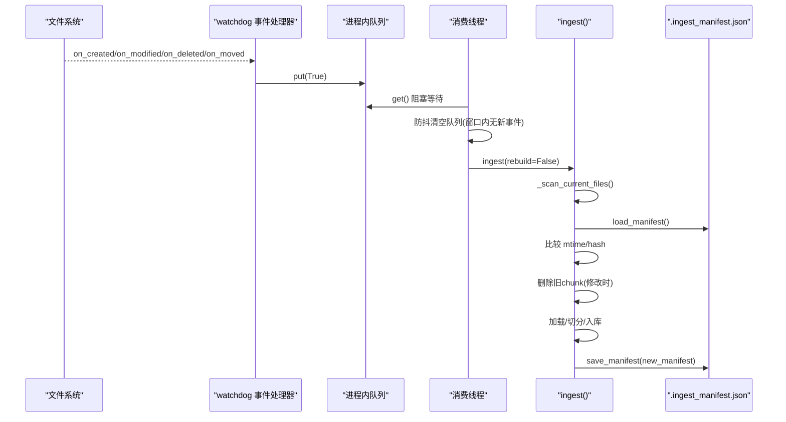
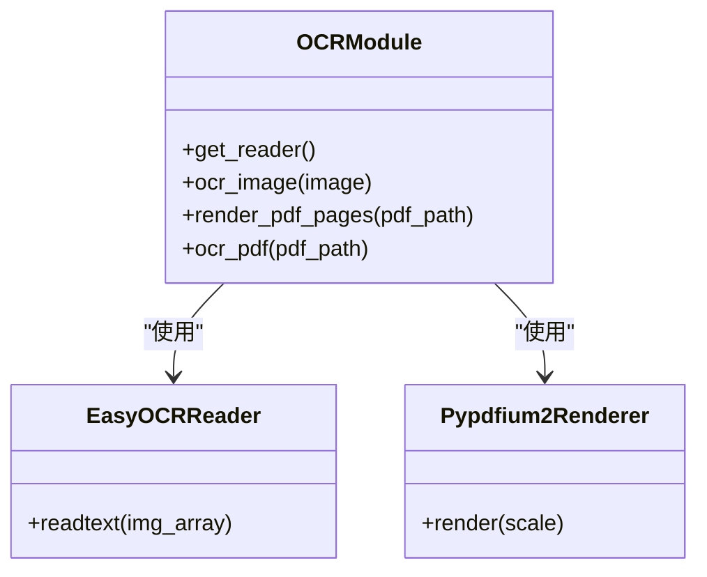
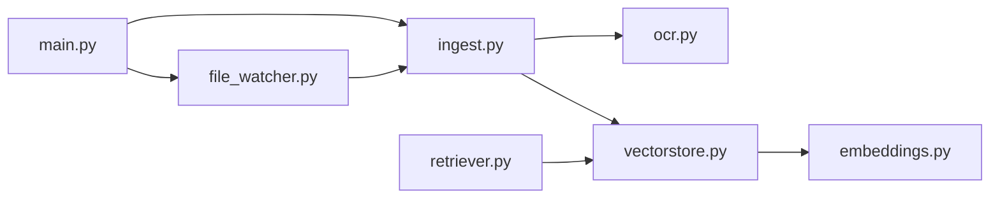

# 文档入库流程

<cite>
**本文引用的文件**
- [main.py](file://main.py)
- [config/settings.py](file://config/settings.py)
- [rag/ingest.py](file://rag/ingest.py)
- [rag/file_watcher.py](file://rag/file_watcher.py)
- [rag/ocr.py](file://rag/ocr.py)
- [rag/vectorstore.py](file://rag/vectorstore.py)
- [rag/embeddings.py](file://rag/embeddings.py)
- [rag/retriever.py](file://rag/retriever.py)
- [requirements.txt](file://requirements.txt)
- [data/docs/.ingest_manifest.json](file://data/docs/.ingest_manifest.json)
</cite>

## 目录
1. [简介](#简介)
2. [项目结构](#项目结构)
3. [核心组件](#核心组件)
4. [架构总览](#架构总览)
5. [详细组件分析](#详细组件分析)
6. [依赖关系分析](#依赖关系分析)
7. [性能考量](#性能考量)
8. [故障排查指南](#故障排查指南)
9. [结论](#结论)
10. [附录](#附录)

## 简介
本技术文档围绕“文档入库流程”展开，系统化说明多格式文档处理管道（PDF解析、Word提取、Excel表格处理、图片OCR识别）、文件监听与增量更新策略、冲突与去重机制、元数据提取与质量检查、批量导入与实时同步、错误重试与日志记录等关键能力。目标是帮助开发者快速理解并扩展该知识库的文档处理能力。

## 项目结构
本项目采用分层模块化设计：
- 入口与服务启动：main.py
- 配置管理：config/settings.py
- 文档入库与增量更新：rag/ingest.py
- 文件监听与自动同步：rag/file_watcher.py
- OCR与PDF页面渲染：rag/ocr.py
- 向量库封装与检索：rag/vectorstore.py、rag/retriever.py
- 多模态Embedding：rag/embeddings.py
- 依赖声明：requirements.txt
- 清单与持久化：data/docs/.ingest_manifest.json

图表来源
- [main.py:80-135](file://main.py#L80-L135)
- [rag/ingest.py:289-388](file://rag/ingest.py#L289-L388)
- [rag/file_watcher.py:107-151](file://rag/file_watcher.py#L107-L151)
- [rag/vectorstore.py:29-76](file://rag/vectorstore.py#L29-L76)
- [rag/embeddings.py:164-180](file://rag/embeddings.py#L164-L180)

章节来源
- [main.py:80-135](file://main.py#L80-L135)
- [config/settings.py:19-107](file://config/settings.py#L19-L107)

## 核心组件
- 多格式文档加载器：支持 .txt/.md/.pdf/.docx/.xlsx/.png/.jpg/.jpeg/.bmp/.tiff，按扩展名分发到对应加载函数。
- 文档切分：使用递归字符切分器，按配置的 chunk_size 与 chunk_overlap 切分文本；图像文档不参与切分直接保留。
- 增量入库与清单管理：通过 .ingest_manifest.json 记录每个文件的哈希、mtime 与 chunk_ids，实现增量更新与孤儿清理。
- 文件监听与防抖：基于 watchdog 监控 docs_dir 的文件变更，消费线程防抖后触发增量入库。
- OCR引擎集成：easyocr 单例延迟初始化，PDF 文本优先，过少则渲染为图片进行OCR兜底；图片直接OCR。
- 向量库与多模态嵌入：Milvus Lite 本地持久化，文本与图像统一向量空间（Jina CLIP v2），写入加锁保证并发安全。
- 检索与重排序：可选 BM25 多路召回 + RRF 融合，再经 CrossEncoder 重排序，最终格式化上下文。

章节来源
- [rag/ingest.py:24-216](file://rag/ingest.py#L24-L216)
- [rag/ingest.py:219-388](file://rag/ingest.py#L219-L388)
- [rag/file_watcher.py:1-151](file://rag/file_watcher.py#L1-L151)
- [rag/ocr.py:1-142](file://rag/ocr.py#L1-L142)
- [rag/vectorstore.py:1-282](file://rag/vectorstore.py#L1-L282)
- [rag/embeddings.py:1-180](file://rag/embeddings.py#L1-L180)
- [rag/retriever.py:1-140](file://rag/retriever.py#L1-L140)

## 架构总览
系统启动时执行向量库预热与自动入库，随后启动文件监听服务。运行时对 docs_dir 的增删改事件进行防抖聚合，调用增量入库逻辑，维护清单与向量库一致性。

图表来源
- [main.py:80-135](file://main.py#L80-L135)
- [rag/ingest.py:289-388](file://rag/ingest.py#L289-L388)
- [rag/file_watcher.py:71-105](file://rag/file_watcher.py#L71-L105)
- [rag/ocr.py:94-142](file://rag/ocr.py#L94-L142)
- [rag/vectorstore.py:79-161](file://rag/vectorstore.py#L79-L161)
- [rag/embeddings.py:67-128](file://rag/embeddings.py#L67-L128)

## 详细组件分析

### 多格式文档处理管道
- PDF解析：优先用 pypdf 提取文本；若某页文本少于阈值，则用 pypdfium2 渲染为图片，再通过 easyocr 进行OCR兜底；同时为每页生成图像 Document（用于多模态检索）。
- Word提取：使用 Docx2txtLoader 提取文本，补充 source/title 元数据。
- Excel处理：openpyxl 遍历所有 sheet，逐行拼接单元格文本，按 sheet 维度生成 Document。
- 图片OCR：easyocr 读取图片路径或 PIL Image，过滤低置信度结果，返回文本；同时生成图像 Document（metadata.image_path）以支持跨模态检索。

图表来源
- [rag/ingest.py:43-182](file://rag/ingest.py#L43-L182)
- [rag/ocr.py:46-91](file://rag/ocr.py#L46-L91)
- [rag/ocr.py:94-142](file://rag/ocr.py#L94-L142)

章节来源
- [rag/ingest.py:43-182](file://rag/ingest.py#L43-L182)
- [rag/ocr.py:46-142](file://rag/ocr.py#L46-L142)

### 文件监听机制与增量更新
- 文件系统事件监控：watchdog 监听 docs_dir 顶层（非递归），仅对支持扩展名的文件变更投递信号。
- 防抖策略：消费线程阻塞等待第一个信号，然后在 debounce 秒内清空积压信号，确保批量写入只触发一次入库。
- 增量更新策略：
  - mtime 预筛：未变则跳过 hash 计算。
  - 内容哈希确认：mtime 变化但内容未变（如 touch）则沿用旧记录并更新 mtime。
  - 修改文件：先删除旧 chunk_ids，再重新入库，避免重复数据。
  - 已删除文件：清理孤儿 chunk。
- 清单管理：.ingest_manifest.json 记录 {文件名: {hash, mtime, chunk_ids}}，用于幂等与一致性保障。

图表来源
- [rag/file_watcher.py:34-105](file://rag/file_watcher.py#L34-L105)
- [rag/ingest.py:277-388](file://rag/ingest.py#L277-L388)

章节来源
- [rag/file_watcher.py:34-105](file://rag/file_watcher.py#L34-L105)
- [rag/ingest.py:219-388](file://rag/ingest.py#L219-L388)
- [data/docs/.ingest_manifest.json:1-11](file://data/docs/.ingest_manifest.json#L1-L11)

### OCR引擎集成方案
- Tesseract/easyocr 配置：通过 Settings 的 ocr_languages、ocr_use_gpu、ocr_min_text_length 控制语言列表、GPU开关与PDF文本阈值。
- 图像预处理：easyocr 接受 numpy 数组或 PIL Image；PDF 页面渲染使用 pypdfium2，scale=2 提高清晰度。
- 文字识别精度优化：
  - 置信度过滤：仅保留置信度大于阈值的行。
  - 文本优先+OCR兜底：PDF 页面文本长度小于阈值才触发 OCR。
  - 模型缓存：模块级 Reader 单例延迟初始化，避免启动时加载模型。

图表来源
- [rag/ocr.py:26-43](file://rag/ocr.py#L26-L43)
- [rag/ocr.py:46-91](file://rag/ocr.py#L46-L91)
- [rag/ocr.py:94-142](file://rag/ocr.py#L94-L142)
- [config/settings.py:102-107](file://config/settings.py#L102-L107)

章节来源
- [rag/ocr.py:26-142](file://rag/ocr.py#L26-L142)
- [config/settings.py:102-107](file://config/settings.py#L102-L107)

### 文档切分策略
- 按段落/句子/标点切分：RecursiveCharacterTextSplitter 使用 separators=["\n\n", "\n", "。", "！", "？", "；", ".", " ", ""] 进行递归切分。
- 参数可调：chunk_size 与 chunk_overlap 来自配置，默认分别为 500 与 80。
- 图像文档不切分：metadata.type=="image" 的文档直接保留，不参与文本切分。

图表来源
- [rag/ingest.py:198-216](file://rag/ingest.py#L198-L216)
- [config/settings.py:70-73](file://config/settings.py#L70-L73)

章节来源
- [rag/ingest.py:198-216](file://rag/ingest.py#L198-L216)
- [config/settings.py:70-73](file://config/settings.py#L70-L73)

### 文档去重、元数据提取与质量检查
- 去重：通过 .ingest_manifest.json 中的 hash 与 chunk_ids 实现文件级与块级去重；修改时先删除旧 chunk 再入库，避免重复。
- 元数据提取：
  - 文本/图片：source（文件名）、title（文件名去掉扩展名）、page（PDF页码）、ocr_used（是否使用OCR）、type（image/text）。
  - Excel：额外包含 sheet 名称。
- 质量检查：
  - PDF 文本长度阈值判断是否触发 OCR。
  - OCR 置信度过滤。
  - 向量检索分数过滤（rag_score_filter）与最低相关度（rag_min_relevance）。

章节来源
- [rag/ingest.py:34-182](file://rag/ingest.py#L34-L182)
- [rag/ingest.py:227-256](file://rag/ingest.py#L227-L256)
- [rag/vectorstore.py:164-184](file://rag/vectorstore.py#L164-L184)
- [rag/ocr.py:46-69](file://rag/ocr.py#L46-L69)
- [config/settings.py:64-73](file://config/settings.py#L64-L73)

### 批量导入、实时同步、错误重试与日志记录
- 批量导入：load_files 全量扫描 docs_dir，按扩展名分发加载；rebuild 模式清空索引后重建。
- 实时同步：start_file_watcher 启动 watchdog 监听，消费线程防抖后调用 ingest(rebuild=False)。
- 错误重试：
  - LLM 调用最大重试次数由 llm_max_retries 控制（适用于问答链路）。
  - 入库失败时保留旧记录以便下次重试；删除孤儿 chunk 失败仅告警。
- 日志记录：各模块使用 logging 记录关键步骤与异常，便于问题定位。

章节来源
- [rag/ingest.py:185-196](file://rag/ingest.py#L185-L196)
- [rag/ingest.py:289-388](file://rag/ingest.py#L289-L388)
- [rag/file_watcher.py:71-105](file://rag/file_watcher.py#L71-L105)
- [config/settings.py:38-41](file://config/settings.py#L38-L41)

## 依赖关系分析
- 外部依赖：
  - LangChain、LangGraph、FastAPI、Uvicorn 提供框架与Web服务。
  - Milvus Lite（pymilvus、milvus-lite）作为本地向量库。
  - easyocr、pypdf、pypdfium2、python-docx、openpyxl 支持多格式文档处理。
  - sentence-transformers、transformers、torch、timm 支持 Embedding 模型。
- 内部依赖：
  - main.py 启动时预热 LLM、向量库与BM25索引，并启动文件监听。
  - ingest.py 依赖 ocr.py、vectorstore.py、embeddings.py。
  - file_watcher.py 依赖 ingest.py 与 bm25 重置逻辑。
  - retriever.py 依赖 vectorstore.py 与 reranker.py（可选）。

图表来源
- [main.py:80-135](file://main.py#L80-L135)
- [rag/ingest.py:289-388](file://rag/ingest.py#L289-L388)
- [rag/file_watcher.py:107-151](file://rag/file_watcher.py#L107-L151)
- [rag/vectorstore.py:29-76](file://rag/vectorstore.py#L29-L76)
- [rag/retriever.py:18-52](file://rag/retriever.py#L18-L52)

章节来源
- [requirements.txt:1-53](file://requirements.txt#L1-L53)
- [main.py:80-135](file://main.py#L80-L135)

## 性能考量
- 模型加载优化：Embedding 与 OCR Reader 采用延迟初始化与单例缓存，避免启动时加载耗时。
- 向量库写入：写入加锁与显式 flush 确保并发安全与持久化。
- 检索优化：可选 BM25 多路召回 + RRF 融合，减少首请求延迟；重排序提升相关性。
- 文件监听防抖：debounce 避免频繁触发入库，降低系统负载。
- 大文件处理：PDF 文本优先，仅在必要时渲染与OCR，减少不必要开销。

[本节为通用性能建议，不直接分析具体文件]

## 故障排查指南
- 向量库为空但存在清单：启动时检测到不一致会触发全量重建。
- 文件监听未生效：检查 rag_auto_sync_enabled 与 docs_dir 权限；确认 watchdog 已启动。
- OCR失败：检查 easyocr 模型下载与 HF_ENDPOINT 镜像设置；确认 GPU 配置与内存。
- 增量更新异常：查看 .ingest_manifest.json 与日志中删除/插入操作；确认 chunk_ids 一致性。
- 检索结果为空：调整 rag_score_filter 与 rag_min_relevance；确认文档已正确入库。

章节来源
- [main.py:80-135](file://main.py#L80-L135)
- [rag/file_watcher.py:107-151](file://rag/file_watcher.py#L107-L151)
- [rag/ocr.py:26-43](file://rag/ocr.py#L26-L43)
- [rag/ingest.py:373-388](file://rag/ingest.py#L373-L388)
- [rag/vectorstore.py:164-184](file://rag/vectorstore.py#L164-L184)

## 结论
该系统实现了完整的多格式文档入库流程，具备文件监听、增量更新、OCR识别、多模态检索与重排序等能力。通过清单管理与写入锁机制，保证了数据一致性与并发安全。配置灵活、可扩展性强，适合构建企业级知识库。

[本节为总结性内容，不直接分析具体文件]

## 附录
- 支持的扩展名：.txt, .md, .pdf, .docx, .xlsx, .png, .jpg, .jpeg, .bmp, .tiff
- 关键配置项：
  - rag_chunk_size / rag_chunk_overlap：切分大小与重叠
  - rag_auto_sync_enabled / rag_auto_sync_debounce：自动同步开关与防抖时间
  - ocr_languages / ocr_use_gpu / ocr_min_text_length：OCR语言、GPU与阈值
  - milvus_collection / milvus_db_file：向量库集合与数据库路径
  - rag_bm25_enabled / rag_rrf_k：BM25开关与RRF常数

章节来源
- [rag/ingest.py:24-26](file://rag/ingest.py#L24-L26)
- [config/settings.py:70-107](file://config/settings.py#L70-L107)