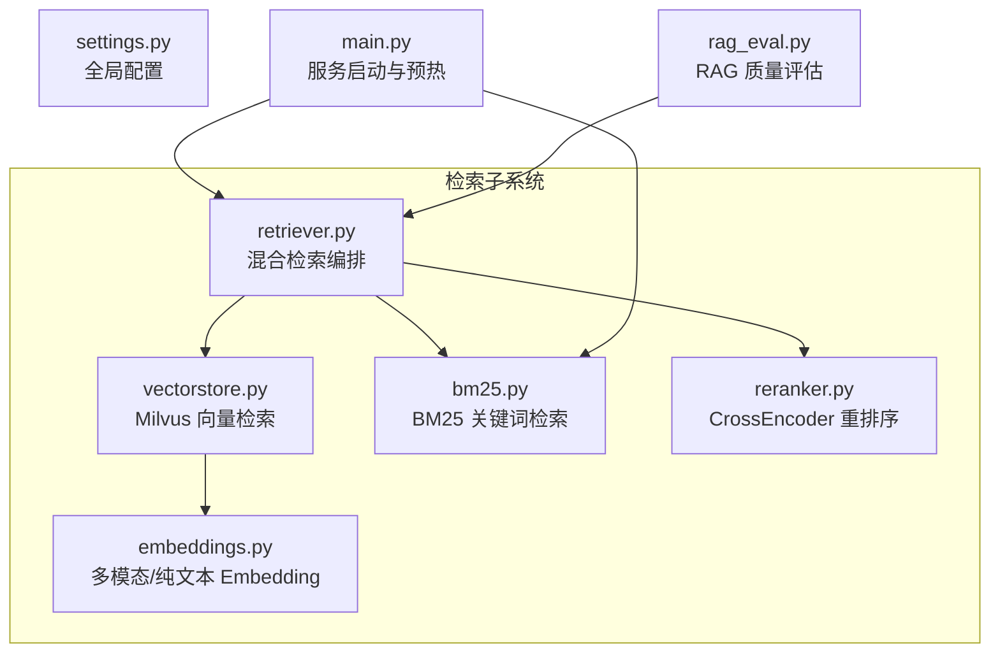
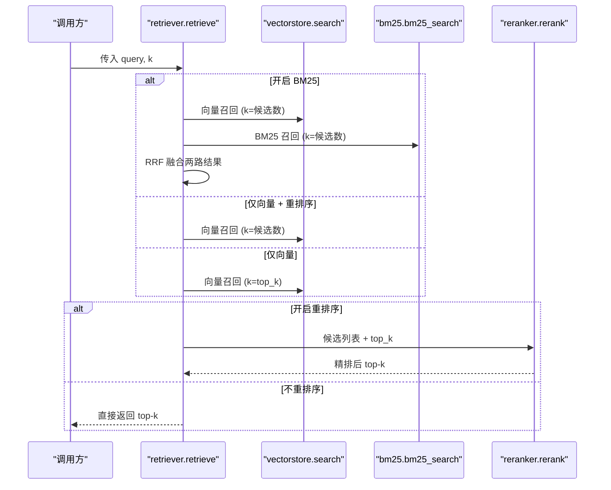
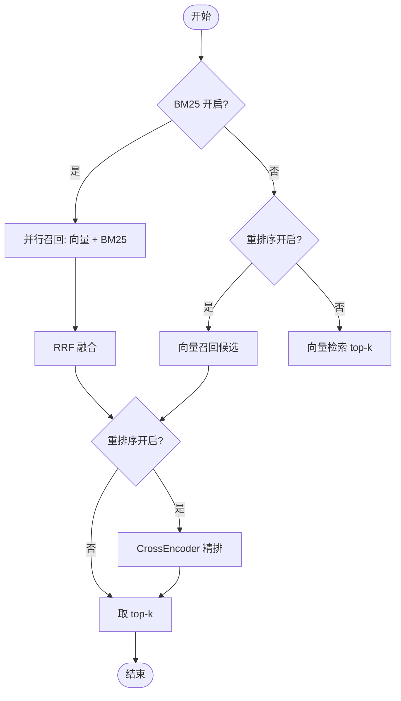
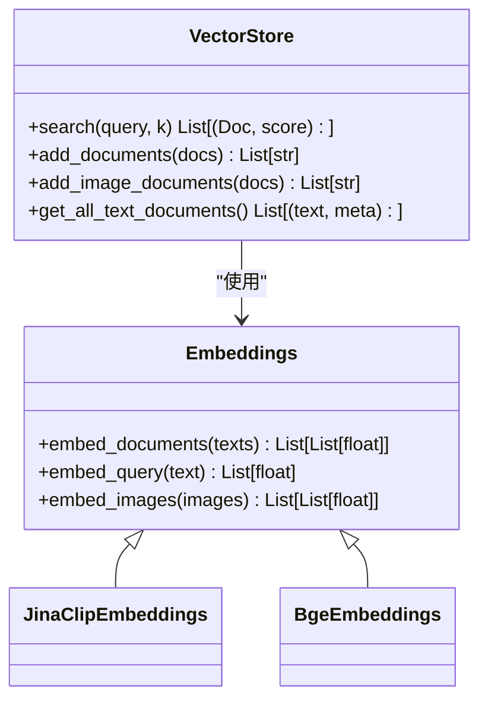
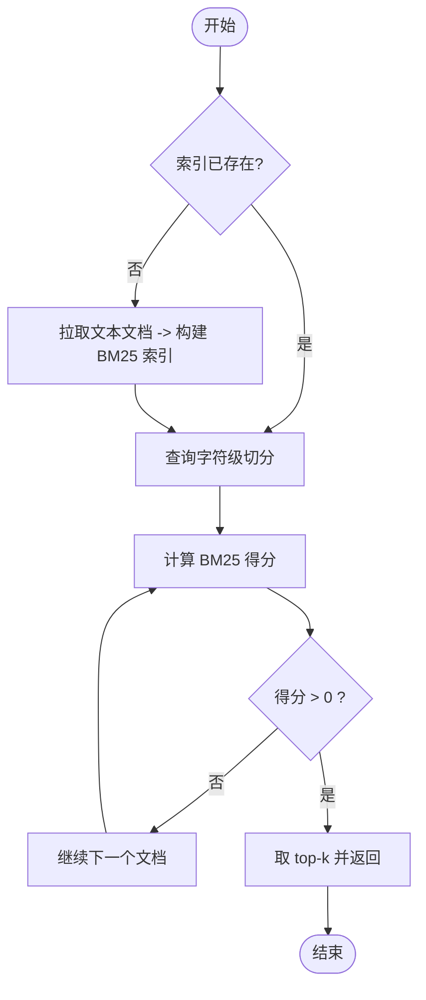
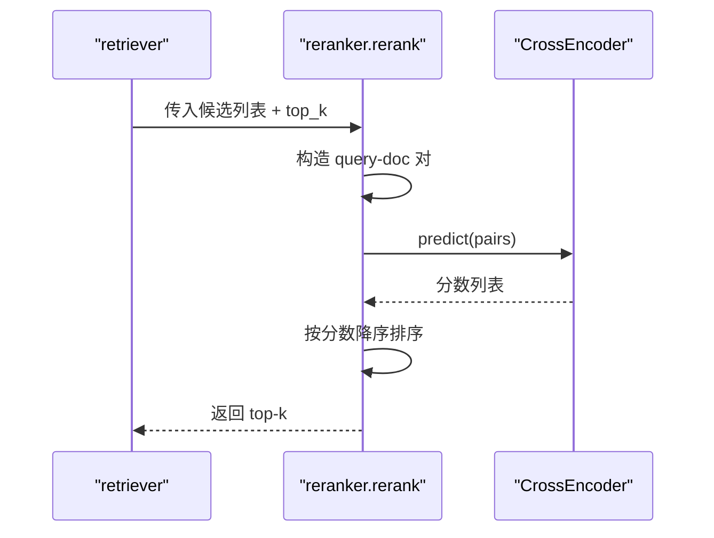
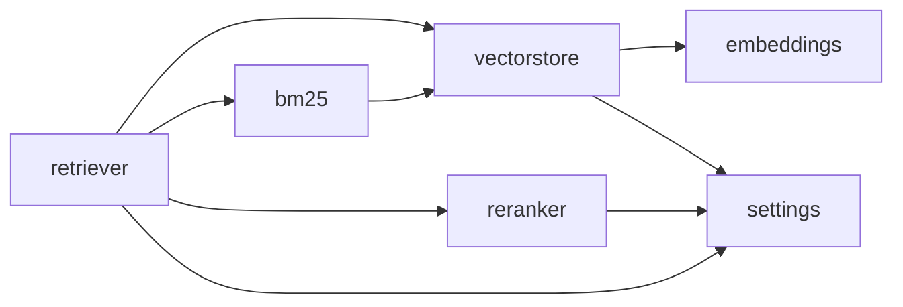

# 检索策略引擎

<cite>
**本文引用的文件**
- [rag/retriever.py](file://rag/retriever.py)
- [rag/bm25.py](file://rag/bm25.py)
- [rag/reranker.py](file://rag/reranker.py)
- [rag/vectorstore.py](file://rag/vectorstore.py)
- [rag/embeddings.py](file://rag/embeddings.py)
- [config/settings.py](file://config/settings.py)
- [evaluation/rag_eval.py](file://evaluation/rag_eval.py)
- [main.py](file://main.py)
</cite>

## 目录
1. [简介](#简介)
2. [项目结构](#项目结构)
3. [核心组件](#核心组件)
4. [架构总览](#架构总览)
5. [详细组件分析](#详细组件分析)
6. [依赖关系分析](#依赖关系分析)
7. [性能考量](#性能考量)
8. [故障排查指南](#故障排查指南)
9. [结论](#结论)
10. [附录：参数调优与评估](#附录参数调优与评估)

## 简介
本技术文档围绕检索策略引擎，系统阐述混合检索架构（向量相似度检索 + BM25 关键词检索）的设计与实现，解释语义检索的查询向量化、相似度计算、结果过滤与排序机制；文档化 BM25 算法集成方案（关键词切分、倒排索引构建与评分计算）；说明检索重排序机制（CrossEncoder 交叉编码器）如何优化结果质量；并提供检索参数调优指南、性能监控、结果评估与 A/B 测试的实施方法。

## 项目结构
检索相关代码主要位于 rag 模块，配合配置模块 config 与评估模块 evaluation，主入口 main.py 负责服务启动与预热流程。

图表来源
- [rag/retriever.py:18-52](file://rag/retriever.py#L18-L52)
- [rag/vectorstore.py:164-184](file://rag/vectorstore.py#L164-L184)
- [rag/bm25.py:22-97](file://rag/bm25.py#L22-L97)
- [rag/reranker.py:30-98](file://rag/reranker.py#L30-L98)
- [rag/embeddings.py:29-179](file://rag/embeddings.py#L29-L179)
- [config/settings.py:50-100](file://config/settings.py#L50-L100)
- [main.py:80-135](file://main.py#L80-L135)
- [evaluation/rag_eval.py:63-121](file://evaluation/rag_eval.py#L63-L121)

章节来源
- [rag/retriever.py:18-52](file://rag/retriever.py#L18-L52)
- [rag/vectorstore.py:164-184](file://rag/vectorstore.py#L164-L184)
- [rag/bm25.py:22-97](file://rag/bm25.py#L22-L97)
- [rag/reranker.py:30-98](file://rag/reranker.py#L30-L98)
- [rag/embeddings.py:29-179](file://rag/embeddings.py#L29-L179)
- [config/settings.py:50-100](file://config/settings.py#L50-L100)
- [main.py:80-135](file://main.py#L80-L135)
- [evaluation/rag_eval.py:63-121](file://evaluation/rag_eval.py#L63-L121)

## 核心组件
- 检索编排器 retriever：统一入口，根据配置决定多路召回（向量 + BM25）、融合（RRF）与重排序（CrossEncoder），并输出 top-k 结果或上下文字符串。
- 向量检索 vectorstore：基于 Milvus Lite 的语义检索，支持文本与图像混合存储与检索，提供分数过滤与批量写入能力。
- 嵌入模型 embeddings：提供多模态（Jina CLIP v2）与纯文本（BGE）两种 Embedding 实现，自动选择与延迟加载。
- BM25 检索 bm25：从向量库拉取文本文档构建进程内 BM25 索引，按字符级切分进行关键词检索。
- 重排序 reranker：使用 CrossEncoder（bge-reranker-base）对候选进行 query-doc 成对打分精排。
- 配置 settings：集中管理检索开关、阈值、候选数、模型与设备、Milvus 连接等。
- 评估 rag_eval：基于 OpenEvals 的 LLM-as-judge 对检索相关性、忠实度、帮助度、答案相关性进行评估。

章节来源
- [rag/retriever.py:18-52](file://rag/retriever.py#L18-L52)
- [rag/vectorstore.py:164-184](file://rag/vectorstore.py#L164-L184)
- [rag/embeddings.py:29-179](file://rag/embeddings.py#L29-L179)
- [rag/bm25.py:22-97](file://rag/bm25.py#L22-L97)
- [rag/reranker.py:30-98](file://rag/reranker.py#L30-L98)
- [config/settings.py:50-100](file://config/settings.py#L50-L100)
- [evaluation/rag_eval.py:63-121](file://evaluation/rag_eval.py#L63-L121)

## 架构总览
混合检索采用“两阶段”策略：第一阶段并行召回（向量相似度 + BM25 关键词），第二阶段通过 CrossEncoder 精排得到最终 top-k。若关闭 BM25 或重排序，则回退为单路向量检索或直接取 top-k。

图表来源
- [rag/retriever.py:18-52](file://rag/retriever.py#L18-L52)
- [rag/vectorstore.py:164-184](file://rag/vectorstore.py#L164-L184)
- [rag/bm25.py:69-97](file://rag/bm25.py#L69-L97)
- [rag/reranker.py:54-98](file://rag/reranker.py#L54-L98)

## 详细组件分析

### 混合检索编排（retriever）
- 功能：根据配置动态选择多路召回与重排序策略，统一输出 (Document, score) 列表或格式化上下文。
- 关键流程：
  - 当 BM25 开启时，并行执行向量检索与 BM25 检索，使用 RRF（倒数秩融合）合并结果，再进入可选的重排序。
  - 当 BM25 关闭但重排序开启时，仅向量召回候选，再进行 CrossEncoder 精排。
  - 当两者均关闭时，直接返回向量检索 top-k。
- 融合算法：RRF 公式 score(d) = Σ 1/(k + rank)，仅依赖排名，可统一不同检索器的分数尺度。
- 上下文格式化：将不同来源的分数归一化为 0~1 的相关度展示。

图表来源
- [rag/retriever.py:18-52](file://rag/retriever.py#L18-L52)
- [rag/retriever.py:55-110](file://rag/retriever.py#L55-L110)

章节来源
- [rag/retriever.py:18-52](file://rag/retriever.py#L18-L52)
- [rag/retriever.py:55-110](file://rag/retriever.py#L55-L110)
- [rag/retriever.py:113-140](file://rag/retriever.py#L113-L140)

### 语义检索（vectorstore + embeddings）
- 向量库：Milvus Lite 本地持久化，支持文本与图像混合存储，使用 FLAT 索引与 L2 距离度量。
- 检索流程：
  - 查询文本经 Embedding 编码为向量，调用 similarity_search_with_score 获取 top-k 结果。
  - 应用分数过滤阈值（距离越小越相关），低于阈值的候选被丢弃；若全被过滤则回退原始结果。
- 嵌入模型：
  - Jina CLIP v2：多模态，文本与图像映射到同一向量空间，维度 1024。
  - BGE：纯文本，维度 512，CPU 下速度更快。
  - 自动选择：根据配置中的 embedding_model 名称判断使用哪种实现。

图表来源
- [rag/vectorstore.py:29-76](file://rag/vectorstore.py#L29-L76)
- [rag/vectorstore.py:164-184](file://rag/vectorstore.py#L164-L184)
- [rag/embeddings.py:29-179](file://rag/embeddings.py#L29-L179)

章节来源
- [rag/vectorstore.py:29-76](file://rag/vectorstore.py#L29-L76)
- [rag/vectorstore.py:164-184](file://rag/vectorstore.py#L164-L184)
- [rag/embeddings.py:29-179](file://rag/embeddings.py#L29-L179)

### BM25 关键词检索（bm25）
- 索引构建：
  - 从向量库拉取全部文本文档（跳过图像与空文本）。
  - 中文按字符级切分，无需额外分词工具。
  - 使用 rank_bm25.BM25Okapi 构建进程内单例索引。
- 检索过程：
  - 查询同样按字符级切分，计算各文档得分，过滤零分结果，返回 top-k。
- 重置机制：在向量库重建后调用 reset_bm25_index 以重建索引。

图表来源
- [rag/bm25.py:22-66](file://rag/bm25.py#L22-L66)
- [rag/bm25.py:69-97](file://rag/bm25.py#L69-L97)
- [rag/bm25.py:100-106](file://rag/bm25.py#L100-L106)

章节来源
- [rag/bm25.py:22-66](file://rag/bm25.py#L22-L66)
- [rag/bm25.py:69-97](file://rag/bm25.py#L69-L97)
- [rag/bm25.py:100-106](file://rag/bm25.py#L100-L106)

### 检索重排序（reranker）
- 模型：BAAI/bge-reranker-base，CrossEncoder 将 query 与候选文档逐对拼接输入模型，获得更精确的相关性分数。
- 流程：
  - 构造 query-doc 对，调用 model.predict 得到分数列表。
  - 按分数降序排序，取 top-k 返回。
  - 失败时回退到原始候选列表的前 top-k。
- 延迟初始化：首次调用时才下载并加载模型，避免启动阻塞。

图表来源
- [rag/reranker.py:30-51](file://rag/reranker.py#L30-L51)
- [rag/reranker.py:54-98](file://rag/reranker.py#L54-L98)

章节来源
- [rag/reranker.py:30-51](file://rag/reranker.py#L30-L51)
- [rag/reranker.py:54-98](file://rag/reranker.py#L54-L98)

### 配置与预热（settings + main）
- 配置项：
  - 检索开关：BM25 开关、重排序开关、查询改写开关。
  - 候选数量：向量候选数、BM25 候选数、RRF 常数 k。
  - 分数阈值：相似度过滤阈值、最低相关度阈值。
  - 模型与设备：embedding_model、rerank_model、rerank_device。
  - Milvus：集合名、索引类型、距离度量、数据库路径。
- 启动预热：
  - 检查向量库是否为空，必要时触发全量/增量入库。
  - 如开启 BM25，预热构建 BM25 索引，降低首请求延迟。
  - 启动文件监听，运行时自动同步知识库变更。

章节来源
- [config/settings.py:50-100](file://config/settings.py#L50-L100)
- [main.py:80-135](file://main.py#L80-L135)

## 依赖关系分析
- retriever 依赖 vectorstore、bm25、reranker 与 settings。
- vectorstore 依赖 embeddings 与 settings。
- bm25 依赖 vectorstore（拉取文本文档）与 rank_bm25。
- reranker 依赖 sentence_transformers.CrossEncoder 与 settings。
- embeddings 依赖 transformers/sentence-transformers/PIL/torch（按需导入）。
- main 在启动时预热向量库与 BM25 索引，并启动文件监听。

图表来源
- [rag/retriever.py:18-52](file://rag/retriever.py#L18-L52)
- [rag/vectorstore.py:29-76](file://rag/vectorstore.py#L29-L76)
- [rag/bm25.py:22-66](file://rag/bm25.py#L22-L66)
- [rag/reranker.py:30-51](file://rag/reranker.py#L30-L51)
- [config/settings.py:50-100](file://config/settings.py#L50-L100)

章节来源
- [rag/retriever.py:18-52](file://rag/retriever.py#L18-L52)
- [rag/vectorstore.py:29-76](file://rag/vectorstore.py#L29-L76)
- [rag/bm25.py:22-66](file://rag/bm25.py#L22-L66)
- [rag/reranker.py:30-51](file://rag/reranker.py#L30-L51)
- [config/settings.py:50-100](file://config/settings.py#L50-L100)

## 性能考量
- 模型与设备：
  - 纯文本场景优先使用 BGE（sentence-transformers），CPU 下速度更快。
  - 多模态场景使用 Jina CLIP v2，注意首次加载耗时较长。
- 向量库连接：
  - Milvus Lite gRPC keepalive 配置避免空闲 ping 过频导致断连。
  - 写入操作加锁，避免并发冲突；flush 确保数据落盘可查。
- 索引与缓存：
  - BM25 索引为进程内单例，重启需重建；可通过预热减少首请求延迟。
  - CrossEncoder 模型延迟加载，首次调用才下载与初始化。
- 召回与排序：
  - 增大候选数可提高召回率，但会增加重排序开销。
  - RRF 融合仅依赖排名，稳定且无需对齐分数分布。
- 流式与超时：
  - 流式接口设置整体超时保护，防止连接卡死。

章节来源
- [rag/embeddings.py:29-179](file://rag/embeddings.py#L29-L179)
- [rag/vectorstore.py:46-68](file://rag/vectorstore.py#L46-L68)
- [rag/vectorstore.py:96-106](file://rag/vectorstore.py#L96-L106)
- [rag/bm25.py:22-66](file://rag/bm25.py#L22-L66)
- [rag/reranker.py:30-51](file://rag/reranker.py#L30-L51)
- [main.py:228-314](file://main.py#L228-L314)

## 故障排查指南
- BM25 不可用：
  - 未安装 rank_bm25 依赖会导致 BM25 检索不可用；日志会提示安装命令。
  - 向量库无文本文档时，BM25 索引为空，检索返回空列表。
- 重排序失败：
  - CrossEncoder 加载或推理异常时，回退到原始向量检索结果前 top-k。
- 向量检索过滤过严：
  - 若所有结果因距离阈值被过滤，将回退返回原始结果，保证有内容。
- 启动预热失败：
  - 向量库初始化或 BM25 索引预热失败不影响服务可用性，仅记录警告日志。

章节来源
- [rag/bm25.py:56-66](file://rag/bm25.py#L56-L66)
- [rag/bm25.py:69-97](file://rag/bm25.py#L69-L97)
- [rag/reranker.py:95-98](file://rag/reranker.py#L95-L98)
- [rag/vectorstore.py:178-184](file://rag/vectorstore.py#L178-L184)
- [main.py:110-135](file://main.py#L110-L135)

## 结论
该检索策略引擎通过“向量相似度 + BM25 关键词”的多路召回与 CrossEncoder 精排，兼顾召回广度与排序精度。结合灵活的配置与预热机制，可在不同硬件与数据规模下取得良好效果。通过评估模块与 A/B 测试方法，可持续优化检索质量与用户体验。

## 附录：参数调优与评估

### 参数调优指南
- top_k 设置：
  - 重排序后返回数量：rerank_top_k（默认 4）。
  - 向量检索直接返回数量：rag_top_k（默认 4）。
- 相似度阈值：
  - 向量检索分数过滤阈值：rag_score_filter（默认 1.2，L2 距离越小越相关）。
  - 注入上下文的最低相关度：rag_min_relevance（默认 0.3）。
- 权重与候选数：
  - 向量候选数：rerank_candidate_count（默认 20）。
  - BM25 候选数：rag_bm25_candidate_count（默认 10）。
  - RRF 常数：rag_rrf_k（默认 60）。
- 模型与设备：
  - 嵌入模型：embedding_model（默认 jinaai/jina-clip-v2；含 bge 时使用 BgeEmbeddings）。
  - 重排序模型：rerank_model（默认 BAAI/bge-reranker-base）。
  - 设备：embedding_device、rerank_device（默认 cpu）。
- 开关控制：
  - BM25 开关：rag_bm25_enabled（默认 False）。
  - 重排序开关：rerank_enabled（默认 True）。
  - 查询改写：rag_query_rewrite_enabled（默认 False）。

章节来源
- [config/settings.py:50-100](file://config/settings.py#L50-L100)

### 结果评估与 A/B 测试
- 评估维度：
  - 检索相关性：参考文档是否与问题相关。
  - 忠实度：答案是否基于检索到的上下文（无幻觉）。
  - 帮助度：回答是否对用户有帮助。
  - 答案相关性：回答是否切题。
- 评估实现：
  - 使用 OpenEvals 的 LLM-as-judge 与预置 prompt 构建评估器。
  - 支持单样本与批量评估，返回分数与推理说明。
- A/B 测试建议：
  - 对比不同参数组合（如 BM25 开关、候选数、阈值）下的评估指标。
  - 固定数据集与评测脚本，统计显著性差异，选择最优配置。

章节来源
- [evaluation/rag_eval.py:1-121](file://evaluation/rag_eval.py#L1-L121)