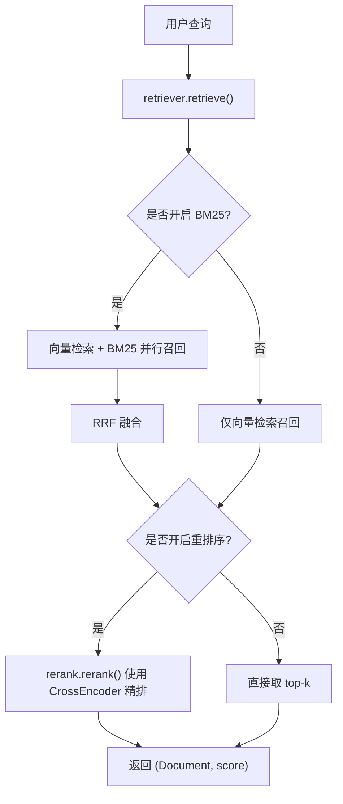
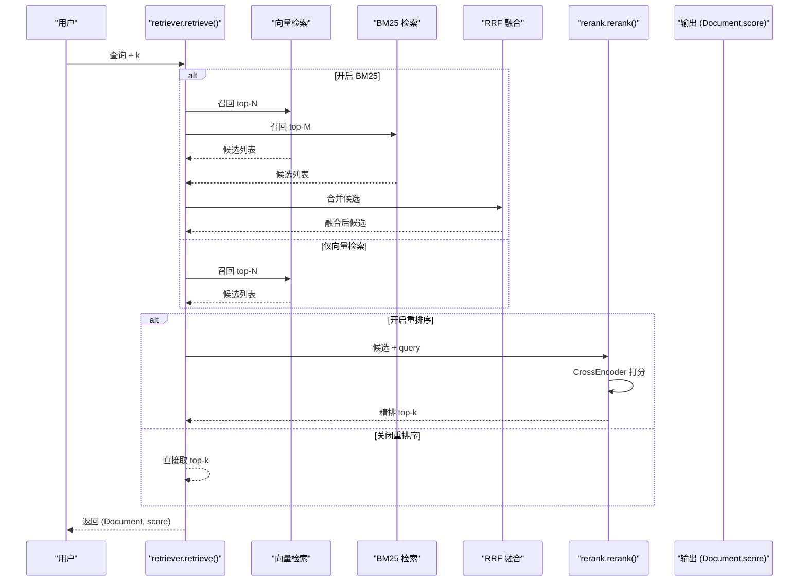
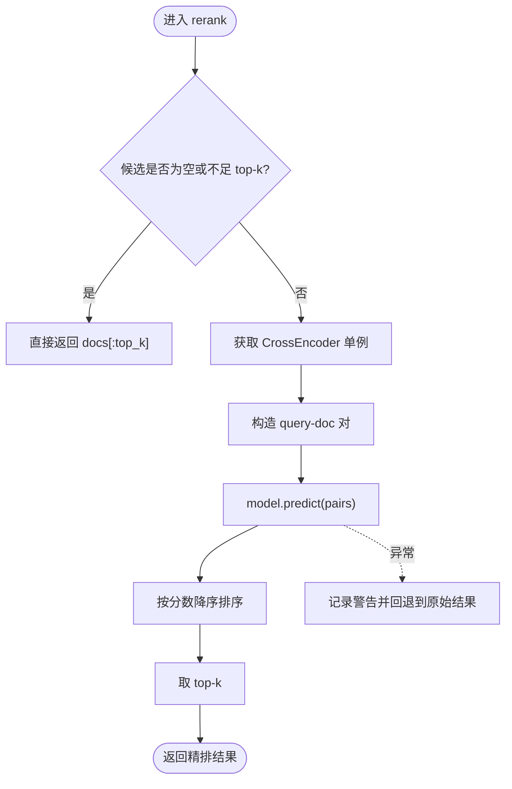
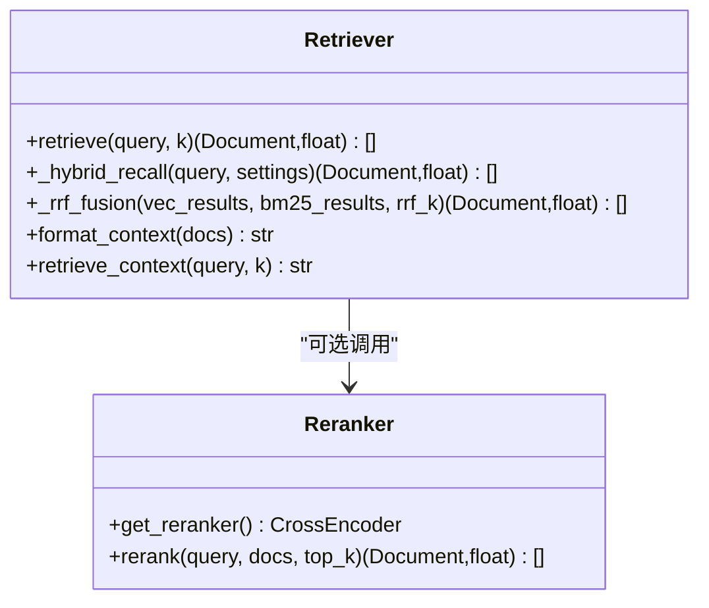
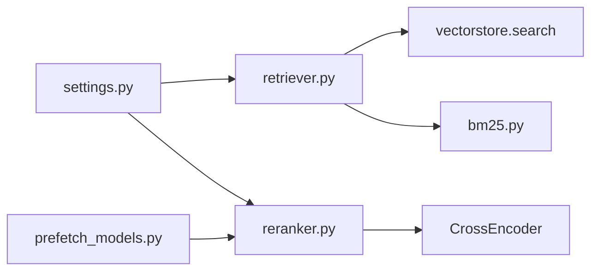

# 重排序优化

<cite>
**本文引用的文件**
- [reranker.py](file://rag/reranker.py)
- [retriever.py](file://rag/retriever.py)
- [settings.py](file://config/settings.py)
- [bm25.py](file://rag/bm25.py)
- [prefetch_models.py](file://scripts/prefetch_models.py)
- [rag_eval.py](file://evaluation/rag_eval.py)
- [run_eval.py](file://evaluation/run_eval.py)
</cite>

## 目录
1. [简介](#简介)
2. [项目结构](#项目结构)
3. [核心组件](#核心组件)
4. [架构总览](#架构总览)
5. [详细组件分析](#详细组件分析)
6. [依赖关系分析](#依赖关系分析)
7. [性能考量](#性能考量)
8. [故障排查指南](#故障排查指南)
9. [结论](#结论)
10. [附录](#附录)

## 简介
本模块聚焦检索结果的重排序优化，目标是在向量召回的基础上，通过交叉编码器（CrossEncoder）对候选文档与查询进行语义匹配打分，实现更精准的精排。系统采用两阶段流程：先以向量检索召回 top-N 候选，再用 CrossEncoder 精排取 top-k；同时支持多路召回（BM25）与 RRF 融合，以及可配置的重排序开关与参数调优。

## 项目结构
重排序相关代码主要分布在以下位置：
- rag/reranker.py：CrossEncoder 模型加载、单例管理、重排序打分与排序逻辑
- rag/retriever.py：检索编排（向量检索、BM25 多路召回、RRF 融合、可选重排序）
- config/settings.py：全局配置（是否启用重排序、模型名、设备、候选数、top-k 等）
- rag/bm25.py：BM25 关键词检索（与向量检索互补）
- scripts/prefetch_models.py：构建期预下载并校验重排序模型
- evaluation/*：RAG 质量评估（检索相关性、忠实度、帮助度、答案相关性）

图表来源
- [retriever.py:18-52](file://rag/retriever.py#L18-L52)
- [reranker.py:54-97](file://rag/reranker.py#L54-L97)
- [settings.py:95-100](file://config/settings.py#L95-L100)

章节来源
- [retriever.py:1-52](file://rag/retriever.py#L1-L52)
- [settings.py:95-100](file://config/settings.py#L95-L100)

## 核心组件
- 重排序器（CrossEncoder）：延迟初始化单例，按查询-文档对批量打分，按分数降序取 top-k
- 检索编排器：根据配置决定多路召回与是否重排序，统一输出格式
- 配置中心：集中管理重排序开关、模型、设备、候选数、top-k 等关键参数
- BM25 索引：内存级关键词检索，与向量检索互补，提升精确匹配召回率
- 模型预取：构建期预下载并校验 CrossEncoder，避免运行时首次调用阻塞

章节来源
- [reranker.py:22-51](file://rag/reranker.py#L22-L51)
- [retriever.py:18-52](file://rag/retriever.py#L18-L52)
- [settings.py:95-100](file://config/settings.py#L95-L100)
- [bm25.py:22-66](file://rag/bm25.py#L22-L66)
- [prefetch_models.py:40-53](file://scripts/prefetch_models.py#L40-L53)

## 架构总览
下图展示了从查询到最终上下文的完整链路，包括多路召回、RRF 融合、重排序与上下文格式化。

图表来源
- [retriever.py:18-52](file://rag/retriever.py#L18-L52)
- [retriever.py:55-110](file://rag/retriever.py#L55-L110)
- [reranker.py:54-97](file://rag/reranker.py#L54-L97)

## 详细组件分析

### 重排序器（CrossEncoder）
- 模型加载与管理
  - 延迟初始化单例：首次调用时从配置读取模型名与设备，构造 CrossEncoder，后续复用
  - 国内镜像加速：设置 HF_ENDPOINT 环境变量，优先尊重用户已设值
- 打分与排序
  - 将查询与每个候选文档拼接为 pairs，调用 predict 得到分数列表（越大越相关）
  - 将 (doc, score) 配对并按分数降序排序，取 top-k 返回
- 容错与回退
  - 异常捕获后记录警告日志，并回退到原始向量检索结果的前 top-k

图表来源
- [reranker.py:54-97](file://rag/reranker.py#L54-L97)

章节来源
- [reranker.py:22-51](file://rag/reranker.py#L22-L51)
- [reranker.py:54-97](file://rag/reranker.py#L54-L97)

### 检索编排器（retriever）
- 多路召回策略
  - 若开启 BM25：并行执行向量检索与 BM25 检索，使用 RRF 融合两路结果
  - 若未开启 BM25：仅向量检索召回候选
- 重排序集成
  - 当开启重排序时，对融合或向量召回的候选执行 CrossEncoder 精排，返回 top-k
  - 未开启重排序时，直接取 top-k（RRF 融合已排序，或向量检索原始排序）
- 上下文格式化
  - 将 (Document, score) 转换为带来源、标题与归一化相关度的文本块，便于下游生成节点使用

图表来源
- [retriever.py:18-139](file://rag/retriever.py#L18-L139)
- [reranker.py:30-97](file://rag/reranker.py#L30-L97)

章节来源
- [retriever.py:18-139](file://rag/retriever.py#L18-L139)

### 配置管理（settings）
- 重排序相关参数
  - rerank_enabled：是否启用重排序
  - rerank_model：模型名称（默认 BAAI/bge-reranker-base）
  - rerank_device：运行设备（cpu/gpu）
  - rerank_candidate_count：向量检索召回候选数
  - rerank_top_k：重排序后返回的 top-k
- 其他相关参数
  - rag_bm25_enabled、rag_bm25_candidate_count、rag_rrf_k：多路召回与融合参数
  - rag_top_k、rag_score_filter、rag_min_relevance：检索过滤与展示阈值

章节来源
- [settings.py:83-100](file://config/settings.py#L83-L100)

### BM25 关键词检索
- 索引构建
  - 从向量库拉取文本文档，构建进程内 BM25 索引（字符级切分，无需额外分词依赖）
  - 单例模式，重启需重建
- 检索流程
  - 查询同样按字符级切分，计算得分并返回 top-k（过滤零分文档）
- 与重排序的关系
  - 作为向量检索的补充，提升精确匹配召回率；可与重排序组合使用

章节来源
- [bm25.py:22-97](file://rag/bm25.py#L22-L97)

### 模型预取与部署
- 构建期预下载
  - 脚本在 Docker 构建阶段依次下载并校验 Embedding、CrossEncoder、OCR 模型
  - 若任一步骤失败，构建终止，避免产出坏镜像
- 本地模型部署
  - 通过配置 rerank_model 与 rerank_device 指定本地模型与设备
  - 首次调用时自动下载并缓存，后续复用单例
- 云端 API 调用
  - 当前实现基于本地 CrossEncoder；如需云端 API，可在 reranker 中替换预测逻辑并增加鉴权与重试机制

章节来源
- [prefetch_models.py:40-53](file://scripts/prefetch_models.py#L40-L53)
- [reranker.py:22-51](file://rag/reranker.py#L22-L51)

## 依赖关系分析
- retriever 依赖 vectorstore.search 进行向量检索，并在需要时调用 bm25_search
- reranker 依赖 sentence_transformers.CrossEncoder 进行打分
- settings 提供全局配置，被 retriever 与 reranker 共同读取
- prefetch_models 在构建期触发模型下载与校验，确保运行时可用性

图表来源
- [retriever.py:18-52](file://rag/retriever.py#L18-L52)
- [reranker.py:30-51](file://rag/reranker.py#L30-L51)
- [bm25.py:22-66](file://rag/bm25.py#L22-L66)
- [prefetch_models.py:40-53](file://scripts/prefetch_models.py#L40-L53)

章节来源
- [retriever.py:18-52](file://rag/retriever.py#L18-L52)
- [reranker.py:30-51](file://rag/reranker.py#L30-L51)
- [bm25.py:22-66](file://rag/bm25.py#L22-L66)
- [prefetch_models.py:40-53](file://scripts/prefetch_models.py#L40-L53)

## 性能考量
- 批处理
  - CrossEncoder 的 predict 支持批量输入，建议保持合理的 batch 大小以平衡吞吐与显存占用
- 缓存策略
  - 模型单例复用避免重复加载；可对高频 query-doc 对的打分结果做 LRU 缓存（需结合业务场景设计键空间）
- 异步处理
  - 检索与重排序可考虑异步化，减少主线程阻塞；注意并发下的资源竞争与超时控制
- 多路召回与融合
  - 开启 BM25 可提升精确匹配召回率，但会增加检索与融合开销；RRF 常数 rag_rrf_k 影响融合权重
- 设备选择
  - rerank_device 设为 gpu 可显著降低延迟，但需考虑显存占用与成本；cpu 模式更稳定但较慢
- 候选规模
  - rerank_candidate_count 增大可提升召回覆盖面，但会增加重排序计算量；需结合 rerank_top_k 与延迟预算权衡

[本节为通用性能指导，不直接分析具体文件]

## 故障排查指南
- 重排序失败回退
  - 当 CrossEncoder 预测异常时，记录警告日志并回退到原始向量检索结果的前 top-k，保证服务可用性
- 模型加载问题
  - 检查 HF_ENDPOINT 是否正确设置；确认网络可达与镜像可用
  - 构建期预下载失败会导致运行时首次调用阻塞，建议在构建阶段完成模型预热
- 配置错误
  - rerank_enabled=false 会跳过重排序；确认 rerank_model 与 rerank_device 与实际环境匹配
- 多路召回为空
  - 若向量检索与 BM25 均无命中，返回空列表；检查知识库数据与索引构建状态

章节来源
- [reranker.py:95-97](file://rag/reranker.py#L95-L97)
- [prefetch_models.py:40-53](file://scripts/prefetch_models.py#L40-L53)
- [settings.py:95-100](file://config/settings.py#L95-L100)

## 结论
本重排序模块通过 CrossEncoder 对候选文档进行语义匹配打分，显著提升检索结果的准确性。配合多路召回与 RRF 融合，系统在精度与召回之间取得良好平衡。通过灵活的配置与健壮的容错机制，能够在不同部署环境下稳定运行。未来可进一步引入缓存、异步与更精细的批处理策略，以优化端到端延迟与吞吐。

[本节为总结性内容，不直接分析具体文件]

## 附录

### 重排序参数调优方法
- top_n（即 rerank_candidate_count）
  - 增大可提升召回覆盖面，但增加重排序计算量；建议从默认值逐步上调并结合延迟预算测试
- top_k（即 rerank_top_k）
  - 控制最终注入上下文的文档数量；过小可能遗漏关键信息，过大可能引入噪声
- 阈值配置
  - rag_score_filter：过滤低相关度候选，避免无效上下文
  - rag_min_relevance：统一归一化后的最低相关度阈值，低于此值的文档不注入生成上下文
- 性能权衡
  - 在 CPU 环境下适当减小候选规模；GPU 环境下可适当增大以提升精度
  - 开启 BM25 与 RRF 融合可提升精确匹配召回率，但需评估额外开销

章节来源
- [settings.py:64-100](file://config/settings.py#L64-L100)
- [retriever.py:113-133](file://rag/retriever.py#L113-L133)

### 重排序效果评估指标
- 检索相关性（retrieval_relevance）
  - 评估检索到的文档是否与问题相关，使用 OpenEvals 的 RAG_RETRIEVAL_RELEVANCE_PROMPT
- 忠实度（groundedness）
  - 评估答案是否基于检索上下文，避免幻觉，使用 RAG_GROUNDEDNESS_PROMPT
- 帮助度（helpfulness）
  - 评估回答对用户是否有实际帮助，使用 RAG_HELPFULNESS_PROMPT
- 答案相关性（answer_relevance）
  - 评估回答是否切题，使用 ANSWER_RELEVANCE_PROMPT
- 说明
  - 当前实现使用 LLM-as-a-judge 方式评估；如需传统指标（如 NDCG、MAP），可在评估管线中扩展自定义指标计算逻辑

章节来源
- [rag_eval.py:1-121](file://evaluation/rag_eval.py#L1-L121)
- [run_eval.py:70-141](file://evaluation/run_eval.py#L70-L141)

### 重排序性能优化技巧
- 批处理
  - 利用 CrossEncoder 的批量预测能力，合理设置批次大小以提升吞吐
- 缓存策略
  - 对高频 query-doc 对的打分结果进行缓存，减少重复计算
- 异步处理
  - 将检索与重排序步骤异步化，结合超时与重试机制提升整体响应速度
- 多路召回优化
  - 调整 BM25 候选数与 RRF 常数，平衡召回率与延迟
- 设备与模型选择
  - 根据硬件条件选择合适的 rerank_device；必要时切换更轻量模型以降低延迟

[本节为通用优化建议，不直接分析具体文件]