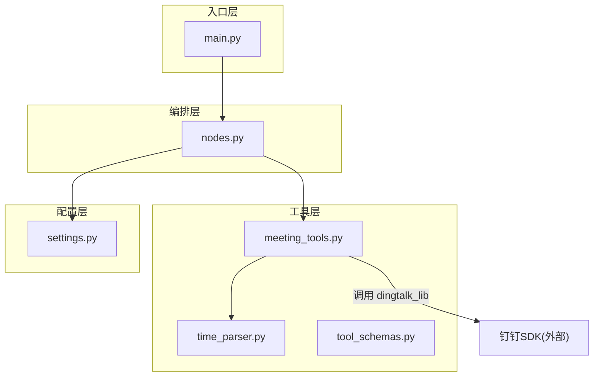
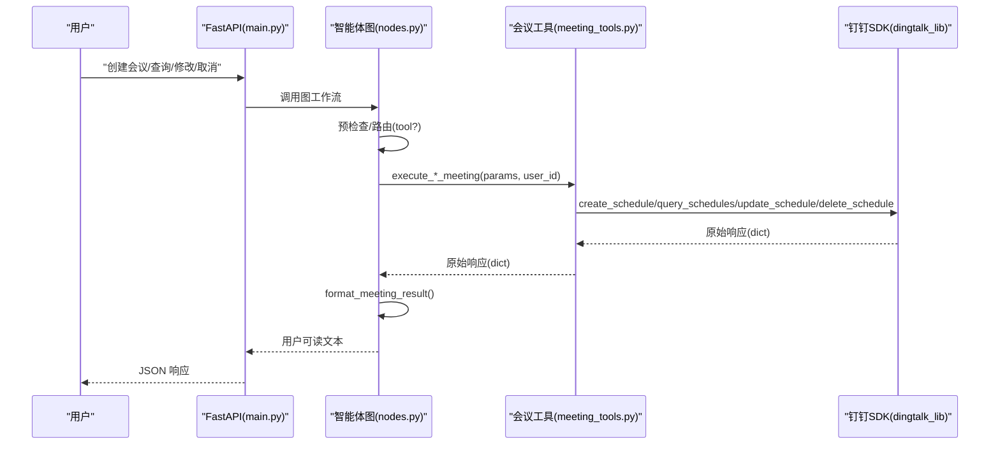
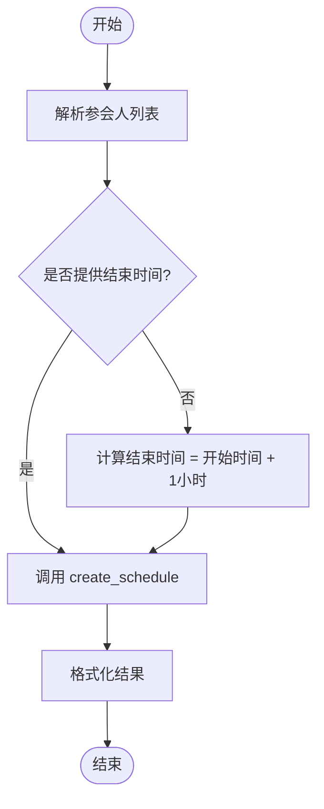
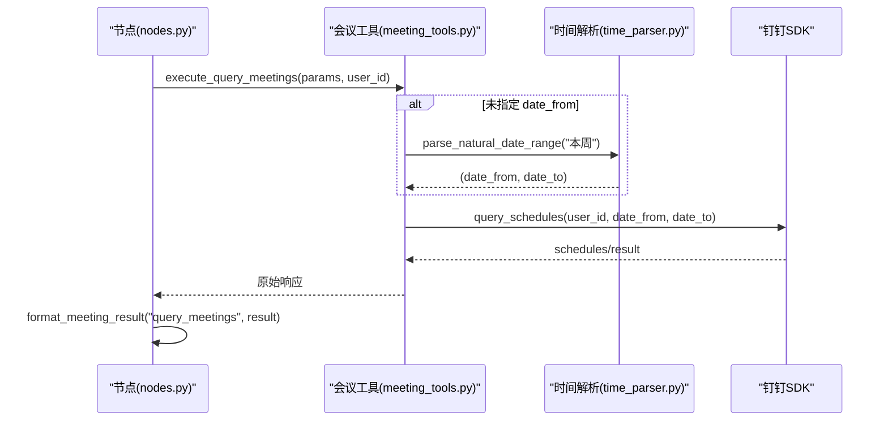
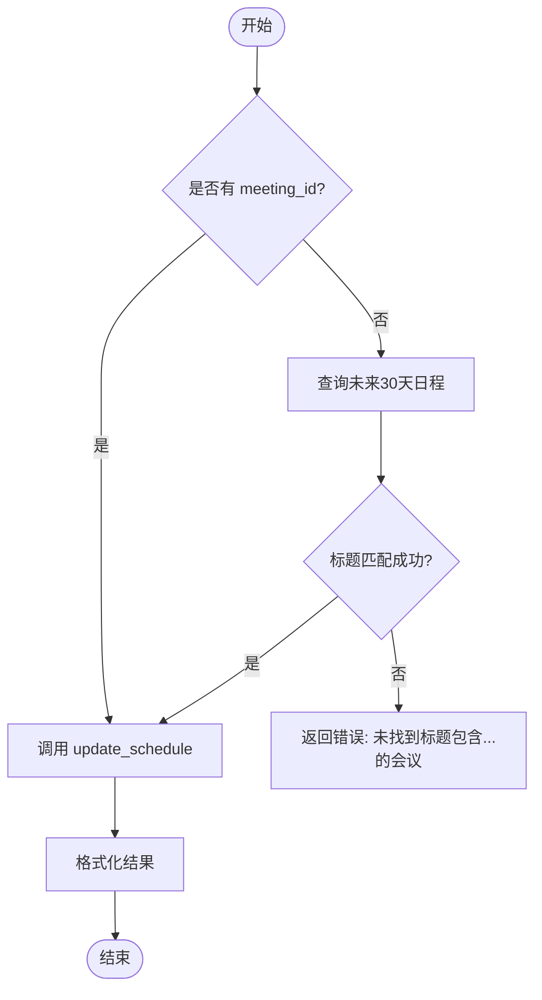
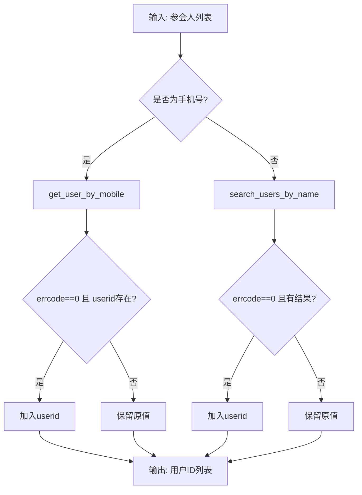
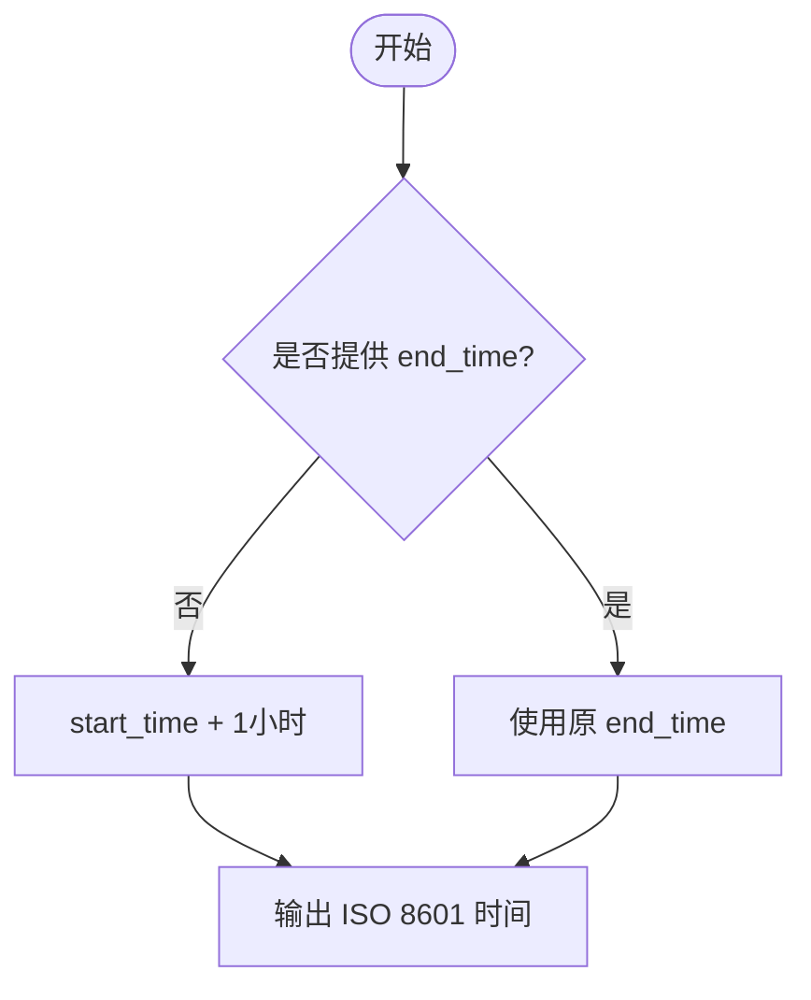
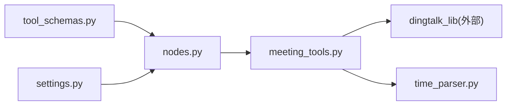

# 会议管理工具

<cite>
**本文引用的文件**
- [meeting_tools.py](file://agent/tools/meeting_tools.py)
- [time_parser.py](file://agent/tools/time_parser.py)
- [tool_schemas.py](file://agent/tools/tool_schemas.py)
- [settings.py](file://config/settings.py)
- [nodes.py](file://agent/nodes.py)
- [main.py](file://main.py)
</cite>

## 目录
1. [简介](#简介)
2. [项目结构](#项目结构)
3. [核心组件](#核心组件)
4. [架构总览](#架构总览)
5. [详细组件分析](#详细组件分析)
6. [依赖关系分析](#依赖关系分析)
7. [性能与可靠性](#性能与可靠性)
8. [故障排查指南](#故障排查指南)
9. [结论](#结论)
10. [附录：使用模式与最佳实践](#附录使用模式与最佳实践)

## 简介
本技术文档聚焦“会议管理工具”，系统性说明钉钉会议 API 的集成实现，覆盖创建、查询、修改、取消会议的完整流程；深入解析参会人识别机制（姓名/手机号自动识别并转换为钉钉用户ID）；阐述时间处理逻辑（默认时长、ISO 8601 格式与时区兼容）；总结错误处理策略与结果格式化机制，提供用户友好的响应文本；并给出与钉钉 SDK 的集成方式与最佳实践。

## 项目结构
会议管理相关代码位于 agent/tools 目录下，围绕三个核心模块组织：
- meeting_tools.py：会议工具执行器，封装创建、查询、修改、取消等能力，负责参数转换、参会人解析、结果格式化。
- time_parser.py：自然语言时间解析器，将中文时间表达转换为 ISO 8601 字符串，并提供日期范围解析。
- tool_schemas.py：工具 Schema 定义，用于 LLM Function Calling 的参数提取与描述。

此外，配置由 config/settings.py 统一管理，节点编排与路由在 agent/nodes.py 中完成，Web 入口与流式接口在 main.py 中提供。

图表来源
- [meeting_tools.py:17-128](file://agent/tools/meeting_tools.py#L17-L128)
- [time_parser.py:11-63](file://agent/tools/time_parser.py#L11-L63)
- [tool_schemas.py:30-120](file://agent/tools/tool_schemas.py#L30-L120)
- [nodes.py:92-150](file://agent/nodes.py#L92-L150)
- [settings.py:151-155](file://config/settings.py#L151-L155)
- [main.py:154-209](file://main.py#L154-L209)

章节来源
- [meeting_tools.py:1-225](file://agent/tools/meeting_tools.py#L1-L225)
- [time_parser.py:1-120](file://agent/tools/time_parser.py#L1-L120)
- [tool_schemas.py:1-121](file://agent/tools/tool_schemas.py#L1-L121)
- [settings.py:1-216](file://config/settings.py#L1-L216)
- [nodes.py:1-200](file://agent/nodes.py#L1-L200)
- [main.py:1-387](file://main.py#L1-L387)

## 核心组件
- 会议工具执行器（meeting_tools.py）
  - 创建会议：参数校验、参会人解析、默认时长补全、调用钉钉 create_schedule。
  - 取消会议：优先按 meeting_id，否则按标题匹配最近30天日程后删除。
  - 修改会议：优先按 meeting_id，否则按标题匹配最近30天日程后更新。
  - 查询会议：支持 date_from/date_to，未指定时默认查询本周。
  - 结果格式化：统一 errcode 检查，生成用户可读文本。
  - 参会人解析：手机号正则匹配 → get_user_by_mobile；姓名 → search_users_by_name；失败保留原值。
  - 时间处理：_add_one_hour 为 ISO 时间加1小时，作为默认时长。

- 时间解析器（time_parser.py）
  - parse_natural_time：将“明天下午3点”等自然语言转为 ISO 8601。
  - parse_natural_date_range：将“本周/下周/本月/今天/明天”等转为起止时间。
  - 内部 _parse_date/_parse_time：日期偏移与时间片段解析，支持“X天后/X小时后”。

- 工具 Schema（tool_schemas.py）
  - 定义 create_meeting/cancel_meeting/update_meeting/query_meetings 的工具名、描述与参数结构。
  - WRITE_TOOLS/READ_TOOLS 区分写操作（需确认）与读操作（直接执行）。

- 配置（settings.py）
  - tool_calling_enabled：工具调用总开关。
  - tool_confirmation_required：写操作是否需要用户确认。

- 节点编排（nodes.py）
  - pre_check_node：处理 pending_confirmation 状态，确认后调用 _execute_tool。
  - route_node/_decide_route：关键词+LLM 路由到 tool/rag/web/chat。
  - 工具执行与结果格式化通过 _execute_tool/_format_tool_result 桥接到 meeting_tools。

章节来源
- [meeting_tools.py:17-225](file://agent/tools/meeting_tools.py#L17-L225)
- [time_parser.py:11-120](file://agent/tools/time_parser.py#L11-L120)
- [tool_schemas.py:30-120](file://agent/tools/tool_schemas.py#L30-L120)
- [settings.py:151-155](file://config/settings.py#L151-L155)
- [nodes.py:92-200](file://agent/nodes.py#L92-L200)

## 架构总览
会议管理的端到端流程如下：
- Web 入口接收请求，进入智能体图工作流。
- 预检查节点判断是否命中缓存或需要工具调用。
- 路由节点根据意图选择 tool 分支。
- 工具节点根据工具名调度 meeting_tools 对应函数。
- meeting_tools 调用 dingtalk_lib 提供的会议 API。
- 结果经 format_meeting_result 格式化后返回。

图表来源
- [main.py:154-209](file://main.py#L154-L209)
- [nodes.py:92-150](file://agent/nodes.py#L92-L150)
- [meeting_tools.py:17-128](file://agent/tools/meeting_tools.py#L17-L128)

## 详细组件分析

### 创建会议（create_meeting）
- 输入参数：title、start_time（必填）、end_time（可选）、attendees（姓名/手机号列表）、location、description。
- 参会人解析：
  - 手机号匹配：正则 ^1\d{10}$，调用 get_user_by_mobile 获取 userid。
  - 姓名匹配：调用 search_users_by_name，取第一个结果的 userid。
  - 解析失败保留原值，交由上层 API 忽略无效 ID。
- 默认时长：若未提供 end_time，则以 start_time + 1 小时作为结束时间。
- 调用钉钉 API：create_schedule(user_id, title, start_time, end_time, attendees, location, description)。
- 结果格式化：成功返回“会议已创建成功！”及 schedule_id（如有）。

图表来源
- [meeting_tools.py:17-47](file://agent/tools/meeting_tools.py#L17-L47)
- [meeting_tools.py:185-225](file://agent/tools/meeting_tools.py#L185-L225)

章节来源
- [meeting_tools.py:17-47](file://agent/tools/meeting_tools.py#L17-L47)
- [meeting_tools.py:185-225](file://agent/tools/meeting_tools.py#L185-L225)

### 查询会议（query_meetings）
- 输入参数：date_from、date_to（可选）。
- 默认行为：未指定 date_from 时，使用 parse_natural_date_range("本周") 得到本周起止时间。
- 调用钉钉 API：query_schedules(user_id, date_from, date_to)。
- 结果格式化：若无会议返回“该时间段内暂无会议。”；否则列出会议数量与每条摘要、时间、地点。

图表来源
- [meeting_tools.py:116-128](file://agent/tools/meeting_tools.py#L116-L128)
- [time_parser.py:29-63](file://agent/tools/time_parser.py#L29-L63)

章节来源
- [meeting_tools.py:116-128](file://agent/tools/meeting_tools.py#L116-L128)
- [time_parser.py:29-63](file://agent/tools/time_parser.py#L29-L63)

### 修改会议（update_meeting）
- 输入参数：meeting_id 或 meeting_title（二选一）、updates（可包含 title/start_time/end_time/location）。
- 无 meeting_id 时的回退：以当前时间为起点，查询未来30天的日程，按标题模糊匹配找到 schedule_id。
- 调用钉钉 API：update_schedule(user_id, meeting_id, updates)。
- 结果格式化：成功返回“会议已更新，已通知参会人。”

图表来源
- [meeting_tools.py:83-113](file://agent/tools/meeting_tools.py#L83-L113)

章节来源
- [meeting_tools.py:83-113](file://agent/tools/meeting_tools.py#L83-L113)

### 取消会议（cancel_meeting）
- 输入参数：meeting_id 或 meeting_title（二选一）、notify_attendees（默认 True）。
- 无 meeting_id 时的回退：同修改会议，查询未来30天日程并按标题匹配。
- 调用钉钉 API：delete_schedule(user_id, meeting_id, notify)。
- 结果格式化：成功返回“会议已取消，已通知参会人。”

图表来源
- [meeting_tools.py:50-80](file://agent/tools/meeting_tools.py#L50-L80)

章节来源
- [meeting_tools.py:50-80](file://agent/tools/meeting_tools.py#L50-L80)

### 参会人解析机制
- 手机号识别：正则 ^1\d{10}$，直接调用 get_user_by_mobile 获取 userid。
- 姓名识别：调用 search_users_by_name，取第一个用户的 userid。
- 容错策略：解析失败保留原值，避免阻断后续 API 调用（钉钉侧会跳过无效 ID）。

图表来源
- [meeting_tools.py:185-213](file://agent/tools/meeting_tools.py#L185-L213)

章节来源
- [meeting_tools.py:185-213](file://agent/tools/meeting_tools.py#L185-L213)

### 时间处理逻辑
- 默认时长：创建会议时若未提供 end_time，则自动将 start_time 加1小时作为结束时间。
- ISO 8601 格式：所有时间均以 ISO 8601 字符串传递，确保跨平台兼容性。
- 自然语言解析：time_parser 支持“明天下午3点”、“下周一上午10点”、“本周”等表达，转换为 ISO 8601。
- 时区兼容：datetime.now() 与 isoformat() 遵循系统本地时区；如需严格 UTC，应在上游传入带时区的 ISO 字符串。

图表来源
- [meeting_tools.py:33-37](file://agent/tools/meeting_tools.py#L33-L37)
- [meeting_tools.py:216-225](file://agent/tools/meeting_tools.py#L216-L225)
- [time_parser.py:11-26](file://agent/tools/time_parser.py#L11-L26)

章节来源
- [meeting_tools.py:33-37](file://agent/tools/meeting_tools.py#L33-L37)
- [meeting_tools.py:216-225](file://agent/tools/meeting_tools.py#L216-L225)
- [time_parser.py:11-26](file://agent/tools/time_parser.py#L11-L26)

### 错误处理与结果格式化
- 统一错误码：所有工具返回 dict，errcode != 0 视为失败，errmsg 携带错误信息。
- 友好提示：format_meeting_result 针对不同工具生成简洁的用户可读文本。
- 查询空结果：query_meetings 无数据时返回“该时间段内暂无会议。”
- 缺失参数：缺少 meeting_id 或标题时返回明确错误提示。

章节来源
- [meeting_tools.py:131-159](file://agent/tools/meeting_tools.py#L131-L159)
- [meeting_tools.py:50-113](file://agent/tools/meeting_tools.py#L50-L113)

## 依赖关系分析
- 会议工具依赖 dingtalk_lib 提供的会议与通讯录 API：
  - create_schedule、query_schedules、update_schedule、delete_schedule
  - get_user_by_mobile、search_users_by_name
- 时间解析器仅依赖标准库 datetime 与 re。
- 工具 Schema 供 LLM Function Calling 使用，不直接运行。
- 节点编排通过 nodes.py 的路由与确认机制驱动工具执行。
- 配置 settings.py 控制工具调用开关与确认策略。

图表来源
- [meeting_tools.py:27-128](file://agent/tools/meeting_tools.py#L27-L128)
- [nodes.py:92-200](file://agent/nodes.py#L92-L200)
- [tool_schemas.py:30-120](file://agent/tools/tool_schemas.py#L30-L120)
- [settings.py:151-155](file://config/settings.py#L151-L155)

章节来源
- [meeting_tools.py:27-128](file://agent/tools/meeting_tools.py#L27-L128)
- [nodes.py:92-200](file://agent/nodes.py#L92-L200)
- [tool_schemas.py:30-120](file://agent/tools/tool_schemas.py#L30-L120)
- [settings.py:151-155](file://config/settings.py#L151-L155)

## 性能与可靠性
- 首请求延迟优化：main.py 启动时预热 LLM 连接与向量库索引，减少首次请求冷启动开销。
- 超时保护：流式接口设置整体超时，防止长连接卡死。
- 限流与熔断：rate_limiter 提供每分钟请求限制与连续失败熔断，保障服务稳定性。
- 降级策略：tool_calling_enabled 关闭时，工具路由自动降级为 chat，保证可用性。
- 并发与阻塞：Web 接口使用同步 def 调用 graph.invoke()，FastAPI 线程池执行避免阻塞事件循环。

章节来源
- [main.py:45-135](file://main.py#L45-L135)
- [main.py:228-314](file://main.py#L228-L314)
- [settings.py:143-155](file://config/settings.py#L143-L155)

## 故障排查指南
- 无法导入 dingtalk_lib：检查 .qoder/skills/dingtalk-messaging/scripts 是否在 sys.path；确认路径正确。
- 参会人解析失败：
  - 手机号格式不正确或非中国大陆号码，正则不匹配。
  - 姓名搜索无结果，保留原值；建议在钉钉通讯录确保名称一致。
- 取消/修改会议找不到目标：
  - 未提供 meeting_id 且标题不唯一或不在未来30天内；建议提供精确 meeting_id。
- 时间格式错误：
  - 传入非 ISO 8601 字符串可能导致解析异常；建议使用 time_parser 生成的时间。
- 工具调用被禁用：
  - tool_calling_enabled=False 时，路由不会进入 tool 分支；检查配置。
- 写操作未生效：
  - tool_confirmation_required=True 时，需用户回复“确认”后才执行；检查 pending_confirmation 状态。

章节来源
- [meeting_tools.py:9-14](file://agent/tools/meeting_tools.py#L9-L14)
- [meeting_tools.py:185-213](file://agent/tools/meeting_tools.py#L185-L213)
- [meeting_tools.py:50-113](file://agent/tools/meeting_tools.py#L50-L113)
- [meeting_tools.py:216-225](file://agent/tools/meeting_tools.py#L216-L225)
- [settings.py:151-155](file://config/settings.py#L151-L155)
- [nodes.py:92-128](file://agent/nodes.py#L92-L128)

## 结论
会议管理工具通过清晰的模块化设计，将 LLM 意图识别、自然语言时间解析、参会人识别与钉钉会议 API 紧密集成。其具备完善的错误处理与结果格式化机制，支持灵活的默认时长与时间范围解析，并通过配置开关与确认机制保障操作的准确性与安全性。结合 FastAPI 的流式接口与启动预热，系统在可用性与性能方面均具备良好表现。

## 附录：使用模式与最佳实践
- 工具调用开关：
  - 启用：设置 tool_calling_enabled=True，允许路由进入 tool 分支。
  - 关闭：自动降级为 chat，避免误触发写操作。
- 写操作确认：
  - 开启 tool_confirmation_required=True，创建/取消/修改需用户回复“确认”后执行。
- 参会人输入：
  - 推荐使用手机号（11位大陆号码）以提高解析成功率；姓名需与通讯录一致。
- 时间输入：
  - 可直接使用自然语言（如“明天下午3点”），由 time_parser 转换为 ISO 8601。
  - 创建会议时若不指定结束时间，系统将自动设置为开始时间+1小时。
- 查询范围：
  - 未指定 date_from 时默认查询本周；可按需传入 date_from/date_to 精确过滤。
- 错误处理：
  - 关注返回 dict 中的 errcode 与 errmsg；format_meeting_result 已提供友好提示。
- 集成方式：
  - 通过 nodes.py 的路由与确认机制调用 meeting_tools；
  - meeting_tools 动态导入 dingtalk_lib 并调用会议与通讯录 API；
  - 主入口 main.py 提供 Web 聊天与流式接口，便于前端集成。

章节来源
- [settings.py:151-155](file://config/settings.py#L151-L155)
- [tool_schemas.py:30-120](file://agent/tools/tool_schemas.py#L30-L120)
- [meeting_tools.py:17-128](file://agent/tools/meeting_tools.py#L17-L128)
- [time_parser.py:11-63](file://agent/tools/time_parser.py#L11-L63)
- [main.py:154-314](file://main.py#L154-L314)